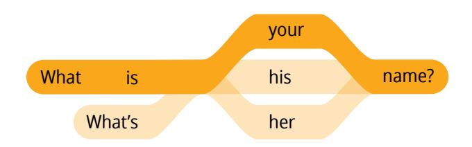
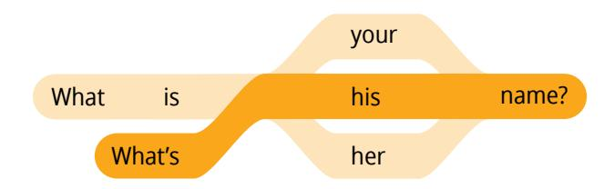
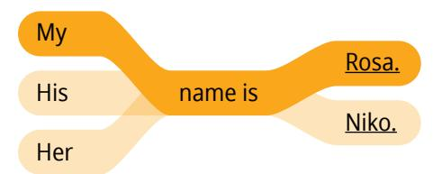
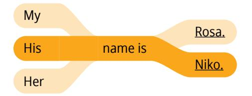
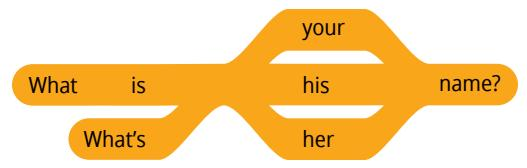
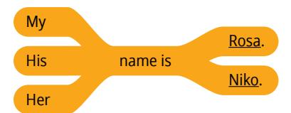
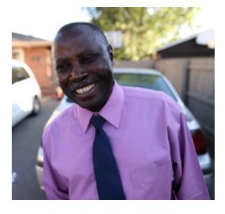
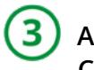
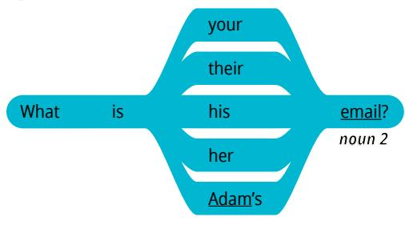
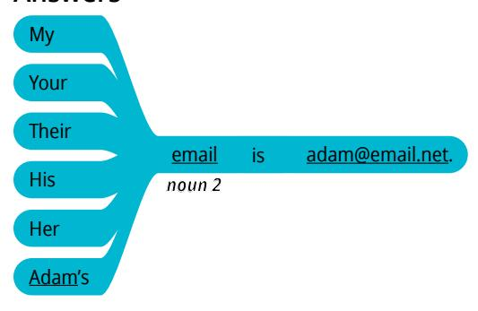

**PARA LOS ALUMNOS**

# EnglishConnect 1 para los alumnos

© 2023 by Intellectual Reserve, Inc. All rights reserved. Versión: 6/21 Traducción de *EnglishConnect 1 for Learners* Spanish PD60013491 002 Printed in the United States of America

# **Contenido**

| Introducción                               |     |
|--------------------------------------------|-----|
| Introducción .                             | V   |
| Registro de estudio personal .             | X   |
| Unidad 1: Introducing Myself               |     |
| Lecciones 1–5                              |     |
| Unidad 1: Introduction .                   | 1   |
| Lección 1: Introductory Lesson .           | 3   |
| Lección 2: Greetings and Introductions .   | 9   |
| Lección 3: Personal Information            | 15  |
| Lección 4: Hobbies and Interests           | 21  |
| Lección 5: Hobbies and Interests           | 27  |
| Unidad 1: Conclusion                       | 34  |
| Unidad 2: Describing Family and Things     |     |
| Lecciones 6–9                              |     |
| Unidad 2: Introduction                     | 35  |
| Lección 6: Family                          | 37  |
| Lección 7: Family                          | 45  |
| Lección 8: Everyday Common Items           | 51  |
| Lección 9: Clothing and Colors             | 57  |
| Unidad 2: Conclusion                       | 63  |
| Unidad 3: Talking About My Day             |     |
| Lecciones 10–13                            |     |
| Unidad 3: Introduction                     | 65  |
| Lección 10: Daily Routines                 | 67  |
| Lección 11: My Activities                  | 75  |
| Lección 12: Time and Calendar              | 81  |
| Lección 13: Weather                        | 87  |
| Unidad 3: Conclusion                       | 93  |
| Unidad 4: Describing My Job and What I Eat |     |
| Lecciones 14–17                            |     |
| Unidad 4: Introduction                     | 95  |
| Lección 14: Jobs and Careers               | 97  |
| Lección 15: Jobs and Careers               | 103 |
| Lección 16: Food                           | 109 |
| Lección 17: Food                           | 117 |
| Unidad 4: Conclusion                       | 123 |

#### **Unidad 5: Describing My Home**

| Lecciones 18–21                                    |     |
|----------------------------------------------------|-----|
| Unidad 5: Introduction                             | 125 |
| Lección 18: Food                                   | 127 |
| Lección 19: Money                                  | 133 |
| Lección 20: Home                                   | 141 |
| Lección 21: Home                                   | 147 |
| Unidad 5: Conclusion                               | 152 |
| Unidad 6: Talking About My Health and My Community |     |
| Lecciones 22–25                                    |     |
| Unidad 6: Introduction                             | 153 |
| Lección 22: Community                              | 155 |
| Lección 23: Health                                 | 161 |
| Lección 24: Health                                 | 167 |
| Lección 25: Review                                 | 175 |
| Unidad 6: Conclusion                               | 180 |
| Apéndice                                           |     |
| Vocabulario adicional                              | 181 |
| Juegos para la conversación en grupo               | 184 |
| Questions                                          | 184 |
| Hot Seat                                           | 185 |
| Ball Toss                                          | 185 |
| Dice Game                                          | 186 |
| Give One, Get One                                  | 186 |
| Speculation                                        | 187 |
| Two Truths and One Lie                             | 188 |
| Vocabulary Cards                                   | 188 |
| Bicycle Chain (in-person)                          | 189 |
| Mingle and Share (in person)                       | 189 |
| Glosario de principios de aprendizaje 190          |     |
| Frases para la conversación en grupo               | 194 |
| Orar en inglés                                     | 196 |
|                                                    |     |

# **Introduction**

# Welcome to EnglishConnect!

EnglishConnect reúne a personas que buscan ampliar sus oportunidades mediante el aprendizaje del inglés. Todos venimos de diferentes orígenes y hablamos diferentes idiomas. Quizás tengamos diferentes niveles de conocimientos de inglés, pero juntos podemos lograr nuestros objetivos.

# Why Are You Learning English?

Tener un propósito claro puede ayudarte a mantenerte centrado y motivado. Veamos por qué quieres aprender inglés. ¿Esperas conseguir un trabajo mejor? ¿Necesitas aprender inglés para continuar tu formación académica? Tómate un momento para escribir tus razones para aprender inglés.

Quiero aprender inglés porque:

Aprender inglés puede aumentar tus oportunidades de formación académica, empleo, servicio y amistad. EnglishConnect puede ayudarte a alcanzar tus metas.

# What Is EnglishConnect?

EnglishConnect es un programa singular de aprendizaje de inglés que proporciona La Iglesia de Jesucristo de los Santos de los Últimos Días. EnglishConnect se ha diseñado para ayudarte a desarrollar tus habilidades en el idioma inglés en un ambiente de fe, hermandad y crecimiento. Esto significa que no estarás solo. Aprenderás con otras personas y todos se apoyarán y animarán mutuamente. También podrás aumentar tu fe en que Dios puede ayudarte a aprender.

EnglishConnect incluye varios niveles. EnglishConnect 1 y 2 ayudan a los alumnos a desarrollar habilidades básicas en inglés. EnglishConnect 3 prepara a los alumnos para oportunidades académicas, en particular, BYU–Pathway Worldwide. Puedes obtener más información sobre BYU–Pathway en byupathway.org. Obtén más información sobre EnglishConnect en englishconnect.org.

# What Makes EnglishConnect Unique?

En EnglishConnect desarrollamos habilidades en inglés en un ambiente de fe, hermandad y crecimiento.

## **Faith**

En EnglishConnect aprendemos por el estudio y por la fe. Cada lección comienza con un principio de aprendizaje. Son principios espirituales que nos ayudan a confiar en Dios para aumentar nuestra capacidad de aprender. Tus creencias sobre tu capacidad de aprender tendrán un impacto significativo en tu esfuerzo y tus resultados. Los principios de aprendizaje pueden ayudarte a entender tu verdadero potencial y la capacidad de Dios para ayudarte. Los siguientes son principios que estudiarás:

## **Eres un hijo de Dios**

"Soy un hijo de Dios, con un potencial y un propósito eternos".

(Véanse "Romanos 8:16–17; La Familia: Una Proclamación para el Mundo)

## **Ejercer fe en Jesucristo**

"Jesucristo me puede ayudar a hacerlo todo si ejerzo fe en Él".

(Véanse Filipenses 4:13; Éter 12:27; Moroni 7:33)

## **Asumir la responsabilidad**

"Tengo poder para elegir y soy responsable de mi propio aprendizaje".

(Véanse 2 Nefi 2:14, 16; Doctrina y Convenios 58:27–28)

## **Amarnos y enseñarnos los unos a los otros**

"Puedo aprender del Espíritu Santo a medida que amo, enseño y aprendo con otras personas".

(Véanse Juan 13:34–35; Juan 14:26–27; Doctrina y Convenios 88:77, 88:122–123)

## **Seguir adelante**

"Con la ayuda de Dios, puedo seguir adelante aunque enfrente obstáculos".

(Véanse 2 Nefi 31:20; 2 Nefi 32:9; Doctrina y Convenios 50:41–42)

## **Consultar al Señor**

"Mejoro mi aprendizaje al consultar a Dios a diario sobre mis esfuerzos".

(Véanse Proverbios 3:5–6; Mateo 7:7–8; Alma 37:37)

Los principios de aprendizaje son declaraciones de verdad. Puedes decirte estas declaraciones a ti mismo cuando necesites motivación o ánimo. A medida que apliques estos principios, tu capacidad de aprender aumentará y sabrás que, con la ayuda de Dios, puedes lograr tus metas.

## **Fellowship**

Una parte importante de la experiencia con EnglishConnect es aprender con otras personas. Los grupos de EnglishConnect aman, ayudan y se apoyan unos a otros. Tus reuniones de grupo son un lugar seguro para que puedas practicar hablar y cometer errores. Participar en un grupo de EnglishConnect puede ayudarte a mantenerte motivado y a entablar amistades.

## **Growth**

EnglishConnect es algo más que un programa para aprender inglés. Independientemente de cuál sea tu punto de partida, las experiencias que tendrás te ayudarán a mejorar como alumno. Tendrás oportunidades de hacer lo siguiente:

- Practicar inglés a diario.
- Medir tu progreso.
- Aprender con otras personas.
- Orar a Dios para que te ayude a lograr tus metas.

# What Will I Do in EnglishConnect?

En EnglishConnect estudiarás de forma individual, practicarás conversación en grupo y harás prácticas a diario. Cada lección del manual para los alumnos de EnglishConnect se divide en dos partes: "Estudio personal" y "Grupo de conversación".

## **Personal Study**

La sección "Estudio personal" te prepara para tu grupo de conversación. En "Estudio personal", completas las actividades siguientes:

## **Study the Principle of Learning**

Cada lección incluye un principio de aprendizaje. Son principios espirituales que te ayudan a asociarte con Dios para aprender inglés. Antes de ir a tu grupo de conversación, lee el principio de aprendizaje, medita las preguntas y anota tus ideas.

## **Memorize Vocabulary**

Aprende el significado y la pronunciación de cada palabra y usa el vocabulario para practicar los patrones. También puedes buscar otras palabras de vocabulario que se puedan usar en el patrón.

## **Practice the Patterns**

Comienza memorizando los patrones de frases y luego usa los patrones para crear tus propias preguntas y respuestas. Puedes reemplazar las palabras subrayadas por otras palabras de la lista de vocabulario. Continúa practicando en voz alta hasta que puedas usar los patrones con confianza para hacer y responder preguntas.

## **Conversation Group**

La sección "Grupo de conversación" incluye actividades que usarás para aprender con otras personas. En "Grupo de conversación" completarás las actividades siguientes:

## **Discuss the Principle of Learning (20–30 minutes)**

En tu grupo, lean y analicen el principio de aprendizaje. Esta es una oportunidad para compartir y aprender de los demás.

#### **Activities**

En las actividades 1, 2 y 3, usa el vocabulario y los patrones de frases para entablar una conversación significativa. Las actividades te ayudan a avanzar de la práctica de repetición a crear tus propias conversaciones. Cada actividad te prepara para la siguiente.

## **Activity 1: Practice the Patterns (10–15 minutes)**

En la actividad 1, repasa el vocabulario y los patrones que aprendiste en tu estudio personal. Tu meta es usar los patrones para decir y comprender preguntas y respuestas simples.

## **Activity 2: Create Your Own Sentences (10–15 minutes)**

En la actividad 2, céntrate en usar los patrones para crear tus propias frases. Sé creativo. Tu meta es usar los patrones para crear tantas preguntas y respuestas como puedas.

## **Activity 3: Create Your Own Conversations (15–20 minutes)**

En la actividad 3, practica conversaciones completas en situaciones de la vida real. Tu meta es mantener conversaciones significativas con el inglés que hayas aprendido.

## **Evaluate (5–10 minutes)**

Al final de cada grupo de conversación, evalúa tu progreso con respecto a los objetivos de la lección. Usa el "Registro de estudio personal" para evaluar tu esfuerzo en el estudio personal y fijarte metas para mejorar. Tómate tiempo para celebrar tu progreso y tus esfuerzos.

## **Daily Practice**

Para aprender inglés, debes desarrollar el hábito de la práctica diaria. Además del tiempo que dediques a estudiar, busca formas de reemplazar tus actividades diarias con el inglés. Por ejemplo, cuando escuches música, escúchala en inglés; cuando mires una

película, mírala en inglés o activa los subtítulos en inglés; cuando estés esperando en algún lugar, practica conversaciones en inglés en la mente; cuando ores, di todo lo que puedas en inglés. La clave de la práctica diaria es usar el inglés en tu rutina habitual.

También puedes completar las actividades de las lecciones y las evaluaciones en línea en englishconnect.org/learner/resources y en el *Cuadernos de ejercicios de EnglishConnect*.

A medida que completas las actividades de estudio personal de cada lección y practicas a diario, aprenderás más rápidamente y estarás mejor preparado para tu grupo de conversación. Usa el "Registro de estudio personal" que se incluye al final de esta introducción para hacer el seguimiento de tus esfuerzos y metas.

# Remember This

A medida que completes las actividades de estudio personal de cada lección, practiques inglés a diario y participes activamente en tu grupo de conversación, desarrollarás habilidades de conversación en inglés. Y lo que es más importante: a medida que apliques los principios de aprendizaje y ores para recibir ayuda de Dios, Él te ayudará a alcanzar tus metas actuales y futuras.

# **Registro de estudio personal**

Escribe tu propósito para aprender inglés.

**Propósito: Quiero aprender inglés** porque:

Puedes mejorar tu capacidad para aprender haciendo el seguimiento de tus esfuerzos y fijándote metas para mejorar. Usa el Registro de estudio personal para hacer el seguimiento de tus esfuerzos. Después de cada lección, fíjate una meta simple. Celebra tu progreso; cada esfuerzo te acerca más a tu meta.

Esfuerzo mínimo

Esfuerzo moderado

Esfuerzo significativo

| Lección | principio de aprendizaje Estudiar el | Memorizar el vocabulario | Practicar los patrones | Practicar a diario | Mi meta                                                                           |
|---------|--------------------------------------------|-----------------------------|---------------------------|-----------------------|-----------------------------------------------------------------------------------|
| Ejemplo |                                            |                             |                           |                       | Cuando ore, usaré nuevas palabras de vocabulario en inglés.                    |
| 1       |                                            |                             |                           |                       | Leer la Introducción. Completar la sección "Estudio personal" de la lección 2. |
| 2       |                                            |                             |                           |                       |                                                                                   |
| 3       |                                            |                             |                           |                       |                                                                                   |
| 4       |                                            |                             |                           |                       |                                                                                   |
| 5       |                                            |                             |                           |                       |                                                                                   |
| 6       |                                            |                             |                           |                       |                                                                                   |
| 7       |                                            |                             |                           |                       |                                                                                   |
| 8       |                                            |                             |                           |                       |                                                                                   |
| 9       |                                            |                             |                           |                       |                                                                                   |

| Lección | principio de aprendizaje Estudiar el | Memorizar el vocabulario | Practicar los patrones | Practicar a diario | Mi meta |
|---------|--------------------------------------------|-----------------------------|---------------------------|-----------------------|---------|
| 10      |                                            |                             |                           |                       |         |
| 11      |                                            |                             |                           |                       |         |
| 12      |                                            |                             |                           |                       |         |
| 13      |                                            |                             |                           |                       |         |
| 14      |                                            |                             |                           |                       |         |
| 15      |                                            |                             |                           |                       |         |
| 16      |                                            |                             |                           |                       |         |
| 17      |                                            |                             |                           |                       |         |
| 18      |                                            |                             |                           |                       |         |
| 19      |                                            |                             |                           |                       |         |
| 20      |                                            |                             |                           |                       |         |
| 21      |                                            |                             |                           |                       |         |
| 22      |                                            |                             |                           |                       |         |
| 23      |                                            |                             |                           |                       |         |
| 24      |                                            |                             |                           |                       |         |
| 25      |                                            |                             |                           |                       |         |

# Study Suggestions

Valora la posibilidad de usar las sugerencias siguientes para mejorar tu estudio.

## **Study the Principle of Learning**

- 1. **Orar.** Comienza y termina tu estudio con una oración. Pide a Dios que te ayude a comprender y aplicar el principio.
- 2. **Escuchar al Espíritu.** Presta atención a tus pensamientos y sentimientos, aun cuando no parezca que estén relacionados con lo que estés leyendo. Anota tus pensamientos y sentimientos. Haz lo que el Espíritu te invite a hacer.
- 3. **Anotar palabras o frases inspiradoras.** Quizás encuentres palabras y frases que te resulten relevantes personalmente y que te inspiren y motiven. Anótalas en un lugar donde puedas verlas. Colócalas en el espejo o en el teléfono.
- 4. **Poner en práctica el principio de aprendizaje.** Piensa en cómo puedes poner en práctica el principio de aprendizaje, las citas y las Escrituras en tu vida. Anota lo que aprendas a medida que pones en práctica el principio de aprendizaje.
- 5. **Leer más.** Lee las Escrituras o los discursos de la conferencia relacionados con el principio de aprendizaje.
- 6. **Aprender vocabulario nuevo.** Elige algunas palabras del principio de aprendizaje que desees aprender en inglés. Busca las palabras y habla con otros participantes sobre lo que significan las palabras y frases para ellos.

#### **Memorize Vocabulary**

- 1. **Centrarte en el significado y la pronunciación.** Repite la palabra en voz alta y piensa en su significado. Aprende la pronunciación de cada palabra y practica hasta que la pronuncies correctamente. Continúa hasta que puedas decir la palabra con confianza y sepas lo que significa.
- 2. **Practicar con tarjetas de memorización.** Usa tarjetas de notas (o una aplicación) para crear tarjetas de memorización. Escribe la palabra en un lado y una definición, una traducción o un dibujo en el otro. La repetición es fundamental para memorizar el vocabulario.
- 3. **Practicar palabras en frases.** Practica decir la palabra que estás aprendiendo en una frase. Puedes usar los patrones de frases para practicar las palabras que estás aprendiendo.
- 4. **Aplicar la palabra.** Piensa en situaciones en las que podrías usar la palabra en tu vida cotidiana. Practica esa situación hasta que te resulte natural usarla. Cuando vayas al trabajo, a la escuela, a las tiendas o a otros lugares, usa las palabras en la mente para describir las cosas.
- 5. **Fijarte en las palabras.** Busca y escucha nuevas palabras a medida que avanza el día. Puedes aprender de películas, programas de televisión, libros, pódcast o canciones. Anota las palabras nuevas.
- 6. **Aprender más.** Usa un diccionario para aprender más sobre palabras nuevas. Aprende definiciones, partes del habla, partes de las palabras, pronunciación y frases de ejemplo.

7. **Repasar.** Dedica tiempo a repasar periódicamente las palabras que hayas aprendido en el pasado. Esto te ayudará a darte cuenta de cuánto has aprendido y a no olvidar palabras.

## **Practice the Patterns**

- 1. **Centrarte en el significado y la fluidez.** Repite una frase del patrón en voz alta y piensa en su significado. Continúa hasta que puedas decir la frase con fluidez y confianza y sepas lo que significa.
- 2. **Grabarte.** Grábate mientras haces preguntas y las respondes en tu teléfono. Escucha la grabación y presta atención a tu fluidez y pronunciación.
- 3. **Practicar con un compañero.** Practica el uso de los patrones para hacer y responder preguntas con un amigo. Puedes practicar en persona o por teléfono. Practica el uso de los patrones al escribir mensajes a un amigo.
- 4. **Pensar y hablar sobre los patrones.** ¿Qué observas acerca de la estructura del inglés? ¿Qué similitudes tiene el inglés con tu idioma? ¿En qué se diferencia el inglés de tu idioma? ¿Cómo podrías utilizar el patrón de una lección en una situación diferente?
- 5. **Usar otros recursos.** Los libros de gramática, las aplicaciones, los sitios web y otros alumnos pueden ayudarte a aprender más sobre los patrones gramaticales del inglés.
- 6. **Fijarte en los patrones.** Busca y escucha los patrones que estás aprendiendo cuando leas o escuches inglés.

## **Practice Daily**

- 1. **Establecer una rutina.** Planifica cuándo y dónde estudiarás cada día y hazlo. Para ayudarte a recordar, escribe tu meta en una declaración de estilo "cuando". Por ejemplo: "Cuando , ". Estos son algunos ejemplos: "Cuando voy en el autobús, repaso el vocabulario"; "Cuando preparo la cena, describo en inglés lo que estoy haciendo"; y "Cuando oro, digo todo lo que puedo en inglés".
- 2. **Realizar actividades diarias en inglés.** Busca formas de reemplazar tu idioma nativo por el inglés en tus actividades diarias. Por ejemplo, cuando escuches música, escúchala en inglés. Otras ideas: mira películas en inglés o con subtítulos en inglés, cambia la configuración del teléfono a inglés y lee las Escrituras en inglés.
- 3. **Leer.** Lee en inglés todo lo que puedas. Lee las Escrituras, los discursos de las conferencias generales, revistas, blogs, noticias y otra información en inglés.
- 4. **Escuchar.** Escucha activamente todo lo que puedas. Escucha pódcast, las Escrituras, discursos, presentaciones, videos, programas de televisión o películas.
- 5. **Conversar.** Busca amigos, familiares y compañeros de trabajo y practica hablar con ellos. Cuéntales lo que has estado aprendiendo y haciendo para practicar inglés. Crea un chat grupal y envía notas de voz.
- 6. **Escribir.** Busca oportunidades de escribir en inglés. Comienza a escribir un diario o crea un chat grupal. Usa las frases y el vocabulario que estás aprendiendo.
- 7. **Completar las actividades de las lecciones.** Realiza las actividades de las lecciones y las evaluaciones en línea en englishconnect.org o en el *Cuaderno de ejercicios de EnglishConnect*.

#### **UNIT 1: INTRODUCTION**

# **Introducing Myself**

## **Objectives**

I will learn to:

- Introduce myself and others.
- Ask about personal information.
- Describe my hobbies and interests.
- Apply principles of learning by study and by faith.

## Lessons

Lesson 1: Introductory Lesson

Lesson 2: Greetings and Introductions

Lesson 3: Personal Information

Lesson 4: Hobbies and Interests

Lesson 5: Hobbies and Interests

#### **LESSON 1**

# **Introductory Lesson**

¡Te damos la bienvenida a EnglishConnect! Nos alegra mucho que estés aquí. Somos una comunidad de personas que buscamos ampliar nuestras oportunidades mediante el aprendizaje del inglés. Quizás tengamos diferentes orígenes, hablemos en diferentes idiomas y tengamos diferentes niveles de conocimientos de inglés, pero juntos podemos lograr nuestros objetivos.

EnglishConnect es diferente de la mayoría de los programas de aprendizaje de inglés. EnglishConnect se ha diseñado para ayudarte a desarrollar tus

habilidades en el idioma inglés en un ambiente de fe, hermandad y crecimiento. Esto significa que no estarás solo. Las personas de tu grupo de EnglishConnect se apoyarán y animarán unas a otras. Esto también significa que pondrás en práctica principios espirituales de aprendizaje a medida que estudias y aprendes.

En esta lección presentaremos el proceso que seguirás en cada lección en tu estudio personal y en tu grupo de conversación.

¡Empecemos!

## Conversation Group

OBJETIVO: APRENDERÉ A PRESENTARME A MÍ MISMO Y A PRESENTAR A OTRAS PERSONAS.

## **Discuss the Principle of Learning: You Are a Child of God**

(10–20 minutes)

Cada lección de este manual comienza con un principio de aprendizaje. Estos son principios espirituales que pueden ayudarte a mejorar tu aprendizaje a por medio del estudio y de la fe. En cada lección haremos lo siguiente:

- Leer el principio de aprendizaje en voz alta.
- Analizar las preguntas.

## **Eres un hijo de Dios**

¿Sabías que una de las cosas más importantes que puedes hacer para lograr una meta es enfocarte en lo que crees sobre ti mismo? Tus creencias sobre tu capacidad tendrán un impacto significativo en tu esfuerzo y tus resultados. Es posible que dudes de

tus capacidades debido a errores anteriores, ¡pero la buena noticia es que puedes cambiar esas creencias! Cuando cambias lo que crees sobre ti mismo, puedes cambiar tus resultados. El poder de cambiar tus creencias sobre ti mismo proviene del hecho de comprender tu verdadera naturaleza.

Eres un hijo de Dios y Él te ama. Como Su hijo, tienes un potencial y un propósito eternos. Tienes la capacidad de aprender y cambiar, y tienes la capacidad de crecer y mejorar. Dios desea ayudarte a que progreses y quiere colaborar contigo para ayudarte a alcanzar tu potencial. Colaborar con Dios para aprender inglés te ayudará a conocerlo mejor a Él y Él también te ayudará a conocerte mejor.

Puedes orar a Dios; Él te escuchará. Puedes pedirle que te ayude a aprender inglés y puedes darle las gracias por tus bendiciones. Cuando ores, presta atención a tus pensamientos y sentimientos. Puedes saber que Dios está ahí, que te ama y quiere ayudarte. Puedes elegir creer que eres un hijo de Dios con un potencial eterno y buscar Su ayuda para aprender inglés.

## **Ponder**

- ¿Cómo influye en lo que crees sobre ti mismo el saber que eres un hijo de Dios?
- ¿Cómo puede ayudarte a aprender inglés el saber que eres un hijo de Dios?

## **Part 1: Repasa la lista de vocabulario con un compañero.**

*Cuando aprendas vocabulario, enfócate en el significado y la pronunciación de cada palabra.*

| I/my              | yo/mi                   |
|-------------------|-------------------------|
| you/your          | tú/tus                  |
| he/his            | él/su (de él)           |
| she/her           | ella/su (de ella)       |
|                   |                         |
| no                | no                      |
| yes               | sí                      |
|                   |                         |
| name              | nombre                  |
| please            | por favor               |
| thank you/thanks  | gracias a ti/gracias    |
|                   |                         |
| What is … ?       | ¿Qué es…?/¿Cómo…?       |
| Nice to meet you. | Es un placer conocerte. |

## **Part 2: Practica el patrón 1 con un compañero.**

*Practica los patrones con un compañero. Tu objetivo es hacer y responder preguntas con seguridad en ti mismo y comprender lo que se dice.*

#### **Practica hacer preguntas.**

*Crea todas las preguntas que puedas.*

#### *Example 1*

What is your name?

## *Example 2*

What's his name?

#### **Practica responder preguntas.**

*Crea todas las respuestas que puedas. Puedes reemplazar las palabras subrayadas por tus propias palabras.*

#### *Example 1*

My name is Rosa.

#### *Example 2*

His name is Niko. **EC1 Answers - Highlighted**

#### **Practica una conversación usando los patrones.**

*Haz y responde preguntas usando los patrones.*

#### **Questions**

### **Answers**

#### *Example*

A: Hi! What is your name?

.

B: Hello! My name is

A: Nice to meet you.

B: What's your name?

A: My name is .

B: Nice to meet you.

A: What's her name?

B: Her name is Rosa.

## **Activity 2: Create Your Own Sentences**

**(5–10 MINUTES)**

*El propósito de esta actividad es que uses los patrones y el vocabulario para crear tus propias oraciones.*

Fíjate en las ilustraciones. Haz y responde preguntas sobre el nombre de cada persona. Tomen turnos.

## **Example: Talia**

A: What's her name?

B: Her name is Talia.

#### **Marco Nat**

## **Activity 3: Create Your Own Conversations**

**(10–15 MINUTES)**

*El propósito de esta actividad es entablar una conversación en inglés.*

### **Part 1**

Conoce a tu grupo. Pregunta el nombre de cada alumno de tu grupo. Sé creativo. Usa todas las palabras que conozcas.

#### **Example**

A: Hi, what's your name?

B: My name is Mei. What is your name?

A: My name is Sione. Nice to meet you.

B: Nice to meet you. Goodbye.

A: Bye!

## **Part 2**

Busca un compañero y preséntalo a tu grupo.

#### **Example**

A: Hi, what's her name?

B: Her name is Luna. What is his name?

A: His name is Seth.

#### **Evaluate**

(5–10 minutes)

*Eres hijo de Dios y tienes un potencial ilimitado para aprender y crecer. Puedes descubrir cómo mejorar si evalúas, con espíritu de oración, tu desempeño y esfuerzo. Después de cada lección, evalúa tu progreso en el logro de cada objetivo. Luego, evalúa tus esfuerzos con tu "Registro de estudio personal" y elige una manera de mejorar antes de la siguiente lección.*

Evalúa tu progreso con los objetivos y tus esfuerzos por practicar inglés a diario.

## **Evaluate Your Progress**

I can:

• Say my name and others' names.

• Say hello and goodbye.

• Understand how EnglishConnect can help me learn English.

## **Evaluate Your Efforts**

Usa el "Registro de estudio personal" que se encuentra en la introducción para evaluar tus esfuerzos y fijar una meta.

Comparte tu meta con un compañero.

## **Prepararse para la próxima lección**

**(5 MINUTES)**

Dios siempre está dispuesto a apoyarnos y también espera que hagamos todo lo que podamos. Te beneficiarás de todos los esfuerzos posibles que hagas por prepararte para la lección. Estas son tres cosas que debes hacer en cada lección antes de asistir a tu grupo de conversación:

- Estudiar el principio de aprendizaje.
- Memorizar el vocabulario.
- Practicar los patrones.

Puedes encontrar estas tres cosas en la sección "Estudio personal", al comienzo de cada lección. Recuerda que debes estudiar y practicar a diario.

## **Act in Faith to Practice English Daily**

*Al final de cada lección hay una sección titulada "Actuar con fe para practicar inglés a diario". Dedica un minuto a leer la cita en voz alta con tu grupo.*

"Cada uno de nosotros tiene un potencial divino porque cada uno es un hijo de Dios; cada uno es igual ante Su vista. Las implicaciones de esta verdad son profundas" (Russell M. Nelson, "Que Dios prevalezca", *Liahona*, noviembre de 2020, pág. 94).

**LESSON 2**

# **Greetings and Introductions**

**OBJETIVO: APRENDERÉ A SALUDAR A LOS DEMÁS Y DECIR DE DÓNDE PROVIENE ALGUIEN.**

# Personal Study

Prepárate para tu grupo de conversación y completa las actividades A–E.

## **Study the Principle of Learning: Exercise Faith in Jesus Christ**

*Jesus Christ can help me do all things as I exercise faith in Him.*

Jesucristo es el Hijo de Dios. Dios envió a Jesús para enseñarnos y ayudarnos. Jesús nos enseña a vivir fieles a nuestro potencial como hijos de Dios. Jesús tiene poder para ayudarnos a superar nuestras debilidades y nuestros desafíos. Él nos enseñó:

"Si tuviereis fe como un grano de mostaza, diréis a este monte: Pásate de aquí allá, y se pasará; y nada os será imposible" (Mateo 17:20).

Es posible que creas que aprender inglés es una enorme montaña, una tarea imposible, pero a medida que ejerzas aunque sea solamente un poco de fe en Jesucristo, tu fe crecerá, y tu fe creciente en Él te ayudará a superar tus desafíos.

## **Ponder**

- ¿Cuáles son algunos de los desafíos que podrías enfrentar al aprender inglés?
- ¿De qué maneras puedes aumentar tu fe en Jesucristo?

## **Memorize Vocabulary**

Aprende el significado y la pronunciación de cada palabra antes de ir a tu grupo de conversación. Dios te ayudará a recordar lo que estás aprendiendo si haces todo lo posible por estudiar.

| I                 | yo                      |
|-------------------|-------------------------|
| you               | tú                      |
| we                | nosotros                |
| they              | ellos/ellas             |
| he                | él                      |
| she               | ella                    |
| I am/I'm          | yo soy/estoy            |
| you are           | tú eres/estás           |
| we are            | nosotros somos/estamos  |
| they are          | ellos/ellas son/están   |
| he is             | él es/está              |
| she is            | ella es/está            |
| How are you?      | ¿Cómo estás?            |
| Nice to meet you. | Es un placer conocerte. |
|                   |                         |
| country           | país                    |
| what              | qué                     |
| where             | dónde                   |

## **Adjectives**

| fine | bien |
|------|------|
| OK   | bien |

## **Nouns**

| Japan  | Japón  |
|--------|--------|
| Kenya  | Kenia  |
| Mexico | México |

## **Practice Pattern 1**

El inglés tiene muchos patrones. Con un patrón y unas cuantas palabras de vocabulario, ¡puedes crear docenas de oraciones! Practica el uso de los patrones hasta que puedas hacer y responder preguntas con confianza. Puedes reemplazar las palabras subrayadas por palabras de la sección "Memorize Vocabulary".

Q: How are you? A: I'm (*adjective*), thanks.

## **Questions**

How are you?

## **Answers**

*adjective* I'm fine, thanks.

## **Examples**

Q: How are you? A: I'm fine, thanks.

Q: Hi, how are you? A: I'm OK, thanks.

## **Practice Pattern 2**

Practica el uso de los patrones hasta que puedas hacer y responder preguntas con confianza. Si algo te resulta confuso, ora para pedir ayuda y sigue trabajando en ello. Dios te ayudará.

Q: Where are you from? A: I'm from (*noun*).

### **Questions**

#### **Answers**

#### **Examples**

Q: Where are you from? A: I'm from Mexico.

Q: Where are they from? A: They are from Japan.

Q: Where is she from? A: She is from Kenya.

## **Use the Patterns**

Escribe cuatro preguntas que puedas hacerle a alguien. Escribe la respuesta a cada pregunta. Léelas en voz alta.

## **Additional Activities**

Completa las actividades de la lección y las evaluaciones en línea en englishconnect.org/ learner/resources o en el *Cuaderno de ejercicios de EnglishConnect 1*.

## **Act in Faith to Practice English Daily**

*Necesitas practicar de manera constante y diaria para hablar un nuevo idioma. Tener una meta te puede resultar útil. No es necesario que tu meta sea complicada; de hecho, las metas simples suelen resultar más eficaces porque ayudan a desarrollar el hábito de practicar inglés cada día.*

Continúa practicando inglés a diario. Usa tu "Registro de estudio personal", repasa tu meta de estudio y evalúa tus esfuerzos.

# Conversation Group

## **Discuss the Principle of Learning: Exercise Faith in Jesus Christ**

(20–30 minutes)

- Lean el principio de aprendizaje de esta lección en voz alta.
- Analicen las preguntas.

Repasa la lista de vocabulario con un compañero.

Practica el patrón 1 con un compañero:

- Practica hacer preguntas.
- Practica responder preguntas.
- Practica una conversación usando los patrones.

Repite con el patrón 2.

#### **Part 1**

Preséntate a un compañero. Tomen turnos. Cambia de compañero y vuelve a practicar.

#### **Example**

- A: Hi! How are you?
- B: I'm OK, thanks.
- A: My name is . I'm from . What's your name?
- B: My name is . I'm from .

## **Part 2**

Fíjate en las ilustraciones. y haz y responde preguntas sobre cada persona. Tomen turnos.

#### **Example: Talia, Samoa**

- A: What's her name?
- B: Her name is Talia.
- A: Where is she from?
- B: She is from Samoa.

**Image 1: Marco, Italy**

**Image 2: Nat, Canada**

**Image 3: Sam, Mexico**

**Activity 3: Create Your Own Conversations**

**(15–20 MINUTES)**

Hagan dramatizaciones. El compañero A elige ser una persona de la lista y el compañero B hace preguntas para conocer mejor al compañero A. Intercámbiense los roles.

- Greta, Germany
- Louis, France
- Ji Hoon, Korea
- Li Min, China
- Luna, Peru
- Pia, Chile
- Dima, Russia
- Avi, India
- Kisi, Ghana

### **Example**

A: Hi! How are you?

B: I'm fine, thanks.

A: My name is Avi. What's your name?

B: My name is Kisi. I'm from Ghana. Where are you from?

A: I'm from India. Nice to meet you, Kisi.

#### **Evaluate**

(5–10 minutes)

Evalúa tu progreso con los objetivos y tus esfuerzos por practicar inglés a diario.

#### **Evaluate Your Progress**

I can:

• Greet someone and ask how they are.

• Introduce myself and say where I'm from.

• Ask people's names and where they are from.

#### **Evaluate Your Efforts**

Usa el "Registro de estudio personal" que se encuentra en la introducción para evaluar tus esfuerzos y fijar una meta.

Comparte tu meta con un compañero.

## **Act in Faith to Practice English Daily**

"*Comiencen hoy* a aumentar su fe. Mediante su fe, Jesucristo aumentará la capacidad de ustedes para mover los montes que haya en su vida [véase 1 Nefi 7:12], aunque sus desafíos personales puedan ser tan grandes como el monte Everest" (Russell M. Nelson, "Cristo ha resucitado; la fe en Él moverá montes", *Liahona*, mayo de 2021, págs. 102–103).

**LESSON 3**

# **Personal Information**

**OBJETIVO: APRENDERÉ A HACER Y RESPONDER PREGUNTAS SOBRE INFORMACIÓN PERSONAL.**

## Personal Study

Prepárate para el grupo de conversación y completa las actividades A–E.

## **Study the Principle of Learning: Take Responsibility**

*I have the power to choose, and I am responsible for my own learning.*

Eres un hijo de Dios con poder para elegir y actuar por ti mismo. Este poder se llama albedrío. Lehi, un profeta del Libro de Mormón, nos enseña que no somos como piedras, a la espera de que alguien nos cambie y nos mueva. Somos agentes que podemos decidir por nosotros mismos lo que creemos, lo que hacemos y quiénes llegamos a ser. Lehi enseñó:

"[Dios] ha creado todas las cosas […]; tanto las cosas que actúan como aquellas sobre las cuales se actúa. […] Por lo tanto, el Señor Dios le concedió al hombre que obrara por sí mismo" (2 Nefi 2:14, 16).

Puedes elegir aprender y mejorar. Tu maestro y otros alumnos de tu grupo de conversación pueden ayudarte, pero, en definitiva, tus elecciones son las que más influencia tendrán en tu aprendizaje. Puedes actuar por ti mismo para practicar inglés a diario.

Cuando surjan problemas, busca soluciones. Se te ha dado el albedrío, el poder de Dios para actuar, y puedes asumir la responsabilidad de tu propio aprendizaje.

## **Ponder**

- ¿Qué significa para ti ser un "agente" y asumir la responsabilidad de tu propio aprendizaje?
- ¿Cuáles son las cosas que dificultan el estudio del inglés a diario?
- ¿Qué puedes hacer para actuar, y no para que se actúe sobre ti, al estudiar inglés a diario?

## **Memorize Vocabulary**

Aprende el significado y la pronunciación de cada palabra antes de ir a tu grupo de conversación. Intenta usar las nuevas palabras en una conversación o en un mensaje para alguien que sepa inglés.

| their          | su (de ellos/ellas)              |
|----------------|----------------------------------|
| name@email.com | nombre@ correoelectrónico.com |
| @ (at)         | @ (arroba)                       |
| . (dot)        | . (punto)                        |
| When is … ?    | ¿Cuándo es…?                     |

## **Nouns 1**

| anniversary | aniversario |
|-------------|-------------|
| birthday    | cumpleaños  |

## **Nouns 2**

| address      | dirección          |
|--------------|--------------------|
| email        | correo electrónico |
| phone number | número de teléfono |

#### **Days**

| January 1st  | 1 de enero   |
|--------------|--------------|
| February 2nd | 2 de febrero |
| March 3rd    | 3 de marzo   |
| April 4th    | 4 de abril   |
| May 5th      | 5 de mayo    |
| June 6th     | 6 de junio   |

En el apéndice puedes ver más *numbers*.

En el apéndice puedes ver más *months*.

## **Practice Pattern 1**

Practica el uso de los patrones hasta que puedas hacer y responder preguntas con confianza. Puedes reemplazar las palabras subrayadas por palabras de la sección "Memorize Vocabulary".

Q: When is your (*noun 1*)? A: My (*noun 1*) is (*day*).

#### **Questions**

### **Answers**

## **Examples**

- Q: When is your birthday?
- A: My birthday is July 8th.
- Q: When is his anniversary?
- A: His anniversary is April 3rd.

## **Practice Pattern 2**

Practica el uso de los patrones hasta que puedas hacer y responder preguntas con confianza.

Q: What is your (*noun 2*)? A: My (*noun 2*) is ( ).

### **Questions**

#### **Answers**

## **Examples**

Q: What is your email?

A: My email is adam@email.net.

Q: What is their address?

A: Their address is 1000 Central Parkway.

Q: What is his phone number?

A: His phone number is 706-863-9400.

## **Use the Patterns**

Escribe cuatro preguntas que puedas hacerle a alguien. Escribe la respuesta a cada pregunta. Léelas en voz alta.

Completa las actividades de la lección y las evaluaciones en línea en englishconnect.org/ learner/resources o en el *Cuaderno de ejercicios de EnglishConnect 1*.

## **Act in Faith to Practice English Daily**

Continúa practicando inglés a diario. Usa tu "Registro de estudio personal", repasa tu meta de estudio y evalúa tus esfuerzos.

## Conversation Group

## **Discuss the Principle of Learning: Take Responsibility**

(20–30 minutes)

- Lean el principio de aprendizaje de esta lección en voz alta.
- Analicen las preguntas.

Repasa la lista de vocabulario con un compañero.

Practica el patrón 1 con un compañero:

- Practica hacer preguntas.
- Practica responder preguntas.
- Practica una conversación usando los patrones.

Repite con el patrón 2.

## **Activity 2: Create Your Own Sentences**

**(10–15 MINUTES)**

Fíjate en las ilustraciones y haz y responde preguntas sobre cada persona. Tomen turnos.

## **Example: Mei**

- Birthday: July 1
- Phone Number: 832-351-9721
- Address: 278 Main Street
- Email: mei@email.net

A: When is Mei's birthday? B: Her birthday is July 1st.

A: What is Mei's email?

B: Her email is mei@email.net.

## **Image 1: Hugo**

- Birthday: October 9
- Phone Number: 919-345-3986
- Address: 620 Oak Road
- Email: hugo@ email.com

## **Image 2: Mari**

- Birthday: August 2
- Phone Number: 208-377-1984
- Address: 966 Sunny Drive
- Email: mari@email.net

## **Image 3: Jean**

• Birthday: March 7

• Phone Number: 356-225-8786

• Address: 22 First Street

• Email: jj@email.com

#### **Image 4: Talia**

• Birthday: January 10

• Phone Number: 660-743-5522

• Address: 1620 Pine Road

• Email: talia5@email.net

## **Activity 3: Create Your Own Conversations**

**(15–20 MINUTES)**

Dramaticen cada situación. Una persona es el compañero A y la otra persona es el compañero B. Intercámbiense los roles.

## **Example**

Situación: El compañero A trabaja en un aeropuerto y el compañero B está registrando su llegada para un vuelo. El compañero A necesita el nombre, la fecha de nacimiento y el número de teléfono del compañero B.

A: Hello! Welcome to the airport. What is your name?

B: My name is Maria.

A: When is your birthday?

B: My birthday is January 2nd.

A: OK. And what is your phone number?

B: My phone number is 208-991-4433.

A: Thank you!

#### **Situation 1:**

El compañero A es médico y el compañero B está en el hospital. El médico necesita el nombre, la fecha de nacimiento, el número de teléfono, la dirección y el correo electrónico del paciente.

## **Situation 2:**

Los compañeros A y B están en una estación de tren. El compañero B inicia una conversación y pide el número de teléfono y el correo electrónico del compañero A.

## **Situation 3:**

El compañero A es el jefe y el compañero B es un nuevo empleado. El jefe necesita el nombre, el número de teléfono, la dirección y el correo electrónico del nuevo empleado.

## **Situation 4:**

El compañero A es el secretario de una universidad y el compañero B es un nuevo alumno que se inscribe en clases en la universidad. El secretario necesita el

nombre, la fecha de nacimiento, la dirección y el correo electrónico del nuevo alumno.

#### **Evaluate**

(5–10 minutes)

Evalúa tu progreso con los objetivos y tus esfuerzos por practicar inglés a diario.

#### **Evaluate Your Progress**

I can:

• Say my birthday, phone number, email, and address.

• Ask for and say someone's birthday, phone number, and address.

#### **Evaluate Your Efforts**

Usa el "Registro de estudio personal" que se encuentra en la introducción para evaluar tus esfuerzos y fijar una meta.

Comparte tu meta con un compañero.

## **Act in Faith to Practice English Daily**

"Las decisiones que tomamos determinan nuestro destino" (Thomas S. Monson, "Decisiones", *Liahona*, mayo de 2016, pág. 86).

**LESSON 4**

# **Hobbies and Interests**

**OBJETIVO: APRENDERÉ A HABLAR SOBRE LO QUE ME GUSTA Y LO QUE NO ME GUSTA.**

# Personal Study

Prepárate para el grupo de conversación y completa las actividades A–E.

## **Study the Principle of Learning: Love and Teach One Another**

*I can learn from the Spirit as I love, teach, and learn with others.*

En EnglishConnect sabemos que Dios es el verdadero maestro y que nos enseña por medio de Su Espíritu. El Espíritu brinda sentimientos de gozo, paz y amor. El Espíritu nos ayuda a comprender la verdad y puede aumentar nuestra capacidad de aprender. Una manera de invitar al Espíritu a estar con nosotros es demostrar amor, enseñar y aprender juntos. El profeta Alma, del Libro de Mormón, tenía la responsabilidad de enseñar al pueblo. Dividió a las personas en grupos y designó un líder para cada grupo. Alma les enseñó:

"El predicador no era de más estima que el oyente, ni el maestro era mejor que el discípulo; y así todos eran iguales" (Alma 1:26).

En EnglishConnect creemos que los maestros y los alumnos tienen la misma importancia. Todos somos maestros y alumnos. Nos respetamos y nos escuchamos los unos a los otros; nos enseñamos los unos a los otros, nos amamos y nos valoramos los

unos a los otros. Felicitamos a los demás cuando tienen éxito y los alentamos cuando cometan errores. También podemos buscar maneras de apoyarnos unos a otros y planificar momentos para practicar entre nosotros durante la semana. Dios nos bendecirá con Su Espíritu conforme aprendemos a amarnos y enseñarnos los unos a los otros.

#### **Ponder**

- ¿Qué puedes hacer para amar y apoyar a aquellos que tienen diferentes habilidades en inglés?
- ¿En qué se diferencia la experiencia de aprendizaje con EnglishConnect de otras experiencias que has tenido antes?

## **Memorize Vocabulary**

Aprende el significado y la pronunciación de cada palabra antes de ir a tu grupo de conversación. Piensa en situaciones en las que podrías usar la palabra en tu práctica diaria.

#### **Verbs**

| bike            | andar en bicicleta |
|-----------------|--------------------|
| cook            | cocinar            |
| dance           | bailar             |
| garden          | cuidar del jardín  |
| go to the beach | ir a la playa      |
| listen to music | escuchar música    |
| paint           | pintar             |
| play sports     | jugar deportes     |
| play the piano  | tocar el piano     |
| read            | leer               |
| run             | correr             |
| shop            | ir de compras      |
| sing            | cantar             |
| sleep           | dormir             |
| study           | estudiar           |
| swim            | nadar              |
| travel          | viajar             |
| watch movies    | ver películas      |

## **Practice Pattern 1**

Practica el uso de los patrones hasta que puedas hacer y responder preguntas con confianza. Puedes reemplazar las palabras subrayadas por palabras de la sección "Memorize Vocabulary".

Q: What do you like to do? A: I like to (*verb*).

### **Questions**

#### **Answers**

## **Examples**

- Q: What do you like to do?
- A: I like to cook.
- Q: What does he like to do?
- A: He likes to dance.

## **Practice Pattern 2**

Practica el uso de los patrones hasta que puedas hacer y responder preguntas con confianza. Intenta comprender las reglas que hay en los patrones. Piensa en cómo el inglés se asemeja o se diferencia de tu idioma.

Q: Do you like to (*verb*)? A: Yes, I like to (*verb*).

## **Questions**

#### **Answers**

## **Examples**

Q: Do you like to travel? A: Yes, I like to travel.

Q: Do you like to shop? A: No, I don't like to shop.

Q: Does she like to paint?

A: Yes, she likes to paint.

## **Use the Patterns**

Escribe cuatro preguntas que puedas hacerle a alguien. Escribe la respuesta a cada pregunta. Léelas en voz alta.

Completa las actividades de la lección y las evaluaciones en línea en englishconnect.org/ learner/resources o en el *Cuaderno de ejercicios de EnglishConnect 1*.

#### **Act in Faith to Practice English Daily**

Continúa practicando inglés a diario. Usa tu "Registro de estudio personal", repasa tu meta de estudio y evalúa tus esfuerzos.

## Conversation Group

## **Discuss the Principle of Learning: Love and Teach One Another**

(20–30 minutes)

- Lean el principio de aprendizaje de esta lección en voz alta.
- Analicen las preguntas.

Repasa la lista de vocabulario con un compañero.

Practica el patrón 1 con un compañero:

- Practica hacer preguntas.
- Practica responder preguntas.
- Practica una conversación usando los patrones.

Repite con el patrón 2.

Fíjate en las ilustraciones y haz y responde preguntas sobre cada persona. Tomen turnos.

### **Example: Malia**

#### **Likes Doesn't Like**

- A: What does Malia like to do?
- B: She likes to paint.
- A: Does Malia like to study?
- B: No, she doesn't like to study.

#### **Image Group 1: Thomas**

#### **Likes Doesn't Like**

### **Image Group 2: Raoul**

**Image Group 3: Mei**

**Likes Doesn't Like**

**Image Group 4: Pamela**

**Likes Doesn't Like**

## **Image Group 5: Nadia**

**Likes Doesn't Like**

## **Activity 3: Create Your Own Conversations**

**(15–20 MINUTES)**

Haz y responde preguntas sobre lo que te gusta y no te gusta hacer. Tomen turnos. Cambia de compañero y vuelve a practicar.

## **Example**

A: What do you like to do?

B: I like to dance.

A: What don't you like to do?

B: I don't like to read.

A: Do you like to listen to music?

B: Yes, I like to listen to music.

#### **Evaluate**

(5–10 minutes)

Evalúa tu progreso con los objetivos y tus esfuerzos por practicar inglés a diario.

#### **Evaluate Your Progress**

I can:

• Say what I like to do.

• Say what I don't like to do.

• Ask what someone likes to do.

#### **Evaluate Your Efforts**

Usa el "Registro de estudio personal" que se encuentra en la introducción para evaluar tus esfuerzos y fijar una meta.

Comparte tu meta con un compañero.

## **Act in Faith to Practice English Daily**

"El Espíritu Santo es el verdadero maestro. Ningún maestro terrenal, independientemente de cuán diestro o experimentado sea, puede reemplazar la función del Espíritu Santo de testificar de la verdad, testificar de Cristo y cambiar corazones; pero todos los maestros pueden ser instrumentos para ayudar a los hijos de Dios a aprender por el Espíritu" ("Enseñar por el Espíritu", *Enseñar a la manera del Salvador: Para todos los que enseñan en el hogar y en la Iglesia*, 2022, pág. 16).

**LESSON 5**

# **Hobbies and Interests**

**OBJETIVO: APRENDERÉ A HABLAR SOBRE EL POR QUÉ A ALGUIEN LE GUSTA HACER O NO HACER ALGO.** 

## Personal Study

Prepárate para el grupo de conversación y completa las actividades A–D.

## **Study the Principle of Learning: Learn by Study and by Faith**

*In EnglishConnect, we rely on God to learn by study and by faith.*

En 1832, a José Smith y algunos de los primeros líderes de La Iglesia de Jesucristo de los Santos de los Últimos Días se les mandó que pusieran en marcha una escuela. Dios quería que ellos aprendieran, progresaran y se prepararan para liderar a otros. Aquel grupo de miembros no tenía títulos universitarios, ni siquiera muchos estudios; no tenían mucho dinero ni recursos. En las Escrituras, Dios les enseñó un patrón de aprendizaje:

"Y por cuanto no todos tienen fe, buscad diligentemente y enseñaos el uno al otro palabras de sabiduría; sí, buscad palabras de sabiduría de los mejores libros; buscad conocimiento, tanto por el estudio como por la fe" (Doctrina y Convenios 88:118).

Dios nos enseña que debemos aprender por medio del estudio y que también debemos aprender por medio de la fe. Hacemos todo lo posible y pedimos a Dios que envíe Su Espíritu para que nos abra

la mente y el corazón para aprender. El Espíritu nos brinda más comprensión de la que podemos desarrollar por nuestra cuenta. Tener un maestro o un libro de texto excelente puede resultar útil, pero Dios puede enseñarnos aunque no tengamos esas cosas. A medida que aprendemos por el estudio y por la fe, Dios puede ayudarnos a aprender más de lo que creíamos posible.

## **Ponder**

- ¿Qué puedes hacer para buscar conocimiento tanto por el estudio como por la fe?
- Piensa en tu experiencia con EnglishConnect. ¿Cómo te ayuda Dios a aprender?

## **Memorize Vocabulary**

Aprende el significado y la pronunciación de cada palabra antes de ir a tu grupo de conversación. Intenta usar las nuevas palabras en una conversación o en un mensaje para alguien que sepa inglés.

| because       | porque          |
|---------------|-----------------|
| Verbs         |                 |
| exercise      | hacer ejercicio |
| learn English | aprender inglés |

En la lección 4 puedes ver más verbs.

play sports hacer deporte

## **Adjectives**

| boring      | aburrido    |
|-------------|-------------|
| cheap       | barato      |
| dangerous   | peligroso   |
| difficult   | difícil     |
| easy        | fácil       |
| exciting    | emocionante |
| expensive   | caro        |
| fun         | divertido   |
| important   | importante  |
| interesting | interesante |
| relaxing    | relajante   |
| tiring      | agotador    |
| useful      | útil        |

## **Practice Pattern 1**

Practica el uso de los patrones hasta que puedas hacer y responder preguntas con confianza. Prueba a decir los patrones en voz alta. Si lo deseas, podrías grabarte. Presta atención a tu pronunciación y fluidez.

Q: What do you like to do?

A: I like to (*verb*).

Q: Why do you like to (*verb*)?

A: I like to (*verb*) because it's (*adjective*).

## **Questions**

#### **Answers**

## **Examples**

Q: Why do you like to sing?

A: I like to sing because it's fun.

Q: Why doesn't she like to cook?

A: She doesn't like to cook because it's difficult.

Q: Why does she like to paint?

A: Because it's relaxing.

| Use the Patterns |
|------------------|
|                  |

## **Additional Activities**

Completa las actividades de la lección y las evaluaciones en línea en englishconnect.org/ learner/resources o en el *Cuaderno de ejercicios de EnglishConnect 1*.

## **Act in Faith to Practice English Daily**

Continúa practicando inglés a diario. Usa tu "Registro de estudio personal", repasa tu meta de estudio y evalúa tus esfuerzos.

# Conversation Group

## **Discuss the Principle of Learning: Learn by Study and by Faith**

(20–30 minutes)

- Lean el principio de aprendizaje de esta lección en voz alta.
- Analicen las preguntas.

Repasa la lista de vocabulario con un compañero.

Practica el patrón 1 con un compañero:

- Practica hacer preguntas.
- Practica responder preguntas.
- Practica una conversación usando los patrones.

Repite con el patrón 2.

**(10–15 MINUTES)**

Utiliza los cuadros. Haz y responde preguntas sobre cada persona. Tomen turnos. Cambia de compañero y vuelve a practicar.

## **Example: Alex**

| Likes        | Why         |
|--------------|-------------|
| swim         | easy        |
| watch movies | interesting |
|              |             |
|              |             |
| Dislikes     | Why         |
| dance        | difficult   |

A: What does Alex like to do?

B: He likes to swim.

A: Why does he like to swim?

B: He likes to swim because it's easy.

A: What doesn't Alex like to do?

B: He doesn't like to dance.

A: Why doesn't he like to dance?

cook difficult

B: He doesn't like to dance because it's difficult.

#### **Chart 1: Katya**

| Likes    | Why       |
|----------|-----------|
| paint    | important |
| garden   | relaxing  |
| Dislikes | Why       |
|          |           |
| run      | tiring    |

## **Chart 2: Dani**

| Likes       | Why   |
|-------------|-------|
| dance       | fun   |
| play sports | cheap |
| Dislikes    | Why   |

| Dislikes | Why       |
|----------|-----------|
| watch TV | boring    |
| travel   | expensive |

## **Chart 3: Suri**

| Likes        | Why       |
|--------------|-----------|
| watch sports | exciting  |
| play sports  | difficult |

| Dislikes | Why       |
|----------|-----------|
| dance    | tiring    |
| run      | difficult |

## **Chart 4: Your Name**

| Likes    | Why |
|----------|-----|
| Dislikes | Why |

## **Activity 3: Create Your Own Conversations**

**(15–20 MINUTES)**

Fíjate en las ilustraciones y haz y responde preguntas sobre la actividad que aparece en cada imagen. Tomen turnos. Cambia de compañero y vuelve a practicar.

### **Example**

- A: Do you like to run?
- B: Yes.
- A: Why do you like to run?
- B: I like to run because it's exciting.

## **Image 1 Image 2**

**Image 3 Image 4**

**Image 5 Image 6**

**Image 7**

#### **Evaluate**

(5–10 minutes)

Evalúa tu progreso con los objetivos y tus esfuerzos por practicar inglés a diario.

#### **Evaluate Your Progress**

I can:

• Say why I like something.

• Say why I don't like something.

#### **Evaluate Your Efforts**

Usa el "Registro de estudio personal" que se encuentra en la introducción para evaluar tus esfuerzos y fijar una meta.

Comparte tu meta con un compañero.

## **Act in Faith to Practice English Daily**

"Por lo general, buscar el aprendizaje por el estudio pone la mente en funcionamiento. Buscar el aprendizaje por la fe pone en funcionamiento tanto el corazón como la mente. Es en el corazón y en la mente donde sentiremos las manifestaciones del Espíritu Santo" (Camille N. Johnson, "Learning by Study and by Faith", *devocional mundial de BYU–Pathway*, octubre de 2021).

#### **UNIT 1: CONCLUSION**

# **Introducing Myself**

¡Has trabajado muy bien en las lecciones de esta unidad! Has aprendido a entablar una conversación y a hablar de tus intereses. En esta unidad aprendiste más de noventa palabras y dieciocho patrones de frases. Con estas palabras y estos patrones, puedes hacer doscientas preguntas y tres mil frases. ¡Increíble!

#### **Evaluate**

## **Evaluate Your Progress**

Tómate un momento para reflexionar y celebrar todo lo que has logrado.

I can:

• Introduce myself and others.

• Ask about personal information.

• Describe my hobbies and interests.

Para seguir realizando el seguimiento de tu progreso, entra en englishconnect.org/ assessments y completa la evaluación opcional de esta unidad.

#### **Evaluate Your Efforts**

Repasa tus esfuerzos en esta unidad en el "Registro de estudio personal". ¿Estás progresando en tu objetivo? ¿Qué puedes hacer de modo diferente para lograr tus metas?

Continúa practicando inglés a diario conforme te preparas para EnglishConnect 2.

Para obtener más información sobre cómo EnglishConnect puede ampliar tus oportunidades, entra en englishconnect.org.

**UNIT 2: INTRODUCTION**

# **Describing Family and Things**

## **Objectives**

I will learn to:

- Describe my family.
- Identify common items.
- Talk about clothing and colors.
- Express likes and dislikes.
- Apply principles of learning by study and by faith.

## Lessons

Lesson 6: Family

Lesson 7: Family

Lesson 8: Everyday Common Items

Lesson 9: Clothing and Colors

**LESSON 6**

# **Family**

**OBJETIVO: APRENDERÉ A HABLAR SOBRE CUÁNTAS PERSONAS HAY EN UNA FAMILIA.**

# Personal Study

Prepárate para tu grupo de conversación y completa las actividades A–E.

## **Study the Principle of Learning: You Are a Child of God**

*I am a child of God with eternal potential and purpose.*

Dios es el Padre de nuestros espíritus, por eso lo llamamos Padre Celestial. Tu Padre Celestial te ama. Quiere que comprendas tu verdadera identidad y tu relación con Él. Dios nos enseña acerca de nuestra verdadera naturaleza por medio de Sus profetas. Pablo, un profeta de la Biblia, enseñó:

"El Espíritu mismo da testimonio a nuestro espíritu de que somos hijos de Dios" (Romanos 8:16).

Las enseñanzas de Pablo se aplican a ti. Recuerda que eres hija o hijo de un amoroso Padre Celestial. Tienes un potencial eterno y Dios tiene un propósito para tu vida. Si se lo pides a Dios, Él puede ayudarte a ver quién eres y quién puedes llegar a ser. Siempre que dudes de tu capacidad para aprender inglés, recuerda que eres un hijo de Dios. Él te ama y desea

ayudarte a crecer y progresar. A medida que ores y pidas Su ayuda, Él te ayudará a aprender.

## **Ponder**

- ¿Cómo describirías la relación entre un padre amoroso y su hijo?
- ¿Cómo influye en tu concepto de ti mismo el saber que tienes un Padre Celestial amoroso?
- ¿Cómo puedes desarrollar tu relación con el Padre Celestial?

## **Memorize Vocabulary**

Aprende el significado y la pronunciación de cada palabra antes de ir a tu grupo de conversación. Piensa en situaciones en las que podrías usar la palabra en tu práctica diaria.

| family                 | familia            |
|------------------------|--------------------|
| have/has               | tienes/tiene       |
| How many … ?           | ¿Cuántos/cuántas…? |
| There are …/There is … | Hay…               |

## **Numbers**

| 1 – one   | 1: uno  |
|-----------|---------|
| 2 – two   | 2: dos  |
| 3 – three | 3: tres |

En el apéndice puedes ver más *numbers*.

## **Nouns**

| husband            | esposo                |
|--------------------|-----------------------|
| wife               | esposa                |
| father (dad)       | padre (papá)          |
| mother (mom)       | madre (mamá)          |
| brother/brothers   | hermano/hermanos      |
| sister/sisters     | hermana/hermanas      |
| child/children     | hijo(a)/hijos e hijas |
| daughter/daughters | hija/hijas            |
| son/sons           | hijo/hijos            |
| boy/boys           | niño/niños            |
| girl/girls         | niña/niñas            |
| person/people      | persona/personas      |

En el apéndice puedes ver más *family nouns*.

## **Practice Pattern 1**

Practica el uso de los patrones hasta que puedas hacer y responder preguntas con confianza. Puedes reemplazar las palabras subrayadas por palabras de la sección "Memorize Vocabulary".

Q: How many (*noun*) are in your family? A: There are (*number*) (*noun*) in my family.

#### Questions

#### **Answers**

## **Examples**

Q: How many people are in <u>Sam</u>'s family? A: There are four people in his family.

Q: How many <u>sisters</u> are in your family? A: There are <u>two sisters</u> in my family.

Q: How many sons are in your family? A: There is one son in my family.

## **Practice Pattern 2**

Practica el uso de los patrones hasta que puedas hacer y responder preguntas con confianza. Intenta usar los patrones en una conversación con un amigo. Podrían hablar o enviarse mensajes.

Q: How many (*noun*) do you have? A: I have (*number*) (*noun*).

### **Questions**

#### **Answers**

#### **Examples**

Q: How many children do you have? A: I have six children.

Q: How many brothers does she have? A: She has three brothers.

|  | Use the Patterns |
|--|------------------|
|--|------------------|

| Escribe cuatro preguntas que puedas hacerle a alguien. Escribe la respuesta a cada pregunta. Léelas en voz alta. |
|------------------------------------------------------------------------------------------------------------------------|
|                                                                                                                        |
|                                                                                                                        |
|                                                                                                                        |
|                                                                                                                        |
|                                                                                                                        |

#### **Additional Activities**

Completa las actividades de la lección y las evaluaciones en línea en englishconnect.org/ learner/resources o en el *Cuaderno de ejercicios de EnglishConnect 1*.

## **Act in Faith to Practice English Daily**

Continúa practicando inglés a diario. Usa tu "Registro de estudio personal", repasa tu meta de estudio y evalúa tus esfuerzos.

# Conversation Group

## **Discuss the Principle of Learning: You Are a Child of God**

(20–30 minutes)

- Lean el principio de aprendizaje de esta lección en voz alta.
- Analicen las preguntas.

Repasa la lista de vocabulario con un compañero.

Practica el patrón 1 con un compañero:

- Practica hacer preguntas.
- Practica responder preguntas.
- Practica una conversación usando los patrones. Repite con el patrón 2.

**(10–15 MINUTES)**

Fíjate en las ilustraciones y haz y responde preguntas sobre cada familia. Di todo lo que puedas. Tomen turnos. Cambia de compañero y vuelve a practicar.

## **New Vocabulary**

who is quién es

## **Example: Yuka**

- A: Who is Yuka?
- B: Yuka is the mother.
- A: How many people are in Yuka's family?
- B: There are six people in her family.

- A: How many children does Yuka have?
- B: She has three children.
- A: How many daughters does Yuka have?
- B: She has two daughters.
- A: How many sons are in her family?
- B: She has one son.

**Image 1: Kalani Image 2: Akin**

#### **Image 3: Betty**

## **Activity 3: Create Your Own Conversations**

**(15–20 MINUTES)**

Haz y responde preguntas sobre las personas de tu familia. Di todo lo que puedas. Tomen turnos. Cambia de compañero y vuelve a practicar.

#### **Example**

- A: How many people are in your family?
- B: There are six people in my family.
- A: How many sisters do you have?
- B: I have three sisters.
- A: How many children does your sister have?
- B: She has six children.

#### **Evaluate**

(5–10 minutes)

Evalúa tu progreso con los objetivos y tus esfuerzos por practicar inglés a diario.

#### **Evaluate Your Progress**

I can:

• Use family words.

• Say how many people are in my family.

#### **Evaluate Your Efforts**

Usa el "Registro de estudio personal" que se encuentra en la introducción para evaluar tus esfuerzos y fijar una meta.

Comparte tu meta con un compañero.

## **Act in Faith to Practice English Daily**

"Dios es un Padre amoroso en los cielos y ama a Sus hijos perfectamente, incluyéndote a ti. Nos amó antes que nosotros lo amáramos a Él y la evidencia de Su amor se encuentra en todas partes" (*El amor de Dios*, VeniraCristo.org).

**LESSON 7**

# **Family**

**OBJETIVO: APRENDERÉ A HACER Y RESPONDER PREGUNTAS SOBRE LOS MIEMBROS DE LA FAMILIA.**

# Personal Study

Prepárate para tu grupo de conversación y completa las actividades A–E.

## **Study the Principle of Learning: Exercise Faith in Jesus Christ**

*Jesus Christ can help me do all things when I exercise faith in Him.*

Jesucristo es el Hijo de Dios y tiene todo poder. En las Escrituras leemos acerca de un hombre que ejerció fe en Jesucristo. El hijo del hombre estaba muy enfermo y nadie podía ayudarlo. El padre pidió a Jesús que lo sanara y Jesús le dijo:

"Si puedes creer, al que cree todo le es posible. Y de inmediato el padre del muchacho clamó, diciendo: Creo; ayuda mi incredulidad. […] Jesús, tomándole [al niño] de la mano, le enderezó; y se levantó" (Marcos 9:23–24, 27).

Al igual que este hombre, puedes comenzar con la esperanza y la fe que ya tienes, y luego puedes hacer crecer tu fe a través de la oración y el estudio de las Escrituras. También puedes hacer crecer tu fe conforme intentas aprender inglés. Puedes comenzar con lo que ya sabes. Céntrate en lo que puedes hacer en inglés y utilízalo todo lo que puedas. Intenta escuchar, leer, hablar y escribir en inglés todos los días. A medida que actúes con fe para dar lo mejor de ti, Él puede ayudarte para que tu fe crezca.

## **Ponder**

- ¿Cómo puedes ejercer fe en Jesucristo?
- ¿Cómo puedes hacer crecer tu fe al aprender inglés?

## **Memorize Vocabulary**

Aprende el significado y la pronunciación de cada palabra antes de ir a tu grupo de conversación.

| Tell me about … | Háblame de… |
|-----------------|-------------|
| yourself        | ti          |

## **Nouns**

| cousin/cousins* | primo/primos   |
|-----------------|----------------|
| eyes            | ojos           |
| glasses         | lentes (gafas) |
| hair            | cabello        |
| mustache        | bigote         |

## **Adjectives**

| blue    | azul                |
|---------|---------------------|
| brown   | marrón/castaño/café |
| green   | verde               |
| hazel   | pardo               |
|         |                     |
| blonde  | rubio               |
| black   | negro/moreno        |
| gray    | gris                |
| red     | pelirrojo           |
| white   | blanco              |
|         |                     |
| long    | largo               |
| short** | corto               |
| tall    | alto                |
| short*  | bajo                |
| married | casado              |
| single  | soltero             |

\*\* En inglés, la palabra *short* puede referirse a la altura o la longitud.

## **Practice Pattern 1**

Practica el uso de los patrones hasta que puedas hacer y responder preguntas con confianza. Puedes reemplazar las palabras subrayadas por palabras de la sección "Memorize Vocabulary".

A: Tell me about your (*noun*).

B: They have (*adjective*) (*noun*).

### **Requests**

#### **Answers**

## **Examples**

- A: Tell me about your brother.
- B: He has a mustache.
- A: Tell me about your sisters.
- B: They have black hair.
- A: Tell me about your aunt.
- B: She has blue eyes.

## **Practice Pattern 2**

Practica el uso de los patrones hasta que puedas hacer y responder preguntas con confianza. Intenta fijarte en estos patrones durante tu práctica diaria. Cambia de compañero y vuelve a practicar.

Q: Is your (*noun*) (*adjective*)? A: Yes, he is (*adjective*).

#### Questions

#### Answers

## Examples

Q: Is your sister married? A: Yes, she is married.

Q: Are you married? A: No, I am single.

Q: Are your <u>sisters tall?</u> A: No, they are <u>short</u>.

# (E)

## Use the Patterns

Escribe cuatro preguntas que puedas hacerle a alguien. Escribe la respuesta a cada pregunta. Léelas en voz alta.

| Δ             | h | Ы | iti | _ | na | ΙΔ | ctiv | viti | عما |
|---------------|---|---|-----|---|----|----|------|------|-----|
| $\overline{}$ | ш | u | ıLI | u | Ha | _  | LLI  | VIL  |     |

Completa las actividades de la lección y las evaluaciones en línea en englishconnect.org/ learner/resources o en el *Cuaderno de ejercicios de EnglishConnect 1*.

## Act in Faith to Practice English Daily

Continúa practicando inglés a diario. Usa tu "Registro de estudio personal", repasa tu meta de estudio y evalúa tus esfuerzos.

# Conversation Group

## **Discuss the Principle of Learning: Exercise Faith in Jesus Christ**

(20–30 minutes)

- Lean el principio de aprendizaje de esta lección en voz alta.
- Analicen las preguntas.

Repasa la lista de vocabulario con un compañero.

Practica el patrón 1 con un compañero:

- Practica hacer preguntas.
- Practica responder preguntas.
- Practica una conversación usando los patrones.

Repite con el patrón 2.

**(10–15 MINUTES)**

Elige a una persona de uno de los grupos que aparecen a continuación. No le digas a tu compañero qué persona elegiste. Di tres enunciados sobre la persona y tu compañero debe adivinar quién es. Tomen turnos.

#### **New Vocabulary**

| bald     | calvo  |
|----------|--------|
| beard    | barba  |
|          |        |
| curly    | rizado |
| straight | liso   |
|          |        |
| old      | viejo  |
| young    | joven  |

## **Example: Maria**

A: She has blue eyes. She has gray hair. She has glasses.

B: Is it Maria?

A: Yes!

# **Image Group 1 Agnes Maria Harriet Victoria Image Group 2 Mikhail Banoy David Carlos Image Group 3 Gabriela Abeni Mei Clara Image Group 4 Kumar James Dev Paolo**

## **Activity 3: Create Your Own Conversations**

**(15–20 MINUTES)**

Elige tres miembros de la familia. Haz y responde preguntas sobre cada persona. Di todo lo que puedas. Tomen turnos. Cambia de compañero y vuelve a practicar.

## **Example**

A: Tell me about your cousin.

B: My cousin has curly hair. She has blue eyes.

A: Is your cousin tall?

B: Yes, she is tall.

A: Is your cousin married?

B: No, she is single.

#### **Evaluate**

(5–10 minutes)

Evalúa tu progreso con los objetivos y tus esfuerzos por practicar inglés a diario.

#### **Evaluate Your Progress**

I can:

• Describe myself and my family.

• Ask about someone's family.

• Describe someone's family.

#### **Evaluate Your Efforts**

Usa el "Registro de estudio personal" que se encuentra en la introducción para evaluar tus esfuerzos y fijar una meta.

Comparte tu meta con un compañero.

## **Act in Faith to Practice English Daily**

"El Señor no requiere que tengamos una fe *perfecta* para tener acceso a Su poder *perfecto*, pero nos pide que creamos. […] Todas las cosas son posibles a los que creen" (Russell M. Nelson, "Cristo ha resucitado; la fe en Él moverá montes", *Liahona*, mayo de 2021, págs. 102, 104).

**LESSON 8**

# **Everyday Common Items**

**OBJETIVO: APRENDERÉ A USAR** *THIS***,** *THAT***,** *THESE* **Y** *THOSE* **PARA PREGUNTAR SOBRE LO QUE PERTENECE A ALGUIEN.**

# Personal Study

Prepárate para tu grupo de conversación y completa las actividades A–E.

## **Study the Principle of Learning: Press Forward**

*With God's help, I can press forward even when I face obstacles.*

Todos nos enfrentamos a retos en la vida y, a veces, nuestros retos dificultan el logro de nuestros objetivos. Nefi, un profeta y líder del Libro de Mormón, afrontó muchos retos. Dedicó toda su vida a enseñar y servir a su pueblo. Sabía que enfrentarían retos difíciles y quería ayudarlos a perseverar. Nefi enseñó:

"Debéis seguir adelante con firmeza en Cristo, teniendo un fulgor perfecto de esperanza y amor por Dios y por todos los hombres" (2 Nefi 31:20).

Tú también puedes seguir adelante. "Seguir adelante con firmeza en Cristo" significa que puedes seguir intentándolo, confiando en Jesucristo, incluso cuando las cosas sean difíciles. Confía en que Él bendecirá tus esfuerzos, aunque las cosas sean difíciles o cometas errores. Por ejemplo, quizás

notes que cometes errores cuando intentas hablar en inglés o quizás te cueste recordar palabras nuevas. Puedes seguir adelante y seguir practicando cada día, confiando en que Él te ayudará a aprender. Sean cuales sean los desafíos que enfrentes, puedes seguir adelante con fe.

## **Ponder**

- ¿Cómo puedes "seguir adelante" al aprender inglés?
- ¿Qué te ayuda a seguir intentándolo cuando las cosas son difíciles?

## **Memorize Vocabulary**

Aprende el significado y la pronunciación de cada palabra antes de ir a tu grupo de conversación. Intenta crear tarjetas de memorización como ayuda para memorizar nuevas palabras. Puedes usar papel o una aplicación.

| not        | no         |
|------------|------------|
| this/these | este/estos |
| that/those | ese/esos   |

## **Nouns**

| book/books         | libro/libros                               |
|--------------------|--------------------------------------------|
| chair/chairs       | silla/sillas                               |
| clock/clocks       | reloj/relojes (de pared o mesa)         |
| computer/computers | computadora/ computadoras               |
| key/keys           | llave/llaves                               |
| notebook/notebooks | cuaderno/cuadernos                         |
| pen/pens           | bolígrafo/bolígrafos                       |
| pencil/pencils     | lápiz/lápices                              |
| phone/phones       | teléfono/teléfonos                         |
| table/tables       | mesa/mesas                                 |
| wallet/wallets     | billetera/billeteras (cartera/carteras) |
| watch/watches      | reloj/relojes (de pulsera)                 |

## **Practice Pattern 1**

Practica el uso de los patrones hasta que puedas hacer y responder preguntas con confianza. Puedes reemplazar las palabras subrayadas por palabras de la sección "Memorize Vocabulary".

Q: What is this? A: This is a (*noun*).

#### **Questions**

## **Answers**

| This  |     |          |
|-------|-----|----------|
| That  | is  | a watch. |
| These | are | watches. |
| Those |     | noun     |

## **Examples**

Q: What is this? A: This is a watch.

Q: What are these?

A: These are pencils.

## **Practice Pattern 2**

Practica el uso de los patrones hasta que puedas hacer y responder preguntas con confianza. Intenta comprender las reglas que hay en los patrones. Piensa en cómo el inglés se asemeja o se diferencia de tu idioma.

Q: Is this my (*noun*)? A: Yes, it is.

## **Questions**

| Is  | this  | my | book?  |
|-----|-------|----|--------|
| Are | these | my | books? |
|     |       |    | noun   |

### **Answers**

#### **Examples**

Q: Is this your book? A: No, it is not.

Q: Are those her keys? A: Yes, they are.

## **Use the Patterns**

Escribe cuatro preguntas que puedas hacerle a alguien. Escribe la respuesta a cada pregunta. Léelas en voz alta.

## **Additional Activities**

Completa las actividades de la lección y las evaluaciones en línea en englishconnect.org/ learner/resources o en el *Cuaderno de ejercicios de EnglishConnect 1*.

## **Act in Faith to Practice English Daily**

Continúa practicando inglés a diario. Usa tu "Registro de estudio personal", repasa tu meta de estudio y evalúa tus esfuerzos.

# Conversation Group

## **Discuss the Principle of Learning: Press Forward**

(20–30 minutes)

- Lean el principio de aprendizaje de esta lección en voz alta.
- Analicen las preguntas.

Repasa la lista de vocabulario con un compañero.

Practica el patrón 1 con un compañero:

- Practica hacer preguntas.
- Practica responder preguntas.
- Practica una conversación usando los patrones. Repite con el patrón 2.

**(10–15 MINUTES)**

Fíjate en las ilustraciones y haz y responde preguntas sobre los objetos que aparecen en cada imagen. Tomen turnos. Cambia de compañero y vuelve a practicar.

### **Example**

- A: What are those?
- B: Those are books.
- A: Are those your books?
- B: No, they are not my books.

#### **Image 3 Image 4**

#### **Image 5 Image 6**

**Image 7**

 **Activity 3: Create Your Own Conversations**

**(15–20 MINUTES)**

Elige cinco objetos del salón de clases y enséñaselos a tu compañero. Haz y responde preguntas sobre cada objeto. Tomen turnos. Cambia de compañero y vuelve a practicar.

#### **Example**

A: What is that?

B: That is a phone.

A: Is it your phone?

B: Yes, it is.

#### **Evaluate**

(5–10 minutes)

Evalúa tu progreso con los objetivos y tus esfuerzos por practicar inglés a diario.

#### **Evaluate Your Progress**

I can:

• Say what something is.

• Use *this*, *that*, *these*, and *those*.

• Ask if something belongs to someone.

#### **Evaluate Your Efforts**

Usa el "Registro de estudio personal" que se encuentra en la introducción para evaluar tus esfuerzos y fijar una meta.

Comparte tu meta con un compañero.

## **Act in Faith to Practice English Daily**

"No te desanimes. Sigue caminando. Sigue intentándolo. Encontrarás ayuda y felicidad más adelante […]; al final todo saldrá bien. Confía en Dios y cree en las cosas buenas que están por venir" (Jeffrey R. Holland, "Sumo sacerdote de los bienes venideros", *Liahona*, enero de 2000, pág. 38).

**LESSON 9**

# **Clothing and Colors**

**OBJETIVO: APRENDERÉ A DESCRIBIR LA ROPA DE ALGUIEN.**

# Personal Study

Prepárate para tu grupo de conversación y completa las actividades A–E.

## **Study the Principle of Learning: Counsel with the Lord**

*I improve my learning by counseling with God daily about my efforts.*

El aprendizaje es un proceso que se desarrolla a lo largo del tiempo. Dios quiere ayudarte a aprender y crecer; quiere ayudarte a aprender a dar pequeños pasos para lograr grandes cosas. El Libro de Mormón habla de un formidable hombre de fe llamado Alma, quien fue un profeta de Dios y líder de su país. Alma enseñó:

"Por medio de cosas pequeñas y sencillas se realizan grandes cosas […]. Consulta al Señor en todos tus hechos, y él te dirigirá para bien" (Alma 37:6, 37).

Dios trabaja por medio de cosas pequeñas y sencillas. Las pequeñas acciones pueden dar lugar a grandes resultados con el tiempo. Oramos a nuestro Padre Celestial en el nombre de Su Hijo, Jesucristo. A través de la oración y el estudio de las Escrituras, puedes consultar al Señor y Él puede ayudarte a elegir formas pequeñas y sencillas de mejorar. ¿Necesitas mejorar tu comprensión oral? Cuando consultes a Dios en oración, podrías optar por dedicar diez

minutos al día a practicar inglés con un amigo. ¿Tienes dificultades para recordar las palabras nuevas? Cuando consultes a Dios, podrías decidir repasar las palabras cuando vayas en el autobús. Tu esfuerzo constante te aportará "grandes cosas" al aprender inglés.

## **Ponder**

- ¿Hay en tu cultura alguna expresión parecida a las "cosas pequeñas y sencillas"?
- ¿Cómo puedes consultar a Dios acerca de tus esfuerzos?
- ¿Cuáles son las pequeñas cosas que puedes hacer a diario para aprender inglés?

## **Memorize Vocabulary**

Aprende el significado y la pronunciación de cada palabra antes de ir a tu grupo de conversación. Prueba a usar las palabras en tu vida. Piensa en cuándo y dónde podrías usar estas palabras.

| I'm          | Soy/estoy             |
|--------------|-----------------------|
| he's         | él es/está            |
| she's        | ella es/está          |
| they're      | ellos/ellas son/están |
|              |                       |
| wearing      | vestir/llevar         |
| looking for  | buscar                |
|              |                       |
| this/these   | este/estos            |
| that/those   | ese/esos              |
|              |                       |
| clothing     | ropa                  |
| color/colors | color/colores         |
|              |                       |

#### **Nouns**

| coat/coats       | abrigo/abrigos   |
|------------------|------------------|
| dress/dresses    | vestido/vestidos |
| pants            | pantalones       |
| shirt/shirts     | camisa/camisas   |
| shoe/shoes       | zapato/zapatos   |
| skirt/skirts     | falda/faldas     |
| sweater/sweaters | suéter/suéteres  |

#### **Adjectives**

| orange | naranja  |
|--------|----------|
| purple | morado   |
| yellow | amarillo |

En la lección 7 puedes ver más *colors*.

## **Practice Pattern 1**

Practica el uso de los patrones hasta que puedas hacer y responder preguntas con confianza. Puedes reemplazar las palabras subrayadas por palabras de la sección "Memorize Vocabulary".

Q: What are you wearing? A: I'm wearing a (*adjective*) (*noun*).

#### **Questions**

## **Answers**

## **Examples**

Q: What is he wearing?

A: He's wearing a red shirt.

Q: What is she wearing?

A: She's wearing an orange skirt.

Q: What are they looking for?

A: They're looking for black shoes.

## **Practice Pattern 2**

Practica el uso de los patrones hasta que puedas hacer y responder preguntas con confianza.

Q: Do you like this (*adjective*) (*noun*)? A: Yes, I like that (*adjective*) (*noun*).

### **Questions**

## **Answers**

## **Examples**

- Q: Do you like this green sweater?
- A: No, I don't like that green sweater.
- Q: Do you like these red shoes?
- A: Yes, I like those shoes.

## **Use the Patterns**

| Escribe cuatro preguntas que puedas hacerle a         |
|-------------------------------------------------------|
| alguien. Escribe la respuesta a cada pregunta. Léelas |
| en voz alta.                                          |

| Additional Activities |  |
|-----------------------|--|
|-----------------------|--|

Completa las actividades de la lección y las evaluaciones en línea en englishconnect.org/ learner/resources o en el *Cuaderno de ejercicios de EnglishConnect 1*.

#### **Act in Faith to Practice English Daily**

Continúa practicando inglés a diario. Usa tu "Registro de estudio personal", repasa tu meta de estudio y evalúa tus esfuerzos.

# Conversation Group

## **Discuss the Principle of Learning: Counsel with the Lord**

(20–30 minutes)

- Lean el principio de aprendizaje de esta lección en voz alta.
- Analicen las preguntas.

Repasa la lista de vocabulario con un compañero.

Practica el patrón 1 con un compañero:

- Practica hacer preguntas.
- Practica responder preguntas.
- Practica una conversación usando los patrones.

Repite con el patrón 2.

#### **New Vocabulary**

| belt/belts | cinturón/cinturones |
|------------|---------------------|
| sock/socks | calcetín/calcetines |
| suit/suits | traje/trajes        |
| tie/ties   | corbata/corbatas    |

#### **Part 1**

Haz y responde preguntas sobre tu ropa. Tomen turnos. Cambia de compañero y vuelve a practicar.

#### **Example**

- A: What are you wearing?
- B: I'm wearing blue pants, a white shirt, yellow socks, and red shoes.

#### **Part 2**

Fíjate en las ilustraciones y haz y responde preguntas sobre la ropa de cada persona. Di todo lo que puedas. Tomen turnos. Cambia de compañero y vuelve a practicar.

#### **Example: Eliana**

- A: What is Eliana wearing?
- B: She's wearing a gray shirt and black pants.

**Image 1: Nadia Image 2: Obasi**

**Image 1 Image 2**

**Image 3: Mateo Image 4: Hina**

**Image 3 Image 4**

 **Activity 3: Create Your Own Conversations (15–20 MINUTES)**

Hagan una dramatización. El compañero A trabaja en una tienda de ropa y el compañero B está comprando ropa y zapatos. Haz y responde preguntas sobre los objetos que aparecen en cada imagen. Intercámbiense los roles. Cambia de compañero y vuelve a practicar.

**Image 5**

## **Example**

- B: I'm looking for shoes.
- A: Do you like these brown shoes?
- B: No, I don't like those brown shoes.

#### **Evaluate**

(5–10 minutes)

Evalúa tu progreso con los objetivos y tus esfuerzos por practicar inglés a diario.

#### **Evaluate Your Progress**

I can:

• Talk about clothing and colors.

• Say what I and others are wearing.

## **Evaluate Your Efforts**

Usa el "Registro de estudio personal" que se encuentra en la introducción para evaluar tus esfuerzos y fijar una meta.

Comparte tu meta con un compañero.

#### **Act in Faith to Practice English Daily**

"Podemos orar a nuestro Padre Celestial y recibir orientación y dirección […] y ser capaces de lograr cosas que simplemente no podríamos hacer por nosotros mismos. […]

"Oren […]. ¡Y luego, escuchen. Anoten las ideas que acudan a su mente; escriban sus sentimientos y denles seguimiento con las acciones que se les indique tomar" (Russell M. Nelson, "Revelación para la Iglesia, revelación para nuestras vidas", *Liahona*, mayo de 2018, págs. 94–95).

**UNIT 2: CONCLUSION**

# **Describing Family and Things**

¡Bien hecho! ¡Has completado la unidad 2! Ahora puedes conocer a alguien con mayor detalle hablando con esa persona sobre su familia, su ropa y lo que le gusta y no le gusta.

## **Evaluate**

(5–10 minutes)

Tómate un momento para reflexionar y celebrar todo lo que has logrado.

#### **Evaluate Your Progress**

I can:

• Describe myself and my family.

• Identify common items.

• Talk about clothing and colors.

• Express likes and dislikes.

Para seguir realizando el seguimiento de tu progreso, entra en englishconnect.org/ assessments y completa la evaluación opcional de esta unidad.

## **Evaluate Your Efforts**

Repasa tus esfuerzos en esta unidad en el "Registro de estudio personal". ¿Estás progresando en tu objetivo? ¿Qué puedes hacer de modo diferente para lograr tus metas?

Continúa practicando inglés a diario conforme te preparas para EnglishConnect 2.

Para obtener más información sobre cómo EnglishConnect puede ampliar tus oportunidades, entra en englishconnect.org.

**UNIT 3: INTRODUCTION**

# **Talking about My Day**

## **Objectives**

I will learn to:

- Describe my daily routine.
- Describe what I am doing.
- Use days and times to talk about my day.
- Describe the weather.
- Apply principles of learning by study and by faith.

## Lessons

Lesson 10: Daily Routines

Lesson 11: My Activities

Lesson 12: Time and Calendar

Lesson 13: Weather

**LESSON 10**

# **Daily Routines**

**OBJETIVO: APRENDERÉ A HABLAR SOBRE LA RUTINA DIARIA DE ALGUIEN.**

# Personal Study

Prepárate para tu grupo de conversación y completa las actividades A–E.

## **Study the Principle of Learning: You Are a Child of God**

*I am a child of God with eternal potential and purpose.*

Eres hija o hijo de Dios y Él tiene muchas cosas que quiere ayudarte a aprender; Él quiere ayudarte a alcanzar tu potencial eterno, pero, a veces, esto puede parecer imposible. En la Biblia leemos sobre una joven llamada María. Un ángel se le apareció y le dijo que sería la madre de Jesucristo, el Salvador de todos, y que criaría al Hijo de Dios en la tierra como su propio hijo. Tal vez María se sintió abrumada por lo que el Padre Celestial quería que hiciera y llegara a ser, pero el ángel le dijo:

"Porque ninguna cosa es imposible para Dios" (Lucas 1:37).

Con Dios, lo imposible se vuelve posible. María se convirtió en madre del Hijo de Dios. Al igual que sucedió con María, Dios quiere ayudarte a alcanzar tu potencial y cumplir tu propósito en la vida. Ora a Dios, pregúntale qué quiere que hagas y luego actúa según los pensamientos y sentimientos que recibas de Su Espíritu. Él te guiará. Quizá necesites aprender inglés para poder recibir formación académica o mantener a tu familia. Recuerda que "ninguna cosa es imposible para Dios". Con Dios puedes aprender inglés; con Dios puedes alcanzar tu potencial eterno.

## **Ponder**

- ¿Qué crees que Dios quiere que hagas?
- Cuando Dios te invita a hacer cosas que te parecen imposibles, ¿cómo puedes elegir actuar con fe?

## **Memorize Vocabulary**

Aprende el significado y la pronunciación de cada palabra antes de ir a tu grupo de conversación. Intenta utilizar palabras de la sección "Memorize Vocabulary" en tu práctica diaria.

| daily routine | rutina diaria |
|---------------|---------------|
|               |               |

## **Nouns**

| morning   | mañana                            |
|-----------|-----------------------------------|
| afternoon | tarde                             |
| evening   | última hora de la tarde/ noche |

## **Verbs**

| brush my teeth/brushes his teeth  | me cepillo los dientes/se cepilla los dientes |
|--------------------------------------|--------------------------------------------------|
| clean the house/cleans the house  | limpio la casa/limpia la casa                 |
| do my hair/does her hair             | me arreglo el cabello / se arregla el cabello |
| exercise/exercises                   | hago ejercicio/hace ejercicio                 |
| get dressed/gets dressed             | me visto/se viste                                |
| get ready/gets ready                 | me preparo/se prepara                            |
| go to bed/goes to bed                | me voy a la cama/se va a la cama              |
| go to school/goes to school       | voy a la escuela/va a la escuela              |
| go to the store/goes to the store | voy a la tienda/va a la tienda                |
| go to work/goes to work              | voy al trabajo/va al trabajo                     |
| make breakfast/makes breakfast    | preparo el desayuno/ prepara el desayuno      |

| make the bed/makes the bed   | hago la cama/hace la cama |
|---------------------------------|------------------------------|
| shave/shaves                    | me afeito/se afeita          |
| take a shower/takes a shower | me ducho/se ducha            |
| wake up/wakes up                | me despierto/se despierta    |

## **Practice Pattern 1**

Practica el uso de los patrones hasta que puedas hacer y responder preguntas con confianza. Puedes reemplazar las palabras subrayadas por palabras de la sección "Memorize Vocabulary".

Q: Do you (*verb*) in the (*noun*)? A: Yes, I (*verb*) in the (*noun*).

### **Questions**

## **Answers**

## **Examples**

Q: Do you exercise in the morning? A: Yes, I exercise in the morning.

Q: Does she brush her teeth in the evening? A: Yes, she brushes her teeth in the evening.

Q: Do you go to the store in the morning? A: No, I go to the store in the afternoon.

## **Practice Pattern 2**

Practica el uso de los patrones hasta que puedas hacer y responder preguntas con confianza. Intenta fijarte en estos patrones durante tu práctica diaria.

Q: What do you do before you (*verb*)? A: Before I (*verb*), I (*verb*).

### **Questions**

| What do   | you | do | before | you | go to work?   |
|-----------|-----|----|--------|-----|---------------|
| What does | she | do | after  | she | goes to work? |
|           |     |    |        |     | verb          |

#### **Answers**

| Before | I   | go to work,   | I   | get dressed.  |
|--------|-----|---------------|-----|---------------|
| After  | she | goes to work, | she | gets dressed. |
|        |     | verb          |     | verb          |

#### **Examples**

Q: What do you do before you make breakfast? A: Before I make breakfast, I exercise.

Q: What does he do after he gets ready? A: After he gets ready, he goes to the store.

Q: What does she do after she makes breakfast? A: She goes to work.

| Use the Patterns |
|------------------|
|                  |

| Escribe cuatro preguntas que puedas hacerle a alguien. Escribe la respuesta a cada pregunta. Léelas |  |  |
|--------------------------------------------------------------------------------------------------------|--|--|
| en voz alta.                                                                                           |  |  |
|                                                                                                        |  |  |
|                                                                                                        |  |  |
|                                                                                                        |  |  |
|                                                                                                        |  |  |
|                                                                                                        |  |  |
|                                                                                                        |  |  |
|                                                                                                        |  |  |
|                                                                                                        |  |  |

## **Additional Activities**

Completa las actividades de la lección y las evaluaciones en línea en englishconnect.org/ learner/resources o en el *Cuaderno de ejercicios de EnglishConnect 1*.

## **Act in Faith to Practice English Daily**

Continúa practicando inglés a diario. Usa tu "Registro de estudio personal", repasa tu meta de estudio y evalúa tus esfuerzos.

# Conversation Group

## **Discuss the Principle of Learning: You Are a Child of God**

(20–30 minutes)

- Lean el principio de aprendizaje de esta lección en voz alta.
- Analicen las preguntas.

## **Activity 1: Practice the Patterns (10–15 MINUTES)**

Repasa la lista de vocabulario con un compañero.

Practica el patrón 1 con un compañero:

- Practica hacer preguntas.
- Practica responder preguntas.
- Practica una conversación usando los patrones.

Repite con el patrón 2.

# **Activity 2: Create Your Own Sentences**

**(10–15 MINUTES)**

Fíjate en las ilustraciones y haz y responde preguntas sobre la actividad que aparece en cada imagen. Tomen turnos.

### **Example**

- A: Do you brush your teeth in the morning?
- B: Yes, I brush my teeth in the morning.
- A: What do you do after you brush your teeth?
- B: After I brush my teeth, I get dressed.

**Image 1 Image 2**

**Image 3 Image 4**

**Image 5 Image 6**

## **Activity 3: Create Your Own Conversations**

**(15–20 MINUTES)**

## **Part 1**

El compañero A es una persona famosa y el compañero B está entrevistando a esa persona famosa acerca de su rutina diaria. Di todo lo que puedas. Intercambien los roles.

#### **Example**

A: Do you make your bed in the morning?

B: No, I don't make my bed in the morning.

## **Part 2**

Elige tres miembros de la familia. Haz y responde preguntas sobre la rutina diaria de cada persona. Di todo lo que puedas. Tomen turnos. Cambia de compañero y vuelve a practicar.

#### **Example**

A: What does your sister do before she goes to work?

B: Before she goes to work, she does her hair.

#### **Evaluate**

(5–10 minutes)

Evalúa tu progreso con los objetivos y tus esfuerzos por practicar inglés a diario.

#### **Evaluate Your Progress**

I can:

• Say what I do in my daily routine.

• Say what someone does in their routine.

• Ask what someone does in their routine.

#### **Evaluate Your Efforts**

Usa el "Registro de estudio personal" que se encuentra en la introducción para evaluar tus esfuerzos y fijar una meta.

Comparte tu meta con un compañero.

## **Act in Faith to Practice English Daily**

"Averigüen ustedes mismos quiénes son en verdad. Pregunten al Padre Celestial, en el nombre de Jesucristo, cómo se siente Él con respecto a ustedes y su misión en la tierra. Si piden con verdadera intención, con el tiempo, el Espíritu les susurrará verdades que cambian la vida. Escriban esas impresiones, repásenlas a menudo y cíñanse a ellas al pie de la letra.

"Les prometo que, al empezar a atisbar siquiera un destello del modo en que el Padre Celestial los ve y lo que Él confía que ustedes harán por Él, ¡su vida jamás será la misma!" (Russell M. Nelson, *Facebook*, 10 de septiembre de 2019, facebook. com/russell.m.nelson).

**LESSON 11**

# **My Activities**

**OBJETIVO: APRENDERÉ A HABLAR SOBRE LO QUE ALGUIEN ESTÁ HACIENDO EN EL MOMENTO Y SU RUTINA.**

# Personal Study

Prepárate para tu grupo de conversación y completa las actividades A–E.

## **Study the Principle of Learning: Exercise Faith in Jesus Christ**

*Jesus Christ can help me do all things as I exercise faith in Him.*

Nefi era un profeta del Libro de Mormón. Cuando Nefi era más joven, él y sus hermanos recibieron la orden de obtener un libro sagrado. Ese libro era importante porque enseñaba sobre el plan de Dios y la función de Jesucristo. El libro pertenecía a un hombre inicuo llamado Labán. Nefi y sus hermanos intentaron pedírselo, pero Labán les dijo que no. Nefi y sus hermanos intentaron comprarlo, pero Labán les dijo que no y les robó todo su dinero. Tras fracasar dos veces, los hermanos de Nefi se enojaron y quisieron rendirse.

Nefi animó a sus hermanos diciéndoles: "Subamos de nuevo a Jerusalén, y seamos fieles en guardar los mandamientos del Señor, pues he aquí, él es más poderoso que toda la tierra" (1 Nefi 4:1).

La confianza de Nefi en Dios lo ayudó a intentarlo por tercera vez. En esa ocasión, con la ayuda de Dios, pudo conseguir el libro sagrado. La experiencia de

Nefi nos enseña que intentar las cosas y fracasar a veces forman parte de hacer algo difícil. Aprender un nuevo idioma es difícil y hay que invertir cientos de horas. Quizás intentaste aprender inglés con anterioridad y no te fue bien; quizás faltaste a tu reunión semanal o te olvidaste de estudiar. Vuelve a intentarlo cuando fracases. Cuando ejerces fe en Jesucristo, Él puede convertir los fracasos en éxitos.

## **Ponder**

- ¿Cómo podemos ser como Nefi y seguir intentándolo cuando fracasamos?
- ¿Cómo puede nuestra fe en Jesucristo ayudarnos a aprender de nuestros fracasos?

## **Memorize Vocabulary**

Aprende el significado y la pronunciación de cada palabra antes de ir a tu grupo de conversación. Intenta usar las nuevas palabras en una conversación o en un mensaje para alguien que sepa inglés.

| now | ahora |
|-----|-------|
|-----|-------|

## **Verbs/Verbs + ing**

| come home/coming home                      | venir a casa/viniendo a casa                          |
|--------------------------------------------|----------------------------------------------------------|
| do homework/doing homework              | hacer las tareas/haciendo las tareas                  |
| eat dinner/eating dinner                   | cenar/cenando                                            |
| exercise/exercising                        | hacer ejercicio/haciendo ejercicio                    |
| get ready for bed/getting ready for bed | prepararse para la cama/ preparándose para la cama |
| go to bed/going to bed                     | ir a la cama/yendo a la cama                          |
| make lunch/making lunch                    | preparar el almuerzo/ preparando el almuerzo          |
| pray/praying                               | orar/orando                                              |
| relax/relaxing                             | relajar/relajándose                                      |
| take a nap/taking a nap                    | dormir una siesta/ durmiendo una siesta               |
| take a walk/taking a walk                  | dar un paseo/dando un paseo                           |
| visit my friends/visiting my friends    | visitar a mis amigos/ visitando a mis amigos          |
| watch movies/watching movies            | ver películas/viendo películas                        |
| work/working                               | trabajar/trabajando                                      |
|                                            |                                                          |

## **Time**

| morning   | mañana                            |
|-----------|-----------------------------------|
| afternoon | tarde                             |
| evening   | última hora de la tarde/ noche |

## **Practice Pattern 1**

Practica el uso de los patrones hasta que puedas hacer y responder preguntas con confianza.

Q: What are you doing now? A: I am (*verb* + ing).

#### **Questions**

## **Answers**

## **Examples**

- Q: What are you doing now?
- A: I am relaxing.
- Q: What are they doing now?
- A: They are making dinner.
- Q: What is he doing now?
- A: He is visiting his friends.

## **Practice Pattern 2**

Practica el uso de los patrones hasta que puedas hacer y responder preguntas con confianza. Intenta realizar las actividades 1 y 2 del grupo de conversación antes de que tu grupo se reúna.

Q: When do you (*verb*)? A: I (*verb*) in the (*time*).

#### **Questions**

#### **Answers**

#### **Examples**

Q: When do you work? A: I work in the morning.

Q: When do they eat dinner?

A: They eat dinner in the evening.

Q: When does she do homework? A: She does homework in the afternoon.

## **Use the Patterns**

| Escribe cuatro preguntas que puedas hacerle a         |
|-------------------------------------------------------|
| alguien. Escribe la respuesta a cada pregunta. Léelas |
| en voz alta.                                          |

| Ī |  |  |  |
|---|--|--|--|
|   |  |  |  |
|   |  |  |  |

## **Additional Activities**

Completa las actividades de la lección y las evaluaciones en línea en englishconnect.org/ learner/resources o en el *Cuaderno de ejercicios de EnglishConnect 1*.

## **Act in Faith to Practice English Daily**

Continúa practicando inglés a diario. Usa tu "Registro de estudio personal", repasa tu meta de estudio y evalúa tus esfuerzos.

# Conversation Group

## **Discuss the Principle of Learning: Exercise Faith in Jesus Christ**

(20–30 minutes)

- Lean el principio de aprendizaje de esta lección en voz alta.
- Analicen las preguntas.

Repasa la lista de vocabulario con un compañero.

Practica el patrón 1 con un compañero:

- Practica hacer preguntas.
- Practica responder preguntas.
- Practica una conversación usando los patrones. Repite con el patrón 2.

## **Activity 2: Create Your Own Sentences**

**(10–15 MINUTES)**

Fíjate en las ilustraciones y haz y responde preguntas sobre lo que las personas que aparecen en cada imagen están haciendo en ese momento. Tomen turnos. Cambia de compañero y vuelve a practicar.

#### **Example 1: Igor**

A: What is Igor doing now?

B: He is eating lunch.

## **Example 2: Hua and Bao**

A: What are Hua and Bao doing now?

B: They are cooking dinner.

**Image 1: Imani Image 2: Sophie**

**Image 3: Raquel and Vinny**

**Image 4: Lily and Suri**

**Image 5: Luis's Family**

**Image 6: Maria's Family**

## **Activity 3: Create Your Own Conversations**

**(15–20 MINUTES)**

Fíjate en las ilustraciones y haz y responde preguntas sobre cuándo realizas la actividad que aparece en cada imagen. Tomen turnos. Cambia de compañero y vuelve a practicar.

### **Example**

- A: When do you do homework?
- B: I do homework in the evening.

**Image 1 Image 2**

**Image 3 Image 4**

#### **Image 5 Image 6**

**Image 7**

#### **Evaluate**

(5–10 minutes)

Evalúa tu progreso con los objetivos y tus esfuerzos por practicar inglés a diario.

#### **Evaluate Your Progress**

I can:

• Say what I am doing now.

• Talk about what others are doing now.

• Describe daily routines.

#### **Evaluate Your Efforts**

Usa el "Registro de estudio personal" que se encuentra en la introducción para evaluar tus esfuerzos y fijar una meta.

Comparte tu meta con un compañero.

## **Act in Faith to Practice English Daily**

"Gracias a Jesucristo, nuestros fracasos no tienen por qué definirnos; pueden refinarnos" (Dieter F. Uchtdorf, "Dios entre nosotros", *Liahona*, mayo de 2021, pág. 9).

**LESSON 12**

# **Time and Calendar**

**OBJETIVO: APRENDERÉ A HABLAR SOBRE LA HORA Y LA FECHA.**

## Personal Study

Prepárate para tu grupo de conversación y completa las actividades A–E.

## **Study the Principle of Learning: Take Responsibility**

*I have the power to choose, and I am responsible for my own learning.*

Eres un agente y tienes poder para actuar por ti mismo. A menudo tendemos a esperar a que los líderes, los maestros u otras personas nos digan lo que tenemos que hacer. Queremos que nos den instrucciones paso a paso. Dios quiere que comprendamos que, como Sus hijos, tenemos poder en nuestro interior para tomar buenas decisiones y seguir adelante.

Dios explica que Sus hijos "deben estar anhelosamente consagrados a una causa buena, y hacer muchas cosas de su propia voluntad y efectuar mucha justicia; porque el poder está en ellos, y en esto vienen a ser sus propios agentes. Y en tanto que los hombres hagan lo bueno, de ninguna manera perderán su recompensa" (Doctrina y Convenios 58:27–28).

El poder está en ti y puedes asumir la responsabilidad de tu aprendizaje. Si el maestro está enfermo y no puede asistir, puedes optar por practicar con otros

alumnos. Si no entiendes algo, puedes pedir ayuda. Si necesitas ideas para estudiar mejor, puedes preguntar a otros alumnos de tu grupo qué les funciona a ellos. Tienes el poder de elegir y actuar. Con Dios, tú decides lo que vas a aprender y quién vas a llegar a ser.

## **Ponder**

- ¿Cuál crees que es tu responsabilidad como alumno?
- ¿Qué puedes hacer para asumir la responsabilidad de tu propio aprendizaje?

## **Memorize Vocabulary**

Aprende el significado y la pronunciación de cada palabra antes de ir a tu grupo de conversación. Intenta aprender más palabras que puedas utilizar en los patrones. Podrías utilizar un diccionario o un traductor o preguntar a un amigo.

| date | fecha   |
|------|---------|
| day  | día     |
| time | hora    |
| at   | a/a las |
| on   | el      |

## **Time**

| noon                   | mediodía            |
|------------------------|---------------------|
| midnight               | medianoche          |
| five o'clock/5:00 a.m. | cinco en punto/5:00 |
| five thirty/5:30 p.m.  | cinco y media/17:30 |

#### **Days**

| Sunday                | domingo           |
|-----------------------|-------------------|
| Monday                | lunes             |
| Tuesday               | martes            |
| Wednesday             | miércoles         |
| Thursday              | jueves            |
| Friday                | viernes           |
| Saturday              | sábado            |
| Saturday, January 1st | sábado 1 de enero |

#### **Verbs**

| clean the house | limpiar la casa   |
|-----------------|-------------------|
| get the mail    | recoger el correo |
| wash the dishes | lavar la vajilla  |

En la lección 11 puedes ver más *verbs*.

## **Practice Pattern 1**

Practica el uso de los patrones hasta que puedas hacer y responder preguntas con confianza. Puedes reemplazar las palabras subrayadas por palabras de la sección "Memorize Vocabulary".

Q: What time is it? A: It's (*time*).

### **Questions**

### **Answers**

### **Examples**

Q: What time is it? A: It's five o'clock.

Q: What day is it? A: It is Sunday.

Q: What day is it? A: It's February 5th.

## **Practice Pattern 2**

Practica el uso de los patrones hasta que puedas hacer y responder preguntas con confianza. Intenta usar los patrones en una conversación con un amigo. Podrían hablar o enviarse mensajes.

Q: When do you (*verb*)? A: I (*verb*) on (*day*).

#### **Questions**

#### **Answers**

#### **Examples**

Q: When do they clean the house? A: They clean the house on Monday.

Q: When do you get the mail?

A: I get the mail at noon.

Q: When does he wash the dishes?

A: He washes the dishes at 5:30 p.m.

| _ |
|---|
|   |
| _ |
|   |

## **Use the Patterns**

Escribe cuatro preguntas que puedas hacerle a alguien. Escribe la respuesta a cada pregunta. Léelas en voz alta.

| Additional Activities |  |
|-----------------------|--|
|-----------------------|--|

Completa las actividades de la lección y las evaluaciones en línea en englishconnect.org/ learner/resources o en el *Cuaderno de ejercicios de EnglishConnect 1*.

## **Act in Faith to Practice English Daily**

Continúa practicando inglés a diario. Usa tu "Registro de estudio personal", repasa tu meta de estudio y evalúa tus esfuerzos.

# Conversation Group

## **Discuss the Principle of Learning: Take Responsibility**

(20–30 minutes)

- Lean el principio de aprendizaje de esta lección en voz alta.
- Analicen las preguntas.

Repasa la lista de vocabulario con un compañero.

Practica el patrón 1 con un compañero:

- Practica hacer preguntas.
- Practica responder preguntas.
- Practica una conversación usando los patrones.

Repite con el patrón 2.

# **Activity 2: Create Your Own Sentences**

**(10–15 MINUTES)**

## **New Vocabulary**

Is it Friday, June 9th? ¿Es viernes 9 de junio?

Mira el calendario. Elige un día. No le digas a tu compañero qué día elegiste. Haz y responde preguntas para adivinar el día. Tomen turnos.

|    |    |    |    | 1  | 2  | 3  |
|----|----|----|----|----|----|----|
| 4  | 5  | 6  | 7  | 8  | 9  | 10 |
| 11 | 12 | 13 | 14 | 15 | 16 | 17 |
| 18 | 19 | 20 | 21 | 22 | 23 | 24 |
| 25 | 26 | 27 | 28 | 29 | 30 | +  |

## **Example**

A: What day is it?

B: It's Wednesday.

A: Is it Wednesday, June 7th?

B: No.

A: Is it Wednesday, June 14th?

B: Yes, it's Wednesday, June 14th.

|    | 2424 | J  | UN | IE | 0.00 | 20080 |
|----|------|----|----|----|------|-------|
| S  | М    | T  | w  | Th | F    | S     |
|    |      |    |    | 1  | 2    | 3     |
| 4  | 5    | 6  | 7  | 8  | 9    | 10    |
| 11 | 12   | 13 | 14 | 15 | 16   | 17    |
| 18 | 19   | 20 | 21 | 22 | 23   | 24    |
| 25 | 26   | 27 | 28 | 29 | 30   |       |
|    |      |    |    |    |      |       |

## **Activity 3: Create Your Own Conversations**

**(15–20 MINUTES)**

## **Part 1**

Haz y responde preguntas sobre cuándo haces algo. Utiliza el vocabulario de esta lección y de la lección 11. Di todo lo que puedas. Tomen turnos. Cambia de compañero y vuelve a practicar.

#### **Example**

- A: When do you wake up?
- B: I wake up at 7:00 a.m.
- A: When do you visit your friends?
- B: I visit my friends on Saturday at 5:30 p.m.

## **Part 2**

Haz y responde preguntas sobre cuándo celebras eventos importantes. Habla sobre eventos importantes de la lista o piensa en otros eventos importantes. Di todo lo que puedas. Tomen turnos.

#### **New Vocabulary**

| anniversary | aniversario |
|-------------|-------------|
| celebrate   | celebrar    |
| holiday     | día festivo |

#### **Eventos importantes**

- Tu cumpleaños
- El cumpleaños de un miembro de la familia
- Un aniversario
- Tu día festivo favorito (Navidad, Día de la Independencia, Año Nuevo)

#### **Example**

- A: When do you celebrate your sister's birthday?
- B: I celebrate my sister's birthday on December 10th.

## **Evaluate**

(5–10 minutes)

Evalúa tu progreso con los objetivos y tus esfuerzos por practicar inglés a diario.

## **Evaluate Your Progress**

I can:

• Say the time and date.

• Ask for the time and date.

#### **Evaluate Your Efforts**

Usa el "Registro de estudio personal" que se encuentra en la introducción para evaluar tus esfuerzos y fijar una meta.

Comparte tu meta con un compañero.

## **Act in Faith to Practice English Daily**

"El poder de elegir está dentro de cada uno de nosotros, y nada puede arrebatárnoslo. Tenemos poder para elegir nuestro rumbo en la vida" (Harold C. Brown, "The Marvelous Gift of Choice", *Ensign*, diciembre de 2001, pág. 49).

**LESSON 13**

# **Weather**

**OBJETIVO: APRENDERÉ A HACER Y RESPONDER PREGUNTAS SOBRE EL TIEMPO QUE HACE.**

## Personal Study

Prepárate para tu grupo de conversación y completa las actividades A–E.

## **Study the Principle of Learning: Love and Teach One Another**

*I can learn from the Spirit as I love, teach, and learn with others.*

Dios tiene cosas importantes que quiere enseñarnos y puede aumentar nuestra capacidad de aprender la verdad por medio de Su Espíritu. Invitamos al Espíritu cuando nos amamos y escuchamos los unos a los otros. Dios nos enseña lo que se siente cuando aprendemos mediante el Espíritu:

"El que recibe la palabra por el Espíritu de verdad, la recibe como la predica el Espíritu de verdad[.] De manera que, el que la predica y el que la recibe se comprenden el uno al otro, y ambos son edificados y se regocijan juntamente" (Doctrina y Convenios 50:21–22).

Podemos saber que Dios nos está enseñando cuando sentimos el Espíritu y nos sentimos edificados. El Espíritu brinda sentimientos de amor, gozo y paz. Cada uno de nosotros puede ayudar a crear un ambiente en el que el Espíritu pueda enseñar.

Cuando tratamos de aprender por medio del Espíritu, Dios puede ayudarnos a entendernos unos a otros y a sentir juntos el gozo. Cuando aprendas con tu grupo de EnglishConnect, fíjate en cuándo aprendes por medio del Espíritu y procura tener el Espíritu más a menudo.

## **Ponder**

- ¿En qué ocasiones te has sentido edificado por tus experiencias en EnglishConnect?
- ¿Qué puedes hacer para crear un ambiente de aprendizaje por medio del Espíritu?

## **Memorize Vocabulary**

Aprende el significado y la pronunciación de cada palabra antes de ir a tu grupo de conversación. Intenta utilizar palabras de la sección "Memorize Vocabulary" en tu práctica diaria.

| Will it … ?    | ¿Va a…?        |
|----------------|----------------|
| Will it be … ? | ¿Hará/Estará…? |
| in Mexico      | en México      |

#### **Days**

| today      | hoy       |
|------------|-----------|
| tomorrow   | mañana    |
| on Monday* | el lunes* |

\* En el apéndice puedes ver más *days*.

## **Verbs/Verbs + ing**

| hail/hailing | granizar/granizando |
|--------------|---------------------|
| rain/raining | llover/lloviendo    |
| snow/snowing | nevar/nevando       |

## **Adjectives**

| nice   | buen tiempo        |
|--------|--------------------|
|        |                    |
| cold   | frío               |
| hot    | calor              |
|        |                    |
| cloudy | nublado            |
| foggy  | con niebla         |
| rainy  | lluvioso           |
| snowy  | nevado/con nieve   |
| stormy | tempestuoso/con    |
|        | tormenta           |
| sunny  | soleado            |
| windy  | ventoso/con viento |

## **Practice Pattern 1**

Practica el uso de los patrones hasta que puedas hacer y responder preguntas con confianza. Puedes reemplazar las palabras subrayadas por palabras de la sección "Memorize Vocabulary".

Q: What's the weather in London? A: It's (*adjective*) in London.

#### **Questions**

| What's | the weather | in London? |
|--------|-------------|------------|
|--------|-------------|------------|

#### **Answers**

## **Examples**

- Q: What's the weather in London?
- A: It's rainy in London.
- Q: What's the weather in Toronto?
- A: It's snowing in Toronto.

## Practice Pattern 2

Practica el uso de los patrones hasta que puedas hacer y responder preguntas con confianza. Intenta realizar las actividades 1 y 2 del grupo de conversación antes de que tu grupo se reúna.

Q: Will it (*verb*) (*day*)? A: No, it won't (*verb*) (*day*).

#### Questions

#### **Answers**

## Examples

Q: Will it snow tomorrow?

A: No, it won't snow tomorrow.

Q: Will it be sunny tomorrow?

A: No, it won't. It will snow tomorrow.

Q: Will it be nice on Friday?

A: Yes, it will.

| Use the Patterns |
|------------------|
|                  |

| Escribe cuatro preguntas que puedas hacerle a alguien. Escribe la respuesta a cada pregunta. |  |  |
|-------------------------------------------------------------------------------------------------|--|--|
| Léelas en voz alta.                                                                             |  |  |
|                                                                                                 |  |  |
|                                                                                                 |  |  |
|                                                                                                 |  |  |
|                                                                                                 |  |  |
|                                                                                                 |  |  |
|                                                                                                 |  |  |
|                                                                                                 |  |  |
|                                                                                                 |  |  |

### **Additional Activities**

Completa las actividades de la lección y las evaluaciones en línea en englishconnect.org/ learner/resources o en el *Cuaderno de ejercicios de EnglishConnect 1*.

## **Act in Faith to Practice English Daily**

Continúa practicando inglés a diario. Usa tu "Registro de estudio personal", repasa tu meta de estudio y evalúa tus esfuerzos.

# Conversation Group

## **Discuss the Principle of Learning: Love and Teach One Another**

(20–30 minutes)

- Lean el principio de aprendizaje de esta lección en voz alta.
- Analicen las preguntas.

Repasa la lista de vocabulario con un compañero.

Practica el patrón 1 con un compañero:

- Practica hacer preguntas.
- Practica responder preguntas.
- Practica una conversación usando los patrones. Repite con el patrón 2.

# **Activity 2: Create Your Own Sentences (10–15 MINUTES)**

Mira la imagen y haz y responde preguntas sobre el tiempo que hace cada día. Tomen turnos. Cambia de compañero y vuelve a practicar.

### **Example**

A: Will it be sunny on Monday?

B: No, it won't be sunny on Monday.

A: What's the weather on Monday?

B: It will be cloudy on Monday.

#### **Monday** 55°F/13°C **Tuesday** 30°F/-1°C

#### **Wednesday** 67°F/19°C **Thursday** 59°F/15°C

## **Friday**

75°F/24°C

## **Saturday**

85°F/29°C

## **Sunday**

50°F/10°C

# **Activity 3: Create Your Own Conversations**

**(15–20 MINUTES)**

Haz y responde preguntas sobre el tiempo que hace en cada lugar. Habla sobre el tiempo que hace cada día de una semana. Di todo lo que puedas. Tomen turnos.

#### **Example**

- A: What's the weather in Bogotá?
- B: It's cloudy in Bogotá.
- A: Will it be cloudy tomorrow?
- B: Yes, it will.

#### **Evaluate**

(5–10 minutes)

Evalúa tu progreso con los objetivos y tus esfuerzos por practicar inglés a diario.

#### **Evaluate Your Progress**

I can:

• Describe the weather.

• Make predictions about the weather.

### **Evaluate Your Efforts**

Usa el "Registro de estudio personal" que se encuentra en la introducción para evaluar tus esfuerzos y fijar una meta.

Comparte tu meta con un compañero.

## **Act in Faith to Practice English Daily**

"Mi experiencia ha sido que el Espíritu se comunica con mayor frecuencia en forma de sentimientos. Lo sienten en palabras que les son familiares, que tienen sentido para ustedes, que los 'inspiran'" (Ronald A. Rasband, "Deja que el Espíritu te enseñe", *Liahona*, mayo de 2017, pág. 94).

#### **UNIT 3: CONCLUSION**

# **Talking about My Day**

¡Ya has llegado a la mitad de EnglishConnect 1! Piensa en lo mucho que has aprendido. Puedes hablar de ti mismo, preguntar a otras personas sobre sí mismas y describir cosas de tu vida cotidiana. Sigue esforzándote al máximo y ora pidiendo ayuda al Padre Celestial mientras terminas la segunda mitad de EnglishConnect 1.

#### **Evaluate**

## **Evaluate Your Progress**

Tómate un momento para reflexionar y celebrar todo lo que has logrado.

I can:

• Describe my daily routine.

• Describe what I am doing.

• Use days and times to talk about my day.

• Describe the weather.

Para seguir realizando el seguimiento de tu progreso, entra en englishconnect.org/ assessments y completa la evaluación opcional de esta unidad.

### **Evaluate Your Efforts**

Repasa tus esfuerzos en esta unidad en el "Registro de estudio personal". ¿Estás progresando en tu objetivo? ¿Qué puedes hacer de modo diferente para lograr tus metas?

Continúa practicando inglés a diario conforme te preparas para EnglishConnect 2.

Para obtener más información sobre cómo EnglishConnect puede ampliar tus oportunidades, entra en englishconnect.org.

#### **UNIT 4: INTRODUCTION**

# **Describing Jobs and Food**

## **Objectives**

I will learn to:

- Talk about my job.
- Describe foods I like and dislike.
- Explain why I like or dislike foods.
- Order food and take someone's order.
- Apply principles of learning by study and by faith.

## Lessons

Lesson 14: Jobs and Careers

Lesson 15: Jobs and Careers

Lesson 16: Food

Lesson 17: Food

**LESSON 14**

# **Jobs and Careers**

**OBJETIVO: APRENDERÉ A HABLAR SOBRE EL TRABAJO DE ALGUIEN Y DÓNDE TRABAJA.**

# Personal Study

Prepárate para tu grupo de conversación y completa las actividades A–E.

## **Study the Principle of Learning: You Are a Child of God**

*I am a child of God with eternal potential and purpose.*

Eres hija o hijo de un amoroso Padre Celestial. Él te guiará. Con Su ayuda, puedes hacer más de lo que podrías hacer por tu cuenta. En el Libro de Mormón, aprendemos sobre un joven llamado Nefi, quien llegaría a convertirse en un líder y profeta de su pueblo. Dios quería guiar a Nefi y a su familia a una nueva tierra, situada al otro lado del mar, y Nefi tuvo que construir un barco. Nunca había construido un barco antes y sus hermanos no creían que pudiera hacerlo. Nefi pidió ayuda a Dios.

Nefi dijo a sus hermanos: "Si [Dios] […] ha hecho tantos milagros entre los hijos de los hombres, ¿cómo es que no puede enseñarme a construir un barco?" (1 Nefi 17:51).

Con la ayuda de Dios, Nefi y su familia construyeron un barco y emprendieron la difícil travesía por el mar. Así como Dios ayudó a Nefi, quiere ayudarte a

ti. Puedes orar para pedir ayuda; puedes orar para comprender y recordar lo que estás aprendiendo. Al orar, presta atención a tus ideas y sentimientos, y, luego, actúa con fe. Puedes hacer más con Su ayuda que sin ella.

## **Ponder**

- ¿En qué se parece tu trayectoria de aprendizaje de inglés al relato en el que Nefi construye un barco?
- Al aprender inglés, ¿para qué puedes pedirle a Dios ayuda?

## **Memorize Vocabulary**

Aprende el significado y la pronunciación de cada palabra antes de ir a tu grupo de conversación. Prueba a usar las palabras en tu vida. Piensa en cuándo y dónde podrías usar estas palabras.

| job | trabajo |
|-----|---------|
|     |         |

## **Nouns 1**

| factory    | fábrica     |
|------------|-------------|
| hospital   | hospital    |
| office     | oficina     |
| restaurant | restaurante |
| school     | escuela     |
| store      | tienda      |

## **Nouns 2**

| accountant          | contador                |
|---------------------|-------------------------|
| artist              | artista                 |
| cashier             | cajero                  |
| computer programmer | programador informático |
| cook                | cocinero                |
| custodian           | conserje                |
| doctor              | médico                  |
| electrician         | electricista            |
| factory worker      | trabajador de fábrica   |
| farmer              | granjero                |
| lawyer              | abogado                 |
| mechanic            | mecánico                |
| nurse               | enfermero               |
| office worker       | empleado de oficina     |
| salesperson         | vendedor                |
| server              | mesero, camarero        |
| teacher             | maestro                 |

## **Practice Pattern 1**

Practica el uso de los patrones hasta que puedas hacer y responder preguntas con confianza. Puedes reemplazar las palabras subrayadas por palabras de la sección "Memorize Vocabulary".

Q: Where do you work? A: I work at a (*noun 1*).

#### **Questions**

### **Answers**

## **Examples**

Q: Where do you work?

A: I work at a hospital.

Q: Where does she work?

A: She works at an office.

## **Practice Pattern 2**

Practica el uso de los patrones hasta que puedas hacer y responder preguntas con confianza. Prueba a decir los patrones en voz alta. Si lo deseas, podrías grabarte. Presta atención a tu pronunciación y fluidez.

Q: What's your job? A: I'm a (*noun 2*).

#### **Questions**

#### **Answers**

#### **Examples**

Q: What's your job? A: I'm a nurse.

Q: What's his job? A: He's an electrician.

Q: What's her job? A: She's an artist.

# **Use the Patterns**

Escribe cuatro preguntas que puedas hacerle a alguien. Escribe la respuesta a cada pregunta. Léelas en voz alta.

## **Additional Activities**

Completa las actividades de la lección y las evaluaciones en línea en englishconnect.org/ learner/resources o en el *Cuaderno de ejercicios de EnglishConnect 1*.

## **Act in Faith to Practice English Daily**

Continúa practicando inglés a diario. Usa tu "Registro de estudio personal", repasa tu meta de estudio y evalúa tus esfuerzos.

# Conversation Group

## **Discuss the Principle of Learning: You Are a Child of God**

(20–30 minutes)

- Lean el principio de aprendizaje de esta lección en voz alta.
- Analicen las preguntas.

Repasa la lista de vocabulario con un compañero.

Practica el patrón 1 con un compañero:

- Practica hacer preguntas.
- Practica responder preguntas.
- Practica una conversación usando los patrones.

Repite con el patrón 2.

# **Activity 2: Create Your Own Sentences (10–15 MINUTES)**

Fíjate en las ilustraciones y haz y responde preguntas sobre el trabajo de cada persona. Tomen turnos.

## **Example: Carlos**

A: Where does Carlos work?

B: He works at a school.

A: What's his job?

B: He's a teacher.

#### **Image 1: Sofia Image 2: Jean**

**Image 3: Clara Image 4: Frederick**

#### **Image 5: Hana Image 6: Lee**

## **Activity 3: Create Your Own Conversations**

**(15–20 MINUTES)**

Haz y responde preguntas acerca de tu trabajo y el lugar en el que trabajas. Tomen turnos. Cambia de compañero y vuelve a practicar.

## **New Vocabulary**

| home       | hogar, casa        |
|------------|--------------------|
| student    | estudiante, alumno |
| university | universidad        |

## **Example**

A: What's your job?

B: I'm an electrician.

A: Where do you work?

B: I work at a factory.

#### **Evaluate**

(5–10 minutes)

Evalúa tu progreso con los objetivos y tus esfuerzos por practicar inglés a diario.

#### **Evaluate Your Progress**

I can:

• Say where I work.

• Say what my job is.

• Ask and say where someone works.

• Ask and say what someone's job is.

## **Evaluate Your Efforts**

Usa el "Registro de estudio personal" que se encuentra en la introducción para evaluar tus esfuerzos y fijar una meta.

Comparte tu meta con un compañero.

## **Act in Faith to Practice English Daily**

"El Señor los conoce y los ama. […] Él los dirigirá y guiará *a ustedes* en su vida personal si le *dedican tiempo a Él* en su vida, todos y cada uno de los días" (Russell M. Nelson, "Dediquen tiempo al Señor", *Liahona*, noviembre de 2021, pág. 121).

**LESSON 15**

# **Jobs and Careers**

**OBJETIVO: APRENDERÉ A HACER Y RESPONDER PREGUNTAS SOBRE EL TRABAJO DE ALGUIEN.** 

## Personal Study

Prepárate para tu grupo de conversación y completa las actividades A–E.

## **Study the Principle of Learning: Exercise Faith in Jesus Christ**

*Jesus Christ can help me do all things as I exercise faith in Him.*

Los discípulos de Jesucristo se encontraban en una barca. El viento soplaba con fuerza y las olas eran altas. En esa situación, vieron a Jesús caminando hacia ellos sobre el agua. Uno de Sus discípulos, Pedro, le preguntó a Jesús si podía ir a encontrarse con Él sobre las aguas, y Jesús invitó a Pedro a hacer lo que parecía imposible.

La Biblia nos cuenta lo que pasó después: "Y descendió Pedro de la barca y anduvo sobre las aguas para ir a Jesús.

"Mas al ver el viento fuerte, tuvo miedo y, comenzando a hundirse, dio voces, diciendo: ¡Señor, sálvame!

"Y al momento Jesús, extendiendo la mano, le sujetó y le dijo: ¡Oh hombre de poca fe! ¿Por qué dudaste?" (Mateo 14:29–31).

Al principio, Pedro actuó con fe y comenzó a caminar de forma milagrosa sobre el agua, pero cuando dejó

de mirar a Jesús y comenzó a fijarse en la tormenta, empezó a hundirse. Al igual que Pedro, si te enfocas en tus miedos, es posible que quieras rendirte; en cambio, puedes enfocarte en Jesús. Aprender un nuevo idioma puede parecer imposible. Confía en que Jesucristo puede ayudarte a hacer cosas que parecen imposibles.

#### **Ponder**

- ¿Cuáles son algunas maneras en las que puedes enfocar tu fe en Jesucristo cuando te sientes abrumado o desanimado?
- ¿Cómo ha aumentado tu creencia en Jesucristo desde que comenzaste EnglishConnect?

## **Memorize Vocabulary**

Aprende el significado y la pronunciación de cada palabra antes de ir a tu grupo de conversación. Intenta aprender más palabras que puedas utilizar en los patrones. Podrías utilizar un diccionario o un traductor o preguntar a un amigo.

## **Verbs**

| build   | construir       |
|---------|-----------------|
| clean   | limpiar         |
| deliver | entregar        |
| design  | diseñar         |
| help    | ayudar          |
| manage  | administrar     |
| own     | ser propietario |
| sell    | vender          |
| serve   | servir          |

## **Nouns**

| business/businesses  | negocio/negocios             |
|----------------------|------------------------------|
| building/buildings   | edificio/edificios           |
| computer/computers   | computadora/ computadoras |
| customer/customers   | cliente/clientes             |
| employee/employees   | empleado/empleados           |
| product/products     | producto/productos           |
| warehouse/warehouses | almacén/almacenes            |

#### **Adjectives**

| challenging | complicado    |
|-------------|---------------|
| engaging    | interesante   |
| fast-paced  | acelerado     |
| meaningful  | significativo |
| stressful   | estresante    |

En la lección 5 puedes ver más *adjectives*.

## **Practice Pattern 1**

Practica el uso de los patrones hasta que puedas hacer y responder preguntas con confianza. Puedes reemplazar las palabras subrayadas por palabras de la sección "Memorize Vocabulary".

Q: What do you do for work? A: I (*verb*) (*noun*).

### **Questions**

## **Answers**

#### **Examples**

- Q: What do you do for work?
- A: I manage a business.
- Q: What does he do for work?
- A: He sells computers.
- Q: What do they do?
- A: They design buildings.

## **Practice Pattern 2**

Practica el uso de los patrones hasta que puedas hacer y responder preguntas con confianza. Intenta comprender las reglas que hay en los patrones. Piensa en cómo el inglés se asemeja o se diferencia de tu idioma.

Q: Do you like to (*verb*) (*noun*)? A: Yes, it's (*adjective*).

## **Questions**

#### **Answers**

## **Examples**

- Q: Do you like to manage a business?
- A: Yes, it's challenging.
- Q: Does he like to sell computers?
- A: Yes, it's fast-paced.

A: No, it's stressful.

## **Use the Patterns**

Escribe cuatro preguntas que puedas hacerle a alguien. Escribe la respuesta a cada pregunta. Léelas en voz alta.

Completa las actividades de la lección y las evaluaciones en línea en englishconnect.org/ learner/resources o en el *Cuaderno de ejercicios de EnglishConnect 1*.

## **Act in Faith to Practice English Daily**

Continúa practicando inglés a diario. Usa tu "Registro de estudio personal", repasa tu meta de estudio y evalúa tus esfuerzos.

# Conversation Group

## **Discuss the Principle of Learning: Exercise Faith in Jesus Christ**

(20–30 minutes)

- Lean el principio de aprendizaje de esta lección en voz alta.
- Analicen las preguntas.

Repasa la lista de vocabulario con un compañero.

Practica el patrón 1 con un compañero:

- Practica hacer preguntas.
- Practica responder preguntas.
- Practica una conversación usando los patrones.

Repite con el patrón 2.

# **Activity 2: Create Your Own Sentences (10–15 MINUTES)**

Fíjate en las ilustraciones y haz y responde preguntas sobre el trabajo de cada persona. Tomen turnos.

## **Example: Paul**

- A: What does Paul do for work?
- B: He delivers products.
- A: Does Paul like to deliver products?
- B: Yes, it's fast-paced.

**Image 1: Jean,** 

**Image 2: Sara**

**Image 3: Malee and Arthit**

**Image 4: Roberto and Francisco**

#### **Image 5: Juan Image 6: Imani**

## **Activity 3: Create Your Own Conversations**

**(15–20 MINUTES)**

Elige tres miembros de la familia y haz y responde preguntas sobre el trabajo de cada persona. Utiliza los patrones y el vocabulario de esta lección y de la lección 14. Di todo lo que puedas. Tomen turnos.

## **New Vocabulary**

| fix      | reparar    |
|----------|------------|
| airplane | avión      |
| airport  | aeropuerto |

## **Example**

A: Where does your brother work?

B: He works at an airport.

A: What's his job?

B: He's a mechanic.

A: What does he do for work?

B: He fixes airplanes.

A: Does he like to fix airplanes?

B: Yes, it's challenging.

#### **Evaluate**

(5–10 minutes)

Evalúa tu progreso con los objetivos y tus esfuerzos por practicar inglés a diario.

#### **Evaluate Your Progress**

I can:

• Describe my job.

• Ask about someone's job.

• Describe other people's jobs.

#### **Evaluate Your Efforts**

Usa el "Registro de estudio personal" que se encuentra en la introducción para evaluar tus esfuerzos y fijar una meta.

Comparte tu meta con un compañero.

## **Act in Faith to Practice English Daily**

"La fe en Jesucristo es el fundamento de toda creencia y el conducto del poder divino. […]

"Es *nuestra* fe la que activa el poder de Dios en *nuestras* vidas. […]

"El Señor comprende nuestra debilidad mortal todos vacilamos a veces—, pero también conoce nuestro gran potencial. […]

"El Señor no requiere que tengamos una fe *perfecta* para tener acceso a Su poder *perfecto*, pero nos pide que creamos" (Russell M. Nelson, "Cristo ha resucitado; la fe en Él moverá montes", *Liahona*, mayo de 2021, pág. 102).

**LESSON 16**

# **Food**

**OBJETIVO: APRENDERÉ A HABLAR SOBRE COMIDA Y POR QUÉ A ALGUIEN LE GUSTA.**

# Personal Study

Prepárate para tu grupo de conversación y completa las actividades A–E.

## **Study the Principle of Learning: Take Responsibility**

*I have the power to choose, and I am responsible for my own learning.*

Jesucristo contó una historia sobre un hombre rico que dio dinero a tres siervos. Los dos primeros siervos utilizaron el dinero sabiamente y lo duplicaron, pero el tercer siervo tuvo miedo y escondió el dinero para no perderlo. El hombre rico se sintió decepcionado con el tercer siervo, pero estaba contento con los dos primeros, y les dijo:

"Bien, buen siervo y fiel; sobre poco has sido fiel, sobre mucho te pondré; entra en el gozo de tu señor" (Mateo 25:21).

Piensa en los dones que te ha dado el Padre Celestial. Quizás se te haya dado la capacidad de estudiar bien o de ser paciente con otras personas; es posible que tengas una gran fe o valor para hablar. Asume la responsabilidad de esos dones y desarróllalos, y piensa en cómo puedes utilizarlos para ayudar

a otros. Además, puedes elegir desarrollar nuevos dones. Puedes buscar dones espirituales si ejerces fe en Dios, los pones en práctica y los usas para ayudar a otras personas. Dios te guiará conforme intentes desarrollar tus dones.

## **Ponder**

- ¿Cuáles son tus dones?
- ¿Cómo puedes usar tus dones para aprender inglés?
- ¿Cómo pueden esos dones ayudar a tus amigos en EnglishConnect?

## **Memorize Vocabulary**

Aprende el significado y la pronunciación de cada palabra antes de ir a tu grupo de conversación. Intenta crear tarjetas de memorización como ayuda para memorizar nuevas palabras. Puedes usar papel o una aplicación.

| food/foods | alimento/alimentos |
|------------|--------------------|
| eat/eats   | comer              |

## **Nouns 1**

| breakfast | desayuno |
|-----------|----------|
| lunch     | almuerzo |
| dinner    | cena     |

## **Nouns 2**

| fruit          | fruta                                    |
|----------------|------------------------------------------|
| apple/apples   | manzana/manzanas                         |
|                |                                          |
| vegetables     | verduras                                 |
| carrot/carrots | zanahoria/zanahorias                     |
|                |                                          |
| meat           | carne                                    |
| chicken        | pollo                                    |
| egg/eggs       | huevo/huevos                             |
| pork           | cerdo                                    |
| beans          | fréjoles (alubias, caraotas, porotos) |
| bread          | pan                                      |
| rice           | arroz                                    |

#### **Adjectives**

| bland     | insípido  |
|-----------|-----------|
| delicious | delicioso |
| sweet     | dulce     |

## **Practice Pattern 1**

Practica el uso de los patrones hasta que puedas hacer y responder preguntas con confianza. Puedes reemplazar las palabras subrayadas por palabras de la sección "Memorize Vocabulary".

Q: What do you eat for (*noun 1*)?

A: I eat (*noun 2*) for (*noun 1*).

### **Questions**

## **Answers**

#### **Examples**

Q: What do you eat for breakfast?

A: I eat eggs for breakfast.

Q: What do they eat for dinner?

A: They eat rice and beans for dinner.

Q: What does he eat for lunch?

A: He eats chicken, bread, and an apple for lunch.

## **Practice Pattern 2**

Practica el uso de los patrones hasta que puedas hacer y responder preguntas con confianza. Intenta aprender más sobre los patrones de esta lección. Valora la posibilidad de utilizar libros o sitios web de gramática.

Q: What food do you like?

A: I like (*noun 2*) because it's (*adjective*).

### **Questions**

#### **Answers**

#### **Examples**

Q: What food do you like?

A: I like apples because they're sweet.

Q: What food doesn't she like?

A: She doesn't like rice because it's bland.

| Use the Patterns |
|------------------|
|                  |

| Escribe cuatro preguntas que puedas hacerle a alguien. Escribe la respuesta a cada pregunta. Léelas en voz alta. |
|------------------------------------------------------------------------------------------------------------------------|
|                                                                                                                        |
|                                                                                                                        |
|                                                                                                                        |
|                                                                                                                        |
|                                                                                                                        |
|                                                                                                                        |
|                                                                                                                        |

## **Additional Activities**

Completa las actividades de la lección y las evaluaciones en línea en englishconnect.org/ learner/resources o en el *Cuaderno de ejercicios de EnglishConnect 1*.

## **Act in Faith to Practice English Daily**

Continúa practicando inglés a diario. Usa tu "Registro de estudio personal", repasa tu meta de estudio y evalúa tus esfuerzos.

# Conversation Group

## **Discuss the Principle of Learning: Take Responsibility**

(20–30 minutes)

- Lean el principio de aprendizaje de esta lección en voz alta.
- Analicen las preguntas.

Repasa la lista de vocabulario con un compañero.

Practica el patrón 1 con un compañero:

- Practica hacer preguntas.
- Practica responder preguntas.
- Practica una conversación usando los patrones.

Repite con el patrón 2.

## **Activity 2: Create Your Own Sentences**

**(10–15 MINUTES)**

Fíjate en las ilustraciones y haz y responde preguntas acerca de lo que cada persona come en el desayuno, el almuerzo y la cena. Tomen turnos.

## **New Vocabulary**

| filling | saciante     |
|---------|--------------|
| gross   | asqueroso    |
| salty   | salado       |
| spicy   | condimentado |
|         |              |
| cheese  | queso        |
| fish    | pescado      |

## **Example: Cary**

- Breakfast: fruit and bread
- Lunch: chicken and vegetables
- Dinner: fish

A: What does Cary eat for breakfast?

B: She eats fruit and bread for breakfast.

## **Image 1: Tim**

- Breakfast: eggs and bread
- Lunch: chicken
- Dinner: meat, vegetables, and bread

## **Image 2: Pele**

- Breakfast: cheese and bread
- Lunch: beans and rice
- Dinner: fish, rice, and fruit

#### **Image 3: Mari**

- Breakfast: vegetables and rice
- Lunch: pork, vegetables, and rice
- Dinner: eggs, vegetables, and rice

## **Activity 3: Create Your Own Conversations**

**(15–20 MINUTES)**

## **Part 1**

Haz y responde preguntas acerca de lo que tú y tu familia comen en el desayuno, el almuerzo y la cena. Tomen turnos.

#### **Example**

- A: What do you eat for lunch?
- B: I eat rice and beans for lunch.

## **Part 2**

Haz y responde preguntas acerca de los alimentos que a ti y a tu familia les gustan y no les gustan. Explica el motivo. Tomen turnos.

#### **Example**

- A: What food do you like?
- B: I like carrots because they're sweet. I like bread because it's delicious.
- A: What food don't you like?
- B: I don't like cheese because it's gross. I don't like fish because it's salty.
- A: What food does your sister like?
- B: She likes rice because it's filling.

#### **Evaluate**

(5–10 minutes)

Evalúa tu progreso con los objetivos y tus esfuerzos por practicar inglés a diario.

#### **Evaluate Your Progress**

I can:

• Name foods for breakfast, lunch, and dinner.

• Talk about why I like or dislike certain foods.

• Ask why others like or dislike certain foods.

#### **Evaluate Your Efforts**

Usa el "Registro de estudio personal" que se encuentra en la introducción para evaluar tus esfuerzos y fijar una meta.

Comparte tu meta con un compañero.

## **Act in Faith to Practice English Daily**

"Dios nos ha dado a cada uno de nosotros uno o más talentos especiales. […] Depende de cada uno de nosotros el descubrir y desarrollar los dones que Dios nos ha dado. Debemos tener presente que todos fuimos creados a la imagen de Dios, que no hay nadie insignificante y que todos somos importantes para Dios y para nuestro prójimo" (véase Marvin J. Ashton, "Hay muchos dones", *Liahona*, enero de 1988, pág. 19).

**LESSON 17**

# **Food**

**OBJETIVO: APRENDERÉ A PEDIR COMIDA Y A TOMAR PEDIDOS.**

# Personal Study

Prepárate para tu grupo de conversación y completa las actividades A–E.

## **Study the Principle of Learning: Press Forward**

*With God's help, I can press forward even when I face obstacles.*

En las Escrituras leemos acerca de una mujer llamada Rut que tuvo muchas dificultades. Su esposo murió y no tenía hijos. Su suegra, Noemí, planeaba regresar a su tierra y le dijo a Rut que se quedara, pero Rut respondió:

"Adondequiera que tú fueres, iré yo, y dondequiera que vivieres, viviré. Tu pueblo será mi pueblo, y tu Dios mi Dios. […] Y al ver Noemí que estaba tan resuelta a ir con ella, no dijo nada más" (Rut 1:16, 18).

Rut era decidida y fiel, y decidió permanecer con Noemí y vivir en un lugar extraño, lejos de su familia y su cultura. Eligió ser fiel a su nueva religión. Las cosas fueron muy difíciles para Rut y Noemí; eran muy pobres y les costaba conseguir suficiente comida. Rut siguió adelante, confiando en Dios, y cuidó de Noemí. Dios vio sus dificultades y bendijo

sus esfuerzos. Después de un tiempo, Rut se casó de nuevo, tuvo hijos y tuvo suficiente comida para su familia. Puedes confiar en Dios como lo hizo Rut. Puedes seguir adelante con fe, aunque las cosas sean difíciles.

## **Ponder**

- ¿Cómo puedes verte reflejado en las experiencias de Rut?
- ¿Cómo puedes seguir adelante con esperanza en Dios?
- ¿Cómo se aplica esto a tu experiencia de aprendizaje de inglés?

## **Memorize Vocabulary**

Aprende el significado y la pronunciación de cada palabra antes de ir a tu grupo de conversación. Prueba a usar las palabras en tu vida. Piensa en cuándo y dónde podrías usar estas palabras.

| Can I take your order?           | ¿Puedo tomar su pedido? |
|----------------------------------|-------------------------|
| What would you like to order? | ¿Qué quiere pedir?      |
| I'd like …                       | Quiero…                 |
| I'd like to order …              | Quiero pedir…           |
|                                  |                         |
| in                               | en                      |
| on                               | en                      |
| with                             | con                     |

## **Nouns**

| beans              | frijoles (alubias, caraotas, porotos) |
|--------------------|------------------------------------------|
| dessert            | postre                                   |
| drink              | bebida                                   |
| fries              | papas fritas                             |
| hamburger (burger) | hamburguesa                              |
| ice                | hielo                                    |
| noodles            | fideos                                   |
| onion              | cebolla                                  |
| pizza              | pizza                                    |
| salad              | ensalada                                 |
| sandwich           | sándwich                                 |
| sauce              | salsa                                    |
| soup               | sopa                                     |
| spices             | especias                                 |
| tomato/tomatoes    | tomate/tomates                           |

En la lección 16 puedes ver más *food nouns*.

## **Practice Pattern 1**

Practica el uso de los patrones hasta que puedas hacer y responder preguntas con confianza. Puedes reemplazar las palabras subrayadas por palabras de la sección "Memorize Vocabulary".

Q: Can I take your order?

A: I'd like to order (*noun*), please.

### **Questions**

Can I take your order?

What would you like to order?

#### **Answers**

## **Examples**

Q: Can I take your order?

A: Yes, I'd like to order beans, rice, and a drink, please.

Q: What would you like to order?

A: I'd like soup and a salad, please.

## **Practice Pattern 2**

Practica el uso de los patrones hasta que puedas hacer y responder preguntas con confianza. Intenta fijarte en estos patrones durante tu práctica diaria.

Q: What do you want in your (*noun*)? A: I want (*noun*) in my (*noun*).

## **Questions**

## **Answers**

## **Examples**

Q: What do you want in your soup? A: I want noodles in my soup.

- Q: What do you want with your hamburger?
- A: I want a drink with my hamburger.
- Q: What do you want on your pizza?
- A: I want tomatoes on my pizza.

## **Use the Patterns**

| Escribe cuatro preguntas que puedas hacerle a         |
|-------------------------------------------------------|
| alguien. Escribe la respuesta a cada pregunta. Léelas |
| en voz alta.                                          |
|                                                       |
|                                                       |
|                                                       |

## **Additional Activities**

Completa las actividades de la lección y las evaluaciones en línea en englishconnect.org/ learner/resources o en el *Cuaderno de ejercicios de EnglishConnect 1*.

## **Act in Faith to Practice English Daily**

Continúa practicando inglés a diario. Usa tu "Registro de estudio personal", repasa tu meta de estudio y evalúa tus esfuerzos.

# Conversation Group

## **Discuss the Principle of Learning: Press Forward**

(20–30 minutes)

- Lean el principio de aprendizaje de esta lección en voz alta.
- Analicen las preguntas.

Repasa la lista de vocabulario con un compañero.

Practica el patrón 1 con un compañero:

- Practica hacer preguntas.
- Practica responder preguntas.
- Practica una conversación usando los patrones.

Repite con el patrón 2.

## **Activity 2: Create Your Own Sentences**

**(10–15 MINUTES)**

Hagan dramatizaciones. El compañero A trabaja en un restaurante y el compañero B es un cliente del restaurante. Haz y responde preguntas acerca de los alimentos que aparecen en cada imagen. Di todo lo que puedas. Intercámbiense los roles. Cambia de compañero y vuelve a practicar.

### **Example**

- A: Can I take your order?
- B: I'd like pizza, please.
- A: OK. What do you want on your pizza?
- B: I want cheese, meat, and olives on my pizza.
- A: Great. And what do you want with your pizza?
- B: I want a drink, please.

**Image 3 Image 4**

## **Activity 3: Create Your Own Conversations**

**(15–20 MINUTES)**

Fíjate en el menú. Hagan dramatizaciones. El compañero A trabaja en un restaurante y el compañero B es un cliente del restaurante. Utiliza el vocabulario de esta lección y de la lección 16. Cambia de compañero y vuelve a practicar.

## **New Vocabulary**

Anything else? ¿Algo más?

#### **Example**

A: What would you like to order?

B: I'd like chicken, please.

A: What do you want with your chicken?

B: I want rice with my chicken.

A: OK. Anything else?

B: Yes. I'd like cake, please. Thank you!

#### **Evaluate**

(5–10 minutes)

Evalúa tu progreso con los objetivos y tus esfuerzos por practicar inglés a diario.

## **Evaluate Your Progress**

I can:

• Order food.

• Take someone's order.

• Say what I want in, on, or with my food.

#### **Evaluate Your Efforts**

Usa el "Registro de estudio personal" que se encuentra en la introducción para evaluar tus esfuerzos y fijar una meta.

Comparte tu meta con un compañero.

## **Act in Faith to Practice English Daily**

"Testifico que, conforme nos esforcemos continuamente por superar nuestros retos, Dios nos bendecirá […]. Él hará por nosotros lo que nosotros no seamos capaces de hacer por nuestra cuenta" (Ulisses Soares, "Tomar nuestra cruz", *Liahona*, noviembre de 2019, pág. 114).

**UNIT 4: CONCLUSION**

# **Describing Jobs and Food**

¡Felicitaciones! Has completado la unidad 4. Ahora puedes hablar sobre tu trabajo y hacer preguntas para aprender sobre los trabajos que realizan las personas que conoces. También puedes hablar sobre comida y opinar al respecto. Esas son habilidades valiosas. Sigue estudiando y trabajando mucho, el Señor te bendecirá.

#### **Evaluate**

## **Evaluate Your Progress**

Tómate un momento para reflexionar y celebrar todo lo que has logrado.

I can:

• Talk about my job.

• Describe foods I like and dislike.

• Explain why I like or dislike foods.

• Order food and take someone's order.

• Apply principles of learning by study and by faith.

Para seguir realizando el seguimiento de tu progreso, entra en englishconnect.org/ assessments y completa la evaluación opcional de esta unidad.

## **Evaluate Your Efforts**

Repasa tus esfuerzos en esta unidad en el "Registro de estudio personal". ¿Estás progresando en tu objetivo? ¿Qué puedes hacer de modo diferente para lograr tus metas?

Continúa practicando inglés a diario conforme te preparas para EnglishConnect 2.

Para obtener más información sobre cómo EnglishConnect puede ampliar tus oportunidades, entra en englishconnect.org.

#### **UNIT 5: INTRODUCTION**

# **Describing My Home**

## **Objectives**

I will learn to:

- Explain how to make different foods.
- Talk about buying or selling something.
- Describe where I live.
- Apply principles of learning by study and by faith.

## Lessons

Lesson 18: Food

Lesson 19: Money

Lesson 20: Home

Lesson 21: Home

**LESSON 18**

# **Food**

**OBJETIVO: APRENDERÉ A DESCRIBIR CÓMO PREPARAR COMIDA.**

# Personal Study

Prepárate para tu grupo de conversación y completa las actividades A–E.

## **Study the Principle of Learning: You Are a Child of God**

*I am a child of God with eternal potential and purpose.*

Eres un hijo amado o una hija amada de Dios; tienes valor y potencial eterno. Aprendemos más acerca de esto en el Libro de Mormón, donde leemos acerca de una ocasión en la que Jesucristo enseñó y bendijo a las personas. Él dedicó tiempo a bendecir a cada persona, una por una, y dedicó tiempo a bendecir y enseñar a sus niños.

Mientras bendecía a los niños, ocurrió algo asombroso: "[Jesucristo] soltó la lengua de ellos, y declararon cosas grandes y maravillosas a sus padres […]; y desató la lengua de ellos de modo que pudieron expresarse" (3 Nefi 26:14).

Los niños enseñaron al pueblo cosas grandes y maravillosas. Aquellos niños tenían un gran potencial y Jesucristo los ayudó a descubrirlo. Dios puede ayudarte a descubrir tu potencial. Tienes mucho que dar; tienes un propósito y Dios puede mostrarte lo que es posible si buscas Su ayuda. Al igual que

Jesucristo dio a los niños la capacidad de hablar, Dios también puede soltarte la lengua. Él puede ayudarte a hablar y puede ayudarte a creer en tu potencial eterno.

## **Ponder**

- ¿Qué te ayudaría a creer en tu potencial eterno?
- ¿Qué miedos te impiden creer que puedes hablar inglés?
- ¿Cómo puedes buscar la ayuda de Dios para tener valor para superar tus miedos y hablar con más frecuencia?

## **Memorize Vocabulary**

Aprende el significado y la pronunciación de cada palabra antes de ir a tu grupo de conversación.

| first               | primero            |
|---------------------|--------------------|
| next                | luego              |
| then                | a continuación     |
| last                | por último         |
| ingredients         | ingredientes       |
| How do you make … ? | ¿Cómo se prepara…? |
| You need …          | Necesitas…         |

## **Nouns**

| bread           | pan               |
|-----------------|-------------------|
| butter          | mantequilla       |
| cheese sandwich | sándwich de queso |
| egg/eggs        | huevo/huevos      |
| flour           | harina            |
| oil             | aceite            |
| oven            | horno             |
| pan             | sartén            |
| stove           | estufa, cocina    |
| water           | agua              |

En el apéndice puedes ver más food nouns.

#### **Verbs**

| add  | añadir   |
|------|----------|
| bake | hornear  |
| boil | hervir   |
| cook | cocinar  |
| heat | calentar |
| mix  | mezclar  |
| put  | poner    |

## **Prepositions**

| in   | en    |
|------|-------|
| on   | en    |
| to   | hasta |
| with | con   |

## **Practice Pattern 1**

Practica el uso de los patrones hasta que puedas hacer y responder preguntas con confianza. Puedes reemplazar las palabras subrayadas por palabras de la sección "Memorize Vocabulary".

Q: What are the ingredients for (*noun*)? A: You need (*noun*), (*noun*), and (*noun*).

## **Questions**

*noun* What are the ingredients for bread?

## **Answers**

## **Examples**

- Q: What are the ingredients for bread?
- A: You need flour, eggs, and water.
- Q: What are the ingredients for a
- cheese sandwich? A: You need bread, butter, and cheese.

## **Practice Pattern 2**

Practica el uso de los patrones hasta que puedas hacer y responder preguntas con confianza. Intenta usar los patrones en una conversación con un amigo. Podrían hablar o enviarse mensajes.

Q: How do you make (*noun*)?

A: First, (*verb*) the (*noun*) (*preposition*) the (*noun*). Then, (*verb*) the (*noun*) (*preposition*) the (*noun*). Last, (*verb*) the (*noun*) (*preposition*) the (*noun*).

## **Questions**

#### **Answers**

| First, |      |         |             |            |
|--------|------|---------|-------------|------------|
| Then,  | put  | the oil | in          | the flour. |
| Last,  | verb | noun    | preposition | noun       |

#### **Examples**

Q: How do you make a cheese sandwich?

A: First, put the cheese on the bread.Then, add the oil to the pan.Then, heat the pan on the stove. Last, cook the sandwich.

#### **Use the Patterns**

| Escribe cuatro preguntas que puedas hacerle a         |
|-------------------------------------------------------|
| alguien. Escribe la respuesta a cada pregunta. Léelas |
| en voz alta.                                          |

Completa las actividades de la lección y las evaluaciones en línea en englishconnect.org/ learner/resources o en el *Cuaderno de ejercicios de EnglishConnect 1*.

## **Act in Faith to Practice English Daily**

Continúa practicando inglés a diario. Usa tu "Registro de estudio personal", repasa tu meta de estudio y evalúa tus esfuerzos.

# Conversation Group

## **Discuss the Principle of Learning: You Are a Child of God**

(20–30 minutes)

- Lean el principio de aprendizaje de esta lección en voz alta.
- Analicen las preguntas.

Repasa la lista de vocabulario con un compañero.

Practica el patrón 1 con un compañero:

- Practica hacer preguntas.
- Practica responder preguntas.
- Practica una conversación usando los patrones.

Repite con el patrón 2.

## **Activity 2: Create Your Own Sentences**

**(10–15 MINUTES)**

Fíjate en las ilustraciones y haz y responde preguntas sobre los ingredientes de cada comida. Luego, haz y responde preguntas acerca de cómo preparar cada comida. Tomen turnos.

#### **New Vocabulary**

| cut            | cortar            |
|----------------|-------------------|
| stir           | revolver, remover |
|                |                   |
| banana/bananas | banana/bananas    |
| milk           | leche             |
| pot            | olla              |
| salt           | sal               |
| sugar          | azúcar            |

## **Example**

- A: What are the ingredients for banana pancakes?
- B: You need eggs, milk, bananas, and flour.
- A: How do you make them?

B: First, mix the bananas with the eggs.

Next, add the milk.

Then, add the flour and stir.

Last, cook the pancakes in a pan on the stove.

#### **Image 1 Image 2**

## **Activity 3: Create Your Own Conversations**

**(15–20 MINUTES)**

Haz y responde preguntas sobre cómo preparar comidas que te gustan. Tomen turnos.

#### **New Vocabulary**

| grill     | plancha, parrilla |
|-----------|-------------------|
| tortillas | tortillas         |

#### **Example**

- A: What food do you like?
- B: I like tortillas.
- A: What are the ingredients?
- B: You need flour, salt, water, and oil.
- A: How do you make them?
- B: First, mix the flour and salt.

Next, stir the oil and water with the flour.

Last, cook on the grill then, eat it.

## **Evaluate**

(5–10 minutes)

Evalúa tu progreso con los objetivos y tus esfuerzos por practicar inglés a diario.

#### **Evaluate Your Progress**

I can:

• Say what ingredients are in foods.

• Describe how to make foods I like.

• Ask others how to make foods they like.

#### **Evaluate Your Efforts**

Usa el "Registro de estudio personal" que se encuentra en la introducción para evaluar tus esfuerzos y fijar una meta.

Comparte tu meta con un compañero.

## **Act in Faith to Practice English Daily**

"Por ser hijos de Dios procreados como espíritus, todos tenemos un origen, una naturaleza y un potencial divinos. Cada uno de nosotros 'es un amado hijo o hija procreado como espíritu por padres celestiales' ["La Familia: Una Proclamación para el Mundo", ChurchofJesusChrist.org]. ¡Esa es nuestra identidad! ¡Eso es lo que realmente somos!" (M. Russell Ballard, "Esperanza en Cristo", *Liahona*, mayo de 2021, pág. 53).

**LESSON 19**

# **Money**

**OBJETIVO: APRENDERÉ A HACER Y RESPONDER PREGUNTAS SOBRE COMPRAR ARTÍCULOS.**

# Personal Study

Prepárate para tu grupo de conversación y completa las actividades A–E.

## **Study the Principle of Learning: Exercise Faith in Jesus Christ**

*Jesus Christ can help me do all things as I exercise faith in Him.*

Un día, Jesucristo estaba enseñando a miles de personas en el desierto. Jesús y Sus discípulos estaban preocupados porque la gente no había llevado comida. Un muchacho del grupo ofreció cinco panes y dos pescados para compartir. Muchas personas se preguntaban cómo se podría alimentar a todos solo con cinco panes y dos pescados, pero Jesús le dio gracias a Dios por la comida, la bendijo y la dividió en canastas, y envió a sus discípulos para que la compartieran. La Biblia dice:

"Y comieron todos y se saciaron; y […] sobr[aron] doce cestas llenas" (Mateo 14:20).

Todos comieron y hubo comida de sobra. Fue un milagro. Del mismo modo, es posible que creas que no tienes suficiente tiempo para estudiar inglés. Sigue el ejemplo de Jesús en este relato. Agradece a Dios el tiempo y la energía que tienes, y pídele que los bendiga. Si das lo que puedes con fe, Dios puede aumentar tu capacidad. Aunque solamente tengas un poco de tiempo, quizás puedas estudiar algunos patrones o intentar usar unas cuantas palabras nuevas cada día. Dios puede hacer que tus esfuerzos sean más productivos. Tener fe en Jesucristo y seguir Su ejemplo pueden ayudarte a hacer más de lo que creías que era posible.

#### **Ponder**

- ¿De qué manera puede Dios ayudarte a aprender inglés?
- Piensa en una ocasión en la que Dios te ayudó a hacer más de lo que creías posible. ¿Qué hiciste? ¿Qué hizo Él?

## **Memorize Vocabulary**

Aprende el significado y la pronunciación de cada palabra antes de ir a tu grupo de conversación. Prueba a usar las palabras en tu vida. Piensa en cuándo y dónde podrías usar estas palabras.

| buy                      | comprar              |
|--------------------------|----------------------|
| cost/costs               | costar               |
| want                     | querer               |
| How much does this cost? | ¿Cuánto cuesta esto? |

## **Nouns**

| coat/coats    | abrigo/abrigos        |
|---------------|-----------------------|
| dress/dresses | vestido/vestidos      |
| pants         | pantalones            |
| shirt/shirts  | camisa/camisas        |
| shoe/shoes    | zapato/zapatos        |
| tie/ties      | corbata/corbatas      |
|               |                       |
| car/cars      | automóvil/automóviles |
| phone/phones  | teléfono/teléfonos    |

## **Price**

| \$50/fifty dollars | \$50/cincuenta dólares |
|--------------------|------------------------|
|                    |                        |

En el apéndice puedes ver más *numbers*.

En el apéndice puedes ver más *currency*.

## **Adjectives**

| cheap     | barato |
|-----------|--------|
| expensive | caro   |
|           |        |
| good      | bueno  |
| bad       | malo   |

## **Practice Pattern 1**

Practica el uso de los patrones hasta que puedas hacer y responder preguntas con confianza. Puedes reemplazar las palabras subrayadas por palabras de la sección "Memorize Vocabulary".

Q: How much does this (*noun*) cost? A: It costs (*price*).

### **Questions**

### **Answers**

#### **Examples**

Q: How much does this phone cost? A: It costs five hundred dollars.

Q: How much do these pants cost? A: They cost twenty dollars.

## **Practice Pattern 2**

Practica el uso de los patrones hasta que puedas hacer y responder preguntas con confianza. Intenta aprender más sobre los patrones de esta lección. Valora la posibilidad de utilizar libros o sitios web de gramática.

Q: Do you want to buy this (*noun*)?

A: Yes, this (*noun*) is (*adjective*).

### **Questions**

#### **Answers**

## **Examples**

Q: Do you want to buy that car? A: Yes, that car is cheap.

Q: Does she want to buy these shoes? A: No, those shoes are expensive.

| Use the Patterns |
|------------------|
|                  |

| Escribe cuatro preguntas que puedas hacerle a alguien. Escribe la respuesta a cada pregunta. Léelas en voz alta. |
|------------------------------------------------------------------------------------------------------------------------|
|                                                                                                                        |
|                                                                                                                        |
|                                                                                                                        |
|                                                                                                                        |
|                                                                                                                        |

#### **Additional Activities**

Completa las actividades de la lección y las evaluaciones en línea en englishconnect.org/ learner/resources o en el *Cuaderno de ejercicios de EnglishConnect 1*.

## **Act in Faith to Practice English Daily**

Continúa practicando inglés a diario. Usa tu "Registro de estudio personal", repasa tu meta de estudio y evalúa tus esfuerzos.

## Conversation Group

## **Discuss the Principle of Learning: Exercise Faith in Jesus Christ**

(20–30 minutes)

- Lean el principio de aprendizaje de esta lección en voz alta.
- Analicen las preguntas.

Repasa la lista de vocabulario con un compañero.

Practica el patrón 1 con un compañero:

- Practica hacer preguntas.
- Practica responder preguntas.
- Practica una conversación usando los patrones.

Repite con el patrón 2.

**(10–15 MINUTES)**

Fíjate en las ilustraciones Elige un precio para cada objeto, pero no le digas a tu compañero el precio que escogiste. Haz y responde preguntas acerca de cuánto cuesta cada objeto. Tomen turnos.

#### **New Vocabulary**

| apple/apples           | manzana/manzanas         |
|------------------------|--------------------------|
| motorcycle/motorcycles | motocicleta/motocicletas |
| table/tables           | mesa/mesas               |

#### **Example**

- A: How much do your apples cost?
- B: They cost three dollars. Do you want to buy these apples?
- A: Yes, those apples are cheap.
- B: How much do your apples cost?
- A: My apples cost five dollars. Do you want to buy these apples?
- B: No, those apples are expensive.

**Image 1 Image 2**

**Image 3 Image 4**

 **Activity 3: Create Your Own Conversations**

**(15–20 MINUTES)**

Hagan dramatizaciones. El compañero A está comprando ropa y tiene 50 dólares para gastar, y el compañero B trabaja en una tienda de ropa. Haz y responde preguntas acerca de los objetos que aparecen en cada imagen. El compañero A decide qué comprar y no puede gastar más de 50 dólares. Intercámbiense los roles.

#### **New Vocabulary**

| pretty                      | lindo, bonito            |
|-----------------------------|--------------------------|
| ugly                        | feo                      |
|                             |                          |
| Why not?                    | ¿Por qué no?             |
| Yes, I want to buy it.      | Sí, quiero comprarlo.    |
| No, I don't want to buy it. | No, no quiero comprarlo. |

#### **Example**

A: How much does this shirt cost?

B: It costs 15 dollars. Do you want to buy it?

A: No, I don't want to buy it.

B: Why not?

A: That shirt is expensive and ugly.

**Image 1**

40 dollars

**Image 2**

20 dollars

**Image 3** 25 dollars

**Image 4** 10 dollars

#### **Evaluate**

(5–10 minutes)

Evalúa tu progreso con los objetivos y tus esfuerzos por practicar inglés a diario.

#### **Evaluate Your Progress**

I can:

• Ask and answer questions about how much something costs.

• Say why I want to buy something.

• Say why I don't want to buy something.

#### **Evaluate Your Efforts**

Usa el "Registro de estudio personal" que se encuentra en la introducción para evaluar tus esfuerzos y fijar una meta.

Comparte tu meta con un compañero.

## **Act in Faith to Practice English Daily**

"En verdad, la fe es el poder que *permite* que lo improbable logre lo imposible. No minimicen la fe que ya tienen" (Russell M. Nelson, "Cristo ha resucitado; la fe en Él moverá montes", *Liahona*, mayo de 2021, pág. 104).

**LESSON 20**

# **Home**

**OBJETIVO: APRENDERÉ A HACER Y RESPONDER PREGUNTAS SOBRE EL LUGAR DONDE ALGUIEN VIVE.**

# Personal Study

Prepárate para tu grupo de conversación y completa las actividades A–E.

## **Study the Principle of Learning: Love and Teach One Another**

*I can learn by the Spirit as I love, teach, and learn with others.*

Eres un hijo de Dios y Él desea ayudarte a crecer y progresar. Él desea ayudarte a desarrollar nuevas habilidades y aprender muchas cosas buenas. Una forma importante de aprender consiste en enseñar a otra persona. Al hacerlo, puede mejorar tu propia comprensión. Dios te ha hecho una promesa maravillosa:

"Y os mando que os enseñéis el uno al otro la doctrina del reino.

"Enseñaos diligentemente, y mi gracia os acompañará, para que seáis más perfectamente instruidos […],

"a fin de que estéis preparados en todas las cosas" (Doctrina y Convenios 88:77–78, 80).

Cuando nos enseñamos y servimos los unos a los otros, invitamos al Espíritu a estar con nosotros. El Espíritu nos puede ayudar a comprender mejor y aprender más rápidamente. Enseñar a otros es una

manera en la que Dios aumenta nuestra capacidad de aprender. A veces, tenemos miedo de enseñar a los demás; otras veces, no creemos que tengamos algo que ofrecer, pero Dios sabe que tienes muchas cosas buenas que puedes compartir con los demás. Cuando compartimos lo que aprendemos, la enseñanza es mutua. A medida que enseñes a los demás y compartas tus experiencias, el Espíritu te ayudará a aprender aún más.

## **Ponder**

- El hecho de enseñar a otras personas, ¿cómo te puede ayudar a aprender aún más?
- ¿De qué maneras puedes enseñar y apoyar a los integrantes de tu grupo de EnglishConnect?

## **Memorize Vocabulary**

Aprende el significado y la pronunciación de cada palabra antes de ir a tu grupo de conversación. Prueba a etiquetar los objetos de tu casa para recordar las palabras en inglés.

| Where do you live? | ¿Dónde vives? |
|--------------------|---------------|
| I live in …        | Vivo en…      |

#### **Nouns 1**

| apartment | apartamento |
|-----------|-------------|
| house     | casa        |

## **Nouns 2**

| bathroom/bathrooms | baño/baños              |
|--------------------|-------------------------|
| bedroom/bedrooms   | dormitorio/dormitorios  |
| closet/closets     | armario/armarios        |
| dining room        | comedor                 |
| family room        | sala familiar           |
| kitchen            | cocina                  |
| living room        | sala de estar           |
| room/rooms         | habitación/habitaciones |
| stairs             | escaleras               |

#### **Prepositions**

| above                    | sobre, encima     |
|--------------------------|-------------------|
| across from              | enfrente de       |
| below                    | abajo             |
| next to                  | junto a           |
| left of/to the left of   | a la izquierda de |
| right of/to the right of | a la derecha de   |

## **Practice Pattern 1**

Practica el uso de los patrones hasta que puedas hacer y responder preguntas con confianza. Puedes reemplazar las palabras subrayadas por palabras de la sección "Memorize Vocabulary".

Q: Where do you live? A: I live in an (*noun 1*).

#### **Questions**

## **Answers**

## **Examples**

Q: Where do you live? A: I live in an apartment.

Q: Where does she live? A: She lives in a house.

## **Practice Pattern 2**

Practica el uso de los patrones hasta que puedas hacer y responder preguntas con confianza. Prueba a decir los patrones en voz alta. Si lo deseas, podrías grabarte. Presta atención a tu pronunciación y fluidez.

Q: Where is the (*noun 2*)? A: It's (*preposition*) the (*noun 2*).

## **Questions**

#### **Answers**

## **Examples**

Q: Where is the closet? A: It's next to the bedroom.

Q: Where is the dining room? A: It's to the right of the kitchen.

## **Use the Patterns**

Escribe cuatro preguntas que puedas hacerle a alguien. Escribe la respuesta a cada pregunta. Léelas en voz alta.

## **Additional Activities**

Completa las actividades de la lección y las evaluaciones en línea en englishconnect.org/ learner/resources o en el *Cuaderno de ejercicios de EnglishConnect 1*.

## **Act in Faith to Practice English Daily**

Continúa practicando inglés a diario. Usa tu "Registro de estudio personal", repasa tu meta de estudio y evalúa tus esfuerzos.

## Conversation Group

## **Discuss the Principle of Learning: Love and Teach One Another**

(20–30 minutes)

- Lean el principio de aprendizaje de esta lección en voz alta.
- Analicen las preguntas.

Repasa la lista de vocabulario con un compañero.

Practica el patrón 1 con un compañero:

• Practica hacer preguntas.

Repite con el patrón 2.

- Practica responder preguntas.
- Practica una conversación usando los patrones.

## **Activity 2: Create Your Own Sentences**

**(10–15 MINUTES)**

Haz y responde preguntas acerca del lugar en que viven tú y tu familia. Tomen turnos. Cambia de compañero y vuelve a practicar.

- A: Where do you live?
- B: I live in an apartment.
- A: Where is the kitchen in your apartment?
- B: In my apartment, the kitchen is next to the living room.

## **Activity 3: Create Your Own Conversations**

**(15–20 MINUTES)**

#### **Part 1**

Fíjate en el plano y haz y responde preguntas acerca de dónde se encuentran las habitaciones. Tomen turnos.

#### **Example**

A: Where is the dining room?

B: The dining room is to the right of the kitchen.

## **Part 2**

Dibuja rápidamente un plano. Etiqueta las habitaciones y haz y responde preguntas acerca del plano. Di todo lo que puedas. Tomen turnos.

#### **New Vocabulary**

| How many bedrooms are   | ¿Cuántos dormitorios    |
|-------------------------|-------------------------|
| there?                  | hay?                    |
| Is there a living room? | ¿Hay una sala de estar? |

#### **Example**

A: How many rooms are there?

B: There are two rooms.

A: Is there a kitchen?

B: Yes, there is.

A: Where is the living room?

B: The living room is next to the kitchen.

## **Evaluate**

(5–10 minutes)

Evalúa tu progreso con los objetivos y tus esfuerzos por practicar inglés a diario.

#### **Evaluate Your Progress**

I can:

• Talk about where I live.

• Ask and talk about where others live.

• Say where rooms are in a house or an apartment.

#### **Evaluate Your Efforts**

Usa el "Registro de estudio personal" que se encuentra en la introducción para evaluar tus esfuerzos y fijar una meta.

Comparte tu meta con un compañero.

## **Act in Faith to Practice English Daily**

"Si enseñamos y aprendemos de la manera que el Señor ha prescrito, Él enviará a Su Espíritu para edificarnos e iluminarnos a medida que lo hagamos" (véase Dallin H. Oaks, "La enseñanza y el aprendizaje por medio del Espíritu", *Liahona*, mayo de 1999, pág. 16).

**LESSON 21**

# **Home**

**OBJETIVO: APRENDERÉ A DESCRIBIR UN BAÑO Y UN DORMITORIO.**

# Personal Study

Prepárate para tu grupo de conversación y completa las actividades A–E.

## **Study the Principle of Learning: Counsel with the Lord**

*I improve my learning by counseling with God daily about my efforts.*

Jesucristo estaba enseñando a un grupo de personas cuando un joven se le acercó y le preguntó qué debía hacer para progresar. La pregunta que planteó aquel joven es una pregunta que cada uno de nosotros puede hacer cuando le consultamos al Padre Celestial cómo mejorar:

"¿Qué más me falta?" (Mateo 19:20).

Tú puedes hacer esta misma pregunta mediante la oración. Oramos a Dios en el nombre de Su Hijo, Jesucristo. Con la ayuda de Dios, puedes identificar carencias en tu aprendizaje e intentar solucionarlas. Por ejemplo, si tienes dificultades para hablar con fluidez, puedes dedicar diez minutos a practicar la expresión oral sin preocuparte de cometer errores. O bien, si cometes muchos errores, puedes dedicar diez minutos a hablar con lentitud y cuidado. Consultar al Señor puede ayudarte a comprender qué pequeños pasos debes dar para alcanzar tus metas.

## **Ponder**

- Cuando consultas a Dios, ¿qué carencias ves en tu aprendizaje?
- ¿Qué metas pequeñas puedes fijarte para resolver esas carencias?

## **Memorize Vocabulary**

Aprende el significado y la pronunciación de cada palabra antes de ir a tu grupo de conversación. Prueba a etiquetar los objetos de tu casa para recordar las palabras en inglés.

| There is …  | Hay (singular)… |
|-------------|-----------------|
| There are … | Hay (plural)…   |

#### **Nouns**

| bathroom/bathrooms | baño/baños                        |
|--------------------|-----------------------------------|
| bathtub/bathtubs   | bañera/bañeras                    |
| bed/beds           | cama/camas                        |
| bedroom/bedrooms   | dormitorio/dormitorios            |
| blanket/blankets   | cobija/cobijas (manta/ mantas) |
| cupboard/cupboards | alacena/alacenas                  |
| door/doors         | puerta/puertas                    |
| floor              | piso                              |
| lamp/lamps         | lámpara/lámparas                  |
| mirror/mirrors     | espejo/espejos                    |
| pillow/pillows     | almohada/almohadas                |
| shower/showers     | ducha/duchas                      |
| sink/sinks         | fregadero/fregaderos              |
| toilet/toilets     | inodoro/inodoros                  |
| towel/towels       | toallas/toallas                   |
| window/windows     | ventana/ventanas                  |

En la lección 20 puedes ver más *nouns*.

## **Prepositions**

| above   | sobre, encima |
|---------|---------------|
| in      | en            |
| next to | junto a       |
| on      | en            |
| under   | debajo        |

## **Practice Pattern 1**

Practica el uso de los patrones hasta que puedas hacer y responder preguntas con confianza. Puedes reemplazar las palabras subrayadas por palabras de la sección "Memorize Vocabulary".

A: Tell me about your (*noun*).

B: There is (*noun*) in the (*noun*).

### **Request**

| Tell me about | your | bedroom. |
|---------------|------|----------|
|               |      | noun     |

### **Answers**

## **Examples**

- A: Tell me about your bathroom.
- B: There is a mirror in the bathroom. There are sinks.
- A: Tell me about your bedroom.
- B: There is a window in the bedroom. There are pillows.

## **Practice Pattern 2**

Practica el uso de los patrones hasta que puedas hacer y responder preguntas con confianza. Intenta realizar las actividades 1 y 2 del grupo de conversación antes de que tu grupo se reúna.

Q: Where is the (*noun*)?

A: The (*noun*) is above the (*noun*).

#### **Questions**

| Where | is  | the towel?  |
|-------|-----|-------------|
|       | are | the towels? |
|       |     | noun        |

#### **Answers**

## **Examples**

Q: Where are the towels?

A: The towels are under the sink.

Q: Where is the window?

A: The window is above the bed.

## **Use the Patterns**

Escribe cuatro preguntas que puedas hacerle a alguien. Escribe la respuesta a cada pregunta. Léelas en voz alta.

Completa las actividades de la lección y las evaluaciones en línea en englishconnect.org/ learner/resources o en el *Cuaderno de ejercicios de EnglishConnect 1*.

## **Act in Faith to Practice English Daily**

Continúa practicando inglés a diario. Usa tu "Registro de estudio personal", repasa tu meta de estudio y evalúa tus esfuerzos.

## Conversation Group

## **Discuss the Principle of Learning: Counsel with the Lord**

(20–30 minutes)

- Lean el principio de aprendizaje de esta lección en voz alta.
- Analicen las preguntas.

Repasa la lista de vocabulario con un compañero.

Practica el patrón 1 con un compañero:

- Practica hacer preguntas.
- Practica responder preguntas.
- Practica una conversación usando los patrones.

Repite con el patrón 2.

# **Activity 2: Create Your Own Sentences**

**(10–15 MINUTES)**

Fíjate en las ilustraciones y haz y responde preguntas sobre cada habitación. Di todo lo que puedas. Tomen turnos.

#### **Example**

- A: Tell me about the bedroom.
- B: There is a bed in the bedroom. There is a mirror next to the bed. There are clothes on the floor.

A: Where is the blanket?

B: The blanket is on the bed.

#### **Image 1 Image 2**

**Image 3 Image 4**

## **Activity 3: Create Your Own Conversations**

**(15–20 MINUTES)**

## **Part 1**

Haz y responde preguntas acerca de un dormitorio. Di todo lo que puedas. Tomen turnos.

#### **New Vocabulary**

| big   | grande      |
|-------|-------------|
| small | pequeño     |
| messy | desordenado |
| clean | limpio      |

#### **Example**

A: Tell me about your bedroom.

B: There is a pillow on the bed. There is a blanket on the bed. There is a lamp next to the bed.

A: Is it messy or clean?

B: It is clean.

A: Where is the window?

B: The window is above the bed.

#### **Part 2**

Haz y responde preguntas acerca de un baño. Di todo lo que puedas. Tomen turnos.

#### **Example**

A: Tell me about your bathroom.

B: There is a sink in the bathroom. There is a mirror above the sink. There is a cupboard under the sink. There is a shower next to the toilet.

A: Is it big or small?

B: It is small.

A: Where is the towel?

B: The towel is next to the shower.

#### **Evaluate**

(5–10 minutes)

Evalúa tu progreso con los objetivos y tus esfuerzos por practicar inglés a diario.

#### **Evaluate Your Progress**

I can:

• Describe a bedroom and a bathroom.

• Describe where things are in a bedroom and a bathroom.

## **Evaluate Your Efforts**

Usa el "Registro de estudio personal" que se encuentra en la introducción para evaluar tus esfuerzos y fijar una meta.

Comparte tu meta con un compañero.

## **Act in Faith to Practice English Daily**

"El Espíritu Santo nos inducirá a mejorar y nos guiará a casa. No obstante, a lo largo del camino necesitamos pedir instrucciones al Señor" (véase Larry R. Lawrence, "¿Qué más me falta?", *Liahona*, noviembre de 2015, pág. 33).

#### **UNIT 5: CONCLUSION**

# **Describing My Home**

Aprender un idioma es como construir una casa: se hace ladrillo a ladrillo, una palabra del vocabulario a la vez. Siéntete orgulloso de haber completado la unidad 5 y sigue buscando la ayuda de Dios. Tus capacidades aumentarán a medida que oras y practicas. ¡No te rindas!

#### **Evaluate**

## **Evaluate Your Progress**

Tómate un momento para reflexionar y celebrar todo lo que has logrado.

I can:

• Explain how to make different foods.

• Talk about buying or selling something.

• Describe where I live.

Para seguir realizando el seguimiento de tu progreso, entra en englishconnect.org/ assessments y completa la evaluación opcional de esta unidad.

## **Evaluate Your Efforts**

Repasa tus esfuerzos en esta unidad en el "Registro de estudio personal". ¿Estás progresando en tu objetivo? ¿Qué puedes hacer de modo diferente para lograr tus metas?

Continúa practicando inglés a diario conforme te preparas para EnglishConnect 2.

Para obtener más información sobre cómo EnglishConnect puede ampliar tus oportunidades, entra en englishconnect.org.

#### **UNIT 6: INTRODUCTION**

# **Talking about My Health and Community**

## **Objectives**

I will learn to:

- Ask for and give directions.
- Describe how I feel.
- Talk about illnesses.
- Apply principles of learning by study and by faith.

## Lessons

Lesson 22: Community

Lesson 23: Health

Lesson 24: Health

Lesson 25: Review

**LESSON 22**

# **Community**

**OBJETIVO: APRENDERÉ A PEDIR Y DAR INDICACIONES.**

## Personal Study

Prepárate para tu grupo de conversación y completa las actividades A–E.

## **Study the Principle of Learning: You Are a Child of God**

*I am a child of God with eternal potential and purpose.*

Piensa en lo que has aprendido sobre tu identidad como hijo de Dios. Piensa en tu relación con Él y medita en lo que Él te ha enseñado acerca de tu propósito y tu potencial. Reflexiona sobre las experiencias que has tenido aprendiendo inglés. ¿Cómo te has sentido cuando Él te ha ayudado a hacer cosas que creías imposibles?

Tu experiencia colaborando con Dios para aprender te ha preparado para ayudar a otras personas.

Jesús nos enseñó: "Os doy a vosotros ser la luz de este pueblo […]; por lo tanto, así alumbre vuestra luz delante de este pueblo, de modo que vean vuestras buenas obras, y glorifiquen a vuestro Padre que está en los cielos" (3 Nefi 12:14, 16).

Tienes mucha luz que compartir y puedes ser un ejemplo de cómo Dios puede ayudar a Sus hijos a aprender y progresar. Puedes compartir cómo Dios te ha ayudado a aprender inglés; puedes ayudar a otras personas a aprender a colaborar con Dios para alcanzar su potencial y puedes compartir con ellas cómo has llegado a creer esta afirmación: "Soy un hijo de Dios, con un potencial y un propósito eternos".

## **Ponder**

- ¿Cómo puedes ser una luz para las personas de tu entorno?
- ¿Cómo puedes seguir desarrollando una relación con tu Padre Celestial a medida que aprendes y creces?

## **Memorize Vocabulary**

Aprende el significado y la pronunciación de cada palabra antes de ir a tu grupo de conversación. Intenta usar las nuevas palabras en una conversación o en un mensaje para alguien que sepa inglés.

| go                  | ir                     |
|---------------------|------------------------|
| turn                | girar                  |
| How do I get to … ? | ¿Cómo puedo llegar a…? |

## **Nouns**

| bank                    | banco                   |
|-------------------------|-------------------------|
| grocery store           | tienda de comestibles   |
| restaurant              | restaurante             |
| store                   | tienda                  |
| train station           | estación de trenes      |
| First Street/1st Street | Calle Primera/Calle 1.ª |
| Green Lane              | Camino Verde            |

En la lección 20 puedes ver más *nouns*.

#### **Adverbs**

| north    | norte          |
|----------|----------------|
| south    | sur            |
| east     | este           |
| west     | oeste          |
| left     | izquierda      |
| right    | derecha        |
| straight | derecho, recto |

#### **Prepositions**

| across from | enfrente de |
|-------------|-------------|
| between     | entre       |
| in front of | delante de  |
| next to     | junto a     |

## **Practice Pattern 1**

Practica el uso de los patrones hasta que puedas hacer y responder preguntas con confianza. Puedes reemplazar las palabras subrayadas por palabras de la sección "Memorize Vocabulary".

Q: Where is the (*noun*)? A: It's next to the (*noun*).

#### **Questions**

#### **Answers**

## **Examples**

Q: Where is the grocery store?

A: It's next to the bank.

Q: Where is the grocery store?

A: It's between the restaurant and the bank.

## **Practice Pattern 2**

Practica el uso de los patrones hasta que puedas hacer y responder preguntas con confianza. Intenta usar los patrones en una conversación con un amigo. Podrían hablar o enviarse mensajes.

Q: How do I get to the (*noun*)? A: Go (*adverb*) on First Street.

### **Questions**

*noun* How do I get to the store?

#### **Answers**

#### **Examples**

Q: How do I get to the store? A: Go north. Turn right on First Street.

Q: How do I get to the train station?

A: Go straight. Turn left on Green Lane. Turn right on B Street.

| _ | _ / |
|---|-----|
| ( | - 1 |
|   | _ / |
| • |     |

## **Use the Patterns**

Escribe cuatro preguntas que puedas hacerle a alguien. Escribe la respuesta a cada pregunta. Léelas en voz alta.

Completa las actividades de la lección y las evaluaciones en línea en englishconnect.org/ learner/resources o en el *Cuaderno de ejercicios de EnglishConnect 1*.

## **Act in Faith to Practice English Daily**

Continúa practicando inglés a diario. Usa tu "Registro de estudio personal", repasa tu meta de estudio y evalúa tus esfuerzos.

## Conversation Group

## **Discuss the Principle of Learning: You Are a Child of God**

(20–30 minutes)

- Lean el principio de aprendizaje de esta lección en voz alta.
- Analicen las preguntas.

Repasa la lista de vocabulario con un compañero.

Practica el patrón 1 con un compañero:

- Practica hacer preguntas.
- Practica responder preguntas.
- Practica una conversación usando los patrones.

Repite con el patrón 2.

## **Activity 2: Create Your Own Sentences**

**(10–15 MINUTES)**

Haz y responde preguntas acerca de una ciudad o un pueblo que conozcas. Di todo lo que puedas. Tomen turnos.

#### **New Vocabulary**

| bakery      | panadería      |
|-------------|----------------|
| bookstore   | librería       |
| church      | iglesia        |
| library     | biblioteca     |
| park        | parque         |
| post office | oficina postal |
| school      | escuela        |

## **Example**

- A: Where is the bank?
- B: It's next to the post office.
- A: Where is the park?
- B: It's across from my house.

## **Activity 3: Create Your Own Conversations**

**(15–20 MINUTES)**

Hagan dramatizaciones. Fíjate en el mapa. El compañero A escoge una ubicación de inicio y un destino final, y el compañero B da indicaciones. Intercámbiense los roles.

## **Example**

A: I'm at the grocery store. How do I get to the bank?

B: Go south on Main Street. Turn left on C Street. Then turn right on 1st Street. The bank is across from the train station.

#### **Evaluate**

(5–10 minutes)

Evalúa tu progreso con los objetivos y tus esfuerzos por practicar inglés a diario.

#### **Evaluate Your Progress**

I can:

• Describe the location of places I visit.

• Ask for and give directions.

#### **Evaluate Your Efforts**

Usa el "Registro de estudio personal" que se encuentra en la introducción para evaluar tus esfuerzos y fijar una meta.

Comparte tu meta con un compañero.

#### **Act in Faith to Practice English Daily**

"Nunca olvides […] que realmente eres un hijo de Dios, que has heredado parte de Su naturaleza divina, y que Él te ama y desea ayudarte y bendecirte" (véase Gordon B. Hinckley, "Eres un hijo de Dios", *Liahona*, mayo de 2003, pág. 119).

**LESSON 23**

# **Health**

**OBJETIVO: APRENDERÉ A NOMBRAR LAS PARTES DEL CUERPO Y A DECIR POR QUÉ DUELEN.**

## Personal Study

Prepárate para tu grupo de conversación y completa las actividades A–E.

## **Study the Principle of Learning: Exercise Faith in Jesus Christ**

*Jesus Christ can help me do all things as I exercise faith in Him.*

En la Biblia aprendemos acerca de una mujer que había estado enferma durante muchos años. Había gastado todo su dinero tratando de encontrar una cura y había acudido a muchos médicos, pero su enfermedad empeoró. Entonces, la mujer oyó hablar de Jesús. Lo vio entre una multitud de personas y creyó que Jesús tenía poder para sanarla; creyó que, si tan solo pudiera tocar Su ropa, sanaría. Se puso detrás de Jesús, le tocó la ropa y sintió que su cuerpo sanaba. Jesús sintió que de Su cuerpo salía poder y, cuando preguntó quién le había tocado la ropa, ella tuvo miedo de admitirlo al principio, pero luego lo confesó.

Jesús le dijo: "Hija, tu fe te ha sanado; ve en paz" (Lucas 8:48).

Aquella mujer creyó y actuó con fe. Extender la mano hacia Jesús fue un pequeño acto, pero permitió que Su poder entrara en la vida de ella. No debe darte vergüenza ni miedo pedirle ayuda a Dios; Él desea ayudarte. Cuando ejerces fe, incluso en los actos pequeños, puedes llevar el poder de Jesucristo a tu vida.

#### **Ponder**

- ¿De qué manera te has fortalecido al aprender inglés?
- ¿Cómo puedes ejercer fe en otros ámbitos de tu vida?

## **Memorize Vocabulary**

Aprende el significado y la pronunciación de cada palabra antes de ir a tu grupo de conversación. Piensa en situaciones en las que podrías usar la palabra en tu práctica diaria.

| What happened to … ?  | ¿Qué le sucedió a…? |
|-----------------------|---------------------|
| What is wrong?/What's | ¿Qué pasa?/¿Qué     |
| wrong?                | problema hay?       |

#### **Nouns**

| arm/arms       | brazo/brazos                 |
|----------------|------------------------------|
| back           | espalda                      |
| ear/ears       | oreja/orejas (oído/oídos)    |
| eye/eyes       | ojo/ojos                     |
| finger/fingers | dedo/dedos (de las manos) |
| foot/feet      | pie/pies                     |
| hand/hands     | mano/manos                   |
| head           | cabeza                       |
| knee/knees     | rodilla/rodillas             |
| leg/legs       | pierna/piernas               |
| mouth          | boca                         |
| neck           | cuello                       |
| stomach        | estómago                     |
| tooth/teeth    | diente/dientes               |

#### **Verbs Present /Verbs Past**

| break/broke | romper/roto      |
|-------------|------------------|
| burn/burned | quemar/quemado   |
| cut/cut     | cortar/cortado   |
| hurt/hurt   | herir/herido     |
| hit/hit     | golpear/golpeado |

## **Practice Pattern 1**

Practica el uso de los patrones hasta que puedas hacer y responder preguntas con confianza. Puedes reemplazar las palabras subrayadas por palabras de la sección "Memorize Vocabulary".

Q: What is wrong? A: My (*noun*) hurts.

#### **Questions**

### **Answers**

## **Examples**

Q: What's wrong?

A: His knees hurt.

Q: What's wrong?

A: My stomach hurts.

Q: What's wrong?

A: Her head hurts.

## **Practice Pattern 2**

Practica el uso de los patrones hasta que puedas hacer y responder preguntas con confianza. Intenta aprender más sobre los patrones de esta lección. Valora la posibilidad de utilizar libros o sitios web de gramática.

Q: What happened to your (*noun*)? A: I (*verb past*) my (*noun*).

## **Questions**

#### **Answers**

#### **Examples**

Q: What happened to your finger?

A: I cut my finger.

Q: What happened to his leg?

A: He broke his leg.

| _ | _ / |
|---|-----|
|   | - 1 |
|   | _ / |
| • |     |

#### **Use the Patterns**

| Escribe cuatro preguntas que puedas hacerle a         |
|-------------------------------------------------------|
| alguien. Escribe la respuesta a cada pregunta. Léelas |
| en voz alta.                                          |
|                                                       |

Completa las actividades de la lección y las evaluaciones en línea en englishconnect.org/ learner/resources o en el *Cuaderno de ejercicios de EnglishConnect 1*.

## **Act in Faith to Practice English Daily**

Continúa practicando inglés a diario. Usa tu "Registro de estudio personal", repasa tu meta de estudio y evalúa tus esfuerzos.

# Conversation Group

## **Discuss the Principle of Learning: Exercise Faith in Jesus Christ**

(20–30 minutes)

- Lean el principio de aprendizaje de esta lección en voz alta.
- Analicen las preguntas.

Repasa la lista de vocabulario con un compañero.

Practica el patrón 1 con un compañero:

- Practica hacer preguntas.
- Practica responder preguntas.
- Practica una conversación usando los patrones.

Repite con el patrón 2.

# **Activity 2: Create Your Own Sentences (10–15 MINUTES)**

Fíjate en las ilustraciones y haz y responde preguntas acerca de las personas que aparecen en cada imagen. Tomen turnos.

## **Example**

- A: What's wrong?
- B: Her head hurts.
- A: What happened to her head?
- B: She hit her head.

**Image 1 Image 2**

**Image 3 Image 4**

## **Activity 3: Create Your Own Conversations**

**(15–20 MINUTES)**

Hagan dramatizaciones. El compañero A es la persona de la imagen y el compañero B es un amigo. Haz y responde preguntas acerca de cada imagen. ¡Sé creativo! Intercámbiense los roles. Cambia de compañero y vuelve a practicar.

## **New Vocabulary**

fall/fell caer/caído

## **Example**

A: What's wrong?

B: My knee hurts.

A: What happened to your knee?

B: I fell and I hit my knee.

**Image 1 Image 2**

**Image 3 Image 4**

#### **Evaluate**

(5–10 minutes)

Evalúa tu progreso con los objetivos y tus esfuerzos por practicar inglés a diario.

## **Evaluate Your Progress**

I can:

• Name parts of my body.

• Say what part of my body hurts.

• Say why my body hurts.

#### **Evaluate Your Efforts**

Usa el "Registro de estudio personal" que se encuentra en la introducción para evaluar tus esfuerzos y fijar una meta.

Comparte tu meta con un compañero.

## **Act in Faith to Practice English Daily**

"Cuando el Salvador sepa que ustedes realmente desean acudir a Él —cuando Él pueda sentir que el mayor deseo de sus corazones es obtener el poder de Él en sus vidas—, serán guiados por el Espíritu Santo para saber exactamente lo que deben hacer [véase Doctrina y Convenios 88:63]. Cuando se estiren espiritualmente más allá de lo que jamás se hayan esforzado, entonces Su poder se derramará sobre ustedes" (Russell M. Nelson, "Cómo obtener el poder de Jesucristo en nuestra vida", *Liahona*, mayo de 2017, pág. 42).

**LESSON 24**

# **Health**

**OBJETIVO: APRENDERÉ A DESCRIBIR CÓMO SE SIENTE ALGUIEN CUANDO ESTÁ ENFERMO.**

# Personal Study

Prepárate para tu grupo de conversación y completa las actividades A–E.

## **Study the Principle of Learning: Press Forward**

*With God's help, I can press forward even when I face obstacles.*

El profeta Lehi, en el Libro de Mormón, tuvo un sueño que nos enseña a seguir adelante. Lehi vio a muchas personas recorriendo un sendero hacia un hermoso árbol con un fruto delicioso. Ese fruto era el amor de Dios. Recorrer el sendero les resultaba difícil porque un "vapor de tinieblas" lo ocultó (1 Nefi 8:23). Afortunadamente, había una "barra de hierro" a la que podían aferrarse para permanecer en el sendero (1 Nefi 8:24). La barra de hierro es la palabra de Dios, que incluye las Escrituras. Esto es lo que Lehi dijo acerca del camino que recorrieron:

"Y siguieron hacia adelante, asidos constantemente a la barra de hierro, hasta que llegaron, y se postraron, y comieron del fruto del árbol" (1 Nefi 8:30).

Las personas llegaron hasta el árbol porque se mantuvieron asidas a la barra y siguieron avanzando, confiando en Dios. No se distrajeron ni se desanimaron cuando aparecieron las tinieblas. Tú estás esforzándote arduamente para aprender inglés. En ocasiones, te sientes cansado y no te apetece estudiar; a veces, hay otras cosas que requieren tu atención y tiempo, pero encuentras formas de estudiar igualmente. No pares ahora. Puedes seguir obteniendo educación si sigues adelante con esperanza en Jesucristo.

#### **Ponder**

- ¿Cuáles son tus "vapores de tinieblas" al aprender inglés?
- ¿Cómo puedes seguir adelante, incluso cuando te resulta difícil estudiar?

## **Memorize Vocabulary**

Aprende el significado y la pronunciación de cada palabra antes de ir a tu grupo de conversación. Intenta crear tarjetas de memorización como ayuda para memorizar nuevas palabras. Puedes usar papel o una aplicación.

## **Nouns**

| backache    | dolor de espalda  |
|-------------|-------------------|
| cold        | resfrío           |
| diarrhea    | diarrea           |
| earache     | dolor de oído     |
| headache    | dolor de cabeza   |
| sore throat | dolor de garganta |
| stomachache | dolor de estómago |
| toothache   | dolor de muelas   |

## **Adjectives**

| congested | congestionado |
|-----------|---------------|
| dizzy     | mareado       |
| nauseated | con náuseas   |
| sick      | enfermo       |
| tired     | cansado       |
| weak      | débil         |

## **Verbs**

| breathe  | respirar           |
|----------|--------------------|
| eat nuts | comer frutos secos |
| run      | correr             |
| stand up | ponerse de pie     |
| work     | trabajar           |

En la lección 10 puedes ver más *verbs*.

## **Practice Pattern 1**

Practica el uso de los patrones hasta que puedas hacer y responder preguntas con confianza. Puedes reemplazar las palabras subrayadas por palabras de la sección "Memorize Vocabulary".

Q: How do you feel? A: I have a (*noun*).

#### **Questions**

### **Answers**

## **Examples**

Q: How do you feel? A: I have a sore throat.

Q: How does he feel? A: He has diarrhea.

## Practice Pattern 2

Practica el uso de los patrones hasta que puedas hacer y responder preguntas con confianza. Intenta fijarte en estos patrones durante tu práctica diaria.

Q: Do you feel (adjective)?

A: I feel (adjective) when I (verb).

#### Questions

#### **Answers**

## **Examples**

Q: Do you feel dizzy?

A: I feel dizzy when I stand up.

Q: Does she feel nauseated?

A: She feels nauseated when she eats nuts.

|  | Use the Patterns |
|--|------------------|
|  |                  |

| Escribe cuatro preguntas que puedas hacerle a                         |  |  |
|-----------------------------------------------------------------------|--|--|
| alguien. Escribe la respuesta a cada pregunta. Léelas en voz alta. |  |  |
|                                                                       |  |  |
|                                                                       |  |  |
|                                                                       |  |  |
|                                                                       |  |  |
|                                                                       |  |  |
|                                                                       |  |  |
|                                                                       |  |  |
|                                                                       |  |  |

### **Additional Activities**

Completa las actividades de la lección y las evaluaciones en línea en englishconnect.org/ learner/resources o en el *Cuaderno de ejercicios de EnglishConnect 1*.

## **Act in Faith to Practice English Daily**

Continúa practicando inglés a diario. Usa tu "Registro de estudio personal", repasa tu meta de estudio y evalúa tus esfuerzos.

# Conversation Group

## **Discuss the Principle of Learning: Press Forward**

(20–30 minutes)

- Lean el principio de aprendizaje de esta lección en voz alta.
- Analicen las preguntas.

Repasa la lista de vocabulario con un compañero.

Practica el patrón 1 con un compañero:

- Practica hacer preguntas.
- Practica responder preguntas.
- Practica una conversación usando los patrones.

Repite con el patrón 2.

**(10–15 MINUTES)**

Elige a una de las personas que aparecen a continuación. No le digas a tu compañero qué persona elegiste. Haz y responde preguntas para adivinar quién es la persona. Tomen turnos.

#### **New Vocabulary**

| cough      | tos             |
|------------|-----------------|
| fever      | fiebre          |
| runny nose | secreción nasal |
|            |                 |
| sneeze     | estornudar      |
| throw up   | vomitar         |

## **Example**

El compañero A escoge a Virgil.

B: Does he or she feel dizzy?

A: Yes, he feels dizzy.

B: Does he have a cough?

A: No, he doesn't have a cough.

B: Is it Virgil?

A: Yes.

## **Sun Wen**

- She feels dizzy.
- She is tired.
- She feels nauseated.
- She has a fever.
- She throws up a lot.

#### **Virgil**

- He feels weak.
- He is tired.
- He feels dizzy.
- He has a fever.
- He has diarrhea.

## **Aamir**

- He feels congested.
- He has a fever.
- He sneezes a lot.
- He has a cough.
- He has a sore throat.

## **Frida**

- She feels congested.
- She has a sore throat.
- She sneezes a lot.
- She has a cold.
- She has a cough.

#### **Franz**

- He feels weak.
- He is tired.
- He feels nauseated.
- He has a fever.
- He has diarrhea.

### **Louis**

- He can't breathe well.
- He has a fever.
- He sneezes a lot.
- He has a cough.
- He has a runny nose.

### **Sarai**

- She can't breathe well.
- She has a sore throat.
- She sneezes a lot.
- She has a cold.
- She has a runny nose.

## **Anja**

- She is weak.
- She is tired.
- She is nauseated.
- She has a fever.
- She throws up a lot.

## **Activity 3: Create Your Own Conversations**

**(15–20 MINUTES)**

Dramaticen cada situación que se indica a continuación. El compañero A hace preguntas y el compañero B las responde. Utiliza los patrones y el vocabulario de esta lección y de la lección 23. Di todo lo que puedas. Intercámbiense los roles.

## **Example**

El compañero A es enfermero y el compañero B es un paciente que tiene diarrea.

- A: How do you feel?
- B: My stomach hurts.
- A: Do you have a fever?
- B: No, I don't.
- A: Do you have diarrhea?

- A: Do you feel nauseated?
- B: I feel nauseated when I eat.

## **Situation 1**

El compañero A es un amigo y el compañero B llama a su amigo o amiga porque está resfriado(a).

## **Situation 2**

El compañero A es médico y el compañero B va al médico porque se siente enfermo y débil.

## **Situation 3**

El compañero A es un familiar y el compañero B se siente enfermo y habla con ese familiar.

## **Situation 4**

El compañero A es un enfermero que responde al teléfono y el compañero B llama porque tiene dolor de espalda y no puede respirar bien.

#### **Evaluate**

(5–10 minutes)

Evalúa tu progreso con los objetivos y tus esfuerzos por practicar inglés a diario.

#### **Evaluate Your Progress**

I can:

• Describe how I feel when sick.

• Describe how others feel when sick.

#### **Evaluate Your Efforts**

Usa el "Registro de estudio personal" que se encuentra en la introducción para evaluar tus esfuerzos y fijar una meta.

Comparte tu meta con un compañero.

## **Act in Faith to Practice English Daily**

"Hermanos y hermanas, en esta Iglesia creemos en el potencial divino de todos los hijos de Dios y en nuestra capacidad de llegar a ser algo más en Cristo. En el tiempo del Señor, lo que más importa no es dónde comenzamos, sino hacia dónde nos dirigimos" (Clark G. Gilbert, "Llegar a ser más en Cristo: La parábola de la pendiente", *Liahona*, noviembre de 2021, pág. 19).

**LESSON 25**

# **Review**

**OBJETIVO: REPASARÉ ENGLISHCONNECT 1 Y REFLEXIONARÉ SOBRE MI EXPERIENCIA.**

# Personal Study

Prepárate para tu grupo de conversación y completa las actividades A–D.

## **Study the Principle of Learning: Learn by Study and by Faith**

*I can rely on God to seek learning by study and by faith.*

El Señor nos ha dado un patrón de aprendizaje:

"Buscad diligentemente y enseñaos el uno al otro palabras de sabiduría; sí, buscad palabras de sabiduría de los mejores libros; buscad conocimiento, tanto por el estudio como por la fe" (Doctrina y Convenios 88:118).

Reflexiona sobre tus experiencias con EnglishConnect. ¿Cómo has puesto en práctica este patrón? Reflexiona sobre los principios de aprendizaje y las afirmaciones que hemos aprendido juntos:

- "Eres un hijo de Dios": Soy un hijo de Dios, con un potencial y un propósito eternos.
- "Ejercer fe en Jesucristo": Jesucristo me puede ayudar a hacerlo todo si ejerzo fe en Él.
- "Asumir la responsabilidad": Tengo poder para elegir y soy responsable de mi propio aprendizaje.
- "Amarnos y enseñarnos los unos a los otros": Puedo aprender del Espíritu a medida que amo, enseño y aprendo con otras personas.
- "Seguir adelante": Con la ayuda de Dios, puedo seguir adelante aunque enfrente obstáculos.

• "Consultar al Señor": Mejoro mi aprendizaje al consultar a Dios a diario sobre mis esfuerzos.

Es posible que tu grupo de EnglishConnect vaya a finalizar, pero hay muchas cosas más que Dios quiere que aprendas y experimentes. Tu Padre Celestial te ama y quiere ayudarte a alcanzar tu potencial divino. Puedes confiar en Dios y seguir adelante para "busca[r] conocimiento, tanto por el estudio como por la fe".

#### **Ponder**

- ¿Cómo has experimentado el amor y la ayuda de Dios al aprender inglés?
- ¿Cómo has puesto en práctica los principios de aprendizaje en EnglishConnect?
- ¿Cómo aplicarás estos principios de aprendizaje en otros ámbitos de tu vida?

## **Prepare for Activity 1**

Lee las instrucciones de la actividad 1. Consulta la lista de temas, escribe una pregunta que puedas hacer sobre cada tema y lee las preguntas en voz alta.

#### Temas

- Greetings and Introductions (lesson 1; lesson 2)
- Family (lesson 6; lesson 7)
- Home (lesson 20; lesson 21)

| 1 |                  | \ |
|---|------------------|---|
| 1 | $\boldsymbol{c}$ | ٦ |
| ı | C                | J |
| • |                  |   |

## **Prepare for Activity 2**

Lee las instrucciones de la actividad 2. Consulta la lista de temas, escribe una pregunta que puedas hacer sobre cada tema y lee las preguntas en voz alta.

#### Temas

- Hobbies and Interests (lesson 4; lesson 5)
- Daily Routines (lesson 10)
- Food (lesson 16; lesson 18)

| \ | , | / |  |
|---|---|---|--|
|   |   |   |  |
|   |   |   |  |
|   |   |   |  |
|   |   |   |  |
|   |   |   |  |
|   |   |   |  |
|   |   |   |  |

## **Prepare for Activity 3**

Lee las instrucciones de la actividad 3. Piensa en tu ciudad. Escribe tres preguntas y respuestas sobre la ciudad. Léelas en voz alta. En la lección 21 y en la lección 22 puedes consultar el vocabulario y los patrones.

Completa las actividades de la lección y las evaluaciones en línea en englishconnect.org/ learner/resources o en el *Cuaderno de ejercicios de EnglishConnect 1*.

## **Act in Faith to Practice English Daily**

Continúa practicando inglés a diario. Usa tu "Registro de estudio personal", repasa tu meta de estudio y evalúa tus esfuerzos.

# Conversation Group

## **Discuss the Principle of Learning: Learn by Study and by Faith**

(20–30 minutes)

- Lean el principio de aprendizaje de esta lección en voz alta.
- Analicen las preguntas.

## **Activity 1: Create Your Own Conversations**

**(10–15 MINUTES)**

Haz y responde preguntas acerca de tu nombre, de cómo te encuentras hoy, de dónde provienes y acerca de tu familia y tu hogar. Tomen turnos.

#### **Example**

- A: Hi. My name is Ana. What's your name?
- B: Hi, Ana. My name is Niko. How are you?
- A: I am great. Thanks. How about you?
- B: I am well. Thanks for asking.
- A: Where are you from?
- B: I'm from Brazil. And you?
- A: Nice. I'm from Guatemala. How many people are in your family?
- B: There are seven people in my family.
- A: That's a big family. Do you live in a house or in an apartment?
- B: I live in an apartment.

## **Activity 2: Create Your Own Conversations**

**(10–15 MINUTES)**

Haz y responde preguntas acerca de lo que te gusta hacer, tus rutinas diarias y los alimentos que comes. Tomen turnos. Cambia de compañero y vuelve a practicar.

## **New Vocabulary**

| banana     | banana    |
|------------|-----------|
| blender    | licuadora |
| orange     | naranja   |
| peach      | durazno   |
| smoothie   | batido    |
| strawberry | fresa     |

### **Example**

- A: What do you like to do?
- B: I like to read. Do you like to read?
- A: Yes, I like to read too. Do you read every day?
- B: Yes, I read every day. Before I go to bed, I read. What food do you like?
- A: I like fruit because it's delicious.
- B: Me too! I eat a smoothie for breakfast every morning.
- A: Wow! How do you make it?
- B: First, put an orange, a banana, strawberries, and peaches in a blender. Then, mix all the fruit together.

## **Activity 3: Create Your Own Conversations**

**(10–15 MINUTES)**

Dramaticen la situación. El compañero A hace preguntas y el compañero B las responde. Intercámbiense los roles.

## **Partner A**

Estás visitando la ciudad del compañero B.

Pide a tu compañero:

- Que te hable acerca de su ciudad.
- Que te dé indicaciones para ir a otros lugares de la ciudad desde donde te encuentras.

#### **Partner B**

Tú vives en esta ciudad.

Dile a tu compañero:

- Cosas acerca de tu ciudad.
- Indicaciones para llegar a otros lugares de la ciudad.

#### **Example**

- A: This is my first time in this city. Tell me about the city.
- B: It is big and busy.
- A: Where is the train station?
- B: It's on D Street.
- A: How do I get there from the grocery store?
- B: Turn right on Main Street. Go straight. Turn left on D Street. The train station is across from the bank.

# El siguiente paso

Ahora que completaste EnglishConnect 1, valora la posibilidad de continuar con EnglishConnect 2. Si quieres obtener más información, visita join. englishconnect.org.

¿No estás listo para comenzar EnglishConnect 2? Sigue aprendiendo inglés con EnglishConnect 1.

Hagas lo que hagas a continuación, recuerda que eres un hijo de Dios y Él puede ayudarte a progresar.

## **Act in Faith to Practice English Daily**

"Obtengan toda la instrucción posible. […] La formación académica es la llave que abre la puerta de las oportunidades, y vale la pena sacrificarse para obtenerla. Merece la pena esforzarse por ello, y si educan la mente y adiestran sus manos, serán capaces de realizar una gran contribución a la sociedad de la que forman parte y su ejemplo honrará a la Iglesia de la que son miembros" (*Enseñanzas de los Presidentes de la Iglesia: Gordon B. Hinckley*, 2016, pág. 254).

## **Reflection**

(5–10 minutes)

¡Felicitaciones! Has avanzado mucho. Nos enorgullecen el esfuerzo y el tiempo que has dedicado a aprender inglés.

Reflexiona sobre tu experiencia con EnglishConnect 1 y fíjate metas para el futuro.

- Comparte tres cosas que aprendiste y que fueron las más útiles para ti.
- ¿Cómo seguirás mejorando tu inglés?
- Piensa en los principios de aprendizaje. ¿Cómo puedes poner en práctica estos principios en tu vida?

**UNIT 6: CONCLUSION**

# **Talking about My Health and Community**

Has completado la unidad 6, ¡lo que significa que has completado EnglishConnect 1! ¡Muy bien! Puedes hablar de muchas cosas de tu vida cotidiana y de tu comunidad. El conocimiento que has adquirido y los principios de aprendizaje que has estudiado influirán de manera positiva a lo largo de tu vida.

#### **Evaluate**

## **Evaluate Your Progress**

Tómate un momento para reflexionar y celebrar todo lo que has logrado.

I can:

• Ask for and give directions.

• Describe how I feel.

• Talk about illnesses.

Para seguir realizando el seguimiento de tu progreso, entra en englishconnect.org/ assessments y completa la evaluación opcional de esta unidad.

## **Evaluate Your Efforts**

Repasa tus esfuerzos en esta unidad en el "Registro de estudio personal". ¿Estás progresando en tu objetivo? ¿Qué puedes hacer de modo diferente para lograr tus metas?

Continúa practicando inglés a diario conforme te preparas para EnglishConnect 2.

Para obtener más información sobre cómo EnglishConnect puede ampliar tus oportunidades, entra en englishconnect.org.

#### **APPENDIX**

# **Additional Vocabulary**

# Parts of Speech

| adjectives   | adjetivos     |
|--------------|---------------|
| adverbs      | adverbios     |
| nouns        | sustantivos   |
| prepositions | preposiciones |
| pronouns     | pronombres    |
| verbs        | verbos        |

# Numbers

| 0 – zero        |                     |
|-----------------|---------------------|
| 1 – one         | 1st – first         |
| 2 – two         | 2nd – second        |
| 3 – three       | 3rd – third         |
| 4 – four        | 4th – fourth        |
| 5 – five        | 5th – fifth         |
| 6 – six         | 6th – sixth         |
| 7 – seven       | 7th – seventh       |
| 8 – eight       | 8th – eighth        |
| 9 – nine        | 9th – ninth         |
| 10 – ten        | 10th – tenth        |
| 11 – eleven     | 11th – eleventh     |
| 12 – twelve     | 12th – twelfth      |
| 13 – thirteen   | 13th – thirteenth   |
| 14 – fourteen   | 14th – fourteenth   |
| 15 – fifteen    | 15th – fifteenth    |
| 16 – sixteen    | 16th – sixteenth    |
| 17 – seventeen  | 17th – seventeenth  |
| 18 – eighteen   | 18th – eighteenth   |
| 19 – nineteen   | 19th – nineteenth   |
| 20 – twenty     | 20th – twentieth    |
| 21 – twenty-one | 21st – twenty-first |

| 30 – thirty             | 30th – thirtieth      |  |
|-------------------------|-----------------------|--|
| 31 – thirty-one         | 31st – thirty-first   |  |
| 40 – forty              | 40th – fortieth       |  |
| 41 – forty-one          | 41st – forty-first    |  |
| 50 – fifty              | 50th – fiftieth       |  |
| 51 – fifty-one          | 51st – fifty-first    |  |
| 60 – sixty              | 60th – sixtieth       |  |
| 61 – sixty-one          | 61st – sixty-first    |  |
| 70 – seventy            | 70th – seventieth     |  |
| 71 – seventy-one        | 71st – seventy-first  |  |
| 80 – eighty             | 80th – eightieth      |  |
| 81 – eighty-one         | 81st – eighty-first   |  |
| 90 – ninety             | 90th – ninetieth      |  |
| 91 – ninety-one         | 91st – ninety-first   |  |
| 100 – one hundred       | 100th – one hundredth |  |
| 1,000 – one thousand    |                       |  |
| 10,000 – ten thousand   |                       |  |
| 1,000,000 – one million |                       |  |
|                         |                       |  |

# Months

| January   | enero      |
|-----------|------------|
| February  | febrero    |
| March     | marzo      |
| April     | abril      |
| May       | mayo       |
| June      | junio      |
| July      | julio      |
| August    | agosto     |
| September | septiembre |
| October   | octubre    |
| November  | noviembre  |
| December  | diciembre  |
|           |            |

# Days of the Week

| Sunday    | domingo   |
|-----------|-----------|
| Monday    | lunes     |
| Tuesday   | martes    |
| Wednesday | miércoles |
| Thursday  | jueves    |
| Friday    | viernes   |
| Saturday  | sábado    |

| grandfather (grandpa)/ grandfathers | abuelo/abuelos                         |
|----------------------------------------|----------------------------------------|
| grandparent/ grandparents           | abuelo o abuela/los abuelos (ambos) |
| aunt/aunts                             | tía/tías                               |
| uncle/uncles                           | tío/tíos                               |
| niece/nieces                           | sobrina/sobrinas                       |
| nephew/nephews                         | sobrino/sobrinos                       |
| cousin/cousins                         | primo/primos                           |
|                                        |                                        |

# Family Nouns

| spouse/spouses                         | cónyuge/cónyuges                     |
|----------------------------------------|--------------------------------------|
| wife/wives                             | esposa/esposas                       |
| husband/husbands                       | esposo/esposos                       |
| mother (mom)/mothers                   | madre (mamá)/madres                  |
| stepmother (stepmom)/ stepmothers   | madrastra/madrastras                 |
| mother-in-law/ mothers-in-law       | suegra/suegras                       |
| father (dad)/fathers                   | padre (papá)/padres                  |
| stepfather (stepdad)/ stepfathers   | padrastro/padrastros                 |
| father-in-law/ fathers-in-law       | suegro/suegros                       |
| parent/parents                         | padre o madre/los padres (ambos)  |
| sister/sisters                         | hermana/hermanas                     |
| stepsister/stepsisters                 | hermanastra/ hermanastras         |
| brother/brothers                       | hermano/hermanos                     |
| stepbrother/stepbrothers               | hermanastro/ hermanastros         |
| daughter/daughters                     | hija/hijas                           |
| sibling/siblings                       | hermano/hermanos (de ambos sexos) |
| son/sons                               | hijo/hijos                           |
| child/children                         | niño/niños                           |
| grandmother (grandma)/ grandmothers | abuela/abuelas                       |

## Food Nouns

| breakfast              | desayuno             |
|------------------------|----------------------|
| lunch                  | almuerzo             |
| dinner                 | cena                 |
|                        |                      |
| fruit/fruits           | fruta/frutas         |
| apple/apples           | manzana/manzanas     |
| banana/bananas         | banana/bananas       |
| grape/grapes           | uva/uvas             |
| orange/oranges         | naranja/naranjas     |
| tomato/tomatoes        | tomate/tomates       |
| watermelon/watermelons | sandía/sandías       |
|                        |                      |
| vegetable/vegetables   | verdura/verduras     |
| carrot/carrots         | zanahoria/zanahorias |
| cucumber/cucumbers     | pepino/pepinos       |
| lettuce                | lechuga              |
| onion/onions           | cebolla/cebollas     |
| pepper/peppers         | pimiento/pimientos   |
|                        |                      |
| meat                   | carne                |
| beef                   | res                  |
| chicken                | pollo                |
| fish                   | pescado              |
| pork                   | puerco (cerdo)       |
| egg/eggs               | huevo/huevos         |
|                        |                      |

| beans              | frijoles (alubias, caraotas, porotos) |
|--------------------|------------------------------------------|
| bread              | pan                                      |
| butter             | mantequilla                              |
| cheese             | queso                                    |
| dessert            | postre                                   |
| flour              | harina                                   |
| fries              | papas fritas                             |
| hamburger (burger) | hamburguesa                              |
| ice                | hielo                                    |
| milk               | leche                                    |
| noodles            | fideos                                   |
| oil                | aceite                                   |
| pizza              | pizza                                    |
| rice               | arroz                                    |
| salad              | ensalada                                 |
| salt               | sal                                      |
| sandwich           | sándwich                                 |
| sauce              | salsa                                    |
| soup               | sopa                                     |
| spices             | especias                                 |
| sugar              | azúcar                                   |
| water              | agua                                     |

# Prepositions

| above       | sobre       |
|-------------|-------------|
| across from | enfrente de |
| at          | a/a las     |
| behind      | detrás      |
| below       | abajo       |
| between     | entre       |
| in front of | delante de  |
| in          | en          |
| near        | cerca de    |
| next to     | junto a     |

| en                |
|-------------------|
| sobre             |
| a la izquierda de |
| a la derecha de   |
| debajo            |
|                   |

# Pronouns and Possessive Adjectives

| Subject Pronoun Pronombre de sujeto | Object Pronoun Pronombre de objeto | Possessive Adjective Adjetivo posesivo |
|----------------------------------------------|---------------------------------------------|-------------------------------------------------|
| Example:                                     | Example:                                    | Example:                                        |
| I am happy.                                  | Ann is bigger than me.                   | My name is Tom.                                 |
| I                                            | me                                          | my                                              |
| you                                          | you                                         | your                                            |
| we                                           | us                                          | our                                             |
| he                                           | him                                         | his                                             |
| she                                          | her                                         | her                                             |
| it                                           | it                                          | its                                             |
| they                                         | them                                        | their                                           |

# Currency

| A\$  | dólar australiano    |
|------|----------------------|
| C\$  | dólar canadiense     |
| MX\$ | peso mexicano        |
| R\$  | real brasileño       |
| US\$ | dólar estadounidense |
| €    | euro                 |
| ¥    | yen japonés          |
| £    | libra esterlina      |
| ¥    | renminbi             |
| R    | rand sudafricano     |
|      |                      |

#### **APPENDIX**

# **Conversation Group Games**

En este manual se incluye una lista de juegos divertidos para practicar inglés. Puedes jugar a estos juegos durante cualquier reunión de grupo. Utiliza los patrones y el vocabulario de la lección en la que te encuentres o de una lección anterior. La mayoría de estos juegos requieren que trabajes con un compañero o un grupo pequeño.

# Questions (10–15 minutes)

## **Steps**

1. Escoge una pregunta de la lista. Recuerda que puedes reemplazar las palabras subrayadas por otras palabras y frases.

- 2. Comparte tu respuesta con el grupo.
- 3. Tomen turnos para elegir preguntas y compartir las respuestas. Puedes hablar acerca de todas las preguntas que desees.

#### **Questions to Review Patterns:**

- What do you like to do?
- Why do you like to study English?
- Can you tell me about your family?
- What are you wearing?
- What do you do before you come to the conversation group?
- What do you do in the morning?
- When do you work?
- What's the weather in New York?

- Where do you work?
- What do you do for work?
- Do you like to teach people?
- What do you eat for dinner?
- What foods do you like?
- What do you want for lunch?
- What is your favorite food? How do you make it?
- How much do groceries cost?
- Where do you live?
- Tell me about your house.
- Where is your favorite place to eat?

## **More Questions:**

- Tell me about your friends.
- Tell me about your job.
- Tell me about your city.
- Tell me about your favorite place.
- Tell me about your daily routine. What do you do every day?
- What do you like to wear?
- What do you do when you are sick?
- What do you do when you are hurt?
- What is expensive in your city?
- What is cheap in your city?

## **Notes**

- Puedes jugar a este juego con todo el grupo o en grupos más pequeños de tres a cinco personas.
- No es necesario que utilices solamente las preguntas de esta lista; también puedes crear preguntas nuevas. Puedes cambiar las palabras subrayadas para crear más preguntas.

- Si quieren que este juego sea más difícil, tomen turnos para compartir las respuestas que recuerden de cada miembro del grupo.
- Puedes usar estas preguntas con los otros juegos que aparecen a continuación, tales como "Cadena de bicicleta" o "Lanzar la pelota".

## Hot Seat (10–20 minutes)

## **Steps**

- 1. Dividan el grupo en dos equipos.
- 2. Elijan a dos alumnos (un alumno de cada equipo). Estos alumnos se sientan frente al grupo (en el

"asiento de preguntas"), de espaldas a la pizarra.

- 3. El maestro escribe una palabra o frase del vocabulario en la pizarra. Los alumnos que ocupan el "asiento de preguntas" no pueden ver la palabra.
- 4. Los equipos tienen dos minutos para ayudar a su compañero que ocupa el "asiento de preguntas" a adivinar la palabra que está escrita en la pizarra, pero sin decirla.
- 5. La persona que ocupa el "asiento de preguntas" y que diga la palabra primero obtiene un punto para su equipo. Si un equipo dice la palabra que está escrita en la pizarra mientras intenta ayudar a su compañero a adivinarla, no obtiene el punto.
- 6. Repitan el ejercicio con palabras nuevas.

## **Notes**

• Creen de uno a tres equipos, según el tamaño del grupo.

• Si se reúnen de forma virtual, jueguen con todo el grupo en lugar de hacerlo en equipos. Una persona ocupa el "asiento de preguntas" y no conoce la palabra. Otra persona es quien da pistas. La persona que da pistas elige una palabra y da pistas para que la persona que ocupa el "asiento de preguntas" pueda adivinarla.

## Ball Toss (10–15 minutes)

## **Steps**

- 1. Busquen una pelota, un objeto suave o un trozo de papel arrugado.
- 2. Escoge una pregunta (puedes usar una pregunta de una lección o ir a "Preguntas" en este apéndice).
- 3. Haz la pregunta y lánzale la pelota a un compañero.
- 4. El compañero agarra la pelota y responde la pregunta.
- 5. El compañero hace la pregunta de nuevo y lanza la pelota a otro compañero.
- 6. Esto se debe repetir hasta que cada alumno del grupo haya respondido la pregunta. Luego, vuelvan a comenzar con una pregunta nueva.

## **Notes**

- Para que este juego sea más difícil, cambien la pregunta cada vez que lanzan la pelota.
- Si se reúnen de forma virtual, digan los nombres de los compañeros en lugar de lanzar una pelota.

# Dice Game (10–15 minutes)

## **Steps**

- 1. Necesitas un dado (o tarjetas numeradas del 1 al 6).
- 2. Elige seis verbos y escríbelos en la pizarra, numerados del 1 al 6.

3. Trabaja con un compañero o un grupo pequeño. Tira los dados. Crea una oración en la que se utilice el verbo del número que salió. Tomen turnos.

## **Example**

El maestro escribe en la pizarra:

- 1. cook
- 2. stir
- 3. bake
- 4. boil
- 5. cut
- 6. add

El alumno 1 tira los dados y obtiene un 6, y crea una oración con *add*.

"I *add* sugar to my oatmeal."

La alumna 2 tira los dados y obtiene un 4, y crea una oración con *boil*.

"I *boil* eggs for lunch."

El alumno 3 tira los dados y obtiene un 3, y crea una oración con *bake*.

"I like to *bake* cookies."

#### **Notes**

- Se pueden utilizar otras palabras en lugar de verbos.
- Si se reúnen de forma virtual, trabajen con todo el grupo. Utilicen un dado virtual y tomen turnos para crear oraciones.

# Give One, Get One (10–20 minutes)

#### **Steps**

- 1. Elige un tema para el grupo (por ejemplo: familia, deportes o alimentos).
- 2. Escribe todas las palabras que conozcas acerca del tema durante uno o dos minutos.
- 3. Ponte de pie y camina por la sala. Escoge a un compañero.
- 4. Comparte una palabra de tu lista con él o ella. Luego tu compañero comparte una palabra contigo; si es una palabra nueva, añádela a tu lista.
- 5. Camina de nuevo por la sala. Escoge a otro compañero y repite el ejercicio.

#### **Example**

Tema: familia

El compañero A escribe:

mom

dad

sister

brother

El compañero B escribe:

grandfather

grandmother

mother

father

aunt

uncle

A: What's one word from your list?

B: *Grandmother*.

A: I don't have that word. I'll add it to my list.

B: What's a word from your list?

A: *Mom*.

B: I have *mother*. I will write *mom* next to *mother*.

Ambos alumnos añaden las palabras nuevas a sus listas.

Lista del compañero A:

mom

dad

sister

brother

grandmother

Lista del compañero B:

grandfather

grandmother

mother, **mom**

father

aunt

uncle

## **Notes**

- Esta es una manera excelente de aprender o practicar vocabulario nuevo que no se incluye en la lección.
- Si se reúnen de forma virtual, pídele a cada persona que comparta una palabra de su lista con todo el grupo en lugar de trabajar de dos en dos.

# Speculation (15–20 minutes)

## **Steps**

- 1. Piensa en un verbo.
- 2. Dilo en voz alta.
- 3. Con el verbo, crea una oración **verdadera** acerca de otro compañero. Di:

"I think that you …" para comenzar la oración.

- 4. El otro alumno dirá si tu afirmación es verdadera o no.
- 5. Si es verdadera, obtienes un punto; si no es verdadera, no obtienes ningún punto.
- 6. ¡Ganará el primer alumno que obtenga cinco puntos!
- 7. Completen de diez a veinte rondas, cambiando el verbo en cada ronda.

## **Example**

Alumno A (al alumno B): The verb is *like*. I think that you *like* chocolate.

Alumno B: That's true! (el alumno A obtiene un punto).

Alumno B (al alumno C): I think that you like to play basketball.

Alumno C: That's not true! (el alumno B no obtiene ningún punto)

## **Notes**

- Creen grupos de tres a cinco personas.
- Este juego incluirá de diez a veinte rondas. Necesitarán un verbo para cada ronda. Tomen

turnos para decir un verbo nuevo cada vez que comiencen una ronda.

# Two Truths and One Lie (10–15 minutes)

## **Steps**

- 1. Piensa en dos cosas ciertas acerca de ti e inventa algo que no sea cierto. Intenta usar vocabulario y frases de una lección.
- 2. Lee tus afirmaciones en voz alta al grupo.
- 3. Los integrantes de tu grupo te hacen preguntas para adivinar qué afirmación no es cierta. Responde sus preguntas.

## **Example**

Integrante del grupo 1: "I like pizza. I like French fries. I like chocolate. Which is not true?".

Otros integrantes del grupo hacen preguntas:

Q: What is your favorite kind of pizza? A: I like cheese pizza.

Q: What is your favorite candy bar? A: I like chocolate and caramel.

Q: Where do you like to get French fries? A: I don't have a favorite place.

Otros integrantes del grupo adivinan: "I think you don't like French fries."

Integrante del grupo 1: "That's right! I don't like French fries."

# Vocabulary Cards (10–15 minutes)

#### **Steps**

1. Escribe entre cinco y diez palabras de vocabulario en trocitos de papel (las notas adhesivas funcionan muy bien). Coloca los

trozos de papel formando una pila.

- 2. Escoge a un compañero.
- 3. Voltea las pilas de palabras hacia abajo para que no se puedan ver las palabras e intercambia tu pila con la de tu compañero.
- 4. Escoge un papel sin mirar la palabra y pégate el papel en la frente. Tu compañero describe la palabra (o hace una traducción), de modo que puedas adivinar la palabra escrita en el papel. Si adivinas correctamente, obtienes un punto.
- 5. Tomen turnos. Repite el ejercicio con cada papel de la pila.

## **Notes**

• Si se reúnen de forma virtual, trabajen con todo el grupo en lugar de hacerlo de dos en dos. Cada persona escribe una lista de palabras. No muestres tu lista al grupo. Tomen turnos para elegir una palabra de tu lista. Describe la palabra al grupo sin decirla y los miembros del grupo tienen que adivinarla.

# Bicycle Chain (in person) (10–20 minutes)

Esta actividad solo se puede realizar en reuniones de grupo presenciales.

## **Steps**

- 1. Escoge una pregunta (puedes usar una pregunta de una lección o ir a "Preguntas" en este apéndice).
- 2. Formen dos filas frente a frente.
- 3. Cada persona es la compañera de la persona que tiene enfrente.

4. Los compañeros hacen y responden la pregunta.

6. Los compañeros hacen y responden la pregunta.

7. Repitan los pasos 5 y 6.

## **Notes**

• Si hay un número impar de personas, creen un grupo de tres.

# Mingle and Share (in person) (10–15 minutes)

Esta actividad solo se puede realizar en reuniones de grupo presenciales.

#### **Steps**

1. Escoge una pregunta (puedes usar una pregunta de una lección o ir a "Preguntas" en este apéndice).

- 2. Ponte de pie y escoge a un compañero.
- 3. Hazle una pregunta y recuerda su respuesta. Responde la pregunta de tu compañero.
- 4. Camina por la sala y escoge a otro compañero. Haz y responde preguntas. Repite el ejercicio varias veces con nuevos compañeros. Recuerda las respuestas de todos tus compañeros.
- 5. Regresa a tu asiento y comparte con el grupo lo que aprendiste.

#### **Example**

Question: How many people are in your family?

Los alumnos caminan por el salón de clases preguntando y respondiendo a diferentes compañeros.

Maria: How many people are in your family?

Luna: There are four people in my family. How many people are in your family?

Maria: Three.

Los alumnos comparten lo que aprendieron.

Teacher: How many people are in Maria's family? Luna: There are three people in Maria's family.

#### **APPENDIX**

# **Principles of Learning Glossary**

# Agency

**Albedrío:** Como hijos de Dios, tenemos albedrío, o poder, para tomar nuestras propias decisiones. Podemos elegir lo que creemos, lo que hacemos y quiénes llegamos a ser.

"El albedrío es la capacidad y el privilegio que Dios nos da de escoger y actuar por nosotros mismos" (Temas del Evangelio, "Albedrío y responsabilidad", LaIglesiadeJesucristo.org).

"Porque te ama, Dios te dio albedrío, o la libertad para que tomes decisiones. Tu albedrío te permite tomar buenas decisiones que te llevan a la felicidad; también te hace responsable por las malas decisiones, las cuales te llevan a una infelicidad inmediata o eventual. Dios no intervendrá en tus decisiones; Él te permite que seas tú quien decide y aprendas de las consecuencias. Sin embargo, te ofrece la ayuda máxima para superar errores y pecados: el poder salvador de Jesucristo. No importa qué tan malas sean tus circunstancias o cuántas decisiones incorrectas hayas tomado, siempre puedes elegir cambiar y encontrar paz por medio de Jesucristo" (véase "Dios está ahí para ti", VeniraCristo.org).

## Agent

**Agente:** Un agente es una persona que tiene la capacidad o el poder de actuar por sí misma. Como hijos de Dios, somos agentes; tenemos albedrío, o poder, para tomar nuestras propias decisiones. Podemos elegir lo que creemos, lo que hacemos y quiénes llegamos a ser.

## Bible

**Biblia:** "La Biblia es un libro sagrado que contiene la palabra de Dios. A lo largo de sus páginas, la Santa Biblia enseña que Dios nunca deja de amar a Sus hijos. […]Seguir las enseñanzas que encontramos en la Biblia nos ayuda a saber quién es Dios […] y entender mejor cómo quiere que vivamos.

"Jesucristo es el Hijo de Dios que vino a la tierra para salvarnos del pecado, la tristeza, la soledad, el dolor y más. Jesús enseñó lecciones hermosas sobre el servicio y el amor y realizó muchos milagros mientras estuvo en la tierra. En la Biblia podemos leer esos relatos y comenzar a saber cómo vencer las dificultades con la ayuda de Jesús" ("¿Qué es la Santa Biblia? y "¿Qué enseña la Santa Biblia?", VeniraCristo.org).

# Book of Mormon

**Libro de Mormón:** "El Libro de Mormón contiene escritos sagrados de seguidores de Jesús. Así como Dios habló a Moisés y a Noé en la Biblia, también habló a la gente de las Américas. Estos hombres, llamados profetas, escribieron la palabra de Dios. Con el tiempo, sus escritos fueron compendiados en un solo libro por un profeta llamado Mormón. […]

"El Libro de Mormón es evidencia de que Dios ama a todos Sus hijos y está involucrado en sus vidas. Sirve como un testigo de las verdades de la Biblia y de la divinidad y enseñanzas de Jesucristo" ("¿Qué es el Libro de Mormón?", VeniraCristo.org).

## Doctrine and Covenants

**Doctrina y Convenios:** "Doctrina y Convenios es un libro de Escrituras que contiene revelaciones que el Señor dio al profeta José Smith y a otros pocos profetas modernos. Como Escritura es singular, ya que no es una traducción de documentos antiguos.

"Doctrina y Convenios es uno de los cuatro libros de Escrituras que se emplean en La Iglesia de Jesucristo de los Santos de los Últimos Días (los tres restantes son la Biblia, el Libro de Mormón y la Perla de Gran Precio)" (véase Temas del Evangelio, "Doctrina y Convenios", LaIglesiadeJesucristo.org).

# Faith

**Fe:** "La fe es un principio de acción y de poder. Cuando nos esforzamos por alcanzar una meta digna, estamos ejerciendo la fe, porque demostramos nuestra esperanza en algo que aún no podemos ver. […]

"Tener fe en Jesucristo significa confiar totalmente en Él: confiar en Su poder, inteligencia y amor infinitos, lo cual incluye creer en Sus enseñanzas; significa creer que aunque no entendamos todas las cosas, Él sí las entiende. Debido a que ha experimentado todos nuestros dolores, aflicciones y enfermedades, Él sabe cómo ayudarnos a superar las dificultades que tenemos día a día (véanse Alma 7:11–12; Doctrina y Convenios 122:8). […]

"La fe es mucho más que una creencia pasiva. Expresamos nuestra fe por medio de hechos, por medio de la forma en que vivimos. […]

"La fe es un don de Dios, pero debemos nutrirla para mantenerla fuerte, puesto que es como un músculo: si se ejercita, crece y se fortalece; pero si se mantiene inactiva, se debilita" (Temas del Evangelio, "Fe en Jesucristo", LaIglesiadeJesucristo.org).

# God/Heavenly Father

**Dios/Padre Celestial:** "Dios el Padre es el Ser Supremo en quien creemos, a quien adoramos y a quien oramos. Él es el supremo Creador, Soberano y Preservador de todas las cosas. Es perfecto, tiene todo poder y sabe todas las cosas" (véase Temas del Evangelio, "Dios el Padre", LaIglesiadeJesucristo.org).

Dios es un Padre amoroso en los cielos. Él es el Padre de nuestro espíritu y ama a Sus hijos perfectamente, incluyéndote a ti. Él quiere tener una relación contigo (véanse "El amor de Dios" y "Dios te ama", VeniraCristo.org).

En las Escrituras, la palabra *Dios* suele usarse para referirse al Padre Celestial o a Jesucristo porque Ellos son uno en propósito. Oramos a nuestro Padre Celestial.

## Holy Spirit

**Espíritu Santo:** "El Santo Espíritu, o Espíritu Santo, es un testigo de Dios y Jesucristo. […] El Espíritu Santo nos consuela, nos ayuda a reconocer la verdad y testifica de Jesús. […] Una manera en que Dios se comunica con nosotros es por medio del Espíritu Santo. El Santo Espíritu habla a nuestra mente y nuestro corazón por medio de pensamientos y sentimientos" ("El Espíritu Santo", VeniraCristo.org).

# Jesus Christ

**Jesucristo:** "Jesús es el Salvador del mundo y nuestro ejemplo perfecto. A medida que lo sigamos, encontraremos más felicidad y paz en nuestras vidas. […]

"Jesús es el Hijo de Dios. Nuestro Padre Celestial envió a Su Hijo, Jesucristo, a tomar sobre Sí los pecados de todas las personas que vivirían sobre la tierra, a fin de que pudiéramos ser perdonados. […]

"Jesús vivió una vida perfecta para mostrarnos el camino de regreso a nuestro Padre Celestial. […]

"Jesús sufrió y murió por nuestros pecados. La misión de Jesús al venir a la tierra fue salvarnos de nuestros pecados. Él estuvo dispuesto a sufrir y a sacrificarse para pagar el precio de nuestros errores, de esa manera podríamos arrepentirnos y ser perdonados. […]

"Jesús fue resucitado para que podamos vivir otra vez. Tres días después de Su muerte, Jesús se levantó de la tumba y se apareció a muchos de Sus amigos y seguidores. Él fue el primero que resucitó, lo cual significó que Su Espíritu fue reunido con Su cuerpo físico perfeccionado después de la muerte. Gracias a que Jesús conquistó la muerte, todos seremos resucitados algún día" (véase "Seguir a Jesucristo, nuestro ejemplo perfecto", VeniraCristo.org).

## Prayer

**Oración:** La oración es la "comunicación reverente con Dios durante la cual la persona da gracias y pide bendiciones. La oración se dirige a nuestro Padre Celestial en el nombre de Jesucristo" (Guía para el Estudio de las Escrituras, "Oración", LaIglesiadeJesucristo.org).

"Dios es tu Padre amoroso en los cielos y quiere saber de ti" ("Cómo orar", VeniraCristo.org).

# Prophet

**Profeta:** "Un profeta es alguien que ha sido llamado por Dios para dar guía al mundo entero. Desde Abraham y Moisés hasta los profetas vivientes en la actualidad, Dios sigue el patrón de guiar a Sus hijos por medio de profetas" (véase "Dios nos habla por medio de profetas", VeniraCristo.org).

## Savior

**Salvador:** "El que salva. […] El término 'Salvador' es uno de los nombres y títulos de Jesucristo" (Guía para el Estudio de las Escrituras, "Salvador", LaIglesiadeJesucristo.org).

Jesucristo es nuestro Salvador porque dio Su vida y resucitó para que nosotros podamos vencer los efectos del pecado y de la muerte y podamos vivir con Dios de nuevo.

"Jesús sufrió y murió por nuestros pecados. La misión de Jesús al venir a la tierra fue salvarnos de nuestros pecados. Él estuvo dispuesto a sufrir y a sacrificarse para pagar el precio de nuestros errores, de esa manera podríamos arrepentirnos y ser perdonados. […]

"Jesús fue resucitado para que podamos vivir otra vez. Tres días después de Su muerte, Jesús se levantó de la tumba y se apareció a muchos de Sus amigos y seguidores. Él fue el primero que resucitó, lo cual significó que Su Espíritu fue reunido con Su cuerpo físico perfeccionado después de la muerte. Gracias a que Jesús conquistó la muerte, todos seremos resucitados algún día" (véase "Seguir a Jesucristo, nuestro ejemplo perfecto", VeniraCristo.org).

## Scripture

**Escrituras:** "Cuando los hombres santos de Dios escriben o hablan por el poder del Espíritu Santo, lo que digan 'será Escritura, será la voluntad del Señor, será la intención del Señor, será la palabra del Señor, será la voz del Señor y el poder de Dios para salvación' (Doctrina y Convenios 68:4). […]

"El propósito principal de las Escrituras es testificar de Cristo y guiar a los hijos de Dios para que podamos venir a Él y recibir la vida eterna (véanse Juan 5:39; 20:31; 1 Nefi 6:4; Mosíah 13:33– 35)" (Temas del Evangelio, "Las Escrituras", LaIglesiadeJesucristo.org).

#### **APPENDIX**

# **Conversation Group Phrases**

# Conversation Phrases

Utiliza estas frases para iniciar, continuar y finalizar una conversación.

### **Inicio**

| Hello.                           | Hola.                                 |
|----------------------------------|---------------------------------------|
| Good morning.                    | Buenos días.                          |
| Good afternoon.                  | Buenas tardes.                        |
| Hi. Can I ask you a question? | Hola. ¿Puedo hacerte una pregunta? |
|                                  |                                       |

## **Continuación**

| That's great!       | ¡Genial!                 |
|---------------------|--------------------------|
| Interesting.        | Interesante.             |
| Tell me more.       | Cuéntame más.            |
| Really?             | ¿En serio?               |
| Me too!             | ¡Yo también!             |
| Wow!                | ¡Vaya!                   |
| I didn't know that. | No lo sabía.             |
| Thanks for sharing. | Gracias por compartirlo. |

## **Finalización**

| OK. Thanks.                         | Está bien. Gracias.                     |
|-------------------------------------|-----------------------------------------|
| See you later.                      | Hasta pronto.                           |
| It was nice talking to you. Bye! | Me dio gusto hablar contigo. ¡Adiós! |
| Talk to you later.                  | Hablamos más tarde.                     |
| Have a great day!                   | ¡Que tengas un buen día!                |
| Thank you.                          | Gracias.                                |

## **Example:**

Q: *Hi. Can I ask you a question?* What do you like to do?

A: I like to dance.

Q: *Me too!* What don't you like to do?

A: I don't like to read.

Q: *Really?* Do you like to garden?

A: Yes, I like to garden.

Q: *OK. Thanks. It was nice talking to you. Bye!*

# Other Phrases

Los alumnos y los maestros pueden utilizar estas frases como ayuda para comunicarse en inglés durante toda la lección.

## **Frases comunes de interacción**

Los alumnos y los maestros pueden utilizar estas frases al interactuar en inglés.

| Can you repeat that, please?             | ¿Podrías repetir lo que dijiste, por favor?    |
|---------------------------------------------|---------------------------------------------------|
| Can you speak slower, please?            | ¿Podrías hablar más despacio, por favor?       |
| Can you write that on the board, please? | ¿Puedes escribir eso en la pizarra, por favor? |
| How do you say          in English?      | ¿Cómo se dice          en inglés?              |
| How do you spell         ?                  | ¿Cómo se deletrea         ?                       |
| Good job!                                   | ¡Muy bien!                                        |
| I don't understand.                         | No lo entiendo.                                   |
| I have a question.                          | Tengo una pregunta.                               |
| I understand!                               | ¡Lo entiendo!                                     |
| You can do it!                              | ¡Tú puedes hacerlo!                               |
|                                             |                                                   |
|                                             |                                                   |
|                                             |                                                   |

## **Frases comunes de instrucción**

Escuchar al maestro hablar en inglés ayudará a los alumnos a progresar. Los maestros pueden utilizar estas frases simples para dar instrucciones al grupo.

| Today is lesson 4. Hoy daremos la lección 4. Begin. Comienza. Do it again. Hazlo de nuevo. Look at pattern 2. Fíjate en el patrón 2. One more time. Una vez más. Practice again. Practica de nuevo. Practice with your partner. Practica con tu compañero. Read aloud. Lee en voz alta. Read the instructions. Lee las instrucciones. Repeat after me. Repite después de mí. Role-play. Hagan dramatizaciones. Stand up. Levántate. Sit down. Siéntate. Stop. Detente. Switch partners. Cambien de compañero. Take turns. Tomen turnos. You have 10 minutes. Tienen 10 minutos. Any questions? ¿Alguna pregunta? Are you ready? ¿Están listos? Remember to study. Recuerden que deben estudiar. See you next week! ¡Nos vemos la semana que viene! | Welcome! | ¡Bienvenidos! |
|----------------------------------------------------------------------------------------------------------------------------------------------------------------------------------------------------------------------------------------------------------------------------------------------------------------------------------------------------------------------------------------------------------------------------------------------------------------------------------------------------------------------------------------------------------------------------------------------------------------------------------------------------------------------------------------------------------------------------------------------------------------------------------------------------------------------------------------------------------------------------------------|----------|---------------|
|                                                                                                                                                                                                                                                                                                                                                                                                                                                                                                                                                                                                                                                                                                                                                                                                                                                                                        |          |               |
|                                                                                                                                                                                                                                                                                                                                                                                                                                                                                                                                                                                                                                                                                                                                                                                                                                                                                        |          |               |
|                                                                                                                                                                                                                                                                                                                                                                                                                                                                                                                                                                                                                                                                                                                                                                                                                                                                                        |          |               |
|                                                                                                                                                                                                                                                                                                                                                                                                                                                                                                                                                                                                                                                                                                                                                                                                                                                                                        |          |               |
|                                                                                                                                                                                                                                                                                                                                                                                                                                                                                                                                                                                                                                                                                                                                                                                                                                                                                        |          |               |
|                                                                                                                                                                                                                                                                                                                                                                                                                                                                                                                                                                                                                                                                                                                                                                                                                                                                                        |          |               |
|                                                                                                                                                                                                                                                                                                                                                                                                                                                                                                                                                                                                                                                                                                                                                                                                                                                                                        |          |               |
|                                                                                                                                                                                                                                                                                                                                                                                                                                                                                                                                                                                                                                                                                                                                                                                                                                                                                        |          |               |
|                                                                                                                                                                                                                                                                                                                                                                                                                                                                                                                                                                                                                                                                                                                                                                                                                                                                                        |          |               |
|                                                                                                                                                                                                                                                                                                                                                                                                                                                                                                                                                                                                                                                                                                                                                                                                                                                                                        |          |               |
|                                                                                                                                                                                                                                                                                                                                                                                                                                                                                                                                                                                                                                                                                                                                                                                                                                                                                        |          |               |
|                                                                                                                                                                                                                                                                                                                                                                                                                                                                                                                                                                                                                                                                                                                                                                                                                                                                                        |          |               |
|                                                                                                                                                                                                                                                                                                                                                                                                                                                                                                                                                                                                                                                                                                                                                                                                                                                                                        |          |               |
|                                                                                                                                                                                                                                                                                                                                                                                                                                                                                                                                                                                                                                                                                                                                                                                                                                                                                        |          |               |
|                                                                                                                                                                                                                                                                                                                                                                                                                                                                                                                                                                                                                                                                                                                                                                                                                                                                                        |          |               |
|                                                                                                                                                                                                                                                                                                                                                                                                                                                                                                                                                                                                                                                                                                                                                                                                                                                                                        |          |               |
|                                                                                                                                                                                                                                                                                                                                                                                                                                                                                                                                                                                                                                                                                                                                                                                                                                                                                        |          |               |
|                                                                                                                                                                                                                                                                                                                                                                                                                                                                                                                                                                                                                                                                                                                                                                                                                                                                                        |          |               |
|                                                                                                                                                                                                                                                                                                                                                                                                                                                                                                                                                                                                                                                                                                                                                                                                                                                                                        |          |               |
|                                                                                                                                                                                                                                                                                                                                                                                                                                                                                                                                                                                                                                                                                                                                                                                                                                                                                        |          |               |
|                                                                                                                                                                                                                                                                                                                                                                                                                                                                                                                                                                                                                                                                                                                                                                                                                                                                                        |          |               |
|                                                                                                                                                                                                                                                                                                                                                                                                                                                                                                                                                                                                                                                                                                                                                                                                                                                                                        |          |               |
|                                                                                                                                                                                                                                                                                                                                                                                                                                                                                                                                                                                                                                                                                                                                                                                                                                                                                        |          |               |

#### **APPENDIX**

# **Praying in English**

Comienza cada reunión de grupo con una oración en inglés. Orar invita al Espíritu a ayudarte mientras aprendes inglés. Para obtener más información acerca de la oración, consulta "Oración" en el "Glosario de principios de aprendizaje" y en "Cómo orar" en veniracristo.org/creencias/dios/como-orar.

Puedes utilizar los patrones y el vocabulario siguientes para comenzar a orar en inglés.

## **Example**

Dear Heavenly Father,

We ask Thee …

We thank Thee for …

In the name of Jesus Christ, amen.

## Memorize Vocabulary

| Dear Heavenly Father | Querido Padre Celestial |
|----------------------|-------------------------|
| In the name of Jesus | En el nombre de         |
| Christ, amen.        | Jesucristo. Amén.       |

#### **Nouns**

| blessings       | bendiciones      |
|-----------------|------------------|
| teacher         | maestro          |
| group           | grupo            |
| family/families | familia/familias |
|                 |                  |
|                 |                  |
|                 |                  |

## **Verbs**

| learn         | aprender        |
|---------------|-----------------|
| speak         | hablar          |
| teach         | enseñar         |
| bless         | bendecir        |
| press forward | seguir adelante |
|               |                 |
|               |                 |
|               |                 |

# Practice Pattern 1

We thank Thee for our (*noun*).

### **Examples**

We thank Thee for our group.

I thank Thee for my family.

# Practice Pattern 2

We ask Thee to help us (*verb*).

## **Examples**

We ask thee to help us learn.

I ask Thee to help me speak English.

