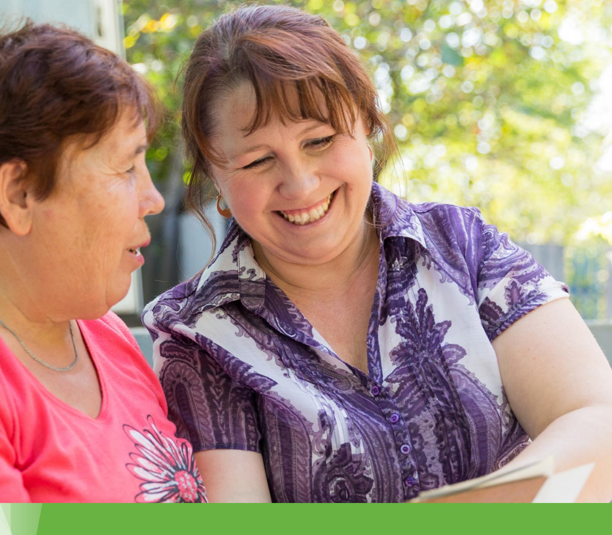
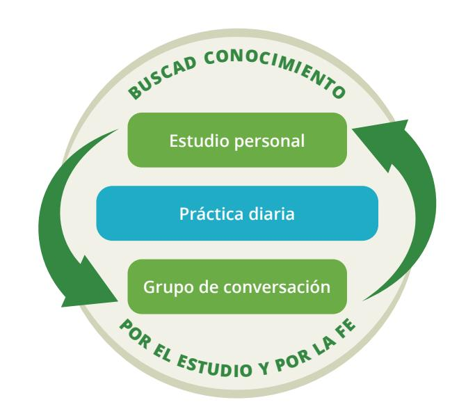

**PARA LOS ALUMNOS**

# EnglishConnect 1 para los alumnos

© 2023 by Intellectual Reserve, Inc. All rights reserved. Versión: 6/21 Traducción de *EnglishConnect 1 for Learners* Spanish PD60013491 002 Printed in the United States of America

# **Contenido**

| Introducción                               |     |
|--------------------------------------------|-----|
| Introducción .                             | V   |
| Registro de estudio personal .             | X   |
| Unidad 1: Introducing Myself               |     |
| Lecciones 1–5                              |     |
| Unidad 1: Introduction .                   | 1   |
| Lección 1: Introductory Lesson .           | 3   |
| Lección 2: Greetings and Introductions .   | 9   |
| Lección 3: Personal Information            | 15  |
| Lección 4: Hobbies and Interests           | 21  |
| Lección 5: Hobbies and Interests           | 27  |
| Unidad 1: Conclusion                       | 34  |
| Unidad 2: Describing Family and Things     |     |
| Lecciones 6–9                              |     |
| Unidad 2: Introduction                     | 35  |
| Lección 6: Family                          | 37  |
| Lección 7: Family                          | 45  |
| Lección 8: Everyday Common Items           | 51  |
| Lección 9: Clothing and Colors             | 57  |
| Unidad 2: Conclusion                       | 63  |
| Unidad 3: Talking About My Day             |     |
| Lecciones 10–13                            |     |
| Unidad 3: Introduction                     | 65  |
| Lección 10: Daily Routines                 | 67  |
| Lección 11: My Activities                  | 75  |
| Lección 12: Time and Calendar              | 81  |
| Lección 13: Weather                        | 87  |
| Unidad 3: Conclusion                       | 93  |
| Unidad 4: Describing My Job and What I Eat |     |
| Lecciones 14–17                            |     |
| Unidad 4: Introduction                     | 95  |
| Lección 14: Jobs and Careers               | 97  |
| Lección 15: Jobs and Careers               | 103 |
| Lección 16: Food                           | 109 |
| Lección 17: Food                           | 117 |
| Unidad 4: Conclusion                       | 123 |

#### **Unidad 5: Describing My Home**

| Lecciones 18–21                                    |     |
|----------------------------------------------------|-----|
| Unidad 5: Introduction                             | 125 |
| Lección 18: Food                                   | 127 |
| Lección 19: Money                                  | 133 |
| Lección 20: Home                                   | 141 |
| Lección 21: Home                                   | 147 |
| Unidad 5: Conclusion                               | 152 |
| Unidad 6: Talking About My Health and My Community |     |
| Lecciones 22–25                                    |     |
| Unidad 6: Introduction                             | 153 |
| Lección 22: Community                              | 155 |
| Lección 23: Health                                 | 161 |
| Lección 24: Health                                 | 167 |
| Lección 25: Review                                 | 175 |
| Unidad 6: Conclusion                               | 180 |
| Apéndice                                           |     |
| Vocabulario adicional                              | 181 |
| Juegos para la conversación en grupo               | 184 |
| Questions                                          | 184 |
| Hot Seat                                           | 185 |
| Ball Toss                                          | 185 |
| Dice Game                                          | 186 |
| Give One, Get One                                  | 186 |
| Speculation                                        | 187 |
| Two Truths and One Lie                             | 188 |
| Vocabulary Cards                                   | 188 |
| Bicycle Chain (in-person)                          | 189 |
| Mingle and Share (in person)                       | 189 |
| Glosario de principios de aprendizaje 190          |     |
| Frases para la conversación en grupo               | 194 |
| Orar en inglés                                     | 196 |
|                                                    |     |

# **Introduction**

# Welcome to EnglishConnect!

EnglishConnect reúne a personas que buscan ampliar sus oportunidades mediante el aprendizaje del inglés. Todos venimos de diferentes orígenes y hablamos diferentes idiomas. Quizás tengamos diferentes niveles de conocimientos de inglés, pero juntos podemos lograr nuestros objetivos.

# Why Are You Learning English?

Tener un propósito claro puede ayudarte a mantenerte centrado y motivado. Veamos por qué quieres aprender inglés. ¿Esperas conseguir un trabajo mejor? ¿Necesitas aprender inglés para continuar tu formación académica? Tómate un momento para escribir tus razones para aprender inglés.

Quiero aprender inglés porque:

Aprender inglés puede aumentar tus oportunidades de formación académica, empleo, servicio y amistad. EnglishConnect puede ayudarte a alcanzar tus metas.

# What Is EnglishConnect?

EnglishConnect es un programa singular de aprendizaje de inglés que proporciona La Iglesia de Jesucristo de los Santos de los Últimos Días. EnglishConnect se ha diseñado para ayudarte a desarrollar tus habilidades en el idioma inglés en un ambiente de fe, hermandad y crecimiento. Esto significa que no estarás solo. Aprenderás con otras personas y todos se apoyarán y animarán mutuamente. También podrás aumentar tu fe en que Dios puede ayudarte a aprender.

EnglishConnect incluye varios niveles. EnglishConnect 1 y 2 ayudan a los alumnos a desarrollar habilidades básicas en inglés. EnglishConnect 3 prepara a los alumnos para oportunidades académicas, en particular, BYU–Pathway Worldwide. Puedes obtener más información sobre BYU–Pathway en byupathway.org. Obtén más información sobre EnglishConnect en englishconnect.org.

# What Makes EnglishConnect Unique?

En EnglishConnect desarrollamos habilidades en inglés en un ambiente de fe, hermandad y crecimiento.

## **Faith**

En EnglishConnect aprendemos por el estudio y por la fe. Cada lección comienza con un principio de aprendizaje. Son principios espirituales que nos ayudan a confiar en Dios para aumentar nuestra capacidad de aprender. Tus creencias sobre tu capacidad de aprender tendrán un impacto significativo en tu esfuerzo y tus resultados. Los principios de aprendizaje pueden ayudarte a entender tu verdadero potencial y la capacidad de Dios para ayudarte. Los siguientes son principios que estudiarás:

## **Eres un hijo de Dios**

"Soy un hijo de Dios, con un potencial y un propósito eternos".

(Véanse "Romanos 8:16–17; La Familia: Una Proclamación para el Mundo)

## **Ejercer fe en Jesucristo**

"Jesucristo me puede ayudar a hacerlo todo si ejerzo fe en Él".

(Véanse Filipenses 4:13; Éter 12:27; Moroni 7:33)

## **Asumir la responsabilidad**

"Tengo poder para elegir y soy responsable de mi propio aprendizaje".

(Véanse 2 Nefi 2:14, 16; Doctrina y Convenios 58:27–28)

## **Amarnos y enseñarnos los unos a los otros**

"Puedo aprender del Espíritu Santo a medida que amo, enseño y aprendo con otras personas".

(Véanse Juan 13:34–35; Juan 14:26–27; Doctrina y Convenios 88:77, 88:122–123)

## **Seguir adelante**

"Con la ayuda de Dios, puedo seguir adelante aunque enfrente obstáculos".

(Véanse 2 Nefi 31:20; 2 Nefi 32:9; Doctrina y Convenios 50:41–42)

## **Consultar al Señor**

"Mejoro mi aprendizaje al consultar a Dios a diario sobre mis esfuerzos".

(Véanse Proverbios 3:5–6; Mateo 7:7–8; Alma 37:37)

Los principios de aprendizaje son declaraciones de verdad. Puedes decirte estas declaraciones a ti mismo cuando necesites motivación o ánimo. A medida que apliques estos principios, tu capacidad de aprender aumentará y sabrás que, con la ayuda de Dios, puedes lograr tus metas.

## **Fellowship**

Una parte importante de la experiencia con EnglishConnect es aprender con otras personas. Los grupos de EnglishConnect aman, ayudan y se apoyan unos a otros. Tus reuniones de grupo son un lugar seguro para que puedas practicar hablar y cometer errores. Participar en un grupo de EnglishConnect puede ayudarte a mantenerte motivado y a entablar amistades.

## **Growth**

EnglishConnect es algo más que un programa para aprender inglés. Independientemente de cuál sea tu punto de partida, las experiencias que tendrás te ayudarán a mejorar como alumno. Tendrás oportunidades de hacer lo siguiente:

- Practicar inglés a diario.
- Medir tu progreso.
- Aprender con otras personas.
- Orar a Dios para que te ayude a lograr tus metas.

# What Will I Do in EnglishConnect?

En EnglishConnect estudiarás de forma individual, practicarás conversación en grupo y harás prácticas a diario. Cada lección del manual para los alumnos de EnglishConnect se divide en dos partes: "Estudio personal" y "Grupo de conversación".

## **Personal Study**

La sección "Estudio personal" te prepara para tu grupo de conversación. En "Estudio personal", completas las actividades siguientes:

## **Study the Principle of Learning**

Cada lección incluye un principio de aprendizaje. Son principios espirituales que te ayudan a asociarte con Dios para aprender inglés. Antes de ir a tu grupo de conversación, lee el principio de aprendizaje, medita las preguntas y anota tus ideas.

## **Memorize Vocabulary**

Aprende el significado y la pronunciación de cada palabra y usa el vocabulario para practicar los patrones. También puedes buscar otras palabras de vocabulario que se puedan usar en el patrón.

## **Practice the Patterns**

Comienza memorizando los patrones de frases y luego usa los patrones para crear tus propias preguntas y respuestas. Puedes reemplazar las palabras subrayadas por otras palabras de la lista de vocabulario. Continúa practicando en voz alta hasta que puedas usar los patrones con confianza para hacer y responder preguntas.

## **Conversation Group**

La sección "Grupo de conversación" incluye actividades que usarás para aprender con otras personas. En "Grupo de conversación" completarás las actividades siguientes:

## **Discuss the Principle of Learning (20–30 minutes)**

En tu grupo, lean y analicen el principio de aprendizaje. Esta es una oportunidad para compartir y aprender de los demás.

#### **Activities**

En las actividades 1, 2 y 3, usa el vocabulario y los patrones de frases para entablar una conversación significativa. Las actividades te ayudan a avanzar de la práctica de repetición a crear tus propias conversaciones. Cada actividad te prepara para la siguiente.

## **Activity 1: Practice the Patterns (10–15 minutes)**

En la actividad 1, repasa el vocabulario y los patrones que aprendiste en tu estudio personal. Tu meta es usar los patrones para decir y comprender preguntas y respuestas simples.

## **Activity 2: Create Your Own Sentences (10–15 minutes)**

En la actividad 2, céntrate en usar los patrones para crear tus propias frases. Sé creativo. Tu meta es usar los patrones para crear tantas preguntas y respuestas como puedas.

## **Activity 3: Create Your Own Conversations (15–20 minutes)**

En la actividad 3, practica conversaciones completas en situaciones de la vida real. Tu meta es mantener conversaciones significativas con el inglés que hayas aprendido.

## **Evaluate (5–10 minutes)**

Al final de cada grupo de conversación, evalúa tu progreso con respecto a los objetivos de la lección. Usa el "Registro de estudio personal" para evaluar tu esfuerzo en el estudio personal y fijarte metas para mejorar. Tómate tiempo para celebrar tu progreso y tus esfuerzos.

## **Daily Practice**

Para aprender inglés, debes desarrollar el hábito de la práctica diaria. Además del tiempo que dediques a estudiar, busca formas de reemplazar tus actividades diarias con el inglés. Por ejemplo, cuando escuches música, escúchala en inglés; cuando mires una

película, mírala en inglés o activa los subtítulos en inglés; cuando estés esperando en algún lugar, practica conversaciones en inglés en la mente; cuando ores, di todo lo que puedas en inglés. La clave de la práctica diaria es usar el inglés en tu rutina habitual.

También puedes completar las actividades de las lecciones y las evaluaciones en línea en englishconnect.org/learner/resources y en el *Cuadernos de ejercicios de EnglishConnect*.

A medida que completas las actividades de estudio personal de cada lección y practicas a diario, aprenderás más rápidamente y estarás mejor preparado para tu grupo de conversación. Usa el "Registro de estudio personal" que se incluye al final de esta introducción para hacer el seguimiento de tus esfuerzos y metas.

# Remember This

A medida que completes las actividades de estudio personal de cada lección, practiques inglés a diario y participes activamente en tu grupo de conversación, desarrollarás habilidades de conversación en inglés. Y lo que es más importante: a medida que apliques los principios de aprendizaje y ores para recibir ayuda de Dios, Él te ayudará a alcanzar tus metas actuales y futuras.

# **Registro de estudio personal**

Escribe tu propósito para aprender inglés.

**Propósito: Quiero aprender inglés** porque:

Puedes mejorar tu capacidad para aprender haciendo el seguimiento de tus esfuerzos y fijándote metas para mejorar. Usa el Registro de estudio personal para hacer el seguimiento de tus esfuerzos. Después de cada lección, fíjate una meta simple. Celebra tu progreso; cada esfuerzo te acerca más a tu meta.

Esfuerzo mínimo

Esfuerzo moderado

Esfuerzo significativo

| Lección | principio de aprendizaje Estudiar el | Memorizar el vocabulario | Practicar los patrones | Practicar a diario | Mi meta                                                                           |
|---------|--------------------------------------------|-----------------------------|---------------------------|-----------------------|-----------------------------------------------------------------------------------|
| Ejemplo |                                            |                             |                           |                       | Cuando ore, usaré nuevas palabras de vocabulario en inglés.                    |
| 1       |                                            |                             |                           |                       | Leer la Introducción. Completar la sección "Estudio personal" de la lección 2. |
| 2       |                                            |                             |                           |                       |                                                                                   |
| 3       |                                            |                             |                           |                       |                                                                                   |
| 4       |                                            |                             |                           |                       |                                                                                   |
| 5       |                                            |                             |                           |                       |                                                                                   |
| 6       |                                            |                             |                           |                       |                                                                                   |
| 7       |                                            |                             |                           |                       |                                                                                   |
| 8       |                                            |                             |                           |                       |                                                                                   |
| 9       |                                            |                             |                           |                       |                                                                                   |

| Lección | principio de aprendizaje Estudiar el | Memorizar el vocabulario | Practicar los patrones | Practicar a diario | Mi meta |
|---------|--------------------------------------------|-----------------------------|---------------------------|-----------------------|---------|
| 10      |                                            |                             |                           |                       |         |
| 11      |                                            |                             |                           |                       |         |
| 12      |                                            |                             |                           |                       |         |
| 13      |                                            |                             |                           |                       |         |
| 14      |                                            |                             |                           |                       |         |
| 15      |                                            |                             |                           |                       |         |
| 16      |                                            |                             |                           |                       |         |
| 17      |                                            |                             |                           |                       |         |
| 18      |                                            |                             |                           |                       |         |
| 19      |                                            |                             |                           |                       |         |
| 20      |                                            |                             |                           |                       |         |
| 21      |                                            |                             |                           |                       |         |
| 22      |                                            |                             |                           |                       |         |
| 23      |                                            |                             |                           |                       |         |
| 24      |                                            |                             |                           |                       |         |
| 25      |                                            |                             |                           |                       |         |

# Study Suggestions

Valora la posibilidad de usar las sugerencias siguientes para mejorar tu estudio.

## **Study the Principle of Learning**

- 1. **Orar.** Comienza y termina tu estudio con una oración. Pide a Dios que te ayude a comprender y aplicar el principio.
- 2. **Escuchar al Espíritu.** Presta atención a tus pensamientos y sentimientos, aun cuando no parezca que estén relacionados con lo que estés leyendo. Anota tus pensamientos y sentimientos. Haz lo que el Espíritu te invite a hacer.
- 3. **Anotar palabras o frases inspiradoras.** Quizás encuentres palabras y frases que te resulten relevantes personalmente y que te inspiren y motiven. Anótalas en un lugar donde puedas verlas. Colócalas en el espejo o en el teléfono.
- 4. **Poner en práctica el principio de aprendizaje.** Piensa en cómo puedes poner en práctica el principio de aprendizaje, las citas y las Escrituras en tu vida. Anota lo que aprendas a medida que pones en práctica el principio de aprendizaje.
- 5. **Leer más.** Lee las Escrituras o los discursos de la conferencia relacionados con el principio de aprendizaje.
- 6. **Aprender vocabulario nuevo.** Elige algunas palabras del principio de aprendizaje que desees aprender en inglés. Busca las palabras y habla con otros participantes sobre lo que significan las palabras y frases para ellos.

#### **Memorize Vocabulary**

- 1. **Centrarte en el significado y la pronunciación.** Repite la palabra en voz alta y piensa en su significado. Aprende la pronunciación de cada palabra y practica hasta que la pronuncies correctamente. Continúa hasta que puedas decir la palabra con confianza y sepas lo que significa.
- 2. **Practicar con tarjetas de memorización.** Usa tarjetas de notas (o una aplicación) para crear tarjetas de memorización. Escribe la palabra en un lado y una definición, una traducción o un dibujo en el otro. La repetición es fundamental para memorizar el vocabulario.
- 3. **Practicar palabras en frases.** Practica decir la palabra que estás aprendiendo en una frase. Puedes usar los patrones de frases para practicar las palabras que estás aprendiendo.
- 4. **Aplicar la palabra.** Piensa en situaciones en las que podrías usar la palabra en tu vida cotidiana. Practica esa situación hasta que te resulte natural usarla. Cuando vayas al trabajo, a la escuela, a las tiendas o a otros lugares, usa las palabras en la mente para describir las cosas.
- 5. **Fijarte en las palabras.** Busca y escucha nuevas palabras a medida que avanza el día. Puedes aprender de películas, programas de televisión, libros, pódcast o canciones. Anota las palabras nuevas.
- 6. **Aprender más.** Usa un diccionario para aprender más sobre palabras nuevas. Aprende definiciones, partes del habla, partes de las palabras, pronunciación y frases de ejemplo.

7. **Repasar.** Dedica tiempo a repasar periódicamente las palabras que hayas aprendido en el pasado. Esto te ayudará a darte cuenta de cuánto has aprendido y a no olvidar palabras.

## **Practice the Patterns**

- 1. **Centrarte en el significado y la fluidez.** Repite una frase del patrón en voz alta y piensa en su significado. Continúa hasta que puedas decir la frase con fluidez y confianza y sepas lo que significa.
- 2. **Grabarte.** Grábate mientras haces preguntas y las respondes en tu teléfono. Escucha la grabación y presta atención a tu fluidez y pronunciación.
- 3. **Practicar con un compañero.** Practica el uso de los patrones para hacer y responder preguntas con un amigo. Puedes practicar en persona o por teléfono. Practica el uso de los patrones al escribir mensajes a un amigo.
- 4. **Pensar y hablar sobre los patrones.** ¿Qué observas acerca de la estructura del inglés? ¿Qué similitudes tiene el inglés con tu idioma? ¿En qué se diferencia el inglés de tu idioma? ¿Cómo podrías utilizar el patrón de una lección en una situación diferente?
- 5. **Usar otros recursos.** Los libros de gramática, las aplicaciones, los sitios web y otros alumnos pueden ayudarte a aprender más sobre los patrones gramaticales del inglés.
- 6. **Fijarte en los patrones.** Busca y escucha los patrones que estás aprendiendo cuando leas o escuches inglés.

## **Practice Daily**

- 1. **Establecer una rutina.** Planifica cuándo y dónde estudiarás cada día y hazlo. Para ayudarte a recordar, escribe tu meta en una declaración de estilo "cuando". Por ejemplo: "Cuando , ". Estos son algunos ejemplos: "Cuando voy en el autobús, repaso el vocabulario"; "Cuando preparo la cena, describo en inglés lo que estoy haciendo"; y "Cuando oro, digo todo lo que puedo en inglés".
- 2. **Realizar actividades diarias en inglés.** Busca formas de reemplazar tu idioma nativo por el inglés en tus actividades diarias. Por ejemplo, cuando escuches música, escúchala en inglés. Otras ideas: mira películas en inglés o con subtítulos en inglés, cambia la configuración del teléfono a inglés y lee las Escrituras en inglés.
- 3. **Leer.** Lee en inglés todo lo que puedas. Lee las Escrituras, los discursos de las conferencias generales, revistas, blogs, noticias y otra información en inglés.
- 4. **Escuchar.** Escucha activamente todo lo que puedas. Escucha pódcast, las Escrituras, discursos, presentaciones, videos, programas de televisión o películas.
- 5. **Conversar.** Busca amigos, familiares y compañeros de trabajo y practica hablar con ellos. Cuéntales lo que has estado aprendiendo y haciendo para practicar inglés. Crea un chat grupal y envía notas de voz.
- 6. **Escribir.** Busca oportunidades de escribir en inglés. Comienza a escribir un diario o crea un chat grupal. Usa las frases y el vocabulario que estás aprendiendo.
- 7. **Completar las actividades de las lecciones.** Realiza las actividades de las lecciones y las evaluaciones en línea en englishconnect.org o en el *Cuaderno de ejercicios de EnglishConnect*.

