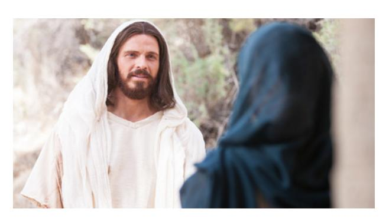
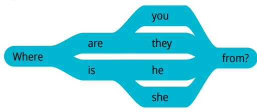
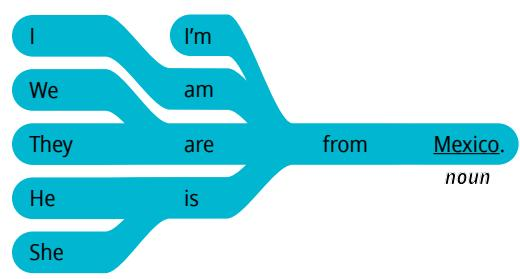
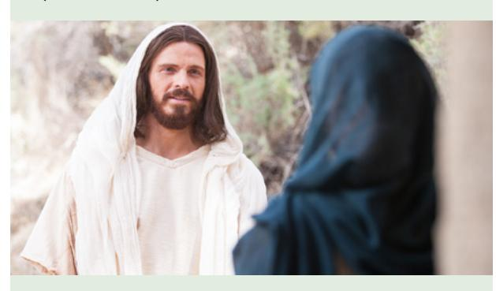
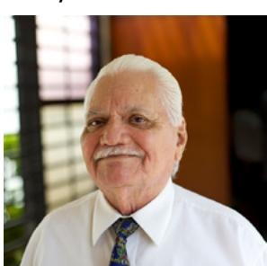

**LESSON 2**

# **Greetings and Introductions**

**OBJETIVO: APRENDERÉ A SALUDAR A LOS DEMÁS Y DECIR DE DÓNDE PROVIENE ALGUIEN.**

# Personal Study

Prepárate para tu grupo de conversación y completa las actividades A–E.

## **Study the Principle of Learning: Exercise Faith in Jesus Christ**

*Jesus Christ can help me do all things as I exercise faith in Him.*

Jesucristo es el Hijo de Dios. Dios envió a Jesús para enseñarnos y ayudarnos. Jesús nos enseña a vivir fieles a nuestro potencial como hijos de Dios. Jesús tiene poder para ayudarnos a superar nuestras debilidades y nuestros desafíos. Él nos enseñó:

"Si tuviereis fe como un grano de mostaza, diréis a este monte: Pásate de aquí allá, y se pasará; y nada os será imposible" (Mateo 17:20).

Es posible que creas que aprender inglés es una enorme montaña, una tarea imposible, pero a medida que ejerzas aunque sea solamente un poco de fe en Jesucristo, tu fe crecerá, y tu fe creciente en Él te ayudará a superar tus desafíos.

## **Ponder**

- ¿Cuáles son algunos de los desafíos que podrías enfrentar al aprender inglés?
- ¿De qué maneras puedes aumentar tu fe en Jesucristo?

## **Memorize Vocabulary**

Aprende el significado y la pronunciación de cada palabra antes de ir a tu grupo de conversación. Dios te ayudará a recordar lo que estás aprendiendo si haces todo lo posible por estudiar.

### **Pronouns**

| I                 | yo                      |
|-------------------|-------------------------|
| you               | tú                      |
| we                | nosotros                |
| they              | ellos/ellas             |
| he                | él                      |
| she               | ella                    |

### **Verbs**

| I am/I'm          | yo soy/estoy            |
|-------------------|-------------------------|
| you are           | tú eres/estás           |
| we are            | nosotros somos/estamos  |
| they are          | ellos/ellas son/están   |
| he is             | él es/está              |
| she is            | ella es/está            |

### **Phrases**

| How are you?      | ¿Cómo estás?            |
|-------------------|-------------------------|
| Nice to meet you. | Es un placer conocerte. |

### **Question Words**

| what              | qué                     |
|-------------------|-------------------------|
| where             | dónde                   |

### **Nouns**

| country           | país                    |
|-------------------|-------------------------|

### **Adjectives**

| fine | bien |
|------|------|
| OK   | bien |

### **Nouns**

| Japan  | Japón  |
|--------|--------|
| Kenya  | Kenia  |
| Mexico | México |

## **Practice Pattern 1**

El inglés tiene muchos patrones. Con un patrón y unas cuantas palabras de vocabulario, ¡puedes crear docenas de oraciones! Practica el uso de los patrones hasta que puedas hacer y responder preguntas con confianza. Puedes reemplazar las palabras subrayadas por palabras de la sección "Memorize Vocabulary".

Q: How are you?
Q_es: ¿Cómo estás?

A: I'm (*adjective*), thanks.
A_es: Soy (*adjetivo*), gracias.

## **Questions**

How are you?

## **Answers**

*adjective* I'm fine, thanks.

## **Examples**

Q: How are you?

A: I'm fine, thanks.

Q: Hi, how are you?

A: I'm OK, thanks.

## **Practice Pattern 2**

Practica el uso de los patrones hasta que puedas hacer y responder preguntas con confianza. Si algo te resulta confuso, ora para pedir ayuda y sigue trabajando en ello. Dios te ayudará.

Q: Where are you from?
Q_es: De dónde eres?

A: I'm from (*noun*).
A_es: Yo soy de (*sustantivo*).

### **Questions**

#### **Answers**

#### **Examples**

Q: Where are you from?
Q_es: De dónde eres?

A: I'm from Mexico.
A_es: Soy de México.

Q: Where are they from?
Q_es: De dónde son?

A: They are from Japan.
A_es: Son de Japón.

Q: Where is she from?
Q_es: De dónde es ella?

A: She is from Kenya.
A_es: Ella es de Kenia.

## **Use the Patterns**

Escribe cuatro preguntas que puedas hacerle a alguien. Escribe la respuesta a cada pregunta. Léelas en voz alta.

## **Additional Activities**

Completa las actividades de la lección y las evaluaciones en línea en englishconnect.org/ learner/resources o en el *Cuaderno de ejercicios de EnglishConnect 1*.

## **Act in Faith to Practice English Daily**

*Necesitas practicar de manera constante y diaria para hablar un nuevo idioma. Tener una meta te puede resultar útil. No es necesario que tu meta sea complicada; de hecho, las metas simples suelen resultar más eficaces porque ayudan a desarrollar el hábito de practicar inglés cada día.*

Continúa practicando inglés a diario. Usa tu "Registro de estudio personal", repasa tu meta de estudio y evalúa tus esfuerzos.

# Conversation Group

## **Discuss the Principle of Learning: Exercise Faith in Jesus Christ**

(20–30 minutes)

- Lean el principio de aprendizaje de esta lección en voz alta.
- Analicen las preguntas.

Repasa la lista de vocabulario con un compañero.

Practica el patrón 1 con un compañero:

- Practica hacer preguntas.
- Practica responder preguntas.
- Practica una conversación usando los patrones.

Repite con el patrón 2.

#### **Part 1**

Preséntate a un compañero. Tomen turnos. Cambia de compañero y vuelve a practicar.

#### **Example**

- A: Hi! How are you?
- B: I'm OK, thanks.
- A: My name is . I'm from . What's your name?
- B: My name is . I'm from .

## **Part 2**

Fíjate en las ilustraciones. y haz y responde preguntas sobre cada persona. Tomen turnos.

#### **Example: Talia, Samoa**

- A: What's her name?
- B: Her name is Talia.
- A: Where is she from?
- B: She is from Samoa.

**Image 1: Marco, Italy**

**Image 2: Nat, Canada**

**Image 3: Sam, Mexico**

**Activity 3: Create Your Own Conversations**

**(15–20 MINUTES)**

Hagan dramatizaciones. El compañero A elige ser una persona de la lista y el compañero B hace preguntas para conocer mejor al compañero A. Intercámbiense los roles.

- Greta, Germany
- Louis, France
- Ji Hoon, Korea
- Li Min, China
- Luna, Peru
- Pia, Chile
- Dima, Russia
- Avi, India
- Kisi, Ghana

### **Example**

A: Hi! How are you?

B: I'm fine, thanks.

A: My name is Avi. What's your name?

B: My name is Kisi. I'm from Ghana. Where are you from?

A: I'm from India. Nice to meet you, Kisi.

#### **Evaluate**

(5–10 minutes)

Evalúa tu progreso con los objetivos y tus esfuerzos por practicar inglés a diario.

#### **Evaluate Your Progress**

I can:

• Greet someone and ask how they are.

• Introduce myself and say where I'm from.

• Ask people's names and where they are from.

#### **Evaluate Your Efforts**

Usa el "Registro de estudio personal" que se encuentra en la introducción para evaluar tus esfuerzos y fijar una meta.

Comparte tu meta con un compañero.

## **Act in Faith to Practice English Daily**

"*Comiencen hoy* a aumentar su fe. Mediante su fe, Jesucristo aumentará la capacidad de ustedes para mover los montes que haya en su vida [véase 1 Nefi 7:12], aunque sus desafíos personales puedan ser tan grandes como el monte Everest" (Russell M. Nelson, "Cristo ha resucitado; la fe en Él moverá montes", *Liahona*, mayo de 2021, págs. 102–103).

