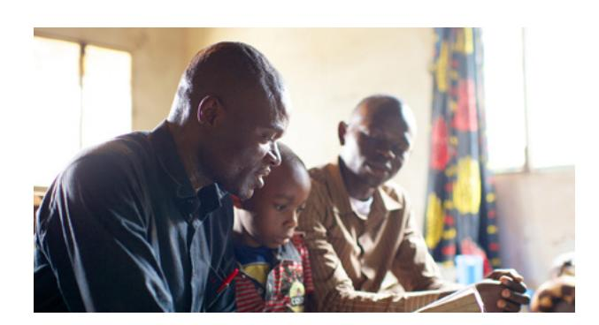
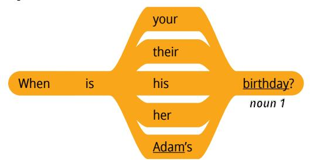
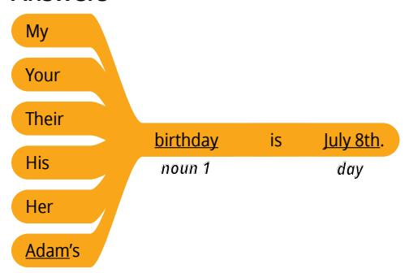
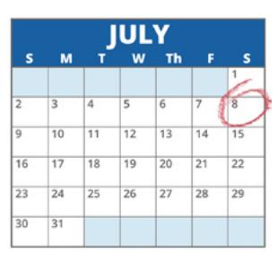
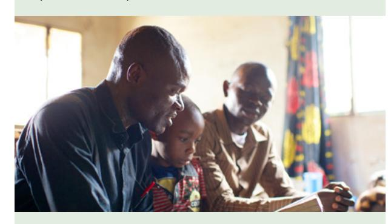
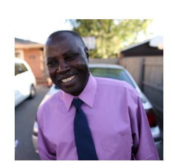
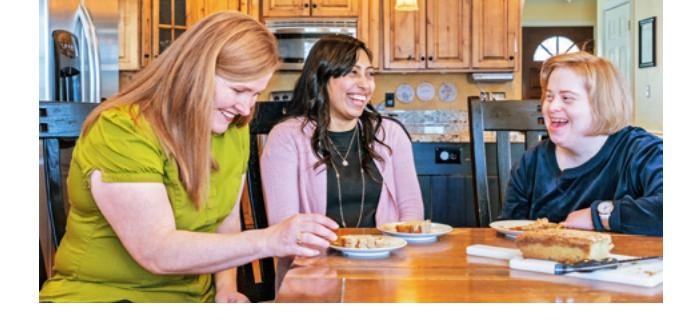

**LESSON 3**

# **Personal Information**

**OBJETIVO: APRENDERÉ A HACER Y RESPONDER PREGUNTAS SOBRE INFORMACIÓN PERSONAL.**

## Personal Study

Prepárate para el grupo de conversación y completa las actividades A–E.

## **Study the Principle of Learning: Take Responsibility**

*I have the power to choose, and I am responsible for my own learning.*

Eres un hijo de Dios con poder para elegir y actuar por ti mismo. Este poder se llama albedrío. Lehi, un profeta del Libro de Mormón, nos enseña que no somos como piedras, a la espera de que alguien nos cambie y nos mueva. Somos agentes que podemos decidir por nosotros mismos lo que creemos, lo que hacemos y quiénes llegamos a ser. Lehi enseñó:

"[Dios] ha creado todas las cosas […]; tanto las cosas que actúan como aquellas sobre las cuales se actúa. […] Por lo tanto, el Señor Dios le concedió al hombre que obrara por sí mismo" (2 Nefi 2:14, 16).

Puedes elegir aprender y mejorar. Tu maestro y otros alumnos de tu grupo de conversación pueden ayudarte, pero, en definitiva, tus elecciones son las que más influencia tendrán en tu aprendizaje. Puedes actuar por ti mismo para practicar inglés a diario.

Cuando surjan problemas, busca soluciones. Se te ha dado el albedrío, el poder de Dios para actuar, y puedes asumir la responsabilidad de tu propio aprendizaje.

## **Ponder**

- ¿Qué significa para ti ser un "agente" y asumir la responsabilidad de tu propio aprendizaje?
- ¿Cuáles son las cosas que dificultan el estudio del inglés a diario?
- ¿Qué puedes hacer para actuar, y no para que se actúe sobre ti, al estudiar inglés a diario?

## **Memorize Vocabulary**

Aprende el significado y la pronunciación de cada palabra antes de ir a tu grupo de conversación. Intenta usar las nuevas palabras en una conversación o en un mensaje para alguien que sepa inglés.

### **Pronouns**

| their          | su (de ellos/ellas)              |
|----------------|----------------------------------|

### **Phrases**

| When is … ?    | ¿Cuándo es…?                     |
|----------------|----------------------------------|

### **Nouns 1**

| anniversary | aniversario |
|-------------|-------------|
| birthday    | cumpleaños  |

### **Days**

| January 1st  | 1 de enero   |
|--------------|--------------|
| February 2nd | 2 de febrero |
| March 3rd    | 3 de marzo   |
| April 4th    | 4 de abril   |
| May 5th      | 5 de mayo    |
| June 6th     | 6 de junio   |

En el apéndice puedes ver más *numbers*.

En el apéndice puedes ver más *months*.

## **Practice Pattern 1**

Practica el uso de los patrones hasta que puedas hacer y responder preguntas con confianza. Puedes reemplazar las palabras subrayadas por palabras de la sección "Memorize Vocabulary".

Q: When is your (*noun 1*)?
Q_es: ¿Cuándo es tu (*sustantivo 1*)?

A: My (*noun 1*) is (*day*).
A_es: Mi (*sustantivo 1*) es (*día*).

#### **Questions**

### **Answers**

## **Examples**

- Q: When is your birthday?
- A: My birthday is July 8th.
- Q: When is his anniversary?
- A: His anniversary is April 3rd.

## **Use the Patterns**

Escribe cuatro preguntas que puedas hacerle a alguien. Escribe la respuesta a cada pregunta. Léelas en voz alta.

Completa las actividades de la lección y las evaluaciones en línea en englishconnect.org/ learner/resources o en el *Cuaderno de ejercicios de EnglishConnect 1*.

## **Act in Faith to Practice English Daily**

Continúa practicando inglés a diario. Usa tu "Registro de estudio personal", repasa tu meta de estudio y evalúa tus esfuerzos.

## Conversation Group

## **Discuss the Principle of Learning: Take Responsibility**

(20–30 minutes)

- Lean el principio de aprendizaje de esta lección en voz alta.
- Analicen las preguntas.

Repasa la lista de vocabulario con un compañero.

Practica el patrón 1 con un compañero:

- Practica hacer preguntas.
- Practica responder preguntas.
- Practica una conversación usando los patrones.

## **Activity 2: Create Your Own Sentences**

**(10–15 MINUTES)**

Fíjate en las ilustraciones y haz y responde preguntas sobre cada persona. Tomen turnos.

## **Example: Mei**

- Birthday: July 1

A: When is Mei's birthday? B: Her birthday is July 1st.

## **Image 1: Hugo**

- Birthday: October 9

## **Image 2: Mari**

- Birthday: August 2

## **Image 3: Jean**

• Birthday: March 7

#### **Image 4: Talia**

• Birthday: January 10

#### **Evaluate**

(5–10 minutes)

Evalúa tu progreso con los objetivos y tus esfuerzos por practicar inglés a diario.

#### **Evaluate Your Progress**

I can:

• Say my birthday and anniversary.

• Ask for and say someone's birthday and anniversary.

#### **Evaluate Your Efforts**

Usa el "Registro de estudio personal" que se encuentra en la introducción para evaluar tus esfuerzos y fijar una meta.

Comparte tu meta con un compañero.

## **Act in Faith to Practice English Daily**

"Las decisiones que tomamos determinan nuestro destino" (Thomas S. Monson, "Decisiones", *Liahona*, mayo de 2016, pág. 86).

