**LESSON 4**

# **Hobbies and Interests**

**OBJETIVO: APRENDERÉ A HABLAR SOBRE LO QUE ME GUSTA Y LO QUE NO ME GUSTA.**

# Personal Study

Prepárate para el grupo de conversación y completa las actividades A–E.

## **Study the Principle of Learning: Love and Teach One Another**

*I can learn from the Spirit as I love, teach, and learn with others.*

En EnglishConnect sabemos que Dios es el verdadero maestro y que nos enseña por medio de Su Espíritu. El Espíritu brinda sentimientos de gozo, paz y amor. El Espíritu nos ayuda a comprender la verdad y puede aumentar nuestra capacidad de aprender. Una manera de invitar al Espíritu a estar con nosotros es demostrar amor, enseñar y aprender juntos. El profeta Alma, del Libro de Mormón, tenía la responsabilidad de enseñar al pueblo. Dividió a las personas en grupos y designó un líder para cada grupo. Alma les enseñó:

"El predicador no era de más estima que el oyente, ni el maestro era mejor que el discípulo; y así todos eran iguales" (Alma 1:26).

En EnglishConnect creemos que los maestros y los alumnos tienen la misma importancia. Todos somos maestros y alumnos. Nos respetamos y nos escuchamos los unos a los otros; nos enseñamos los unos a los otros, nos amamos y nos valoramos los

unos a los otros. Felicitamos a los demás cuando tienen éxito y los alentamos cuando cometan errores. También podemos buscar maneras de apoyarnos unos a otros y planificar momentos para practicar entre nosotros durante la semana. Dios nos bendecirá con Su Espíritu conforme aprendemos a amarnos y enseñarnos los unos a los otros.

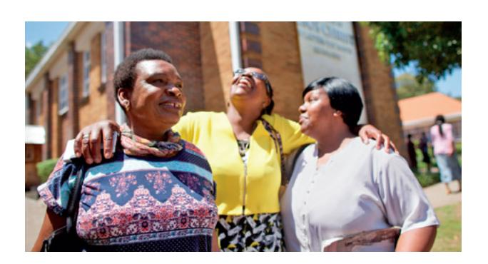

#### **Ponder**

- ¿Qué puedes hacer para amar y apoyar a aquellos que tienen diferentes habilidades en inglés?
- ¿En qué se diferencia la experiencia de aprendizaje con EnglishConnect de otras experiencias que has tenido antes?

## **Memorize Vocabulary**

Aprende el significado y la pronunciación de cada palabra antes de ir a tu grupo de conversación. Piensa en situaciones en las que podrías usar la palabra en tu práctica diaria.

### **Verbs**

| bike            | andar en bicicleta |
|-----------------|--------------------|
| cook            | cocinar            |
| dance           | bailar             |
| garden          | cuidar del jardín  |
| go to the beach | ir a la playa      |
| listen to music | escuchar música    |
| paint           | pintar             |
| play sports     | jugar deportes     |
| play the piano  | tocar el piano     |
| read            | leer               |
| run             | correr             |
| shop            | ir de compras      |
| sing            | cantar             |
| sleep           | dormir             |
| study           | estudiar           |
| swim            | nadar              |
| travel          | viajar             |
| watch movies    | ver películas      |

## **Practice Pattern 1**

Practica el uso de los patrones hasta que puedas hacer y responder preguntas con confianza. Puedes reemplazar las palabras subrayadas por palabras de la sección "Memorize Vocabulary".

Q: What do you like to do?
Q_es: ¿Qué te gusta hacer?

A: I like to (*verb*).
A_es: Me gusta (*verbo*).

### **Questions**

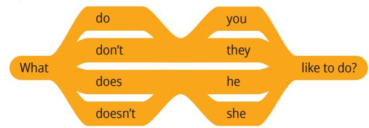

#### **Answers**

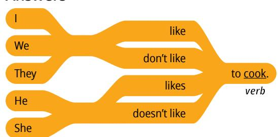

## **Examples**

- Q: What do you like to do?
- A: I like to cook.
- Q: What does he like to do?
- A: He likes to dance.

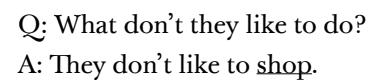

## **Practice Pattern 2**

Practica el uso de los patrones hasta que puedas hacer y responder preguntas con confianza. Intenta comprender las reglas que hay en los patrones. Piensa en cómo el inglés se asemeja o se diferencia de tu idioma.

Q: Do you like to (*verb*)?
Q_es: ¿Te gusta a (*verbo*)?

A: Yes, I like to (*verb*).
A_es: Sí, me gusta (*verbo*).

## **Questions**

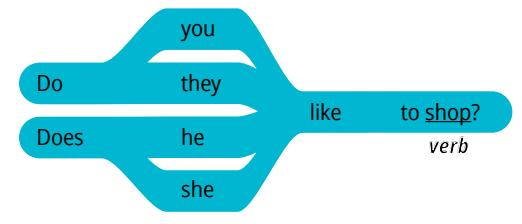

#### **Answers**

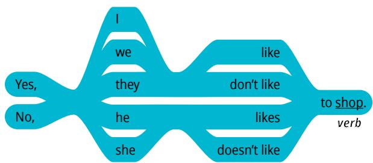

## **Examples**

Q: Do you like to travel?

A: Yes, I like to travel.

Q: Do you like to shop?

A: No, I don't like to shop.

Q: Does she like to paint?

A: Yes, she likes to paint.

## **Use the Patterns**

Escribe cuatro preguntas que puedas hacerle a alguien. Escribe la respuesta a cada pregunta. Léelas en voz alta.

Completa las actividades de la lección y las evaluaciones en línea en englishconnect.org/ learner/resources o en el *Cuaderno de ejercicios de EnglishConnect 1*.

#### **Act in Faith to Practice English Daily**

Continúa practicando inglés a diario. Usa tu "Registro de estudio personal", repasa tu meta de estudio y evalúa tus esfuerzos.

## Conversation Group

## **Discuss the Principle of Learning: Love and Teach One Another**

(20–30 minutes)

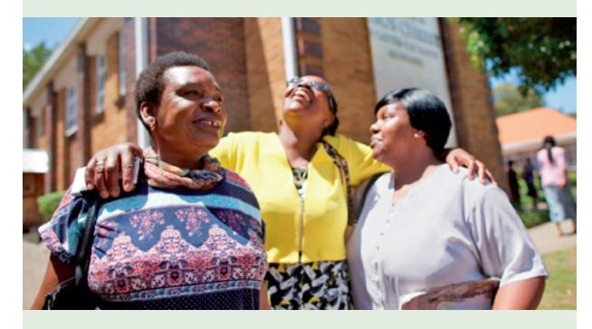

- Lean el principio de aprendizaje de esta lección en voz alta.
- Analicen las preguntas.

Repasa la lista de vocabulario con un compañero.

Practica el patrón 1 con un compañero:

- Practica hacer preguntas.
- Practica responder preguntas.
- Practica una conversación usando los patrones.

Repite con el patrón 2.

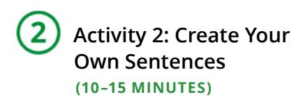

Fíjate en las ilustraciones y haz y responde preguntas sobre cada persona. Tomen turnos.

### **Example: Malia**

#### **Likes Doesn't Like**

- A: What does Malia like to do?
- B: She likes to paint.
- A: Does Malia like to study?
- B: No, she doesn't like to study.

#### **Image Group 1: Thomas**

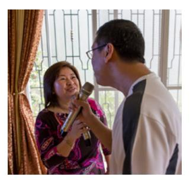

#### **Likes Doesn't Like**

### **Image Group 2: Raoul**

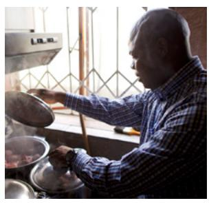

**Image Group 3: Mei**

**Likes Doesn't Like**

**Image Group 4: Pamela**

**Likes Doesn't Like**

## **Image Group 5: Nadia**

**Likes Doesn't Like**

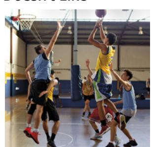

## **Activity 3: Create Your Own Conversations**

**(15–20 MINUTES)**

Haz y responde preguntas sobre lo que te gusta y no te gusta hacer. Tomen turnos. Cambia de compañero y vuelve a practicar.

## **Example**

A: What do you like to do?

B: I like to dance.

A: What don't you like to do?

B: I don't like to read.

A: Do you like to listen to music?

B: Yes, I like to listen to music.

#### **Evaluate**

(5–10 minutes)

Evalúa tu progreso con los objetivos y tus esfuerzos por practicar inglés a diario.

#### **Evaluate Your Progress**

I can:

• Say what I like to do.

• Say what I don't like to do.

• Ask what someone likes to do.

#### **Evaluate Your Efforts**

Usa el "Registro de estudio personal" que se encuentra en la introducción para evaluar tus esfuerzos y fijar una meta.

Comparte tu meta con un compañero.

## **Act in Faith to Practice English Daily**

"El Espíritu Santo es el verdadero maestro. Ningún maestro terrenal, independientemente de cuán diestro o experimentado sea, puede reemplazar la función del Espíritu Santo de testificar de la verdad, testificar de Cristo y cambiar corazones; pero todos los maestros pueden ser instrumentos para ayudar a los hijos de Dios a aprender por el Espíritu" ("Enseñar por el Espíritu", *Enseñar a la manera del Salvador: Para todos los que enseñan en el hogar y en la Iglesia*, 2022, pág. 16).

