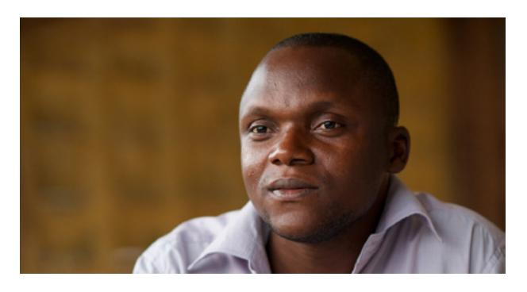
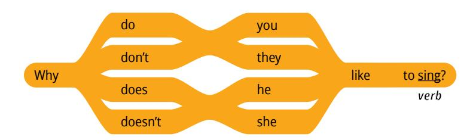
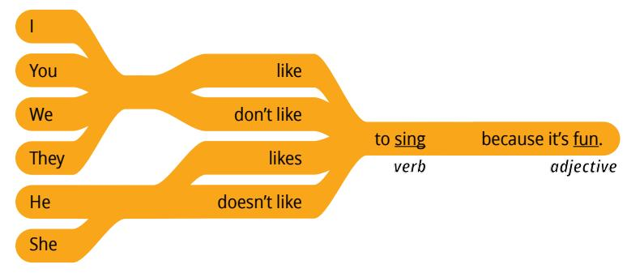
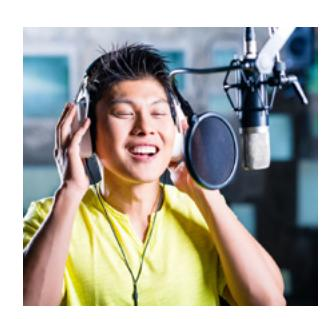
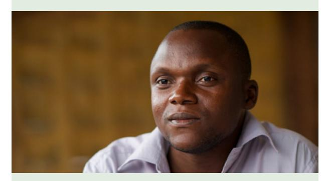
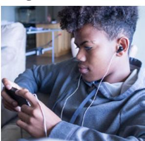
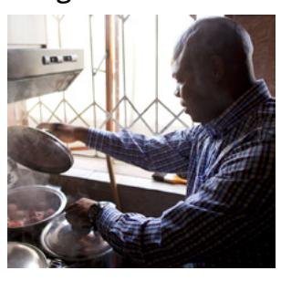
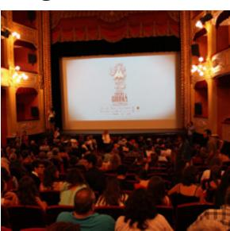
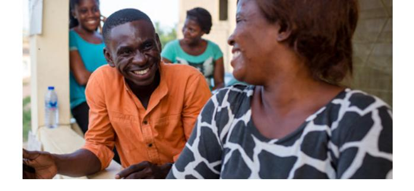

**LESSON 5**

# **Hobbies and Interests**

**OBJETIVO: APRENDERÉ A HABLAR SOBRE EL POR QUÉ A ALGUIEN LE GUSTA HACER O NO HACER ALGO.** 

## Personal Study

Prepárate para el grupo de conversación y completa las actividades A–D.

## **Study the Principle of Learning: Learn by Study and by Faith**

*In EnglishConnect, we rely on God to learn by study and by faith.*

En 1832, a José Smith y algunos de los primeros líderes de La Iglesia de Jesucristo de los Santos de los Últimos Días se les mandó que pusieran en marcha una escuela. Dios quería que ellos aprendieran, progresaran y se prepararan para liderar a otros. Aquel grupo de miembros no tenía títulos universitarios, ni siquiera muchos estudios; no tenían mucho dinero ni recursos. En las Escrituras, Dios les enseñó un patrón de aprendizaje:

"Y por cuanto no todos tienen fe, buscad diligentemente y enseñaos el uno al otro palabras de sabiduría; sí, buscad palabras de sabiduría de los mejores libros; buscad conocimiento, tanto por el estudio como por la fe" (Doctrina y Convenios 88:118).

Dios nos enseña que debemos aprender por medio del estudio y que también debemos aprender por medio de la fe. Hacemos todo lo posible y pedimos a Dios que envíe Su Espíritu para que nos abra

la mente y el corazón para aprender. El Espíritu nos brinda más comprensión de la que podemos desarrollar por nuestra cuenta. Tener un maestro o un libro de texto excelente puede resultar útil, pero Dios puede enseñarnos aunque no tengamos esas cosas. A medida que aprendemos por el estudio y por la fe, Dios puede ayudarnos a aprender más de lo que creíamos posible.

## **Ponder**

- ¿Qué puedes hacer para buscar conocimiento tanto por el estudio como por la fe?
- Piensa en tu experiencia con EnglishConnect. ¿Cómo te ayuda Dios a aprender?

## **Memorize Vocabulary**

Aprende el significado y la pronunciación de cada palabra antes de ir a tu grupo de conversación. Intenta usar las nuevas palabras en una conversación o en un mensaje para alguien que sepa inglés.

| because       | porque          |
|---------------|-----------------|
| Verbs         |                 |
| exercise      | hacer ejercicio |
| learn English | aprender inglés |

En la lección 4 puedes ver más verbs.

play sports hacer deporte

## **Adjectives**

| boring      | aburrido    |
|-------------|-------------|
| cheap       | barato      |
| dangerous   | peligroso   |
| difficult   | difícil     |
| easy        | fácil       |
| exciting    | emocionante |
| expensive   | caro        |
| fun         | divertido   |
| important   | importante  |
| interesting | interesante |
| relaxing    | relajante   |
| tiring      | agotador    |
| useful      | útil        |

## **Practice Pattern 1**

Practica el uso de los patrones hasta que puedas hacer y responder preguntas con confianza. Prueba a decir los patrones en voz alta. Si lo deseas, podrías grabarte. Presta atención a tu pronunciación y fluidez.

Q: What do you like to do?

A: I like to (*verb*).

Q: Why do you like to (*verb*)?

A: I like to (*verb*) because it's (*adjective*).

## **Questions**

#### **Answers**

## **Examples**

Q: Why do you like to sing?

A: I like to sing because it's fun.

Q: Why doesn't she like to cook?

A: She doesn't like to cook because it's difficult.

Q: Why does she like to paint?

A: Because it's relaxing.

| Use the Patterns |
|------------------|
|                  |

## **Additional Activities**

Completa las actividades de la lección y las evaluaciones en línea en englishconnect.org/ learner/resources o en el *Cuaderno de ejercicios de EnglishConnect 1*.

## **Act in Faith to Practice English Daily**

Continúa practicando inglés a diario. Usa tu "Registro de estudio personal", repasa tu meta de estudio y evalúa tus esfuerzos.

# Conversation Group

## **Discuss the Principle of Learning: Learn by Study and by Faith**

(20–30 minutes)

- Lean el principio de aprendizaje de esta lección en voz alta.
- Analicen las preguntas.

Repasa la lista de vocabulario con un compañero.

Practica el patrón 1 con un compañero:

- Practica hacer preguntas.
- Practica responder preguntas.
- Practica una conversación usando los patrones.

Repite con el patrón 2.

**(10–15 MINUTES)**

Utiliza los cuadros. Haz y responde preguntas sobre cada persona. Tomen turnos. Cambia de compañero y vuelve a practicar.

## **Example: Alex**

| Likes        | Why         |
|--------------|-------------|
| swim         | easy        |
| watch movies | interesting |
|              |             |
|              |             |
| Dislikes     | Why         |
| dance        | difficult   |

A: What does Alex like to do?

B: He likes to swim.

A: Why does he like to swim?

B: He likes to swim because it's easy.

A: What doesn't Alex like to do?

B: He doesn't like to dance.

A: Why doesn't he like to dance?

cook difficult

B: He doesn't like to dance because it's difficult.

#### **Chart 1: Katya**

| Likes    | Why       |
|----------|-----------|
| paint    | important |
| garden   | relaxing  |
| Dislikes | Why       |
|          |           |
| run      | tiring    |

## **Chart 2: Dani**

| Likes       | Why   |
|-------------|-------|
| dance       | fun   |
| play sports | cheap |
| Dislikes    | Why   |

| Dislikes | Why       |
|----------|-----------|
| watch TV | boring    |
| travel   | expensive |

## **Chart 3: Suri**

| Likes        | Why       |
|--------------|-----------|
| watch sports | exciting  |
| play sports  | difficult |

| Dislikes | Why       |
|----------|-----------|
| dance    | tiring    |
| run      | difficult |

## **Chart 4: Your Name**

| Likes    | Why |
|----------|-----|
| Dislikes | Why |

## **Activity 3: Create Your Own Conversations**

**(15–20 MINUTES)**

Fíjate en las ilustraciones y haz y responde preguntas sobre la actividad que aparece en cada imagen. Tomen turnos. Cambia de compañero y vuelve a practicar.

### **Example**

- A: Do you like to run?
- B: Yes.
- A: Why do you like to run?
- B: I like to run because it's exciting.

## **Image 1 Image 2**

**Image 3 Image 4**

**Image 5 Image 6**

**Image 7**

#### **Evaluate**

(5–10 minutes)

Evalúa tu progreso con los objetivos y tus esfuerzos por practicar inglés a diario.

#### **Evaluate Your Progress**

I can:

• Say why I like something.

• Say why I don't like something.

#### **Evaluate Your Efforts**

Usa el "Registro de estudio personal" que se encuentra en la introducción para evaluar tus esfuerzos y fijar una meta.

Comparte tu meta con un compañero.

## **Act in Faith to Practice English Daily**

"Por lo general, buscar el aprendizaje por el estudio pone la mente en funcionamiento. Buscar el aprendizaje por la fe pone en funcionamiento tanto el corazón como la mente. Es en el corazón y en la mente donde sentiremos las manifestaciones del Espíritu Santo" (Camille N. Johnson, "Learning by Study and by Faith", *devocional mundial de BYU–Pathway*, octubre de 2021).

