**LESSON 6**

# **Family**

**OBJETIVO: APRENDERÉ A HABLAR SOBRE CUÁNTAS PERSONAS HAY EN UNA FAMILIA.**

# Personal Study

Prepárate para tu grupo de conversación y completa las actividades A–E.

## **Study the Principle of Learning: You Are a Child of God**

*I am a child of God with eternal potential and purpose.*

Dios es el Padre de nuestros espíritus, por eso lo llamamos Padre Celestial. Tu Padre Celestial te ama. Quiere que comprendas tu verdadera identidad y tu relación con Él. Dios nos enseña acerca de nuestra verdadera naturaleza por medio de Sus profetas. Pablo, un profeta de la Biblia, enseñó:

"El Espíritu mismo da testimonio a nuestro espíritu de que somos hijos de Dios" (Romanos 8:16).

Las enseñanzas de Pablo se aplican a ti. Recuerda que eres hija o hijo de un amoroso Padre Celestial. Tienes un potencial eterno y Dios tiene un propósito para tu vida. Si se lo pides a Dios, Él puede ayudarte a ver quién eres y quién puedes llegar a ser. Siempre que dudes de tu capacidad para aprender inglés, recuerda que eres un hijo de Dios. Él te ama y desea

ayudarte a crecer y progresar. A medida que ores y pidas Su ayuda, Él te ayudará a aprender.

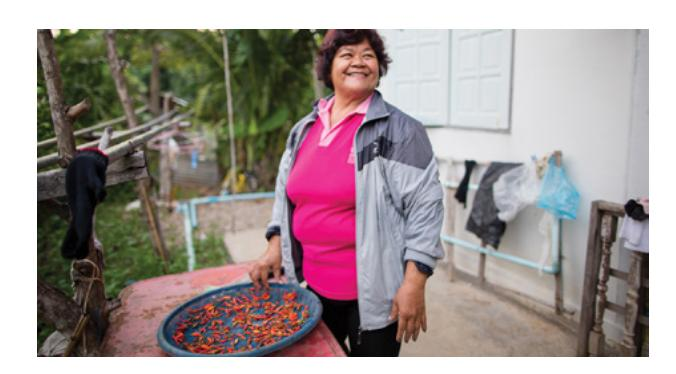

## **Ponder**

- ¿Cómo describirías la relación entre un padre amoroso y su hijo?
- ¿Cómo influye en tu concepto de ti mismo el saber que tienes un Padre Celestial amoroso?
- ¿Cómo puedes desarrollar tu relación con el Padre Celestial?

## **Memorize Vocabulary**

Aprende el significado y la pronunciación de cada palabra antes de ir a tu grupo de conversación. Piensa en situaciones en las que podrías usar la palabra en tu práctica diaria.

| family                 | familia            |
|------------------------|--------------------|
| have/has               | tienes/tiene       |
| How many … ?           | ¿Cuántos/cuántas…? |
| There are …/There is … | Hay…               |

## **Numbers**

| 1 – one   | 1: uno  |
|-----------|---------|
| 2 – two   | 2: dos  |
| 3 – three | 3: tres |

En el apéndice puedes ver más *numbers*.

## **Nouns**

| husband            | esposo                |
|--------------------|-----------------------|
| wife               | esposa                |
| father (dad)       | padre (papá)          |
| mother (mom)       | madre (mamá)          |
| brother/brothers   | hermano/hermanos      |
| sister/sisters     | hermana/hermanas      |
| child/children     | hijo(a)/hijos e hijas |
| daughter/daughters | hija/hijas            |
| son/sons           | hijo/hijos            |
| boy/boys           | niño/niños            |
| girl/girls         | niña/niñas            |
| person/people      | persona/personas      |

En el apéndice puedes ver más *family nouns*.

## **Practice Pattern 1**

Practica el uso de los patrones hasta que puedas hacer y responder preguntas con confianza. Puedes reemplazar las palabras subrayadas por palabras de la sección "Memorize Vocabulary".

Q: How many (*noun*) are in your family? A: There are (*number*) (*noun*) in my family.

#### Questions

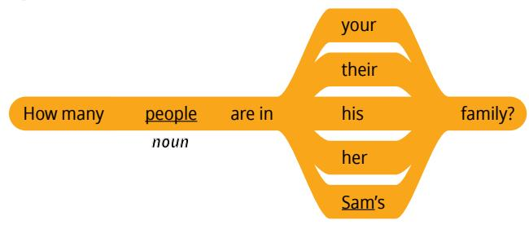

#### **Answers**

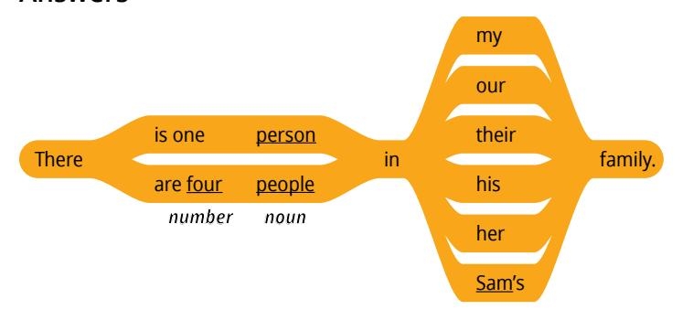

## **Examples**

Q: How many people are in <u>Sam</u>'s family? A: There are four people in his family.

Q: How many <u>sisters</u> are in your family? A: There are <u>two sisters</u> in my family.

Q: How many sons are in your family? A: There is one son in my family.

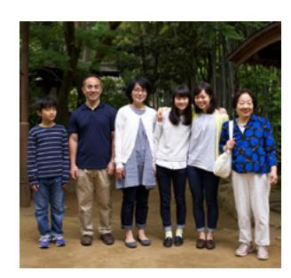

## **Practice Pattern 2**

Practica el uso de los patrones hasta que puedas hacer y responder preguntas con confianza. Intenta usar los patrones en una conversación con un amigo. Podrían hablar o enviarse mensajes.

Q: How many (*noun*) do you have? A: I have (*number*) (*noun*).

### **Questions**

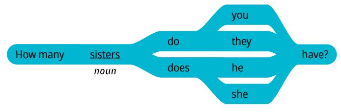

#### **Answers**

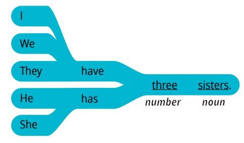

#### **Examples**

Q: How many children do you have? A: I have six children.

Q: How many brothers does she have? A: She has three brothers.

|  | Use the Patterns |
|--|------------------|
|--|------------------|

| Escribe cuatro preguntas que puedas hacerle a alguien. Escribe la respuesta a cada pregunta. Léelas en voz alta. |
|------------------------------------------------------------------------------------------------------------------------|
|                                                                                                                        |
|                                                                                                                        |
|                                                                                                                        |
|                                                                                                                        |
|                                                                                                                        |

#### **Additional Activities**

Completa las actividades de la lección y las evaluaciones en línea en englishconnect.org/ learner/resources o en el *Cuaderno de ejercicios de EnglishConnect 1*.

## **Act in Faith to Practice English Daily**

Continúa practicando inglés a diario. Usa tu "Registro de estudio personal", repasa tu meta de estudio y evalúa tus esfuerzos.

# Conversation Group

## **Discuss the Principle of Learning: You Are a Child of God**

(20–30 minutes)

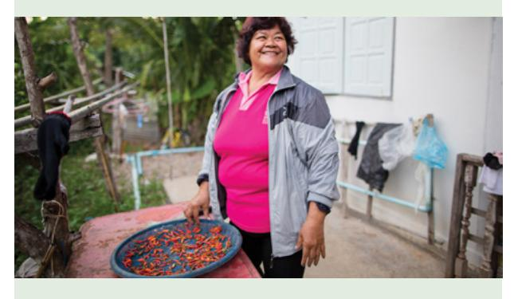

- Lean el principio de aprendizaje de esta lección en voz alta.
- Analicen las preguntas.

Repasa la lista de vocabulario con un compañero.

Practica el patrón 1 con un compañero:

- Practica hacer preguntas.
- Practica responder preguntas.
- Practica una conversación usando los patrones. Repite con el patrón 2.

**(10–15 MINUTES)**

Fíjate en las ilustraciones y haz y responde preguntas sobre cada familia. Di todo lo que puedas. Tomen turnos. Cambia de compañero y vuelve a practicar.

## **New Vocabulary**

who is quién es

## **Example: Yuka**

- A: Who is Yuka?
- B: Yuka is the mother.
- A: How many people are in Yuka's family?
- B: There are six people in her family.

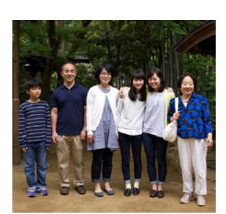

- A: How many children does Yuka have?
- B: She has three children.
- A: How many daughters does Yuka have?
- B: She has two daughters.
- A: How many sons are in her family?
- B: She has one son.

**Image 1: Kalani Image 2: Akin**

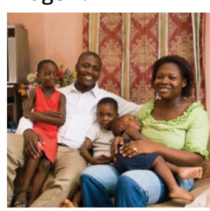

#### **Image 3: Betty**

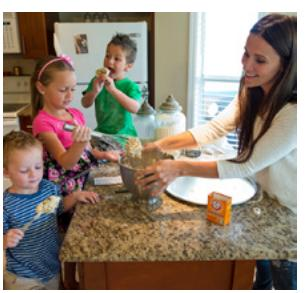

## **Activity 3: Create Your Own Conversations**

**(15–20 MINUTES)**

Haz y responde preguntas sobre las personas de tu familia. Di todo lo que puedas. Tomen turnos. Cambia de compañero y vuelve a practicar.

#### **Example**

- A: How many people are in your family?
- B: There are six people in my family.
- A: How many sisters do you have?
- B: I have three sisters.
- A: How many children does your sister have?
- B: She has six children.

#### **Evaluate**

(5–10 minutes)

Evalúa tu progreso con los objetivos y tus esfuerzos por practicar inglés a diario.

#### **Evaluate Your Progress**

I can:

• Use family words.

• Say how many people are in my family.

#### **Evaluate Your Efforts**

Usa el "Registro de estudio personal" que se encuentra en la introducción para evaluar tus esfuerzos y fijar una meta.

Comparte tu meta con un compañero.

## **Act in Faith to Practice English Daily**

"Dios es un Padre amoroso en los cielos y ama a Sus hijos perfectamente, incluyéndote a ti. Nos amó antes que nosotros lo amáramos a Él y la evidencia de Su amor se encuentra en todas partes" (*El amor de Dios*, VeniraCristo.org).

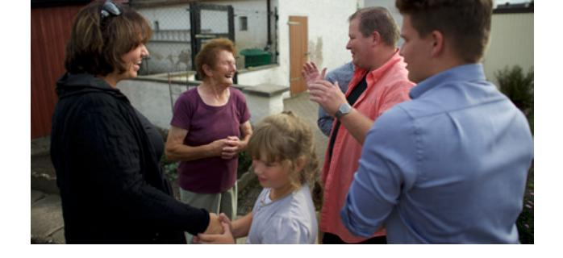