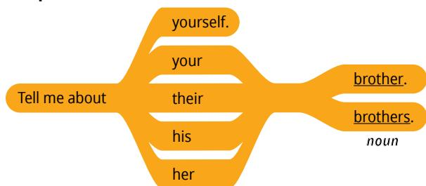
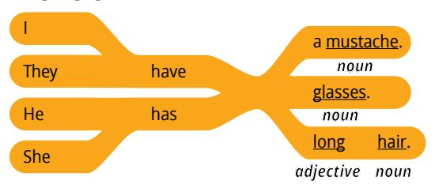
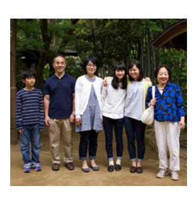
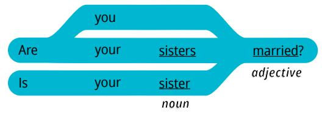
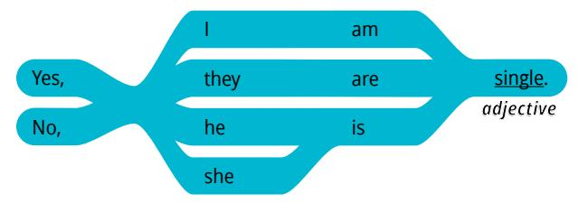
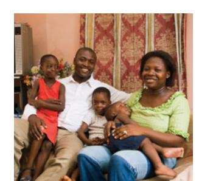
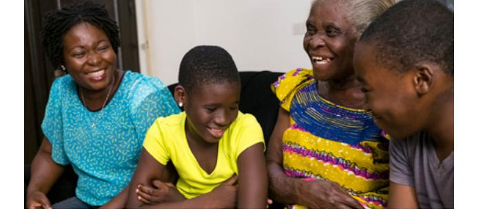

**LESSON 7**

# **Family**

**OBJETIVO: APRENDERÉ A HACER Y RESPONDER PREGUNTAS SOBRE LOS MIEMBROS DE LA FAMILIA.**

# Personal Study

Prepárate para tu grupo de conversación y completa las actividades A–E.

## **Study the Principle of Learning: Exercise Faith in Jesus Christ**

*Jesus Christ can help me do all things when I exercise faith in Him.*

Jesucristo es el Hijo de Dios y tiene todo poder. En las Escrituras leemos acerca de un hombre que ejerció fe en Jesucristo. El hijo del hombre estaba muy enfermo y nadie podía ayudarlo. El padre pidió a Jesús que lo sanara y Jesús le dijo:

"Si puedes creer, al que cree todo le es posible. Y de inmediato el padre del muchacho clamó, diciendo: Creo; ayuda mi incredulidad. […] Jesús, tomándole [al niño] de la mano, le enderezó; y se levantó" (Marcos 9:23–24, 27).

Al igual que este hombre, puedes comenzar con la esperanza y la fe que ya tienes, y luego puedes hacer crecer tu fe a través de la oración y el estudio de las Escrituras. También puedes hacer crecer tu fe conforme intentas aprender inglés. Puedes comenzar con lo que ya sabes. Céntrate en lo que puedes hacer en inglés y utilízalo todo lo que puedas. Intenta escuchar, leer, hablar y escribir en inglés todos los días. A medida que actúes con fe para dar lo mejor de ti, Él puede ayudarte para que tu fe crezca.

## **Ponder**

- ¿Cómo puedes ejercer fe en Jesucristo?
- ¿Cómo puedes hacer crecer tu fe al aprender inglés?

## **Memorize Vocabulary**

Aprende el significado y la pronunciación de cada palabra antes de ir a tu grupo de conversación.

### **Phrases**

| Tell me about … | Háblame de… |
|-----------------|-------------|

### **Pronouns**

| yourself        | ti          |
|-----------------|-------------|

### **Nouns**

| cousin/cousins* | primo/primos   |
|-----------------|----------------|
| eyes            | ojos           |
| glasses         | lentes (gafas) |
| hair            | cabello        |
| mustache        | bigote         |

### **Adjectives**

| blue    | azul                |
|---------|---------------------|
| brown   | marrón/castaño/café |
| green   | verde               |
| hazel   | pardo               |
|         |                     |
| blonde  | rubio               |
| black   | negro/moreno        |
| gray    | gris                |
| red     | pelirrojo           |
| white   | blanco              |
|         |                     |
| long    | largo               |
| short** | corto               |
| tall    | alto                |
| short*  | bajo                |
| married | casado              |
| single  | soltero             |

\*\* En inglés, la palabra *short* puede referirse a la altura o la longitud.

## **Practice Pattern 1**

Practica el uso de los patrones hasta que puedas hacer y responder preguntas con confianza. Puedes reemplazar las palabras subrayadas por palabras de la sección "Memorize Vocabulary".

A: Tell me about your (*noun*).

B: They have (*adjective*) (*noun*).

### **Requests**

#### **Answers**

## **Examples**

- A: Tell me about your brother.
- B: He has a mustache.
- A: Tell me about your sisters.
- B: They have black hair.
- A: Tell me about your aunt.
- B: She has blue eyes.

## **Practice Pattern 2**

Practica el uso de los patrones hasta que puedas hacer y responder preguntas con confianza. Intenta fijarte en estos patrones durante tu práctica diaria. Cambia de compañero y vuelve a practicar.

Q: Is your (*noun*) (*adjective*)?

A: Yes, he is (*adjective*).

#### Questions

#### Answers

## Examples

Q: Is your sister married?

A: Yes, she is married.

Q: Are you married?

A: No, I am single.

Q: Are your sisters tall?

A: No, they are short.

# (E)

## Use the Patterns

Escribe cuatro preguntas que puedas hacerle a alguien. Escribe la respuesta a cada pregunta. Léelas en voz alta.

Completa las actividades de la lección y las evaluaciones en línea en englishconnect.org/ learner/resources o en el *Cuaderno de ejercicios de EnglishConnect 1*.

## Act in Faith to Practice English Daily

Continúa practicando inglés a diario. Usa tu "Registro de estudio personal", repasa tu meta de estudio y evalúa tus esfuerzos.

# Conversation Group

## **Discuss the Principle of Learning: Exercise Faith in Jesus Christ**

(20–30 minutes)

- Lean el principio de aprendizaje de esta lección en voz alta.
- Analicen las preguntas.

Repasa la lista de vocabulario con un compañero.

Practica el patrón 1 con un compañero:

- Practica hacer preguntas.
- Practica responder preguntas.
- Practica una conversación usando los patrones.

Repite con el patrón 2.

**(10–15 MINUTES)**

Elige a una persona de uno de los grupos que aparecen a continuación. No le digas a tu compañero qué persona elegiste. Di tres enunciados sobre la persona y tu compañero debe adivinar quién es. Tomen turnos.

#### **New Vocabulary**

| bald     | calvo  |
|----------|--------|
| beard    | barba  |
|          |        |
| curly    | rizado |
| straight | liso   |
|          |        |
| old      | viejo  |
| young    | joven  |

## **Example: Maria**

A: She has blue eyes. She has gray hair. She has glasses.

B: Is it Maria?

A: Yes!

# **Image Group 1 Agnes Maria Harriet Victoria Image Group 2 Mikhail Banoy David Carlos Image Group 3 Gabriela Abeni Mei Clara Image Group 4 Kumar James Dev Paolo**

## **Activity 3: Create Your Own Conversations**

**(15–20 MINUTES)**

Elige tres miembros de la familia. Haz y responde preguntas sobre cada persona. Di todo lo que puedas. Tomen turnos. Cambia de compañero y vuelve a practicar.

## **Example**

A: Tell me about your cousin.

B: My cousin has curly hair. She has blue eyes.

A: Is your cousin tall?

B: Yes, she is tall.

A: Is your cousin married?

B: No, she is single.

#### **Evaluate**

(5–10 minutes)

Evalúa tu progreso con los objetivos y tus esfuerzos por practicar inglés a diario.

#### **Evaluate Your Progress**

I can:

• Describe myself and my family.

• Ask about someone's family.

• Describe someone's family.

#### **Evaluate Your Efforts**

Usa el "Registro de estudio personal" que se encuentra en la introducción para evaluar tus esfuerzos y fijar una meta.

Comparte tu meta con un compañero.

## **Act in Faith to Practice English Daily**

"El Señor no requiere que tengamos una fe *perfecta* para tener acceso a Su poder *perfecto*, pero nos pide que creamos. […] Todas las cosas son posibles a los que creen" (Russell M. Nelson, "Cristo ha resucitado; la fe en Él moverá montes", *Liahona*, mayo de 2021, págs. 102, 104).

