**LESSON 8**

# **Everyday Common Items**

**OBJETIVO: APRENDERÉ A USAR** *THIS***,** *THAT***,** *THESE* **Y** *THOSE* **PARA PREGUNTAR SOBRE LO QUE PERTENECE A ALGUIEN.**

# Personal Study

Prepárate para tu grupo de conversación y completa las actividades A–E.

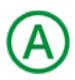

## **Study the Principle of Learning: Press Forward**

*With God's help, I can press forward even when I face obstacles.*

Todos nos enfrentamos a retos en la vida y, a veces, nuestros retos dificultan el logro de nuestros objetivos. Nefi, un profeta y líder del Libro de Mormón, afrontó muchos retos. Dedicó toda su vida a enseñar y servir a su pueblo. Sabía que enfrentarían retos difíciles y quería ayudarlos a perseverar. Nefi enseñó:

"Debéis seguir adelante con firmeza en Cristo, teniendo un fulgor perfecto de esperanza y amor por Dios y por todos los hombres" (2 Nefi 31:20).

Tú también puedes seguir adelante. "Seguir adelante con firmeza en Cristo" significa que puedes seguir intentándolo, confiando en Jesucristo, incluso cuando las cosas sean difíciles. Confía en que Él bendecirá tus esfuerzos, aunque las cosas sean difíciles o cometas errores. Por ejemplo, quizás

notes que cometes errores cuando intentas hablar en inglés o quizás te cueste recordar palabras nuevas. Puedes seguir adelante y seguir practicando cada día, confiando en que Él te ayudará a aprender. Sean cuales sean los desafíos que enfrentes, puedes seguir adelante con fe.

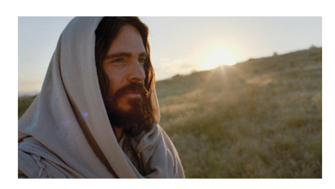

## **Ponder**

- ¿Cómo puedes "seguir adelante" al aprender inglés?
- ¿Qué te ayuda a seguir intentándolo cuando las cosas son difíciles?

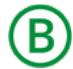

## **Memorize Vocabulary**

Aprende el significado y la pronunciación de cada palabra antes de ir a tu grupo de conversación. Intenta crear tarjetas de memorización como ayuda para memorizar nuevas palabras. Puedes usar papel o una aplicación.

### **Adverbs**

| not        | no         |
|------------|------------|

### **Pronouns**

| this/these | este/estos |
|------------|------------|
| that/those | ese/esos   |

### **Nouns**

| book/books         | libro/libros                               |
|--------------------|--------------------------------------------|
| chair/chairs       | silla/sillas                               |
| clock/clocks       | reloj/relojes (de pared o mesa)         |
| computer/computers | computadora/ computadoras               |
| key/keys           | llave/llaves                               |
| notebook/notebooks | cuaderno/cuadernos                         |
| pen/pens           | bolígrafo/bolígrafos                       |
| pencil/pencils     | lápiz/lápices                              |
| phone/phones       | teléfono/teléfonos                         |
| table/tables       | mesa/mesas                                 |
| wallet/wallets     | billetera/billeteras (cartera/carteras) |
| watch/watches      | reloj/relojes (de pulsera)                 |

## **Practice Pattern 1**

Practica el uso de los patrones hasta que puedas hacer y responder preguntas con confianza. Puedes reemplazar las palabras subrayadas por palabras de la sección "Memorize Vocabulary".

Q: What is this?

A: This is a (*noun*).

#### **Questions**

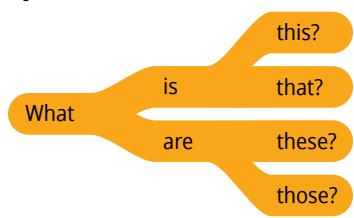

## **Answers**

| This  |     |          |
|-------|-----|----------|
| That  | is  | a watch. |
| These | are | watches. |
| Those |     | noun     |

## **Examples**

Q: What is this?

A: This is a watch.

Q: What are these?

A: These are pencils.

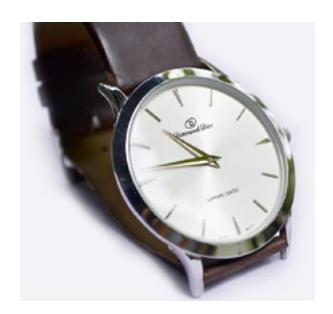

## **Practice Pattern 2**

Practica el uso de los patrones hasta que puedas hacer y responder preguntas con confianza. Intenta comprender las reglas que hay en los patrones. Piensa en cómo el inglés se asemeja o se diferencia de tu idioma.

Q: Is this my (*noun*)?

A: Yes, it is.

## **Questions**

| Is  | this  | my | book?  |
|-----|-------|----|--------|
| Are | these | my | books? |
|     |       |    | noun   |

### **Answers**

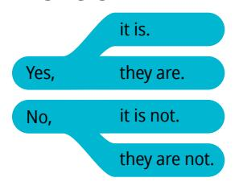

#### **Examples**

Q: Is this your book?

A: No, it is not.

Q: Are those her keys?

A: Yes, they are.

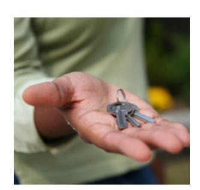

## **Use the Patterns**

Escribe cuatro preguntas que puedas hacerle a alguien. Escribe la respuesta a cada pregunta. Léelas en voz alta.

## **Additional Activities**

Completa las actividades de la lección y las evaluaciones en línea en englishconnect.org/ learner/resources o en el *Cuaderno de ejercicios de EnglishConnect 1*.

## **Act in Faith to Practice English Daily**

Continúa practicando inglés a diario. Usa tu "Registro de estudio personal", repasa tu meta de estudio y evalúa tus esfuerzos.

# Conversation Group

## **Discuss the Principle of Learning: Press Forward**

(20–30 minutes)

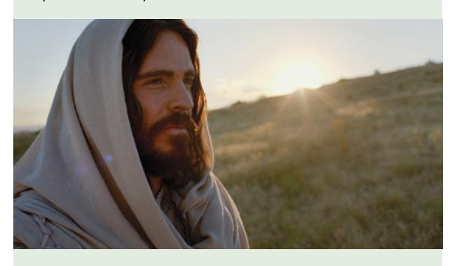

- Lean el principio de aprendizaje de esta lección en voz alta.
- Analicen las preguntas.

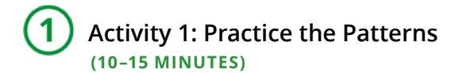

Repasa la lista de vocabulario con un compañero.

Practica el patrón 1 con un compañero:

- Practica hacer preguntas.
- Practica responder preguntas.
- Practica una conversación usando los patrones. Repite con el patrón 2.

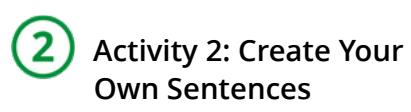

**(10–15 MINUTES)**

Fíjate en las ilustraciones y haz y responde preguntas sobre los objetos que aparecen en cada imagen. Tomen turnos. Cambia de compañero y vuelve a practicar.

### **Example**

- A: What are those?
- B: Those are books.
- A: Are those your books?
- B: No, they are not my books.

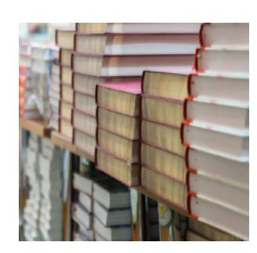

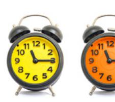

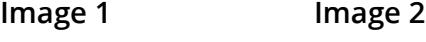

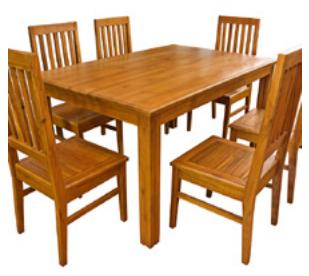

#### **Image 3 Image 4**

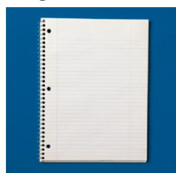

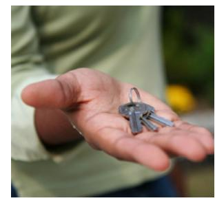

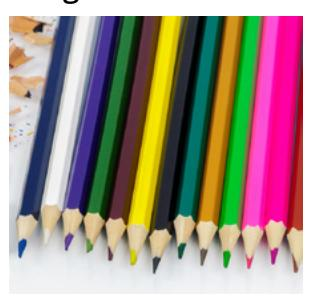

#### **Image 5 Image 6**

**Image 7**

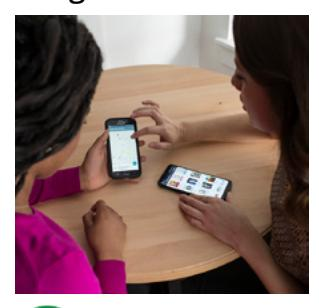

 **Activity 3: Create Your Own Conversations**

**(15–20 MINUTES)**

Elige cinco objetos del salón de clases y enséñaselos a tu compañero. Haz y responde preguntas sobre cada objeto. Tomen turnos. Cambia de compañero y vuelve a practicar.

#### **Example**

A: What is that?

B: That is a phone.

A: Is it your phone?

B: Yes, it is.

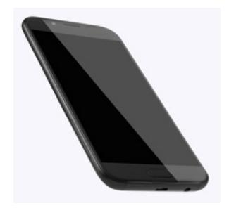

#### **Evaluate**

(5–10 minutes)

Evalúa tu progreso con los objetivos y tus esfuerzos por practicar inglés a diario.

#### **Evaluate Your Progress**

I can:

• Say what something is.

• Use *this*, *that*, *these*, and *those*.

• Ask if something belongs to someone.

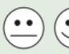

#### **Evaluate Your Efforts**

Usa el "Registro de estudio personal" que se encuentra en la introducción para evaluar tus esfuerzos y fijar una meta.

Comparte tu meta con un compañero.

## **Act in Faith to Practice English Daily**

"No te desanimes. Sigue caminando. Sigue intentándolo. Encontrarás ayuda y felicidad más adelante […]; al final todo saldrá bien. Confía en Dios y cree en las cosas buenas que están por venir" (Jeffrey R. Holland, "Sumo sacerdote de los bienes venideros", *Liahona*, enero de 2000, pág. 38).

