**LESSON 9**

# **Clothing and Colors**

**OBJETIVO: APRENDERÉ A DESCRIBIR LA ROPA DE ALGUIEN.**

# Personal Study

Prepárate para tu grupo de conversación y completa las actividades A–E.

## **Study the Principle of Learning: Counsel with the Lord**

*I improve my learning by counseling with God daily about my efforts.*

El aprendizaje es un proceso que se desarrolla a lo largo del tiempo. Dios quiere ayudarte a aprender y crecer; quiere ayudarte a aprender a dar pequeños pasos para lograr grandes cosas. El Libro de Mormón habla de un formidable hombre de fe llamado Alma, quien fue un profeta de Dios y líder de su país. Alma enseñó:

"Por medio de cosas pequeñas y sencillas se realizan grandes cosas […]. Consulta al Señor en todos tus hechos, y él te dirigirá para bien" (Alma 37:6, 37).

Dios trabaja por medio de cosas pequeñas y sencillas. Las pequeñas acciones pueden dar lugar a grandes resultados con el tiempo. Oramos a nuestro Padre Celestial en el nombre de Su Hijo, Jesucristo. A través de la oración y el estudio de las Escrituras, puedes consultar al Señor y Él puede ayudarte a elegir formas pequeñas y sencillas de mejorar. ¿Necesitas mejorar tu comprensión oral? Cuando consultes a Dios en oración, podrías optar por dedicar diez

minutos al día a practicar inglés con un amigo. ¿Tienes dificultades para recordar las palabras nuevas? Cuando consultes a Dios, podrías decidir repasar las palabras cuando vayas en el autobús. Tu esfuerzo constante te aportará "grandes cosas" al aprender inglés.

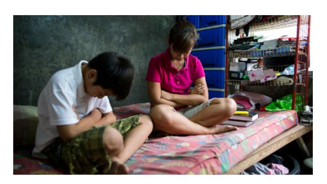

## **Ponder**

- ¿Hay en tu cultura alguna expresión parecida a las "cosas pequeñas y sencillas"?
- ¿Cómo puedes consultar a Dios acerca de tus esfuerzos?
- ¿Cuáles son las pequeñas cosas que puedes hacer a diario para aprender inglés?

## **Memorize Vocabulary**

Aprende el significado y la pronunciación de cada palabra antes de ir a tu grupo de conversación. Prueba a usar las palabras en tu vida. Piensa en cuándo y dónde podrías usar estas palabras.

### **Pronouns**

| I'm          | Soy/estoy             |
|--------------|-----------------------|
| he's         | él es/está            |
| she's        | ella es/está          |
| they're      | ellos/ellas son/están |

### **Verbs**

| wearing      | vestir/llevar         |
|--------------|-----------------------|
| looking for  | buscar                |

### **Pronouns**

| this/these   | este/estos            |
|--------------|-----------------------|
| that/those   | ese/esos              |

### **Nouns**

| clothing     | ropa                  |
|--------------|-----------------------|
| color/colors | color/colores         |

### **Nouns**

| coat/coats       | abrigo/abrigos   |
|------------------|------------------|
| dress/dresses    | vestido/vestidos |
| pants            | pantalones       |
| shirt/shirts     | camisa/camisas   |
| shoe/shoes       | zapato/zapatos   |
| skirt/skirts     | falda/faldas     |
| sweater/sweaters | suéter/suéteres  |

### **Adjectives**

| orange | naranja  |
|--------|----------|
| purple | morado   |
| yellow | amarillo |

En la lección 7 puedes ver más *colors*.

## **Practice Pattern 1**

Practica el uso de los patrones hasta que puedas hacer y responder preguntas con confianza. Puedes reemplazar las palabras subrayadas por palabras de la sección "Memorize Vocabulary".

Q: What are you wearing? A: I'm wearing a (*adjective*) (*noun*).

#### **Questions**

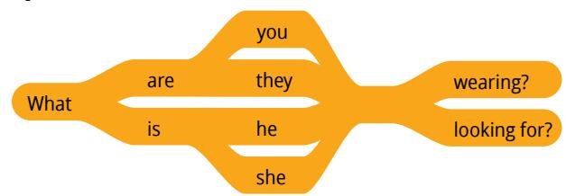

## **Answers**

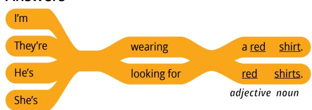

## **Examples**

Q: What is he wearing?

A: He's wearing a red shirt.

Q: What is she wearing?

A: She's wearing an orange skirt.

Q: What are they looking for?

A: They're looking for black shoes.

## **Practice Pattern 2**

Practica el uso de los patrones hasta que puedas hacer y responder preguntas con confianza.

Q: Do you like this (*adjective*) (*noun*)? A: Yes, I like that (*adjective*) (*noun*).

### **Questions**

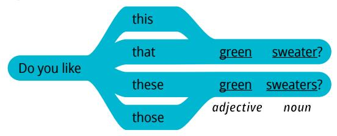

## **Answers**

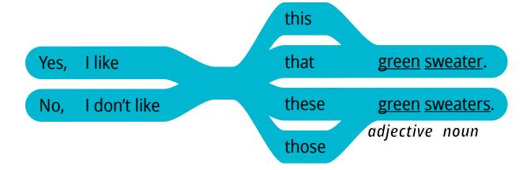

## **Examples**

- Q: Do you like this green sweater?
- A: No, I don't like that green sweater.
- Q: Do you like these red shoes?
- A: Yes, I like those shoes.

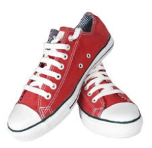

## **Use the Patterns**

| Escribe cuatro preguntas que puedas hacerle a         |
|-------------------------------------------------------|
| alguien. Escribe la respuesta a cada pregunta. Léelas |
| en voz alta.                                          |

| Additional Activities |  |
|-----------------------|--|
|-----------------------|--|

Completa las actividades de la lección y las evaluaciones en línea en englishconnect.org/ learner/resources o en el *Cuaderno de ejercicios de EnglishConnect 1*.

#### **Act in Faith to Practice English Daily**

Continúa practicando inglés a diario. Usa tu "Registro de estudio personal", repasa tu meta de estudio y evalúa tus esfuerzos.

# Conversation Group

## **Discuss the Principle of Learning: Counsel with the Lord**

(20–30 minutes)

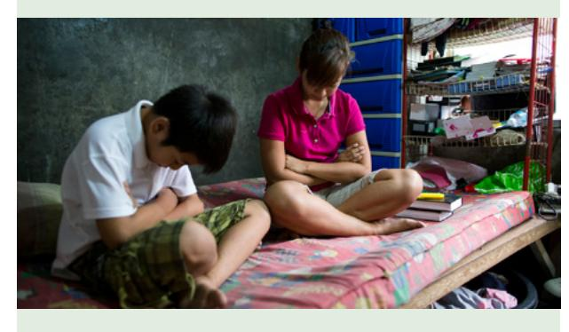

- Lean el principio de aprendizaje de esta lección en voz alta.
- Analicen las preguntas.

Repasa la lista de vocabulario con un compañero.

Practica el patrón 1 con un compañero:

- Practica hacer preguntas.
- Practica responder preguntas.
- Practica una conversación usando los patrones.

Repite con el patrón 2.

#### **New Vocabulary**

| belt/belts | cinturón/cinturones |
|------------|---------------------|
| sock/socks | calcetín/calcetines |
| suit/suits | traje/trajes        |
| tie/ties   | corbata/corbatas    |

#### **Part 1**

Haz y responde preguntas sobre tu ropa. Tomen turnos. Cambia de compañero y vuelve a practicar.

#### **Example**

- A: What are you wearing?
- B: I'm wearing blue pants, a white shirt, yellow socks, and red shoes.

#### **Part 2**

Fíjate en las ilustraciones y haz y responde preguntas sobre la ropa de cada persona. Di todo lo que puedas. Tomen turnos. Cambia de compañero y vuelve a practicar.

#### **Example: Eliana**

- A: What is Eliana wearing?
- B: She's wearing a gray shirt and black pants.

**Image 1: Nadia Image 2: Obasi**

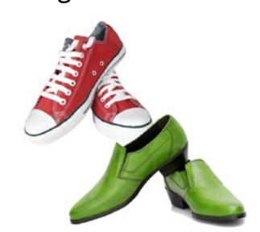

**Image 1 Image 2**

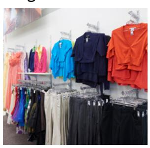

**Image 3: Mateo Image 4: Hina**

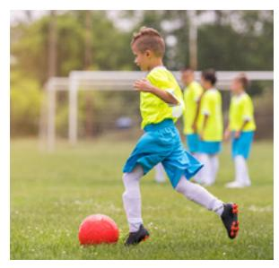

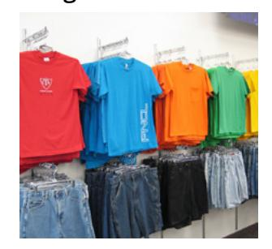

**Image 3 Image 4**

 **Activity 3: Create Your Own Conversations (15–20 MINUTES)**

Hagan una dramatización. El compañero A trabaja en una tienda de ropa y el compañero B está comprando ropa y zapatos. Haz y responde preguntas sobre los objetos que aparecen en cada imagen. Intercámbiense los roles. Cambia de compañero y vuelve a practicar.

**Image 5**

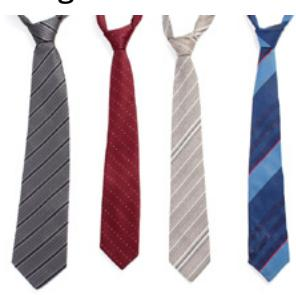

## **Example**

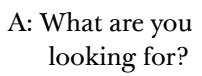

- B: I'm looking for shoes.
- A: Do you like these brown shoes?
- B: No, I don't like those brown shoes.

#### **Evaluate**

(5–10 minutes)

Evalúa tu progreso con los objetivos y tus esfuerzos por practicar inglés a diario.

#### **Evaluate Your Progress**

I can:

• Talk about clothing and colors.

• Say what I and others are wearing.

## **Evaluate Your Efforts**

Usa el "Registro de estudio personal" que se encuentra en la introducción para evaluar tus esfuerzos y fijar una meta.

Comparte tu meta con un compañero.

#### **Act in Faith to Practice English Daily**

"Podemos orar a nuestro Padre Celestial y recibir orientación y dirección […] y ser capaces de lograr cosas que simplemente no podríamos hacer por nosotros mismos. […]

"Oren […]. ¡Y luego, escuchen. Anoten las ideas que acudan a su mente; escriban sus sentimientos y denles seguimiento con las acciones que se les indique tomar" (Russell M. Nelson, "Revelación para la Iglesia, revelación para nuestras vidas", *Liahona*, mayo de 2018, págs. 94–95).

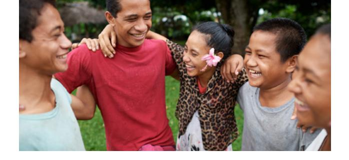