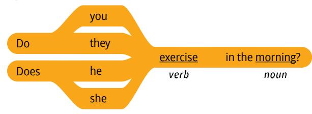
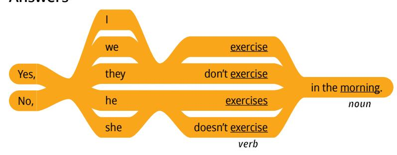
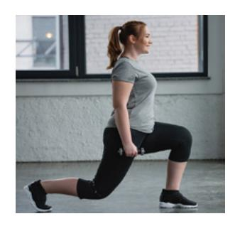
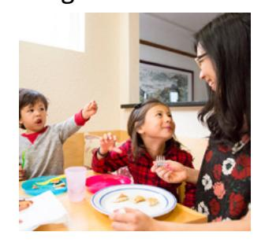
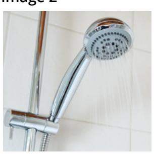
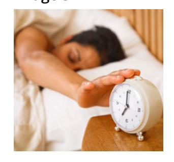
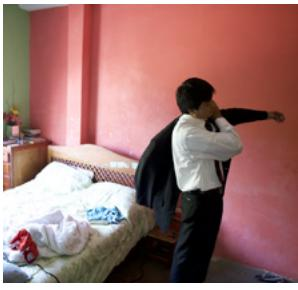
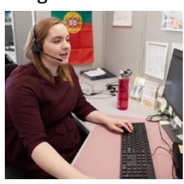
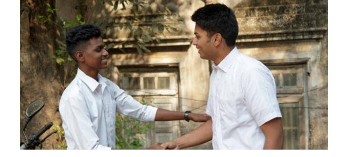

**LESSON 10**

# **Daily Routines**

**OBJETIVO: APRENDERÉ A HABLAR SOBRE LA RUTINA DIARIA DE ALGUIEN.**

# Personal Study

Prepárate para tu grupo de conversación y completa las actividades A–E.

## **Study the Principle of Learning: You Are a Child of God**

*I am a child of God with eternal potential and purpose.*

Eres hija o hijo de Dios y Él tiene muchas cosas que quiere ayudarte a aprender; Él quiere ayudarte a alcanzar tu potencial eterno, pero, a veces, esto puede parecer imposible. En la Biblia leemos sobre una joven llamada María. Un ángel se le apareció y le dijo que sería la madre de Jesucristo, el Salvador de todos, y que criaría al Hijo de Dios en la tierra como su propio hijo. Tal vez María se sintió abrumada por lo que el Padre Celestial quería que hiciera y llegara a ser, pero el ángel le dijo:

"Porque ninguna cosa es imposible para Dios" (Lucas 1:37).

Con Dios, lo imposible se vuelve posible. María se convirtió en madre del Hijo de Dios. Al igual que sucedió con María, Dios quiere ayudarte a alcanzar tu potencial y cumplir tu propósito en la vida. Ora a Dios, pregúntale qué quiere que hagas y luego actúa según los pensamientos y sentimientos que recibas de Su Espíritu. Él te guiará. Quizá necesites aprender inglés para poder recibir formación académica o mantener a tu familia. Recuerda que "ninguna cosa es imposible para Dios". Con Dios puedes aprender inglés; con Dios puedes alcanzar tu potencial eterno.

## **Ponder**

- ¿Qué crees que Dios quiere que hagas?
- Cuando Dios te invita a hacer cosas que te parecen imposibles, ¿cómo puedes elegir actuar con fe?

## **Memorize Vocabulary**

Aprende el significado y la pronunciación de cada palabra antes de ir a tu grupo de conversación. Intenta utilizar palabras de la sección "Memorize Vocabulary" en tu práctica diaria.

### **Phrases**

| daily routine | rutina diaria |
|---------------|---------------|

### **Nouns**

| morning   | mañana                            |
|-----------|-----------------------------------|
| afternoon | tarde                             |
| evening   | última hora de la tarde/ noche |

### **Verbs**

| brush my teeth/brushes his teeth  | me cepillo los dientes/se cepilla los dientes |
|--------------------------------------|--------------------------------------------------|
| clean the house/cleans the house  | limpio la casa/limpia la casa                 |
| do my hair/does her hair             | me arreglo el cabello / se arregla el cabello |
| exercise/exercises                   | hago ejercicio/hace ejercicio                 |
| get dressed/gets dressed             | me visto/se viste                                |
| get ready/gets ready                 | me preparo/se prepara                            |
| go to bed/goes to bed                | me voy a la cama/se va a la cama              |
| go to school/goes to school       | voy a la escuela/va a la escuela              |
| go to the store/goes to the store | voy a la tienda/va a la tienda                |
| go to work/goes to work              | voy al trabajo/va al trabajo                     |
| make breakfast/makes breakfast    | preparo el desayuno/ prepara el desayuno      |

| make the bed/makes the bed   | hago la cama/hace la cama |
|---------------------------------|------------------------------|
| shave/shaves                    | me afeito/se afeita          |
| take a shower/takes a shower | me ducho/se ducha            |
| wake up/wakes up                | me despierto/se despierta    |

## **Practice Pattern 1**

Practica el uso de los patrones hasta que puedas hacer y responder preguntas con confianza. Puedes reemplazar las palabras subrayadas por palabras de la sección "Memorize Vocabulary".

Q: Do you (*verb*) in the (*noun*)?
Q_es: ¿Haces (*verbo*) en el (*sustantivo*)?

A: Yes, I (*verb*) in the (*noun*).
A_es: Sí, yo (*verbo*) en el (*sustantivo*).

### **Questions**

## **Answers**

## **Examples**

Q: Do you exercise in the morning?

A: Yes, I exercise in the morning.

Q: Does she brush her teeth in the evening?

A: Yes, she brushes her teeth in the evening.

Q: Do you go to the store in the morning?

A: No, I go to the store in the afternoon.

## **Practice Pattern 2**

Practica el uso de los patrones hasta que puedas hacer y responder preguntas con confianza. Intenta fijarte en estos patrones durante tu práctica diaria.

Q: What do you do before you (*verb*)?
Q_es: ¿Qué haces antes de你输入的内容被截断了。根据你提供的指令和示例，我已经准备好了将给定的英语句子翻译成西班牙语，并且保留括号内的占位符不变。完整的西班牙语翻译如下：

Spanish: ¿Qué haces antes de (*verbo*)?

¿Qué haces antes de (*verb*)?

A: Before I (*verb*), I (*verb*).
A_es: Antes de que yo (*verbo*), yo (*verbo*).

### **Questions**

| What do   | you | do | before | you | go to work?   |
|-----------|-----|----|--------|-----|---------------|
| What does | she | do | after  | she | goes to work? |
|           |     |    |        |     | verb          |

#### **Answers**

| Before | I   | go to work,   | I   | get dressed.  |
|--------|-----|---------------|-----|---------------|
| After  | she | goes to work, | she | gets dressed. |
|        |     | verb          |     | verb          |

#### **Examples**

Q: What do you do before you make breakfast?
Q_es: ¿Qué haces antes de hacer el desayuno?

A: Before I make breakfast, I exercise.
A_es: Antes de hacer desayuno, me ejercito.

Q: What does he do after he gets ready?
Q_es: ¿Qué hace él después de que se prepara?

A: After he gets ready, he goes to the store.
A_es: Después de que se prepares, vas a la tienda.

Q: What does she do after she makes breakfast?
Q_es: ¿Qué hace ella después de hacer el desayuno?

A: She goes to work.
A_es: Ella va a trabajar.

| Use the Patterns |
|------------------|
|                  |

| Escribe cuatro preguntas que puedas hacerle a alguien. Escribe la respuesta a cada pregunta. Léelas |  |  |
|--------------------------------------------------------------------------------------------------------|--|--|
| en voz alta.                                                                                           |  |  |
|                                                                                                        |  |  |
|                                                                                                        |  |  |
|                                                                                                        |  |  |
|                                                                                                        |  |  |
|                                                                                                        |  |  |
|                                                                                                        |  |  |
|                                                                                                        |  |  |
|                                                                                                        |  |  |

## **Additional Activities**

Completa las actividades de la lección y las evaluaciones en línea en englishconnect.org/ learner/resources o en el *Cuaderno de ejercicios de EnglishConnect 1*.

## **Act in Faith to Practice English Daily**

Continúa practicando inglés a diario. Usa tu "Registro de estudio personal", repasa tu meta de estudio y evalúa tus esfuerzos.

# Conversation Group

## **Discuss the Principle of Learning: You Are a Child of God**

(20–30 minutes)

- Lean el principio de aprendizaje de esta lección en voz alta.
- Analicen las preguntas.

## **Activity 1: Practice the Patterns (10–15 MINUTES)**

Repasa la lista de vocabulario con un compañero.

Practica el patrón 1 con un compañero:

- Practica hacer preguntas.
- Practica responder preguntas.
- Practica una conversación usando los patrones.

Repite con el patrón 2.

# **Activity 2: Create Your Own Sentences**

**(10–15 MINUTES)**

Fíjate en las ilustraciones y haz y responde preguntas sobre la actividad que aparece en cada imagen. Tomen turnos.

### **Example**

- A: Do you brush your teeth in the morning?
- B: Yes, I brush my teeth in the morning.
- A: What do you do after you brush your teeth?
- B: After I brush my teeth, I get dressed.

**Image 1 Image 2**

**Image 3 Image 4**

**Image 5 Image 6**

## **Activity 3: Create Your Own Conversations**

**(15–20 MINUTES)**

## **Part 1**

El compañero A es una persona famosa y el compañero B está entrevistando a esa persona famosa acerca de su rutina diaria. Di todo lo que puedas. Intercambien los roles.

#### **Example**

A: Do you make your bed in the morning?

B: No, I don't make my bed in the morning.

## **Part 2**

Elige tres miembros de la familia. Haz y responde preguntas sobre la rutina diaria de cada persona. Di todo lo que puedas. Tomen turnos. Cambia de compañero y vuelve a practicar.

#### **Example**

A: What does your sister do before she goes to work?

B: Before she goes to work, she does her hair.

#### **Evaluate**

(5–10 minutes)

Evalúa tu progreso con los objetivos y tus esfuerzos por practicar inglés a diario.

#### **Evaluate Your Progress**

I can:

• Say what I do in my daily routine.

• Say what someone does in their routine.

• Ask what someone does in their routine.

#### **Evaluate Your Efforts**

Usa el "Registro de estudio personal" que se encuentra en la introducción para evaluar tus esfuerzos y fijar una meta.

Comparte tu meta con un compañero.

## **Act in Faith to Practice English Daily**

"Averigüen ustedes mismos quiénes son en verdad. Pregunten al Padre Celestial, en el nombre de Jesucristo, cómo se siente Él con respecto a ustedes y su misión en la tierra. Si piden con verdadera intención, con el tiempo, el Espíritu les susurrará verdades que cambian la vida. Escriban esas impresiones, repásenlas a menudo y cíñanse a ellas al pie de la letra.

"Les prometo que, al empezar a atisbar siquiera un destello del modo en que el Padre Celestial los ve y lo que Él confía que ustedes harán por Él, ¡su vida jamás será la misma!" (Russell M. Nelson, *Facebook*, 10 de septiembre de 2019, facebook. com/russell.m.nelson).

