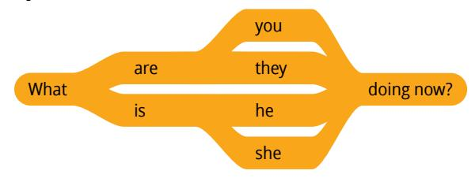
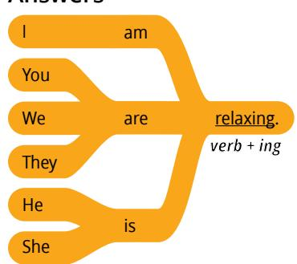
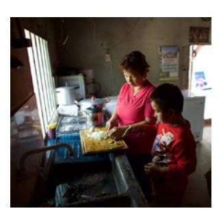
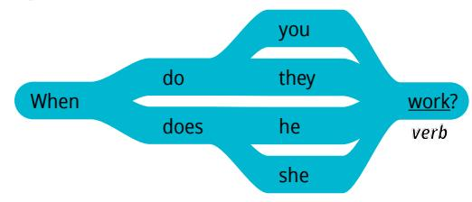
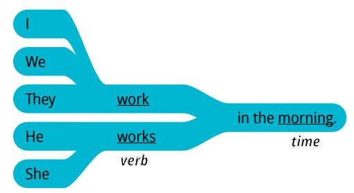
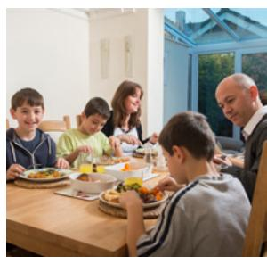
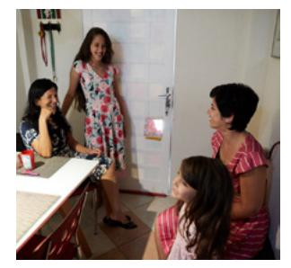

**LESSON 11**

# **My Activities**

**OBJETIVO: APRENDERÉ A HABLAR SOBRE LO QUE ALGUIEN ESTÁ HACIENDO EN EL MOMENTO Y SU RUTINA.**

# Personal Study

Prepárate para tu grupo de conversación y completa las actividades A–E.

## **Study the Principle of Learning: Exercise Faith in Jesus Christ**

*Jesus Christ can help me do all things as I exercise faith in Him.*

Nefi era un profeta del Libro de Mormón. Cuando Nefi era más joven, él y sus hermanos recibieron la orden de obtener un libro sagrado. Ese libro era importante porque enseñaba sobre el plan de Dios y la función de Jesucristo. El libro pertenecía a un hombre inicuo llamado Labán. Nefi y sus hermanos intentaron pedírselo, pero Labán les dijo que no. Nefi y sus hermanos intentaron comprarlo, pero Labán les dijo que no y les robó todo su dinero. Tras fracasar dos veces, los hermanos de Nefi se enojaron y quisieron rendirse.

Nefi animó a sus hermanos diciéndoles: "Subamos de nuevo a Jerusalén, y seamos fieles en guardar los mandamientos del Señor, pues he aquí, él es más poderoso que toda la tierra" (1 Nefi 4:1).

La confianza de Nefi en Dios lo ayudó a intentarlo por tercera vez. En esa ocasión, con la ayuda de Dios, pudo conseguir el libro sagrado. La experiencia de

Nefi nos enseña que intentar las cosas y fracasar a veces forman parte de hacer algo difícil. Aprender un nuevo idioma es difícil y hay que invertir cientos de horas. Quizás intentaste aprender inglés con anterioridad y no te fue bien; quizás faltaste a tu reunión semanal o te olvidaste de estudiar. Vuelve a intentarlo cuando fracases. Cuando ejerces fe en Jesucristo, Él puede convertir los fracasos en éxitos.

## **Ponder**

- ¿Cómo podemos ser como Nefi y seguir intentándolo cuando fracasamos?
- ¿Cómo puede nuestra fe en Jesucristo ayudarnos a aprender de nuestros fracasos?

## **Memorize Vocabulary**

Aprende el significado y la pronunciación de cada palabra antes de ir a tu grupo de conversación. Intenta usar las nuevas palabras en una conversación o en un mensaje para alguien que sepa inglés.

### **Adverbs**

| now | ahora |
|-----|-------|

### **Verbs**

| come home/coming home                      | venir a casa/viniendo a casa                          |
|--------------------------------------------|----------------------------------------------------------|
| do homework/doing homework              | hacer las tareas/haciendo las tareas                  |
| eat dinner/eating dinner                   | cenar/cenando                                            |
| exercise/exercising                        | hacer ejercicio/haciendo ejercicio                    |
| get ready for bed/getting ready for bed | prepararse para la cama/ preparándose para la cama |
| go to bed/going to bed                     | ir a la cama/yendo a la cama                          |
| make lunch/making lunch                    | preparar el almuerzo/ preparando el almuerzo          |
| pray/praying                               | orar/orando                                              |
| relax/relaxing                             | relajar/relajándose                                      |
| take a nap/taking a nap                    | dormir una siesta/ durmiendo una siesta               |
| take a walk/taking a walk                  | dar un paseo/dando un paseo                           |
| visit my friends/visiting my friends    | visitar a mis amigos/ visitando a mis amigos          |
| watch movies/watching movies            | ver películas/viendo películas                        |
| work/working                               | trabajar/trabajando                                      |
|                                            |                                                          |

### **Time**

| morning   | mañana                            |
|-----------|-----------------------------------|
| afternoon | tarde                             |
| evening   | última hora de la tarde/ noche |

## **Practice Pattern 1**

Practica el uso de los patrones hasta que puedas hacer y responder preguntas con confianza.

Q: What are you doing now?
Q_es: ¿Qué estás haciendo ahora?

A: I am (*verb* + ing).
A_es: Estoy (*verb* + ing).

#### **Questions**

## **Answers**

## **Examples**

- Q: What are you doing now?
- Q_es: ¿Qué estás haciendo ahora?
- A: I am relaxing.
- A_es: Me estoy relajando.
- Q: What are they doing now?
- Q_es: ¿Qué están haciendo ahora?
- A: They are making dinner.
- A_es: Están haciendo la cena.
- Q: What is he doing now?
- Q_es: ¿Qué está haciendo ahora?
- A: He is visiting his friends.
- A_es: Él está visitando a sus amigos.

## **Practice Pattern 2**

Practica el uso de los patrones hasta que puedas hacer y responder preguntas con confianza. Intenta realizar las actividades 1 y 2 del grupo de conversación antes de que tu grupo se reúna.

Q: When do you (*verb*)?
Q_es: Cuándo doy tú (*verbo*)?

A: I (*verb*) in the (*time*).
A_es: Yo (*verbo*) en el (*hora*).

#### **Questions**

#### **Answers**

#### **Examples**

Q: When do you work?
Q_es: ¿Cuándo trabajas?

A: I work in the morning.
A_es: Trabajo por la mañana.

Q: When do they eat dinner?
Q_es: ¿Cuándo comen la cena?

A: They eat dinner in the evening.
A_es: Ellos comen cena por la noche.

Q: When does she do homework?
Q_es: ¿Cuándo hace tarea?

A: She does homework in the afternoon.
A_es: Ella hace tarea por la tarde.

## **Use the Patterns**

Escribe cuatro preguntas que puedas hacerle a alguien. Escribe la respuesta a cada pregunta. Léelas en voz alta.

## **Additional Activities**

Completa las actividades de la lección y las evaluaciones en línea en englishconnect.org/ learner/resources o en el *Cuaderno de ejercicios de EnglishConnect 1*.

## **Act in Faith to Practice English Daily**

Continúa practicando inglés a diario. Usa tu "Registro de estudio personal", repasa tu meta de estudio y evalúa tus esfuerzos.

# Conversation Group

## **Discuss the Principle of Learning: Exercise Faith in Jesus Christ**

(20–30 minutes)

- Lean el principio de aprendizaje de esta lección en voz alta.
- Analicen las preguntas.

Repasa la lista de vocabulario con un compañero.

Practica el patrón 1 con un compañero:

- Practica hacer preguntas.
- Practica responder preguntas.
- Practica una conversación usando los patrones. Repite con el patrón 2.

## **Activity 2: Create Your Own Sentences**

**(10–15 MINUTES)**

Fíjate en las ilustraciones y haz y responde preguntas sobre lo que las personas que aparecen en cada imagen están haciendo en ese momento. Tomen turnos. Cambia de compañero y vuelve a practicar.

#### **Example 1: Igor**

A: What is Igor doing now?

B: He is eating lunch.

## **Example 2: Hua and Bao**

A: What are Hua and Bao doing now?

B: They are cooking dinner.

**Image 1: Imani Image 2: Sophie**

**Image 3: Raquel and Vinny**

**Image 4: Lily and Suri**

**Image 5: Luis's Family**

**Image 6: Maria's Family**

## **Activity 3: Create Your Own Conversations**

**(15–20 MINUTES)**

Fíjate en las ilustraciones y haz y responde preguntas sobre cuándo realizas la actividad que aparece en cada imagen. Tomen turnos. Cambia de compañero y vuelve a practicar.

### **Example**

- A: When do you do homework?
- B: I do homework in the evening.

**Image 1 Image 2**

**Image 3 Image 4**

#### **Image 5 Image 6**

**Image 7**

#### **Evaluate**

(5–10 minutes)

Evalúa tu progreso con los objetivos y tus esfuerzos por practicar inglés a diario.

#### **Evaluate Your Progress**

I can:

• Say what I am doing now.
• _es: Decir qué estoy haciendo ahora.

• Talk about what others are doing now.
• _es: Hablar sobre qué están haciendo otros ahora.

• Describe daily routines.
• _es: Describir rutinas diarias.

#### **Evaluate Your Efforts**

Usa el "Registro de estudio personal" que se encuentra en la introducción para evaluar tus esfuerzos y fijar una meta.

Comparte tu meta con un compañero.

## **Act in Faith to Practice English Daily**

"Gracias a Jesucristo, nuestros fracasos no tienen por qué definirnos; pueden refinarnos" (Dieter F. Uchtdorf, "Dios entre nosotros", *Liahona*, mayo de 2021, pág. 9).

