**LESSON 12**

# **Time and Calendar**

**OBJETIVO: APRENDERÉ A HABLAR SOBRE LA HORA Y LA FECHA.**

## Personal Study

Prepárate para tu grupo de conversación y completa las actividades A–E.

## **Study the Principle of Learning: Take Responsibility**

*I have the power to choose, and I am responsible for my own learning.*

Eres un agente y tienes poder para actuar por ti mismo. A menudo tendemos a esperar a que los líderes, los maestros u otras personas nos digan lo que tenemos que hacer. Queremos que nos den instrucciones paso a paso. Dios quiere que comprendamos que, como Sus hijos, tenemos poder en nuestro interior para tomar buenas decisiones y seguir adelante.

Dios explica que Sus hijos "deben estar anhelosamente consagrados a una causa buena, y hacer muchas cosas de su propia voluntad y efectuar mucha justicia; porque el poder está en ellos, y en esto vienen a ser sus propios agentes. Y en tanto que los hombres hagan lo bueno, de ninguna manera perderán su recompensa" (Doctrina y Convenios 58:27–28).

El poder está en ti y puedes asumir la responsabilidad de tu aprendizaje. Si el maestro está enfermo y no puede asistir, puedes optar por practicar con otros

alumnos. Si no entiendes algo, puedes pedir ayuda. Si necesitas ideas para estudiar mejor, puedes preguntar a otros alumnos de tu grupo qué les funciona a ellos. Tienes el poder de elegir y actuar. Con Dios, tú decides lo que vas a aprender y quién vas a llegar a ser.

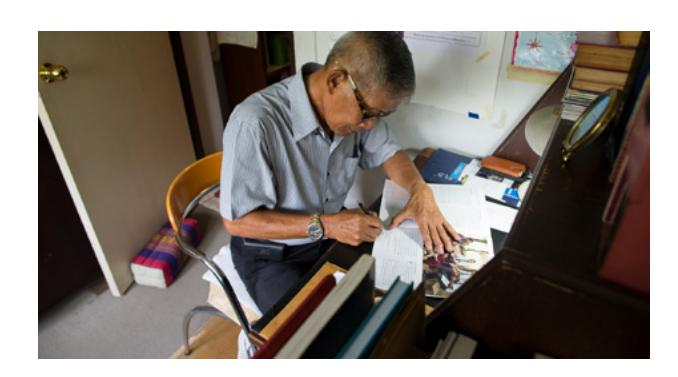

## **Ponder**

- ¿Cuál crees que es tu responsabilidad como alumno?
- ¿Qué puedes hacer para asumir la responsabilidad de tu propio aprendizaje?

## **Memorize Vocabulary**

Aprende el significado y la pronunciación de cada palabra antes de ir a tu grupo de conversación. Intenta aprender más palabras que puedas utilizar en los patrones. Podrías utilizar un diccionario o un traductor o preguntar a un amigo.

### **Nouns**

| date | fecha   |
|------|---------|
| day  | día     |
| time | hora    |

### **Prepositions**

| at   | a/a las |
|------|---------|
| on   | el      |

### **Time**

| noon                   | mediodía            |
|------------------------|---------------------|
| midnight               | medianoche          |
| five o'clock/5:00 a.m. | cinco en punto/5:00 |
| five thirty/5:30 p.m.  | cinco y media/17:30 |

### **Days**

| Sunday                | domingo           |
|-----------------------|-------------------|
| Monday                | lunes             |
| Tuesday               | martes            |
| Wednesday             | miércoles         |
| Thursday              | jueves            |
| Friday                | viernes           |
| Saturday              | sábado            |
| Saturday, January 1st | sábado 1 de enero |

### **Verbs**

| clean the house | limpiar la casa   |
|-----------------|-------------------|
| get the mail    | recoger el correo |
| wash the dishes | lavar la vajilla  |

En la lección 11 puedes ver más *verbs*.

## **Practice Pattern 1**

Practica el uso de los patrones hasta que puedas hacer y responder preguntas con confianza. Puedes reemplazar las palabras subrayadas por palabras de la sección "Memorize Vocabulary".

Q: What time is it? A: It's (*time*).

### **Questions**

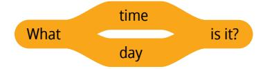

### **Answers**

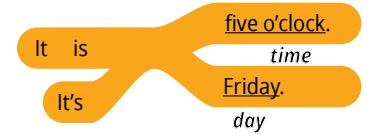

### **Examples**

Q: What time is it? A: It's five o'clock.

Q: What day is it? A: It is Sunday.

Q: What day is it? A: It's February 5th.

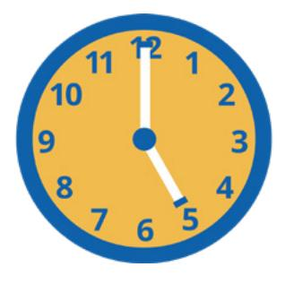

## **Practice Pattern 2**

Practica el uso de los patrones hasta que puedas hacer y responder preguntas con confianza. Intenta usar los patrones en una conversación con un amigo. Podrían hablar o enviarse mensajes.

Q: When do you (*verb*)? A: I (*verb*) on (*day*).

#### **Questions**

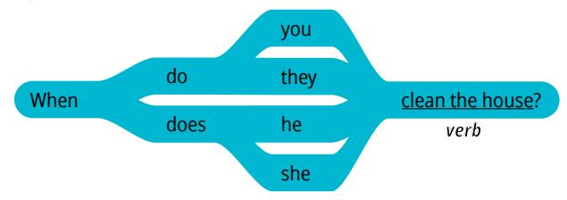

#### **Answers**

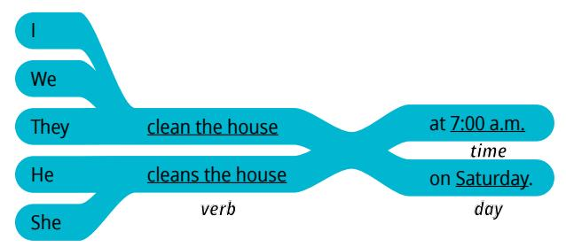

#### **Examples**

Q: When do they clean the house? A: They clean the house on Monday.

Q: When do you get the mail?

A: I get the mail at noon.

Q: When does he wash the dishes?

A: He washes the dishes at 5:30 p.m.

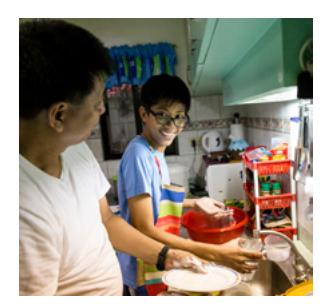

| _ |
|---|
|   |
| _ |
|   |

## **Use the Patterns**

Escribe cuatro preguntas que puedas hacerle a alguien. Escribe la respuesta a cada pregunta. Léelas en voz alta.

| Additional Activities |  |
|-----------------------|--|
|-----------------------|--|

Completa las actividades de la lección y las evaluaciones en línea en englishconnect.org/ learner/resources o en el *Cuaderno de ejercicios de EnglishConnect 1*.

## **Act in Faith to Practice English Daily**

Continúa practicando inglés a diario. Usa tu "Registro de estudio personal", repasa tu meta de estudio y evalúa tus esfuerzos.

# Conversation Group

## **Discuss the Principle of Learning: Take Responsibility**

(20–30 minutes)

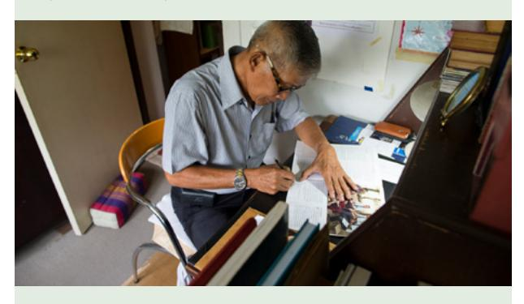

- Lean el principio de aprendizaje de esta lección en voz alta.
- Analicen las preguntas.

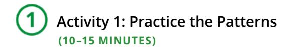

Repasa la lista de vocabulario con un compañero.

Practica el patrón 1 con un compañero:

- Practica hacer preguntas.
- Practica responder preguntas.
- Practica una conversación usando los patrones.

Repite con el patrón 2.

# **Activity 2: Create Your Own Sentences**

**(10–15 MINUTES)**

## **New Vocabulary**

Is it Friday, June 9th? ¿Es viernes 9 de junio?

Mira el calendario. Elige un día. No le digas a tu compañero qué día elegiste. Haz y responde preguntas para adivinar el día. Tomen turnos.

|    |    |    |    | 1  | 2  | 3  |
|----|----|----|----|----|----|----|
| 4  | 5  | 6  | 7  | 8  | 9  | 10 |
| 11 | 12 | 13 | 14 | 15 | 16 | 17 |
| 18 | 19 | 20 | 21 | 22 | 23 | 24 |
| 25 | 26 | 27 | 28 | 29 | 30 | +  |

## **Example**

A: What day is it?

B: It's Wednesday.

A: Is it Wednesday, June 7th?

B: No.

A: Is it Wednesday, June 14th?

B: Yes, it's Wednesday, June 14th.

|    | 2424 | J  | UN | IE | 0.00 | 20080 |
|----|------|----|----|----|------|-------|
| S  | М    | T  | w  | Th | F    | S     |
|    |      |    |    | 1  | 2    | 3     |
| 4  | 5    | 6  | 7  | 8  | 9    | 10    |
| 11 | 12   | 13 | 14 | 15 | 16   | 17    |
| 18 | 19   | 20 | 21 | 22 | 23   | 24    |
| 25 | 26   | 27 | 28 | 29 | 30   |       |
|    |      |    |    |    |      |       |

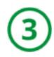

## **Activity 3: Create Your Own Conversations**

**(15–20 MINUTES)**

## **Part 1**

Haz y responde preguntas sobre cuándo haces algo. Utiliza el vocabulario de esta lección y de la lección 11. Di todo lo que puedas. Tomen turnos. Cambia de compañero y vuelve a practicar.

#### **Example**

- A: When do you wake up?
- B: I wake up at 7:00 a.m.
- A: When do you visit your friends?
- B: I visit my friends on Saturday at 5:30 p.m.

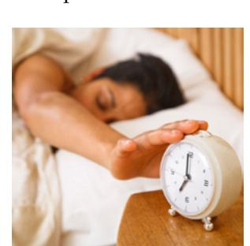

## **Part 2**

Haz y responde preguntas sobre cuándo celebras eventos importantes. Habla sobre eventos importantes de la lista o piensa en otros eventos importantes. Di todo lo que puedas. Tomen turnos.

#### **New Vocabulary**

| anniversary | aniversario |
|-------------|-------------|
| celebrate   | celebrar    |
| holiday     | día festivo |

#### **Eventos importantes**

- Tu cumpleaños
- El cumpleaños de un miembro de la familia
- Un aniversario
- Tu día festivo favorito (Navidad, Día de la Independencia, Año Nuevo)

#### **Example**

- A: When do you celebrate your sister's birthday?
- B: I celebrate my sister's birthday on December 10th.

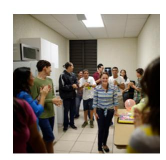

## **Evaluate**

(5–10 minutes)

Evalúa tu progreso con los objetivos y tus esfuerzos por practicar inglés a diario.

## **Evaluate Your Progress**

I can:

• Say the time and date.

• Ask for the time and date.

#### **Evaluate Your Efforts**

Usa el "Registro de estudio personal" que se encuentra en la introducción para evaluar tus esfuerzos y fijar una meta.

Comparte tu meta con un compañero.

## **Act in Faith to Practice English Daily**

"El poder de elegir está dentro de cada uno de nosotros, y nada puede arrebatárnoslo. Tenemos poder para elegir nuestro rumbo en la vida" (Harold C. Brown, "The Marvelous Gift of Choice", *Ensign*, diciembre de 2001, pág. 49).

