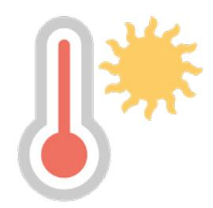

**LESSON 13**

# **Weather**

**OBJETIVO: APRENDERÉ A HACER Y RESPONDER PREGUNTAS SOBRE EL TIEMPO QUE HACE.**

## Personal Study

Prepárate para tu grupo de conversación y completa las actividades A–E.

## **Study the Principle of Learning: Love and Teach One Another**

*I can learn from the Spirit as I love, teach, and learn with others.*

Dios tiene cosas importantes que quiere enseñarnos y puede aumentar nuestra capacidad de aprender la verdad por medio de Su Espíritu. Invitamos al Espíritu cuando nos amamos y escuchamos los unos a los otros. Dios nos enseña lo que se siente cuando aprendemos mediante el Espíritu:

"El que recibe la palabra por el Espíritu de verdad, la recibe como la predica el Espíritu de verdad[.] De manera que, el que la predica y el que la recibe se comprenden el uno al otro, y ambos son edificados y se regocijan juntamente" (Doctrina y Convenios 50:21–22).

Podemos saber que Dios nos está enseñando cuando sentimos el Espíritu y nos sentimos edificados. El Espíritu brinda sentimientos de amor, gozo y paz. Cada uno de nosotros puede ayudar a crear un ambiente en el que el Espíritu pueda enseñar.

Cuando tratamos de aprender por medio del Espíritu, Dios puede ayudarnos a entendernos unos a otros y a sentir juntos el gozo. Cuando aprendas con tu grupo de EnglishConnect, fíjate en cuándo aprendes por medio del Espíritu y procura tener el Espíritu más a menudo.

## **Ponder**

- ¿En qué ocasiones te has sentido edificado por tus experiencias en EnglishConnect?
- ¿Qué puedes hacer para crear un ambiente de aprendizaje por medio del Espíritu?

## **Memorize Vocabulary**

Aprende el significado y la pronunciación de cada palabra antes de ir a tu grupo de conversación. Intenta utilizar palabras de la sección "Memorize Vocabulary" en tu práctica diaria.

### **Phrases**

| Will it … ?    | ¿Va a…?        |
|----------------|----------------|
| Will it be … ? | ¿Hará/Estará…? |
| in Mexico      | en México      |

### **Days**

| today      | hoy       |
|------------|-----------|
| tomorrow   | mañana    |
| on Monday* | el lunes* |

\* En el apéndice puedes ver más *days*.

### **Verbs**

| hail/hailing | granizar/granizando |
|--------------|---------------------|
| rain/raining | llover/lloviendo    |
| snow/snowing | nevar/nevando       |

### **Adjectives**

| nice   | buen tiempo        |
|--------|--------------------|
|        |                    |
| cold   | frío               |
| hot    | calor              |
|        |                    |
| cloudy | nublado            |
| foggy  | con niebla         |
| rainy  | lluvioso           |
| snowy  | nevado/con nieve   |
| stormy | tempestuoso/con    |
|        | tormenta           |
| sunny  | soleado            |
| windy  | ventoso/con viento |

## **Practice Pattern 1**

Practica el uso de los patrones hasta que puedas hacer y responder preguntas con confianza. Puedes reemplazar las palabras subrayadas por palabras de la sección "Memorize Vocabulary".

Q: What's the weather in London?
Q_es: ¿Cuál es el clima en Londres?

A: It's (*adjective*) in London.
A_es: Es (*adjetivo*) en Londres.

#### **Questions**

| What's | the weather | in London? |
|--------|-------------|------------|
|--------|-------------|------------|

#### **Answers**

## **Examples**

- Q: What's the weather in London?
- A: It's rainy in London.
- Q: What's the weather in Toronto?
- A: It's snowing in Toronto.

## Practice Pattern 2

Practica el uso de los patrones hasta que puedas hacer y responder preguntas con confianza. Intenta realizar las actividades 1 y 2 del grupo de conversación antes de que tu grupo se reúna.

Q: Will it (*verb*) (*day*)?

A: No, it won't (*verb*) (*day*).

#### Questions

#### **Answers**

## Examples

Q: Will it snow tomorrow?

A: No, it won't snow tomorrow.

Q: Will it be sunny tomorrow?

A: No, it won't. It will snow tomorrow.

Q: Will it be nice on Friday?

A: Yes, it will.

| Use the Patterns |
|------------------|
|                  |

| Escribe cuatro preguntas que puedas hacerle a alguien. Escribe la respuesta a cada pregunta. |  |  |
|-------------------------------------------------------------------------------------------------|--|--|
| Léelas en voz alta.                                                                             |  |  |
|                                                                                                 |  |  |
|                                                                                                 |  |  |
|                                                                                                 |  |  |
|                                                                                                 |  |  |
|                                                                                                 |  |  |
|                                                                                                 |  |  |
|                                                                                                 |  |  |
|                                                                                                 |  |  |

### **Additional Activities**

Completa las actividades de la lección y las evaluaciones en línea en englishconnect.org/ learner/resources o en el *Cuaderno de ejercicios de EnglishConnect 1*.

## **Act in Faith to Practice English Daily**

Continúa practicando inglés a diario. Usa tu "Registro de estudio personal", repasa tu meta de estudio y evalúa tus esfuerzos.

# Conversation Group

## **Discuss the Principle of Learning: Love and Teach One Another**

(20–30 minutes)

- Lean el principio de aprendizaje de esta lección en voz alta.
- Analicen las preguntas.

Repasa la lista de vocabulario con un compañero.

Practica el patrón 1 con un compañero:

- Practica hacer preguntas.
- Practica responder preguntas.
- Practica una conversación usando los patrones. Repite con el patrón 2.

# **Activity 2: Create Your Own Sentences (10–15 MINUTES)**

Mira la imagen y haz y responde preguntas sobre el tiempo que hace cada día. Tomen turnos. Cambia de compañero y vuelve a practicar.

### **Example**

A: Will it be sunny on Monday?

B: No, it won't be sunny on Monday.

A: What's the weather on Monday?

B: It will be cloudy on Monday.

#### **Monday** 55°F/13°C **Tuesday** 30°F/-1°C

#### **Wednesday** 67°F/19°C **Thursday** 59°F/15°C

## **Friday**

75°F/24°C

## **Saturday**

85°F/29°C

## **Sunday**

50°F/10°C

# **Activity 3: Create Your Own Conversations**

**(15–20 MINUTES)**

Haz y responde preguntas sobre el tiempo que hace en cada lugar. Habla sobre el tiempo que hace cada día de una semana. Di todo lo que puedas. Tomen turnos.

#### **Example**

- A: What's the weather in Bogotá?
- B: It's cloudy in Bogotá.
- A: Will it be cloudy tomorrow?
- B: Yes, it will.

#### **Evaluate**

(5–10 minutes)

Evalúa tu progreso con los objetivos y tus esfuerzos por practicar inglés a diario.

#### **Evaluate Your Progress**

I can:

• Describe the weather.

• Make predictions about the weather.

### **Evaluate Your Efforts**

Usa el "Registro de estudio personal" que se encuentra en la introducción para evaluar tus esfuerzos y fijar una meta.

Comparte tu meta con un compañero.

## **Act in Faith to Practice English Daily**

"Mi experiencia ha sido que el Espíritu se comunica con mayor frecuencia en forma de sentimientos. Lo sienten en palabras que les son familiares, que tienen sentido para ustedes, que los 'inspiran'" (Ronald A. Rasband, "Deja que el Espíritu te enseñe", *Liahona*, mayo de 2017, pág. 94).

