**LESSON 14**

# **Jobs and Careers**

**OBJETIVO: APRENDERÉ A HABLAR SOBRE EL TRABAJO DE ALGUIEN Y DÓNDE TRABAJA.**

# Personal Study

Prepárate para tu grupo de conversación y completa las actividades A–E.

## **Study the Principle of Learning: You Are a Child of God**

*I am a child of God with eternal potential and purpose.*

Eres hija o hijo de un amoroso Padre Celestial. Él te guiará. Con Su ayuda, puedes hacer más de lo que podrías hacer por tu cuenta. En el Libro de Mormón, aprendemos sobre un joven llamado Nefi, quien llegaría a convertirse en un líder y profeta de su pueblo. Dios quería guiar a Nefi y a su familia a una nueva tierra, situada al otro lado del mar, y Nefi tuvo que construir un barco. Nunca había construido un barco antes y sus hermanos no creían que pudiera hacerlo. Nefi pidió ayuda a Dios.

Nefi dijo a sus hermanos: "Si [Dios] […] ha hecho tantos milagros entre los hijos de los hombres, ¿cómo es que no puede enseñarme a construir un barco?" (1 Nefi 17:51).

Con la ayuda de Dios, Nefi y su familia construyeron un barco y emprendieron la difícil travesía por el mar. Así como Dios ayudó a Nefi, quiere ayudarte a

ti. Puedes orar para pedir ayuda; puedes orar para comprender y recordar lo que estás aprendiendo. Al orar, presta atención a tus ideas y sentimientos, y, luego, actúa con fe. Puedes hacer más con Su ayuda que sin ella.

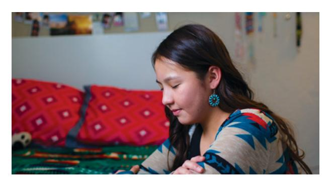

## **Ponder**

- ¿En qué se parece tu trayectoria de aprendizaje de inglés al relato en el que Nefi construye un barco?
- Al aprender inglés, ¿para qué puedes pedirle a Dios ayuda?

## **Memorize Vocabulary**

Aprende el significado y la pronunciación de cada palabra antes de ir a tu grupo de conversación. Prueba a usar las palabras en tu vida. Piensa en cuándo y dónde podrías usar estas palabras.

### **Nouns**

| job | trabajo |
|-----|---------|

### **Nouns 1**

| factory    | fábrica     |
|------------|-------------|
| hospital   | hospital    |
| office     | oficina     |
| restaurant | restaurante |
| school     | escuela     |
| store      | tienda      |

### **Nouns 2**

| accountant          | contador                |
|---------------------|-------------------------|
| artist              | artista                 |
| cashier             | cajero                  |
| computer programmer | programador informático |
| cook                | cocinero                |
| custodian           | conserje                |
| doctor              | médico                  |
| electrician         | electricista            |
| factory worker      | trabajador de fábrica   |
| farmer              | granjero                |
| lawyer              | abogado                 |
| mechanic            | mecánico                |
| nurse               | enfermero               |
| office worker       | empleado de oficina     |
| salesperson         | vendedor                |
| server              | mesero, camarero        |
| teacher             | maestro                 |

## **Practice Pattern 1**

Practica el uso de los patrones hasta que puedas hacer y responder preguntas con confianza. Puedes reemplazar las palabras subrayadas por palabras de la sección "Memorize Vocabulary".

Q: Where do you work?
Q_es: ¿En qué lugar trabajas?

A: I work at a (*noun 1*).
A_es: Trabajo en un (*sustantivo 1*).

#### **Questions**

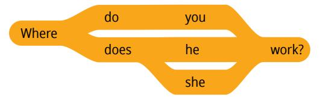

### **Answers**

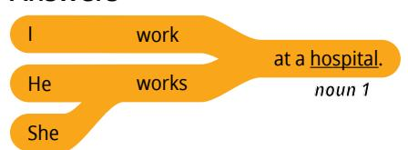

## **Examples**

Q: Where do you work?
Q_es: ¿Dónde trabajas?

A: I work at a hospital.
A_es: Trabajo en un hospital.

Q: Where does she work?
Q_es: ¿En qué lugar trabaja ella?

A: She works at an office.
A_es: Ella trabaja en una oficina.

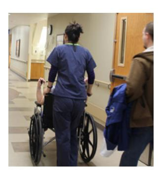

## **Practice Pattern 2**

Practica el uso de los patrones hasta que puedas hacer y responder preguntas con confianza. Prueba a decir los patrones en voz alta. Si lo deseas, podrías grabarte. Presta atención a tu pronunciación y fluidez.

Q: What's your job?
Q_es: ¿Cuál es tu trabajo?

A: I'm a (*noun 2*).
A_es: Soy un (*sustantivo 2*).

#### **Questions**

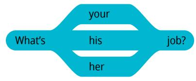

#### **Answers**

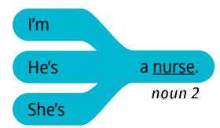

#### **Examples**

Q: What's your job?
Q_es: ¿Cuál es tu trabajo?

A: I'm a nurse.
A_es: Soy una enfermera.

Q: What's his job?
Q_es: ¿Cuál es su trabajo?

A: He's an electrician.
A_es: Él es un electricista.

Q: What's her job?
Q_es: ¿Cuál es su trabajo?

A: She's an artist.
A_es: Ella es una artista.

# **Use the Patterns**

Escribe cuatro preguntas que puedas hacerle a alguien. Escribe la respuesta a cada pregunta. Léelas en voz alta.

## **Additional Activities**

Completa las actividades de la lección y las evaluaciones en línea en englishconnect.org/ learner/resources o en el *Cuaderno de ejercicios de EnglishConnect 1*.

## **Act in Faith to Practice English Daily**

Continúa practicando inglés a diario. Usa tu "Registro de estudio personal", repasa tu meta de estudio y evalúa tus esfuerzos.

# Conversation Group

## **Discuss the Principle of Learning: You Are a Child of God**

(20–30 minutes)

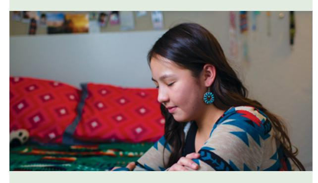

- Lean el principio de aprendizaje de esta lección en voz alta.
- Analicen las preguntas.

Repasa la lista de vocabulario con un compañero.

Practica el patrón 1 con un compañero:

- Practica hacer preguntas.
- Practica responder preguntas.
- Practica una conversación usando los patrones.

Repite con el patrón 2.

# **Activity 2: Create Your Own Sentences (10–15 MINUTES)**

Fíjate en las ilustraciones y haz y responde preguntas sobre el trabajo de cada persona. Tomen turnos.

## **Example: Carlos**

A: Where does Carlos work?

B: He works at a school.

A: What's his job?

B: He's a teacher.

#### **Image 1: Sofia Image 2: Jean**

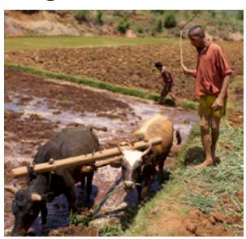

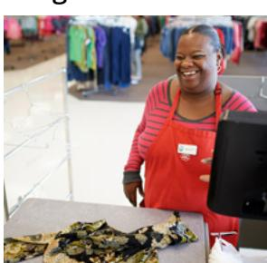

**Image 3: Clara Image 4: Frederick**

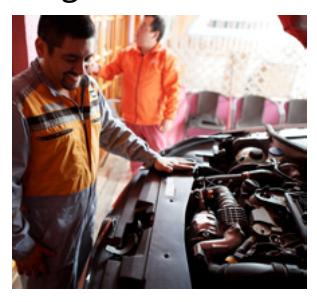

#### **Image 5: Hana Image 6: Lee**

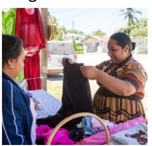

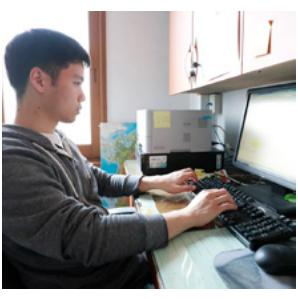

## **Activity 3: Create Your Own Conversations**

**(15–20 MINUTES)**

Haz y responde preguntas acerca de tu trabajo y el lugar en el que trabajas. Tomen turnos. Cambia de compañero y vuelve a practicar.

## **New Vocabulary**

| home       | hogar, casa        |
|------------|--------------------|
| student    | estudiante, alumno |
| university | universidad        |

## **Example**

A: What's your job?

B: I'm an electrician.

A: Where do you work?

B: I work at a factory.

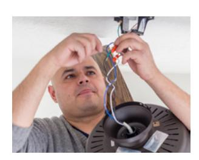

#### **Evaluate**

(5–10 minutes)

Evalúa tu progreso con los objetivos y tus esfuerzos por practicar inglés a diario.

#### **Evaluate Your Progress**

I can:

• Say where I work.

• Say what my job is.

• Ask and say where someone works.

• Ask and say what someone's job is.

## **Evaluate Your Efforts**

Usa el "Registro de estudio personal" que se encuentra en la introducción para evaluar tus esfuerzos y fijar una meta.

Comparte tu meta con un compañero.

## **Act in Faith to Practice English Daily**

"El Señor los conoce y los ama. […] Él los dirigirá y guiará *a ustedes* en su vida personal si le *dedican tiempo a Él* en su vida, todos y cada uno de los días" (Russell M. Nelson, "Dediquen tiempo al Señor", *Liahona*, noviembre de 2021, pág. 121).

