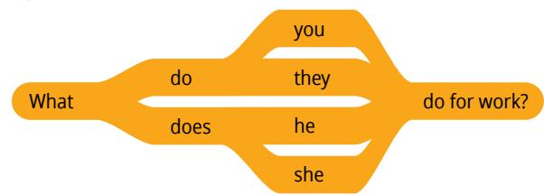
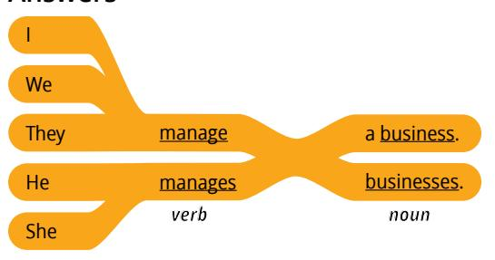
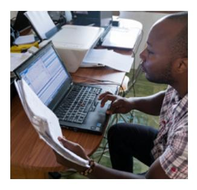
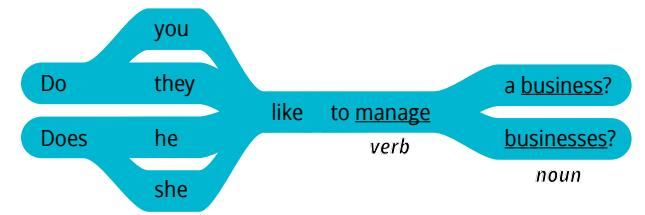
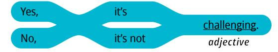
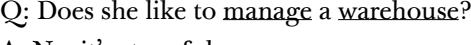
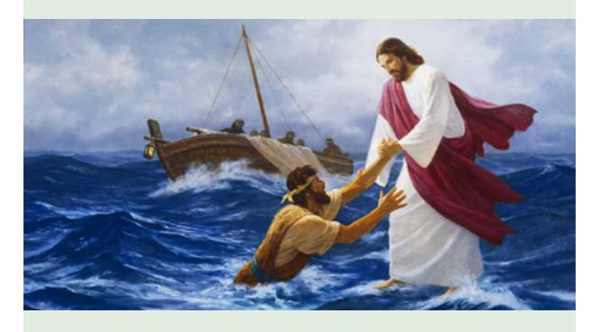
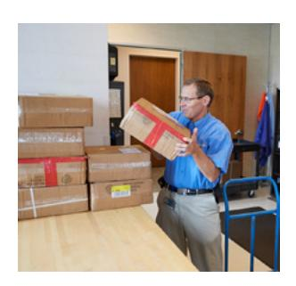
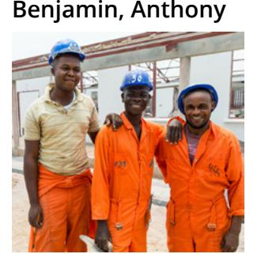

**LESSON 15**

# **Jobs and Careers**

**OBJETIVO: APRENDERÉ A HACER Y RESPONDER PREGUNTAS SOBRE EL TRABAJO DE ALGUIEN.** 

## Personal Study

Prepárate para tu grupo de conversación y completa las actividades A–E.

## **Study the Principle of Learning: Exercise Faith in Jesus Christ**

*Jesus Christ can help me do all things as I exercise faith in Him.*

Los discípulos de Jesucristo se encontraban en una barca. El viento soplaba con fuerza y las olas eran altas. En esa situación, vieron a Jesús caminando hacia ellos sobre el agua. Uno de Sus discípulos, Pedro, le preguntó a Jesús si podía ir a encontrarse con Él sobre las aguas, y Jesús invitó a Pedro a hacer lo que parecía imposible.

La Biblia nos cuenta lo que pasó después: "Y descendió Pedro de la barca y anduvo sobre las aguas para ir a Jesús.

"Mas al ver el viento fuerte, tuvo miedo y, comenzando a hundirse, dio voces, diciendo: ¡Señor, sálvame!

"Y al momento Jesús, extendiendo la mano, le sujetó y le dijo: ¡Oh hombre de poca fe! ¿Por qué dudaste?" (Mateo 14:29–31).

Al principio, Pedro actuó con fe y comenzó a caminar de forma milagrosa sobre el agua, pero cuando dejó

de mirar a Jesús y comenzó a fijarse en la tormenta, empezó a hundirse. Al igual que Pedro, si te enfocas en tus miedos, es posible que quieras rendirte; en cambio, puedes enfocarte en Jesús. Aprender un nuevo idioma puede parecer imposible. Confía en que Jesucristo puede ayudarte a hacer cosas que parecen imposibles.

#### **Ponder**

- ¿Cuáles son algunas maneras en las que puedes enfocar tu fe en Jesucristo cuando te sientes abrumado o desanimado?
- ¿Cómo ha aumentado tu creencia en Jesucristo desde que comenzaste EnglishConnect?

## **Memorize Vocabulary**

Aprende el significado y la pronunciación de cada palabra antes de ir a tu grupo de conversación. Intenta aprender más palabras que puedas utilizar en los patrones. Podrías utilizar un diccionario o un traductor o preguntar a un amigo.

### **Verbs**

| build   | construir       |
|---------|-----------------|
| clean   | limpiar         |
| deliver | entregar        |
| design  | diseñar         |
| help    | ayudar          |
| manage  | administrar     |
| own     | ser propietario |
| sell    | vender          |
| serve   | servir          |

### **Nouns**

| business/businesses  | negocio/negocios             |
|----------------------|------------------------------|
| building/buildings   | edificio/edificios           |
| computer/computers   | computadora/ computadoras |
| customer/customers   | cliente/clientes             |
| employee/employees   | empleado/empleados           |
| product/products     | producto/productos           |
| warehouse/warehouses | almacén/almacenes            |

### **Adjectives**

| challenging | complicado    |
|-------------|---------------|
| engaging    | interesante   |
| fast-paced  | acelerado     |
| meaningful  | significativo |
| stressful   | estresante    |

En la lección 5 puedes ver más *adjectives*.

## **Practice Pattern 1**

Practica el uso de los patrones hasta que puedas hacer y responder preguntas con confianza. Puedes reemplazar las palabras subrayadas por palabras de la sección "Memorize Vocabulary".

Q: What do you do for work?
Q_es: ¿Qué hace para trabajar?

A: I (*verb*) (*noun*).
A_es: Yo (*verbo*) (*sustantivo*).

### **Questions**

## **Answers**

#### **Examples**

- Q: What do you do for work?
- A: I manage a business.
- Q: What does he do for work?
- A: He sells computers.
- Q: What do they do?
- A: They design buildings.

## **Practice Pattern 2**

Practica el uso de los patrones hasta que puedas hacer y responder preguntas con confianza. Intenta comprender las reglas que hay en los patrones. Piensa en cómo el inglés se asemeja o se diferencia de tu idioma.

Q: Do you like to (*verb*) (*noun*)?
Q_es: ¿Te gusta (*verbo*) (*sustantivo*)?

A: Yes, it's (*adjective*).
A_es: Sí, es (*adjetivo*).

## **Questions**

#### **Answers**

## **Examples**

- Q: Do you like to manage a business?
- A: Yes, it's challenging.
- Q: Does he like to sell computers?
- A: Yes, it's fast-paced.

A: No, it's stressful.

## **Use the Patterns**

Escribe cuatro preguntas que puedas hacerle a alguien. Escribe la respuesta a cada pregunta. Léelas en voz alta.

Completa las actividades de la lección y las evaluaciones en línea en englishconnect.org/ learner/resources o en el *Cuaderno de ejercicios de EnglishConnect 1*.

## **Act in Faith to Practice English Daily**

Continúa practicando inglés a diario. Usa tu "Registro de estudio personal", repasa tu meta de estudio y evalúa tus esfuerzos.

# Conversation Group

## **Discuss the Principle of Learning: Exercise Faith in Jesus Christ**

(20–30 minutes)

- Lean el principio de aprendizaje de esta lección en voz alta.
- Analicen las preguntas.

Repasa la lista de vocabulario con un compañero.

Practica el patrón 1 con un compañero:

- Practica hacer preguntas.
- Practica responder preguntas.
- Practica una conversación usando los patrones.

Repite con el patrón 2.

# **Activity 2: Create Your Own Sentences (10–15 MINUTES)**

Fíjate en las ilustraciones y haz y responde preguntas sobre el trabajo de cada persona. Tomen turnos.

## **Example: Paul**

- A: What does Paul do for work?
- B: He delivers products.
- A: Does Paul like to deliver products?
- B: Yes, it's fast-paced.

**Image 1: Jean,** 

**Image 2: Sara**

**Image 3: Malee and Arthit**

**Image 4: Roberto and Francisco**

#### **Image 5: Juan Image 6: Imani**

## **Activity 3: Create Your Own Conversations**

**(15–20 MINUTES)**

Elige tres miembros de la familia y haz y responde preguntas sobre el trabajo de cada persona. Utiliza los patrones y el vocabulario de esta lección y de la lección 14. Di todo lo que puedas. Tomen turnos.

## **New Vocabulary**

| fix      | reparar    |
|----------|------------|
| airplane | avión      |
| airport  | aeropuerto |

## **Example**

A: Where does your brother work?

B: He works at an airport.

A: What's his job?

B: He's a mechanic.

A: What does he do for work?

B: He fixes airplanes.

A: Does he like to fix airplanes?

B: Yes, it's challenging.

#### **Evaluate**

(5–10 minutes)

Evalúa tu progreso con los objetivos y tus esfuerzos por practicar inglés a diario.

#### **Evaluate Your Progress**

I can:

• Describe my job.
• _es: Describir mi trabajo.

• Ask about someone's job.
• _es: Preguntar sobre el trabajo de alguien.

• Describe other people's jobs.
• _es: Describir los trabajos de otras personas.

#### **Evaluate Your Efforts**

Usa el "Registro de estudio personal" que se encuentra en la introducción para evaluar tus esfuerzos y fijar una meta.

Comparte tu meta con un compañero.

## **Act in Faith to Practice English Daily**

"La fe en Jesucristo es el fundamento de toda creencia y el conducto del poder divino. […]

"Es *nuestra* fe la que activa el poder de Dios en *nuestras* vidas. […]

"El Señor comprende nuestra debilidad mortal todos vacilamos a veces—, pero también conoce nuestro gran potencial. […]

"El Señor no requiere que tengamos una fe *perfecta* para tener acceso a Su poder *perfecto*, pero nos pide que creamos" (Russell M. Nelson, "Cristo ha resucitado; la fe en Él moverá montes", *Liahona*, mayo de 2021, pág. 102).

