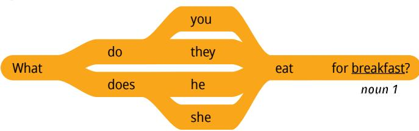
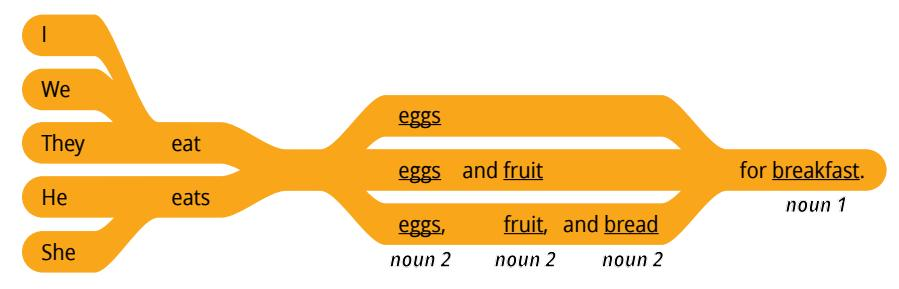
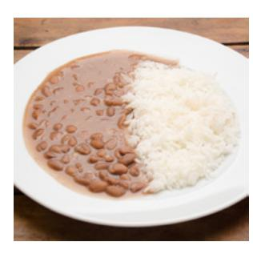
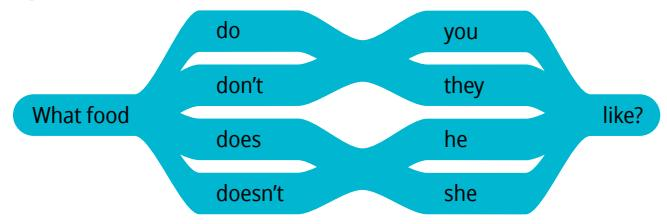
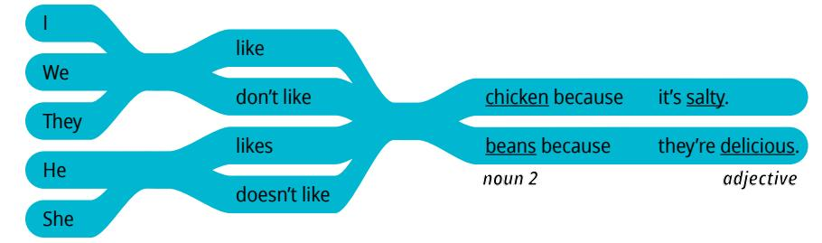
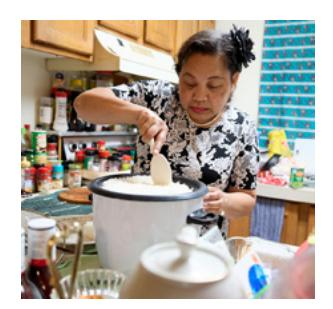
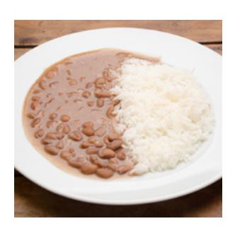
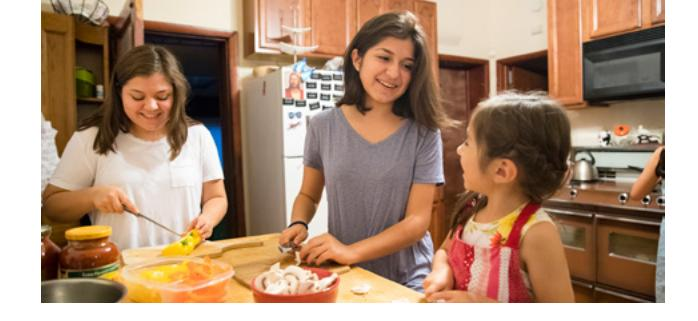

**LESSON 16**

# **Food**

**OBJETIVO: APRENDERÉ A HABLAR SOBRE COMIDA Y POR QUÉ A ALGUIEN LE GUSTA.**

# Personal Study

Prepárate para tu grupo de conversación y completa las actividades A–E.

## **Study the Principle of Learning: Take Responsibility**

*I have the power to choose, and I am responsible for my own learning.*

Jesucristo contó una historia sobre un hombre rico que dio dinero a tres siervos. Los dos primeros siervos utilizaron el dinero sabiamente y lo duplicaron, pero el tercer siervo tuvo miedo y escondió el dinero para no perderlo. El hombre rico se sintió decepcionado con el tercer siervo, pero estaba contento con los dos primeros, y les dijo:

"Bien, buen siervo y fiel; sobre poco has sido fiel, sobre mucho te pondré; entra en el gozo de tu señor" (Mateo 25:21).

Piensa en los dones que te ha dado el Padre Celestial. Quizás se te haya dado la capacidad de estudiar bien o de ser paciente con otras personas; es posible que tengas una gran fe o valor para hablar. Asume la responsabilidad de esos dones y desarróllalos, y piensa en cómo puedes utilizarlos para ayudar

a otros. Además, puedes elegir desarrollar nuevos dones. Puedes buscar dones espirituales si ejerces fe en Dios, los pones en práctica y los usas para ayudar a otras personas. Dios te guiará conforme intentes desarrollar tus dones.

## **Ponder**

- ¿Cuáles son tus dones?
- ¿Cómo puedes usar tus dones para aprender inglés?
- ¿Cómo pueden esos dones ayudar a tus amigos en EnglishConnect?

## **Memorize Vocabulary**

Aprende el significado y la pronunciación de cada palabra antes de ir a tu grupo de conversación. Intenta crear tarjetas de memorización como ayuda para memorizar nuevas palabras. Puedes usar papel o una aplicación.

### **Nouns**

| food/foods | alimento/alimentos |
|------------|--------------------|

### **Verbs**

| eat/eats   | comer              |
|------------|--------------------|

### **Nouns 1**

| breakfast | desayuno |
|-----------|----------|
| lunch     | almuerzo |
| dinner    | cena     |

### **Nouns 2**

| fruit          | fruta                                    |
|----------------|------------------------------------------|
| apple/apples   | manzana/manzanas                         |
|                |                                          |
| vegetables     | verduras                                 |
| carrot/carrots | zanahoria/zanahorias                     |
|                |                                          |
| meat           | carne                                    |
| chicken        | pollo                                    |
| egg/eggs       | huevo/huevos                             |
| pork           | cerdo                                    |
| beans          | fréjoles (alubias, caraotas, porotos) |
| bread          | pan                                      |
| rice           | arroz                                    |

### **Adjectives**

| bland     | insípido  |
|-----------|-----------|
| delicious | delicioso |
| sweet     | dulce     |

## **Practice Pattern 1**

Practica el uso de los patrones hasta que puedas hacer y responder preguntas con confianza. Puedes reemplazar las palabras subrayadas por palabras de la sección "Memorize Vocabulary".

Q: What do you eat for (*noun 1*)?

A: I eat (*noun 2*) for (*noun 1*).

### **Questions**

## **Answers**

#### **Examples**

Q: What do you eat for breakfast?

A: I eat eggs for breakfast.

Q: What do they eat for dinner?

A: They eat rice and beans for dinner.

Q: What does he eat for lunch?

A: He eats chicken, bread, and an apple for lunch.

## **Practice Pattern 2**

Practica el uso de los patrones hasta que puedas hacer y responder preguntas con confianza. Intenta aprender más sobre los patrones de esta lección. Valora la posibilidad de utilizar libros o sitios web de gramática.

Q: What food do you like?

A: I like (*noun 2*) because it's (*adjective*).

### **Questions**

#### **Answers**

#### **Examples**

Q: What food do you like?

A: I like apples because they're sweet.

Q: What food doesn't she like?

A: She doesn't like rice because it's bland.

| Use the Patterns |
|------------------|
|                  |

| Escribe cuatro preguntas que puedas hacerle a alguien. Escribe la respuesta a cada pregunta. Léelas en voz alta. |
|------------------------------------------------------------------------------------------------------------------------|
|                                                                                                                        |
|                                                                                                                        |
|                                                                                                                        |
|                                                                                                                        |
|                                                                                                                        |
|                                                                                                                        |
|                                                                                                                        |

## **Additional Activities**

Completa las actividades de la lección y las evaluaciones en línea en englishconnect.org/ learner/resources o en el *Cuaderno de ejercicios de EnglishConnect 1*.

## **Act in Faith to Practice English Daily**

Continúa practicando inglés a diario. Usa tu "Registro de estudio personal", repasa tu meta de estudio y evalúa tus esfuerzos.

# Conversation Group

## **Discuss the Principle of Learning: Take Responsibility**

(20–30 minutes)

- Lean el principio de aprendizaje de esta lección en voz alta.
- Analicen las preguntas.

Repasa la lista de vocabulario con un compañero.

Practica el patrón 1 con un compañero:

- Practica hacer preguntas.
- Practica responder preguntas.
- Practica una conversación usando los patrones.

Repite con el patrón 2.

## **Activity 2: Create Your Own Sentences**

**(10–15 MINUTES)**

Fíjate en las ilustraciones y haz y responde preguntas acerca de lo que cada persona come en el desayuno, el almuerzo y la cena. Tomen turnos.

## **New Vocabulary**

| filling | saciante     |
|---------|--------------|
| gross   | asqueroso    |
| salty   | salado       |
| spicy   | condimentado |
|         |              |
| cheese  | queso        |
| fish    | pescado      |

## **Example: Cary**

- Breakfast: fruit and bread
- Lunch: chicken and vegetables
- Dinner: fish

A: What does Cary eat for breakfast?

B: She eats fruit and bread for breakfast.

## **Image 1: Tim**

- Breakfast: eggs and bread
- Lunch: chicken
- Dinner: meat, vegetables, and bread

## **Image 2: Pele**

- Breakfast: cheese and bread
- Lunch: beans and rice
- Dinner: fish, rice, and fruit

#### **Image 3: Mari**

- Breakfast: vegetables and rice
- Lunch: pork, vegetables, and rice
- Dinner: eggs, vegetables, and rice

## **Activity 3: Create Your Own Conversations**

**(15–20 MINUTES)**

## **Part 1**

Haz y responde preguntas acerca de lo que tú y tu familia comen en el desayuno, el almuerzo y la cena. Tomen turnos.

#### **Example**

- A: What do you eat for lunch?
- B: I eat rice and beans for lunch.

## **Part 2**

Haz y responde preguntas acerca de los alimentos que a ti y a tu familia les gustan y no les gustan. Explica el motivo. Tomen turnos.

#### **Example**

- A: What food do you like?
- B: I like carrots because they're sweet. I like bread because it's delicious.
- A: What food don't you like?
- B: I don't like cheese because it's gross. I don't like fish because it's salty.
- A: What food does your sister like?
- B: She likes rice because it's filling.

#### **Evaluate**

(5–10 minutes)

Evalúa tu progreso con los objetivos y tus esfuerzos por practicar inglés a diario.

#### **Evaluate Your Progress**

I can:

• Name foods for breakfast, lunch, and dinner.

• Talk about why I like or dislike certain foods.

• Ask why others like or dislike certain foods.

#### **Evaluate Your Efforts**

Usa el "Registro de estudio personal" que se encuentra en la introducción para evaluar tus esfuerzos y fijar una meta.

Comparte tu meta con un compañero.

## **Act in Faith to Practice English Daily**

"Dios nos ha dado a cada uno de nosotros uno o más talentos especiales. […] Depende de cada uno de nosotros el descubrir y desarrollar los dones que Dios nos ha dado. Debemos tener presente que todos fuimos creados a la imagen de Dios, que no hay nadie insignificante y que todos somos importantes para Dios y para nuestro prójimo" (véase Marvin J. Ashton, "Hay muchos dones", *Liahona*, enero de 1988, pág. 19).

