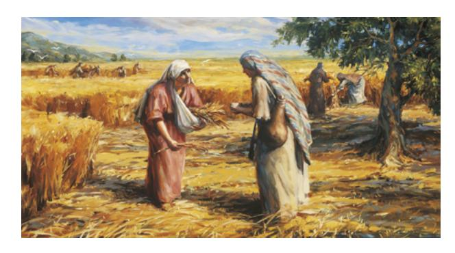
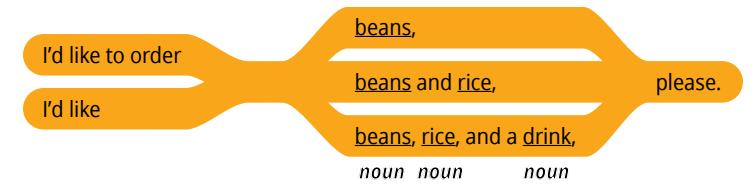
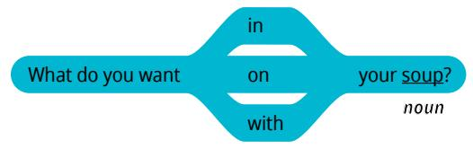
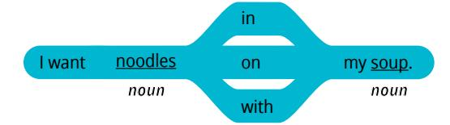
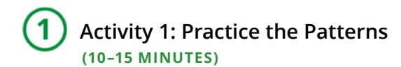
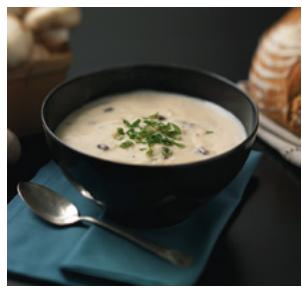
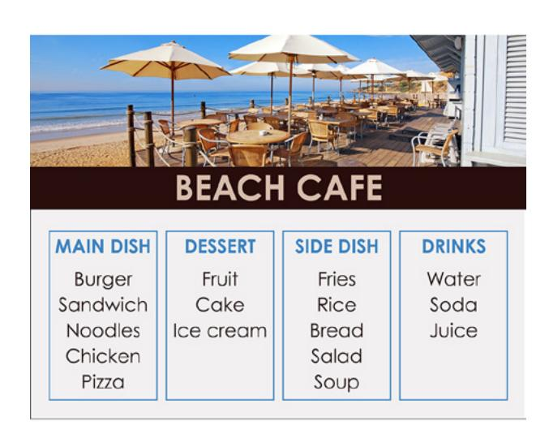

**LESSON 17**

# **Food**

**OBJETIVO: APRENDERÉ A PEDIR COMIDA Y A TOMAR PEDIDOS.**

# Personal Study

Prepárate para tu grupo de conversación y completa las actividades A–E.

## **Study the Principle of Learning: Press Forward**

*With God's help, I can press forward even when I face obstacles.*

En las Escrituras leemos acerca de una mujer llamada Rut que tuvo muchas dificultades. Su esposo murió y no tenía hijos. Su suegra, Noemí, planeaba regresar a su tierra y le dijo a Rut que se quedara, pero Rut respondió:

"Adondequiera que tú fueres, iré yo, y dondequiera que vivieres, viviré. Tu pueblo será mi pueblo, y tu Dios mi Dios. […] Y al ver Noemí que estaba tan resuelta a ir con ella, no dijo nada más" (Rut 1:16, 18).

Rut era decidida y fiel, y decidió permanecer con Noemí y vivir en un lugar extraño, lejos de su familia y su cultura. Eligió ser fiel a su nueva religión. Las cosas fueron muy difíciles para Rut y Noemí; eran muy pobres y les costaba conseguir suficiente comida. Rut siguió adelante, confiando en Dios, y cuidó de Noemí. Dios vio sus dificultades y bendijo

sus esfuerzos. Después de un tiempo, Rut se casó de nuevo, tuvo hijos y tuvo suficiente comida para su familia. Puedes confiar en Dios como lo hizo Rut. Puedes seguir adelante con fe, aunque las cosas sean difíciles.

## **Ponder**

- ¿Cómo puedes verte reflejado en las experiencias de Rut?
- ¿Cómo puedes seguir adelante con esperanza en Dios?
- ¿Cómo se aplica esto a tu experiencia de aprendizaje de inglés?

## **Memorize Vocabulary**

Aprende el significado y la pronunciación de cada palabra antes de ir a tu grupo de conversación. Prueba a usar las palabras en tu vida. Piensa en cuándo y dónde podrías usar estas palabras.

| Can I take your order?           | ¿Puedo tomar su pedido? |
|----------------------------------|-------------------------|
| What would you like to order? | ¿Qué quiere pedir?      |
| I'd like …                       | Quiero…                 |
| I'd like to order …              | Quiero pedir…           |
|                                  |                         |
| in                               | en                      |
| on                               | en                      |
| with                             | con                     |

## **Nouns**

| beans              | frijoles (alubias, caraotas, porotos) |
|--------------------|------------------------------------------|
| dessert            | postre                                   |
| drink              | bebida                                   |
| fries              | papas fritas                             |
| hamburger (burger) | hamburguesa                              |
| ice                | hielo                                    |
| noodles            | fideos                                   |
| onion              | cebolla                                  |
| pizza              | pizza                                    |
| salad              | ensalada                                 |
| sandwich           | sándwich                                 |
| sauce              | salsa                                    |
| soup               | sopa                                     |
| spices             | especias                                 |
| tomato/tomatoes    | tomate/tomates                           |

En la lección 16 puedes ver más *food nouns*.

## **Practice Pattern 1**

Practica el uso de los patrones hasta que puedas hacer y responder preguntas con confianza. Puedes reemplazar las palabras subrayadas por palabras de la sección "Memorize Vocabulary".

Q: Can I take your order?

A: I'd like to order (*noun*), please.

### **Questions**

Can I take your order?

What would you like to order?

#### **Answers**

## **Examples**

Q: Can I take your order?

A: Yes, I'd like to order beans, rice, and a drink, please.

Q: What would you like to order?

A: I'd like soup and a salad, please.

## **Practice Pattern 2**

Practica el uso de los patrones hasta que puedas hacer y responder preguntas con confianza. Intenta fijarte en estos patrones durante tu práctica diaria.

Q: What do you want in your (*noun*)? A: I want (*noun*) in my (*noun*).

## **Questions**

## **Answers**

## **Examples**

Q: What do you want in your soup? A: I want noodles in my soup.

- Q: What do you want with your hamburger?
- A: I want a drink with my hamburger.
- Q: What do you want on your pizza?
- A: I want tomatoes on my pizza.

## **Use the Patterns**

| Escribe cuatro preguntas que puedas hacerle a         |
|-------------------------------------------------------|
| alguien. Escribe la respuesta a cada pregunta. Léelas |
| en voz alta.                                          |
|                                                       |
|                                                       |
|                                                       |

## **Additional Activities**

Completa las actividades de la lección y las evaluaciones en línea en englishconnect.org/ learner/resources o en el *Cuaderno de ejercicios de EnglishConnect 1*.

## **Act in Faith to Practice English Daily**

Continúa practicando inglés a diario. Usa tu "Registro de estudio personal", repasa tu meta de estudio y evalúa tus esfuerzos.

# Conversation Group

## **Discuss the Principle of Learning: Press Forward**

(20–30 minutes)

- Lean el principio de aprendizaje de esta lección en voz alta.
- Analicen las preguntas.

Repasa la lista de vocabulario con un compañero.

Practica el patrón 1 con un compañero:

- Practica hacer preguntas.
- Practica responder preguntas.
- Practica una conversación usando los patrones.

Repite con el patrón 2.

## **Activity 2: Create Your Own Sentences**

**(10–15 MINUTES)**

Hagan dramatizaciones. El compañero A trabaja en un restaurante y el compañero B es un cliente del restaurante. Haz y responde preguntas acerca de los alimentos que aparecen en cada imagen. Di todo lo que puedas. Intercámbiense los roles. Cambia de compañero y vuelve a practicar.

### **Example**

- A: Can I take your order?
- B: I'd like pizza, please.
- A: OK. What do you want on your pizza?
- B: I want cheese, meat, and olives on my pizza.
- A: Great. And what do you want with your pizza?
- B: I want a drink, please.

**Image 3 Image 4**

## **Activity 3: Create Your Own Conversations**

**(15–20 MINUTES)**

Fíjate en el menú. Hagan dramatizaciones. El compañero A trabaja en un restaurante y el compañero B es un cliente del restaurante. Utiliza el vocabulario de esta lección y de la lección 16. Cambia de compañero y vuelve a practicar.

## **New Vocabulary**

Anything else? ¿Algo más?

#### **Example**

A: What would you like to order?

B: I'd like chicken, please.

A: What do you want with your chicken?

B: I want rice with my chicken.

A: OK. Anything else?

B: Yes. I'd like cake, please. Thank you!

#### **Evaluate**

(5–10 minutes)

Evalúa tu progreso con los objetivos y tus esfuerzos por practicar inglés a diario.

## **Evaluate Your Progress**

I can:

• Order food.

• Take someone's order.

• Say what I want in, on, or with my food.

#### **Evaluate Your Efforts**

Usa el "Registro de estudio personal" que se encuentra en la introducción para evaluar tus esfuerzos y fijar una meta.

Comparte tu meta con un compañero.

## **Act in Faith to Practice English Daily**

"Testifico que, conforme nos esforcemos continuamente por superar nuestros retos, Dios nos bendecirá […]. Él hará por nosotros lo que nosotros no seamos capaces de hacer por nuestra cuenta" (Ulisses Soares, "Tomar nuestra cruz", *Liahona*, noviembre de 2019, pág. 114).

