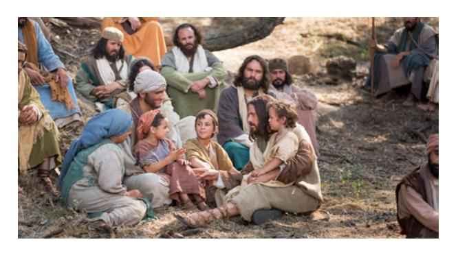
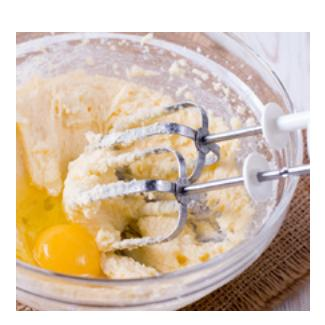
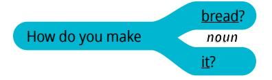
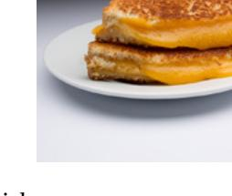
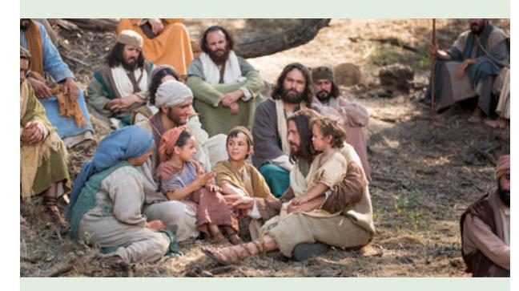
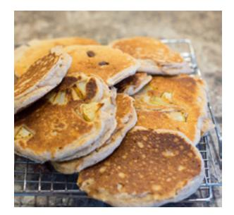
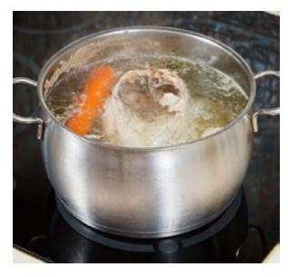
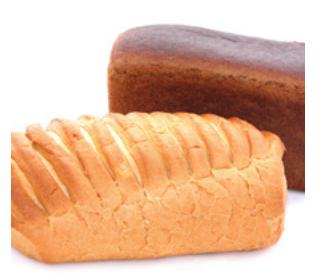
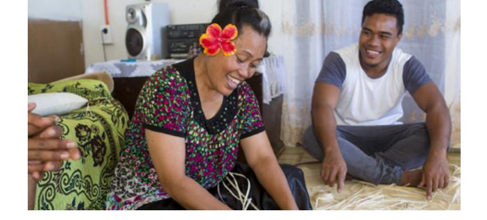

**LESSON 18**

# **Food**

**OBJETIVO: APRENDERÉ A DESCRIBIR CÓMO PREPARAR COMIDA.**

# Personal Study

Prepárate para tu grupo de conversación y completa las actividades A–E.

## **Study the Principle of Learning: You Are a Child of God**

*I am a child of God with eternal potential and purpose.*

Eres un hijo amado o una hija amada de Dios; tienes valor y potencial eterno. Aprendemos más acerca de esto en el Libro de Mormón, donde leemos acerca de una ocasión en la que Jesucristo enseñó y bendijo a las personas. Él dedicó tiempo a bendecir a cada persona, una por una, y dedicó tiempo a bendecir y enseñar a sus niños.

Mientras bendecía a los niños, ocurrió algo asombroso: "[Jesucristo] soltó la lengua de ellos, y declararon cosas grandes y maravillosas a sus padres […]; y desató la lengua de ellos de modo que pudieron expresarse" (3 Nefi 26:14).

Los niños enseñaron al pueblo cosas grandes y maravillosas. Aquellos niños tenían un gran potencial y Jesucristo los ayudó a descubrirlo. Dios puede ayudarte a descubrir tu potencial. Tienes mucho que dar; tienes un propósito y Dios puede mostrarte lo que es posible si buscas Su ayuda. Al igual que

Jesucristo dio a los niños la capacidad de hablar, Dios también puede soltarte la lengua. Él puede ayudarte a hablar y puede ayudarte a creer en tu potencial eterno.

## **Ponder**

- ¿Qué te ayudaría a creer en tu potencial eterno?
- ¿Qué miedos te impiden creer que puedes hablar inglés?
- ¿Cómo puedes buscar la ayuda de Dios para tener valor para superar tus miedos y hablar con más frecuencia?

## **Memorize Vocabulary**

Aprende el significado y la pronunciación de cada palabra antes de ir a tu grupo de conversación.

| first               | primero            |
|---------------------|--------------------|
| next                | luego              |
| then                | a continuación     |
| last                | por último         |
| ingredients         | ingredientes       |
| How do you make … ? | ¿Cómo se prepara…? |
| You need …          | Necesitas…         |

## **Nouns**

| bread           | pan               |
|-----------------|-------------------|
| butter          | mantequilla       |
| cheese sandwich | sándwich de queso |
| egg/eggs        | huevo/huevos      |
| flour           | harina            |
| oil             | aceite            |
| oven            | horno             |
| pan             | sartén            |
| stove           | estufa, cocina    |
| water           | agua              |

En el apéndice puedes ver más food nouns.

#### **Verbs**

| add  | añadir   |
|------|----------|
| bake | hornear  |
| boil | hervir   |
| cook | cocinar  |
| heat | calentar |
| mix  | mezclar  |
| put  | poner    |

## **Prepositions**

| in   | en    |
|------|-------|
| on   | en    |
| to   | hasta |
| with | con   |

## **Practice Pattern 1**

Practica el uso de los patrones hasta que puedas hacer y responder preguntas con confianza. Puedes reemplazar las palabras subrayadas por palabras de la sección "Memorize Vocabulary".

Q: What are the ingredients for (*noun*)? A: You need (*noun*), (*noun*), and (*noun*).

## **Questions**

*noun* What are the ingredients for bread?

## **Answers**

## **Examples**

- Q: What are the ingredients for bread?
- A: You need flour, eggs, and water.
- Q: What are the ingredients for a
- cheese sandwich? A: You need bread, butter, and cheese.

## **Practice Pattern 2**

Practica el uso de los patrones hasta que puedas hacer y responder preguntas con confianza. Intenta usar los patrones en una conversación con un amigo. Podrían hablar o enviarse mensajes.

Q: How do you make (*noun*)?

A: First, (*verb*) the (*noun*) (*preposition*) the (*noun*). Then, (*verb*) the (*noun*) (*preposition*) the (*noun*). Last, (*verb*) the (*noun*) (*preposition*) the (*noun*).

## **Questions**

#### **Answers**

| First, |      |         |             |            |
|--------|------|---------|-------------|------------|
| Then,  | put  | the oil | in          | the flour. |
| Last,  | verb | noun    | preposition | noun       |

#### **Examples**

Q: How do you make a cheese sandwich?

A: First, put the cheese on the bread.Then, add the oil to the pan.Then, heat the pan on the stove. Last, cook the sandwich.

#### **Use the Patterns**

| Escribe cuatro preguntas que puedas hacerle a         |
|-------------------------------------------------------|
| alguien. Escribe la respuesta a cada pregunta. Léelas |
| en voz alta.                                          |

Completa las actividades de la lección y las evaluaciones en línea en englishconnect.org/ learner/resources o en el *Cuaderno de ejercicios de EnglishConnect 1*.

## **Act in Faith to Practice English Daily**

Continúa practicando inglés a diario. Usa tu "Registro de estudio personal", repasa tu meta de estudio y evalúa tus esfuerzos.

# Conversation Group

## **Discuss the Principle of Learning: You Are a Child of God**

(20–30 minutes)

- Lean el principio de aprendizaje de esta lección en voz alta.
- Analicen las preguntas.

Repasa la lista de vocabulario con un compañero.

Practica el patrón 1 con un compañero:

- Practica hacer preguntas.
- Practica responder preguntas.
- Practica una conversación usando los patrones.

Repite con el patrón 2.

## **Activity 2: Create Your Own Sentences**

**(10–15 MINUTES)**

Fíjate en las ilustraciones y haz y responde preguntas sobre los ingredientes de cada comida. Luego, haz y responde preguntas acerca de cómo preparar cada comida. Tomen turnos.

#### **New Vocabulary**

| cut            | cortar            |
|----------------|-------------------|
| stir           | revolver, remover |
|                |                   |
| banana/bananas | banana/bananas    |
| milk           | leche             |
| pot            | olla              |
| salt           | sal               |
| sugar          | azúcar            |

## **Example**

- A: What are the ingredients for banana pancakes?
- B: You need eggs, milk, bananas, and flour.
- A: How do you make them?

B: First, mix the bananas with the eggs.

Next, add the milk.

Then, add the flour and stir.

Last, cook the pancakes in a pan on the stove.

#### **Image 1 Image 2**

## **Activity 3: Create Your Own Conversations**

**(15–20 MINUTES)**

Haz y responde preguntas sobre cómo preparar comidas que te gustan. Tomen turnos.

#### **New Vocabulary**

| grill     | plancha, parrilla |
|-----------|-------------------|
| tortillas | tortillas         |

#### **Example**

- A: What food do you like?
- B: I like tortillas.
- A: What are the ingredients?
- B: You need flour, salt, water, and oil.
- A: How do you make them?
- B: First, mix the flour and salt.

Next, stir the oil and water with the flour.

Last, cook on the grill then, eat it.

## **Evaluate**

(5–10 minutes)

Evalúa tu progreso con los objetivos y tus esfuerzos por practicar inglés a diario.

#### **Evaluate Your Progress**

I can:

• Say what ingredients are in foods.

• Describe how to make foods I like.

• Ask others how to make foods they like.

#### **Evaluate Your Efforts**

Usa el "Registro de estudio personal" que se encuentra en la introducción para evaluar tus esfuerzos y fijar una meta.

Comparte tu meta con un compañero.

## **Act in Faith to Practice English Daily**

"Por ser hijos de Dios procreados como espíritus, todos tenemos un origen, una naturaleza y un potencial divinos. Cada uno de nosotros 'es un amado hijo o hija procreado como espíritu por padres celestiales' ["La Familia: Una Proclamación para el Mundo", ChurchofJesusChrist.org]. ¡Esa es nuestra identidad! ¡Eso es lo que realmente somos!" (M. Russell Ballard, "Esperanza en Cristo", *Liahona*, mayo de 2021, pág. 53).

