**LESSON 19**

# **Money**

**OBJETIVO: APRENDERÉ A HACER Y RESPONDER PREGUNTAS SOBRE COMPRAR ARTÍCULOS.**

# Personal Study

Prepárate para tu grupo de conversación y completa las actividades A–E.

## **Study the Principle of Learning: Exercise Faith in Jesus Christ**

*Jesus Christ can help me do all things as I exercise faith in Him.*

Un día, Jesucristo estaba enseñando a miles de personas en el desierto. Jesús y Sus discípulos estaban preocupados porque la gente no había llevado comida. Un muchacho del grupo ofreció cinco panes y dos pescados para compartir. Muchas personas se preguntaban cómo se podría alimentar a todos solo con cinco panes y dos pescados, pero Jesús le dio gracias a Dios por la comida, la bendijo y la dividió en canastas, y envió a sus discípulos para que la compartieran. La Biblia dice:

"Y comieron todos y se saciaron; y […] sobr[aron] doce cestas llenas" (Mateo 14:20).

Todos comieron y hubo comida de sobra. Fue un milagro. Del mismo modo, es posible que creas que no tienes suficiente tiempo para estudiar inglés. Sigue el ejemplo de Jesús en este relato. Agradece a Dios el tiempo y la energía que tienes, y pídele que los bendiga. Si das lo que puedes con fe, Dios puede aumentar tu capacidad. Aunque solamente tengas un poco de tiempo, quizás puedas estudiar algunos patrones o intentar usar unas cuantas palabras nuevas cada día. Dios puede hacer que tus esfuerzos sean más productivos. Tener fe en Jesucristo y seguir Su ejemplo pueden ayudarte a hacer más de lo que creías que era posible.

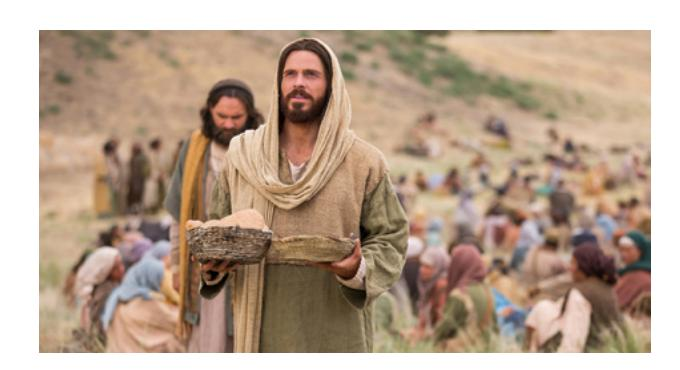

#### **Ponder**

- ¿De qué manera puede Dios ayudarte a aprender inglés?
- Piensa en una ocasión en la que Dios te ayudó a hacer más de lo que creías posible. ¿Qué hiciste? ¿Qué hizo Él?

## **Memorize Vocabulary**

Aprende el significado y la pronunciación de cada palabra antes de ir a tu grupo de conversación. Prueba a usar las palabras en tu vida. Piensa en cuándo y dónde podrías usar estas palabras.

### **Verbs**

| buy                      | comprar              |
|--------------------------|----------------------|
| cost/costs               | costar               |
| want                     | querer               |

### **Phrases**

| How much does this cost? | ¿Cuánto cuesta esto? |
|--------------------------|----------------------|

### **Nouns**

| coat/coats    | abrigo/abrigos        |
|---------------|-----------------------|
| dress/dresses | vestido/vestidos      |
| pants         | pantalones            |
| shirt/shirts  | camisa/camisas        |
| shoe/shoes    | zapato/zapatos        |
| tie/ties      | corbata/corbatas      |
|               |                       |
| car/cars      | automóvil/automóviles |
| phone/phones  | teléfono/teléfonos    |

### **Price**

| \$50/fifty dollars | \$50/cincuenta dólares |
|--------------------|------------------------|
|                    |                        |

En el apéndice puedes ver más *numbers*.

En el apéndice puedes ver más *currency*.

### **Adjectives**

| cheap     | barato |
|-----------|--------|
| expensive | caro   |
|           |        |
| good      | bueno  |
| bad       | malo   |

## **Practice Pattern 1**

Practica el uso de los patrones hasta que puedas hacer y responder preguntas con confianza. Puedes reemplazar las palabras subrayadas por palabras de la sección "Memorize Vocabulary".

Q: How much does this (*noun*) cost? A: It costs (*price*).

### **Questions**

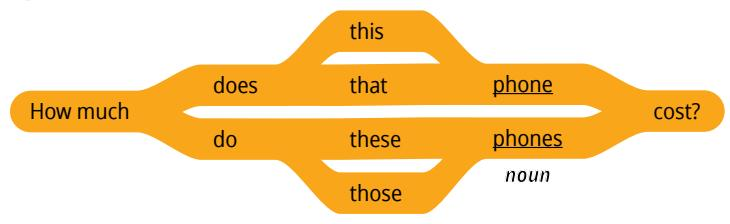

### **Answers**

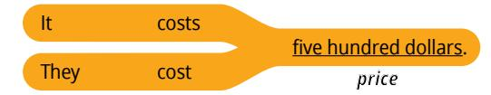

#### **Examples**

Q: How much does this phone cost? A: It costs five hundred dollars.

Q: How much do these pants cost? A: They cost twenty dollars.

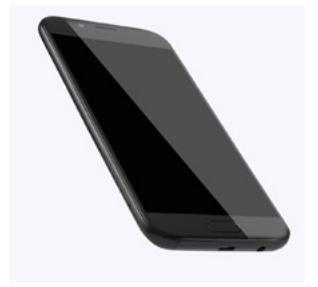

## **Practice Pattern 2**

Practica el uso de los patrones hasta que puedas hacer y responder preguntas con confianza. Intenta aprender más sobre los patrones de esta lección. Valora la posibilidad de utilizar libros o sitios web de gramática.

Q: Do you want to buy this (*noun*)?

A: Yes, this (*noun*) is (*adjective*).

### **Questions**

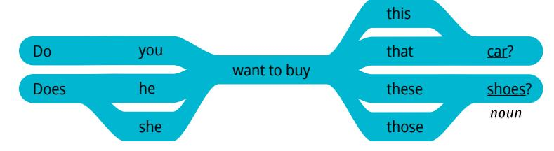

#### **Answers**

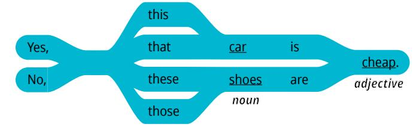

## **Examples**

Q: Do you want to buy that car? A: Yes, that car is cheap.

Q: Does she want to buy these shoes? A: No, those shoes are expensive.

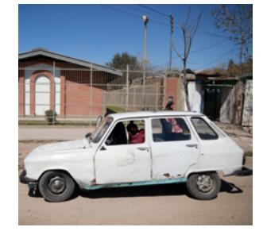

| Use the Patterns |
|------------------|
|                  |

| Escribe cuatro preguntas que puedas hacerle a alguien. Escribe la respuesta a cada pregunta. Léelas en voz alta. |
|------------------------------------------------------------------------------------------------------------------------|
|                                                                                                                        |
|                                                                                                                        |
|                                                                                                                        |
|                                                                                                                        |
|                                                                                                                        |

#### **Additional Activities**

Completa las actividades de la lección y las evaluaciones en línea en englishconnect.org/ learner/resources o en el *Cuaderno de ejercicios de EnglishConnect 1*.

## **Act in Faith to Practice English Daily**

Continúa practicando inglés a diario. Usa tu "Registro de estudio personal", repasa tu meta de estudio y evalúa tus esfuerzos.

## Conversation Group

## **Discuss the Principle of Learning: Exercise Faith in Jesus Christ**

(20–30 minutes)

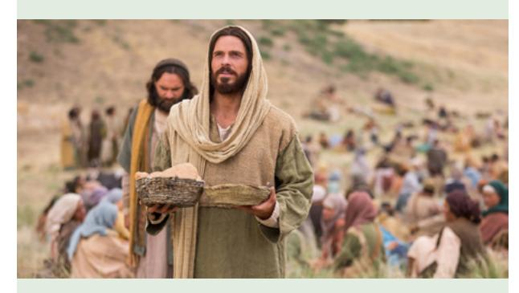

- Lean el principio de aprendizaje de esta lección en voz alta.
- Analicen las preguntas.

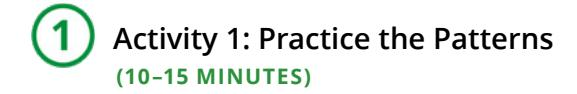

Repasa la lista de vocabulario con un compañero.

Practica el patrón 1 con un compañero:

- Practica hacer preguntas.
- Practica responder preguntas.
- Practica una conversación usando los patrones.

Repite con el patrón 2.

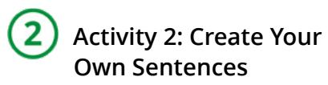

**(10–15 MINUTES)**

Fíjate en las ilustraciones Elige un precio para cada objeto, pero no le digas a tu compañero el precio que escogiste. Haz y responde preguntas acerca de cuánto cuesta cada objeto. Tomen turnos.

#### **New Vocabulary**

| apple/apples           | manzana/manzanas         |
|------------------------|--------------------------|
| motorcycle/motorcycles | motocicleta/motocicletas |
| table/tables           | mesa/mesas               |

#### **Example**

- A: How much do your apples cost?
- B: They cost three dollars. Do you want to buy these apples?
- A: Yes, those apples are cheap.
- B: How much do your apples cost?
- A: My apples cost five dollars. Do you want to buy these apples?
- B: No, those apples are expensive.

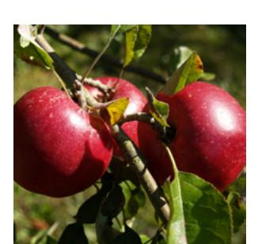

**Image 1 Image 2**

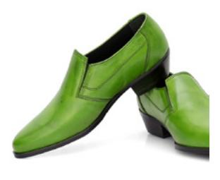

**Image 3 Image 4**

 **Activity 3: Create Your Own Conversations**

**(15–20 MINUTES)**

Hagan dramatizaciones. El compañero A está comprando ropa y tiene 50 dólares para gastar, y el compañero B trabaja en una tienda de ropa. Haz y responde preguntas acerca de los objetos que aparecen en cada imagen. El compañero A decide qué comprar y no puede gastar más de 50 dólares. Intercámbiense los roles.

#### **New Vocabulary**

| pretty                      | lindo, bonito            |
|-----------------------------|--------------------------|
| ugly                        | feo                      |
|                             |                          |
| Why not?                    | ¿Por qué no?             |
| Yes, I want to buy it.      | Sí, quiero comprarlo.    |
| No, I don't want to buy it. | No, no quiero comprarlo. |

#### **Example**

A: How much does this shirt cost?

B: It costs 15 dollars. Do you want to buy it?

A: No, I don't want to buy it.

B: Why not?

A: That shirt is expensive and ugly.

**Image 1**

40 dollars

**Image 2**

20 dollars

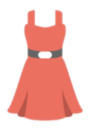

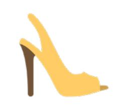

**Image 3** 25 dollars

**Image 4** 10 dollars

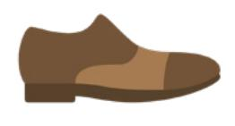

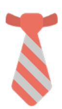

#### **Evaluate**

(5–10 minutes)

Evalúa tu progreso con los objetivos y tus esfuerzos por practicar inglés a diario.

#### **Evaluate Your Progress**

I can:

• Ask and answer questions about how much something costs.

• Say why I want to buy something.

• Say why I don't want to buy something.

#### **Evaluate Your Efforts**

Usa el "Registro de estudio personal" que se encuentra en la introducción para evaluar tus esfuerzos y fijar una meta.

Comparte tu meta con un compañero.

## **Act in Faith to Practice English Daily**

"En verdad, la fe es el poder que *permite* que lo improbable logre lo imposible. No minimicen la fe que ya tienen" (Russell M. Nelson, "Cristo ha resucitado; la fe en Él moverá montes", *Liahona*, mayo de 2021, pág. 104).

