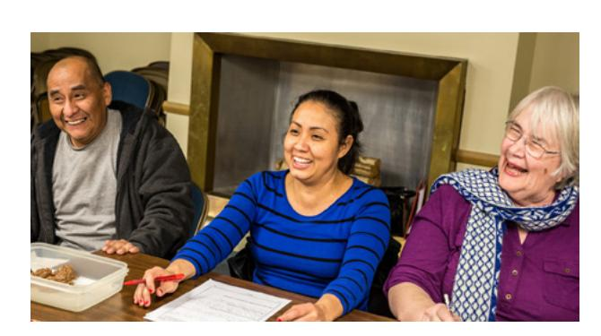
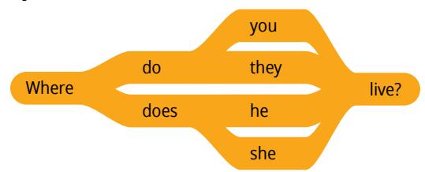
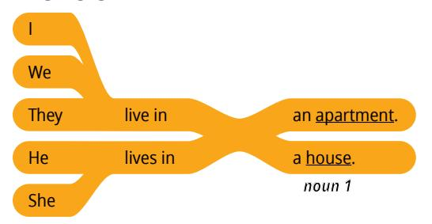
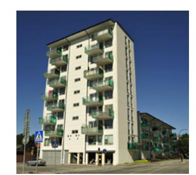
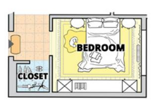
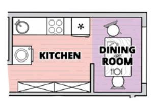
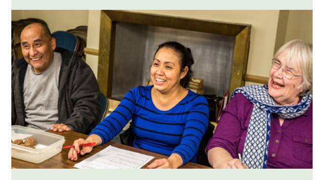
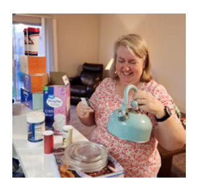
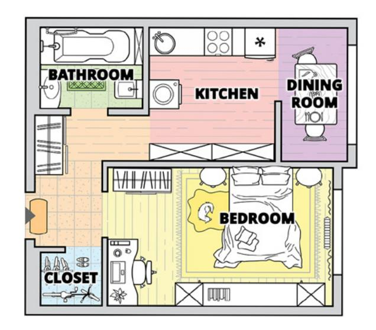
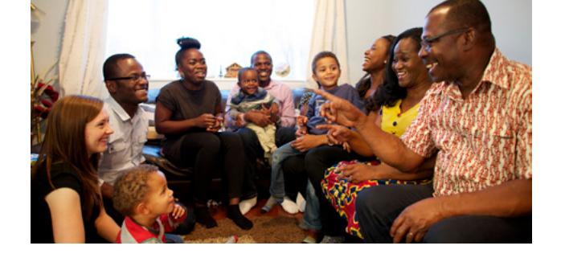

**LESSON 20**

# **Home**

**OBJETIVO: APRENDERÉ A HACER Y RESPONDER PREGUNTAS SOBRE EL LUGAR DONDE ALGUIEN VIVE.**

# Personal Study

Prepárate para tu grupo de conversación y completa las actividades A–E.

## **Study the Principle of Learning: Love and Teach One Another**

*I can learn by the Spirit as I love, teach, and learn with others.*

Eres un hijo de Dios y Él desea ayudarte a crecer y progresar. Él desea ayudarte a desarrollar nuevas habilidades y aprender muchas cosas buenas. Una forma importante de aprender consiste en enseñar a otra persona. Al hacerlo, puede mejorar tu propia comprensión. Dios te ha hecho una promesa maravillosa:

"Y os mando que os enseñéis el uno al otro la doctrina del reino.

"Enseñaos diligentemente, y mi gracia os acompañará, para que seáis más perfectamente instruidos […],

"a fin de que estéis preparados en todas las cosas" (Doctrina y Convenios 88:77–78, 80).

Cuando nos enseñamos y servimos los unos a los otros, invitamos al Espíritu a estar con nosotros. El Espíritu nos puede ayudar a comprender mejor y aprender más rápidamente. Enseñar a otros es una

manera en la que Dios aumenta nuestra capacidad de aprender. A veces, tenemos miedo de enseñar a los demás; otras veces, no creemos que tengamos algo que ofrecer, pero Dios sabe que tienes muchas cosas buenas que puedes compartir con los demás. Cuando compartimos lo que aprendemos, la enseñanza es mutua. A medida que enseñes a los demás y compartas tus experiencias, el Espíritu te ayudará a aprender aún más.

## **Ponder**

- El hecho de enseñar a otras personas, ¿cómo te puede ayudar a aprender aún más?
- ¿De qué maneras puedes enseñar y apoyar a los integrantes de tu grupo de EnglishConnect?

## **Memorize Vocabulary**

Aprende el significado y la pronunciación de cada palabra antes de ir a tu grupo de conversación. Prueba a etiquetar los objetos de tu casa para recordar las palabras en inglés.

| Where do you live? | ¿Dónde vives? |
|--------------------|---------------|
| I live in …        | Vivo en…      |

#### **Nouns 1**

| apartment | apartamento |
|-----------|-------------|
| house     | casa        |

## **Nouns 2**

| bathroom/bathrooms | baño/baños              |
|--------------------|-------------------------|
| bedroom/bedrooms   | dormitorio/dormitorios  |
| closet/closets     | armario/armarios        |
| dining room        | comedor                 |
| family room        | sala familiar           |
| kitchen            | cocina                  |
| living room        | sala de estar           |
| room/rooms         | habitación/habitaciones |
| stairs             | escaleras               |

#### **Prepositions**

| above                    | sobre, encima     |
|--------------------------|-------------------|
| across from              | enfrente de       |
| below                    | abajo             |
| next to                  | junto a           |
| left of/to the left of   | a la izquierda de |
| right of/to the right of | a la derecha de   |

## **Practice Pattern 1**

Practica el uso de los patrones hasta que puedas hacer y responder preguntas con confianza. Puedes reemplazar las palabras subrayadas por palabras de la sección "Memorize Vocabulary".

Q: Where do you live? A: I live in an (*noun 1*).

#### **Questions**

## **Answers**

## **Examples**

Q: Where do you live? A: I live in an apartment.

Q: Where does she live? A: She lives in a house.

## **Practice Pattern 2**

Practica el uso de los patrones hasta que puedas hacer y responder preguntas con confianza. Prueba a decir los patrones en voz alta. Si lo deseas, podrías grabarte. Presta atención a tu pronunciación y fluidez.

Q: Where is the (*noun 2*)? A: It's (*preposition*) the (*noun 2*).

## **Questions**

#### **Answers**

## **Examples**

Q: Where is the closet? A: It's next to the bedroom.

Q: Where is the dining room? A: It's to the right of the kitchen.

## **Use the Patterns**

Escribe cuatro preguntas que puedas hacerle a alguien. Escribe la respuesta a cada pregunta. Léelas en voz alta.

## **Additional Activities**

Completa las actividades de la lección y las evaluaciones en línea en englishconnect.org/ learner/resources o en el *Cuaderno de ejercicios de EnglishConnect 1*.

## **Act in Faith to Practice English Daily**

Continúa practicando inglés a diario. Usa tu "Registro de estudio personal", repasa tu meta de estudio y evalúa tus esfuerzos.

## Conversation Group

## **Discuss the Principle of Learning: Love and Teach One Another**

(20–30 minutes)

- Lean el principio de aprendizaje de esta lección en voz alta.
- Analicen las preguntas.

Repasa la lista de vocabulario con un compañero.

Practica el patrón 1 con un compañero:

• Practica hacer preguntas.

Repite con el patrón 2.

- Practica responder preguntas.
- Practica una conversación usando los patrones.

## **Activity 2: Create Your Own Sentences**

**(10–15 MINUTES)**

Haz y responde preguntas acerca del lugar en que viven tú y tu familia. Tomen turnos. Cambia de compañero y vuelve a practicar.

- A: Where do you live?
- B: I live in an apartment.
- A: Where is the kitchen in your apartment?
- B: In my apartment, the kitchen is next to the living room.

## **Activity 3: Create Your Own Conversations**

**(15–20 MINUTES)**

#### **Part 1**

Fíjate en el plano y haz y responde preguntas acerca de dónde se encuentran las habitaciones. Tomen turnos.

#### **Example**

A: Where is the dining room?

B: The dining room is to the right of the kitchen.

## **Part 2**

Dibuja rápidamente un plano. Etiqueta las habitaciones y haz y responde preguntas acerca del plano. Di todo lo que puedas. Tomen turnos.

#### **New Vocabulary**

| How many bedrooms are   | ¿Cuántos dormitorios    |
|-------------------------|-------------------------|
| there?                  | hay?                    |
| Is there a living room? | ¿Hay una sala de estar? |

#### **Example**

A: How many rooms are there?

B: There are two rooms.

A: Is there a kitchen?

B: Yes, there is.

A: Where is the living room?

B: The living room is next to the kitchen.

## **Evaluate**

(5–10 minutes)

Evalúa tu progreso con los objetivos y tus esfuerzos por practicar inglés a diario.

#### **Evaluate Your Progress**

I can:

• Talk about where I live.

• Ask and talk about where others live.

• Say where rooms are in a house or an apartment.

#### **Evaluate Your Efforts**

Usa el "Registro de estudio personal" que se encuentra en la introducción para evaluar tus esfuerzos y fijar una meta.

Comparte tu meta con un compañero.

## **Act in Faith to Practice English Daily**

"Si enseñamos y aprendemos de la manera que el Señor ha prescrito, Él enviará a Su Espíritu para edificarnos e iluminarnos a medida que lo hagamos" (véase Dallin H. Oaks, "La enseñanza y el aprendizaje por medio del Espíritu", *Liahona*, mayo de 1999, pág. 16).

