**LESSON 21**

# **Home**

**OBJETIVO: APRENDERÉ A DESCRIBIR UN BAÑO Y UN DORMITORIO.**

# Personal Study

Prepárate para tu grupo de conversación y completa las actividades A–E.

## **Study the Principle of Learning: Counsel with the Lord**

*I improve my learning by counseling with God daily about my efforts.*

Jesucristo estaba enseñando a un grupo de personas cuando un joven se le acercó y le preguntó qué debía hacer para progresar. La pregunta que planteó aquel joven es una pregunta que cada uno de nosotros puede hacer cuando le consultamos al Padre Celestial cómo mejorar:

"¿Qué más me falta?" (Mateo 19:20).

Tú puedes hacer esta misma pregunta mediante la oración. Oramos a Dios en el nombre de Su Hijo, Jesucristo. Con la ayuda de Dios, puedes identificar carencias en tu aprendizaje e intentar solucionarlas. Por ejemplo, si tienes dificultades para hablar con fluidez, puedes dedicar diez minutos a practicar la expresión oral sin preocuparte de cometer errores. O bien, si cometes muchos errores, puedes dedicar diez minutos a hablar con lentitud y cuidado. Consultar al Señor puede ayudarte a comprender qué pequeños pasos debes dar para alcanzar tus metas.

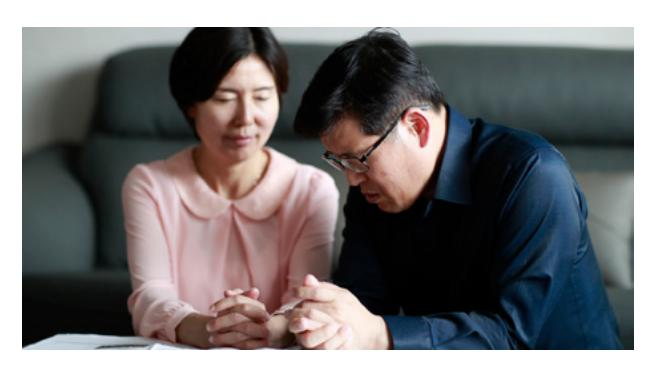

## **Ponder**

- Cuando consultas a Dios, ¿qué carencias ves en tu aprendizaje?
- ¿Qué metas pequeñas puedes fijarte para resolver esas carencias?

## **Memorize Vocabulary**

Aprende el significado y la pronunciación de cada palabra antes de ir a tu grupo de conversación. Prueba a etiquetar los objetos de tu casa para recordar las palabras en inglés.

### **Phrases**

| There is …  | Hay (singular)… |
|-------------|-----------------|
| There are … | Hay (plural)…   |

### **Nouns**

| bathroom/bathrooms | baño/baños                        |
|--------------------|-----------------------------------|
| bathtub/bathtubs   | bañera/bañeras                    |
| bed/beds           | cama/camas                        |
| bedroom/bedrooms   | dormitorio/dormitorios            |
| blanket/blankets   | cobija/cobijas (manta/ mantas) |
| cupboard/cupboards | alacena/alacenas                  |
| door/doors         | puerta/puertas                    |
| floor              | piso                              |
| lamp/lamps         | lámpara/lámparas                  |
| mirror/mirrors     | espejo/espejos                    |
| pillow/pillows     | almohada/almohadas                |
| shower/showers     | ducha/duchas                      |
| sink/sinks         | fregadero/fregaderos              |
| toilet/toilets     | inodoro/inodoros                  |
| towel/towels       | toallas/toallas                   |
| window/windows     | ventana/ventanas                  |

En la lección 20 puedes ver más *nouns*.

### **Prepositions**

| above   | sobre, encima |
|---------|---------------|
| in      | en            |
| next to | junto a       |
| on      | en            |
| under   | debajo        |

## **Practice Pattern 1**

Practica el uso de los patrones hasta que puedas hacer y responder preguntas con confianza. Puedes reemplazar las palabras subrayadas por palabras de la sección "Memorize Vocabulary".

A: Tell me about your (*noun*).
A_es: Cuéntame sobre tu (*sustantivo*).

B: There is (*noun*) in the (*noun*).

### **Request**

| Tell me about | your | bedroom. |
|---------------|------|----------|
|               |      | noun     |

### **Answers**

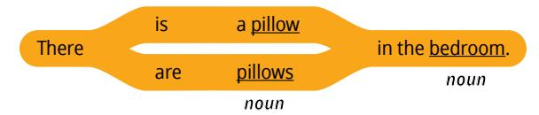

## **Examples**

- A: Tell me about your bathroom.
- B: There is a mirror in the bathroom. There are sinks.
- A: Tell me about your bedroom.
- B: There is a window in the bedroom. There are pillows.

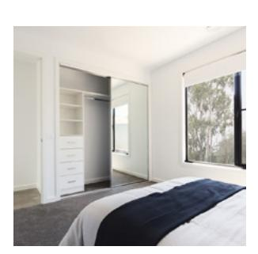

## **Practice Pattern 2**

Practica el uso de los patrones hasta que puedas hacer y responder preguntas con confianza. Intenta realizar las actividades 1 y 2 del grupo de conversación antes de que tu grupo se reúna.

Q: Where is the (*noun*)?
Q_es: ¿Dónde está el (*sustantivo*)?

A: The (*noun*) is above the (*noun*).
A_es: El (*sustantivo*) está encima del/la (*sustantivo*).

#### **Questions**

| Where | is  | the towel?  |
|-------|-----|-------------|
|       | are | the towels? |
|       |     | noun        |

#### **Answers**

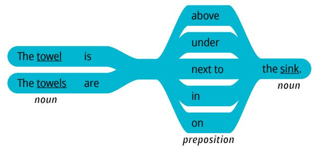

## **Examples**

Q: Where are the towels?
Q_es: ¿Dónde están los toallas?

A: The towels are under the sink.
A_es: Las toallas están bajo el fregadero.

Q: Where is the window?
Q_es: ¿Dónde está la ventana?

A: The window is above the bed.
A_es: La ventana está sobre la cama.

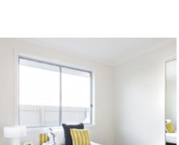

## **Use the Patterns**

Escribe cuatro preguntas que puedas hacerle a alguien. Escribe la respuesta a cada pregunta. Léelas en voz alta.

Completa las actividades de la lección y las evaluaciones en línea en englishconnect.org/ learner/resources o en el *Cuaderno de ejercicios de EnglishConnect 1*.

## **Act in Faith to Practice English Daily**

Continúa practicando inglés a diario. Usa tu "Registro de estudio personal", repasa tu meta de estudio y evalúa tus esfuerzos.

## Conversation Group

## **Discuss the Principle of Learning: Counsel with the Lord**

(20–30 minutes)

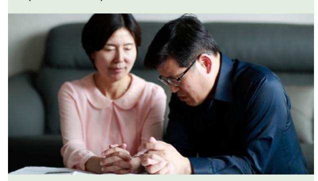

- Lean el principio de aprendizaje de esta lección en voz alta.
- Analicen las preguntas.

Repasa la lista de vocabulario con un compañero.

Practica el patrón 1 con un compañero:

- Practica hacer preguntas.
- Practica responder preguntas.
- Practica una conversación usando los patrones.

Repite con el patrón 2.

# **Activity 2: Create Your Own Sentences**

**(10–15 MINUTES)**

Fíjate en las ilustraciones y haz y responde preguntas sobre cada habitación. Di todo lo que puedas. Tomen turnos.

#### **Example**

- A: Tell me about the bedroom.
- B: There is a bed in the bedroom. There is a mirror next to the bed. There are clothes on the floor.

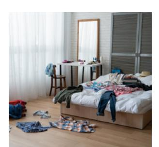

A: Where is the blanket?

B: The blanket is on the bed.

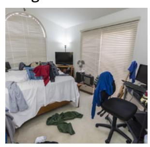

#### **Image 1 Image 2**

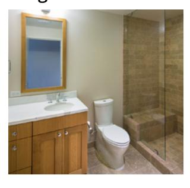

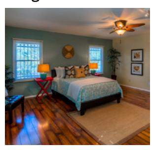

**Image 3 Image 4**

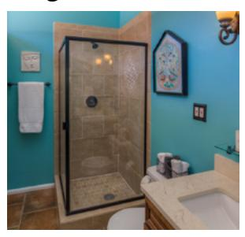

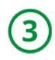

## **Activity 3: Create Your Own Conversations**

**(15–20 MINUTES)**

## **Part 1**

Haz y responde preguntas acerca de un dormitorio. Di todo lo que puedas. Tomen turnos.

#### **New Vocabulary**

| big   | grande      |
|-------|-------------|
| small | pequeño     |
| messy | desordenado |
| clean | limpio      |

#### **Example**

A: Tell me about your bedroom.

B: There is a pillow on the bed. There is a blanket on the bed. There is a lamp next to the bed.

A: Is it messy or clean?

B: It is clean.

A: Where is the window?

B: The window is above the bed.

#### **Part 2**

Haz y responde preguntas acerca de un baño. Di todo lo que puedas. Tomen turnos.

#### **Example**

A: Tell me about your bathroom.

B: There is a sink in the bathroom. There is a mirror above the sink. There is a cupboard under the sink. There is a shower next to the toilet.

A: Is it big or small?

B: It is small.

A: Where is the towel?

B: The towel is next to the shower.

#### **Evaluate**

(5–10 minutes)

Evalúa tu progreso con los objetivos y tus esfuerzos por practicar inglés a diario.

#### **Evaluate Your Progress**

I can:

• Describe a bedroom and a bathroom.
• _es: Describir una habitación y un baño.

• Describe where things are in a bedroom and a bathroom.
• _es: Describir dónde están las cosas en una habitación y un baño.

## **Evaluate Your Efforts**

Usa el "Registro de estudio personal" que se encuentra en la introducción para evaluar tus esfuerzos y fijar una meta.

Comparte tu meta con un compañero.

## **Act in Faith to Practice English Daily**

"El Espíritu Santo nos inducirá a mejorar y nos guiará a casa. No obstante, a lo largo del camino necesitamos pedir instrucciones al Señor" (véase Larry R. Lawrence, "¿Qué más me falta?", *Liahona*, noviembre de 2015, pág. 33).

