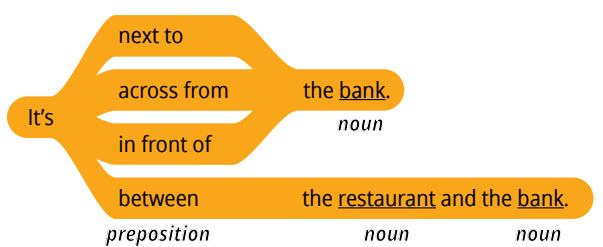
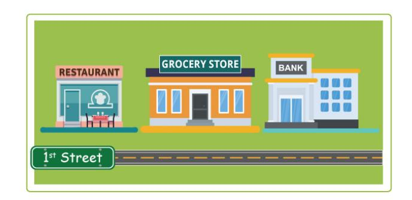
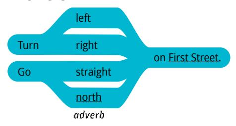
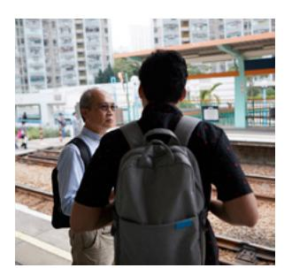
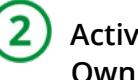
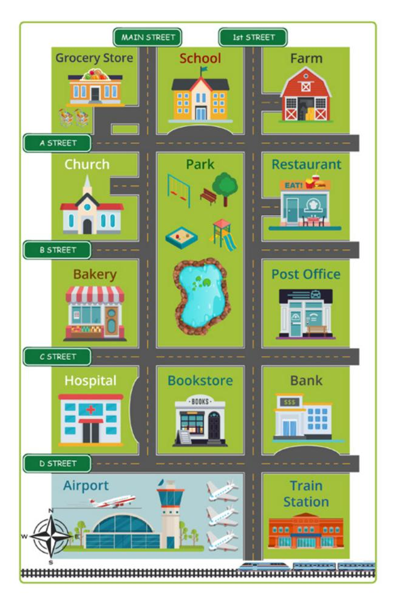

**LESSON 22**

# **Community**

**OBJETIVO: APRENDERÉ A PEDIR Y DAR INDICACIONES.**

## Personal Study

Prepárate para tu grupo de conversación y completa las actividades A–E.

## **Study the Principle of Learning: You Are a Child of God**

*I am a child of God with eternal potential and purpose.*

Piensa en lo que has aprendido sobre tu identidad como hijo de Dios. Piensa en tu relación con Él y medita en lo que Él te ha enseñado acerca de tu propósito y tu potencial. Reflexiona sobre las experiencias que has tenido aprendiendo inglés. ¿Cómo te has sentido cuando Él te ha ayudado a hacer cosas que creías imposibles?

Tu experiencia colaborando con Dios para aprender te ha preparado para ayudar a otras personas.

Jesús nos enseñó: "Os doy a vosotros ser la luz de este pueblo […]; por lo tanto, así alumbre vuestra luz delante de este pueblo, de modo que vean vuestras buenas obras, y glorifiquen a vuestro Padre que está en los cielos" (3 Nefi 12:14, 16).

Tienes mucha luz que compartir y puedes ser un ejemplo de cómo Dios puede ayudar a Sus hijos a aprender y progresar. Puedes compartir cómo Dios te ha ayudado a aprender inglés; puedes ayudar a otras personas a aprender a colaborar con Dios para alcanzar su potencial y puedes compartir con ellas cómo has llegado a creer esta afirmación: "Soy un hijo de Dios, con un potencial y un propósito eternos".

## **Ponder**

- ¿Cómo puedes ser una luz para las personas de tu entorno?
- ¿Cómo puedes seguir desarrollando una relación con tu Padre Celestial a medida que aprendes y creces?

## **Memorize Vocabulary**

Aprende el significado y la pronunciación de cada palabra antes de ir a tu grupo de conversación. Intenta usar las nuevas palabras en una conversación o en un mensaje para alguien que sepa inglés.

### **Verbs**

| go                  | ir                     |
|---------------------|------------------------|
| turn                | girar                  |

### **Phrases**

| How do I get to … ? | ¿Cómo puedo llegar a…? |
|---------------------|------------------------|

### **Nouns**

| bank                    | banco                   |
|-------------------------|-------------------------|
| grocery store           | tienda de comestibles   |
| restaurant              | restaurante             |
| store                   | tienda                  |
| train station           | estación de trenes      |
| First Street/1st Street | Calle Primera/Calle 1.ª |
| Green Lane              | Camino Verde            |

En la lección 20 puedes ver más *nouns*.

### **Adverbs**

| north    | norte          |
|----------|----------------|
| south    | sur            |
| east     | este           |
| west     | oeste          |
| left     | izquierda      |
| right    | derecha        |
| straight | derecho, recto |

### **Prepositions**

| across from | enfrente de |
|-------------|-------------|
| between     | entre       |
| in front of | delante de  |
| next to     | junto a     |

## **Practice Pattern 1**

Practica el uso de los patrones hasta que puedas hacer y responder preguntas con confianza. Puedes reemplazar las palabras subrayadas por palabras de la sección "Memorize Vocabulary".

Q: Where is the (*noun*)?
Q_es: ¿Dónde está el (*sustantivo*)?

A: It's next to the (*noun*).
A_es: Es junto al (*sustantivo*).

#### **Questions**

#### **Answers**

## **Examples**

Q: Where is the grocery store?
Q_es: ¿Dónde está la tienda de víveres?

A: It's next to the bank.
A_es: Es al lado del banco.

Q: Where is the grocery store?
Q_es: ¿Dónde está la tienda de comestibles?

A: It's between the restaurant and the bank.
A_es: Es entre el restaurante y la banca.

## **Practice Pattern 2**

Practica el uso de los patrones hasta que puedas hacer y responder preguntas con confianza. Intenta usar los patrones en una conversación con un amigo. Podrían hablar o enviarse mensajes.

Q: How do I get to the (*noun*)?
Q_es: ¿Cómo llego al (*sustantivo*)?

A: Go (*adverb*) on First Street.
A_es: Ve (*adverbio*) por First Street.

### **Questions**

*noun* How do I get to the store?

#### **Answers**

#### **Examples**

Q: How do I get to the store?
Q_es: ¿Cómo llego a la tienda?

A: Go north. Turn right on First Street.
A_es: Ve hacia el norte. Gira a la derecha en la Primera Calle.

Q: How do I get to the train station?
Q_es: ¿Cómo llego a la estación de tren?

A: Go straight. Turn left on Green Lane. Turn right on B Street.
A_es: Avance recto. Gire a la izquierda en Verdes Lane. Gire a la derecha en B Street.

| _ | _ / |
|---|-----|
| ( | - 1 |
|   | _ / |
| • |     |

## **Use the Patterns**

Escribe cuatro preguntas que puedas hacerle a alguien. Escribe la respuesta a cada pregunta. Léelas en voz alta.

Completa las actividades de la lección y las evaluaciones en línea en englishconnect.org/ learner/resources o en el *Cuaderno de ejercicios de EnglishConnect 1*.

## **Act in Faith to Practice English Daily**

Continúa practicando inglés a diario. Usa tu "Registro de estudio personal", repasa tu meta de estudio y evalúa tus esfuerzos.

## Conversation Group

## **Discuss the Principle of Learning: You Are a Child of God**

(20–30 minutes)

- Lean el principio de aprendizaje de esta lección en voz alta.
- Analicen las preguntas.

Repasa la lista de vocabulario con un compañero.

Practica el patrón 1 con un compañero:

- Practica hacer preguntas.
- Practica responder preguntas.
- Practica una conversación usando los patrones.

Repite con el patrón 2.

## **Activity 2: Create Your Own Sentences**

**(10–15 MINUTES)**

Haz y responde preguntas acerca de una ciudad o un pueblo que conozcas. Di todo lo que puedas. Tomen turnos.

#### **New Vocabulary**

| bakery      | panadería      |
|-------------|----------------|
| bookstore   | librería       |
| church      | iglesia        |
| library     | biblioteca     |
| park        | parque         |
| post office | oficina postal |
| school      | escuela        |

## **Example**

- A: Where is the bank?
- B: It's next to the post office.
- A: Where is the park?
- B: It's across from my house.

## **Activity 3: Create Your Own Conversations**

**(15–20 MINUTES)**

Hagan dramatizaciones. Fíjate en el mapa. El compañero A escoge una ubicación de inicio y un destino final, y el compañero B da indicaciones. Intercámbiense los roles.

## **Example**

A: I'm at the grocery store. How do I get to the bank?

B: Go south on Main Street. Turn left on C Street. Then turn right on 1st Street. The bank is across from the train station.

#### **Evaluate**

(5–10 minutes)

Evalúa tu progreso con los objetivos y tus esfuerzos por practicar inglés a diario.

#### **Evaluate Your Progress**

I can:

• Describe the location of places I visit.

• Ask for and give directions.

#### **Evaluate Your Efforts**

Usa el "Registro de estudio personal" que se encuentra en la introducción para evaluar tus esfuerzos y fijar una meta.

Comparte tu meta con un compañero.

#### **Act in Faith to Practice English Daily**

"Nunca olvides […] que realmente eres un hijo de Dios, que has heredado parte de Su naturaleza divina, y que Él te ama y desea ayudarte y bendecirte" (véase Gordon B. Hinckley, "Eres un hijo de Dios", *Liahona*, mayo de 2003, pág. 119).

