**LESSON 23**

# **Health**

**OBJETIVO: APRENDERÉ A NOMBRAR LAS PARTES DEL CUERPO Y A DECIR POR QUÉ DUELEN.**

## Personal Study

Prepárate para tu grupo de conversación y completa las actividades A–E.

## **Study the Principle of Learning: Exercise Faith in Jesus Christ**

*Jesus Christ can help me do all things as I exercise faith in Him.*

En la Biblia aprendemos acerca de una mujer que había estado enferma durante muchos años. Había gastado todo su dinero tratando de encontrar una cura y había acudido a muchos médicos, pero su enfermedad empeoró. Entonces, la mujer oyó hablar de Jesús. Lo vio entre una multitud de personas y creyó que Jesús tenía poder para sanarla; creyó que, si tan solo pudiera tocar Su ropa, sanaría. Se puso detrás de Jesús, le tocó la ropa y sintió que su cuerpo sanaba. Jesús sintió que de Su cuerpo salía poder y, cuando preguntó quién le había tocado la ropa, ella tuvo miedo de admitirlo al principio, pero luego lo confesó.

Jesús le dijo: "Hija, tu fe te ha sanado; ve en paz" (Lucas 8:48).

Aquella mujer creyó y actuó con fe. Extender la mano hacia Jesús fue un pequeño acto, pero permitió que Su poder entrara en la vida de ella. No debe darte vergüenza ni miedo pedirle ayuda a Dios; Él desea ayudarte. Cuando ejerces fe, incluso en los actos pequeños, puedes llevar el poder de Jesucristo a tu vida.

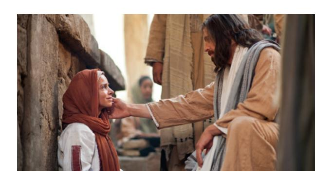

#### **Ponder**

- ¿De qué manera te has fortalecido al aprender inglés?
- ¿Cómo puedes ejercer fe en otros ámbitos de tu vida?

## **Memorize Vocabulary**

Aprende el significado y la pronunciación de cada palabra antes de ir a tu grupo de conversación. Piensa en situaciones en las que podrías usar la palabra en tu práctica diaria.

### **Phrases**

| What happened to … ?  | ¿Qué le sucedió a…? |
|-----------------------|---------------------|
| What is wrong?/What's wrong? | ¿Qué pasa?/¿Qué problema hay? |

### **Nouns**

| arm/arms       | brazo/brazos                 |
|----------------|------------------------------|
| back           | espalda                      |
| ear/ears       | oreja/orejas (oído/oídos)    |
| eye/eyes       | ojo/ojos                     |
| finger/fingers | dedo/dedos (de las manos) |
| foot/feet      | pie/pies                     |
| hand/hands     | mano/manos                   |
| head           | cabeza                       |
| knee/knees     | rodilla/rodillas             |
| leg/legs       | pierna/piernas               |
| mouth          | boca                         |
| neck           | cuello                       |
| stomach        | estómago                     |
| tooth/teeth    | diente/dientes               |

### **Verbs** Present /Verbs Past**

| break/broke | romper/roto      |
|-------------|------------------|
| burn/burned | quemar/quemado   |
| cut/cut     | cortar/cortado   |
| hurt/hurt   | herir/herido     |
| hit/hit     | golpear/golpeado |

## **Practice Pattern 1**

Practica el uso de los patrones hasta que puedas hacer y responder preguntas con confianza. Puedes reemplazar las palabras subrayadas por palabras de la sección "Memorize Vocabulary".

Q: What is wrong?
Q_es: ¿Qué hay malo?

A: My (*noun*) hurts.
A_es: Mi (*sustantivo*) duele.

#### **Questions**

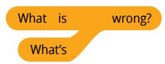

### **Answers**

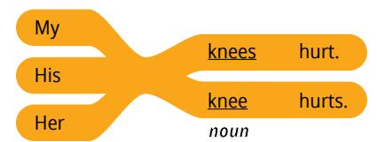

## **Examples**

Q: What's wrong?
Q_es: ¿Qué hay malo?

A: His knees hurt.
A_es: Sus rodillas duele.
CRITICAL: Debes preservar estos lugares reservados exactos: []

Q: What's wrong?
Q_es: ¿Qué hay malo?

A: My stomach hurts.
A_es: Mi estómago duele.

Q: What's wrong?
Q_es: ¿Qué hay malo?

A: Her head hurts.
A_es: Su cabeza duele.

## **Practice Pattern 2**

Practica el uso de los patrones hasta que puedas hacer y responder preguntas con confianza. Intenta aprender más sobre los patrones de esta lección. Valora la posibilidad de utilizar libros o sitios web de gramática.

Q: What happened to your (*noun*)?
Q_es: ¿Qué le pasó a tu (*sustantivo*)?

A: I (*verb past*) my (*noun*).
A_es: Yo (*verbo pasado*). mi (*sustantivo*).

## **Questions**

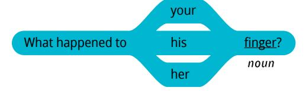

#### **Answers**

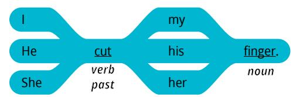

#### **Examples**

Q: What happened to your finger?
Q_es: ¿Qué le pasó a tu dedo?
A: I cut my finger.
A_es: Corté mi dedo.

Q: What happened to his leg?
Q_es: ¿Qué le pasó a su pierna?
A: He broke his leg.
A_es: Él se rompió la pierna.

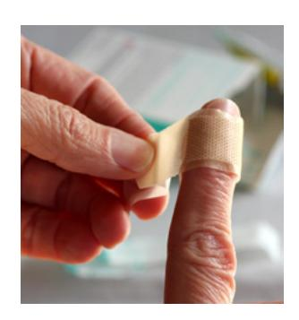

| _ | _ / |
|---|-----|
|   | - 1 |
|   | _ / |
| • |     |

#### **Use the Patterns**

| Escribe cuatro preguntas que puedas hacerle a         |
|-------------------------------------------------------|
| alguien. Escribe la respuesta a cada pregunta. Léelas |
| en voz alta.                                          |
|                                                       |

Completa las actividades de la lección y las evaluaciones en línea en englishconnect.org/ learner/resources o en el *Cuaderno de ejercicios de EnglishConnect 1*.

## **Act in Faith to Practice English Daily**

Continúa practicando inglés a diario. Usa tu "Registro de estudio personal", repasa tu meta de estudio y evalúa tus esfuerzos.

# Conversation Group

## **Discuss the Principle of Learning: Exercise Faith in Jesus Christ**

(20–30 minutes)

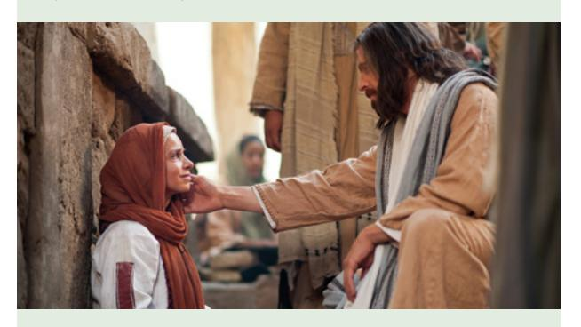

- Lean el principio de aprendizaje de esta lección en voz alta.
- Analicen las preguntas.

Repasa la lista de vocabulario con un compañero.

Practica el patrón 1 con un compañero:

- Practica hacer preguntas.
- Practica responder preguntas.
- Practica una conversación usando los patrones.

Repite con el patrón 2.

# **Activity 2: Create Your Own Sentences (10–15 MINUTES)**

Fíjate en las ilustraciones y haz y responde preguntas acerca de las personas que aparecen en cada imagen. Tomen turnos.

## **Example**

- A: What's wrong?
- B: Her head hurts.
- A: What happened to her head?
- B: She hit her head.

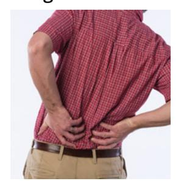

**Image 1 Image 2**

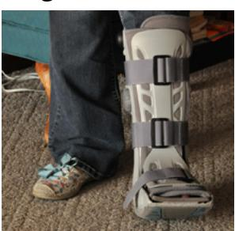

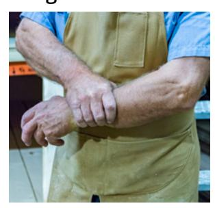

**Image 3 Image 4**

## **Activity 3: Create Your Own Conversations**

**(15–20 MINUTES)**

Hagan dramatizaciones. El compañero A es la persona de la imagen y el compañero B es un amigo. Haz y responde preguntas acerca de cada imagen. ¡Sé creativo! Intercámbiense los roles. Cambia de compañero y vuelve a practicar.

## **New Vocabulary**

fall/fell caer/caído

## **Example**

A: What's wrong?

B: My knee hurts.

A: What happened to your knee?

B: I fell and I hit my knee.

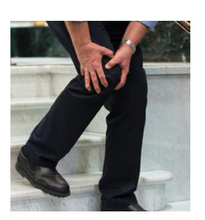

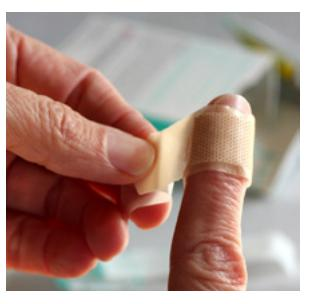

**Image 1 Image 2**

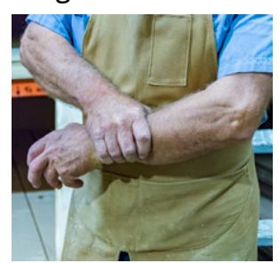

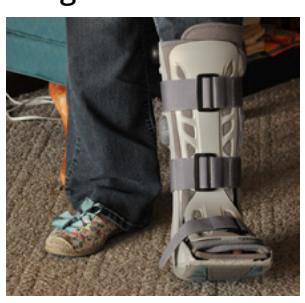

**Image 3 Image 4**

#### **Evaluate**

(5–10 minutes)

Evalúa tu progreso con los objetivos y tus esfuerzos por practicar inglés a diario.

## **Evaluate Your Progress**

I can:

• Name parts of my body.
• _es: Nombrar partes de mi cuerpo.

• Say what part of my body hurts.
• _es: Decir qué parte de mi cuerpo me duele.

• Say why my body hurts.
• _es: Decir por qué me duele el cuerpo.

#### **Evaluate Your Efforts**

Usa el "Registro de estudio personal" que se encuentra en la introducción para evaluar tus esfuerzos y fijar una meta.

Comparte tu meta con un compañero.

## **Act in Faith to Practice English Daily**

"Cuando el Salvador sepa que ustedes realmente desean acudir a Él —cuando Él pueda sentir que el mayor deseo de sus corazones es obtener el poder de Él en sus vidas—, serán guiados por el Espíritu Santo para saber exactamente lo que deben hacer [véase Doctrina y Convenios 88:63]. Cuando se estiren espiritualmente más allá de lo que jamás se hayan esforzado, entonces Su poder se derramará sobre ustedes" (Russell M. Nelson, "Cómo obtener el poder de Jesucristo en nuestra vida", *Liahona*, mayo de 2017, pág. 42).

