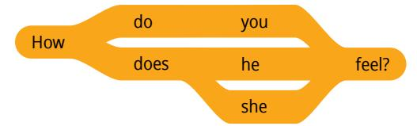
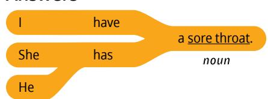
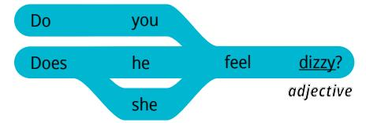
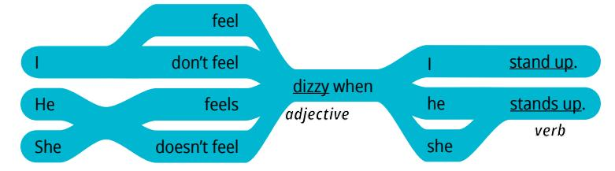
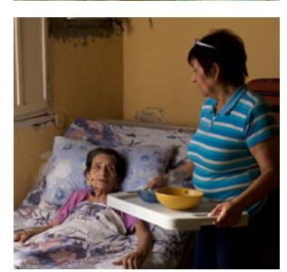

**LESSON 24**

# **Health**

**OBJETIVO: APRENDERÉ A DESCRIBIR CÓMO SE SIENTE ALGUIEN CUANDO ESTÁ ENFERMO.**

# Personal Study

Prepárate para tu grupo de conversación y completa las actividades A–E.

## **Study the Principle of Learning: Press Forward**

*With God's help, I can press forward even when I face obstacles.*

El profeta Lehi, en el Libro de Mormón, tuvo un sueño que nos enseña a seguir adelante. Lehi vio a muchas personas recorriendo un sendero hacia un hermoso árbol con un fruto delicioso. Ese fruto era el amor de Dios. Recorrer el sendero les resultaba difícil porque un "vapor de tinieblas" lo ocultó (1 Nefi 8:23). Afortunadamente, había una "barra de hierro" a la que podían aferrarse para permanecer en el sendero (1 Nefi 8:24). La barra de hierro es la palabra de Dios, que incluye las Escrituras. Esto es lo que Lehi dijo acerca del camino que recorrieron:

"Y siguieron hacia adelante, asidos constantemente a la barra de hierro, hasta que llegaron, y se postraron, y comieron del fruto del árbol" (1 Nefi 8:30).

Las personas llegaron hasta el árbol porque se mantuvieron asidas a la barra y siguieron avanzando, confiando en Dios. No se distrajeron ni se desanimaron cuando aparecieron las tinieblas. Tú estás esforzándote arduamente para aprender inglés. En ocasiones, te sientes cansado y no te apetece estudiar; a veces, hay otras cosas que requieren tu atención y tiempo, pero encuentras formas de estudiar igualmente. No pares ahora. Puedes seguir obteniendo educación si sigues adelante con esperanza en Jesucristo.

#### **Ponder**

- ¿Cuáles son tus "vapores de tinieblas" al aprender inglés?
- ¿Cómo puedes seguir adelante, incluso cuando te resulta difícil estudiar?

## **Memorize Vocabulary**

Aprende el significado y la pronunciación de cada palabra antes de ir a tu grupo de conversación. Intenta crear tarjetas de memorización como ayuda para memorizar nuevas palabras. Puedes usar papel o una aplicación.

### **Nouns**

| backache    | dolor de espalda  |
|-------------|-------------------|
| cold        | resfrío           |
| diarrhea    | diarrea           |
| earache     | dolor de oído     |
| headache    | dolor de cabeza   |
| sore throat | dolor de garganta |
| stomachache | dolor de estómago |
| toothache   | dolor de muelas   |

### **Adjectives**

| congested | congestionado |
|-----------|---------------|
| dizzy     | mareado       |
| nauseated | con náuseas   |
| sick      | enfermo       |
| tired     | cansado       |
| weak      | débil         |

### **Verbs**

| breathe  | respirar           |
|----------|--------------------|
| eat nuts | comer frutos secos |
| run      | correr             |
| stand up | ponerse de pie     |
| work     | trabajar           |

En la lección 10 puedes ver más *verbs*.

## **Practice Pattern 1**

Practica el uso de los patrones hasta que puedas hacer y responder preguntas con confianza. Puedes reemplazar las palabras subrayadas por palabras de la sección "Memorize Vocabulary".

Q: How do you feel?

A: I have a (*noun*).

#### **Questions**

### **Answers**

## **Examples**

Q: How do you feel?

A: I have a sore throat.

Q: How does he feel?

A: He has diarrhea.

## Practice Pattern 2

Practica el uso de los patrones hasta que puedas hacer y responder preguntas con confianza. Intenta fijarte en estos patrones durante tu práctica diaria.

Q: Do you feel (adjective)?

A: I feel (adjective) when I (verb).

#### Questions

#### **Answers**

## **Examples**

Q: Do you feel dizzy?

A: I feel dizzy when I stand up.

Q: Does she feel nauseated?

A: She feels nauseated when she eats nuts.

|  | Use the Patterns |
|--|------------------|
|  |                  |

| Escribe cuatro preguntas que puedas hacerle a                         |  |  |
|-----------------------------------------------------------------------|--|--|
| alguien. Escribe la respuesta a cada pregunta. Léelas en voz alta. |  |  |
|                                                                       |  |  |
|                                                                       |  |  |
|                                                                       |  |  |
|                                                                       |  |  |
|                                                                       |  |  |
|                                                                       |  |  |
|                                                                       |  |  |
|                                                                       |  |  |

### **Additional Activities**

Completa las actividades de la lección y las evaluaciones en línea en englishconnect.org/ learner/resources o en el *Cuaderno de ejercicios de EnglishConnect 1*.

## **Act in Faith to Practice English Daily**

Continúa practicando inglés a diario. Usa tu "Registro de estudio personal", repasa tu meta de estudio y evalúa tus esfuerzos.

# Conversation Group

## **Discuss the Principle of Learning: Press Forward**

(20–30 minutes)

- Lean el principio de aprendizaje de esta lección en voz alta.
- Analicen las preguntas.

Repasa la lista de vocabulario con un compañero.

Practica el patrón 1 con un compañero:

- Practica hacer preguntas.
- Practica responder preguntas.
- Practica una conversación usando los patrones.

Repite con el patrón 2.

**(10–15 MINUTES)**

Elige a una de las personas que aparecen a continuación. No le digas a tu compañero qué persona elegiste. Haz y responde preguntas para adivinar quién es la persona. Tomen turnos.

#### **New Vocabulary**

| cough      | tos             |
|------------|-----------------|
| fever      | fiebre          |
| runny nose | secreción nasal |
|            |                 |
| sneeze     | estornudar      |
| throw up   | vomitar         |

## **Example**

El compañero A escoge a Virgil.

B: Does he or she feel dizzy?

A: Yes, he feels dizzy.

B: Does he have a cough?

A: No, he doesn't have a cough.

B: Is it Virgil?

A: Yes.

## **Sun Wen**

- She feels dizzy.
- She is tired.
- She feels nauseated.
- She has a fever.
- She throws up a lot.

#### **Virgil**

- He feels weak.
- He is tired.
- He feels dizzy.
- He has a fever.
- He has diarrhea.

## **Aamir**

- He feels congested.
- He has a fever.
- He sneezes a lot.
- He has a cough.
- He has a sore throat.

## **Frida**

- She feels congested.
- She has a sore throat.
- She sneezes a lot.
- She has a cold.
- She has a cough.

#### **Franz**

- He feels weak.
- He is tired.
- He feels nauseated.
- He has a fever.
- He has diarrhea.

### **Louis**

- He can't breathe well.
- He has a fever.
- He sneezes a lot.
- He has a cough.
- He has a runny nose.

### **Sarai**

- She can't breathe well.
- She has a sore throat.
- She sneezes a lot.
- She has a cold.
- She has a runny nose.

## **Anja**

- She is weak.
- She is tired.
- She is nauseated.
- She has a fever.
- She throws up a lot.

## **Activity 3: Create Your Own Conversations**

**(15–20 MINUTES)**

Dramaticen cada situación que se indica a continuación. El compañero A hace preguntas y el compañero B las responde. Utiliza los patrones y el vocabulario de esta lección y de la lección 23. Di todo lo que puedas. Intercámbiense los roles.

## **Example**

El compañero A es enfermero y el compañero B es un paciente que tiene diarrea.

- A: How do you feel?
- B: My stomach hurts.
- A: Do you have a fever?
- B: No, I don't.
- A: Do you have diarrhea?

- A: Do you feel nauseated?
- B: I feel nauseated when I eat.

## **Situation 1**

El compañero A es un amigo y el compañero B llama a su amigo o amiga porque está resfriado(a).

## **Situation 2**

El compañero A es médico y el compañero B va al médico porque se siente enfermo y débil.

## **Situation 3**

El compañero A es un familiar y el compañero B se siente enfermo y habla con ese familiar.

## **Situation 4**

El compañero A es un enfermero que responde al teléfono y el compañero B llama porque tiene dolor de espalda y no puede respirar bien.

#### **Evaluate**

(5–10 minutes)

Evalúa tu progreso con los objetivos y tus esfuerzos por practicar inglés a diario.

#### **Evaluate Your Progress**

I can:

• Describe how I feel when sick.

• Describe how others feel when sick.

#### **Evaluate Your Efforts**

Usa el "Registro de estudio personal" que se encuentra en la introducción para evaluar tus esfuerzos y fijar una meta.

Comparte tu meta con un compañero.

## **Act in Faith to Practice English Daily**

"Hermanos y hermanas, en esta Iglesia creemos en el potencial divino de todos los hijos de Dios y en nuestra capacidad de llegar a ser algo más en Cristo. En el tiempo del Señor, lo que más importa no es dónde comenzamos, sino hacia dónde nos dirigimos" (Clark G. Gilbert, "Llegar a ser más en Cristo: La parábola de la pendiente", *Liahona*, noviembre de 2021, pág. 19).

