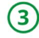
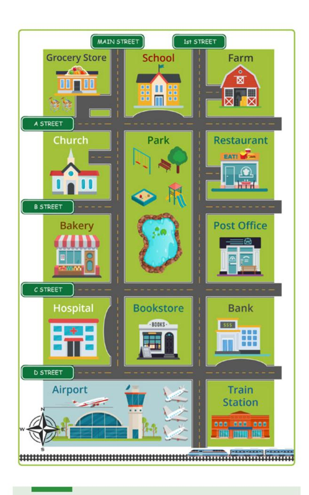
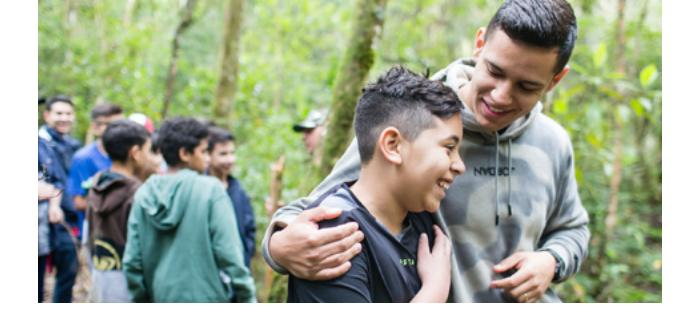

**LESSON 25**

# **Review**

**OBJETIVO: REPASARÉ ENGLISHCONNECT 1 Y REFLEXIONARÉ SOBRE MI EXPERIENCIA.**

# Personal Study

Prepárate para tu grupo de conversación y completa las actividades A–D.

## **Study the Principle of Learning: Learn by Study and by Faith**

*I can rely on God to seek learning by study and by faith.*

El Señor nos ha dado un patrón de aprendizaje:

"Buscad diligentemente y enseñaos el uno al otro palabras de sabiduría; sí, buscad palabras de sabiduría de los mejores libros; buscad conocimiento, tanto por el estudio como por la fe" (Doctrina y Convenios 88:118).

Reflexiona sobre tus experiencias con EnglishConnect. ¿Cómo has puesto en práctica este patrón? Reflexiona sobre los principios de aprendizaje y las afirmaciones que hemos aprendido juntos:

- "Eres un hijo de Dios": Soy un hijo de Dios, con un potencial y un propósito eternos.
- "Ejercer fe en Jesucristo": Jesucristo me puede ayudar a hacerlo todo si ejerzo fe en Él.
- "Asumir la responsabilidad": Tengo poder para elegir y soy responsable de mi propio aprendizaje.
- "Amarnos y enseñarnos los unos a los otros": Puedo aprender del Espíritu a medida que amo, enseño y aprendo con otras personas.
- "Seguir adelante": Con la ayuda de Dios, puedo seguir adelante aunque enfrente obstáculos.

• "Consultar al Señor": Mejoro mi aprendizaje al consultar a Dios a diario sobre mis esfuerzos.

Es posible que tu grupo de EnglishConnect vaya a finalizar, pero hay muchas cosas más que Dios quiere que aprendas y experimentes. Tu Padre Celestial te ama y quiere ayudarte a alcanzar tu potencial divino. Puedes confiar en Dios y seguir adelante para "busca[r] conocimiento, tanto por el estudio como por la fe".

#### **Ponder**

- ¿Cómo has experimentado el amor y la ayuda de Dios al aprender inglés?
- ¿Cómo has puesto en práctica los principios de aprendizaje en EnglishConnect?
- ¿Cómo aplicarás estos principios de aprendizaje en otros ámbitos de tu vida?

## **Prepare for Activity 1**

Lee las instrucciones de la actividad 1. Consulta la lista de temas, escribe una pregunta que puedas hacer sobre cada tema y lee las preguntas en voz alta.

#### Temas

- Greetings and Introductions (lesson 1; lesson 2)
- Family (lesson 6; lesson 7)
- Home (lesson 20; lesson 21)

| 1 |                  | \ |
|---|------------------|---|
| 1 | $\boldsymbol{c}$ | ٦ |
| ı | C                | J |
| • |                  |   |

## **Prepare for Activity 2**

Lee las instrucciones de la actividad 2. Consulta la lista de temas, escribe una pregunta que puedas hacer sobre cada tema y lee las preguntas en voz alta.

#### Temas

- Hobbies and Interests (lesson 4; lesson 5)
- Daily Routines (lesson 10)
- Food (lesson 16; lesson 18)

| \ | , | / |  |
|---|---|---|--|
|   |   |   |  |
|   |   |   |  |
|   |   |   |  |
|   |   |   |  |
|   |   |   |  |
|   |   |   |  |
|   |   |   |  |

## **Prepare for Activity 3**

Lee las instrucciones de la actividad 3. Piensa en tu ciudad. Escribe tres preguntas y respuestas sobre la ciudad. Léelas en voz alta. En la lección 21 y en la lección 22 puedes consultar el vocabulario y los patrones.

Completa las actividades de la lección y las evaluaciones en línea en englishconnect.org/ learner/resources o en el *Cuaderno de ejercicios de EnglishConnect 1*.

## **Act in Faith to Practice English Daily**

Continúa practicando inglés a diario. Usa tu "Registro de estudio personal", repasa tu meta de estudio y evalúa tus esfuerzos.

# Conversation Group

## **Discuss the Principle of Learning: Learn by Study and by Faith**

(20–30 minutes)

- Lean el principio de aprendizaje de esta lección en voz alta.
- Analicen las preguntas.

## **Activity 1: Create Your Own Conversations**

**(10–15 MINUTES)**

Haz y responde preguntas acerca de tu nombre, de cómo te encuentras hoy, de dónde provienes y acerca de tu familia y tu hogar. Tomen turnos.

#### **Example**

- A: Hi. My name is Ana. What's your name?
- B: Hi, Ana. My name is Niko. How are you?
- A: I am great. Thanks. How about you?
- B: I am well. Thanks for asking.
- A: Where are you from?
- B: I'm from Brazil. And you?
- A: Nice. I'm from Guatemala. How many people are in your family?
- B: There are seven people in my family.
- A: That's a big family. Do you live in a house or in an apartment?
- B: I live in an apartment.

## **Activity 2: Create Your Own Conversations**

**(10–15 MINUTES)**

Haz y responde preguntas acerca de lo que te gusta hacer, tus rutinas diarias y los alimentos que comes. Tomen turnos. Cambia de compañero y vuelve a practicar.

## **New Vocabulary**

| banana     | banana    |
|------------|-----------|
| blender    | licuadora |
| orange     | naranja   |
| peach      | durazno   |
| smoothie   | batido    |
| strawberry | fresa     |

### **Example**

- A: What do you like to do?
- B: I like to read. Do you like to read?
- A: Yes, I like to read too. Do you read every day?
- B: Yes, I read every day. Before I go to bed, I read. What food do you like?
- A: I like fruit because it's delicious.
- B: Me too! I eat a smoothie for breakfast every morning.
- A: Wow! How do you make it?
- B: First, put an orange, a banana, strawberries, and peaches in a blender. Then, mix all the fruit together.

## **Activity 3: Create Your Own Conversations**

**(10–15 MINUTES)**

Dramaticen la situación. El compañero A hace preguntas y el compañero B las responde. Intercámbiense los roles.

## **Partner A**

Estás visitando la ciudad del compañero B.

Pide a tu compañero:

- Que te hable acerca de su ciudad.
- Que te dé indicaciones para ir a otros lugares de la ciudad desde donde te encuentras.

#### **Partner B**

Tú vives en esta ciudad.

Dile a tu compañero:

- Cosas acerca de tu ciudad.
- Indicaciones para llegar a otros lugares de la ciudad.

#### **Example**

- A: This is my first time in this city. Tell me about the city.
- B: It is big and busy.
- A: Where is the train station?
- B: It's on D Street.
- A: How do I get there from the grocery store?
- B: Turn right on Main Street. Go straight. Turn left on D Street. The train station is across from the bank.

# El siguiente paso

Ahora que completaste EnglishConnect 1, valora la posibilidad de continuar con EnglishConnect 2. Si quieres obtener más información, visita join. englishconnect.org.

¿No estás listo para comenzar EnglishConnect 2? Sigue aprendiendo inglés con EnglishConnect 1.

Hagas lo que hagas a continuación, recuerda que eres un hijo de Dios y Él puede ayudarte a progresar.

## **Act in Faith to Practice English Daily**

"Obtengan toda la instrucción posible. […] La formación académica es la llave que abre la puerta de las oportunidades, y vale la pena sacrificarse para obtenerla. Merece la pena esforzarse por ello, y si educan la mente y adiestran sus manos, serán capaces de realizar una gran contribución a la sociedad de la que forman parte y su ejemplo honrará a la Iglesia de la que son miembros" (*Enseñanzas de los Presidentes de la Iglesia: Gordon B. Hinckley*, 2016, pág. 254).

## **Reflection**

(5–10 minutes)

¡Felicitaciones! Has avanzado mucho. Nos enorgullecen el esfuerzo y el tiempo que has dedicado a aprender inglés.

Reflexiona sobre tu experiencia con EnglishConnect 1 y fíjate metas para el futuro.

- Comparte tres cosas que aprendiste y que fueron las más útiles para ti.
- ¿Cómo seguirás mejorando tu inglés?
- Piensa en los principios de aprendizaje. ¿Cómo puedes poner en práctica estos principios en tu vida?

