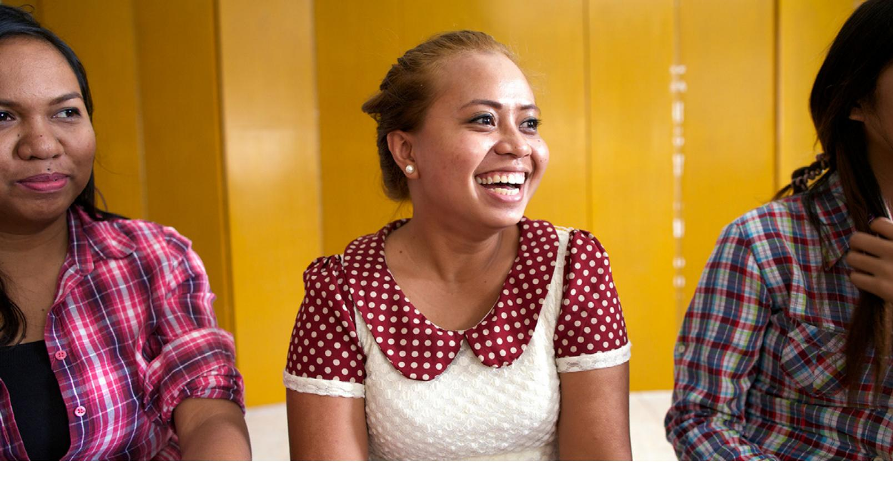

**UNIT 2: CONCLUSION**

# **Describing Family and Things**

¡Bien hecho! ¡Has completado la unidad 2! Ahora puedes conocer a alguien con mayor detalle hablando con esa persona sobre su familia, su ropa y lo que le gusta y no le gusta.

## **Evaluate**

(5–10 minutes)

Tómate un momento para reflexionar y celebrar todo lo que has logrado.

#### **Evaluate Your Progress**

I can:

• Describe myself and my family.

• Identify common items.

• Talk about clothing and colors.

• Express likes and dislikes.

Para seguir realizando el seguimiento de tu progreso, entra en englishconnect.org/ assessments y completa la evaluación opcional de esta unidad.

## **Evaluate Your Efforts**

Repasa tus esfuerzos en esta unidad en el "Registro de estudio personal". ¿Estás progresando en tu objetivo? ¿Qué puedes hacer de modo diferente para lograr tus metas?

Continúa practicando inglés a diario conforme te preparas para EnglishConnect 2.

Para obtener más información sobre cómo EnglishConnect puede ampliar tus oportunidades, entra en englishconnect.org.

