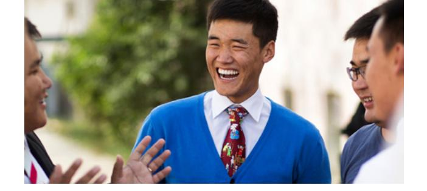

**UNIT 2: INTRODUCTION**

# **Describing Family and Things**

## **Objectives**

I will learn to:

- Describe my family.
- Identify common items.
- Talk about clothing and colors.
- Express likes and dislikes.
- Apply principles of learning by study and by faith.

## Lessons

Lesson 6: Family

Lesson 7: Family

Lesson 8: Everyday Common Items

Lesson 9: Clothing and Colors

