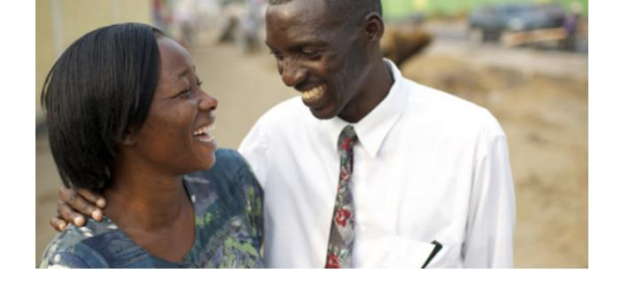

**UNIT 3: INTRODUCTION**

# **Talking about My Day**

## **Objectives**

I will learn to:

- Describe my daily routine.
- Describe what I am doing.
- Use days and times to talk about my day.
- Describe the weather.
- Apply principles of learning by study and by faith.

## Lessons

Lesson 10: Daily Routines

Lesson 11: My Activities

Lesson 12: Time and Calendar

Lesson 13: Weather

