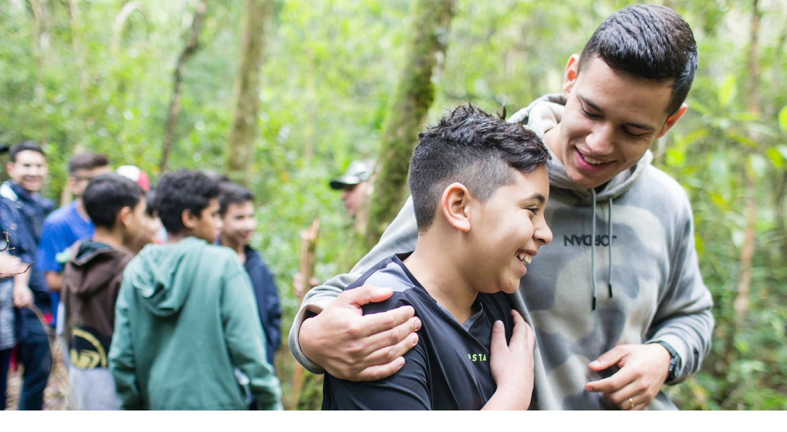

#### **UNIT 5: CONCLUSION**

# **Describing My Home**

Aprender un idioma es como construir una casa: se hace ladrillo a ladrillo, una palabra del vocabulario a la vez. Siéntete orgulloso de haber completado la unidad 5 y sigue buscando la ayuda de Dios. Tus capacidades aumentarán a medida que oras y practicas. ¡No te rindas!

#### **Evaluate**

## **Evaluate Your Progress**

Tómate un momento para reflexionar y celebrar todo lo que has logrado.

I can:

• Explain how to make different foods.
• _es: Explicar cómo hacer diferentes comidas.

• Talk about buying or selling something.
• _es: Hablar sobre comprar o vender algo.

• Describe where I live.
• _es: Describir dónde vivo.

Para seguir realizando el seguimiento de tu progreso, entra en englishconnect.org/ assessments y completa la evaluación opcional de esta unidad.

## **Evaluate Your Efforts**

Repasa tus esfuerzos en esta unidad en el "Registro de estudio personal". ¿Estás progresando en tu objetivo? ¿Qué puedes hacer de modo diferente para lograr tus metas?

Continúa practicando inglés a diario conforme te preparas para EnglishConnect 2.

Para obtener más información sobre cómo EnglishConnect puede ampliar tus oportunidades, entra en englishconnect.org.

