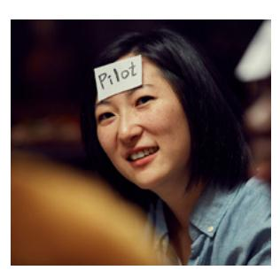
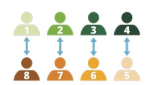
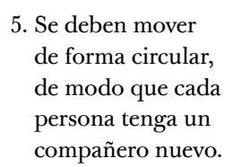
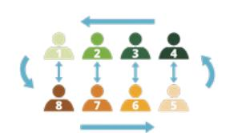
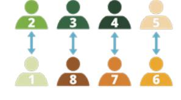
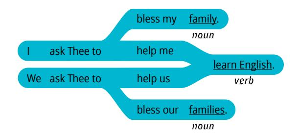
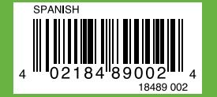

**UNIT 6: CONCLUSION**

# **Talking about My Health and Community**

Has completado la unidad 6, ¡lo que significa que has completado EnglishConnect 1! ¡Muy bien! Puedes hablar de muchas cosas de tu vida cotidiana y de tu comunidad. El conocimiento que has adquirido y los principios de aprendizaje que has estudiado influirán de manera positiva a lo largo de tu vida.

#### **Evaluate**

## **Evaluate Your Progress**

Tómate un momento para reflexionar y celebrar todo lo que has logrado.

I can:

• Ask for and give directions.

• Describe how I feel.

• Talk about illnesses.

Para seguir realizando el seguimiento de tu progreso, entra en englishconnect.org/ assessments y completa la evaluación opcional de esta unidad.

## **Evaluate Your Efforts**

Repasa tus esfuerzos en esta unidad en el "Registro de estudio personal". ¿Estás progresando en tu objetivo? ¿Qué puedes hacer de modo diferente para lograr tus metas?

Continúa practicando inglés a diario conforme te preparas para EnglishConnect 2.

Para obtener más información sobre cómo EnglishConnect puede ampliar tus oportunidades, entra en englishconnect.org.

#### **APPENDIX**

# **Additional Vocabulary**

# Parts of Speech

| adjectives   | adjetivos     |
|--------------|---------------|
| adverbs      | adverbios     |
| nouns        | sustantivos   |
| prepositions | preposiciones |
| pronouns     | pronombres    |
| verbs        | verbos        |

# Numbers

| 0 – zero        |                     |
|-----------------|---------------------|
| 1 – one         | 1st – first         |
| 2 – two         | 2nd – second        |
| 3 – three       | 3rd – third         |
| 4 – four        | 4th – fourth        |
| 5 – five        | 5th – fifth         |
| 6 – six         | 6th – sixth         |
| 7 – seven       | 7th – seventh       |
| 8 – eight       | 8th – eighth        |
| 9 – nine        | 9th – ninth         |
| 10 – ten        | 10th – tenth        |
| 11 – eleven     | 11th – eleventh     |
| 12 – twelve     | 12th – twelfth      |
| 13 – thirteen   | 13th – thirteenth   |
| 14 – fourteen   | 14th – fourteenth   |
| 15 – fifteen    | 15th – fifteenth    |
| 16 – sixteen    | 16th – sixteenth    |
| 17 – seventeen  | 17th – seventeenth  |
| 18 – eighteen   | 18th – eighteenth   |
| 19 – nineteen   | 19th – nineteenth   |
| 20 – twenty     | 20th – twentieth    |
| 21 – twenty-one | 21st – twenty-first |

| 30 – thirty             | 30th – thirtieth      |  |
|-------------------------|-----------------------|--|
| 31 – thirty-one         | 31st – thirty-first   |  |
| 40 – forty              | 40th – fortieth       |  |
| 41 – forty-one          | 41st – forty-first    |  |
| 50 – fifty              | 50th – fiftieth       |  |
| 51 – fifty-one          | 51st – fifty-first    |  |
| 60 – sixty              | 60th – sixtieth       |  |
| 61 – sixty-one          | 61st – sixty-first    |  |
| 70 – seventy            | 70th – seventieth     |  |
| 71 – seventy-one        | 71st – seventy-first  |  |
| 80 – eighty             | 80th – eightieth      |  |
| 81 – eighty-one         | 81st – eighty-first   |  |
| 90 – ninety             | 90th – ninetieth      |  |
| 91 – ninety-one         | 91st – ninety-first   |  |
| 100 – one hundred       | 100th – one hundredth |  |
| 1,000 – one thousand    |                       |  |
| 10,000 – ten thousand   |                       |  |
| 1,000,000 – one million |                       |  |
|                         |                       |  |

# Months

| January   | enero      |
|-----------|------------|
| February  | febrero    |
| March     | marzo      |
| April     | abril      |
| May       | mayo       |
| June      | junio      |
| July      | julio      |
| August    | agosto     |
| September | septiembre |
| October   | octubre    |
| November  | noviembre  |
| December  | diciembre  |
|           |            |

# Days of the Week

| Sunday    | domingo   |
|-----------|-----------|
| Monday    | lunes     |
| Tuesday   | martes    |
| Wednesday | miércoles |
| Thursday  | jueves    |
| Friday    | viernes   |
| Saturday  | sábado    |

| grandfather (grandpa)/ grandfathers | abuelo/abuelos                         |
|----------------------------------------|----------------------------------------|
| grandparent/ grandparents           | abuelo o abuela/los abuelos (ambos) |
| aunt/aunts                             | tía/tías                               |
| uncle/uncles                           | tío/tíos                               |
| niece/nieces                           | sobrina/sobrinas                       |
| nephew/nephews                         | sobrino/sobrinos                       |
| cousin/cousins                         | primo/primos                           |
|                                        |                                        |

# Family Nouns

| spouse/spouses                         | cónyuge/cónyuges                     |
|----------------------------------------|--------------------------------------|
| wife/wives                             | esposa/esposas                       |
| husband/husbands                       | esposo/esposos                       |
| mother (mom)/mothers                   | madre (mamá)/madres                  |
| stepmother (stepmom)/ stepmothers   | madrastra/madrastras                 |
| mother-in-law/ mothers-in-law       | suegra/suegras                       |
| father (dad)/fathers                   | padre (papá)/padres                  |
| stepfather (stepdad)/ stepfathers   | padrastro/padrastros                 |
| father-in-law/ fathers-in-law       | suegro/suegros                       |
| parent/parents                         | padre o madre/los padres (ambos)  |
| sister/sisters                         | hermana/hermanas                     |
| stepsister/stepsisters                 | hermanastra/ hermanastras         |
| brother/brothers                       | hermano/hermanos                     |
| stepbrother/stepbrothers               | hermanastro/ hermanastros         |
| daughter/daughters                     | hija/hijas                           |
| sibling/siblings                       | hermano/hermanos (de ambos sexos) |
| son/sons                               | hijo/hijos                           |
| child/children                         | niño/niños                           |
| grandmother (grandma)/ grandmothers | abuela/abuelas                       |

## Food Nouns

| breakfast              | desayuno             |
|------------------------|----------------------|
| lunch                  | almuerzo             |
| dinner                 | cena                 |
|                        |                      |
| fruit/fruits           | fruta/frutas         |
| apple/apples           | manzana/manzanas     |
| banana/bananas         | banana/bananas       |
| grape/grapes           | uva/uvas             |
| orange/oranges         | naranja/naranjas     |
| tomato/tomatoes        | tomate/tomates       |
| watermelon/watermelons | sandía/sandías       |
|                        |                      |
| vegetable/vegetables   | verdura/verduras     |
| carrot/carrots         | zanahoria/zanahorias |
| cucumber/cucumbers     | pepino/pepinos       |
| lettuce                | lechuga              |
| onion/onions           | cebolla/cebollas     |
| pepper/peppers         | pimiento/pimientos   |
|                        |                      |
| meat                   | carne                |
| beef                   | res                  |
| chicken                | pollo                |
| fish                   | pescado              |
| pork                   | puerco (cerdo)       |
| egg/eggs               | huevo/huevos         |
|                        |                      |

| beans              | frijoles (alubias, caraotas, porotos) |
|--------------------|------------------------------------------|
| bread              | pan                                      |
| butter             | mantequilla                              |
| cheese             | queso                                    |
| dessert            | postre                                   |
| flour              | harina                                   |
| fries              | papas fritas                             |
| hamburger (burger) | hamburguesa                              |
| ice                | hielo                                    |
| milk               | leche                                    |
| noodles            | fideos                                   |
| oil                | aceite                                   |
| pizza              | pizza                                    |
| rice               | arroz                                    |
| salad              | ensalada                                 |
| salt               | sal                                      |
| sandwich           | sándwich                                 |
| sauce              | salsa                                    |
| soup               | sopa                                     |
| spices             | especias                                 |
| sugar              | azúcar                                   |
| water              | agua                                     |

# Prepositions

| above       | sobre       |
|-------------|-------------|
| across from | enfrente de |
| at          | a/a las     |
| behind      | detrás      |
| below       | abajo       |
| between     | entre       |
| in front of | delante de  |
| in          | en          |
| near        | cerca de    |
| next to     | junto a     |

| en                |
|-------------------|
| sobre             |
| a la izquierda de |
| a la derecha de   |
| debajo            |
|                   |

# Pronouns and Possessive Adjectives

| Subject Pronoun Pronombre de sujeto | Object Pronoun Pronombre de objeto | Possessive Adjective Adjetivo posesivo |
|----------------------------------------------|---------------------------------------------|-------------------------------------------------|
| Example:                                     | Example:                                    | Example:                                        |
| I am happy.                                  | Ann is bigger than me.                   | My name is Tom.                                 |
| I                                            | me                                          | my                                              |
| you                                          | you                                         | your                                            |
| we                                           | us                                          | our                                             |
| he                                           | him                                         | his                                             |
| she                                          | her                                         | her                                             |
| it                                           | it                                          | its                                             |
| they                                         | them                                        | their                                           |

# Currency

| A\$  | dólar australiano    |
|------|----------------------|
| C\$  | dólar canadiense     |
| MX\$ | peso mexicano        |
| R\$  | real brasileño       |
| US\$ | dólar estadounidense |
| €    | euro                 |
| ¥    | yen japonés          |
| £    | libra esterlina      |
| ¥    | renminbi             |
| R    | rand sudafricano     |
|      |                      |

#### **APPENDIX**

# **Conversation Group Games**

En este manual se incluye una lista de juegos divertidos para practicar inglés. Puedes jugar a estos juegos durante cualquier reunión de grupo. Utiliza los patrones y el vocabulario de la lección en la que te encuentres o de una lección anterior. La mayoría de estos juegos requieren que trabajes con un compañero o un grupo pequeño.

# Questions (10–15 minutes)

## **Steps**

1. Escoge una pregunta de la lista. Recuerda que puedes reemplazar las palabras subrayadas por otras palabras y frases.

- 2. Comparte tu respuesta con el grupo.
- 3. Tomen turnos para elegir preguntas y compartir las respuestas. Puedes hablar acerca de todas las preguntas que desees.

#### **Questions to Review Patterns:**

- What do you like to do?
- Why do you like to study English?
- Can you tell me about your family?
- What are you wearing?
- What do you do before you come to the conversation group?
- What do you do in the morning?
- When do you work?
- What's the weather in New York?

- Where do you work?
- What do you do for work?
- Do you like to teach people?
- What do you eat for dinner?
- What foods do you like?
- What do you want for lunch?
- What is your favorite food? How do you make it?
- How much do groceries cost?
- Where do you live?
- Tell me about your house.
- Where is your favorite place to eat?

## **More Questions:**

- Tell me about your friends.
- Tell me about your job.
- Tell me about your city.
- Tell me about your favorite place.
- Tell me about your daily routine. What do you do every day?
- What do you like to wear?
- What do you do when you are sick?
- What do you do when you are hurt?
- What is expensive in your city?
- What is cheap in your city?

## **Notes**

- Puedes jugar a este juego con todo el grupo o en grupos más pequeños de tres a cinco personas.
- No es necesario que utilices solamente las preguntas de esta lista; también puedes crear preguntas nuevas. Puedes cambiar las palabras subrayadas para crear más preguntas.

- Si quieren que este juego sea más difícil, tomen turnos para compartir las respuestas que recuerden de cada miembro del grupo.
- Puedes usar estas preguntas con los otros juegos que aparecen a continuación, tales como "Cadena de bicicleta" o "Lanzar la pelota".

## Hot Seat (10–20 minutes)

## **Steps**

- 1. Dividan el grupo en dos equipos.
- 2. Elijan a dos alumnos (un alumno de cada equipo). Estos alumnos se sientan frente al grupo (en el

"asiento de preguntas"), de espaldas a la pizarra.

- 3. El maestro escribe una palabra o frase del vocabulario en la pizarra. Los alumnos que ocupan el "asiento de preguntas" no pueden ver la palabra.
- 4. Los equipos tienen dos minutos para ayudar a su compañero que ocupa el "asiento de preguntas" a adivinar la palabra que está escrita en la pizarra, pero sin decirla.
- 5. La persona que ocupa el "asiento de preguntas" y que diga la palabra primero obtiene un punto para su equipo. Si un equipo dice la palabra que está escrita en la pizarra mientras intenta ayudar a su compañero a adivinarla, no obtiene el punto.
- 6. Repitan el ejercicio con palabras nuevas.

## **Notes**

• Creen de uno a tres equipos, según el tamaño del grupo.

• Si se reúnen de forma virtual, jueguen con todo el grupo en lugar de hacerlo en equipos. Una persona ocupa el "asiento de preguntas" y no conoce la palabra. Otra persona es quien da pistas. La persona que da pistas elige una palabra y da pistas para que la persona que ocupa el "asiento de preguntas" pueda adivinarla.

## Ball Toss (10–15 minutes)

## **Steps**

- 1. Busquen una pelota, un objeto suave o un trozo de papel arrugado.
- 2. Escoge una pregunta (puedes usar una pregunta de una lección o ir a "Preguntas" en este apéndice).
- 3. Haz la pregunta y lánzale la pelota a un compañero.
- 4. El compañero agarra la pelota y responde la pregunta.
- 5. El compañero hace la pregunta de nuevo y lanza la pelota a otro compañero.
- 6. Esto se debe repetir hasta que cada alumno del grupo haya respondido la pregunta. Luego, vuelvan a comenzar con una pregunta nueva.

## **Notes**

- Para que este juego sea más difícil, cambien la pregunta cada vez que lanzan la pelota.
- Si se reúnen de forma virtual, digan los nombres de los compañeros en lugar de lanzar una pelota.

# Dice Game (10–15 minutes)

## **Steps**

- 1. Necesitas un dado (o tarjetas numeradas del 1 al 6).
- 2. Elige seis verbos y escríbelos en la pizarra, numerados del 1 al 6.

3. Trabaja con un compañero o un grupo pequeño. Tira los dados. Crea una oración en la que se utilice el verbo del número que salió. Tomen turnos.

## **Example**

El maestro escribe en la pizarra:

- 1. cook
- 2. stir
- 3. bake
- 4. boil
- 5. cut
- 6. add

El alumno 1 tira los dados y obtiene un 6, y crea una oración con *add*.

"I *add* sugar to my oatmeal."

La alumna 2 tira los dados y obtiene un 4, y crea una oración con *boil*.

"I *boil* eggs for lunch."

El alumno 3 tira los dados y obtiene un 3, y crea una oración con *bake*.

"I like to *bake* cookies."

#### **Notes**

- Se pueden utilizar otras palabras en lugar de verbos.
- Si se reúnen de forma virtual, trabajen con todo el grupo. Utilicen un dado virtual y tomen turnos para crear oraciones.

# Give One, Get One (10–20 minutes)

#### **Steps**

- 1. Elige un tema para el grupo (por ejemplo: familia, deportes o alimentos).
- 2. Escribe todas las palabras que conozcas acerca del tema durante uno o dos minutos.
- 3. Ponte de pie y camina por la sala. Escoge a un compañero.
- 4. Comparte una palabra de tu lista con él o ella. Luego tu compañero comparte una palabra contigo; si es una palabra nueva, añádela a tu lista.
- 5. Camina de nuevo por la sala. Escoge a otro compañero y repite el ejercicio.

#### **Example**

Tema: familia

El compañero A escribe:

mom

dad

sister

brother

El compañero B escribe:

grandfather

grandmother

mother

father

aunt

uncle

A: What's one word from your list?

B: *Grandmother*.

A: I don't have that word. I'll add it to my list.

B: What's a word from your list?

A: *Mom*.

B: I have *mother*. I will write *mom* next to *mother*.

Ambos alumnos añaden las palabras nuevas a sus listas.

Lista del compañero A:

mom

dad

sister

brother

grandmother

Lista del compañero B:

grandfather

grandmother

mother, **mom**

father

aunt

uncle

## **Notes**

- Esta es una manera excelente de aprender o practicar vocabulario nuevo que no se incluye en la lección.
- Si se reúnen de forma virtual, pídele a cada persona que comparta una palabra de su lista con todo el grupo en lugar de trabajar de dos en dos.

# Speculation (15–20 minutes)

## **Steps**

- 1. Piensa en un verbo.
- 2. Dilo en voz alta.
- 3. Con el verbo, crea una oración **verdadera** acerca de otro compañero. Di:

"I think that you …" para comenzar la oración.

- 4. El otro alumno dirá si tu afirmación es verdadera o no.
- 5. Si es verdadera, obtienes un punto; si no es verdadera, no obtienes ningún punto.
- 6. ¡Ganará el primer alumno que obtenga cinco puntos!
- 7. Completen de diez a veinte rondas, cambiando el verbo en cada ronda.

## **Example**

Alumno A (al alumno B): The verb is *like*. I think that you *like* chocolate.

Alumno B: That's true! (el alumno A obtiene un punto).

Alumno B (al alumno C): I think that you like to play basketball.

Alumno C: That's not true! (el alumno B no obtiene ningún punto)

## **Notes**

- Creen grupos de tres a cinco personas.
- Este juego incluirá de diez a veinte rondas. Necesitarán un verbo para cada ronda. Tomen

turnos para decir un verbo nuevo cada vez que comiencen una ronda.

# Two Truths and One Lie (10–15 minutes)

## **Steps**

- 1. Piensa en dos cosas ciertas acerca de ti e inventa algo que no sea cierto. Intenta usar vocabulario y frases de una lección.
- 2. Lee tus afirmaciones en voz alta al grupo.
- 3. Los integrantes de tu grupo te hacen preguntas para adivinar qué afirmación no es cierta. Responde sus preguntas.

## **Example**

Integrante del grupo 1: "I like pizza. I like French fries. I like chocolate. Which is not true?".

Otros integrantes del grupo hacen preguntas:

Q: What is your favorite kind of pizza? A: I like cheese pizza.

Q: What is your favorite candy bar? A: I like chocolate and caramel.

Q: Where do you like to get French fries? A: I don't have a favorite place.

Otros integrantes del grupo adivinan: "I think you don't like French fries."

Integrante del grupo 1: "That's right! I don't like French fries."

# Vocabulary Cards (10–15 minutes)

#### **Steps**

1. Escribe entre cinco y diez palabras de vocabulario en trocitos de papel (las notas adhesivas funcionan muy bien). Coloca los

trozos de papel formando una pila.

- 2. Escoge a un compañero.
- 3. Voltea las pilas de palabras hacia abajo para que no se puedan ver las palabras e intercambia tu pila con la de tu compañero.
- 4. Escoge un papel sin mirar la palabra y pégate el papel en la frente. Tu compañero describe la palabra (o hace una traducción), de modo que puedas adivinar la palabra escrita en el papel. Si adivinas correctamente, obtienes un punto.
- 5. Tomen turnos. Repite el ejercicio con cada papel de la pila.

## **Notes**

• Si se reúnen de forma virtual, trabajen con todo el grupo en lugar de hacerlo de dos en dos. Cada persona escribe una lista de palabras. No muestres tu lista al grupo. Tomen turnos para elegir una palabra de tu lista. Describe la palabra al grupo sin decirla y los miembros del grupo tienen que adivinarla.

# Bicycle Chain (in person) (10–20 minutes)

Esta actividad solo se puede realizar en reuniones de grupo presenciales.

## **Steps**

- 1. Escoge una pregunta (puedes usar una pregunta de una lección o ir a "Preguntas" en este apéndice).
- 2. Formen dos filas frente a frente.
- 3. Cada persona es la compañera de la persona que tiene enfrente.

4. Los compañeros hacen y responden la pregunta.

6. Los compañeros hacen y responden la pregunta.

7. Repitan los pasos 5 y 6.

## **Notes**

• Si hay un número impar de personas, creen un grupo de tres.

# Mingle and Share (in person) (10–15 minutes)

Esta actividad solo se puede realizar en reuniones de grupo presenciales.

#### **Steps**

1. Escoge una pregunta (puedes usar una pregunta de una lección o ir a "Preguntas" en este apéndice).

- 2. Ponte de pie y escoge a un compañero.
- 3. Hazle una pregunta y recuerda su respuesta. Responde la pregunta de tu compañero.
- 4. Camina por la sala y escoge a otro compañero. Haz y responde preguntas. Repite el ejercicio varias veces con nuevos compañeros. Recuerda las respuestas de todos tus compañeros.
- 5. Regresa a tu asiento y comparte con el grupo lo que aprendiste.

#### **Example**

Question: How many people are in your family?

Los alumnos caminan por el salón de clases preguntando y respondiendo a diferentes compañeros.

Maria: How many people are in your family?

Luna: There are four people in my family. How many people are in your family?

Maria: Three.

Los alumnos comparten lo que aprendieron.

Teacher: How many people are in Maria's family? Luna: There are three people in Maria's family.

#### **APPENDIX**

# **Principles of Learning Glossary**

# Agency

**Albedrío:** Como hijos de Dios, tenemos albedrío, o poder, para tomar nuestras propias decisiones. Podemos elegir lo que creemos, lo que hacemos y quiénes llegamos a ser.

"El albedrío es la capacidad y el privilegio que Dios nos da de escoger y actuar por nosotros mismos" (Temas del Evangelio, "Albedrío y responsabilidad", LaIglesiadeJesucristo.org).

"Porque te ama, Dios te dio albedrío, o la libertad para que tomes decisiones. Tu albedrío te permite tomar buenas decisiones que te llevan a la felicidad; también te hace responsable por las malas decisiones, las cuales te llevan a una infelicidad inmediata o eventual. Dios no intervendrá en tus decisiones; Él te permite que seas tú quien decide y aprendas de las consecuencias. Sin embargo, te ofrece la ayuda máxima para superar errores y pecados: el poder salvador de Jesucristo. No importa qué tan malas sean tus circunstancias o cuántas decisiones incorrectas hayas tomado, siempre puedes elegir cambiar y encontrar paz por medio de Jesucristo" (véase "Dios está ahí para ti", VeniraCristo.org).

## Agent

**Agente:** Un agente es una persona que tiene la capacidad o el poder de actuar por sí misma. Como hijos de Dios, somos agentes; tenemos albedrío, o poder, para tomar nuestras propias decisiones. Podemos elegir lo que creemos, lo que hacemos y quiénes llegamos a ser.

## Bible

**Biblia:** "La Biblia es un libro sagrado que contiene la palabra de Dios. A lo largo de sus páginas, la Santa Biblia enseña que Dios nunca deja de amar a Sus hijos. […]Seguir las enseñanzas que encontramos en la Biblia nos ayuda a saber quién es Dios […] y entender mejor cómo quiere que vivamos.

"Jesucristo es el Hijo de Dios que vino a la tierra para salvarnos del pecado, la tristeza, la soledad, el dolor y más. Jesús enseñó lecciones hermosas sobre el servicio y el amor y realizó muchos milagros mientras estuvo en la tierra. En la Biblia podemos leer esos relatos y comenzar a saber cómo vencer las dificultades con la ayuda de Jesús" ("¿Qué es la Santa Biblia? y "¿Qué enseña la Santa Biblia?", VeniraCristo.org).

# Book of Mormon

**Libro de Mormón:** "El Libro de Mormón contiene escritos sagrados de seguidores de Jesús. Así como Dios habló a Moisés y a Noé en la Biblia, también habló a la gente de las Américas. Estos hombres, llamados profetas, escribieron la palabra de Dios. Con el tiempo, sus escritos fueron compendiados en un solo libro por un profeta llamado Mormón. […]

"El Libro de Mormón es evidencia de que Dios ama a todos Sus hijos y está involucrado en sus vidas. Sirve como un testigo de las verdades de la Biblia y de la divinidad y enseñanzas de Jesucristo" ("¿Qué es el Libro de Mormón?", VeniraCristo.org).

## Doctrine and Covenants

**Doctrina y Convenios:** "Doctrina y Convenios es un libro de Escrituras que contiene revelaciones que el Señor dio al profeta José Smith y a otros pocos profetas modernos. Como Escritura es singular, ya que no es una traducción de documentos antiguos.

"Doctrina y Convenios es uno de los cuatro libros de Escrituras que se emplean en La Iglesia de Jesucristo de los Santos de los Últimos Días (los tres restantes son la Biblia, el Libro de Mormón y la Perla de Gran Precio)" (véase Temas del Evangelio, "Doctrina y Convenios", LaIglesiadeJesucristo.org).

# Faith

**Fe:** "La fe es un principio de acción y de poder. Cuando nos esforzamos por alcanzar una meta digna, estamos ejerciendo la fe, porque demostramos nuestra esperanza en algo que aún no podemos ver. […]

"Tener fe en Jesucristo significa confiar totalmente en Él: confiar en Su poder, inteligencia y amor infinitos, lo cual incluye creer en Sus enseñanzas; significa creer que aunque no entendamos todas las cosas, Él sí las entiende. Debido a que ha experimentado todos nuestros dolores, aflicciones y enfermedades, Él sabe cómo ayudarnos a superar las dificultades que tenemos día a día (véanse Alma 7:11–12; Doctrina y Convenios 122:8). […]

"La fe es mucho más que una creencia pasiva. Expresamos nuestra fe por medio de hechos, por medio de la forma en que vivimos. […]

"La fe es un don de Dios, pero debemos nutrirla para mantenerla fuerte, puesto que es como un músculo: si se ejercita, crece y se fortalece; pero si se mantiene inactiva, se debilita" (Temas del Evangelio, "Fe en Jesucristo", LaIglesiadeJesucristo.org).

# God/Heavenly Father

**Dios/Padre Celestial:** "Dios el Padre es el Ser Supremo en quien creemos, a quien adoramos y a quien oramos. Él es el supremo Creador, Soberano y Preservador de todas las cosas. Es perfecto, tiene todo poder y sabe todas las cosas" (véase Temas del Evangelio, "Dios el Padre", LaIglesiadeJesucristo.org).

Dios es un Padre amoroso en los cielos. Él es el Padre de nuestro espíritu y ama a Sus hijos perfectamente, incluyéndote a ti. Él quiere tener una relación contigo (véanse "El amor de Dios" y "Dios te ama", VeniraCristo.org).

En las Escrituras, la palabra *Dios* suele usarse para referirse al Padre Celestial o a Jesucristo porque Ellos son uno en propósito. Oramos a nuestro Padre Celestial.

## Holy Spirit

**Espíritu Santo:** "El Santo Espíritu, o Espíritu Santo, es un testigo de Dios y Jesucristo. […] El Espíritu Santo nos consuela, nos ayuda a reconocer la verdad y testifica de Jesús. […] Una manera en que Dios se comunica con nosotros es por medio del Espíritu Santo. El Santo Espíritu habla a nuestra mente y nuestro corazón por medio de pensamientos y sentimientos" ("El Espíritu Santo", VeniraCristo.org).

# Jesus Christ

**Jesucristo:** "Jesús es el Salvador del mundo y nuestro ejemplo perfecto. A medida que lo sigamos, encontraremos más felicidad y paz en nuestras vidas. […]

"Jesús es el Hijo de Dios. Nuestro Padre Celestial envió a Su Hijo, Jesucristo, a tomar sobre Sí los pecados de todas las personas que vivirían sobre la tierra, a fin de que pudiéramos ser perdonados. […]

"Jesús vivió una vida perfecta para mostrarnos el camino de regreso a nuestro Padre Celestial. […]

"Jesús sufrió y murió por nuestros pecados. La misión de Jesús al venir a la tierra fue salvarnos de nuestros pecados. Él estuvo dispuesto a sufrir y a sacrificarse para pagar el precio de nuestros errores, de esa manera podríamos arrepentirnos y ser perdonados. […]

"Jesús fue resucitado para que podamos vivir otra vez. Tres días después de Su muerte, Jesús se levantó de la tumba y se apareció a muchos de Sus amigos y seguidores. Él fue el primero que resucitó, lo cual significó que Su Espíritu fue reunido con Su cuerpo físico perfeccionado después de la muerte. Gracias a que Jesús conquistó la muerte, todos seremos resucitados algún día" (véase "Seguir a Jesucristo, nuestro ejemplo perfecto", VeniraCristo.org).

## Prayer

**Oración:** La oración es la "comunicación reverente con Dios durante la cual la persona da gracias y pide bendiciones. La oración se dirige a nuestro Padre Celestial en el nombre de Jesucristo" (Guía para el Estudio de las Escrituras, "Oración", LaIglesiadeJesucristo.org).

"Dios es tu Padre amoroso en los cielos y quiere saber de ti" ("Cómo orar", VeniraCristo.org).

# Prophet

**Profeta:** "Un profeta es alguien que ha sido llamado por Dios para dar guía al mundo entero. Desde Abraham y Moisés hasta los profetas vivientes en la actualidad, Dios sigue el patrón de guiar a Sus hijos por medio de profetas" (véase "Dios nos habla por medio de profetas", VeniraCristo.org).

## Savior

**Salvador:** "El que salva. […] El término 'Salvador' es uno de los nombres y títulos de Jesucristo" (Guía para el Estudio de las Escrituras, "Salvador", LaIglesiadeJesucristo.org).

Jesucristo es nuestro Salvador porque dio Su vida y resucitó para que nosotros podamos vencer los efectos del pecado y de la muerte y podamos vivir con Dios de nuevo.

"Jesús sufrió y murió por nuestros pecados. La misión de Jesús al venir a la tierra fue salvarnos de nuestros pecados. Él estuvo dispuesto a sufrir y a sacrificarse para pagar el precio de nuestros errores, de esa manera podríamos arrepentirnos y ser perdonados. […]

"Jesús fue resucitado para que podamos vivir otra vez. Tres días después de Su muerte, Jesús se levantó de la tumba y se apareció a muchos de Sus amigos y seguidores. Él fue el primero que resucitó, lo cual significó que Su Espíritu fue reunido con Su cuerpo físico perfeccionado después de la muerte. Gracias a que Jesús conquistó la muerte, todos seremos resucitados algún día" (véase "Seguir a Jesucristo, nuestro ejemplo perfecto", VeniraCristo.org).

## Scripture

**Escrituras:** "Cuando los hombres santos de Dios escriben o hablan por el poder del Espíritu Santo, lo que digan 'será Escritura, será la voluntad del Señor, será la intención del Señor, será la palabra del Señor, será la voz del Señor y el poder de Dios para salvación' (Doctrina y Convenios 68:4). […]

"El propósito principal de las Escrituras es testificar de Cristo y guiar a los hijos de Dios para que podamos venir a Él y recibir la vida eterna (véanse Juan 5:39; 20:31; 1 Nefi 6:4; Mosíah 13:33– 35)" (Temas del Evangelio, "Las Escrituras", LaIglesiadeJesucristo.org).

#### **APPENDIX**

# **Conversation Group Phrases**

# Conversation Phrases

Utiliza estas frases para iniciar, continuar y finalizar una conversación.

### **Inicio**

| Hello.                           | Hola.                                 |
|----------------------------------|---------------------------------------|
| Good morning.                    | Buenos días.                          |
| Good afternoon.                  | Buenas tardes.                        |
| Hi. Can I ask you a question? | Hola. ¿Puedo hacerte una pregunta? |
|                                  |                                       |

## **Continuación**

| That's great!       | ¡Genial!                 |
|---------------------|--------------------------|
| Interesting.        | Interesante.             |
| Tell me more.       | Cuéntame más.            |
| Really?             | ¿En serio?               |
| Me too!             | ¡Yo también!             |
| Wow!                | ¡Vaya!                   |
| I didn't know that. | No lo sabía.             |
| Thanks for sharing. | Gracias por compartirlo. |

## **Finalización**

| OK. Thanks.                         | Está bien. Gracias.                     |
|-------------------------------------|-----------------------------------------|
| See you later.                      | Hasta pronto.                           |
| It was nice talking to you. Bye! | Me dio gusto hablar contigo. ¡Adiós! |
| Talk to you later.                  | Hablamos más tarde.                     |
| Have a great day!                   | ¡Que tengas un buen día!                |
| Thank you.                          | Gracias.                                |

## **Example:**

Q: *Hi. Can I ask you a question?* What do you like to do?

A: I like to dance.

Q: *Me too!* What don't you like to do?

A: I don't like to read.

Q: *Really?* Do you like to garden?

A: Yes, I like to garden.

Q: *OK. Thanks. It was nice talking to you. Bye!*

# Other Phrases

Los alumnos y los maestros pueden utilizar estas frases como ayuda para comunicarse en inglés durante toda la lección.

## **Frases comunes de interacción**

Los alumnos y los maestros pueden utilizar estas frases al interactuar en inglés.

| Can you repeat that, please?             | ¿Podrías repetir lo que dijiste, por favor?    |
|---------------------------------------------|---------------------------------------------------|
| Can you speak slower, please?            | ¿Podrías hablar más despacio, por favor?       |
| Can you write that on the board, please? | ¿Puedes escribir eso en la pizarra, por favor? |
| How do you say          in English?      | ¿Cómo se dice          en inglés?              |
| How do you spell         ?                  | ¿Cómo se deletrea         ?                       |
| Good job!                                   | ¡Muy bien!                                        |
| I don't understand.                         | No lo entiendo.                                   |
| I have a question.                          | Tengo una pregunta.                               |
| I understand!                               | ¡Lo entiendo!                                     |
| You can do it!                              | ¡Tú puedes hacerlo!                               |
|                                             |                                                   |
|                                             |                                                   |
|                                             |                                                   |

## **Frases comunes de instrucción**

Escuchar al maestro hablar en inglés ayudará a los alumnos a progresar. Los maestros pueden utilizar estas frases simples para dar instrucciones al grupo.

| Today is lesson 4. Hoy daremos la lección 4. Begin. Comienza. Do it again. Hazlo de nuevo. Look at pattern 2. Fíjate en el patrón 2. One more time. Una vez más. Practice again. Practica de nuevo. Practice with your partner. Practica con tu compañero. Read aloud. Lee en voz alta. Read the instructions. Lee las instrucciones. Repeat after me. Repite después de mí. Role-play. Hagan dramatizaciones. Stand up. Levántate. Sit down. Siéntate. Stop. Detente. Switch partners. Cambien de compañero. Take turns. Tomen turnos. You have 10 minutes. Tienen 10 minutos. Any questions? ¿Alguna pregunta? Are you ready? ¿Están listos? Remember to study. Recuerden que deben estudiar. See you next week! ¡Nos vemos la semana que viene! | Welcome! | ¡Bienvenidos! |
|----------------------------------------------------------------------------------------------------------------------------------------------------------------------------------------------------------------------------------------------------------------------------------------------------------------------------------------------------------------------------------------------------------------------------------------------------------------------------------------------------------------------------------------------------------------------------------------------------------------------------------------------------------------------------------------------------------------------------------------------------------------------------------------------------------------------------------------------------------------------------------------|----------|---------------|
|                                                                                                                                                                                                                                                                                                                                                                                                                                                                                                                                                                                                                                                                                                                                                                                                                                                                                        |          |               |
|                                                                                                                                                                                                                                                                                                                                                                                                                                                                                                                                                                                                                                                                                                                                                                                                                                                                                        |          |               |
|                                                                                                                                                                                                                                                                                                                                                                                                                                                                                                                                                                                                                                                                                                                                                                                                                                                                                        |          |               |
|                                                                                                                                                                                                                                                                                                                                                                                                                                                                                                                                                                                                                                                                                                                                                                                                                                                                                        |          |               |
|                                                                                                                                                                                                                                                                                                                                                                                                                                                                                                                                                                                                                                                                                                                                                                                                                                                                                        |          |               |
|                                                                                                                                                                                                                                                                                                                                                                                                                                                                                                                                                                                                                                                                                                                                                                                                                                                                                        |          |               |
|                                                                                                                                                                                                                                                                                                                                                                                                                                                                                                                                                                                                                                                                                                                                                                                                                                                                                        |          |               |
|                                                                                                                                                                                                                                                                                                                                                                                                                                                                                                                                                                                                                                                                                                                                                                                                                                                                                        |          |               |
|                                                                                                                                                                                                                                                                                                                                                                                                                                                                                                                                                                                                                                                                                                                                                                                                                                                                                        |          |               |
|                                                                                                                                                                                                                                                                                                                                                                                                                                                                                                                                                                                                                                                                                                                                                                                                                                                                                        |          |               |
|                                                                                                                                                                                                                                                                                                                                                                                                                                                                                                                                                                                                                                                                                                                                                                                                                                                                                        |          |               |
|                                                                                                                                                                                                                                                                                                                                                                                                                                                                                                                                                                                                                                                                                                                                                                                                                                                                                        |          |               |
|                                                                                                                                                                                                                                                                                                                                                                                                                                                                                                                                                                                                                                                                                                                                                                                                                                                                                        |          |               |
|                                                                                                                                                                                                                                                                                                                                                                                                                                                                                                                                                                                                                                                                                                                                                                                                                                                                                        |          |               |
|                                                                                                                                                                                                                                                                                                                                                                                                                                                                                                                                                                                                                                                                                                                                                                                                                                                                                        |          |               |
|                                                                                                                                                                                                                                                                                                                                                                                                                                                                                                                                                                                                                                                                                                                                                                                                                                                                                        |          |               |
|                                                                                                                                                                                                                                                                                                                                                                                                                                                                                                                                                                                                                                                                                                                                                                                                                                                                                        |          |               |
|                                                                                                                                                                                                                                                                                                                                                                                                                                                                                                                                                                                                                                                                                                                                                                                                                                                                                        |          |               |
|                                                                                                                                                                                                                                                                                                                                                                                                                                                                                                                                                                                                                                                                                                                                                                                                                                                                                        |          |               |
|                                                                                                                                                                                                                                                                                                                                                                                                                                                                                                                                                                                                                                                                                                                                                                                                                                                                                        |          |               |
|                                                                                                                                                                                                                                                                                                                                                                                                                                                                                                                                                                                                                                                                                                                                                                                                                                                                                        |          |               |
|                                                                                                                                                                                                                                                                                                                                                                                                                                                                                                                                                                                                                                                                                                                                                                                                                                                                                        |          |               |
|                                                                                                                                                                                                                                                                                                                                                                                                                                                                                                                                                                                                                                                                                                                                                                                                                                                                                        |          |               |

#### **APPENDIX**

# **Praying in English**

Comienza cada reunión de grupo con una oración en inglés. Orar invita al Espíritu a ayudarte mientras aprendes inglés. Para obtener más información acerca de la oración, consulta "Oración" en el "Glosario de principios de aprendizaje" y en "Cómo orar" en veniracristo.org/creencias/dios/como-orar.

Puedes utilizar los patrones y el vocabulario siguientes para comenzar a orar en inglés.

## **Example**

Dear Heavenly Father,

We ask Thee …

We thank Thee for …

In the name of Jesus Christ, amen.

## Memorize Vocabulary

| Dear Heavenly Father | Querido Padre Celestial |
|----------------------|-------------------------|
| In the name of Jesus | En el nombre de         |
| Christ, amen.        | Jesucristo. Amén.       |

#### **Nouns**

| blessings       | bendiciones      |
|-----------------|------------------|
| teacher         | maestro          |
| group           | grupo            |
| family/families | familia/familias |
|                 |                  |
|                 |                  |
|                 |                  |

## **Verbs**

| learn         | aprender        |
|---------------|-----------------|
| speak         | hablar          |
| teach         | enseñar         |
| bless         | bendecir        |
| press forward | seguir adelante |
|               |                 |
|               |                 |
|               |                 |

# Practice Pattern 1

We thank Thee for our (*noun*).

### **Examples**

We thank Thee for our group.

I thank Thee for my family.

# Practice Pattern 2

We ask Thee to help us (*verb*).

## **Examples**

We ask thee to help us learn.

I ask Thee to help me speak English.

