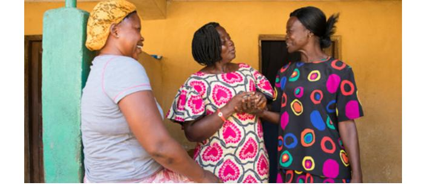

#### **UNIT 6: INTRODUCTION**

# **Talking about My Health and Community**

## **Objectives**

I will learn to:

- Ask for and give directions.
- Describe how I feel.
- Talk about illnesses.
- Apply principles of learning by study and by faith.

## Lessons

Lesson 22: Community

Lesson 23: Health

Lesson 24: Health

Lesson 25: Review

