

**CUADERNO DE EJERCICIOS**

# **CUADERNO DE EJERCICIOS 1**

Las historias y los nombres que se usan en este manual, con excepción de las páginas 9, 29, 33, 41, 45, 49, 56, 57, 69, 73, 81, 85, 89 y 102 son ejemplos ficticios, y las imágenes usadas son solamente ilustrativas.

> Published by The Church of Jesus Christ of Latter-day Saints Salt Lake City, Utah © 2023 Intellectual Reserve, Inc. Todos los derechos reservados. Version: 9/19 Traducción de *EnglishConnect 1 Workbook*  Spanish PD60009742 002 Printed in the United States of America

# **CONTENTS**

- **INTRODUCTION**
- **[LESSON 1: THE ALPHABET](#page-0-0)**
- **[LESSON 2: GREETINGS AND INTRODUCTIONS](#page-0-0)**
- **[LESSON 3: PERSONAL INTRODUCTIONS](#page-0-0)**
- **LESSON 4: HOBBIES AND INTERESTS**
- **[LESSON 5: HOBBIES AND INTERESTS](#page-0-0)**
- **LESSON 6: FAMILY**
- **LESSON 7: FAMILY**
- **LESSON 8: EVERYDAY COMMON ITEMS**
- **LESSON 9: CLOTHING AND COLORS**
- **LESSON 10: DAILY ROUTINES**
- **LESSON 11: CURRENT ACTIVITIES**
- **LESSON 12: TIME AND CALENDAR**
- **LESSON 13: WEATHER**

- **LESSON 14: JOBS AND CAREERS**
- **LESSON 15: JOBS AND CAREERS**
- **LESSON 16: FOOD**
- **LESSON 17: FOOD**
- **LESSON 18: FOOD**
- **LESSON 19: MONEY**
- **LESSON 20: HOME**
- **LESSON 21: HOME**
- **LESSON 22: COMMUNITY**
- **LESSON 23: HEALTH**
- **LESSON 24: HEALTH**
- **LESSON 25: REVIEW**
- **VOCABULARY**
- **ANSWER KEY**

El cuaderno de ejercicios de EnglishConnect está concebido para utilizarse como un recurso que acompaña al manual del alumno de EnglishConnect. El propósito de este cuaderno de ejercicios es ayudarle a desarrollar sus aptitudes en inglés y aumentar su fe por medio de actividades y relatos. También le ayudará a practicar el vocabulario y las estructuras gramaticales de cada lección de EnglishConnect en las cuatro áreas de aptitudes: comprensión oral, conversación, lectura y escritura. Cada lección en el cuaderno de ejercicios está dividida en las siguientes secciones que aparecen a continuación.

### **CONVERSATION(S) (CONVERSACIÓN)**

Cada lección comienza con una o más conversaciones. El propósito es presentar el vocabulario, el tema, las estructuras gramaticales de la lección y promover la comprensión oral y lectora. Cada sección de "Conversación" sigue el mismo modelo:

- 1. **Escuche.** Escuche toda la conversación.
- 2. **Escuche y repita.** Escuche la conversación línea por línea y repita en voz alta lo que escuche.
- 3. **Escriba la palabra que falte.** Escriba las palabras que falten en la conversación. Escoja de entre las palabras del recuadro.
- 4. **Lea en voz alta.** Lea la conversación en voz alta para practicarla.
- 5. **Responda las preguntas** (no se incluye en todas las lecciones). Esta parte verifica su comprensión de la conversación.

### **ACTIVITIES 2–8 (ACTIVIDADES 2–8)**

La cantidad de actividades varía en cada lección. Las actividades incluyen cuadros de gramática, actividades de lectura, escritura, comprensión oral y conversación; y relatos. Siga las instrucciones de cada parte de una actividad. Para las actividades de comprensión oral, consulte el número y la letra de la actividad correspondiente en la grabación de audio, por ejemplo, "Activity 2B". Para las actividades de conversación, recuerde hablar en voz alta. Puede verificar sus respuestas en la "Answer Key" que se encuentra en la parte posterior de este cuaderno.

### **PRACTICE PARTNER INSTRUCTIONS (INSTRUCCIONES PARA LA PRÁCTICA CON UN COMPAÑERO)**

Esta sección está concebida para ayudarle a practicar la conversación en inglés, usando lo que ha aprendido en la lección. Con un compañero, repase el "Vocabulary" que se encuentra en la parte posterior de este cuaderno y realice las actividades de esta sección. Diga lo más que pueda en cada actividad. Utilice este tiempo para practicar de verdad la conversación en inglés.

### **EXPANSION ACTIVITIES (ACTIVIDADES DE EXPANSIÓN)**

Estos relatos y las actividades están concebidas para expandir sus habilidades de leer, escuchar, hablar y escribir en inglés, así como para ayudarle a incrementar su fe en Jesucristo. Cada sección de "Expansion Activities" se desarrolla en torno a un relato inspirador. Para esta sección, haga lo siguiente:

- 1. **Aprenda el vocabulario.** Aprenda el significado de las palabras y frases del vocabulario que se indican en esta sección antes de leer el relato. Esto le ayudará a prepararse tanto para leer el relato como para entender las palabras y frases clave del relato.
- 2. **Escuche.** Escuche cada sección del relato. Puede hacer esto tantas veces como sea necesario.
- 3. **Lea en voz alta.** Lea la historia en voz alta para practicar la lectura y la pronunciación y para poder entender el relato. Quizás desee escuchar el relato otra vez y leerlo al mismo tiempo.
- 4. **Aprenda el vocabulario.** El vocabulario está para ayudarle a entender los pasajes de las Escrituras y las citas que acompañan el relato. Aprenda el significado de las palabras y frases del vocabulario que se indican antes de estudiar los pasajes de las Escrituras y las citas.
- 5. **Lea en voz alta.** A fin de practicar la lectura y la pronunciación, asegúrese de leer los pasajes de las Escrituras y las citas varias veces en voz alta.
- 6. **Medite.** Estas preguntas están concebidas para ayudarle a pensar sobre el principio que se enseña en el relato. Dedique tiempo a meditar las preguntas. Quizás desee escribir sus respuestas a las preguntas.
- 7. **Escriba.** En esta sección, usted realizará una actividad de escritura que le ayudará a aplicar el principio del relato.
- 8. **Converse.** En esta sección, usted realizará una actividad de conversación que le ayudará a hablar sobre el relato que haya leído y el principio que haya aprendido. Tales actividades comprenden volver a contar el relato, contar una experiencia personal que esté relacionada o compartir con otras personas impresiones o metas que estén relacionadas con el relato.

### **CLAVE PARA LAS INSTRUCCIONES DE ESTE CUADERNO DE EJERCICIOS**

En la siguiente tabla se muestran las instrucciones comúnmente utilizadas en este cuaderno de ejercicios. Los iconos indican las aptitudes que se utilizarán en las actividades. Vea la traducción de las instrucciones si no las entiende en inglés.

| APTITUD                          | INSTRUCCIONES                                                                                                                                                                                                                              | TRADUCCIÓN                                                                                                                                                                                                                                          |
|----------------------------------|--------------------------------------------------------------------------------------------------------------------------------------------------------------------------------------------------------------------------------------------|-----------------------------------------------------------------------------------------------------------------------------------------------------------------------------------------------------------------------------------------------------|
| LISTENING COMPRENSIÓN ORAL | Listen. Listen and repeat. Listen to the question/example. Listen and read. Listen, and then answer the question. You may listen more than once. *The audio for this book can be accessed at englishconnect.org/audio | Escuche Escuche y repita. Escuche la pregunta o el ejemplo. Escuche y lea. Escuche, y luego responda a la pregunta. Puede escucharla más de una vez. *Se puede acceder al audio para este cuaderno en englishconnect.org/audio |
| SPEAKING CONVER SACIÓN     | Repeat. Answer aloud. Introduce Retell the story. Tell the story/scripture to Practice saying the questions aloud. Say Practice saying                                                                                | Repita. Responda en voz alta. Presente a Vuelva a contar el relato. Cuente el relato o el pasaje de las Escri turas a Practique decir las preguntas en voz alta. Diga Practique decir                                       |

El aprender un nuevo idioma es un proceso que requiere tiempo, paciencia y perseverancia. Dios puede ayudarle a lograr sus metas. Ore para pedir ayuda. Complete con diligencia las actividades de este cuaderno. Ponga en práctica lo que aprenda. A medida que actúe con fe a fin de procurar la ayuda de Dios y haga su mejor esfuerzo, mejorará su habilidad de hablar, escuchar, leer y escribir en inglés.

¡Le extendemos nuestros mejores deseos en su camino de aprendizaje de inglés!

### **ENGLISHCONNECT 1 LESSON 1: THE ALPHABET**

### **ACTIVITY 1: ALPHABET INTRODUCTION**

Y y = yellow Z z = zebra

 A. Study the chart. Listen and repeat.

| The English Alphabet                                |                       |
|-----------------------------------------------------|-----------------------|
| a b c d e f g h i j k l m n o p q r s t u v w x y z | vowels: a, e, i, o, u |

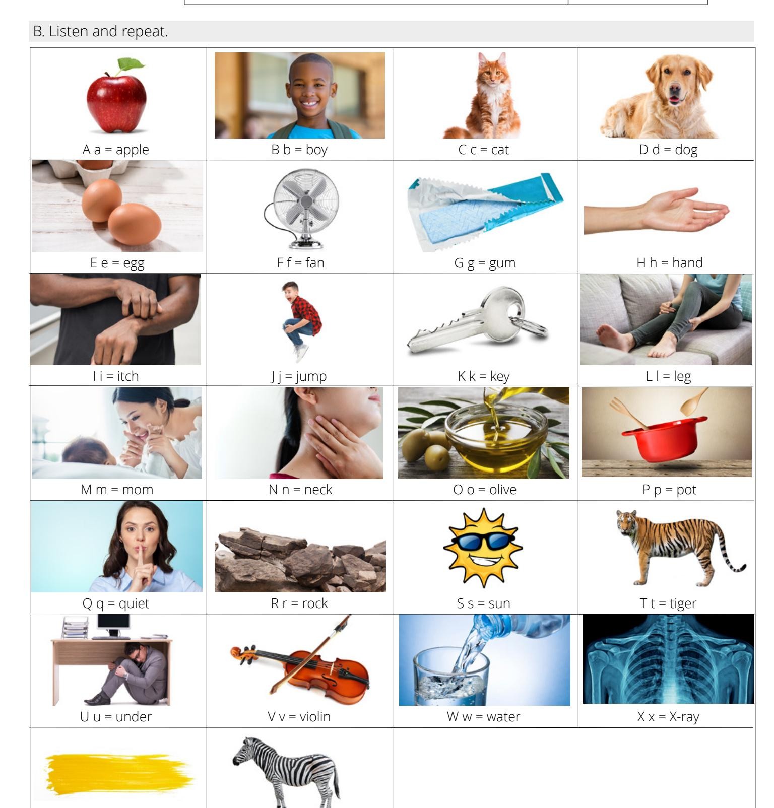

### **ACTIVITY 2: VOWELS**

| A. Study the chart. | Vowel | Short | Long    |
|---------------------|-------|-------|---------|
|                     | a     | apple | age     |
|                     | e     | egg   | eat     |
|                     | i     | itch  | ice     |
|                     | o     | olive | open    |
|                     | u     | under | uniform |

### B. Listen and repeat.

SHORT

LONG

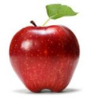

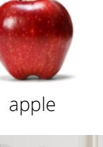

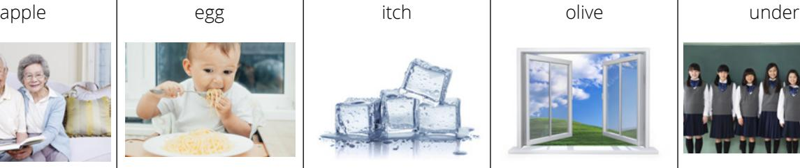

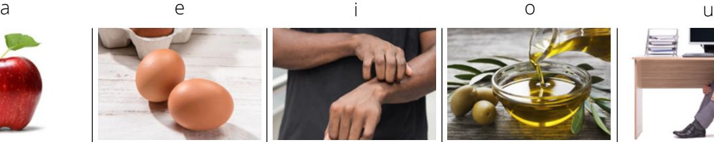

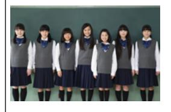

age eat ice open uniform

C. Listen. Choose the correct answer. Say the word aloud.

- 1. at a. short a b. long a
- 2. exit a. short e b. long e
- 3. ivy a. short i

b. long i

- 4. old a. short o b. long o
- 5. up a. short u b. long u
- 6. it a. short i b. long i
- 7. east a. short e b. long e
- 8. on a. short o b. long o

### **ACTIVITY 3: SPELLING**

### A. Listen. B. Listen and repeat. C. Read aloud.

- 1. Hello. What is your name?
- 2. Daniel.
- 3. Could you spell that, please?
- 4. D-a-n-i-e-l.
- 5. Could you repeat that, please?
- 6. D-a-n-i-e-l.
- 7. Thank you!
- D. Listen to the names. Write what you hear.

| N = 6 |
|-------|
|       |
|       |
|       |
|       |
|       |

| 1. |  |  |  |  |
|----|--|--|--|--|
|    |  |  |  |  |
|    |  |  |  |  |
|    |  |  |  |  |

| 2. |  |
|----|--|
|    |  |

- 3. 4.
- 5.
- 6.

### ENGLISHCONNECT 1 LESSON 2: GREETINGS AND INTRODUCTIONS

### **CONVERSATIONS: GREETINGS AND INTRODUCTIONS**

4. Read aloud.

1. Listen.

2. Listen and repeat.

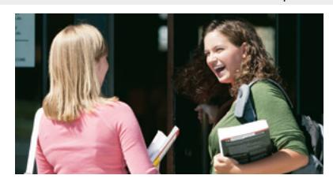

Conversation 1

| _ | - | П | -   |
|---|---|---|-----|
| 1 | ı | П | IU! |

- 1. \_\_\_\_\_ morning.
- 2. \_\_\_\_\_ are you?
- 3. I'm \_\_\_\_\_.
- 4. How are \_\_\_\_\_?
- 5. I'm good, \_\_\_\_\_

| than | iks f | ine |
|------|-------|-----|
| you  | Good  | How |

3. Write the missing word.

Conversation 2

- 1. Hi. What's your \_\_\_\_\_?
- 2. \_\_\_\_\_ name is John.
- 3. \_\_\_\_\_ are you from?
- 4. I'm \_\_\_\_\_ Australia.
- 5. It's nice to \_\_\_\_\_ you.
- 6. \_\_\_\_nice to meet you too.

Where name from My meet It's

Conversation 3

- 1. \_\_\_\_\_ bye!
- 2. See \_\_\_\_\_ later.
- 3. Bye.
- 4. \_\_\_\_\_ ya!

you Good See

### **ACTIVITY 2: CONTRACTIONS**

It is

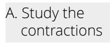

What is  $\longrightarrow$  What's Lam  $\longrightarrow$  I'm

lt's

B. Listen and repeat.

1. What is . . . What's

2. I am . . . I'm

3. It is . . . It's

- C. Read aloud, then listen.
  - 1. What's your name?
  - 2. I'm Misha.
  - 3. I'm fine.
  - 4. It's nice to meet you.

D. Rewrite the sentences with contractions.

Example: <u>I am</u> fine. <u>I'm</u> fine.

- 1. What is your name?\_\_\_\_\_
- 2. <u>I am</u> good, thanks.\_\_\_\_\_
- 3. <u>It is</u> nice to meet you too.\_\_\_\_\_

### **ACTIVITY 3: HOW ARE YOU?**

- a. Fine, thank you!
- b. It's nice to meet you.
- c. Good morning!

3. My name is Dan. What's your

- a. I'm from Japan.
- h I'm fine
- c. I'm Coco.
- 4. It's nice to meet you.

- a. Hello.
- b. It's nice to meet you too.
- c. See you later.

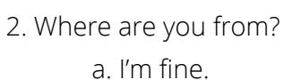

- b. I'm from France.
- c. I'm Jeanne.

### A. Read and choose the correct question.

- 1. My name is Misa.
  - a. What's your name?
  - b. How are you?
  - c. Where are you from?
- 2. I'm from Great Britain.
  - a. What's your name?
  - b. Where are you from?
  - c. How are you?

- 3. I'm fine.
  - a. How are you?
  - b. What's your name?
  - c. Where are you from?

### B. Listen. Choose the correct answer.

- 1. What is his name? 2. Where is he from?
  - a. Rag a. China
  - b. Raj b. Spain
  - c. Roj c. India

### C. Read the question. Write an answer.

1. Good morning! How are you?

2. My name is Emma. What's your name?

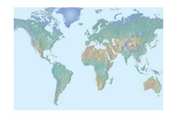

3. Where are you from?

D. Listen to the questions. Answer aloud. Listen to the examples.

### **ACTIVITY 5: INTRODUCTIONS**

### A. Read and choose the correct answer.

### Conversation 1

Hiro: Hello! I'm Hiro. What's your name?

Ika: My name is Ika. Where are you from, Hiro?

Hiro: I'm from Japan. Where are you from?

Ika: I'm from Germany.

- 1. Where is Ika from?
  - a. Germany b. Japan
- 2. is from Japan.
  - a. Hiro b. Ika

Sandy: Hello! Conversation 2

Renee: Hi! What's your name?

Sandy: I'm Sandy. I'm from Canada.

Renee: My name is Renee. I'm from France.

Nice to meet you.

Sandy: It's nice to meet you too, Renee.

- 3. Where is Renee from?

  - a. Canada b. France
- 4. is from Canada.
  - a. Sandy b. Renee

# **ACTIVITY 6: THE VERB "BE"**

A. Listen and repeat.

1. I am 2. you are 3. we are 4. they are 5. he is 6. she is 7. it is

B. Choose the correct form.

| 1. you  | a. are b. am c. is | 2. we | a. are b. am c. is | 3. I   | a. are b. am c. is |
|---------|--------------------------|-------|--------------------------|--------|--------------------------|
| 4. they | a. are b. am c. is | 5. it | a. are b. am c. is | 6. she | a. are b. am c. is |

# **ACTIVITY 7: INTRODUCE YOURSELF**

Write a note to introduce yourself to Elfie from Ghana.

Examples: Hello! My name is Joe. I'm from New Zealand.

Hi, Elfie! I'm Zoey. I'm from Great Britain.

### **PRACTICE PARTNER INSTRUCTIONS**

- A. Help your practice partner review the vocabulary for this lesson in the learner manual. Make sure they understand the meaning of the vocabulary.
- B. 1. Show your practice partner pictures of your friends and family, and introduce them. Example: "This is Susan. She is from Idaho."
  - 2. Ask your practice partner to restate what you told them about your family and friends.
  - 3. Ask your practice partner to show you pictures of his or her family and to introduce them. For example, ask, "What is her name?" and, "Where is she from?"
- C. 1. Help your practice partner introduce someone. (Use the photos below for ideas.) For example, ask your companion:

"What is her name?"

"How do you spell that?"

"Where is she from?"

2. Now let your practice partner practice asking you the same questions.

Joseph Smith USA

Albert Einstein Germany

Mother Teresa Macedonia

Marie Curie Poland

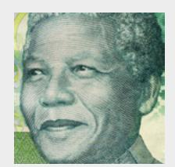

Nelson Mandela South Africa

1. Listen. 2. Read aloud.

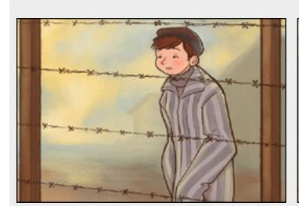

 It is 1944. Henry is 12 years old. He is hungry.

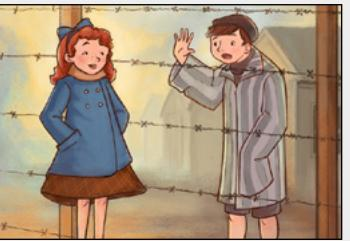

 He sees a girl. "Hello," he says. "Hello," she says.

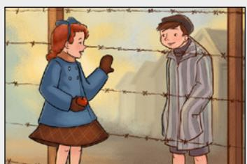

"My name is Henry," he says. "My name is Roma," she says.

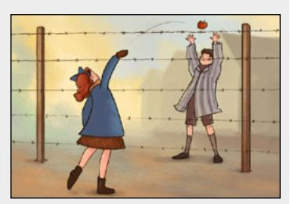

"Do you like apples?" she asks. "Yes," he says. "Take my apple," says Roma.

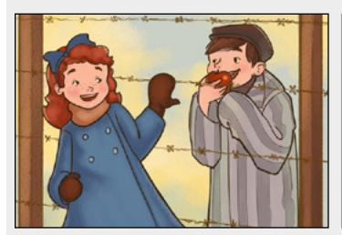

Henry eats the apple.

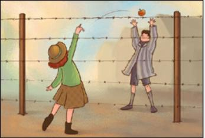

Every day, Roma says, "Take my apple." Every day, Henry eats the apple.

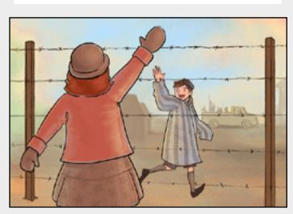

One day, the boy says, "Goodbye." "Goodbye," says Roma.

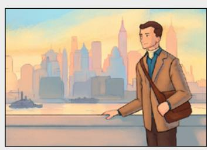

In 1957, Henry lives in the United States.

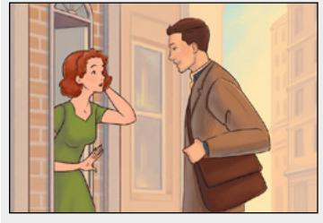

He sees a girl. "Hello," he says. "My name is Henry."

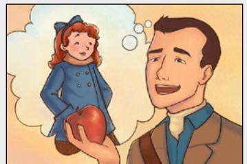

"Do you like apples?" Henry asks. "Yes," says Roma.

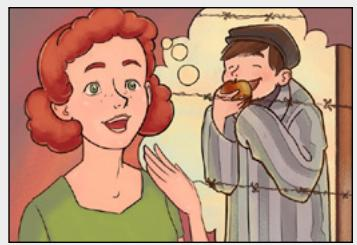

"Do you like apples?" she asks. "Yes," he says.

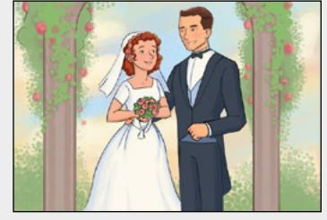

"Will you marry me?" asks Henry. "Yes!" she says. And she does.

- 4. Learn the vocabulary: love, serve, ponder
- 5. Read aloud. Then listen.

Roma **serves** Henry. Henry **loves** Roma. Roma **loves** Henry. Jesus **loves** me.

 6. Read the scripture aloud three times. Then listen.

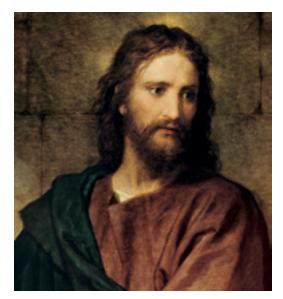

 *"Love one another; as I have loved you"* (John 13:34).

- 7. Ponder: Who do you love? Who can you serve?
- 8. Write: Finish the sentence.

I love .

I can serve .

9. Speak:

Tell the scripture John 13:34 to three people.

### **ENGLISHCONNECT 1 LESSON 3: PERSONAL INTRODUCTIONS**

### **CONVERSATIONS: WHEN IS YOUR YOUR BIRTHDAY?**

A. Listen. B. Listen and repeat. C. Write the missing word. D. Read aloud.

| 1. Jen, when is your |  | ? |
|----------------------|--|---|
|----------------------|--|---|

- 2. It's 7th.
- 3. When is birthday, Sage?
- 4. My birthday is on 20th.
- 5. Oh! That's . Happy birthday!

September birthday October today your

- 1. Good morning, sir! What is your number?
- 2. My phone is (435) 210-8769.
- 3. What's your ?
- 4. 229 West Palm Avenue.
- 5. your email?

**FEBRUARY 1 2 3 4 5 6 7 8 9 10 11 12 13 14 15 16 17 18 19 20 21 22 23 24 25 26 27 28**

> **JUNE1 2 3**

- 6. email is dan@email.com.
- 7. you!

Thank number phone My address It's What's

> **MARCH 1 2 3 4 6 7 8 9 10 11 13 14 15 16 17 18 20 21 22 23 24 25 27 28 29 30 31**

### **ACTIVITY 2: MY BIRTHDAY IS IN . . .**

A. Listen. Choose the correct month.

- a. January 1.
  - b. February
  - c. December
- a. November 2.
- b. December
- c. September

b. April c. May

- a. March 4.
  - b. May
  - c. June

c. June

a. January 6.

b. July

c. June

**4 5 6 7 8 9 11 12 13 14 15 16 18 19 20 21 22 23 25 26 27 28 28 30**

**JANUARY**

**29 30 31**

# **ACTIVITY 3: POSSESSIVE ADJECTIVES**

|    | A. Listen and repeat. Possessive Adjectives |       |                 |  |  |  |  |
|----|------------------------------------------------|-------|-----------------|--|--|--|--|
| 1. | I                                              | my    | my birthday     |  |  |  |  |
| 2. | you                                            | your  | your birthday   |  |  |  |  |
| 3. | we                                             | our   | our birthdays   |  |  |  |  |
| 4. | they                                           | their | their birthdays |  |  |  |  |
| 5. | he                                             | his   | his birthday    |  |  |  |  |
| 6. | she                                            | her   | her birthday    |  |  |  |  |

1. **My** birthday is in October.

**B. Read aloud, then listen.**

- 2. When is **your** birthday?
- 3. **Our** birthday**s** are in August.
- 4. **Their** birthday**s** are in February.
- 5. **His** birthday is in June.
- 6. Today is **her** birthday.

**3 4 5 6 7 8 10 11 12 13 14 15 17 18 19 20 21 22 24 25 26 27 28 29**

### **ACTIVITY 4: POSSESSIVE ADJECTIVES—WRITING**

A. Rewrite the complete sentence.

| Example:               |           |
|------------------------|-----------|
| (you ) When is         | birthday? |
| When is your birthday? |           |

- 1. (we) birthdays are in October.
- 2. (he) birthday is on February 28.

- 3. (they) birthdays are on the same day.
- 4. (she) When is birthday?
- 5. ( I ) Today is birthday.

### **ACTIVITY 5: NUMBERS—MONTHS**

B. Read aloud. Then listen. A. Choose the word that goes with the number.

January 1st

February 2nd

March 3rd

April 5th

May 21st

June 23rd

July 4th

August 8th

September 9th

October 10th

November 7th

December 6th

### **ACTIVITY 6: PERSONAL INFORMATION**

A. Listen to the question. Choose the correct answer.

- 1. a. It's john@email.com.
- b. It's John Harper.
- c. It's August 5th.
- 2.
- a. It's Remy.
- b. It's (307) 198-5642.
- c. It's jrc@email.com
- 3.
- a. It's dcm@email.com.
- b. It's January 2nd.
- c. It's 950 West 3rd Avenue.
- 4. a. It's kma@email.com.
- b. It's 459 Baker Street.
- c. It's (808) 432-7719.

B. Read the answer. Choose the correct question.

| 1.                      | a. Where are you from?       | 2.                | a. When's your birthday?     |
|-------------------------|------------------------------|-------------------|------------------------------|
| A:                      | b. When's your birthday?     | A:                | b. Where are you from?       |
| B: It's (370) 198-5642. | c. What's your phone number? | B: February 28th. | c. What's your phone number? |
| 3.                      | a. Where are you from?       | 4.                | a. Where are you from?       |
| A:                      | b. What's your address?      | A:                | b. What's your name?         |
| B: I'm from Prague.     | c. What's your name?         | B: I'm Amelie.    | c. When's your birthday?     |

### **ACTIVITY 7: PERSONAL INFORMATION—WRITING**

A. Listen. Write the information you hear.

Name Emiko Phone number 1.

- Name Tomas Email 3.
- 4. Name Talia Address

Name: Birthday:

Address:

Email: Phone number:

### **ACTIVITY 8: THE EMERGENCY**

A. Learn the vocabulary: doctor, breathe, oxygen, lie detector B. Listen and read. C. Read aloud.

A woman calls the doctor. "Can I help you?" asks the doctor.

"I can't breathe," says the woman. "What is your name?" asks the doctor. "Joan Harris," says the woman.

- "What is your phone number?" he asks. "It's 125-730-1986," she says.
- "What is your address?" he asks.
- "My address is 906 Main Street," she says.

The doctor goes to Joan's house. He asks, "How old are you?" "I'm 48," says Joan.

He puts something on her finger. It shows her oxygen. "What is that for?" she asks. "It's a lie detector," jokes the doctor.

"Oh," says Joan. "I'm really 57."

- A. Help your practice partner review the vocabulary for this lesson in the back of this book. Make sure they understand the meaning of the vocabulary. Help them retell the story in Activity 8.
- B. Role-play calling the doctor's office. Ask your partner for personal information. Then switch roles.

"What's your name?"

"When is your birthday?"

"What is your phone number?"

"What is your email?"

C. Look at pictures of your practice partner's friends and family. Ask about their birthdays.

"When is his birthday?" "When is her birthday?" "When is your birthday?"

Then switch. Show pictures of your friends and family. Answer your partner's questions.

### **EXPANSION ACTIVITIES: HOW TO PRAY**

- 1. Learn the vocabulary: pray, Heavenly Father, blessings, help, learn 2. Listen.
- 3. Read aloud. 4. Practice saying your own prayer.

# How to Pray

- 1. Dear Heavenly Father,
- 2. Thank you for my blessings. Thank you for my family. Thank you for my English class.
- 3. Please help me to learn English. Please bless my family.
- 4. In the name of Jesus Christ, amen.

- 5. Learn the vocabulary: pray, listens, knows
- 6. Read aloud. Then listen.

Jesus taught, *"Ye must always pray unto the Father in my name"* (3 Nephi 18:19).

> Heavenly Father **listens** to my prayers. Heavenly Father **helps** me.

Heavenly Father **knows** my name.

7. Ponder: What can you pray for?

|  |  |  |  |  | 8. Write: Fill in the prayer. |
|--|--|--|--|--|-------------------------------|
|--|--|--|--|--|-------------------------------|

Dear Heavenly Father,

Thank you for . Please help .

Please bless .

In the name of Jesus Christ, amen.

9. Speak: Practice praying in English. Try to pray in English once a day. Ask Heavenly Father to help you learn English.

### **ENGLISHCONNECT 1**

### **LESSON 4: HOBBIES AND INTERESTS**

### **CONVERSATIONS: LIKES AND DISLIKES**

C. Write the missing word. D. Read aloud.

1. \_\_\_\_\_ do you like to do?

Conversation 1: A. Listen. B. Listen and repeat.

2. I \_\_\_\_\_\_ to play sports.

3. too!

4. \_\_\_\_\_ you like to cook?

5. No, not really. I \_\_\_\_\_ cook very often.

6. Me \_\_\_\_\_.

7. Do you like to \_\_\_\_\_?

8. Yeah, I \_\_\_\_\_ like to dance.

9. Me \_\_\_\_\_!

don't Me really What neither Do dance too like

Conversation 2:

A. Listen.

B. Listen and repeat.

C. Answer the questions.

1. What does Alice like to do?

b.

3. Who does not like to shop?

a. Alice

b. Britta

2. What does Britta like to do?

### **ACTIVITY 2: THE VERB "LIKE"**

to <u>"(verb)</u>."

A. Study the chart.

| I / you / we / they | like / don't like    |
|---------------------|----------------------|
| he / she / it       | likes / doesn't like |

B. Read aloud; then listen.

a. We like to <u>dance</u>. b. He doesn't like to dance.

a. She likes to read.b. I don't like to read.

VV

a. They like to run.
 b. She doesn't like to run.

| C. Study the chart. | Do   | you / they | like to <u>"(verb)</u> ?" |
|---------------------|------|------------|---------------------------|
|                     | Does | he / she   |                           |

D. Read aloud: then listen.

Example 1
Do you like to read?
Yes, I like to read.
No, I don't like to read.

Example 2
Does she like to shop?

No, she doesn't like to shop. Yes, she likes to shop.

### **ACTIVITY 3: LIKE/DON'T LIKE**

A. Listen. Number the pictures. Say what the people like to do.

B. Choose the correct word.

- 1. I to study
  - a. like
  - b. likes
- 2. No, we like to dance.
  - a. don't
  - b. doesn't

- 3. She to paint.
  - a. like
  - b. likes
- 4. He to study.
  - a. like
  - b. likes

- 5. They don't to cook.
  - a. like
  - b. likes
- 6. you like to play sports?
  - a. Do
  - b. Does

# **ACTIVITY 4: DOES SHE LIKE TO . . .**

A. Read the question. Write the answer in a complete sentence. B. Practice saying the questions aloud.

Example Does she like to dance?

No, she likes to sing.

3. Does he like to study?

No, .

1. Does he like to play sports?

No, .

4. What does she like to do?

She .

2. Do they like to shop?

Yes, .

5. What do they like to do?

They .

### **ACTIVITY 5: SOO MI'S LIKES AND DISLIKES**

|                        | Yes | No |
|------------------------|-----|----|
| I like to dance.       | x   |    |
| I like to study.       |     | x  |
| I like to cook.        |     | x  |
| I like to run.         | x   |    |
| I like to read.        | x   |    |
| I like to play sports. |     | x  |
| I like to sing.        | x   |    |
|                        |     |    |

- 1. Does Soo Mi like to read?
  - a. Yes
    - b. No

- 3. Does Soo Mi like to cook?
  - a. Yes
  - b. No
- 2. Does Soo Mi like to sing?
  - a. Yes
  - b. No

- 4. Soo Mi doesn't like to\_\_\_\_\_.
  - a. run
  - b. study

### **ACTIVITY 6: LIKES AND DISLIKES—LISTENING**

A. Listen, and then answer the question. B. Say what each person likes or doesn't like to do.

- 1. What does Reba like to do?
  - a. run
  - b. dance
  - c. sleep
- 2. Sasha doesn't like to .
  - a. cook
  - b. shop
  - c. watch TV

- 3. Jordan likes to .
  - a. read and shop
  - b. read and play sports
  - c. play sports and shop

to .

- a. study b. watch movies
- c. listen to music

### **ACTIVITY 7: WRITE A LETTER**

A. Read Claudia's letter. B. Write a letter to Claudia. Fill in the blanks.

Dear Friend,

Claudia

My name is Claudia. I'm from Bolivia. I like to play sports and watch movies in English. I don't like to study or shop. What do you like to do? Best regards,

| Dear Claudia,   |               |
|-----------------|---------------|
| My name is      |               |
| I'm from        | . I like to   |
| and             |               |
| I don't like to | . Do you like |
| to              | ?             |
| Best regards,   |               |
|                 |               |

### **PRACTICE PARTNER INSTRUCTIONS**

- A. Help your practice partner review the vocabulary for this lesson in the back of this book. Make sure they understand the meaning of the vocabulary.
- B. 1. Tell your practice partner three things you like to do, using complete sentences. Example: "I like to swim."
  - 2. Ask your practice partner to tell you three things he or she likes to do. Ask, "What do you like to do?"
  - 3. Now ask them, "What do I like to do?" They should be able to restate what you said.
  - 4. Tell your practice partner three things you don't like to do; use complete sentences. Example: "I don't like to play sports."
  - 5. Ask your practice partner to tell you three things he or she doesn't like to do. Ask, "What don't you like to do?"
  - 6. Now ask them, "What don't I like to do?" They should be able to restate what you said.
  - 7. Help your practice partner ask and answer questions about the photos below.

Example: "Does he like to play sports?" "*No, he doesn't like to play sports. He likes to read."*

- C. 1. Use famous people to ask questions. See the pictures below for ideas. Be creative. Ask, "What does he/she like to do?" Ask, "What doesn't he/she like to do?"
  - 2. Have your practice partner practice asking questions about what famous people like or don't like to do.

Russell M. Nelson Yo-Yo Ma Mae Jemison Lionel Messi

### **EXPANSION ACTIVITIES: FAITH**

- 1. Learn the vocabulary: faith, know, knowing, sun, hear, seed, plant, planted, grow, swelling, heart
- 2. Listen. 3. Read aloud.

Faith is knowing the sun will rise

lighting each new day. Faith is knowing the

Lord will hear

my prayers each time I pray.

Faith is like a little seed: if planted it will grow. Faith is a swelling within my heart.

When I do right, I know.

- 4. Learn the vocabulary: trust, hope, not seen, true
- 5. Read aloud. Then listen. Faith is **trust** in Jesus Christ (see Guide to the Scriptures, "Faith," scriptures.ChurchofJesusChrist.org).

 Faith is a *"hope for things which are not seen, which are true"* (Alma 32:21).

6. Ponder: What is faith?

7. Write a scripture about faith in English (see Hebrews 11:1; Romans 10:17; James 2:17; Moroni 10:4).

8. Read the scripture aloud five times.

### **ENGLISHCONNECT 1 LESSON 5: HOBBIES AND INTERESTS**

### **CONVERSATION: WHY DO YOU LIKE TO . . .**

| A | 0   |  |
|---|-----|--|
| m | 'ທາ |  |
| w | अ   |  |
|   |     |  |

|  | A. Listen. B. Listen and repeat. C. Write the missing word. D. Read aloud. E. Answer the questions. |  |
|--|-----------------------------------------------------------------------------------------------------|--|
|  |                                                                                                     |  |

- 1. Hey, Maria, you like shop? Yes. 2. Really? ? 3. I like to shop it's fun. 4. Do like to , Luisa? No.
- 5. Really? Why ?
- 6. I like to cook because boring.
- 7. Miguel, do you like to do?
- 8. I like to .
- 9. ? Why?
- 10. I like to read it's .

read because you it' s do cook not relaxing don't Why to what Really

- 1. Who likes to read?
  - a. Luisa
  - b. Maria
  - c. Miguel
- 3. Why does Maria like to shop?
  - a. because it's relaxing
  - b. because it's fun
  - c. because it's boring
- 2. Luisa doesn't like to cook because it's .
  - a. boring
  - b. relaxing
  - c. difficult

### **ACTIVITY 2: SAM'S AND ROSIE'S LISTS**

### A. Read the lists.

| play sports  | fun       |
|--------------|-----------|
| sing         | difficult |
| travel       | expensive |
| read books   | useful    |
| watch movies | relaxing  |

# Sam Rosie

| play sports  | tiring      |
|--------------|-------------|
| sing         | fun         |
| travel       | exciting    |
| read books   | interesting |
| watch movies | boring      |

### B. Listen to 1–6, and repeat. C. Write the correct word.

- 1. Sam likes to play sports because it's fun.
- 2. Rosie likes to read books because it's interesting.
- 3. Sam likes to watch movies because it's relaxing.
- 4. Rosie doesn't like to watch movies because it's boring.
- 5. Sam doesn't like to travel because it's expensive.
- 6. Rosie doesn't like to play sports because it's tiring.

- 1. Rosie likes to because it's fun.
- 2. Sam to sing because it's difficult.
- 3. Sam likes to because it's useful.
- 4. Rose likes to because it's interesting.
- 5. Sam to watch movies because it's relaxing.
- 6. Rosie doesn't like to watch movies because it's .

# **ACTIVITY 3: BECAUSE IT'S . . .**

A. Listen. Answer the questions. Choose all that are correct.

- 1. Sofia likes to . . .
  - a. sing
  - b. study
  - c. sleep
  - d. dance
  - e. listen to music
- 2. because it's . . .
  - a. difficult
  - b. interesting
  - c. fun
  - d. challenging
  - e. exciting

- 3. Joe really likes to . . .
  - a. swim
  - b. camp
  - c. dance
  - d. run
  - e. bike
- 4. because it's . . .
  - a. difficult
  - b. interesting
  - c. fun
  - d. challenging
  - e. exciting

- 5. Tahir loves to . . .
  - a. garden
  - b. travel
  - c. read
  - d. run
  - e. write
- 6. because it's . . .
  - a. easy
  - b. interesting
  - c. relaxing
  - d. wonderful
  - e. exciting

- 7. Juliette likes to . . .
  - a. camp
  - b. swim
  - c. go to the beach
  - d. run
  - e. travel
- 8. because it's . . .
  - a. easy
  - b. interesting
  - c. relaxing
  - d. wonderful
  - e. exciting

### **ACTIVITY 4: "WH-" QUESTIONS (WHAT, WHY)**

|      | do / don't     | you / they |             |
|------|----------------|------------|-------------|
| What | does / doesn't | he / she   | like to do? |

- A. Listen to the examples. Then repeat.
  - 1. What do you like to do? I like to run.
  - 2. What does he like to do? He likes to cook.
  - 3. What don't they like to do? They don't like to study.

|     | do / don't     | you / they |              |
|-----|----------------|------------|--------------|
| Why | does / doesn't | he / she   | like to run? |

- B. Listen to the examples. Repeat.
  - 1. Why do you like to run? I like to run because it's fun.

2. Why does she like to run? She likes to run because it's challenging.

3. Why don't they like to run? They don't like to run because it's tiring.

### **ACTIVITY 5: MORE "WH-" QUESTIONS**

A. Listen to the question. Choose the correct response.

- 1. a. I like to camp.
- b. He likes to camp.
- c. . . . because it's difficult.
- d. . . . because it's relaxing.
- 2. a. . . . because it's tiring.
- b. . . . because it's fun.
- c. She likes to dance.
- d. He likes to dance.

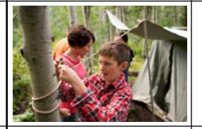

- 3. a. She doesn't like to travel.
- b. We don't like to travel. c. . . . because it's exciting.
- d. . . . because it's expensive.

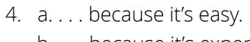

- b. . . . because it's expensive.
- c. They like to watch sports.
- d. She likes to watch sports.

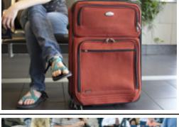

### **ACTIVITY 6: WHY OR WHY NOT**

A. Answer the questions in two to four complete sentences.

1. Do you like to travel? Why or why not?

2. Do you like to study English? Why or why not?

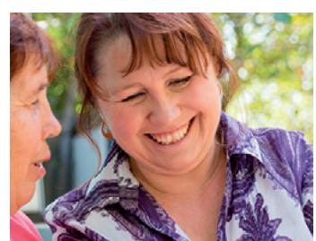

Examples

- A. Yes, I love to travel! I like to travel because it's exciting and interesting and because I like to visit new places.
- B. No! I don't like to travel because it's so expensive. I don't like it because it's tiring.
- A. Yes, I like to study English. I like it because it's interesting and important for me. It helps me speak better.
- B. No! I don't like to study English. I don't like it because it's difficult and tiring.

### **ACTIVITY 7: REGULAR VERBS**

I / you / we / they he / she like run cook dance study watch TV like**s** run**s** cook**s** dance**s** stud**ies** watch**es** TV

 A. Read the sentences aloud. Then listen.

- 1. I like to run.
- 2. She likes to run.

- 3. We dance well.
- 4. He dances well.

- 5. They study English.
- 6. He studies English.

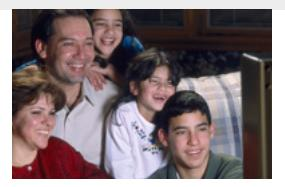

- 7. They watch movies at night.
- 8. He watches movies at night.

- B. Choose the correct form of the verb.
- 1. He to go to the beach.
  - a. like
  - b. likes
- 4. They to loud music.
  - a. listen
    - b. listens

- 2. I every day.
  - a. run
  - b. runs
- 5. You so well!
  - a. sing
  - b. sings

- 3. We dinner at 5:00 p.m.
  - a. cook
  - b. cooks
- 6. She at school.
  - a. dance
  - b. dances

### **ACTIVITY 8: WHAT DO YOU LIKE TO DO?**

**Mario**: I like to swim. I swim every morning. I also cook really good Italian food. On the weekends, I bike with my friend, Tommaso.

**Greta**: Oh? What does Tommaso do?

**Mario**: He bikes and plays soccer. He sings and

dances really well. And he writes music.

**Greta**: Wow! That's so interesting!

- A. Read and answer the questions.
- 1. What does Mario do?
  - a. He swims.
  - b. He sings.
  - c. He dances.
- 2. What does Tommaso do?
  - a. He cooks.
  - b. He writes music.
  - c. He swims.
- 3. Who sings and dances?
  - a. Mario
  - b. Greta
  - c. Tommaso
- 4. What do Mario and Tommaso do together?
  - a. They play soccer.
  - b. They swim.
  - c. They bike.

- A. Help your practice partner review the vocabulary for this lesson in the back of this book. Make sure they understand the meaning of the vocabulary.
- B. 1. Help your practice partner talk about their likes and dislikes.

Ask: "What do you like to do?" "Why do you like to do that?" "What else do you like to do?"

Ask: "What don't you like to do?" "Why not?" "What else don't you like to do?"

Ask: "What do you do with your friends?"

- 2. Switch roles. Let your practice partner ask you the same questions.
- 3. Share pictures of your friends and family. Take turns asking each other about your families' and friends' likes and dislikes.

### **EXPANSION ACTIVITIES: MISSIONARY WORK**

- 1. Learn the vocabulary: companion, missionaries, scriptures, baptized
- 2. Listen. 3. Read aloud.

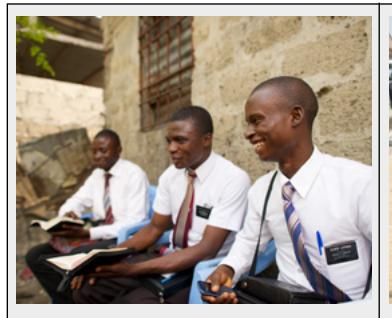

My name is Elder Lupaka, and my companion's name is Elder Okar.

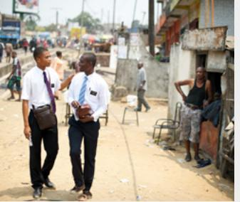

We are missionaries for The Church of Jesus Christ of Latter-day Saints.

We serve in Africa. I like to run and go to the beach. I also like to read the scriptures.

My companion likes to cook, sleep, and pray.

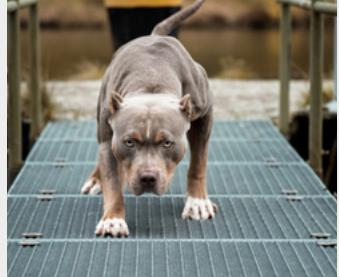

He doesn't like to run from dogs.

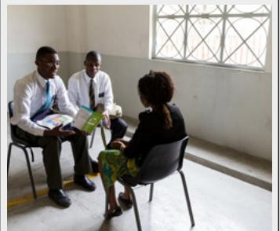

We both love to teach people about Jesus Christ.

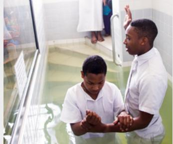

We are so happy when they are baptized.

- 4. Learn the vocabulary: talk, rejoice, preach, prophesy
- 5. Read aloud 5 times. Then listen.

 *"And we talk of Christ, we rejoice in Christ, we preach of Christ, we prophesy of Christ"* (2 Nephi 25:26).

- 6. Ponder: What do you know about Jesus Christ?
- 7. Write: How can the teachings of Jesus Christ help you?

8. Speak: Say the scripture 2 Nephi 25:26 to three people.

### **ENGLISHCONNECT 1 LESSON 6: FAMILY**

| CONVERSATION: WHO IS IN YOUR FAMILY? |
|--------------------------------------|
|--------------------------------------|

A. Listen. B. Listen and repeat. C. Write the missing word. D. Read aloud. E. Answer the questions.

|    | 1. I'm Canada. I like to     |                                   |
|----|---------------------------------|-----------------------------------|
|    | Also, I have a                  | family.                           |
|    | 2. Oh, yeah? Tell me about your |                                   |
| 3. |                                 | are 5 people in my family. I have |
|    | a brother and a                 | . What about                      |
|    | you?                            | are in your family?               |
|    | 4. I have 3 sisters and no      | . So there                        |
|    |                                 |                                   |

 small are dance from big friend family How many What brothers There sister is

- 5. Where is Li Wei from?
- 6. How many people are in Li Wei's family?
- a. China
- b. Canada
- c. The United States

6 people in my family.

- - a. 5
  - b. 6
  - c. 7

- 7. How many brothers does Li Wei have?
  - a. 0
  - b. 1
  - c. 2

### **ACTIVITY 2: SINGULAR/PLURAL AND THE VERB "HAVE"**

A. Study the chart. Listen and repeat 1–5.

|    | Singular (1) | Plural (1+) |
|----|--------------|-------------|
| 1. | brother      | brothers    |
| 2. | sister       | sisters     |
| 3. | parent       | parents     |
| 4. | uncle        | uncles      |
| 5. | child        | children    |

B. Study the chart.

| The verb have       |      |
|---------------------|------|
| I / you / we / they | have |
| he / she / it       | has  |

- C. Read aloud; then listen.

- 2. You have 3 sisters. 4. They have 6 nephews. 6. She has 5 uncles.
- 1. I have two brothers. 3. We have one son. 5. He has four nieces.

1. She / have / two / cousin

2. They / have / one / brother

 3. I / have / two / sister

D. Write a complete sentence.

1. **She has two cousins.**  2.

3.

5. We / have / six / child

 6. She / have / three / niece

| D. Write a complete sentence. |
|-------------------------------|
| 4.                            |
| 5.                            |
| 6.                            |

## **ACTIVITY 3: TELL ME ABOUT YOUR FAMILY**

A. Listen and answer the questions.

Example:

3. Agatha has 20 .

c. grandchildren

- 1. Ken has one .
- a. nephew
- b. niece
- c. cousin

4. Daya has nieces.

 a. nephews b. cousins

- a. 0
- b. 1 c. 2

- 2. Manuel has four .
- a. sons
- b. daughters
- c. children

# **ACTIVITY 4: GEORGE AND MARIE'S FAMILY**

A. Write the answer to the questions about George and Marie's family.

|      | George | Marie |       |       |
|------|--------|-------|-------|-------|
| Ken  | Sue    | John  | Anna  |       |
|      |        |       |       |       |
| Sara | Dan    | Ben   | James | Nikki |

- 1. How many children do George and Marie have?
- 2. John is George's .
- 3. Sara is Ben's .
- 4. How many sons do John and Anna have?
- 5. George is James's .
- 6. Sue is Sara's .
- 7. Nikki is Ken's .
- 8. Dan and Ben are .
- B. Talk about how the person is related to Sue. Then listen.
- 1. Sara 2. George 3. James 4. Dan

- 5. Nikki 6. Marie 7. John 8. Anna

### **ACTIVITY 5: HOW MANY ARE IN THE FAMILY?**

A. Read and then write the answer to the questions. Then practice saying the questions.

- 1. How many people are in this family?
- 2. How many children do they have?
- 3. How many sons are in the family?
- 4. How many daughters are in the family?

B. Write about one of your parents in 3 or more sentences.

Where is he/she from? What does he/she like to do, and why? How many people are in his/her family?

My mother is from Russia. She likes to cook because it's fun. She has 3 sisters. Examples

My father is from Argentina. He likes to play sports. He doesn't like to sing because it's difficult.

### **PRACTICE PARTNER INSTRUCTIONS**

- A. Help your practice partner review the vocabulary for this lesson in the back of this book. Make sure they understand the meaning of the vocabulary.
- B. Look at the picture of George and Marie's family in Activity 4. Help your practice partner talk about how each person is related to John. For example, "Sue is John's sister."
- C. Share pictures of your own family. Talk about your extended family. "How many cousins do you have?" "How many aunts and uncles?" "What do they like to do?" Help your practice partner talk about their extended family. How many people are in their family? Do they all live together? What do they like to do? Then help them fill in the chart. Practice asking and answering the questions.

| Questions about family How many ?                                                                                                                     | Possible answers                     |
|----------------------------------------------------------------------------------------------------------------------------------------------------------|--------------------------------------|
| How many people are in your family?                                                                                                                      | There are people in my family. |
| How many brothers do you have? How many sisters do you have? How many cousins do you have? Do you have any aunts or uncles? If so, how many? | I have                               |

D. Look at the pictures. Take turns with your practice partner asking and answering questions about each family. For example, how many daughters does she have? How many parents are in the family? How many grandchildren are in the family?

### **EXPANSION ACTIVITIES: FAMILY**

- 1. Learn the vocabulary:
- achieve
- founded upon
- sacred
- duty
- rear children
- relationship
- 2. Listen.
- 3. Read aloud.

### Scripture 1

*"Husbands, love your wives, even as Christ also loved the church, and gave himself for it"* (Ephesians 5:25).

Scripture 2

*"Honour thy father and thy mother"* (Exodus 20:12).

- 4. Ponder: What do these quotes and scriptures mean to you?
- 5. Write one of the quotes or scriptures.

6. Speak: Memorize the quote or scripture. Say it to three people.

### **CONVERSATION: WHO IS IN YOUR FAMILY?**

A. Listen. B. Listen and repeat. C. Write the missing word. D. Read aloud.

- 1. Tell me about your .
- 2. Well, six people in my family.
- 3. I two brothers and one sister.
- 4. Oh, I have one too.
- 5. What's sister like?
- 6. My sister 16 years old.
- 7. She is and she long, brown hair.
- 8. She to read.

tall there are your sister family is has have like likes

### **ACTIVITY 2: BE OR HAVE?**

A. Study the chart. B. Listen and repeat 1‒5.

|                     | the verb be |
|---------------------|-------------|
| I am                | tall        |
| you / we / they     | thin old |
| are                 | married     |
| he / she / it is | bald        |

|                 | the verb have |
|-----------------|---------------|
| I have          | long hair     |
| you / we / they | blue eyes     |
| have            | curly hair    |
| he / she / it   | glasses       |
| has             | a beard       |

C. Choose the correct verb.

- 1. She tall.
- a. is
- b. are
- c. has
- d. have

- 2. They green eyes.
- a. is
- b. are
- c. has
- d. have

- a. is
- b. are
- d. have

- 4. We married.
- a. is
- b. are
- c. has
- d. have

- 5. He a beard.
- a. is
- b. are
- c. has
- d. have

- 3. Sarah curly hair.
- c. has

- 6. I not old.
- a. am
- b. is
- c. has
- d. have

### **ACTIVITY 2: TALKING ABOUT AGE**

A. Study the chart. B. Listen and repeat 1–4.

| Talking about Age: Questions |             |                      |  |
|------------------------------|-------------|----------------------|--|
| Llow old                     | are         | you / they?          |  |
| How old                      | is          | he / she?            |  |
| Talki                        | ing about A | ge: Answers          |  |
| l am                         | ľm          |                      |  |
| you are                      | you're      |                      |  |
| we are                       | we're       |                      |  |
| they are                     | they're     | <u>25</u> years old. |  |
| he is                        | he's        |                      |  |
| she is                       | she's       |                      |  |
| it is                        | it's        |                      |  |

### **ACTIVITY 4: DARIA'S FAMILY**

A. Read the chart. Listen and respond to the questions aloud.

| DARIA |  |
|-------|--|

| Sister          | Brother        | Brother      | Mom          | Dad             |
|-----------------|----------------|--------------|--------------|-----------------|
| Maddie          | Marcus         | James        | Dawn         | Clark           |
| 10 years        | 15 years       | 18 years     | 45 years     | 49 years        |
|                 |                |              |              |                 |
| Cousin          | Cousin         | Aunt         | Uncle        | Grandma         |
| Cousin Simon | Cousin Lucy | Aunt Barb | Uncle Dan | Grandma Judy |

DARIA'S FAMILY

### **ACTIVITY 5: WHO IS IT?**

A. Look at the picture. Listen to the description. Choose the correct person.

c. Claire d. Charlotte

b. Susan

a. Katherine

2. a. David

b. Ray

c. Alan

d. Jonathan

a. Charlotte

4. a. Susan

d. Mary

b. Ray

c. Philip

d. Marjorie

Mary

Paul

Charlotte

Steven

### **ACTIVITY 6: DESCRIBING THE FAMILY**

A. Read the description. Choose the picture that matches.

1. My cousin is a friendly and fun person. She is 23 years old. She is thin and has straight red hair. She loves to travel, cook, and watch movies.

2. My brother is energetic. He is 34 years old and kind of short. He is bald but has a mustache and short beard. He is married and has two children. He likes to run.

c.

### **ACTIVITY 7: DESCRIBE THE PERSON**

A. Write about the person in the picture. Write as much as you can. Be creative.

Hugo age 29

Helen age 66

### **PRACTICE PARTNER INSTRUCTIONS**

- A. Help your practice partner review the vocabulary for this lesson in the back of this book. Make sure they understand the meaning of the vocabulary.
- B. Look at the pictures in Activity 7. Help your practice partner say as much as they can about the people in the pictures. Talk about age, physical description, personality, family relationships, and interests. Do the same for the pictures below.

Young-ja, age 78, grandmother Min-seo, age 9, granddaughter

Victor, age 27, husband Adele, age 26, wife

C. Look at the chart in Activity 4. Ask your practice partner questions about Daria's family. Examples: How old is Uncle Dan? How many cousins does she have? How old are they?

- Share pictures of your own families. Help your practice partner describe two family members. Talk about: 1. age ( is years old) D. Look at the chart in Activity 5. Give your practice partner some clues about people in the chart. Then ask, "Who is it?" For example, "This person has dark hair, dark skin, and blue eyes. Who is it?"
  - 2. physical description (he/she has eyes and hair, he/she is tall/short, and so on)
  - 3. personality (funny, shy, loud, kind, athletic, and so on)
  - 4. likes and dislikes

### **EXPANSION ACTIVITIES: CHANGE OF HEART**

- 1. Learn the vocabulary: want, example, proud, decide, soften
- 2. Listen. 3. Read aloud.

My brother Carlos is handsome. He is tall and has dark hair. He is 19 years old.

Carlos spoke in church. He said, "I love Jesus Christ. I try to do good. I want my brother to be proud of me."

I think about my life. I don't follow Jesus Christ.

He is going on a mission for The Church of Jesus Christ of Latter-day Saints.

I am surprised. I am proud of him. Carlos is a good person. He studies the scriptures.

But my brother loves me. I want to be like him. My heart softens. I repent. I change my life.

I didn't want to go on a mission. I didn't want to leave my job, my girlfriend, or my motorcycle.

He serves other people. He is honest. He is kind. He is like Jesus Christ.

Two years later, I am a missionary. I thank Heavenly Father for my brother. He is a good example for me.

- 4. Learn the vocabulary: repentance, change, mind, view, suffered, pain, how, who
- 5. Read aloud. Then listen.

*"[Christ] suffered the pain of all men, that all men might repent and come unto him"* (Doctrine and Covenants 18:11).

**Repentance** "is a **change** of **mind** and heart that gives you a fresh **view** about God, about yourself, and about the world" ("Repentance," *True to the Faith* [2004], 132).

- 6. Ponder: What can you do to be a better person?
- 7. Write: **Who** do you want to be like? Write 3–5 sentences about this person.
- 8. Speak: Talk about the person you want to be like. Tell three people.

### **ENGLISHCONNECT 1 LESSON 8: EVERYDAY COMMON ITEMS**

### **CONVERSATION: IS THIS YOUR PHONE?**

A. Listen. B. Listen and repeat. C. Write the missing word. D. Read aloud.

- 1. Sasha, is your phone?
- 2. No, not.
- 3. phone is in my pocket.
- 4. Are your keys?
- 5. No, not.
- 6. My keys in my backpack.

My this it's these are they're your

### **ACTIVITY 2: THIS AND THESE**

A. Study the chart. B. Listen and repeat.

| This and These |             |  |
|----------------|-------------|--|
| Singular (1)   | Plural (2+) |  |
| this / is      | these / are |  |
|                |             |  |

C. Choose the correct missing word.

| 1. What is     | 5.             |
|----------------|----------------|
| ?              | this your pen? |
| a. this        | a. Is          |
| b. these       | b. Are         |
| 2. These       | 6. What are    |
| my pencils.    | ?              |
| a. is          | a. this        |
| b. are         | b. these       |
| 3. Do you like | 7. This        |
| chairs?        | her computer.  |
| a. this        | a. is          |
| b. these       | b. are         |
| 4.             | 8. Do you like |
| is my phone.   | book?          |
| a. This        | a. this        |
| b. These       | b. these       |

### **ACTIVITY 3: WHAT IS THIS?**

A. Look at the picture. Listen to the question, and respond. B. Ask a question aloud for each picture.

# **ACTIVITY 4: POSSESSIVE ADJECTIVES REVIEW**

A. Study the chart.

B. Read. Listen and repeat 1–5.

| Possessive Adjectives—Review |       |              |
|------------------------------|-------|--------------|
| I                            | my    | my watch     |
| you                          | your  | your pen     |
| we                           | our   | our books    |
| they                         | their | their phones |
| he                           | his   | his wallet   |
| she                          | her   | her keys     |

4. Is this his wallet? No, it's not.

5. Are these her keys? Yes, they are.

### **ACTIVITY 5: WHAT IS THIS?**

A. Write what you hear.

### **ACTIVITY 6: WHAT IS THIS?**

A. Look at the picture. Write five things you see.

| K  |   |  |
|----|---|--|
|    | M |  |
| N. |   |  |
|    |   |  |

A. Listen. B. Read aloud.

My name is Nora. I like to read. These are my books.

I also like to write stories for children. I write my ideas in these notebooks.

I only write with this pen. I like to write with it because it helps me write good ideas.

Then I write the story on this computer.

Each day for 8 hours, I sit at this table to write.

Writing is challenging. But I love to write because it's also interesting and exciting.

C. Answer the questions. Choose all that are correct.

1. What does Nora like to do? 2. What does Nora use in her writing? 3. Nora likes to write because it's .

a. study

b. travel

c. read

d. dance

e. write

a. a computer

b. a pen

c. a pencil

d. a notebook

e. a table

a. challenging

b. fun

c. exciting

d. interesting

e. easy

### **PRACTICE PARTNER INSTRUCTIONS**

- A. Help your practice partner review the vocabulary for this lesson in the back of this book. Make sure they understand the meaning of the vocabulary.
- B. Look at the pictures in Activity 3, Activity 6, and below. Take turns asking questions. "What is this?" "What are these?" Look around the room and ask your partner to name things.

- C. Look at Activity 7. Ask your practice partner to retell Nora's story in his or her own words. Ask questions about the story. For example, "What does Nora like to do?" and "How many hours does she write?"
- D. Ask your practice partner to retell the story in the "Expansion Activity." Ask him or her questions about the story. For example, "What did Laura lose?" or "Where did she look?" or "What did her daughter say?" Talk about prayer together. What do you pray for? How does Heavenly Father answer your prayers?

### **EXPANSION ACTIVITIES: HEAVENLY FATHER ANSWERS PRAYERS**

- 1. Learn the vocabulary: lose, need, look, find, vacation, under
- 2. Listen. 3. Read aloud.

"Where are the car keys?" Laura asks herself. "I can't lose them!"

Laura and her family are on vacation 800 km from home. She needs those keys.

Laura looks in the car. She looks in her backpack. No keys.

Laura looks on the table. She looks under the chair. No keys.

keys.

"Did you pray?" asks her daughter. "No," says Laura. "Let's pray t o g e t h e r , " says her daughter.

They pray. Laura has a thought to look in her computer bag. There are the keys!

Laura says another prayer. She thanks Heavenly Father for answering her prayer and helping her find her keys.

- 4. Learn the vocabulary: humble, lead, hand, answer, talk, hear, thou, thee = you, thy = your
- 5. Read aloud. Then listen.

*"Be thou humble*; *and the Lord thy God shall lead thee by the hand, and give thee answer to thy prayers"* (Doctrine and Covenants 112:10).

*"*Just **talk** to your Father. He **hears** every prayer and **answers** it in His way" (Richard G. Scott, "Learning to Recognize Answers to Prayer," *Ensign,* Nov. 1989, 3).

- 6. Ponder: What do you pray for? How has Heavenly Father answered your prayers?
- 7. Write three sentences about what you pray for:

8. Speak: Talk about what you pray for. Tell three people.

Examples:

I pray for my family.

I pray for help with English.

### **ENGLISHCONNECT 1 LESSON 9: CLOTHING AND COLORS**

### **CONVERSATION: I'M LOOKING FOR A NEW SHIRT**

- 1. So, Camila, what are you ?
- 2. I'm looking for a new ?
- 3. shirts are nice.
- 4. Do you like ?
- 5. Yeah, but those shirts are all .
- 6. I'm looking for a red .
- 7. Look over !
- 8. Those are red and they're on sale!

them there Those one shirt red shirts looking for green are is

- 1. What is Camila looking for?
- a. a green shirt c. a red skirt
- b. a red shirt d. a green skirt
- 2. Does she find what she is looking for?
  - a. yes
  - b. no

### **ACTIVITY 2:**

A. Study the charts. B. Listen to the examples, and then repeat.

| Demonstrative Adjectives: this, these |              |             |
|---------------------------------------------|--------------|-------------|
|                                             | Singular (1) | Plural (2+) |
| Close to the speaker                  | this / is    | these / are |

| Demonstrative Adjectives: that, those |              |             |
|---------------------------------------|--------------|-------------|
|                                       | Singular (1) | Plural (2+) |
| Far from the speaker            | that / is    | those / are |

C. Look at the pictures. Listen to the question, and respond. Then ask your own questions for each picture.

### D. Write the missing word. Use *is, are, this, that, these, those.*

1. are his green shoes. 2. Is your red jacket?

3. That his ring.

6. I don't like orange sweater.

4. these his glasses? 5. I like dresses.

### **ACTIVITY 3: I'M WEARING . . . I'M LOOKING FOR . . .**

|                               | Verb + ing                 |                        |
|-------------------------------|----------------------------|------------------------|
| I am                          | I'm                        |                        |
| you are we are they are | you're we're they're | wearing looking for |
| he is she is               | he's she's              |                        |

- A. Study the chart. B. Listen and repeat 1–3.
  - 1. I'm wearing a blue shirt.
  - 2. They are wearing white shirts.
  - 3. He's looking for a green shirt.

C. Read about Milo, and then answer the questions.

Milo is looking for his black shoes.

He finds his sister's green sweater.

He finds his mother's blue earrings.

He finds his brother's dirty yellow socks.

He finds his father's brown slippers.

Where are his shoes? There they are!

- 1. What is Milo looking for?
  - a. shoes
  - b. socks
  - c. slippers
- 2. What color are his mother's earrings?
  - a. black
  - b. blue
  - c. brown
- 3. What does Milo find?
  - a. blue socks
  - b. green earrings
  - c. brown slippers
- 4. Does Milo find what he is looking for?
  - a. Yes b. No

### **ACTIVITY 4: WHO IS IT?**

A. Listen to 1–5. Choose the person described. Say what each person is wearing.

| 1. Who is it? |           |          |  |
|---------------|-----------|----------|--|
| a. Olga       | b. Omar   | c. Jon   |  |
| 2. Who is it? |           |          |  |
| a. Rosa       | b. Esther | c. Olga  |  |
| 3. Who is it? |           |          |  |
|               |           |          |  |
| a. Mia        | b. Esther | c. Olga  |  |
| 4. Who is it? |           |          |  |
| a. Jon        | b. Jorge  | c. Raoul |  |
| 5. Who is it? |           |          |  |

B. Look at the picture. Write what the person is wearing.

2. What is Esther wearing?

3. What is Omar wearing?

### **PRACTICE PARTNER INSTRUCTIONS**

- A. Help your practice partner review the vocabulary for this lesson in the back of this book. Make sure they understand the meaning of the vocabulary.
- B. Look at Activity 4. Describe one of the people. Have your partner guess who it is. Repeat. Switch roles.
- C. Look at the pictures below. Help your practice partner talk about what they see and what the people are wearing.

D. Look at the pictures below. Ask them to choose their favorite. "Do you like this green shirt or that purple shirt?"

### **EXPANSION ACTIVITIES: JUDGE NOT**

- 1. Learn the vocabulary: neighbor, hang up clothes, window, wash, clean, soap
- 2. Listen. 3. Read aloud.

Mary likes to watch her neighbors. One day she sees her neighbor Sue. Sue hangs up clothes on the line. Sue hangs up red socks, blue pants, and a white shirt.

Mary looks out her window at the clothes. She turns to her husband, Bill, and says, "Sue doesn't know how to wash clothes. Those shirts are not clean."

Bill looks out the window. He doesn't say anything.

A few days later, Sue hangs up clothes again. Mary watches. Sue hangs up a green, white, and yellow dress and white socks.

Mary says to Bill, "She needs different soap. Those socks are not clean." Bill doesn't say anything.

Mary continues to watch Sue hang up clothes. Mary continues to tell Bill that Sue does not know how to wash clothes.

A few weeks later, Mary watches Sue hang up clothes. They are all clean! She says, "All of the clothes are clean! How did this happen?"

Bill says, "I washed our windows."

- 4. Learn the vocabulary: judge, judging
- 5. Read aloud. Then listen.

*"Judge not, that ye be not judged*" (Matthew 7:1).

6. Ponder: What does Jesus teach about judging people? How can you do better?

|  |  | 7. Write: What lesson does Mary learn in this story? |
|--|--|------------------------------------------------------|
|--|--|------------------------------------------------------|

8. Speak: Tell this story to three people.

### **ENGLISHCONNECT 1 LESSON 10: DAILY ROUTINES**

### **CONVERSATION: WHAT DO YOU DO IN THE MORNING?**

A. Listen. B. Listen and repeat. C. Write the missing word. D. Read aloud.

| 1. Hey, Jianyu, what do you usually do in the |                       |                           | ? |
|-----------------------------------------------|-----------------------|---------------------------|---|
| 2. I                                          | take a shower and eat |                           |   |
| 3. What                                       | Kyung usually         | in the morning?           |   |
| 4. He usually                                 |                       | his teeth and watches the |   |
| 5. What                                       | ?                     |                           |   |
| 6. I usually                                  |                       | late, and then I go to    |   |

breakfas get up news morning you about do brushes usually does take work

# **ACTIVITY 2: 2: SIMPLE PRESENT + USUALLY**

A. Study the chart. B. Listen and repeat 1–4.

| Usually + Verb    |                |                                          |                 |
|-------------------|----------------|------------------------------------------|-----------------|
| I                 | eat breakfast  |                                          |                 |
| You We They | usually        | brush (my / your / their / our) teeth | in the morning. |
|                   | eats breakfast |                                          |                 |
| He / She / It     |                | brushes his / her teeth                  |                 |

- C. Look at the picture, and choose the correct answer. Say the complete sentence aloud.
- 1. Farah usually in the morning.
- a. brushes her teeth
- b. brushes her hair
- c. makes her bed

- 2. Chanhoon usually in the morning.
- a. makes his bed
- b. wakes up early
- c. goes to work

- 3. Patricia usually in the morning.
- a. makes breakfast
- b. brushes her hair
- c. puts on makeup

- 4. Christopher usually in the morning.
- a. takes a shower
- b. makes breakfast
- c. makes his bed

- 5. Izumi usually in the morning.
- a. feeds the dog
- b. makes her bed
- c. eats breakfast

- 6. Lucien usually in the morning.
- a. gets dressed
- b. shaves his face
- c. takes a shower

### D. Write a sentence to tell what the person usually does in the morning.

5. 6.

take a shower make breakfast

get dressed

watch the news brush teeth

Example:

go to school go to work

1. Claudia .

Armani **usually gets dressed in the morning.**

- 2. Michael and Susan .
- 3. I . 4. We .
- 5. Minhye .
- 6. Lin .

# **ACTIVITY 3: WHAT DO YOU DO IN THE MORNING?**

- A. Listen to 1–4. Repeat the question. B. Draw a line to show the answer.

Max Mei Tom and Luis Mateo

- 1. Max
- 2. Mei
- 3. Tom and Luis
- 4. Mateo

- a. She usually reads the news.
- b. He usually eats breakfast.
- c. They usually go to school.
- d. He usually brushes his teeth.

### C. Listen to 1–4. Answer the questions. Choose all answers that are correct.

| 1. What does Najib do in the morning?    | 2. What does Emily do in the morning?  |
|------------------------------------------|----------------------------------------|
| a. He wakes up early.                    | a. She makes her bed.                  |
| b. He gets up late.                      | b. She gets up early.                  |
| c. He takes a shower.                    | c. She eats breakfast.                 |
| d. He shaves.                            | d. She reads the news.                 |
| 3. What does Jung-Eun do in the morning? | 4. What does Andres do in the morning? |
| a. She puts on makeup.                   | a. He shaves.                          |
| b. She feeds her cat.                    | b. He makes breakfast.                 |
| c. She takes a shower.                   | c. He goes to school.                  |
| d. She makes her bed.                    | d. He prays.                           |

### **ACTIVITY 4: DAILY ROUTINES**

A. Listen. B. Read aloud. C. Answer the questions in complete sentences.

Julie works for a radio show.

She wakes up early at 3:30 a.m.

She takes a shower.

She puts on makeup and eats breakfast.

She goes to work. She starts the radio show at 5:00 a.m.

### **PRACTICE PARTNER INSTRUCTIONS**

- A. Help your practice partner review the vocabulary for this lesson in the back of this book. Make sure they understand the meaning of the vocabulary. Have him or her retell the stories in Activity 4A and 4D.
- B. Look at the pictures below. Help your practice partner answer the question "What do they usually do in the morning?" For example, "Sandra usually wakes up early in the morning." Help them say as much as they can about the people in the pictures.

Tanya Reo Thiago

C. Help your practice partner talk about their daily routine. Have them ask you questions about your daily routine. Ask them questions about their family members' routines.

- 1. Learn the vocabulary: tired, alone, take care of, feels, peace
- 2. Listen. 3. Read aloud.

Rosa has five children. She is a busy mom. Every morning she gets up at 6:00 a.m. She takes a shower and gets dressed.

After that, she makes breakfast for her family. She feeds the dog. She drives her children to school.

She comes home and cleans the house. She goes shopping.

She works all day for her family. One day, Rosa is tired and

unhappy. She feels alone.

She prays. She tells Heavenly Father that she is tired. She says, "I don't have time for everything. I need help."

A thought comes to her mind. It is this: "Put the Lord first. He will take care of the rest."

Rosa decides to pray every morning. She decides to read the scriptures every morning.

She does it. She feels better. She has peace. She has time for everything. She feels closer to God.

4. Learn the vocabulary: feast

5. Read aloud three times. Then listen.

*"Feast upon the words of Christ; for behold, the words of Christ will tell you all things what ye should do"* (2 Nephi 32:3).

- 6. Ponder: Why is it important to study the scriptures? How do the scriptures help you?
- 7. Write your favorite scripture (in English).
- 8. Speak: Say your favorite scripture (in English) to three people.

### **ENGLISHCONNECT 1**

### **LESSON 11: CURRENT ACTIVITIES**

### CONVERSATION: WHAT ARE YOU DOING RIGHT NOW?

A. Listen. B. Listen and repeat. C. Write the missing word. D. Read aloud.

- 1. Hey, Dante, what are you \_\_\_\_\_ right now? I'm \_\_\_\_\_ to Jamie's house to eat \_\_\_\_\_ and watch a movie. Do you want \_\_\_\_\_ come?
- 2. Oh, sounds \_\_\_\_\_. . . . but I'm \_\_\_\_\_.
- 3. Really? Do you usually \_\_\_\_\_ on Friday \_\_\_\_\_?
- 4. No, I \_\_\_\_\_ relax, but I have a big \_\_\_\_\_ soon.
- 5. OK. Well, \_\_\_\_\_ luck!

doing good fun going test pizza usually study studying nights

# ACTIVITY 2: WHAT IS HE OR SHE DOING RIGHT NOW?

A. Study the charts. Listen to examples 1–6. Repeat aloud.

|            | Simple Prese                            | ent Tense                  |                 | Present P      | rogressive Tense (Ve                                          | erb + ing)         |
|------------|-----------------------------------------|----------------------------|-----------------|----------------|---------------------------------------------------------------|--------------------|
| subject    | verb                                    | time phrase                | subject         | <i>be</i> verb | verb + ing                                                    | time phrase        |
| l You   | eat <u>lunch</u>                        |                            |                 | am             |                                                               |                    |
| We They | watch <u>movies</u> pray             | every day. every night. | You We       | are            | eat <b>ing</b> <u>lunch</u> watch <b>ing</b> <u>movies</u> | now. right now. |
| He         | eat <b>s</b> <u>lunch</u>               | every <u>Friday</u> .      | They            |                | pray <b>ing</b>                                               | 11811611000.       |
| She It  | watch <b>es</b> movies pray <b>s</b> | every <u>-1100y</u> .      | He She It | is             | pray <b>ing</b>                                               |                    |

B. What are they doing? Write a sentence about the picture.

He / eat lunch

2.

She / pray

3.

I / eat dinner

He is eating lunch.

They / relax

He / come home

She / study

### C. Read each question aloud. Answer each question aloud. Listen.

- 1. What are you doing right now?
- 2. What is Sergio doing right now?
- 3. What are Teresa and Sam doing right now?
- 4. What are you all doing right now?

### D. Listen. Write the missing part of the sentence.

- a. Enzo is .
- b. He usually .

- a. Gamila is .
- b. She usually .

- a. Jeong Woo is .
- b. He usually .

### **ACTIVITY 3: DONGAI'S BUSY DAY**

### A. Listen to the story. B. Write the missing words.

1. 2.

- 1. Dongai's days are . 3. Dongai is her children do homework.
- 2. Her children are now. 4. Today Dongai's husband is .

### **ACTIVITY 4: "WHAT ARE YOU DOING?"**

A. Listen to the story. B. Read aloud.

"What are you doing right now?" asks the man.

"I'm cooking dinner," says the woman. "I'm eating dinner too," he says.

"I'm watching the news. How about you?" she asks. "I'm reading a book," he says.

"I'm going to sleep," he says. "Goodnight," she says.

"Good morning," she says. "I'm taking the dog for a walk."

"I'm walking too," he says. "What are you doing now?" he asks. "I'm eating breakfast," she says.

"Me too!" he says.

### **PRACTICE PARTNER INSTRUCTIONS**

- A. Help your practice partner review the vocabulary for this lesson in the back of this book. Make sure they understand the meaning of the vocabulary. Have him or her retell the stories in Activity 3 and Activity 4.
- B. Look at the pictures below. Ask your practice partner, "What is he/she doing right now?" Help them say as much as they can about the people in the picture. Then have your partner ask you questions about the people in the pictures.

do homework visit friends brush teeth feed the dog

exercise run errands get ready

eat breakfast

- C. Ask your practice partner what they usually do on Sunday. Ask what their family members usually do on Sunday. Let them ask you about your weekend schedule.
  - Pretend that it is a certain time during the day. Ask your practice partner what they are doing. For example: It's morning. What are you doing right now? Ask about different times of day (afternoon, evening, middle of the night). Then let them ask you questions.

### **EXPANSION ACTIVITIES: WHAT AM I DOING HERE?**

- 1. Learn the vocabulary: steep, sweaty, dinosaur, unfamiliar, becoming, pedaling
- 2. Listen. 3. Read aloud.

"What am I doing here?" Sister Chau asks herelf.

She is riding up a steep bridge in Vietnam. She is wearing a skirt. She is hot, sweaty, and tired.

She is thousands of miles from her home. People say, "You look like a dinosaur," because she is tall.

She is eating new and unfamiliar food. The language is difficult.

She is a missionary for The Church of Jesus Christ of Latter-day Saints.

Then she thinks, "I am learning a difficult language. I am trying new food."

"I am serving people. I am teaching people about Jesus Christ. I am changing. I am becoming a better person."

"I am here because I want to tell the people of Vietnam about Jesus Christ. I want to serve God and the people of Vietnam."

"I am here because I love God and Jesus Christ." So she continues pedaling up the bridge.

- 4. Learn the vocabulary: service, fellow beings, embark, might, mind, strength
- 5. Read aloud. Then listen.

*"When ye are in the service of your fellow beings ye are only in the service of your God"* (Mosiah 2:17).

*"O ye that embark in the service of God, see that ye serve him with all your heart, might, mind and strength"* (Doctrine and Covenants 4:2).

- 6. Ponder: What are you doing to serve others? How can you improve?
- 7. Write three ways you can serve others.
- 8. Speak: Tell someone how you are serving others this week.

### **ENGLISHCONNECT 1**

### **LESSON 12: TIME AND CALENDAR**

### **CONVERSATION: WHAT TIME IS IT?**

- A. Listen. B. Listen and repeat. C. Write the missing word.
- D. Read aloud.

- 1. Do you \_\_\_\_\_ a watch?
  - What \_\_\_\_\_ is it?
- 2. Yes. \_\_\_\_\_ 3:30.
- 3. OK, \_\_\_\_\_\_
- 4. You're \_\_\_\_\_.

have welcome thank you time lt's

### **ACTIVITY 2: TELLING TIME**

A. Listen to the examples. Repeat aloud.

five o'clock 5:00

five fifteen

five thirty 5:30

five forty-five

B. Listen to 1–6. Choose the correct time.

- 1. It's \_\_\_\_\_ a. 9:30
  - b. 9:15
  - c. 9:00
- 4. It's \_\_\_\_. a. 3:15
  - b. 3:00 c. 3:45

- 2. It's \_\_\_\_\_.
  - a. 1:00
  - b. 1:30
  - c. 1:45
- 5. It's \_\_\_\_\_.
  - a. 7:00 b. 6:00
  - c. 9:00

- 3. lt's \_\_\_\_\_.
  - a. 11:30
  - b. 10:30
  - c. 1:30
- 6. It's \_\_\_\_\_.
  - a. 2:30

  - b. 11:30
  - c. 12:30

C. What time is it? Look at the picture. Say the time aloud. Listen to the answer.

1.

4.

5.

7.

8.

# **ACTIVITY 3: DAILY SCHEDULES**

A. Read Jana's schedule. Answer the questions.

1. What time does Jana wake up?

a. 8:30

b. 7:45

c. 6:00

3. When does Jana go home?

a. 3:00 b. 4:00

c. 5:00

2. When does Jana eat lunch?

a. 12:00

b. 1:00

c. 11:00

4. What time does she eat dinner?

a. 5:00

b. 5:30

c. 6:00

B. Listen to Turo's schedule. Match the time with the activity.

1. eat dinner

2. eat lunch

3. wake up

4. come home

5. watch news

6. run errands

7. take a shower

8. go to work

a. 8:00

b. 8:15

c. 9:00

d. 11:30

e. 4:45

f. 5:30

g. 6:30

h. 7:00

# Jana's Schedule

### **ACTIVITY 4: WHAT DAY IS TODAY?**

A. Listen. B. Listen and repeat. C. Write the missing word. D. Read aloud.

day fifteenth Friday fourteenth

1. Is today the ?

2. No, it's the .

3. Oh, what is today?

4. It's .

5. OK, thanks.

E. Read and listen to the dates. Repeat them aloud.

1. Today is Sunday, May 14th.

2. Today is Tuesday, May 16th.

3. Today is Friday, May 19th.

4. Today is Tuesday, May 30th.

5. Today is Monday, May 15th.

6. Today is Thursday, May 11th.

F. Look at the picture. Answer the question aloud. Listen to the answers.

1. What time is it? 2. What day is it today? 3. What is today's date? 4. Is today the 14th?

# 48 | EnglishConnect 1—**LESSON 12 ACTIVITY 5: ASKING QUESTIONS** A. Look at the picture and the answers. Choose the correct question. **PRACTICE PARTNER INSTRUCTIONS** 1. Question: ? Answer: No, it's the eighteenth. a. Is today the seventeenth? b. What day is today? c. Is today Friday? 2. Question: ? Answer: It's Friday. a. What is today's date? b. What day is today? c. What time is it? 3. Question: ? Answer: It's 10:15. a. What day is today? b. What time is it? c. Is today the 15th? 4. Question: ? Answer: Today is March 13. a. Is today Friday? b. What time is it? c. What is today's date? **ACTIVITY 6: BIRTHDAYS** A. Write about your family members' or friends' birthdays. Write at least 4 sentences. Listen to the example. A. Help your practice partner review the vocabulary for this lesson in the back of this book. Make sure they understand the meaning of the vocabulary. B. Help your practice partner talk about time and dates. Use the questions in activity 2C, 4F, and 5A to talk about the pictures in each activity. Take turns asking questions. Then ask each other questions about today's date and the time. C. Ask your practice partner about their schedule. For example: What time do you wake up? When do you usually eat lunch? Write their information in the first schedule.

D. Ask your practice partner to tell you about their birthday. When is their birthday? What do they like to do on their birthday? What time do they do things on their birthday? Let them ask you about your birthday. Talk about what they wrote in Activity 6.

Then let them ask you questions and fill in the second schedule.

If your schedule is currently the same, talk about another day.

### **EXPANSION ACTIVITIES: THE GIFT OF TIME**

- 1. Learn the vocabulary: gift, what matters most, rise, list, mind, promise, most important, the Spirit
- 2. Listen. 3. Read aloud.

God has given us a great gift: our time. We must do with it what matters most.

Every morning, I rise before the sun. I dress and wash my face and hands.

I read the scriptures.

Then I make a list of what I should do that day. I think of who I must save.

I pray to know God's will, and I listen. Sometimes the names or faces of people come to mind. I add them to my list.

I thank God. I promise to do my best. I ask that He will do what I cannot.

I look at my list. I put a 1 by the most important thing, then a 2.

Then I go to work. I look at number 1 and try to do it first, then number 2.

I know God will help me. So with my list and the Spirit, I do what matters most.

- 4. Learn the vocabulary: prepare, perform, labor, improve
- 5. Read aloud. Then listen.

*"For behold, this life is the time for men to prepare to meet God; yea, behold the day of this life is the day for men to perform their labors"* (Alma 34:32).

- 6. Ponder: Why is time one of God's greatest gifts?
- 7. Write three ways you can **improve** how you use your time.
- 8. Speak: Tell someone how you will **improve** your use of time.

### **ENGLISHCONNECT 1 LESSON 13: WEATHER**

### **CONVERSATION: HOW'S THE WEATHER?**

A. Listen. B. Listen and repeat. C. Write the missing word. D. Read aloud.

1. How's the in London?

2. Not very good. It's again.

3. That's too bad. it rain tomorrow, too?

4. I think it will. It usually rains a lot in .

 sunny snowing raining February Will April weather

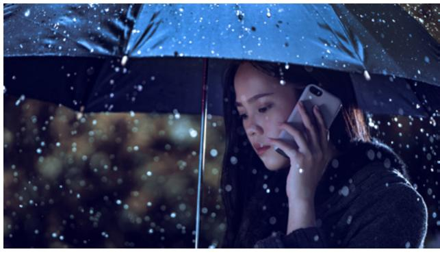

### **ACTIVITY 2: TALKING ABOUT THE WEATHER**

A. Read. Listen to the examples, and repeat them aloud.

- 1. How's the weather?
- 2. What will the weather be tomorrow?

6. It's snowing. It's snowy. 3. It's raining. It's rainy.

7. Will it snow tomorrow? 4. Will it rain tomorrow?

8. I think it will. 5. Yes, it will.

9. It's windy.

10. Will it be windy tomorrow?

11. I'm not sure.

12. It's foggy.

13. Will it be foggy tomorrow?

14. No, it won't.

### B. Look at the pictures. Finish the sentences.

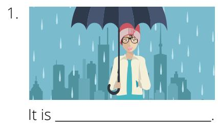

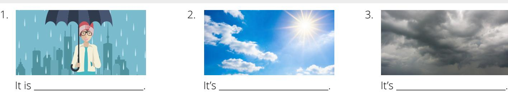

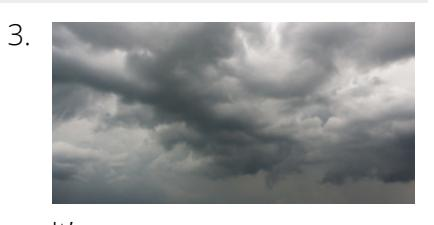

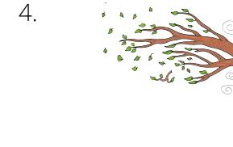

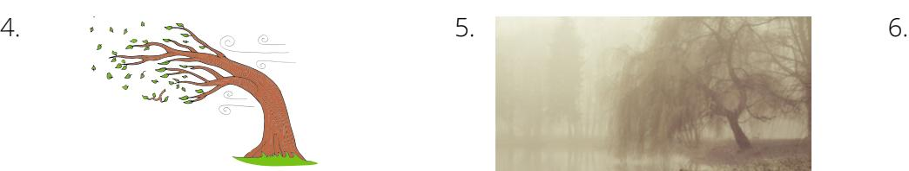

It's . It's . It's .

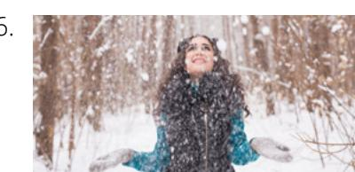

### C. Look at the pictures. Say a sentence about the weather. Listen to the examples.

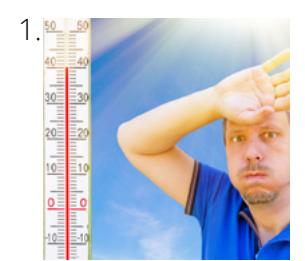

1. 2. 3. 4. 5.

### **ACTIVITY 3: WEATHER FORECAST**

A. Look at the picture. Listen to the speaker talk about the weather for the week. Answer the questions.

| 1. Sunday will be a. cool b. hot c. cloudy  2. Tuesday will be a. cloudy b. rainy c. sunny | <ul> <li>3. Thursday will be</li> <li>a. sunny</li> <li>b. windy</li> <li>c. foggy</li> </ul> 4. Friday there will be <ul> <li>a. fog</li> <li>b. snow</li> <li>c. lightning</li> </ul> |
|--------------------------------------------------------------------------------------------|-----------------------------------------------------------------------------------------------------------------------------------------------------------------------------------------|
| B. Read the sentences alou                                                                 | d. Listen to 1–4.                                                                                                                                                                       |
| 1 Consider will be a consider                                                              |                                                                                                                                                                                         |

| Som            | e City                |                       |                       | +                     | 2  |
|----------------|-----------------------|-----------------------|-----------------------|-----------------------|----|
| Mond           | ay                    |                       | MA                    | +                     | 6  |
| 50% East,      | 20 km/h hPa        |                       |                       |                       |    |
| 0 1010         |                       |                       |                       |                       |    |
| ш              |                       |                       |                       |                       |    |
| CLIN           | MON                   |                       | AVED.                 | 3,17                  | 16 |
| 32 °C 90 °F | MON 19 °C 66 °F | TUE 19 °C 66 °F | WED 15 °C 59 °F | THU 10 °C 50 °F | 4  |
|                |                       |                       |                       |                       |    |

- 1. Sunday will be sunny.
- 2. Wednesday will be rainy.
- 3. Friday there will be thunder.
- 4. Saturday will be sunny and warm.

| <u> </u> | write three sentences about the weather. |
|----------|------------------------------------------|
| 1.       |                                          |
| 2        |                                          |

C Write three sentences about the weather

D. Look at the picture. Answer the questions aloud. Listen to the examples.

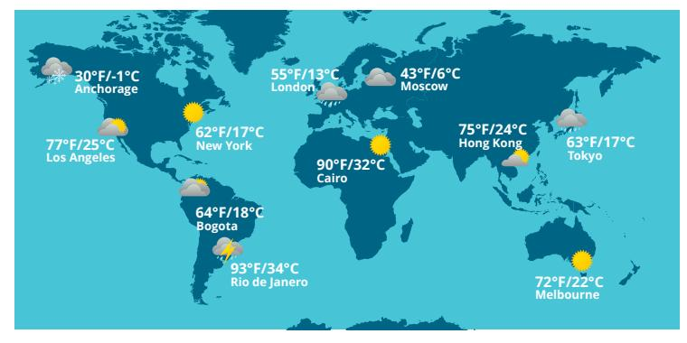

- 1. How's the weather in Moscow?
- 2. How's the weather in Cairo?
- 3. How's the weather in Rio de Janeiro?
- 4. How's the weather in Anchorage?
- 5. How's the weather in Tokyo?
- 6. How's the weather in Melbourne?

E. Listen to the weather forecast. Answer the questions. You may listen more than once.

| Part 1                                         | Part 2                                  |
|------------------------------------------------|-----------------------------------------|
| 1. What will the weather be today?             | 3. What will the weather be on Sunday?  |
| and                                            |                                         |
| 2. Which days will have thunder and lightning? | 4. What will the weather be on Tuesday? |
| and                                            | and                                     |
| F. Listen to 1–4. Write what you hear.         |                                         |
| 1                                              | 3                                       |
| 2                                              | 4                                       |

A. Listen to the story. B. Read aloud.

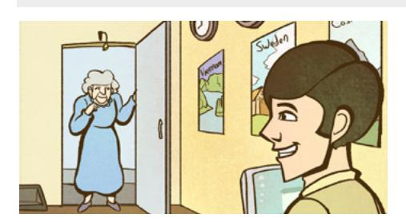

"Hello," says an old woman. "I want to go on vacation."

"That's great!" says the man. "Where do you want to go?"

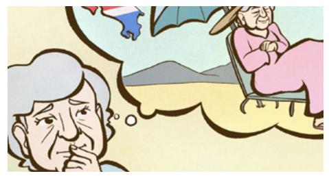

"I don't know," she says. "Somewhere sunny."

"Hmm. What about Costa Rica?"

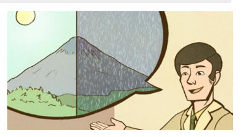

"How's the weather in Costa Rica?" she asks.

"It's sunny, but it's also rainy," the man replies.

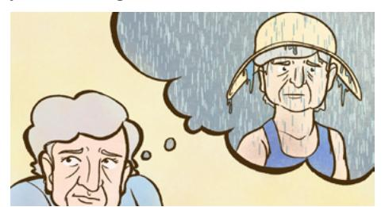

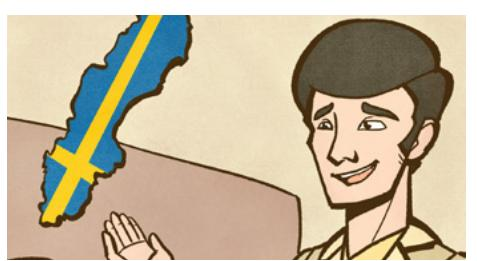

"Oh. I don't like rain," says the woman. "What about Sweden?" asks the man. "How's the weather in Sweden?"

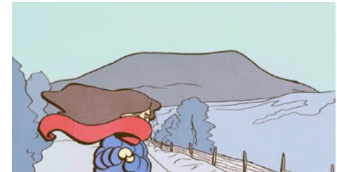

"It's sunny but windy and cold," he says. "I don't like cold weather," she replies.

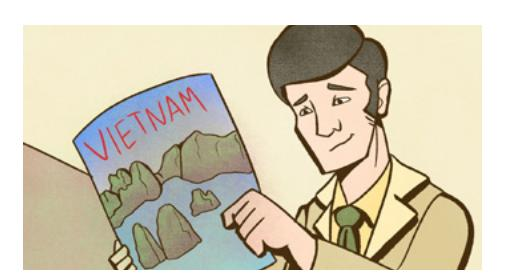

"What about Vietnam? It's beautiful there." "What is the weather like in Vietnam?" she asks.

"It's sunny but hot. It's also very humid." "I don't want to be hot," she says.

"Hmmm," says the old woman. "I've changed my mind. I think I will just stay here."

### **PRACTICE PARTNER INSTRUCTIONS**

- A. Help your practice partner review the vocabulary for this lesson in the back of this book. Make sure they understand the meaning of the vocabulary.
- B. Help your practice partner say the sentences in Activity 2A. Help them make sentences for the pictures in Activity 2C.
- C. Look at the weather map in Activity 3A. Ask your practice partner questions about the weather. For example, you might ask, "What will the weather be on ?" Then look at the map in Activity 3D. Take turns asking questions about the weather. If possible, look at a current forecast for your area or your hometowns and take turns asking questions. "What will the weather be today?" "What about tomorrow?" What about next week? Tell what the weather is like during different months of the year.
- D. Ask your practice partner to read the story "Vacation Plans" aloud. Ask them questions about the story. Where did the woman want to go? What doesn't the woman like? What is the weather like in Vietnam? Where did the woman choose to go?

Talk about places you want to go on vacation. Why do you want to go there? What is the weather like there? What do you do there?

### **EXPANSION ACTIVITIES: CALMING THE STORM**

- 1. Learn the vocabulary: disciples, blow, blowing, command, sink (verb), calm
- 2. Listen. 3. Read aloud.

Matthew 8:23–27

Jesus and His disciples Jesus was asleep. were in a boat on the Sea of Galilee.

The wind blew very hard. The waves filled the boat with water.

The disciples were afraid. They woke Jesus. They asked Him to help.

Jesus commanded the wind to stop blowing. He told the waves to go down.

The wind stopped. The sea became calm.

Jesus asked the disciples why they were afraid. He said they should have more faith.

They were amazed that Jesus could command the wind and the sea.

- 4. Learn the vocabulary: peace, troubled, overcome, adversity, storm, stronger.
- 5. Read aloud. Then listen.

*"Peace I leave with you, my peace I give unto you . . . Let not your heart be troubled, neither let it be afraid"* (John 14:27).

> "As you **overcome adversity** in your life, you will become **stronger**" (Joseph B. Wirthlin, "Finding a Safe Harbor," *Ensign,* May 2000, 61).

- 6. Ponder: How can Jesus Christ help you during the **storms** in your life?
- 7. Write three ways that Jesus Christ can help you during difficult times in your life.
- 8. Speak: Tell three people how Jesus Christ helps you during difficult times in your life.

### **ENGLISHCONNECT 1 LESSON 14: JOBS AND CAREERS**

### **CONVERSATIONS: WHAT DO YOU DO FOR WORK?**

A. Listen. B. Listen and repeat. C. Write the missing word. D. Read aloud.

- 1. So, Carla, what do you do for ?
- 2. I'm a .
- 3. Oh, ? Do you like being a teacher?
- 4. Yes, I love it! It's rewarding.

job work very too teacher really doctor

### Conversation 1 Conversation 2

- 1. Guess ? I got a new .
- 2. Wow, that's great! do you work now?
- 3. I work at the on Main Street.

shop work job restaurant what where when

### **ACTIVITY 2: WHAT DO YOU DO FOR WORK?**

A. Read and listen to the examples 1–9. Repeat aloud.

- 1. What do you do for work?
- 2. I am a nurse.
- 3. I have my own business.
- 4. What does he do for work?
- 5. He is a mechanic.

- 6. Where do you work?
- 7. I work at a factory.
- 8. Where does she work?
- 9. She works at a restaurant.

B. Look at the pictures. Say what each person does for work. Listen to the examples.

**What does he do for work?** He is a nurse.

I am a flight attendant.

2.

He is a mechanic.

She is a factory worker.

I have my own business.

They are fishermen.

D. Read the conversation. Choose the person that works in that place.

1. Where do you work?

I work at a restaurant.

2. Where do you work? I work at a school.

- b. b. b. b.
- 3. Where does he work? He works in a hospital.

4. Where does she work? She works in an office.

E. Listen to each conversation. Read the sentences. Answer true or false.

- 1. Alicia is a teacher.
  - a. True
  - b. False
- 2. Alicia does not like her job.
  - a. True
  - b. False

- 3. Nimra works in a factory.
  - a. True
  - b. False
- 4. Nimra likes to help people.
  - a. True
  - b. False

- 5. Li Wei works in an office.
  - a. True
  - b. False
- 6. Li Wei works a lot of hours.
  - a. True
  - b. False

F. Write three sentences about what you do for work. If you do not have a job, write about any job.

### **ACTIVITY 3: ALFONSO'S BIG TIP**

A. Listen to the story. B. Read the story aloud. C. Listen to the questions. Answer aloud.

Alfonso lives in the city. He rides the train to work.

"Hurry! The train leaves soon," says Mac.

"Thanks for the tip!" says Alfonso.

He gets off the train. A taxi driver says, "Watch out! It's wet!" "Thanks for the tip!" Alfonso says.

Alfonso is a carpenter. "Today you will build a wood floor," says his boss.

"The lady is angry," says his boss. "Smile and be nice." "Thanks for the tip," says Alfonso.

Alfonso smiles a lot. He smiles at the angry lady. She doesn't smile.

Every day Alfonso and his friend, Luis, work hard on the floor. Alfonso smiles. The angry lady starts to smile.

They eat lunch. They laugh. They smile. The angry lady smiles too.

Alfonso says, "It's done." "Thank you. It's beautiful," says the lady. "You work hard. And you make me smile."

She gives them an envelope. "Here's a tip for you," she says. She smiles.

Alfonso and Luis get on the train. They look in the envelope. They count the money. One thousand dollars! It's a very big tip!

They laugh and laugh. "Keep smiling, Alfonso!" says Luis.

### **PRACTICE PARTNER INSTRUCTIONS**

- A. Help your practice partner review the vocabulary for this lesson in the back of this book. Make sure they understand the meaning of the vocabulary. Have him or her retell the story in Activity 3 in their own words.
- B. Look at the pictures in Activity 2B. Ask your practice partner what each person does for work. Help them answer in complete sentences. Look at the pictures in Activity 2D. Help them ask questions about what each person does for work.
- C. Ask your partner questions about the pictures. For example, ask: What does he/she do for work? When does he/she eat lunch? Help them talk about a friend or family member's work and schedule.

D. Ask your practice partner about their job or their dream job. Help them speak in complete sentences. Tell them about your job or your dream job.

### **EXPANSION ACTIVITIES: SELLING BANANAS**

- 1. Learn the vocabulary: passport, bananas, earn, strength, save (saving)
- 2. Listen. 3. Read aloud.

My name is Sedrick. I live in Africa. I'm a member of The Church of Jesus Christ of Latter-day Saints.

I am preparing to go on a mission. I need a passport. A passport costs US\$250.

My father and I buy bananas to earn money. Some villages grow a lot of bananas. The villages are many miles away.

We go there and buy bananas. Then we bring them back to sell.

We use a bicycle to go to the villages. We can take four or six bunches of bananas at a time.

It takes 1½ hours each way on my bike—that is, if the bike is working and I have the strength.

It gets very hot during the day. We move slowly because of the heat and the sun. I wake up very early in the morning. I do two trips per day.

It is a good way to pay for my passport. Now I'm earning money, little by little. I'm saving for both school expenses and a mission.

I have worked for four years. I have enough money for my passport and another \$70 saved.

- 4. Learn the vocabulary: glory, always, necessity, economic, curse, blessing.
- 5. Read aloud. Then listen.

*"For behold, this is my work and my glory--to bring to pass the immortality and eternal life of man"* (Moses 1:39). "Work is not a **curse** but a **blessing**" (David E. Sorenson, "The Blessing of Work," [Brigham Young University devotional address, Mar. 6, 2005], 2, speeches.byu.edu).

.

- 6. Ponder: How is work a blessing?
- 7. Write. Finish the sentence. Work is a blessing because
- 8. Speak: Talk about how work is a blessing for you.

### **ENGLISHCONNECT 1 LESSON 15: JOBS AND CAREERS**

### **CONVERSATION: I'M LOOKING FOR A NEW JOB**

| A. Listen.                            |                      | B. Listen and repeat. C. Write the missing word. |  | D. Read aloud. |
|---------------------------------------|----------------------|--------------------------------------------------|--|----------------|
| 1. Hey, James, I'm                    |                      | for a new job.                                   |  |                |
| 2. Really, Lan?                       | ?                    |                                                  |  |                |
| 3. Well, my job is only               |                      | , and I                                          |  |                |
| don't really like it.                 |                      |                                                  |  |                |
| 4. Why not? What do                   |                      | at work?                                         |  |                |
| 5. It's                               | . Every day I        | the same                                         |  |                |
| building and                          | the same people.     |                                                  |  |                |
| 6. What about you? Tell me about your |                      |                                                  |  |                |
| 7. I'm a                              | , and I like my job. |                                                  |  |                |
| 8. I like to                          | hair and             | new people.                                      |  |                |
| 9. That's great!                      |                      |                                                  |  |                |

meet Why hairstylist you do people see clean job boring part-time looking cut

### E. Read the sentence. Answer true or false.

- 1. Lan is happy about her job.
  - a. True b. False

- 2. Lan works full-time.
  - a. True
  - b. False
- 3. James likes his job.
  - a. True
  - b. False
- 4. James cleans buildings.
  - a. True
  - b. False

### **ACTIVITY 2: TALKING ABOUT JOBS**

### A. Listen. Write what you hear.

3.

### B. Look at the picture. Say what you do every day for this job. Listen to the examples.

- 1. I work full-time in a school. I teach students every day. It is difficult, but I like it.

3. I work part-time in a restaurant. I serve food to customers. It is difficult but fun.

2. I am self-employed. I write computer programs. Sometimes it's boring.

- 4. I work part-time at a store. I help customers all day. It's interesting.
- a. b. a. b.

D. Choose the correct question for the answer. Say the question aloud.

- 1. She programs computers.
- a. What does she do for work?
- b. Does she like her job?
- c. Does she work full-time or part-time?

- 2. Yes, he loves teaching.
- a. What does he do for work?
- b. Does he like his job?
- c. Where does he work?

- 3. My job is part-time.
- a. What do you do for work?
- b. Do you like your job?
- c. Do you work full-time or part-time?
- E. Choose one of the pictures. Write about the person's job. Answer the questions.

journalist mechanic salesperson

construction worker server computer programmer

 What is the person's job? Where does the person work? Does the person like his or her job? What time does the person go to work? What time does the person leave work?

What does the person do for work? Does the person work part-time or full time?

A. Listen. B. Read aloud. C. Listen to questions 1–3. Answer aloud.

My grandfather is a very interesting person. He is a full-time accountant. He works at a factory.

He doesn't like his job very much. It's boring. He likes to build things.

I love to visit Grandfather. His house is very small.

My grandfather is not a carpenter. He is not an electrician. But he built two bedrooms.

He is not a painter. But he painted the bedrooms yellow.

Grandfather likes to grow food. He is not a farmer. But he grows corn and potatoes.

He is not a fisherman. But he loves to fish because fishing is relaxing.

He is not a cook. But he cooks fish very well.

When I visit Grandfather, I sleep in a yellow bedroom. I eat potatoes and corn. I go fishing. I love Grandfather's house!

### **PRACTICE PARTNER INSTRUCTIONS**

- A. Help your practice partner review the vocabulary for this lesson in the back of this book. Make sure they understand the meaning of the vocabulary.
- B. Have him or her retell the story in Activity 3 in their own words. Ask him or her to tell you about a friend or family member who can do many things. What is the person's name? What can they do?
- C. Help your practice partner answer the questions for three of the pictures in Activity 2E.
- D. Ask your practice partner to pretend that he or she is the person in each of the pictures below. Help them say two or three sentences to describe their job.

hairstylist salesperson doctor construction worker mail carrier

### **EXPANSION ACTIVITIES: LABORERS IN THE VINEYARD**

- 1. Learn the vocabulary: vineyard, hire(s), pay (paid), generous, too late
- 2. Listen. 3. Read aloud.

Jesus tells a story about a man. The man needs people to work in his vineyard.

He hires some workers at 6:00 in the morning. They agree to work for a penny.

They are happy to work. They need money to feed their families.

Matthew 20:1–16

Later, the man needs more people. He hires more people at 9:00 a.m.

He hires people at 12:00 p.m. and 3:00 p.m.

Finally, it is the end of the day. He hires one last group of workers at 5:00 p.m.

They, too, are happy to work. They need to feed their families too.

At the end of the day, each worker gets paid. They all get the same pay. They all get one penny.

The workers who started at 6:00 a.m. are angry.

They ask, "Why do we get the same pay as the other workers? They started later than us."

The man says, "I am not being unfair to you. I can be generous with my own money. I choose to be kind to everyone."

The man is like God. He wants to bless all of His children. We are never too late to come to Him.

- 4. Learn the vocabulary: heavy laden, mistakes, beyond the reach, divine love
- 5. Read aloud. Then listen.

*"Come unto me [Jesus Christ], all ye that labour and are heavy laden, and I will give you rest"*  (Matthew 11:28).

"However many **mistakes** you feel you have made . . . you have *not* traveled **beyond the reach** of **divine love**" (Jeffery R. Holland, "The Laborers in the Vineyard," *Ensign* or *Liahona,* May 2012, 33).

- 6. Ponder: What do you need to do to come unto Jesus Christ now?
- 7. Write two things you learned from the story.
- 8. Speak: Retell this story to three people. Tell what you learned.

### **ENGLISHCONNECT 1 LESSON 16: FOOD**

### **CONVERSATION: WHAT DO YOU WANT FOR LUNCH?**

A. Listen. B. Listen and repeat. C. Write the missing word. D. Read aloud.

1. Ha-Eun, what do you want for ?

2. Do you want some ?

3. No, thanks, Marcia. I don't really fish.

4. Really? My food is fish! Why don't you like it?

5. I don't like the .

6. I usually eat for lunch.

7. Oh, we have chicken too, and chicken is .

8. Let's chicken.

9. Sounds good!

E. Read the questions about the conversation. Answer aloud. Listen to the answers.

1. Does Ha-Eun like fish? 2. Why or why not? 3. What do Ha-Eun and Marcia cook for lunch?

lunch have favorite taste fish chicken healthy like

### **ACTIVITY 2: MY FAVORITE FOODS**

A. Listen to 1–5. Choose the picture that matches.

**ACTIVITY 3: WHAT DO YOU USUALLY EAT?**

A. Look at each picture. Listen to the question. Answer the question aloud. Listen to the examples.

Sarah John Rin Ye-Jun Elena and Paola

### B. Look at each picture. Read the question. Write an answer to the question in a complete sentence.

What do you usually eat for breakfast?

What does he usually eat for lunch? What does she usually eat for dinner?

### **I usually eat eggs for breakfast.**

What do they usually eat for breakfast?

What do you usually eat for dinner? What do you usually eat for lunch?

### **ACTIVITY 4: A MOVIE REVIEW OF** *THE HUNDRED-FOOT JOURNEY*

### A. Listen to the story.

- Madame Mallory sees what Hassan serves. Hassan moves to France.
- The storekeeper has no fish or lamb.
- **1** Hassan lives in India.
- Hassan has an Indian restaurant.
- Madame Mallory doesn't like Indian food.

### B. Number the sentences in the correct order. C. Listen to sentences 1–5. Write what you hear.

| 1. |  |  |  |
|----|--|--|--|
|    |  |  |  |
|    |  |  |  |

- 2.
- 3. 4.
- 5.

### **ACTIVITY 5: WHAT IS YOUR FAVORITE FOOD?**

A. Read each conversation. B. Write your answer to the question in a complete sentence.

Alex: Ricky, what is your favorite food? Ricky: Lamb is my favorite food. Alex: Really? Why do you like it? Ricky: It's a little salty and delicious.

1. What is Ricky's favorite food?

2. Why does he like it?

Marisa: Alexandra, do you like squash?

Alexandra: No, not at all. Marisa: Really? Why not?

Alexandra: It's gross. I don't like the

texture.

3. Does Alexandra like squash?

4. Why or why not?

Pete: Milan, do you like milk?

Milan: Yes, I like it. It's healthy and sweet.

5. Does Milan like milk?

6. Why or why not?

### **ACTIVITY 6: WRITE ABOUT YOUR FAVORITE FOODS**

A. Write about two of your favorite foods. Why are they your favorite?

My favorite food is chicken enchiladas. It is chicken with tortillas, cheese, and green chiles. I like it because Example:

it is salty and spicy.

My other favorite food is squash soup. I like the taste. I like that it is warm when I am cold.

# **PRACTICE PARTNER INSTRUCTIONS**

- A. Help your practice partner review the vocabulary for this lesson in the back of this book. Make sure they understand the meaning of the vocabulary.
- B. Have your practice partner tell you the story in Activity 4. Ask them questions about the pictures. How does the story end?
- C. Look at the pictures in Activity 3A. Help your partner form questions and answers for each picture—for example, "What does Sarah usually eat? Sarah usually eats ham."
- D. Talk about what you usually eat. Ask your practice partner: "What do you usually eat for breakfast? lunch? dinner?" Let them ask you the same questions.
- E. Take turns talking about foods that you like. Ask your practice partner to tell you about their favorite foods. Ask them why they like them. Then let them ask you the same questions.

1. Learn the vocabulary: conquered, youth, obey, decide (decided), servant, healthy, worried, wise

2. Listen. 3. Read aloud.

Daniel 1:3–20

The king of Babylon conquered the Jews and took some of their youth to live in his house.

Four of them were Daniel, Shadrach, Meshach, and Abed-nego.

The king sent food and wine to the youth. Daniel and his friends wanted to obey God. God said that they should not eat this food. It was not good for them.

They decided to not eat the food or drink the wine. They asked the king's servant to bring them healthy food and water instead.

The servant was worried, "The king will be angry," he said. Daniel said, "Give us healthy food for 10 days. And water to drink. We will show that God's way is best."

The servant gave Daniel and his friends healthy food. He gave them water to drink.

After 10 days, Daniel and his friends looked healthier than the other youth.

God blessed Daniel and his friends because they obeyed Him. He made them strong and wise.

- 4. Learn the vocabulary: revealed, physical, benefit, navel, marrow, bones, treasures, weary
- 5. Read aloud. Then listen.

"The Word of Wisdom is a law of health **revealed** by the Lord for our **physical** and spiritual benefit" ("Word of Wisdom," *True to the Faith* [2004], 186; see also Doctrine and Covenants 89).

*"And all saints who remember to keep and do these sayings . . . shall receive health in their navel and marrow to their bones; and shall find wisdom and great treasures of knowledge, even hidden treasures; and shall run and not be weary, and shall walk and not faint"* (Doctrine and Covenants 89:18–20).

- 6. Ponder: What are the blessings of obeying God's law of health, the Word of Wisdom?
- 7. Write a list of blessings that you can receive from obeying the Word of Wisdom.
- 8. Speak: Tell three people about the blessings you can receive from obeying the Word of Wisdom.

### **CONVERSATION: WHERE DO YOU LIKE TO EAT?**

A. Listen. B. Listen and repeat. C. Write the missing word. D. Read aloud.

- 1. Hey, A-Ra, I'm .
- 2. you want to get lunch?
- 3. Sure, Steven. That good.
- 4. Where do you to eat?
- 5. I like to eat at the .
- 6. The are delicious.
- 7. OK. Let's go.

Do sounds sandwiches hungry cafe like

### **ACTIVITY 2: WHERE DO YOU LIKE TO EAT?**

A. Listen to conversations 1–5. Number the correct picture.

- B. Read what you can eat at the restaurants. Choose one. Read and answer the questions aloud. Listen to the examples.
- 1. Where do you like to eat? What do you like to eat there?

The Cafe serves sandwiches and drinks.

The China Grill serves chicken, pork, and rice.

Motcombs serves expensive fish and steak.

Noodles and Company serves many different pastas.

Yoshinoya serves Japanese and American food.

Sherlock Holmes serves soups, salads, and sandwiches.

C. Read. Then choose the correct answer for the questions.

Anoush likes to eat spicy food with beans and rice. She doesn't like to

- eat sandwiches.
- 1. Where does Anoush like to eat?
  - a. Punta Cana
  - b. Subway Sandwiches

Maro likes to sit outside with his friends when he eats. He doesn't like to eat seafood.

- 2. Where does Maro like to eat?
  - a. Cafe Montmartre
  - b. Joe's Crab Shack

Jean likes to eat pizza with his friends. He doesn't like to eat barbecue chicken or pork.

- 3. Where doesn't Jean like to eat?
  - a. Little Italy Pizza
  - b. Dickey's BBQ Pit

| D. Write about your favorite restaurant. What restaurant is it? What do you order there? |  |
|------------------------------------------------------------------------------------------|--|
|------------------------------------------------------------------------------------------|--|

I like to go to Smokie's BBQ near my house. I like to order a meal that has pork, beef, and chicken. It is delicious. Example

### **ACTIVITY 3: I'D LIKE TO ORDER . . .**

A. Look at the pictures. Order the food in the pictures. Listen to examples 1–4.

2.

B. Listen to conversations 1–4. Then write what each person orders.

| 1. | He orders tomato soup. |
|----|------------------------|
|    |                        |

| 3. |  |
|----|--|

4.

### A. Listen to the story.

### B. Check all of the answers that are correct.

□ onions

□ lettuce

☐ ice cream

- 1. What does Ben like to eat?
  - □ cheese □ soup □ beef □ chicken
  - □ bread
  - □ tomatoes
  - □ apple pie

- 2. What does Sandra like to eat?
  - ☐ soup
  - □ beef
  - □ bread
  - □ tomatoes □ apple pie
- □ cheese
- □ chicken □ onions
- □ lettuce

☐ ice cream

### PRACTICE PARTNER INSTRUCTIONS

- Help your practice partner talk about their favorite restaurant. "What is your favorite restaurant?" "Why В. do you like it?" "What do you order there?" "What restaurant don't you like?" "Why don't you like it?"
- C. Ask your practice partner, "How often do you eat in restaurants? Who do you eat out with? What restaurants do you usually go to? What do you order?" Then let them ask you the same questions.
- D. Look at the restaurants below. Take turns asking, "Where do you/don't you like to eat? What do you like to eat there? Why do you/don't you like to eat there?" Ask the same questions about the restaurants in Activity 2B.

Hong's Kitchen serves Chinese food like rice and pork.

Hattie B's serves fried chicken.

Cafe Rouge serves beef and chicken with potatoes.

### **EXPANSION ACTIVITIES: SEA BISCUIT MIRACLE**

- 1. Learn the vocabulary: widow, handcart, sea biscuit, trunk, lid, miracle, enough
- 2. Listen. 3. Read aloud.

In 1856, Anne Rowley came to Utah by handcart. Anne was a widow. She had her seven children with her.

The journey was very difficult. One night, the family had no food to eat.

Anne said, "I got on my knees to pray. I asked for God's help."

She remembered two hard sea biscuits. They were in her trunk. They were small and too hard to eat. It wasn't enough for 8 people.

She thought, "Jesus fed 5,000 people. He only had 5 loaves of bread and 2 fish. Nothing is impossible with God's help."

She put the biscuits in a pot. She covered them with water. She put the lid on the pot. She put the pot on the fire to cook.

She prayed and asked God to bless them.

Later, she lifted the lid. The pot was filled with food. It was a miracle!

Anne knelt down with her family. They thanked God for His goodness. That night the family had enough to eat.

- 4. Learn the vocabulary: faith, precedes, miracle, among
- 5. Read aloud. Then listen. "**Faith precedes** the miracle" (Thomas S. Monson, in "Faith Precedes the Miracle" [video], ChurchofJesusChrist.org). *"For if there be no faith among the children of men God can do no miracle among them; wherefore, he showed not himself until after their faith"* (Ether 12:12).
- 6. Ponder: Why does **faith** come before **miracles**? Why don't **miracles** happen each time you need one?
- 7. Write about a miracle in your life. Write as much as you can.

8. Speak: Tell three people about a miracle in your life.

### **ENGLISHCONNECT 1 LESSON 18: FOOD**

### **CONVERSATION: HOW DO YOU MAKE THAT?**

| A. Listen. | B. Listen and repeat.     | C. Write the missing word. | D. Read aloud. |
|------------|---------------------------|----------------------------|----------------|
| 1. This    | is so delicious, Camille! |                            |                |

2. How do you it?

3. It's easy! , you put some cheese on bread.

4. Next, you put some in a pan.

5. Then, you the pan on the stove.

6. , you cook the for five minutes.

7. Thanks! I'll it!

Then try make oil First heat bread sandwich Last

## **ACTIVITY 2: SEQUENCE AND DIRECTIONS**

A. Study the chart. B. Listen to sentences 1–5, and repeat.

|                                     |       | Sequence and Directions           |                                                                                                              |
|-------------------------------------|-------|-----------------------------------|--------------------------------------------------------------------------------------------------------------|
| First, Then,* Next,* Last, | you** | cut put put heat cook | some cheese. the cheese on bread. some oil in a pan. the pan on the stove. the bread in the pan. |

\*&quot;Next" and "Then" are interchangeable.

### C. Look at the pictures. Listen to the steps for making chicken soup. Say them out loud.

D. Your friend wants to make chicken soup. Write some steps for your friend to make chicken soup.

- 1. First, cut the .
- 2. Next, chop the , , and .
- 3. Then, the chicken.

- 4. Next, add the .
- 5. Then, everything together.
- 6. Last, for 30 minutes.

\*\*In recipes, "you" is not usually used.

### A. Listen to the conversations. Then answer the questions.

1. Which ingredient is *not* in the soup? 2. Which ingredient is *not* in the dinner?

B. Talk about a food you like. What is it? What's in it? Listen to the example. C. Write about it.

Example: Pupusas

What is it? What's in it?

D. Listen to the directions. Read the sentences. Write the missing word.

1. , you cook in the microwave for 5 minutes.

2. , you break 2 eggs into a microwave-safe bowl.

3. , you stir the mixture.

4. , you mix the eggs with the cake mix.

First Next Then

Last

E. Read the recipe. Then read the sentences. Answer true or false.

### **Almond Candy**

2 cups sugar 1/2 cup water

2 cups butter 2 cups chopped almonds

First, put sugar, butter and water in a pan. Then, boil and stir. Next add almonds. Cook until the mixture begins to smoke. Then, take it off the stove. Next, pour mixture into an oiled pan. Last, break candy into pieces.

- 1. Cook the almonds in the pan first.
  - a. True
  - b. False
- 3. Add the almonds after the candy is cool.
  - a. True
  - b. False
- 2. Stir and boil the sugar, butter, and water.
  - a. True
  - b. False
- 4. Break the candy into pieces.
  - a. True
  - b. False

F. Think about your favorite food to make or eat. Write the ingredients and steps below.

Name: Ingredients: Steps: 

Example

**Name**: Alaskan Ice Cream

**Ingredients**: 1 cup sugar, 3 cups frozen animal fat, 4 cups frozen berries

**Steps**: First, mash the fat. Then stir the fat until fluffy. Next, add the sugar until well-mixed. Last, stir in the berries.

### **ACTIVITY 4: STRAWBERRY CAKE**

A. Listen to the story.

- B. Read and listen to questions 1–3 . Answer aloud. Listen to the example answers.
- 1. Why does SuMin write Anna? 2. What was SuMin's favorite part of the meal? 3. What will SuMin do with the recipe?

| C. Listen to sentences 1–5. Write what you hear. |  |
|--------------------------------------------------|--|
|                                                  |  |

| 1. | 4. |
|----|----|
| 2. | 5. |

3.

### **PRACTICE PARTNER INSTRUCTIONS**

- A. Help your practice partner review the vocabulary for this lesson in the back of this book. Make sure they understand the meaning of the vocabulary. Have your practice partner use the pictures in Activity 4 to retell the story.
- B. Look at the pictures in Activity 2C. Ask your practice partner, "How do you make chicken soup?"
- C. Talk about your favorite foods. Ask, "What is your favorite food? When do you eat it? What's in it? How do you make it?" Then let your practice partner ask you the same questions.
- D. Activity 3 talks about six different foods. Ask your practice partner to choose which one they would like to try. Why would they choose it? What's in it? How do you make it? Then ask them to choose one they would NOT like to try. Why not? Now have your practice partner ask you the same questions.

Corn chowder Briyani Pupusas Cake Almond

candy

Alaskan ice cream

### **EXPANSION ACTIVITIES: MAKING BREAD**

- 1. Learn the vocabulary: widow, education, master's degree, car accident
- 2. Listen. 3. Read aloud.

It is 1932. Virginia Cutler is a widow. She has two young boys. She goes to work as a teacher.

Education is important to her. She wants her boys to have a good education. But it is expensive.

She is working on a master's degree. It is very hard. Her boys get sick. She is in a car accident.

But she finishes. She gets her degree.

She works hard to make a happy home for her boys. She teaches them family values. She teaches them to work hard.

She teaches them to make bread. Every Saturday morning they make bread.

Each boy makes his own loaf. The smell of bread brings friends to their house. They share the bread.

The boys grow up. One is a doctor. One works for the government.

Now they make bread with their children. But it is more than just making bread, isn't it?

- 4. Learn the vocabulary: succesful, established, maintained, principles, forgiveness, compassion, wholesome, recreational
- 5. Read aloud. Then listen.

"**Successful** marriages and families are **established** and **maintained** on **principles** of faith, prayer, repentance, **forgiveness**, respect, love, **compassion**, work, and **wholesome recreational** activities" ("The Family: A Proclamation to the World," ChurchofJesusChrist.org).

- 6. Ponder: Which of the principles in the quote do you need to work on?
- 7. Write: What are you going to do this week to work on one of the principles?
- 8. Speak: Tell three people what you are going to do this week to work on the principle you chose.

### **ENGLISHCONNECT 1 LESSON 19: MONEY**

### **CONVERSATION: HOW MUCH DO THOSE COST?**

A. Listen. B. Listen and repeat. C. Write the missing word. D. Read aloud.

1. Excuse me, I'd like to some pants.

2. How much do those blue pants ?

3. dollars.

4. Fifty dollars?! I pants, but those are too for me.

How much do the red pants cost?

5. .

6. OK, great! I'd like to buy .

 cost buy Fifty use need expensive those cheap Twenty-five

### **ACTIVITY 2: PRICES**

A. Study the chart. B. Listen to 1–4, and repeat.

| Asking about Prices                                                         |                                                |
|-----------------------------------------------------------------------------|------------------------------------------------|
| Question                                                                    | Answer                                         |
| 1. How much is this shirt?                                               | \$12. It's \$12.                            |
| 2. How much are those shoes?                                             | \$25. They're \$25.                         |
| 3. How much does the car cost?                                           | \$9,000. It's \$9,000. It costs \$9,000. |
| 4. How much do the apples cost?                                          | \$4. They're \$4. They cost \$4.         |
| For singular (1): use is, does, it's. For plural (2+): use are, do, they're |                                                |

C. Look at each picture. Say aloud what it is and how much it costs. Listen.

1. skirt \$14

2. tie \$21

3. shoes \$45

4. phone \$140

5. table \$399

6. apple \$1

 D. Look at the picture. Write what the item is on the line. Ask aloud how much the item costs. Listen to the examples. Decide if you'd like to buy the item.

1. a. I'd like to buy them. b. I don't need those.

2. a. I'd like to buy it. b. I don't need it.

3. a. I'd like to buy it. b. I don't need it.

4. a. I'd like to buy them. b. I don't need them.

E. Look at each picture. Read the price. Write a question to ask for the price.

Example:

 **How much does the chicken cost?** or **How much is the chicken?**

Answer: It's \$7.

1. Answer: It's \$4. 3. Answer: It's \$4. strawberries 2. Answer: They're \$5. fish 4. Answer: They're \$5. watermelon beans

### **ACTIVITY 3: I'D LIKE TO BUY IT**

A. Listen to the conversation. Then answer the question that follows.

- 1. Does Kate buy the sweater?
- a. Yes, because it's cheap.
- b. Yes, because it's pretty.
- c. No, because she doesn't like it.
- d. No, because it's expensive.

- 2. Does Emir buy the phone?
- a. Yes, because it's a good price.
- b. Yes, because he needs it.
- c. No, because it's expensive.
- d. No, because it's not new.

- 3. What does Claudia buy?
- a. 1 pound of potatoes
- b. 2 pounds of potatoes
- c. 8 pounds of potatoes
- d. 10 pounds of potatoes
- B. Look at the pictures and prices below. Say the one you want to buy and why, *or* say that you don't want to buy one of them and why. Listen to the examples.

1. blue hat: \$15 red hat \$12

2. blue pajamas: \$43 green pajamas \$23

3. purple shoes: \$50 black shoes: \$17

4. black bike: \$1,100 blue bike \$148

### **ACTIVITY 4: A BIRTHDAY SURPRISE**

A. Listen to the story. Finish the sentences.

The lemon cake is . She loves . It's my birthday!

B. What things did the friend buy for Sarah's birthday? Write a list.

| 1. |              |         |            |       |                |  |
|----|--------------|---------|------------|-------|----------------|--|
| 2. | rice         | chicken | pork       | dress | old book       |  |
| 3. | popular book |         | lemon cake |       | chocolate cake |  |
| 4. |              |         |            |       |                |  |
|    |              |         |            |       |                |  |

### **PRACTICE PARTNER INSTRUCTIONS**

- A. Help your practice partner review the vocabulary for this lesson in the back of this book. Make sure they understand the meaning of the vocabulary.
- B. Help them retell the story in Activity 4. Ask questions: "How much is the chicken? How much does the orange dress cost? Why is the book so expensive? How much is the popular book? Is the friend surprised? Why? Have you ever surprised a friend? What did you buy?"
- C. Look at the pictures in Activity 2C, 2D, and 3B. Take turns asking each other how much each item costs. Say whether you would buy it or not.
- D. Imagine you have \$100 to buy things for school. Look at the pictures. Say two things you would like to buy and two things you don't want to buy. Explain why. Ask your partner to do the same thing.

book \$60 computer \$95 pen \$3 alarm clock \$10 batteries \$7 pencils \$4

- 1. Learn the vocabulary: rich, heaven, obey, commandments, poor, follow, give away

One day a rich young man came to see Jesus. He asked Jesus, "What do I need to do to go to heaven?" Jesus told him to obey all the commandments. The rich young man said he always obeyed the commandments.

Jesus told the young man to do one more thing. He said, "Sell everything you have. Give the money to the poor. Then, follow me."

The young man felt sad. He did not want to give away everything he had. He left Jesus. Jesus said it is hard for people who love riches to go to heaven.

Jesus also said we should trust God and love Him more than anything else. Then we can live with Him in heaven.

- 4. Learn the vocabulary: before, riches, seek for, beggars, depend upon, more than
- 5. Read aloud. Then listen.

 *"But before ye seek for riches, seek ye for the kingdom of God"* (Jacob 2:18).

"*For behold, are we not all beggars? Do we not all depend upon . . . God . . . for all the riches which we have of every kind?"* (Mosiah 4:19).

- 6. Ponder: How can you increase your love for God?
- 7. Write a list of five things you can do to increase your love for God.
- 8. Speak: Talk about how you can learn to love God more than anything else.

### **ENGLISHCONNECT 1 LESSON 20: HOME**

### **CONVERSATION: WHERE DO YOU LIVE?**

| A. Listen. | B. Listen and repeat. C. Write the missing word. | D. Read aloud. |
|------------|--------------------------------------------------|----------------|
|            |                                                  |                |

| 1. do you live? |
|--------------------|
|                    |

2. I in an apartment in New York City.

3. Do you like your ?

4. It's very but it's not very .

5. It only has one .

6. I like the though.

7. Do you have a ?

8. No. Most in New York City don't have a garage.

big live bedroom nice garage Where apartments kitchen apartment

### **ACTIVITY 2: ARTICLES AND PREPOSITIONS**

A. Study the chart. Listen and repeat.

| a and an                    |                                                            |  |  |  |
|-----------------------------|------------------------------------------------------------|--|--|--|
| a: before a consonant sound | a house, a teacher, a dress, a bed             |  |  |  |
| an: before a vowel sound    | apartment, an onion, an egg, an alarm clock an |  |  |  |

### B. Write the missing word.

- 1. I am teacher.
- 3. This is orange.
- 5. I have a question. I have answer.

- 2. We need new table.
- 4. My bed is in bedroom.
- 6. This is beautiful dress.

### C. Read the words. Listen and repeat.

1. next to 2. to the left of 3. to the right of 4. on top of

5. on the bottom of 6. in 7. on 8. above

# **ACTIVITY 3: WHERE IS IT?**

 A. Look at the picture of the house. Write the names of the rooms.

- B. Listen to the question. Choose the correct answer.
- 1. a. the living room
- b. the bedroom
- c. the closet
- 3.
- a. the kitchen
- b. the bathroom
- c. the bedroom
- 5. a. the kitchen

  - b. the laundry room
  - c. the bathroom

- 2. a. the family room
- b. the laundry room
- c. the kitchen
- 4.
- a. the bedroom
- b. the bathroom
- c. the kitchen
- 6.
- a. the kitchen
- b. the bathroom
- c. the family room

### C. Look at the picture. Finish the sentences.

- 1. The is to the left of the kitchen.
- 2. The is in the top right corner.
- 3. A is in the bottom left corner.
- 4. The stairs are close to the .
- D. Look at the picture. Answer the questions aloud, and then listen to the answers.
  - 1. Where is the clock?
  - 2. Where is the bed?
  - 3. Where is the window?
  - 4. Where is the mirror?
  - 5. Where are the pillows?

- E. Read and listen to the questions about your house or apartment. Answer aloud. Listen to the examples.
  - 1. How many bedrooms does your home have ? 4. How many closets do you have?

- 3. How many bathrooms do you have? 6. Do you have a living room?
- 2. Do you have a garage? 5. Is your kitchen big or small?
- F. Write about your home (color, size, rooms). Do you like it? Why or why not?

### **ACTIVITY 4: MOSHE SAFDIE'S AMAZING APARTMENTS**

A. Listen to the story. Finish the sentences.

Do you live in a or an

?

My is too small.

A yard is .

Moshe Safdie is an . He doesn't say, "You need a ." is important.

He built apartment building. They have . The pool is the hotel.

### **PRACTICE PARTNER INSTRUCTIONS**

- A. Help your practice partner review the vocabulary for this lesson in the back of this book. Make sure they understand the meaning of the vocabulary.
- B. Help them retell the story in Activity 4. Ask: "Do you want to live in Moshe's apartment? Why or why not? Do you want to swim in the hotel swimming pool? Why or why not?"
- C. Look at the questions in Activities 3E and 3F. Take turns asking each other questions about your home. Ask as much as you can. For example, ask: "Do you live in a house or an apartment? What color is your home? How old is your home? Do you like the floor plan?"
- D. Look at the floor plan in Activity 3A. Ask your partner questions about the floor plan. For example, ask: "Where is the kitchen?"
- E. Both you and your practice partner label a floor plan for your dream house or apartment. Don't look at your partner's floor plan. Describe your floor plan to your partner. Your partner should draw your floor plan as you describe it. Now try to draw your partner's floor plan as he or she describes it.

### **EXPANSION ACTIVITIES: BOBBIE THE WONDER DOG**

- 1. Learn the vocabulary: vacation, attacked, search, broken heart, cross (verb), damaged, overjoyed
- 2. Listen. 3. Read aloud.

It is 1923. A family from Oregon is on vacation in Indiana. They are 2,500 miles (about 4,000 km) from home.

Their dog, Bobbie, is attacked by other dogs. He runs away. The family searches everywhere for Bobbie. They can't find him.

They go home to Oregon with broken hearts.

For six months, Bobbie tries to get home. He walks and walks.

He swims across rivers. He crosses mountains. He runs through snow.

Many people feed Bobbie. Some give him a place to sleep. A woman takes care of his feet.

Finally, Bobbie arrives home. He is dirty and thin. His feet are badly damaged.

The family is surprised and Bobbie just wanted to go home. overjoyed to see him. The newspaper calls him Bobbie the Wonder Dog.

- 4. Learn the vocabulary: choices, choose, return, lose, point, degree, sacrifice, longing
- 5. Read aloud. Then listen.

"The greatest of all **choices** [God's children] may make is to **choose** to **return** to Him" (Russell M. Nelson, "Begin with the End in Mind" [address given at a seminar for new mission leaders, June 2014]).

- 6. Ponder: Do you ever feel a **longing** for your heavenly home? If so, why?
- 7. Write some things you can do that will help you return home to God.
- 8. Speak: Talk about how Bobbie's story is like trying to return home to God.

### **ENGLISHCONNECT 1 LESSON 21: HOME**

### **CONVERSATION: I'M GLAD YOU'RE VISITING**

| A. Listen. | B. Listen and repeat. | C. Write the missing word. | D. Read aloud. |
|------------|-----------------------|----------------------------|----------------|
|            |                       |                            |                |

- 1. This is the .
- 2. There are extra and in the closet if you need them.
- 3. There's the .
- 4. towels in the cupboard.
- 5. This is !

soap under the sink.

6. I'm glad you're !

|  | bedroom | wonderful | pillows | There is | visiting | blankets | bathroom | There are |
|--|---------|-----------|---------|----------|----------|----------|----------|-----------|
|--|---------|-----------|---------|----------|----------|----------|----------|-----------|

### E. Answer the questions.

- 1. What is in the closet?
  - a. extra pillows
  - b. extra towels
  - c. extra soap

- 2. Which room is small?
  - a. the kitchen
  - b. the bedroom
  - c. the bathroom
- 3. What is in the cupboard?
  - a. towels
  - b. soap
  - c. blankets

### **ACTIVITY 2: THERE IS/THERE ARE**

### A. Study the chart.

|          | There is + (singular noun) + | (place) .       |
|----------|------------------------------|-----------------|
| There is | a mirror                     | above the sink. |
| There is | a closet                     | in the bedroom. |

|           | There are + (plural noun) + | (place) .        |
|-----------|-----------------------------|------------------|
| There are | two pillows                 | on the bed.      |
| There are | towels                      | in the bathroom. |

### B. Read the sentence. Listen and repeat.

1. There is a mirror above the sink.

2. There is a closet in the bedroom.

3. There are two pillows on the bed.

4. There are towels in the bathroom.

# C. Write the missing word. Say the sentence aloud.

- 1. There a shower in the bathroom.
- 2. There nightstands in the bedroom.
- 3. There lamps on the nightstands.

- 4. There a closet in the bathroom.
- 5. There drawers in the cupboard.
- 6. There a sink in the bathroom.

D. Look at the picture of the bedroom below. Talk about what is in the bedroom. Listen to the examples.

E. Look at the picture of the bathroom above. Write 5 sentences about things in the bathroom.

### **ACTIVITY 3: WHERE IS THE . . . ?**

A. Answer the questions aloud. Then listen to the answers.

- 1. Where is the mirror?
- 2. Where is the toilet?
- 3. Where is the sink?
- 4. Is the bathroom tidy or messy?

- 5. Is the bedroom tidy or messy?
- 6. Where is the bed?
- 7. Where are the pillows?
- 8. Where is the closet?

B. Look at the picture. Write an answer for each question. Use a complete sentence.

1. Is the bedroom messy or tidy?

3. Is the bathroom clean or dirty?

5. Is the floor dirty or clean?

2. What is on the bed?

- 4. What is under the window?
- 6. What color is the floor?

C. Look at the pictures. Listen to the descriptions. Choose the bedroom(s) that match the description.

1. a. bedroom A b. bedroom B

c. both bedrooms

2. a. bedroom A b. bedroom B

c. both bedrooms

- 3. a. bedroom A
- b. bedroom B c. both bedrooms
- 4. a. bedroom A
- b. bedroom B c. both bedrooms a. bedroom A b. bedroom B c. both bedrooms

5.

- 6.
- a. bedroom A b. bedroom B
- c. both bedrooms

D. Write about your bedroom. Answer the questions. Use complete sentences.

Is your room big or small? What is in your room (bed, dresser, closet)? Where is the bed? Is there a window? What color is your room? Is your bedroom tidy or messy?

### **PRACTICE PARTNER INSTRUCTIONS**

- A. Help your practice partner review the vocabulary for this lesson in the back of this book. Make sure they understand the meaning of the vocabulary.
- B. Look at the pictures in Activity 2D and 2E. Help your practice partner use *There is* and *There are* sentences to describe both rooms. Ask: "What is in the room? Where is the \_\_\_\_\_\_\_\_\_\_\_\_?"
- C. Look at the pictures in Activity 3C. Help your practice partner describe the rooms. "Where is the bed?" "Is there a clock?" "How many pillows?" "What color is the bed?" "Where is the window?" "What else can you say?"
- D. Talk about a room in your house. Help your practice partner use *There is* and *There are* sentences to describe a room in their house. Ask: "What is in the room? Where is the \_\_\_\_\_\_\_\_\_\_\_\_?"
- E. Take turns asking each other questions about your childhood homes. "What did your bedroom look like?" "Is it big or small?" "Can you describe the bathroom or the kitchen?" Say as much as you can.
- F. Look at the pictures below. Take turns describing one of the rooms. Then guess which room was described.

### **EXPANSION ACTIVITIES: MY BROTHER**

- 1. Learn the vocabulary: hole, fix (verb), carpet
- 2. Listen. 3. Read aloud.

In 1951, Thomas Monson is a bishop in the Church. A man says, "My brother and his family are coming from Germany. His name is Mr. Gertler. Will you look at their apartment?" "Yes," says Bishop Monson.

Bishop Monson looks at the apartment. The kitchen is old. The stove is bad. The cupboards are empty. The living room light is bad. The paint is dirty. The floor has a hole in it.

There are no blankets or pillows in the bedroom. It is a sad apartment."It is not much," says the man. "But it is better than nothing." That night Bishop Monson can't sleep.

On Sunday he goes to church. Someone says, "Why are you sad?" Bishop Monson talks about the apartment. "I can fix the bad light," says one man.

"We can paint the apartment," says another man. "We can put food in the cupboards," says a woman. "Great!" says Bishop Monson.

Three weeks later, Mr Gertler's family arrives. They go to the apartment. "It is not much," says the brother.

Bishop Monson opens the door. The family sees a beautiful apartment. The stove is new. The cupboards are full of food.

The carpet is soft. The paint is nice. The light is bright. There is a Christmas tree in the living room.

Mr. Gertler has tears in his eyes. "My brother," he says to Bishop Monson. "My brother." They sing a Christmas song. It is the best Christmas ever!

- 4. Learn the vocabulary: hunger, thirsty, serving, take someone in
- 5. Read aloud. Then listen.

And the Savior said:

*"For I was an hungred*, *and ye gave me meat: I was thirsty, and ye gave me drink: I was a stranger, and ye took me in: naked, and ye clothed me: I was sick, and ye visited me"* (Matthew 25:35–36).

.

- 6. Ponder: How does **serving** others bless your life?
- 7. Write how you can help someone this week: This week, I will
- 8. Speak: Retell this story to someone. Tell them how you will help another person this week.

### **ENGLISHCONNECT 1 LESSON 22: COMMUNITY**

### **CONVERSATION: WHERE ARE YOU GOING?**

A. Listen. B. Listen and repeat. C. Write the missing word. D. Read aloud.

| 1. me, I think I'm lost. |  |
|-----------------------------|--|
|-----------------------------|--|

- 2. Can you me?
- 3. Sure. are you going?
- 4. I'm looking for the .
- 5. How do you get ?
- 6. First, walk down to the .
- 7. Then turn .
- 8. The library is the park.

|  | next to there | Excuse | right | corner | Where | help | library |  |
|--|------------------|--------|-------|--------|-------|------|---------|--|
|--|------------------|--------|-------|--------|-------|------|---------|--|

- 1. Where is the library?
  - a. next to the park
  - b. next to the bank
  - c. next to the store
- 2. Where do you turn right?
  - a. at the store
  - b. at the park
  - c. at the corner

# **ACTIVITY 2: DIRECTIONS AND LOCATIONS**

A. Read aloud. Then listen.

1. The house is **across from** the beach. 2. The bridge is **between** the buildings. 3. The house is **behind** the family.

4. The lake is **close to** the house. 5. The river is **in front of** the church. 6. The people are **around** the table.

| Giving Directions |                |                |  |  |  |
|-------------------|----------------|----------------|--|--|--|
| Verb +         | direction word | + location  |  |  |  |
| Go                | south.         |                |  |  |  |
| Turn              | right.         |                |  |  |  |
| Walk              | past           | the church.    |  |  |  |
| Go                | down           | to the corner. |  |  |  |

B. Study the chart. C. Read the sentence. Listen and repeat.

- 1. Go west.
- 2. Walk past the bank.
- 3. Turn left at the corner.
- 4. The church is across from the school.
- 5. The store is on the right side of the street.

### **CITY MAP**

|                                      | Apartment Building                                                                                                                                              | Store | Store                                 | 1                                                      |  |
|--------------------------------------|-----------------------------------------------------------------------------------------------------------------------------------------------------------------|-------|---------------------------------------|--------------------------------------------------------|--|
|                                      | Fourth Street                                                                                                                                                   |       |                                       |                                                        |  |
|                                      | D. Look at the city map. Read the question. Write the answer to the question. Use the word given.                                                               |       |                                       |                                                        |  |
|                                      | 1. Where is the park? (between)                                                                                                                                 |       | 4. Where is the school? (in front of) |                                                        |  |
|                                      | 2. Where is the hospital? (across from)                                                                                                                         |       | 5. Where is the bank? (next to)       |                                                        |  |
|                                      | 3. Where is the store? (behind)                                                                                                                                 |       |                                       |                                                        |  |
|                                      | E. Look at the city map. Listen to conversations 1–4. Choose "true" if the answer is true or "false" if it is false.                                            |       |                                       |                                                        |  |
| 1.                                   | 2.                                                                                                                                                              |       | 3.                                    | 4.                                                     |  |
| a. true                              | a. true                                                                                                                                                         |       | a. true                               | a. true                                                |  |
| b. false                             | b. false                                                                                                                                                        |       | b. false                              | b. false                                               |  |
|                                      | ACTIVITY 3: HOW DO YOU GET TO ?                                                                                                                                 |       |                                       |                                                        |  |
| 1 A. Find                         | on the city map. Start at the airport. Read the dir                                                                                                             |       |                                       | ections to a location. Write the location.             |  |
| the school and the church.           | 1. Go straight on Third Street. Turn left. It is between                                                                                                        |       | next to the bank.                     | 3. Go straight on First Street. It's on the corner and |  |
| the school.                          | 2. Go straight on Fourth Street. Turn right on Second Street. It is in front of the store and across from                                                    |       | airport.                              | 4. Go straight on Third Street. It's north of the      |  |
| 2 B. Find                         | on the city map. Listen to the question. Write the location. Give directions aloud from the apartment building to the location. Listen to a possible answer. |       |                                       |                                                        |  |
| 1. How do you get to the hospital |                                                                                                                                                                 |       | 2. How do you get to                  | 3. How do you get to                                   |  |
| C. Find 3                         | on the city map. You are at the library. Write directions to the place given.                                                                                   |       |                                       |                                                        |  |
| 1. How do I get to the church?       |                                                                                                                                                                 |       | 2. How do I get to the grocery store? |                                                        |  |
|                                      |                                                                                                                                                                 |       |                                       |                                                        |  |
|                                      |                                                                                                                                                                 |       |                                       |                                                        |  |

A. Listen. B. Read aloud.

A man gets off the train. "Excuse me," he asks a taxi driver. "How do I get to the bank?"

"Go two blocks and turn left," says the taxi driver. "Do you like piano music?" asks the driver."Yes, I love piano music," says the man.

"There is a Lang Lang piano concert at the park tonight," says the driver. "It will be great."

"Thanks!" says the man.

He goes to the bank. Then he crosses the street to the bakery. He buys two steamed rolls. "Is there a museum in town?" he asks the baker. "Yes," says the baker.

"Go past the library and turn right. It's across the street from the park. There is a Lang Lang piano concert at the park tonight. It will be great!"

"Thanks," says the man. He eats his rolls. He visits the museum.

He walks to the park. At the park, he sees his new friends.

He walks onto the stage. "I'm happy to He sits at the piano and plays. be here," he says. "The people are so friendly!"

### **PRACTICE PARTNER INSTRUCTIONS**

- A. Help your practice partner review the vocabulary for this lesson in the back of this book. Make sure they understand the meaning of the vocabulary.
- B. Help your practice partner retell the story in Activity 4. Where does the man go? What does the man do? What is happening at the park? Why does he say the people are friendly? What is his name?
- C. Look at the city map on the previous page. Choose a location to start. Take turns asking for directions and giving directions to a location on the map.
- D. Find a local map or draw a simple map of your community. Take turns giving each other directions to a location on the map. For example, give directions to the nearest school. Ask: "How do you get to the nearest grocery store? a church? a park? a friend's house?"
- E. Tell your practice partner to close their eyes. Give them directions to a location in your house. For example, say, "Go straight 10 steps. Turn right. Walk past the sofa. Go down the hall." Then let your partner give directions to you.

- 1. Learn the vocabulary: path, narrow, wrong, backward, footprints, edge, cliff, drowned
- 2. Listen. 3. Read aloud.

George Albert Smith

Late one night, Elder Stout and I were walking to Brother McKinley's home. The path was narrow.

There was a mountain wall on one side. There was a deep river on the other side.

It was very dark. We didn't have a light. We walked slowly. My hand was touching the mountain wall.

I took my hand off the mountain wall for a while. Then I felt something was wrong. I stopped immediately.

I called Elder Stout. He answered me from far away. I was on the wrong path.

I slowly walked backward until I felt the wall again. Then we continued walking. We walked to Brother McKinley's home.

The next morning, we walked back the way we came. I followed my footprints to the edge of a steep cliff.

Just one more step and I would have fallen in the river. I would have drowned.

President George Albert Smith

I almost died. I was grateful to my Heavenly Father for protecting me.

- 4. Learn the vocabulary: Holy Ghost (the Holy Ghost is the Spirit that God sends to guide us and teach us), guide, decisions, protect, physical, spiritual, danger
- 5. Read aloud. Then listen. The Holy Ghost will *"show unto [us] all things what [we] should do"*  (2 Nephi 32:5).

"He can **guide** us in our **decisions** and **protect** us from **physical** and **spiritual** danger" ("The Holy Ghost Testifies of Truth," *Ensign*, Mar. 2010, 11).

- 6. Ponder: How do you know when God is guiding you?
- 7. Write three ways God has guided you.

8. Speak: Retell the story about George Albert Smith, and talk about how God has guided you.

### **ENGLISHCONNECT 1 LESSON 23: HEALTH**

### **CONVERSATIONS: ARE YOU FEELING OK?**

A. Listen. B. Listen and repeat. C. Write the missing word. D. Read aloud.

Conversation 1

- 1. Are you OK?
- 2. Not really. I have a .
- 3. Oh, I'm to hear that.

Conversation 2

- 1. What happened to your ?
- 2. I fell yesterday and it.
- 3. How do you today?
- 4. My foot a little.
- 5. But I'm feeling .

|  | foot | feeling | feel | better | headache | hurts | sorry | broke |  |
|--|------|---------|------|--------|----------|-------|-------|-------|--|
|--|------|---------|------|--------|----------|-------|-------|-------|--|

# **ACTIVITY 2: ACHES, PAINS, AND INJURIES**

A. Listen to 1–10. Number the correct body part. B. Study the charts.

| How to talk about aches and pains |                         |                                              |  |  |
|-----------------------------------|-------------------------|----------------------------------------------|--|--|
| I                                 | have a                  | I have a headache. I have a toothache.    |  |  |
| He / She                          | has a                   | She has a stomachache. He has a backache. |  |  |
| My                                | stomach head back | hurts.                                       |  |  |
| My                                | eyes ears legs    | hurt.                                        |  |  |

| How to talk about injuries |                 |                                                |  |  |
|----------------------------|-----------------|------------------------------------------------|--|--|
| I / You /                  | cut             | I cut my finger.                               |  |  |
| We / They /                | hurt            | He hurt his head.                              |  |  |
| He / She                   | burned broke | They burned their hands. She broke her leg. |  |  |

C. Look at the picture. Read the sentence. Write the missing word. Read aloud.

1. Her are brown.

3. Her are small.

2. His is big.

4. The baby has 10 .

### D. Look at the picture. Say what the problem is. Listen.

### E. Look at the pictures above. Write a sentence about the problem.

| Examples: | 1. | I have a headache. | 3. |
|-----------|----|--------------------|----|
|           |    | My head hurts.     | 4. |
| 2.        |    |                    | 5. |

### F. Look at each picture. Talk about the injury. Use the word given. Listen.

I He She She He

### **ACTIVITY 3: WHAT HAPPENED TO YOU?**

### A. Listen to the conversations. Answer the questions.

- 1. What happened to Nigel? a. He broke his foot.
- b. He hurt his knee.
- c. He cut his knee.
- 2. How did he get hurt? a. playing sports b. running c. in a car accident

- 3. What happened to Maria? a. She cut her hand.
- b. She burned her hand.
- c. She broke her hand.
- 4. How did she get hurt?
- a. A pan fell on her hand. b. She touched the stove.
- c. She touched a hot pan.

### B. Look at each picture. Talk about what is happening. Talk about the injury. Listen.

### **ACTIVITY 4: JESUS CAN HEAL US**

A. Listen to the story. Finish the sentences.

1. Jesus healed many people who were .

2. He could not .

3. Jesus made his legs and strong.

4. He could not .

5. Jesus healed his

.

6. None of the could help her.

7. People said Jesus could heal any .

8. When she touched his clothes, she felt her heal.

9. "Thy faith hath made thee whole; go in ."

10. Jesus has the power to us and give us peace.

# **PRACTICE PARTNER INSTRUCTIONS**

- A. Help your practice partner review the vocabulary for this lesson in the back of this book. Make sure they understand the meaning of the vocabulary.
- B. Take turns asking each other questions about the pictures below. How does the person feel? What happened? How did he or she get hurt?

- C. Help your practice partner retell the story in Activity 4. What does Jabari always say? What do Jabari and the king do together? What happens to the king's thumb? What does the king do to Jabari? What happened to the king? Why is it good that Jabari is in jail?
- D. Talk about a time you or someone you know got hurt. What happened? How did you feel?

### **EXPANSION ACTIVITIES: FAITH BRINGS LIGHT**

- 1. Learn the vocabulary: barge(s), promised land, hole, top, bottom, inside, stones
- 2. Listen. 3. Read aloud.

The Lord talks to the brother of Jared. He tells him to build eight barges to take his people to the promised land.

The Lord tells the brother of Jared how to build the barges. No water can get inside.

The brother of Jared asks the Lord, "How will the people breathe in the barges?"

Ether 2, 3, 6

The Lord tells him to make a hole in the top and bottom of each barge. They open the hole to let air in and close it to keep water out.

The brother of Jared says, "The barges are dark inside." The Lord tells him to think of a way to have light inside the barges.

The brother of Jared goes to a mountain. He makes 16 small stones from a rock. The stones look like clear glass.

The brother of Jared says, "Lord, touch the stones. They will light the barges." The Lord touches each stone with His finger.

The brother of Jared has great faith. He sees the finger of the Lord. It looks like a human finger.

The Lord shows Himself to the brother of Jared. He teaches the brother of Jared many great things.

The brother of Jared carries the stones down the mountain. He puts two stones in each barge. There is light inside the barges.

The Jaredites go into the barges with their animals and food. The Lord makes a strong wind blow the barges to the promised land.

After 344 days on the water, the barges arrive at the promised land.

- 4. Learn the vocabulary: muscle, immobile, weak, whatsoever, expedient, grow
- 5. Read aloud. Then listen.

"Faith is like a **muscle**. If exercised, it grows strong. If left **immobile**, it becomes **weak**" (Gospel Topics, "Faith in Jesus Christ," topics.ChurchofJesusChrist.org).

"*If ye will have faith in me ye shall have power to do whatsoever thing is expedient in me*" (Moroni 7:33).

- 6. Ponder: How do you **grow** your faith in Jesus Christ? How does faith bring light to your life?
- 7. Write three things to do to grow your faith in Jesus Christ.
- 8. Speak: Tell the story above to three people. Say how faith brings light to your life.

### **ENGLISHCONNECT 1 LESSON 24: HEALTH**

### **CONVERSATION: I FEEL SICK**

| A. Listen. | B. Listen and repeat. C. Write the missing word. | D. Read aloud. |
|------------|--------------------------------------------------|----------------|
|            |                                                  |                |

- 1. Hey, how are you ?
- 2. I feel really .
- 3. I have a , a ,
  - and a .
- 4. I'm sorry to hear that. That sounds . You need .
- 5. Yes, I do. I am very , and I can't go to . I'll try to rest today.
- 6. I hope you soon. Me too. Thanks!

sick doing fever awful sore throat cough tired feel better rest work later

### **ACTIVITY 2: TALKING ABOUT SICKNESS**

A. Study the chart. B. Listen and repeat 1–8.

| Nouns                                                                                                          | Verbs                                                  | Adjectives                                      |
|----------------------------------------------------------------------------------------------------------------|--------------------------------------------------------|-------------------------------------------------|
| I have                                                                                                         | I                                                      | I feel                                          |
| diarrhea a cold heartburn a runny nose chills a sore throat a fever a headache a cough | sneeze breathe cough throw up blow my nose | sick weak dizzy nauseated congested |

### C. Listen to conversations 1–6. Number the picture that matches the conversation.

### D. Look at the picture. Write a sentence about how the person feels. Use "I."

 **I have a fever.** 1. 2.

E. Look at each picture. Say what is wrong with each person. Listen to the examples.

diarrhea fever congested blow nose weak sore throat

F. Look at each picture. Read the message to the doctor. Write the missing words.

weak cough throw up breathe nauseated sore throat diarrhea stomachache

Hello, Doctor, I am not doing very well. I feel sick. I have and a . I feel and tired. What can I do? 2.

Hello, Doctor, I am not doing very well. I feel sick. I feel . I a lot. What can I do? 3.

G. You are visiting a friend. Your friend is sick. Write about how he or she feels. Write 3 or 4 sentences.

### **ACTIVITY 3: I FEEL SICK**

Tammy wakes up. She looks out the window. It's a beautiful sunny day, but Tammy is sad. She does not feel good.

"Oh?" says her boss. "Yes," says Tammy. "I have a fever." Tammy coughs loudly.

"I feel sick. I don't think I can go to work," she says out loud. Tammy calls her boss.

"Hi, Tammy. How are you?" asks her boss. "I feel really sick," Tammy says.

"I'm sorry to hear that," says her boss. "I have a sore throat too," says Tammy. She blows her nose.

"You sound awful," says her boss. "Drink some hot lemon water." "Oh, I'm very tired," says Tammy. "And I don't have any lemons."

"I will bring some to you," says her boss. "No, thank you," says Tammy. "I just need to rest."

Tammy asks her boss, "May I please take a sick day today?" "Yes," says her boss. "You do not need to come to work today. I hope you feel better soon." "Thanks," says Tammy, "I do too."

### **PRACTICE PARTNER INSTRUCTIONS**

- A. Help your practice partner review the vocabulary for this lesson in the back of this book. Make sure they understand the meaning of the vocabulary.
- B. Look at the pictures in Activity 2C. Help your practice partner talk about each picture. Ask: "What's wrong?" "How do they feel?"
  - Look at the pictures below. One of you is the doctor, and one of you is the patient. Have a conversation for each picture. Use the words given. Then switch roles.

headache, tired, fever nauseated, throw up dizzy, weak, tired congested, sneeze, cold

- C. Ask your practice partner to retell the story in Activity 3. Is Tammy sick? Why doesn't Tammy want to go to work? Does Tammy want her boss to bring her lemons? Why or why not? Does Tammy know it's beach day? How does Tammy feel when she hangs up the phone?
- D. Take turns talking about a time you or someone you knew got sick. What did you have? How did you feel?

Daniel 3:1–29

- 1. Learn the vocabulary: idol, save, throw, built, angel, amazed
- 2. Listen. 3. Read aloud.

The king of Babylon made a gold idol. He told the people to pray to the idol. They would be burned in a fire if they did not pray to it.

Shadrach, Meshach, and Abed-nego did not pray to the idol. They prayed to God.

Someone told the king. He was angry. He asked Shadrach, Meshach, and Abed-nego to come to him. The king said, "You will be burned."

Shadrach, Meshach, and Abed-nego were not afraid. They said, "We know God can save us. But if not, we will not pray to the idol. We only pray to God."

The king was very angry. He told his servants to throw them in the fire.

The king's servants built a big fire. The servants threw Shadrach, Meshach, and Abed-nego into the fire. The fire was very hot. The servants died.

The king looked into the fire. He saw four men walking in the fire. One of them was an angel of God. God saved Shadrach, Meshach, and Abed-nego.

The king shouted to Shadrach, Meshach, and Abed-nego. He said, "Come out of the fire." The fire did not burn their hair or clothes. They did not smell like smoke. The king was amazed.

The king of Babylon made a law. The law said no one should say bad things about God. Only God could save men from fire.

- 4. Learn the vocabulary: confidence, ways, nevertheless, will (noun), thine = yours, trust
- 5. Read aloud. Then listen.

"Faith is . . . a *confidence* in the Lord" (Lance B. Wickman, "But If Not," *Ensign* or *Liahona,* Nov. 2002, 31).

*"My ways [are] higher than your ways, and my thoughts than your thoughts"* (Isaiah 55:9).

*"Nevertheless not my will, but thine, be done"* (Luke 22:42).

.

- 6. Ponder: How can you increase your faith in God?
- 7. Write: I can trust God because
- 8. Speak: Retell the above story to someone. Talk about how you can show your trust in God.

### **ENGLISHCONNECT 1 LESSON 25: REVIEW**

### **ACTIVITY 1: NEW NEIGHBOR**

A. Listen to 1–3. Answer the question after each conversation.

- 1. Where is Francisca from?
  - a. Chile
    - c. Fiji
  - b. Italy
- d. Brazil
- 2. What does she do for work? She is a(n) .
  - a. computer programmer
- c. accountant

b. teacher

- d. office worker
- 3. Who is in Francisca's family?
  - a. two sisters
- c. sons
- b. two daughters
- d. two nephews

B. You have a new neighbor. Write a note to put on his or her door.

- Write: 1. your name
  - 2. what you do for work
- 3. where you work
- 4. what you like to do

# **ACTIVITY 2: FAMILY PICTURE**

- A. Tell a friend about your family. Use this picture. Talk about four people in the family. Say:
- their name
- their relationship to you
- a physical description (hair, eyes, tall, short, etc.)
- a personal description (age, funny, happy, etc.)
- B. Listen to the example.

### **ACTIVITY 3: SCHEDULES**

- A. Read the schedule. Answer the questions.
- 1. What does Lucy usually do at 7:30?
  - a. She wakes up.
  - b. She eats breakfast.
  - c. She goes to work.
- 2. What time does Lucy eat lunch?
  - a. 11:30
  - b. 12:00
  - c. 12:30

- 3. What does she do after work?
  - a. She makes dinner.
  - b. She exercises.
  - c. She relaxes.
- 4. What does she do before work?
  - a. She studies.
  - b. She exercises.
  - c. She eats lunch.

 **Lucy's Schedule**

**6:00 Wake up**

**6:30 Exercise**

**7:00 Take a shower**

 **Get ready**

**7:30 Eat breakfast**

**8:00 Go to work**

**11:30 Eat lunch**

**4:00 Come home**

**4:30 Relax**

B. Tell what you usually do on Saturday and what time you do it. Read and listen to the example.

### Example:

On Saturday, I usually wake up at 9:30. At 10:00, I clean my house. Then I take a shower. At 2:00, I usually go shopping. I buy food for the week. In the evening, I go out with my friends.

### **ACTIVITY 4: AT A RESTAURANT**

A. Write about your favorite place to eat.

- What is the name of the restaurant?
- When do you usually go there?
- What do you order?
- How much does it cost?

 B. You are at a restaurant with your friend. Your friend doesn't speak English. Look at the menu. Say 3 things that you want to order. Say 3 things that your friend wants to order. Listen to examples 1 and 2.

### **ACTIVITY 5: AT A SHOP**

A. Two friends are at a shop. Listen to their conversation. Write the missing words.

1. want to buy this blue shirt? It's pretty.

2. Maybe. does it cost?

3. 23 dollars.

4. Really? That's expensive.

5. Do you like red blouse instead? It's 12 dollars.

6. Yes, that's pretty too. I'll it!

this buy too Do you How much

- B. Listen to questions 1–3. Say the answers to the questions aloud.
- C. You are cooking dinner for a friend. You need 10 things for dinner. Write a shopping list for your dinner. Write how much of each thing you need.

### **ACTIVITY 6: MY HOME**

A. A relative is coming to visit you. Write an email about your house.

Write about the bedroom.

Write about the bathroom.

B. Give directions to your house from a nearby school. Listen to the example.

### **ACTIVITY 7: WEATHER**

A. Listen to the weather forecast. Answer the questions in a complete sentence.

- 1. What is the weather tonight?
- 2. What will the weather be on Saturday?
- 3. What will the weather be Sunday night?
- B. Talk about your favorite month of the year. Listen to the example.
- Why is it your favorite? What do you do? What is the weather like?

### **ACTIVITY 8: HEALTH**

A. Look at the pictures. Match the sentence to the picture it describes.

- 1. I feel dizzy and weak. **F**
- 2. I have a headache.
- 3. My knee hurts.
- 4. I cut my finger.
- 5. I have a fever.
- 6. I have a sore throat.

| B. Write an email to your doctor. |  |  |
|-----------------------------------|--|--|
|-----------------------------------|--|--|

- Tell her that your family member is sick. Tell how he or she feels. Ask what to do.

C. Say what you do to be healthy. Listen to the example.

Do you like to exercise? What activities do you do? What do you eat to be healthy?

### **PRACTICE PARTNER INSTRUCTIONS**

A. Sit facing your partner, with the book between you. Partner A looks only at the Partner A section. Partner B looks only at the Partner B section. Ask questions and write the missing personal information.

Name: Emily Larkin From: Puntarenes, Costa Rica Age: 28 Birthday: Family: 3 brothers, 1 sister Likes: cooking, \_\_\_\_\_\_\_\_\_\_\_ Dislikes: jogging, \_\_\_\_\_\_\_\_\_\_\_ Job: I like my job because I love to cook.

Favorite food: \_\_\_\_\_\_\_\_\_\_\_\_\_\_\_\_\_\_\_\_\_\_

Name: Jason From: Age: Birthday: May 2 Family: Likes: playing soccer,\_\_\_\_\_\_\_ Dislikes: jogging, \_\_\_\_\_\_\_\_\_\_\_ Job: doctor Likes/dislikes his job? Favorite food: steak and salad

Name: Jason Park From: Santa Monica, California, USA Birthday: Age: 35 Family: only child Likes: listening to music, \_\_\_\_\_\_\_\_\_\_\_ Dislikes: shopping, \_\_\_\_\_\_\_\_\_\_\_ Job: like my job because I like to help I . people PARTNER A Favorite food: \_\_\_\_\_\_\_\_\_\_\_\_\_\_\_\_\_\_\_\_\_\_

Favorite food: chicken enchiladas

 Name: From: Birthday: December 27 Age: Family: Likes: dancing, \_\_\_\_\_\_\_\_\_\_\_ Dislikes: scary movies, \_\_\_\_\_\_\_\_\_\_\_ Job: chef Likes/dislikes her job?

PARTNER B

B. Emily and Dr. Park are at a soccer game. Emily falls down the stairs. Dr. Park goes to help. He asks her questions to make sure she is OK. Create a conversation for them. Talk about personal information. Talk about what hurts. Talk about treatment. Give directions to the hospital. Using the schedules, make an appointment for Emily to visit Dr. Park.

Emily **11:00 lunch with friends 3:00 work 11:00 go home** Dr. Park 9:00 Mr. Jones 10:00 Sam 11:00 12:00 Rosie 1:00 2:00 Devin 3:00 Go home

### **EXPANSION ACTIVITIES: ENGLISH BLESSES MY LIFE**

- 1. Learn the vocabulary: fortunate, everywhere, common
- 2. Listen. 3. Read aloud.

Hello. My name is Claudio. I served a mission in Peru. My companions and my mission president helped me study English.

Now I work at the Santiago Marriott Hotel. It was a blessing to learn English. I can use it in my job. I help the guests and give them directions.

The guests that come here are from everywhere—Europe, America, Asia. And the common language that they have is English.

Hi. My name is Thomas. I'm from Tahiti. I'm a BYU–Hawaii student.

On my mission, I learned the English language. Now I am fortunate to work at the Polynesian Cultural Center. I am a fire dancer.

I think in English. I speak English. I have to use English for work and in class. English is everywhere.

Hi. My name is Nadia. I'm from Russia. I started to study English on my mission.

I use English for reading, studying, and working. I use it most of all for my family.

My husband and I are happy to grow together. English has blessed my life. I feel very happy.

- 4. Learn the vocabulary: press forward, steadfastness, brightness, hope, endure
- 5. Read aloud. Then listen.

"*Ye must press forward with a steadfastness in Christ, having a perfect brightness of hope. . . . If ye shall press forward . . . and endure to the end, behold . . . : Ye shall have eternal life*" (2 Nephi 31:20).

- 6. Ponder: How has learning English blessed your life? What does it mean to press forward with faith?
- 7. Write a list of things to do to help you press forward with faith.
- 8. Speak: Tell three people how learning English has blessed your life.

### **EnglishConnect 1: Vocabulary LESSON 1**

**alphabet goal name partner please answer ask listen practice read repeat say speak spell write**

**thank you**

### **LESSON 2**

**where Argentina Brazil China Great Britain India Japan Mexico Lima London Moscow Paris**

**Egypt Nigeria Salt Lake City**

**France Germany Ghana Russia United States Berlin Sydney Taipei Tokyo**

### **LESSON 3**

**when January February March April May June July August September October zero one two three four five six seven eight nine ten**

**November December**

**first second third fourth fifth sixth seventh eighth ninth tenth**

**bike camp cook dance like listen to music paint play sports sleep study swim travel**

**do read watch movies and TV**

**garden run watch sports**

**go to the beach go to the theater shop sing what write**

**hike**

### **LESSON 5**

**annoying boring cheap dangerous entertaining exciting expensive fun popular relaxing social tiring**

**different important unimportant**

**difficult easy interesting nice useful wonderful**

### **LESSON 6**

**aunt grandfather sister**

**brother grandmother sister-in-law**

**brother-in-law grandson son**

**children cousin daughter daughter-in-law father/dad father-in-law granddaughter husband mother/mom mother-in-law nephew niece parent siblings son-in-law stepbrother stepdad stepmom stepsister uncle wife**

**athletic artistic energetic excellent friendly funny giving happy intelligent kind lazy**

**selfish wild married single old young short tall fat thin eyes glasses**

> **blue green hazel**

**hair beard mustache bald curly straight long short black blonde brown gray red**

**messy quiet**

**loud loyal lucky**

**alarm clock**

### **LESSON 8**

**battery book brush button camera chair chewing gum clock comb computer glasses**

**key license light bulb magazine newspaper notebook pen pencil phone photo**

**headphones**

**postcard purse scissors stamp table television tissue**

**toothbrush umbrella wallet watch**

**belt blouse boots bracelet coat dress earrings jacket jeans necklace pants**

**sandals shirt shoes skirt slacks slippers socks suit sunglasses sweater**

**tie**

**T-shirt**

**blue brown gray green orange purple red white yellow**

**black**

### **LESSON 10**

**brush my teeth do my hair eat breakfast feed the cat feed the dog get dressed get ready**

**ring**

**get up go to school go to work make breakfast make the bed put on makeup**

**shave take a shower wake up wash my face watch the news**

**read the news**

### **LESSON 11**

**clean come home cook dinner do homework eat exercise fall asleep**

**make lunch pray put on my pajamas relax run errands**

**go to bed**

**study take a nap take a walk visit my friends wash my face watch TV**

**Sunday Monday Tuesday Wednesday Thursday Friday Saturday Sunday eleven twelve thirteen fourteen fifteen sixteen seventeen eighteen nineteen twenty thirty**

**eleventh twelfth thirteenth fourteenth fifteenth sixteenth seventeenth eighteenth nineteenth twentieth thirtieth**

**twenty-one twenty-two thirty-three thirty-four forty-five forty-six forty-seven fifty-eight fifty-nine**

### **LESSON 13**

**cloudy cold foggy hot humid rainy sunny windy**

**raining snowing cloud drizzle drought flood fog hail**

**forty fifty**

> **lightning rain rainbow sleet snow sun thunder wind**

**accountant architect artist carpenter cashier entertainer factory worker farmer fireman fisherman scientist secretary server surgeon teacher**

**clerk flight attendant veterinarian**

**computer programmer construction worker cook custodian hairstylist journalist mechanic nurse welder factory hospital office**

**dentist doctor electrician painter postal worker salesperson restaurant school store**

### **LESSON 15**

**build clean cut deliver help take care of teach write articles customer food student surgery boring difficult full-time**

**perform hair fun**

**program computers sell mail packages interesting part-time**

**serve product self-employed**

**taste texture delicious gross healthy fruit apple banana blueberry grapes meat bacon beef chicken duck vegetable beans broccoli carrot corn**

**salty mango fish green beans**

**sweet bread cheese chocolate egg milk orange peach pear pineapple raspberry strawberry ham lamb pork sausage turkey lettuce onion peas potato squash tomato**

**rice**

### **LESSON 17**

**cake chips cookies dessert drink fries hamburger hot dog ice cream ketchup mayonnaise milkshake mustard pasta pizza relish salad sandwich soda soup steak**

### **LESSON 18**

**first next then last put slice stir blender oven pan plate pot**

**add bowl refrigerator**

**bake boil cup fork spoon stove**

**chop knife ingredients**

**cook heat mix peel measuring cup measuring spoon microwave mixer flour oil salt sugar**

**seventy eighty ninety one hundred one thousand one million expensive cheap good bad pretty ugly buy cost need dress pajamas shirt shoes skirt tie apple car chicken phone table**

### **LESSON 20**

**house apartment floor plan corner directions left attic basement bathroom bedroom closet dining room kitchen laundry room living room office pantry porch**

**right top bottom family room garage guest room spare room stairs yard**

**hall**

# **LESSON 21**

**next to**

**small tidy**

**behind in on on top of under underneath big clean dirty messy neat bathtub bed blanket carpet ceiling closet cupboard desk door drawer dresser furniture lamp mirror nightstand pillow shower sink soap toilet towel window**

**floor**

**go go past in front of behind gas station grocery store**

**turn walk left across from next to between library museum park**

**right north south on airport bakery police station post office restaurant**

**east west straight bank block church road school street**

**at the corner of drugstore train station**

### **LESSON 23**

**break burn cut hurt backache earache headache stomachache toothache chest chin ears elbow eyebrow eyelash eyes face finger leg lips mouth neck nose shoulder skin stomach throat**

**ankle arm back blood foot hair hand head toe tongue tooth wrist**

**cheek knee**

**congested dizzy nauseated**

**sick**

**weak blow my nose breathe**

**cough sneeze throw up** **body aches**

**chills cold**

**constipation**

**cough cramps diarrhea dry eyes fever**

**gas**

**heartburn insomnia**

**rash**

**runny nose sore muscles sore throat stiff muscles watery eyes**

7. what 8. read 9. Really 10. because, relaxing

### **LESSON 1 LESSON 3 Conversation 1:** 1. What 2. like 3. Me 4. Do 5. don't 6. neither 7. dance 8. really 9. too **Activity 3A:** 3 1 2 6 5 4 **Activity 3B:** 1. a 2. a 3. b 4. b 5. a 6. a **Activity 4A:** 1. No, he likes to watch TV. 2. Yes, they like to shop. 3. No, he likes to sleep. 4. She likes to listen to music. 5. They like to play sports. **Activity 5:** 1. a 2. a 3. b 4. b **LESSON 4 Conversation 1:** 1. do, to 2. Why 3. because 4. you, cook 5. not 6. don't, it's **Conversation 1 E:** 1. c 2. a 3. b **Activity 2C:** 1. sing 2. doesn't like 3. read books 4. read books 5. likes **Activity 3A:** 1. a, d 2. c, e 3. a, d, e 4. a, d 5. c, e **Activity 5A:** 1. a 2. b 3. d 4. c **Activity 7B:** 1. b 2. a 3. a 4. a 5. a **Activity 8:** 1. a 2. b 3. c 4. c **LESSON 5 Conversation 2:** 1. b 2. a 3. b **Activity 6A:** 1. b 2. c 3. b 4. a **Conversation 1:** 1. Good 2. How 3. fine 4. you 5. thanks **Conversation 2:** 1. name 4. from 2. My 5. meet 3. Where 6. It's **Conversation 3:** 1. Good 2. you 4. See **Activity 2D:** 1. What's your name? 2. I'm good, thanks. 3. It's nice to meet you, too. **Activity 4A:** 1. a 2. b 3. a **Activity 4B:** 1. b 2. c **Activity 4C Examples:** 1. I'm fine. How are you? 2. My name is Susan. I'm Sarah. 3. I am from Italy. I'm from Peru. **Activity 5A:** 1. a 2. a 3. b 4. a **Activity 6B:** 1. a 4. a 2. a 5. c 3. b 6. c **Activity 3A:** 1. a 3. c 2. b 4. b **Conversation 1:** 1. birthday 2. October 3. your 4. September 5. today **Activity 7A:** 1. Emiko 763-245-9801 2. Ari December 2nd 3. Tomas tomasc@email .com 4. Talia 358 Oak Street **Conversation 2:** 1. phone 2. number 3. address 4. It's **Activity 2A:** 1. b 2. c 3. a 4. b 5. b 6. c **Activity 4A:** 1. Our birthdays are in October. 2. His birthday is on February 28. 3. Their birthdays are on the same day. 4. When is her birthday? 5. Today is my birthday. **Activity 5A:** 4—fourth 1—first 6—sixth 8—eighth 10—tenth 7—seventh 5—fifth 2—second 3—third 9—ninth **Conversation 2:** 5. What's 6. My 7. Thank **Activity 6A:** 1. b 2. b 3. c 4. a **Activity 6B:** 1. c 2. a 3. a 4. b **EnglishConnect 1 LESSON 2 Activity 2C:** 1. a 2. a 3. b 4. b 5. a 6. a 7. b 8. a **Activity 3D:** 1. Sara 2. Jin 3. Trent 4. Rei 5. Quincy 6. Gaby

6. boring

6. a, b 7. c, e 8. c, d, e 6. b

### **EnglishConnect 1**

### **Conversation 1: Activity 2D:**

- 1. from, dance, big
- 2. family
- 3. There, sister, How many
- 4. brothers, are
- 5. b
- 6. a
- 7. b

- 2. They have one brother.
- 3. I have two sisters.
- 4. He has one uncle.
- 5. We have six children.

1. c 2. a 3. b 4. d

6. She has three nieces.

### **Activity 3A:**

1. a 3. b 2. b 4. a

### **LESSON 6**

- **Activity 4A:** 1. 2 / two
- 2. son
- 3. cousin
- 4. 2 / two
- 5. grandfather
- 6. mother
- 7. niece
- 8. cousins

### **Activity 5A:**

- 1. There are four people in this family.
- 2. They have two children.
- 3. They have one son.
- 4. They have one daughter.

### **LESSON 7**

1. d 2. b

### **Conversation 1: Activity 5A: Activity 2C: Activity 6A: Activity 7A Examples:**

- 1. family 2. there are
- 1. a 2. d 3. c

4. b 5. c 6. a

- 3. have 4. sister
- 5. your 6. is
- 7. tall, has
- 8. likes

Hugo

This is Hugo. He is 29 years old. He has black, curly hair. He has a beard and a mustache. He is thin. He likes to run. He is happy and athletic. Helen

This is Helen. She is 66 years old. She has short, gray hair. She is not young. She likes to garden. She is quiet and artistic.

### **LESSON 8**

| Converation 1: | Activity 2C: | Activity 3A:            |
|----------------|--------------|-------------------------|
| 1. this        | 1. a         | 1. This is a chair.     |
| 2. it's        | 2. b         | 2. These are clocks.    |
| 3. My          | 3. b         | 3. It's a toothbrush.   |
| 4. these       | 4. a         | 4. They're buttons.     |
| 5. they're     | 5. a         | 5. It's a camera.       |
| 6. are         | 6. b         | 6. These are tissues.   |
|                | 7. a         | 7. This is an umbrella. |
|                | 8. a         | 8. They're headphones.  |

### **Activity 5A:** 2. These are his books. 3. Is this her wallet? **Activity 7C:** 1. c, e 2. a, b, d, e 3. a, c, d,

- 4. Are these your pencils? 5. Do you like these watches?
- 6. Does she like this table?

### **Activity 6A:**

table, chair, computer, books, pencils, clock, phone, lamp, candles, plants, flowers, bookshelf

### **LESSON 9**

**Activity 2D:** 1. These, Those 2. this, that

5. these, those 6. this, that

### **Conversation 1:**

- 1. looking for 2. shirt

- 3. Those
- 4. them 5. green
- 6. one
- 7. there 8. shirts
- **Conversation 1E:**
- 1. b 2. a

- **Activity 2C:**
- 1. This is a purple tie.
- 2. These are blue socks
- 3. It's a yellow dress.
- 4. They're red shoes.
- 5. It's a brown belt. 6. These are orange
- sandals. 7. That is a black suit.
- 8. They're blue skirts.

# **Activity 3C:**

3. is 4. Are

- 1. a 2. b
  - 3. c
- 4. a

# **Activity 4A:**

- 1. c
- 2. a
- 3. a 4. b
- 5. c

### **Activity 4B:**

- 1. Raoul is wearing a blue shirt, blue pants and a brown belt.
- 2. Esther is wearing a purple shirt, blue pants and a watch.
- 3. Omar is wearing glasses, a gray shirt, and blue jeans.

### **EnglishConnect 1**

### **LESSON 10**

# **Conversation 1:**

- 1. morning
- 2. usually, breakfast
- 3. does, do
- 4. brushes, news
- 5. about you 6. get up, work

### **Activity 2C:**

- 1. a 4. c
- 2. b 5. a
- 3. c 6. b

### **Activity 2D:**

- 1. Claudia usually takes a shower in the morning.
- 2. Michael and Susan usually make breakfast in the morning.
- 3. I usually watch the news in the morning.
- 4. We usually brush our teeth in the morning.
- 5. Minhye usually goes to school in the morning.
- 6. Lin usually goes to work in the morning.
- **Activity 3B:** 1. d 2. a 3. c 4. b
- **Activity 3C:** 1. a, c 2. c, d 3. a, d 4. a, d

### **Activity 4C:**

- 1. She puts on makeup and eats breakfast.
- 2. She begins working at 5:00 a.m.

### **LESSON 11**

### **Conversation 1:**

- 1. doing, going, pizza, to
- 2. fun, studying
- 3. study, nights
- 4. usually, test
- 5. good

### **Activity 2B:**

**Activity 2C:** 1. It's 8:45. 2. It's 11:15. 3. It's 8:30.

- 2. She is praying.
- 3. I am eating dinner.
- 4. They are relaxing.
- 5. He is coming home.
- 6. She is studying.

### **Activity 2D:**

- 1a. Enzo is eating dinner now.
- 1b. He usually studies.
- 2a. Gamila is relaxing now.
- 2b. She usually does her homework.
- 3a. Jeong Woo is praying now.
- 3b. He usually puts on his pajamas before bed.

### **Activity 3B:**

- 1. busy
- 2. studying
- 3. helping
- 4. cooking dinner

### **LESSON 12**

# **Conversation 1:** 1. have, time

- 2. It's 3. thank you
- 4. welcome
- 1. b 2. a
- 4. c
- **Activity 2B:** 4. It's 11:30. 5. It's 1:15. 6. It's 7:45.
- 7. It's 10:30. 8. It's 5:00.
- 3. b
- 5. a 6. c

# **Activity 3A:**

- 1. b 2. a
- 3. c 4. c
- **Activity 3B:** 1. g
  - 2. d 3. a
  - 4. f 5. h
  - 6. e 7. b

8. c

# **Activity 4C:**

- 1. fourteenth 2. fifteenth 3. day
- 4. Friday

### **Activity 4F:**

- 1. It's 6:15. 2. It's Wednesday.
- 3. It's April twelfth.
- 4. No, it's the fifteenth.

### **Activity 5A:**

- 1. a 2. b
- 3. b
- 4. c

### **Activity 6A Example:**

My birthday is March 25th. I usually get up at 9:00. My husband makes me breakfast at 9:30. I go to work late at 10:00 and I come home from work early at 3:30. I like to shop and read on my birthday. I like to go to a restaurant with my family at 6:00.

### **LESSON 13**

# **Conversation 1**:

- 1. weather 2. raining
- 3. Will
- 4. April

### **Activity 2B:**

- 1. raining
- 2. sunny (or hot) 3. cloudy (or cold)
- 4. windy
- 5. foggy (or cold)
- 6. snowy (or snowing)

### **Activity 3A:**

- 1. b 2. a
- 3. b 4. c
- **Activity 3D:**
- 1. It's cloudy. It's cold.
- 2. It's hot. It's sunny. 3. There's thunder. It's raining.
- 4. It's snowing. It's cold.
- 5. It's raining.
- 6. It's sunny.

# **Activity 3E:**

- 1. cloudy, cold
- 2. Friday, Saturday
- 3. partly cloudy
- 4. sunny, hot

### **Activity 3F:**

- 1. Today will be cloudy.
- 2. Saturday will be rainy.
- 3. Sunday will be partly cloudy.
- 4. Tuesday the weather will be sunny.

### **Conversation 1:** 1. work

- 2. teacher 3. really
- 4. very

### **Conversation 2:**

- 1. what, job 2. Where
- 3. restaurant

- **Activity 2B:**
- 1. He is a secretary. 2. She is a custodian.
- 3. He is a doctor.
- 4. She is a construction worker.
- 5. She is a scientist. 6. He is a cook.
- 7. She is a cashier.
- 8. He is a server.

### **Activity 2C:**

- 1. What do you do for work?
- 2. What does he do for work?
- 3. What does she do for work?
- 4. What do you do for work? 5. What do they do for work?

# **Activity 2D:**

- 1. a
- 2. b 3. a
- 4. b

# **Activity 3C:**

**Activity 2E:** 1. a 4. a 2. b 5. a 3. b 6. a

- 1. He is a carpenter.
- 2. The lady is angry.
- 3. He makes her smile.
- 4. A lot of money!

### **LESSON 15**

**Activity 2C:**

**Activity 2D:**

1. a 2. a 3. b

1. a 2. b 3. c

### **Conversation 1:** 1. looking

- 2. Why 3. part-time
- 4. you do 5. boring, clean,
- see 6. job
- 7. hairstylist
- 8. cut, meet

- **Conversation 1E:** 1. b 2. b
- 3. a 4. b

# 4. a

- **Activity 2A:** 1. I work full-time.
- 2. She is self-employed.
- 3. They clean buildings.
- 4. She serves food.
- 5. He helps customers. 6. She teaches students.

### **Activity 2E Example:**

1. She is a journalist. She works in a tall building. She works full-time. She writes articles. She talks to many people. She likes her job because it's interesting. She goes to work at 7:00 a.m. She goes home at 6:00 p.m.

### **Activity 3C:**

- 1. He is an accountant.
- 2. No, it's boring.
- 3. He likes to fish, cook, and build.

### **LESSON 16**

### **Conversation 1: Activity 2A:**

5. b

- 1. lunch 2. fish 1. a 2. b
- 3. like 4. favorite 3. b 4. a
- 5. taste
- 6. chicken
- 7. healthy 8. have

### **Conversation 1E:**

- 1. No, she doesn't.
- 2. She doesn't like the taste.
- 3. They cook chicken.

- **Activity 3B:**
- 1. He usually eats vegetables for lunch.
  - 2. She usually eats chicken for dinner. 3. They usually eat pineapple for
  - breakfast.
  - 4. We usually eat potatoes for dinner. 5. I usually eat sausage for lunch.

### **Activity 4B:**

- 1. 5 Madame Mallory sees what Hassan serves.
- 2. 2 Hassan moves to France.
- 3. 6 The storekeeper has no fish or lamb.
- 4. 1 Hassan lives in India.
- 5. 3 Hassan has an Indian restaurant.
- 6. 4 Madame Mallory doesn't like Indian food.

### **Activity 4C:**

- 1. Do you love food?
- 2. He cooks Indian food.
- 3. She doesn't like Indian food.
- 4. What will he serve?
- 5. He serves fish and lamb.

### **Activity 5B:**

- 1. Ricky's favorite food is lamb.
- 2. It's salty and delicious.
- 3. No, she doesn't like squash.
- 4. She does not like the texture.
- 5. Yes, he likes milk.
- 6. It's healthy and sweet.

### **LESSON 17**

### **Conversation 1: Activity 2A:**

5 , 2 ,

- 1. hungry
- 2. Do 3. sounds
- 4. like
- 5. cafe 6. sandwiches
- **Activity 2C:** 1. a 4 , 3 , 1
  - 2. a 3. b

### **Activity 4B:**

- 1. soup, beef, apple pie, chicken, lettuce
- 2. bread, tomatoes, cheese, onions, ice cream

# **Activity 3B:**

- 2. She orders a sandwich and a soda.
- 3. They order a cheese pizza.
- 4. He orders a steak and potatoes.

### **EnglishConnect 1**

### **LESSON 18**

### **Conversation 1: Activity 2D:**

- 1. sandwich
- 2. make
- 3. First
- 4. oil
- 5. heat
- 6. Last, bread
- 7. try

- 1. chicken 2. onions, carrots, celery
- 3. boil
- 4. vegetables

**Activity 3A:** 1. bedroom 2. closet 3. bathroom 4. bedroom 5. living room 6. laundry room 7. family room

- 5. stir
- 6. cook

- **Activity 3A:**
- 1. b, carrots 2. d, fish
- **Activity 3D:**
- 1. Last 2. First
- 3. Then / Next
- 4. Next / Then

### **Activity 4C:**

- 1. First, heat the oven.
- 2. Add two eggs. Stir.
- 3. Next, add flour and baking powder.
- 4. Last, chop the strawberries.
- 5. Bake for 30 minutes.

### **LESSON 19**

### **Conversation 1: Activity 2E:**

- 1. buy
- 2. cost
- 3. Fifty
- 4. need, expensive
- 5. Twenty-five
- 6. those

### **Activity 2D:**

- 1. boots
- 2. coat
- 3. suit
- 4. socks

# **Activity 3A:**

**Activity 3E:**

1. b 2. a 3. b 4. a

- 1. b
- 2. c
- 3. d
- 3. How much is the melon? How much does the melon cost?

 How much does the fish cost? 2. How much are the strawberries? How much do the strawberries cost?

1. How much is the fish?

4. How much are the beans? How much do the beans cost?

> 2. c 3. c 4. a 5. b 6. c

### **Activity 4A:**

- 1. need 2. How much 3. some rice
  - 4. expensive
- 5. book
- 6. buy
- 7. \$15 / fifteen dollars
- 8. chocolate cake
- 9. not

### **LESSON 20**

# **Conversation 1:**

- 1. Where
- 2. live
- 3. apartment 4. nice, big
- 5. bedroom
- 6. kitchen
- 7. garage

1. a 4. a 2. a 5. an 3. an 6. a

- 8. apartments
- 8. kitchen 9. dining room **Activity 2B:**

### **Activity 3C:**

- **Activity 3B:** 1. a 1. bathroom
  - 2. living room
    - 3. bedroom 4. bathroom /

# kitchen / living room

### **Activity 3F Example:**

- I live in a small blue house. There are five
- rooms in my house. There is a bathroom, two bedrooms, a kitchen, and a living room. I like
- my home. It is just the right size for me.

### **Activity 4A:**

**Activity 4A:** chicken, rice, chocolate cake, popular book

- 1. house, apartment
- 2. bathroom
- 3. important
- 4. architect
- 5. garage
- 6. Light 7. an
- 8. a yard
- 9. on top of

# **LESSON 21**

4. The bathtub is under the window.

1. The bedroom is messy. 2. Clothes are on the bed. 3. The bathroom is clean.

5. The floor is dirty. 6. The floor is white.

**Activity 3B:**

# **Conversation 1:**

- 1. bedroom 2. pillows, blankets
- 3. bathroom 4. There are; There is
- 5. wonderful 6. visiting
- **Activity 1E:**

### 1. a

- 2. c 3. a

# **Activity 2E Example:**

**Activity 2C:**

1. is 2. are 3. are 4. is 5. are 6. is

In the bathroom, there is a shower. There is a sink. There is a mirror above the sink. There is a bathtub. There are towels. There are rugs on the floor.

# **Activity 3D Example:**

My bedroom is small. In my room there is a bed, a dresser, a closet and a nightstand. There is a lamp on the night stand. There is a window over my bed. My room is gray. My bedroom is a little messy.

**Activity 3C:**

1. b 2. a 3. a 4. c 5. b 6. b

# **Conversation 1:**

- 1. Excuse
- 2. help
- 3. Where
- 4. library
- 5. there
- 6. corner
- 7. right
- 8. next to

- **Conversation 1E:**
- 1. a 2. c

### **Activity 2D:**

- 1. The park is between the church and the school.
- 2. The hospital is across from the airport and the library.
- 3. The store is behind the library.
- 4. The school is in front of the grocery store.
- 5. The bank is next to the restaurant.

### **Activity 2E:**

- 1. a
- 2. b
- 3. b 4. a

# **Activity 3A:**

- 1. Park
- 2. Library
- 3. Restaurant
- 4. Hospital

### **Activity 3B:**

2. the bank 3. the airport

### **Activity 3C:**

1. b 2. a 3. b 4. c

- 1. Go straight on First Street. The church is across from the restaurant and next to the park.
- 2. Turn left and go straight on Second street. The grocery store is on the corner. It is behind the school.

### **LESSON 23**

### **Conversation 1:**

- 1. feeling
- 2. headache
- 3. sorry

### **Conversation 2:**

- 1. foot
- 2. broke
- 3. feel
- 4. hurts
- 5. better

### **Activity 2A:**

### **Activity 2C:**

- 1. eyes
- 2. nose
- 3. feet
- 4. toes

### **Activity 2E:**

- 2. My ear hurts. I have an earache.
- 3. My back hurts. I have a backache.
- 4. My stomach hurts I have a stomachache.
- I have a toothache.

### **Activity 3A: Activity 4A:**

- 1. sick
  - 2. walk
    - 3. feet
    - 4. see
    - 5. eyes
    - 6. doctors
    - 7. sickness
    - 8. body
    - 9. peace 10. heal

5. My tooth hurts.

### **LESSON 24**

### **Conversation 1:**

- 1. doing
- 2. sick
- 3. fever, sore throat, cough
- 4. awful, rest
- 5. tired, work, later
- 6. feel better

### **Activity 2C:**

6

- **4 3 1**
- **5 2**

# **Activity 2D:**

1. I sneeze. I blow my nose.

10

- 2. I feel dizzy.
- 3. I feel nauseated.
- 4. I have a cough. 5. I throw up.

### **Activity 2F:**

- 1. sore throat, cough, breathe
- 2. diarrhea, stomachache, weak
- 3. nauseated, throw up

### **Activity 2G Example:**

My friend Moeko is sick. She feels tired and weak. She feels nauseated. She throws up a lot. She is going to have a baby.

# **LESSON 25**

Love, Jana

### **Activity 1A:**

- 1. d
- 2. a

### 3. a **Activity 1B Example:**

Hi! My name is Luz. I'm a nurse. I work at the hospital. I like to play tennis and cook. See you soon! Luz

### **Activity 3A:**

- 1. b
- 2. a
- 3. c
- 4. b

# **Activity 4A Example:**

My favorite restaurant is The Thai House. I usually go there with my mom for a birthday dinner. I order the green curry. It is spicy. It costs \$9. It is delicious.

### **Activity 5A:**

- 1. Do you
- 2. How much
- 3. too
- 4. this
- 5. buy

# **Activity 6A Example 1:**

Hello, Milena. I am happy you are coming to stay with us. The bedroom you will sleep in is small but clean. The walls are blue. It has a bed for one person. It has a closet for your clothes. There are 2 pillows on the bed for you.

### **Activity 6A Example 2:**

The bathroom you will use has a shower but no bathtub. The towels are under the sink. There is soap in the shower. We are excited for you to visit!

### **Activity 7A:**

- 1. It will be rainy.
- 2. It will be warm and sunny.
- 3. It will be cloudy and windy.

### **Activity 8A:**

1. F 3. E 5. D 2. C 4. A 6. B

# **Activity 8B Example:**

Hello, Dr. Perez. My baby son is sick. He is throwing up a lot. He is not eating or drinking. He has diarrhea too. He does not have a fever. What can I do?

