### **ENGLISHCONNECT 1 LESSON 3: PERSONAL INTRODUCTIONS**

### **CONVERSATIONS: WHEN IS YOUR YOUR BIRTHDAY?**

A. Listen. B. Listen and repeat. C. Write the missing word. D. Read aloud.

| 1. Jen, when is your |  | ? |
|----------------------|--|---|
|----------------------|--|---|

- 2. It's 7th.
- 3. When is birthday, Sage?
- 4. My birthday is on 20th.
- 5. Oh! That's . Happy birthday!

September birthday October today your

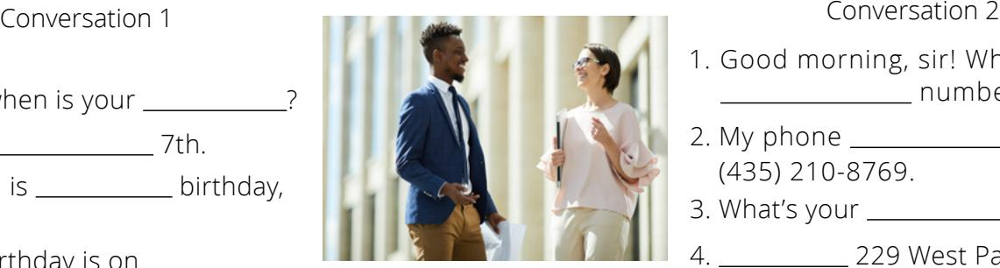

- 1. Good morning, sir! What is your number?
- 2. My phone is (435) 210-8769.
- 3. What's your ?
- 4. 229 West Palm Avenue.
- 5. your email?

**FEBRUARY 1 2 3 4 5 6 7 8 9 10 11 12 13 14 15 16 17 18 19 20 21 22 23 24 25 26 27 28**

> **JUNE1 2 3**

- 6. email is dan@email.com.
- 7. you!

Thank number phone My address It's What's

> **MARCH 1 2 3 4 6 7 8 9 10 11 13 14 15 16 17 18 20 21 22 23 24 25 27 28 29 30 31**

### **ACTIVITY 2: MY BIRTHDAY IS IN . . .**

A. Listen. Choose the correct month.

- a. January 1.
  - b. February
  - c. December
- a. November 2.
- b. December
- c. September

b. April c. May

- a. March 4.
  - b. May
  - c. June

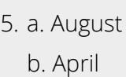

c. June

a. January 6.

b. July

c. June

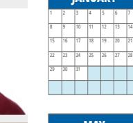

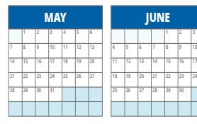

**4 5 6 7 8 9 11 12 13 14 15 16 18 19 20 21 22 23 25 26 27 28 28 30**

**JANUARY**

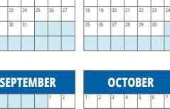

**29 30 31**

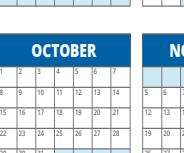

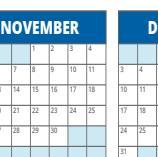

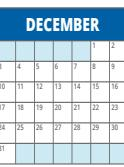

# **ACTIVITY 3: POSSESSIVE ADJECTIVES**

|    | A. Listen and repeat. Possessive Adjectives |       |                 |  |  |  |  |
|----|------------------------------------------------|-------|-----------------|--|--|--|--|
| 1. | I                                              | my    | my birthday     |  |  |  |  |
| 2. | you                                            | your  | your birthday   |  |  |  |  |
| 3. | we                                             | our   | our birthdays   |  |  |  |  |
| 4. | they                                           | their | their birthdays |  |  |  |  |
| 5. | he                                             | his   | his birthday    |  |  |  |  |
| 6. | she                                            | her   | her birthday    |  |  |  |  |

1. **My** birthday is in October.

**B. Read aloud, then listen.**

- 2. When is **your** birthday?
- 3. **Our** birthday**s** are in August.
- 4. **Their** birthday**s** are in February.
- 5. **His** birthday is in June.
- 6. Today is **her** birthday.

**3 4 5 6 7 8 10 11 12 13 14 15 17 18 19 20 21 22 24 25 26 27 28 29**

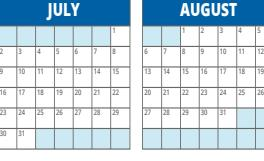

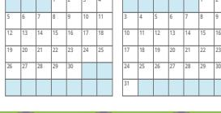

### **ACTIVITY 4: POSSESSIVE ADJECTIVES—WRITING**

A. Rewrite the complete sentence.

| Example:               |           |
|------------------------|-----------|
| (you ) When is         | birthday? |
| When is your birthday? |           |

- 1. (we) birthdays are in October.
- 2. (he) birthday is on February 28.

- 3. (they) birthdays are on the same day.
- 4. (she) When is birthday?
- 5. ( I ) Today is birthday.

### **ACTIVITY 5: NUMBERS—MONTHS**

B. Read aloud. Then listen. A. Choose the word that goes with the number.

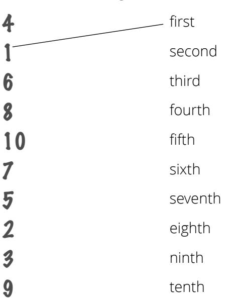

January 1st

February 2nd

March 3rd

April 5th

May 21st

June 23rd

July 4th

August 8th

September 9th

October 10th

November 7th

December 6th

### **ACTIVITY 6: PERSONAL INFORMATION**

A. Listen to the question. Choose the correct answer.

- 1. a. It's john@email.com.
- b. It's John Harper.
- c. It's August 5th.
- 2.
- a. It's Remy.
- b. It's (307) 198-5642.
- c. It's jrc@email.com
- 3.
- a. It's dcm@email.com.
- b. It's January 2nd.
- c. It's 950 West 3rd Avenue.
- 4. a. It's kma@email.com.
- b. It's 459 Baker Street.
- c. It's (808) 432-7719.

B. Read the answer. Choose the correct question.

| 1.                      | a. Where are you from?       | 2.                | a. When's your birthday?     |
|-------------------------|------------------------------|-------------------|------------------------------|
| A:                      | b. When's your birthday?     | A:                | b. Where are you from?       |
| B: It's (370) 198-5642. | c. What's your phone number? | B: February 28th. | c. What's your phone number? |
| 3.                      | a. Where are you from?       | 4.                | a. Where are you from?       |
| A:                      | b. What's your address?      | A:                | b. What's your name?         |
| B: I'm from Prague.     | c. What's your name?         | B: I'm Amelie.    | c. When's your birthday?     |

### **ACTIVITY 7: PERSONAL INFORMATION—WRITING**

A. Listen. Write the information you hear.

Name Emiko Phone number 1.

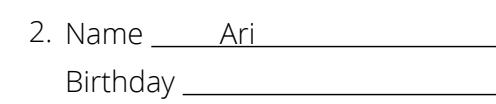

- Name Tomas Email 3.
- 4. Name Talia Address

Name: Birthday:

Address:

Email: Phone number:

### **ACTIVITY 8: THE EMERGENCY**

A. Learn the vocabulary: doctor, breathe, oxygen, lie detector B. Listen and read. C. Read aloud.

A woman calls the doctor. "Can I help you?" asks the doctor.

"I can't breathe," says the woman. "What is your name?" asks the doctor. "Joan Harris," says the woman.

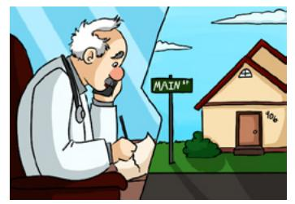

- "What is your phone number?" he asks. "It's 125-730-1986," she says.
- "What is your address?" he asks.
- "My address is 906 Main Street," she says.

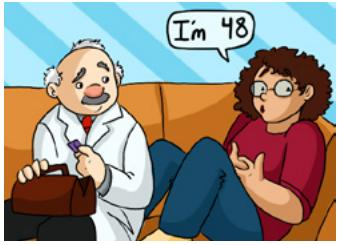

The doctor goes to Joan's house. He asks, "How old are you?" "I'm 48," says Joan.

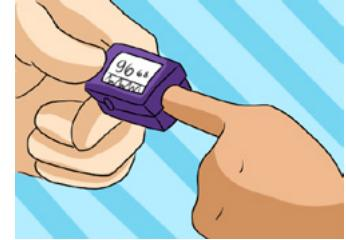

He puts something on her finger. It shows her oxygen. "What is that for?" she asks. "It's a lie detector," jokes the doctor.

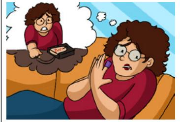

"Oh," says Joan. "I'm really 57."

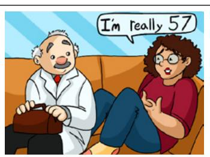

- A. Help your practice partner review the vocabulary for this lesson in the back of this book. Make sure they understand the meaning of the vocabulary. Help them retell the story in Activity 8.
- B. Role-play calling the doctor's office. Ask your partner for personal information. Then switch roles.

"What's your name?"

"When is your birthday?"

"What is your phone number?"

"What is your email?"

C. Look at pictures of your practice partner's friends and family. Ask about their birthdays.

"When is his birthday?" "When is her birthday?" "When is your birthday?"

Then switch. Show pictures of your friends and family. Answer your partner's questions.

### **EXPANSION ACTIVITIES: HOW TO PRAY**

- 1. Learn the vocabulary: pray, Heavenly Father, blessings, help, learn 2. Listen.
- 3. Read aloud. 4. Practice saying your own prayer.

# How to Pray

- 1. Dear Heavenly Father,
- 2. Thank you for my blessings. Thank you for my family. Thank you for my English class.
- 3. Please help me to learn English. Please bless my family.
- 4. In the name of Jesus Christ, amen.

- 5. Learn the vocabulary: pray, listens, knows
- 6. Read aloud. Then listen.

Jesus taught, *"Ye must always pray unto the Father in my name"* (3 Nephi 18:19).

> Heavenly Father **listens** to my prayers. Heavenly Father **helps** me.

Heavenly Father **knows** my name.

7. Ponder: What can you pray for?

|  |  |  |  |  | 8. Write: Fill in the prayer. |
|--|--|--|--|--|-------------------------------|
|--|--|--|--|--|-------------------------------|

Dear Heavenly Father,

Thank you for . Please help .

Please bless .

In the name of Jesus Christ, amen.

9. Speak: Practice praying in English. Try to pray in English once a day. Ask Heavenly Father to help you learn English.

### **ENGLISHCONNECT 1**