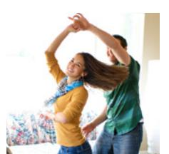
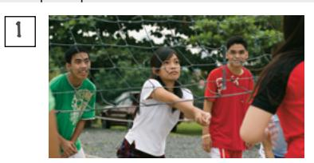
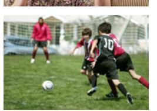
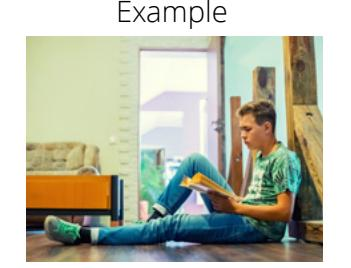
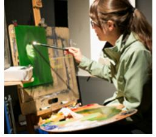
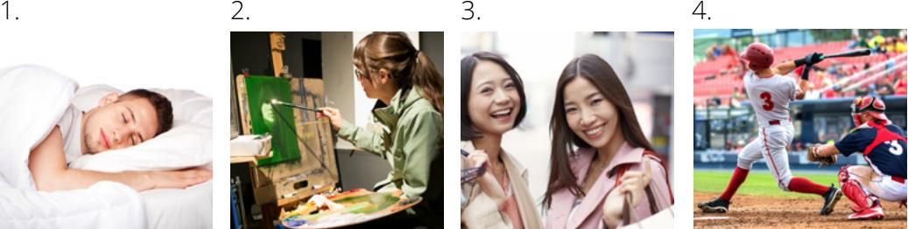
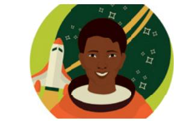
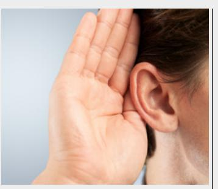
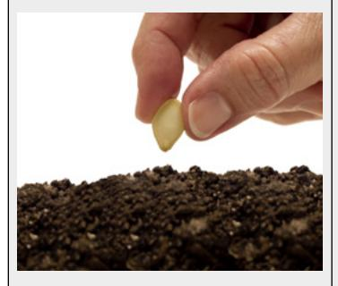

### **LESSON 4: HOBBIES AND INTERESTS**

### **CONVERSATIONS: LIKES AND DISLIKES**

C. Write the missing word. D. Read aloud.

1. \_\_\_\_\_ do you like to do?

Conversation 1: A. Listen. B. Listen and repeat.

2. I \_\_\_\_\_\_ to play sports.

3. too!

4. \_\_\_\_\_ you like to cook?

5. No, not really. I \_\_\_\_\_ cook very often.

6. Me \_\_\_\_\_.

7. Do you like to \_\_\_\_\_?

8. Yeah, I \_\_\_\_\_ like to dance.

9. Me \_\_\_\_\_!

don't Me really What neither Do dance too like

Conversation 2:

A. Listen.

B. Listen and repeat.

C. Answer the questions.

1. What does Alice like to do?

b.

3. Who does not like to shop?

a. Alice

b. Britta

2. What does Britta like to do?

### **ACTIVITY 2: THE VERB "LIKE"**

to <u>"(verb)</u>."

A. Study the chart.

| I / you / we / they | like / don't like    |
|---------------------|----------------------|
| he / she / it       | likes / doesn't like |

B. Read aloud; then listen.

a. We like to <u>dance</u>. b. He doesn't like to dance.

a. She likes to read.b. I don't like to read.

VV

a. They like to run.
 b. She doesn't like to run.

| C. Study the chart. | Do   | you / they | like to <u>"(verb)</u> ?" |
|---------------------|------|------------|---------------------------|
|                     | Does | he / she   |                           |

D. Read aloud: then listen.

Example 1
Do you like to read?
Yes, I like to read.
No, I don't like to read.

Example 2
Does she like to shop?

No, she doesn't like to shop. Yes, she likes to shop.

### **ACTIVITY 3: LIKE/DON'T LIKE**

A. Listen. Number the pictures. Say what the people like to do.

B. Choose the correct word.

- 1. I to study
  - a. like
  - b. likes
- 2. No, we like to dance.
  - a. don't
  - b. doesn't

- 3. She to paint.
  - a. like
  - b. likes
- 4. He to study.
  - a. like
  - b. likes

- 5. They don't to cook.
  - a. like
  - b. likes
- 6. you like to play sports?
  - a. Do
  - b. Does

# **ACTIVITY 4: DOES SHE LIKE TO . . .**

A. Read the question. Write the answer in a complete sentence. B. Practice saying the questions aloud.

Example Does she like to dance?

No, she likes to sing.

3. Does he like to study?

No, .

1. Does he like to play sports?

No, .

4. What does she like to do?

She .

2. Do they like to shop?

Yes, .

5. What do they like to do?

They .

### **ACTIVITY 5: SOO MI'S LIKES AND DISLIKES**

|                        | Yes | No |
|------------------------|-----|----|
| I like to dance.       | x   |    |
| I like to study.       |     | x  |
| I like to cook.        |     | x  |
| I like to run.         | x   |    |
| I like to read.        | x   |    |
| I like to play sports. |     | x  |
| I like to sing.        | x   |    |
|                        |     |    |

- 1. Does Soo Mi like to read?
  - a. Yes
    - b. No

- 3. Does Soo Mi like to cook?
  - a. Yes
  - b. No
- 2. Does Soo Mi like to sing?
  - a. Yes
  - b. No

- 4. Soo Mi doesn't like to\_\_\_\_\_.
  - a. run
  - b. study

### **ACTIVITY 6: LIKES AND DISLIKES—LISTENING**

A. Listen, and then answer the question. B. Say what each person likes or doesn't like to do.

- 1. What does Reba like to do?
  - a. run
  - b. dance
  - c. sleep
- 2. Sasha doesn't like to .
  - a. cook
  - b. shop
  - c. watch TV

- 3. Jordan likes to .
  - a. read and shop
  - b. read and play sports
  - c. play sports and shop

to .

- a. study b. watch movies
- c. listen to music

### **ACTIVITY 7: WRITE A LETTER**

A. Read Claudia's letter. B. Write a letter to Claudia. Fill in the blanks.

Dear Friend,

Claudia

My name is Claudia. I'm from Bolivia. I like to play sports and watch movies in English. I don't like to study or shop. What do you like to do? Best regards,

| Dear Claudia,   |               |
|-----------------|---------------|
| My name is      |               |
| I'm from        | . I like to   |
| and             |               |
| I don't like to | . Do you like |
| to              | ?             |
| Best regards,   |               |
|                 |               |

### **PRACTICE PARTNER INSTRUCTIONS**

- A. Help your practice partner review the vocabulary for this lesson in the back of this book. Make sure they understand the meaning of the vocabulary.
- B. 1. Tell your practice partner three things you like to do, using complete sentences. Example: "I like to swim."
  - 2. Ask your practice partner to tell you three things he or she likes to do. Ask, "What do you like to do?"
  - 3. Now ask them, "What do I like to do?" They should be able to restate what you said.
  - 4. Tell your practice partner three things you don't like to do; use complete sentences. Example: "I don't like to play sports."
  - 5. Ask your practice partner to tell you three things he or she doesn't like to do. Ask, "What don't you like to do?"
  - 6. Now ask them, "What don't I like to do?" They should be able to restate what you said.
  - 7. Help your practice partner ask and answer questions about the photos below.

Example: "Does he like to play sports?" "*No, he doesn't like to play sports. He likes to read."*

- C. 1. Use famous people to ask questions. See the pictures below for ideas. Be creative. Ask, "What does he/she like to do?" Ask, "What doesn't he/she like to do?"
  - 2. Have your practice partner practice asking questions about what famous people like or don't like to do.

Russell M. Nelson Yo-Yo Ma Mae Jemison Lionel Messi

### **EXPANSION ACTIVITIES: FAITH**

- 1. Learn the vocabulary: faith, know, knowing, sun, hear, seed, plant, planted, grow, swelling, heart
- 2. Listen. 3. Read aloud.

Faith is knowing the sun will rise

lighting each new day. Faith is knowing the

Lord will hear

my prayers each time I pray.

Faith is like a little seed: if planted it will grow. Faith is a swelling within my heart.

When I do right, I know.

- 4. Learn the vocabulary: trust, hope, not seen, true
- 5. Read aloud. Then listen. Faith is **trust** in Jesus Christ (see Guide to the Scriptures, "Faith," scriptures.ChurchofJesusChrist.org).

 Faith is a *"hope for things which are not seen, which are true"* (Alma 32:21).

6. Ponder: What is faith?

7. Write a scripture about faith in English (see Hebrews 11:1; Romans 10:17; James 2:17; Moroni 10:4).

8. Read the scripture aloud five times.