### **ENGLISHCONNECT 1 LESSON 6: FAMILY**

| CONVERSATION: WHO IS IN YOUR FAMILY? |
|--------------------------------------|
|--------------------------------------|

A. Listen. B. Listen and repeat. C. Write the missing word. D. Read aloud. E. Answer the questions.

|    | 1. I'm Canada. I like to     |                                   |
|----|---------------------------------|-----------------------------------|
|    | Also, I have a                  | family.                           |
|    | 2. Oh, yeah? Tell me about your |                                   |
| 3. |                                 | are 5 people in my family. I have |
|    | a brother and a                 | . What about                      |
|    | you?                            | are in your family?               |
|    | 4. I have 3 sisters and no      | . So there                        |
|    |                                 |                                   |

 small are dance from big friend family How many What brothers There sister is

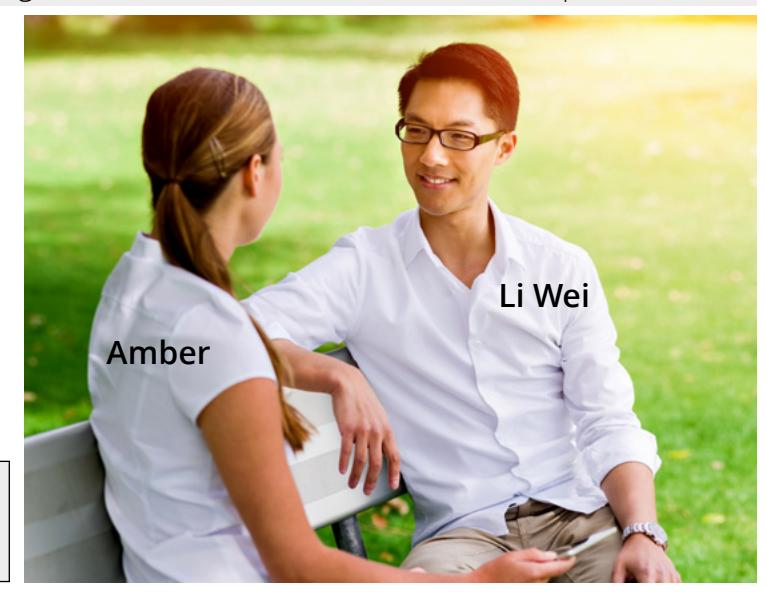

- 5. Where is Li Wei from?
- 6. How many people are in Li Wei's family?
- a. China
- b. Canada
- c. The United States

6 people in my family.

- - a. 5
  - b. 6
  - c. 7

- 7. How many brothers does Li Wei have?
  - a. 0
  - b. 1
  - c. 2

### **ACTIVITY 2: SINGULAR/PLURAL AND THE VERB "HAVE"**

A. Study the chart. Listen and repeat 1–5.

|    | Singular (1) | Plural (1+) |
|----|--------------|-------------|
| 1. | brother      | brothers    |
| 2. | sister       | sisters     |
| 3. | parent       | parents     |
| 4. | uncle        | uncles      |
| 5. | child        | children    |

B. Study the chart.

| The verb have       |      |
|---------------------|------|
| I / you / we / they | have |
| he / she / it       | has  |

- C. Read aloud; then listen.

- 2. You have 3 sisters. 4. They have 6 nephews. 6. She has 5 uncles.
- 1. I have two brothers. 3. We have one son. 5. He has four nieces.

1. She / have / two / cousin

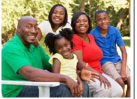

2. They / have / one / brother

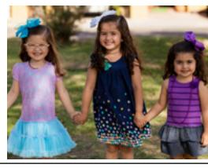

 3. I / have / two / sister

D. Write a complete sentence.

1. **She has two cousins.**  2.

3.

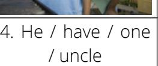

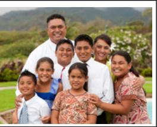

5. We / have / six / child

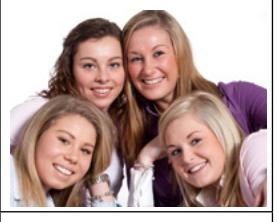

 6. She / have / three / niece

| D. Write a complete sentence. |
|-------------------------------|
| 4.                            |
| 5.                            |
| 6.                            |

## **ACTIVITY 3: TELL ME ABOUT YOUR FAMILY**

A. Listen and answer the questions.

Example:

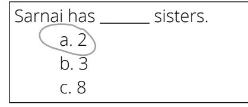

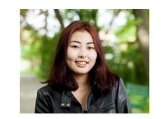

3. Agatha has 20 .

c. grandchildren

- 1. Ken has one .
- a. nephew
- b. niece
- c. cousin

4. Daya has nieces.

 a. nephews b. cousins

- a. 0
- b. 1 c. 2

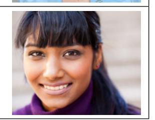

- 2. Manuel has four .
- a. sons
- b. daughters
- c. children

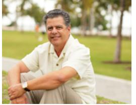

# **ACTIVITY 4: GEORGE AND MARIE'S FAMILY**

A. Write the answer to the questions about George and Marie's family.

|      | George | Marie |       |       |
|------|--------|-------|-------|-------|
| Ken  | Sue    | John  | Anna  |       |
|      |        |       |       |       |
| Sara | Dan    | Ben   | James | Nikki |

- 1. How many children do George and Marie have?
- 2. John is George's .
- 3. Sara is Ben's .
- 4. How many sons do John and Anna have?
- 5. George is James's .
- 6. Sue is Sara's .
- 7. Nikki is Ken's .
- 8. Dan and Ben are .
- B. Talk about how the person is related to Sue. Then listen.
- 1. Sara 2. George 3. James 4. Dan

- 5. Nikki 6. Marie 7. John 8. Anna

### **ACTIVITY 5: HOW MANY ARE IN THE FAMILY?**

A. Read and then write the answer to the questions. Then practice saying the questions.

- 1. How many people are in this family?
- 2. How many children do they have?
- 3. How many sons are in the family?
- 4. How many daughters are in the family?

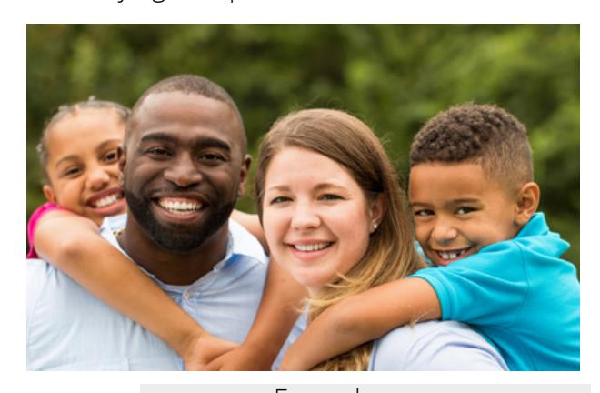

B. Write about one of your parents in 3 or more sentences.

Where is he/she from? What does he/she like to do, and why? How many people are in his/her family?

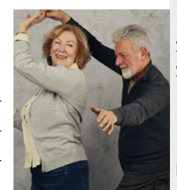

My mother is from Russia. She likes to cook because it's fun. She has 3 sisters. Examples

My father is from Argentina. He likes to play sports. He doesn't like to sing because it's difficult.

### **PRACTICE PARTNER INSTRUCTIONS**

- A. Help your practice partner review the vocabulary for this lesson in the back of this book. Make sure they understand the meaning of the vocabulary.
- B. Look at the picture of George and Marie's family in Activity 4. Help your practice partner talk about how each person is related to John. For example, "Sue is John's sister."
- C. Share pictures of your own family. Talk about your extended family. "How many cousins do you have?" "How many aunts and uncles?" "What do they like to do?" Help your practice partner talk about their extended family. How many people are in their family? Do they all live together? What do they like to do? Then help them fill in the chart. Practice asking and answering the questions.

| Questions about family How many ?                                                                                                                     | Possible answers                     |
|----------------------------------------------------------------------------------------------------------------------------------------------------------|--------------------------------------|
| How many people are in your family?                                                                                                                      | There are people in my family. |
| How many brothers do you have? How many sisters do you have? How many cousins do you have? Do you have any aunts or uncles? If so, how many? | I have                               |

D. Look at the pictures. Take turns with your practice partner asking and answering questions about each family. For example, how many daughters does she have? How many parents are in the family? How many grandchildren are in the family?

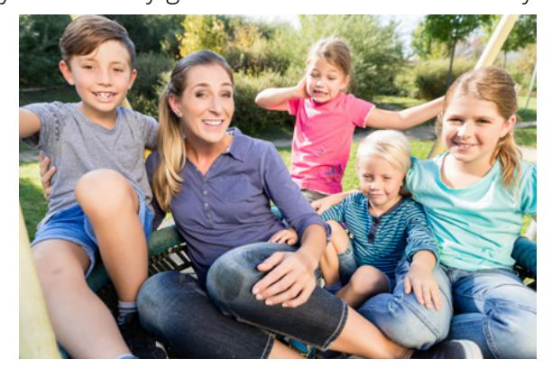

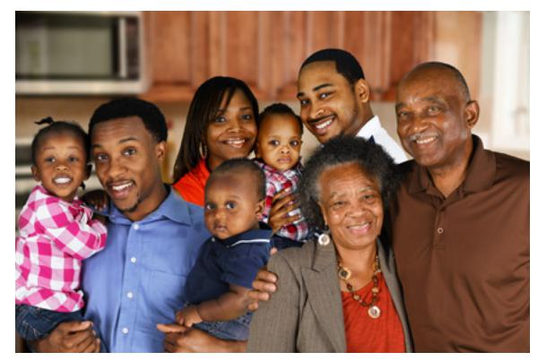

### **EXPANSION ACTIVITIES: FAMILY**

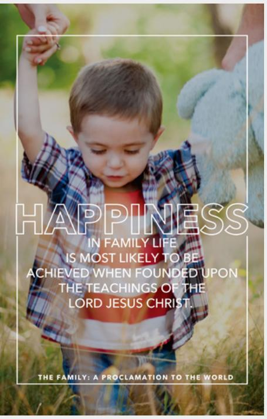

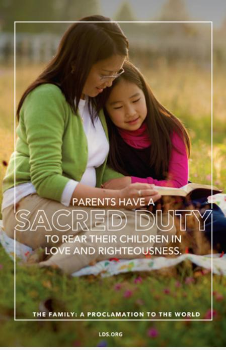

- 1. Learn the vocabulary:
- achieve
- founded upon
- sacred
- duty
- rear children
- relationship
- 2. Listen.
- 3. Read aloud.

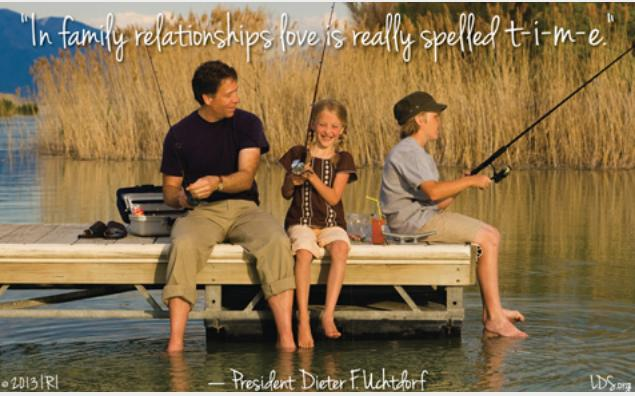

### Scripture 1

*"Husbands, love your wives, even as Christ also loved the church, and gave himself for it"* (Ephesians 5:25).

Scripture 2

*"Honour thy father and thy mother"* (Exodus 20:12).

- 4. Ponder: What do these quotes and scriptures mean to you?
- 5. Write one of the quotes or scriptures.

6. Speak: Memorize the quote or scripture. Say it to three people.

### **CONVERSATION: WHO IS IN YOUR FAMILY?**

A. Listen. B. Listen and repeat. C. Write the missing word. D. Read aloud.

- 1. Tell me about your .
- 2. Well, six people in my family.
- 3. I two brothers and one sister.
- 4. Oh, I have one too.
- 5. What's sister like?
- 6. My sister 16 years old.
- 7. She is and she long, brown hair.
- 8. She to read.

tall there are your sister family is has have like likes

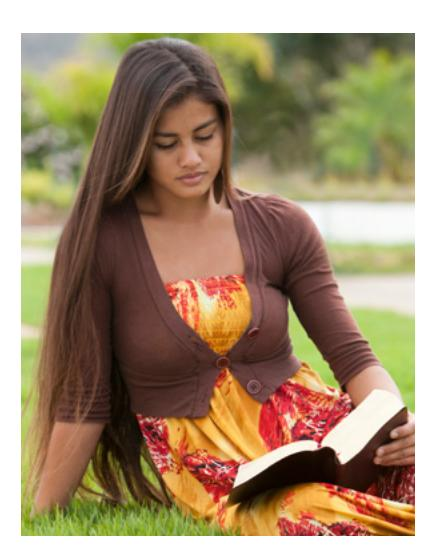

### **ACTIVITY 2: BE OR HAVE?**

A. Study the chart. B. Listen and repeat 1‒5.

|                     | the verb be |
|---------------------|-------------|
| I am                | tall        |
| you / we / they     | thin old |
| are                 | married     |
| he / she / it is | bald        |

|                 | the verb have |
|-----------------|---------------|
| I have          | long hair     |
| you / we / they | blue eyes     |
| have            | curly hair    |
| he / she / it   | glasses       |
| has             | a beard       |

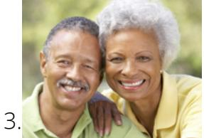

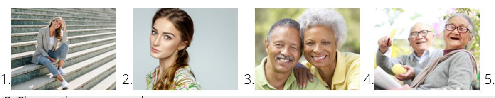

C. Choose the correct verb.

- 1. She tall.
- a. is
- b. are
- c. has
- d. have

- 2. They green eyes.
- a. is
- b. are
- c. has
- d. have

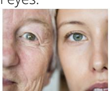

- a. is
- b. are
- d. have

- 4. We married.
- a. is
- b. are
- c. has
- d. have

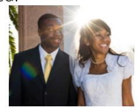

- 5. He a beard.
- a. is
- b. are
- c. has
- d. have

- 3. Sarah curly hair.
- c. has

- 6. I not old.
- a. am
- b. is
- c. has
- d. have

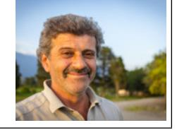

### **ACTIVITY 2: TALKING ABOUT AGE**

A. Study the chart. B. Listen and repeat 1–4.

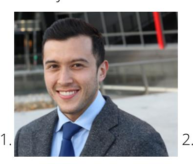

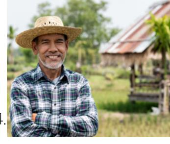

| Talking about Age: Questions |             |                      |  |
|------------------------------|-------------|----------------------|--|
| Llow old                     | are         | you / they?          |  |
| How old                      | is          | he / she?            |  |
| Talki                        | ing about A | ge: Answers          |  |
| l am                         | ľm          |                      |  |
| you are                      | you're      |                      |  |
| we are                       | we're       |                      |  |
| they are                     | they're     | <u>25</u> years old. |  |
| he is                        | he's        |                      |  |
| she is                       | she's       |                      |  |
| it is                        | it's        |                      |  |

### **ACTIVITY 4: DARIA'S FAMILY**

A. Read the chart. Listen and respond to the questions aloud.

| DARIA |  |
|-------|--|

| Sister          | Brother        | Brother      | Mom          | Dad             |
|-----------------|----------------|--------------|--------------|-----------------|
| Maddie          | Marcus         | James        | Dawn         | Clark           |
| 10 years        | 15 years       | 18 years     | 45 years     | 49 years        |
|                 |                |              |              |                 |
| Cousin          | Cousin         | Aunt         | Uncle        | Grandma         |
| Cousin Simon | Cousin Lucy | Aunt Barb | Uncle Dan | Grandma Judy |

DARIA'S FAMILY

### **ACTIVITY 5: WHO IS IT?**

A. Look at the picture. Listen to the description. Choose the correct person.

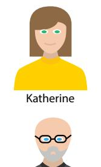

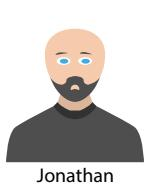

c. Claire d. Charlotte

b. Susan

a. Katherine

2. a. David

b. Ray

c. Alan

d. Jonathan

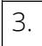

a. Charlotte

4. a. Susan

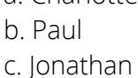

d. Mary

b. Ray

c. Philip

d. Marjorie

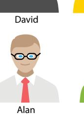

Mary

Paul

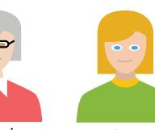

Charlotte

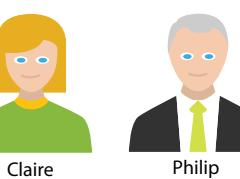

Steven

### **ACTIVITY 6: DESCRIBING THE FAMILY**

A. Read the description. Choose the picture that matches.

1. My cousin is a friendly and fun person. She is 23 years old. She is thin and has straight red hair. She loves to travel, cook, and watch movies.

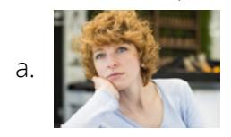

2. My brother is energetic. He is 34 years old and kind of short. He is bald but has a mustache and short beard. He is married and has two children. He likes to run.

c.

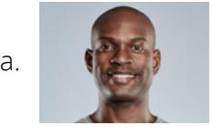

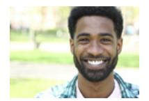

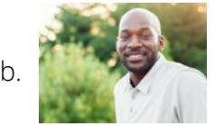

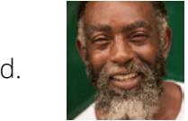

### **ACTIVITY 7: DESCRIBE THE PERSON**

A. Write about the person in the picture. Write as much as you can. Be creative.

Hugo age 29

Helen age 66

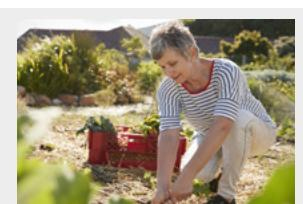

### **PRACTICE PARTNER INSTRUCTIONS**

- A. Help your practice partner review the vocabulary for this lesson in the back of this book. Make sure they understand the meaning of the vocabulary.
- B. Look at the pictures in Activity 7. Help your practice partner say as much as they can about the people in the pictures. Talk about age, physical description, personality, family relationships, and interests. Do the same for the pictures below.

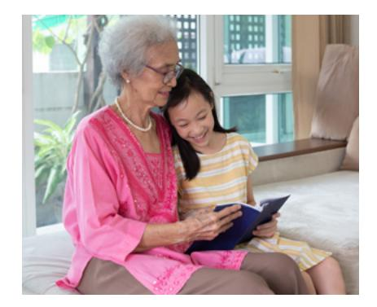

Young-ja, age 78, grandmother Min-seo, age 9, granddaughter

Victor, age 27, husband Adele, age 26, wife

C. Look at the chart in Activity 4. Ask your practice partner questions about Daria's family. Examples: How old is Uncle Dan? How many cousins does she have? How old are they?

- Share pictures of your own families. Help your practice partner describe two family members. Talk about: 1. age ( is years old) D. Look at the chart in Activity 5. Give your practice partner some clues about people in the chart. Then ask, "Who is it?" For example, "This person has dark hair, dark skin, and blue eyes. Who is it?"
  - 2. physical description (he/she has eyes and hair, he/she is tall/short, and so on)
  - 3. personality (funny, shy, loud, kind, athletic, and so on)
  - 4. likes and dislikes

### **EXPANSION ACTIVITIES: CHANGE OF HEART**

- 1. Learn the vocabulary: want, example, proud, decide, soften
- 2. Listen. 3. Read aloud.

My brother Carlos is handsome. He is tall and has dark hair. He is 19 years old.

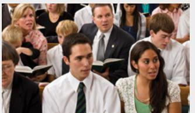

Carlos spoke in church. He said, "I love Jesus Christ. I try to do good. I want my brother to be proud of me."

I think about my life. I don't follow Jesus Christ.

He is going on a mission for The Church of Jesus Christ of Latter-day Saints.

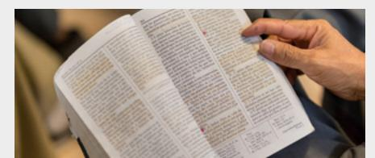

I am surprised. I am proud of him. Carlos is a good person. He studies the scriptures.

But my brother loves me. I want to be like him. My heart softens. I repent. I change my life.

I didn't want to go on a mission. I didn't want to leave my job, my girlfriend, or my motorcycle.

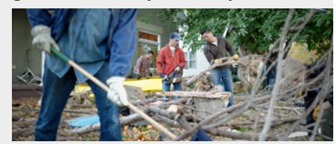

He serves other people. He is honest. He is kind. He is like Jesus Christ.

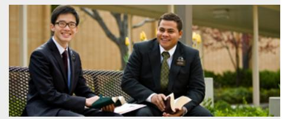

Two years later, I am a missionary. I thank Heavenly Father for my brother. He is a good example for me.

- 4. Learn the vocabulary: repentance, change, mind, view, suffered, pain, how, who
- 5. Read aloud. Then listen.

*"[Christ] suffered the pain of all men, that all men might repent and come unto him"* (Doctrine and Covenants 18:11).

**Repentance** "is a **change** of **mind** and heart that gives you a fresh **view** about God, about yourself, and about the world" ("Repentance," *True to the Faith* [2004], 132).

- 6. Ponder: What can you do to be a better person?
- 7. Write: **Who** do you want to be like? Write 3–5 sentences about this person.
- 8. Speak: Talk about the person you want to be like. Tell three people.