### **ENGLISHCONNECT 1 LESSON 8: EVERYDAY COMMON ITEMS**

### **CONVERSATION: IS THIS YOUR PHONE?**

A. Listen. B. Listen and repeat. C. Write the missing word. D. Read aloud.

- 1. Sasha, is your phone?
- 2. No, not.
- 3. phone is in my pocket.
- 4. Are your keys?
- 5. No, not.
- 6. My keys in my backpack.

My this it's these are they're your

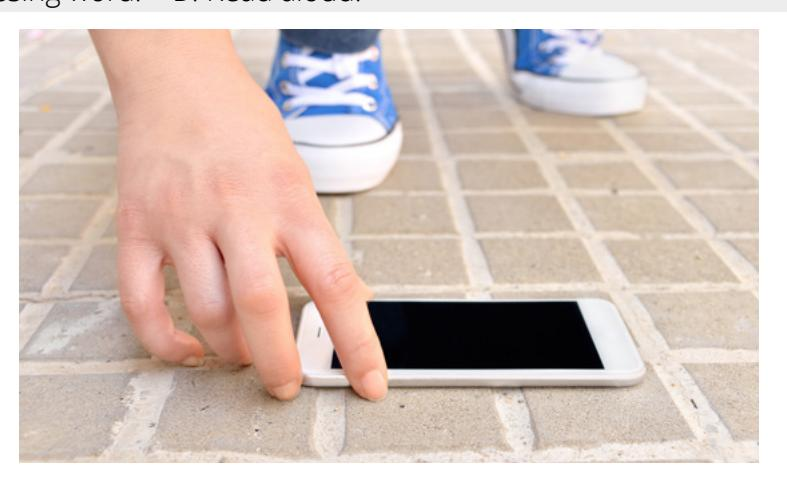

### **ACTIVITY 2: THIS AND THESE**

A. Study the chart. B. Listen and repeat.

| This and These |             |  |
|----------------|-------------|--|
| Singular (1)   | Plural (2+) |  |
| this / is      | these / are |  |
|                |             |  |

C. Choose the correct missing word.

| 1. What is     | 5.             |
|----------------|----------------|
| ?              | this your pen? |
| a. this        | a. Is          |
| b. these       | b. Are         |
| 2. These       | 6. What are    |
| my pencils.    | ?              |
| a. is          | a. this        |
| b. are         | b. these       |
| 3. Do you like | 7. This        |
| chairs?        | her computer.  |
| a. this        | a. is          |
| b. these       | b. are         |
| 4.             | 8. Do you like |
| is my phone.   | book?          |
| a. This        | a. this        |
| b. These       | b. these       |

### **ACTIVITY 3: WHAT IS THIS?**

A. Look at the picture. Listen to the question, and respond. B. Ask a question aloud for each picture.

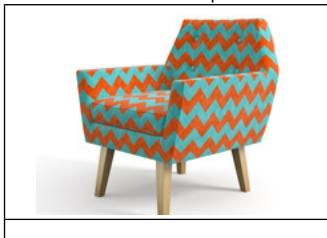

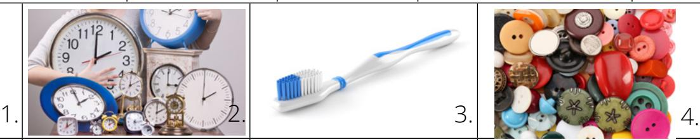

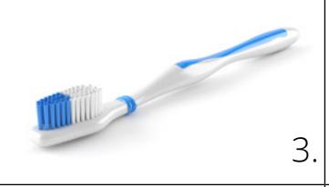

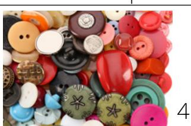

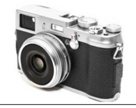

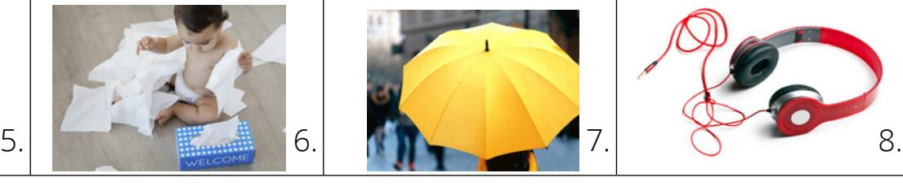

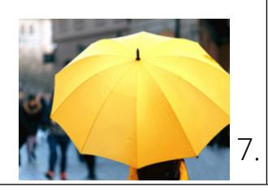

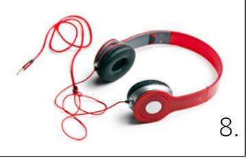

# **ACTIVITY 4: POSSESSIVE ADJECTIVES REVIEW**

A. Study the chart.

B. Read. Listen and repeat 1–5.

| Possessive Adjectives—Review |       |              |
|------------------------------|-------|--------------|
| I                            | my    | my watch     |
| you                          | your  | your pen     |
| we                           | our   | our books    |
| they                         | their | their phones |
| he                           | his   | his wallet   |
| she                          | her   | her keys     |

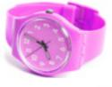

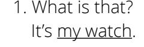

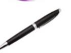

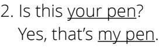

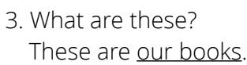

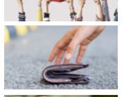

4. Is this his wallet? No, it's not.

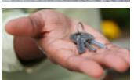

5. Are these her keys? Yes, they are.

### **ACTIVITY 5: WHAT IS THIS?**

A. Write what you hear.

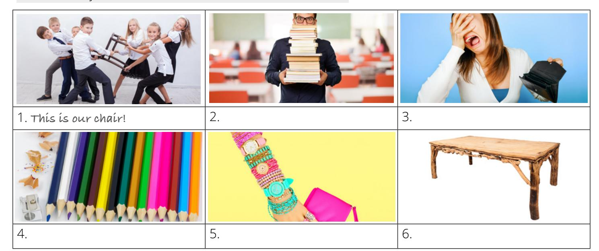

### **ACTIVITY 6: WHAT IS THIS?**

A. Look at the picture. Write five things you see.

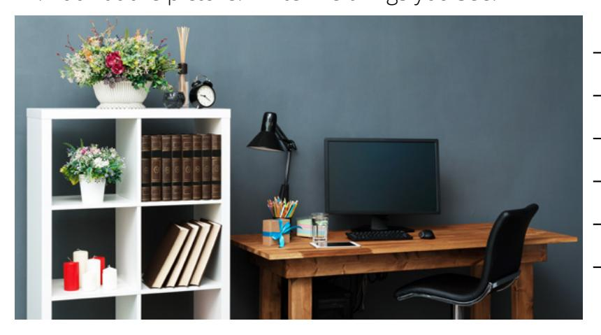

| K  |   |  |
|----|---|--|
|    | M |  |
| N. |   |  |
|    |   |  |

A. Listen. B. Read aloud.

My name is Nora. I like to read. These are my books.

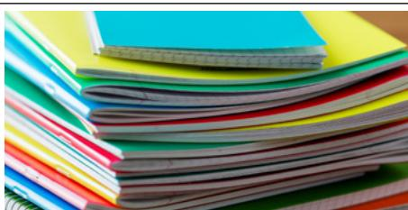

I also like to write stories for children. I write my ideas in these notebooks.

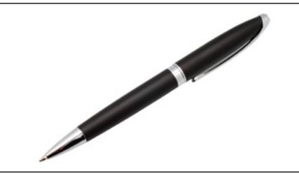

I only write with this pen. I like to write with it because it helps me write good ideas.

Then I write the story on this computer.

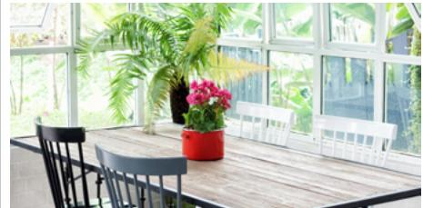

Each day for 8 hours, I sit at this table to write.

Writing is challenging. But I love to write because it's also interesting and exciting.

C. Answer the questions. Choose all that are correct.

1. What does Nora like to do? 2. What does Nora use in her writing? 3. Nora likes to write because it's .

a. study

b. travel

c. read

d. dance

e. write

a. a computer

b. a pen

c. a pencil

d. a notebook

e. a table

a. challenging

b. fun

c. exciting

d. interesting

e. easy

### **PRACTICE PARTNER INSTRUCTIONS**

- A. Help your practice partner review the vocabulary for this lesson in the back of this book. Make sure they understand the meaning of the vocabulary.
- B. Look at the pictures in Activity 3, Activity 6, and below. Take turns asking questions. "What is this?" "What are these?" Look around the room and ask your partner to name things.

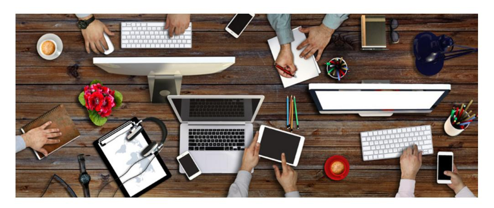

- C. Look at Activity 7. Ask your practice partner to retell Nora's story in his or her own words. Ask questions about the story. For example, "What does Nora like to do?" and "How many hours does she write?"
- D. Ask your practice partner to retell the story in the "Expansion Activity." Ask him or her questions about the story. For example, "What did Laura lose?" or "Where did she look?" or "What did her daughter say?" Talk about prayer together. What do you pray for? How does Heavenly Father answer your prayers?

### **EXPANSION ACTIVITIES: HEAVENLY FATHER ANSWERS PRAYERS**

- 1. Learn the vocabulary: lose, need, look, find, vacation, under
- 2. Listen. 3. Read aloud.

"Where are the car keys?" Laura asks herself. "I can't lose them!"

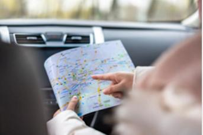

Laura and her family are on vacation 800 km from home. She needs those keys.

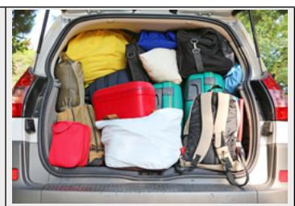

Laura looks in the car. She looks in her backpack. No keys.

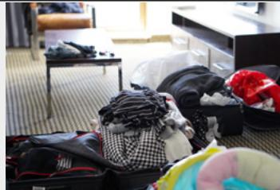

Laura looks on the table. She looks under the chair. No keys.

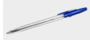

keys.

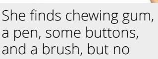

"Did you pray?" asks her daughter. "No," says Laura. "Let's pray t o g e t h e r , " says her daughter.

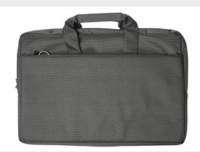

They pray. Laura has a thought to look in her computer bag. There are the keys!

Laura says another prayer. She thanks Heavenly Father for answering her prayer and helping her find her keys.

- 4. Learn the vocabulary: humble, lead, hand, answer, talk, hear, thou, thee = you, thy = your
- 5. Read aloud. Then listen.

*"Be thou humble*; *and the Lord thy God shall lead thee by the hand, and give thee answer to thy prayers"* (Doctrine and Covenants 112:10).

*"*Just **talk** to your Father. He **hears** every prayer and **answers** it in His way" (Richard G. Scott, "Learning to Recognize Answers to Prayer," *Ensign,* Nov. 1989, 3).

- 6. Ponder: What do you pray for? How has Heavenly Father answered your prayers?
- 7. Write three sentences about what you pray for:

8. Speak: Talk about what you pray for. Tell three people.

Examples:

I pray for my family.

I pray for help with English.