### **ENGLISHCONNECT 1 LESSON 9: CLOTHING AND COLORS**

### **CONVERSATION: I'M LOOKING FOR A NEW SHIRT**

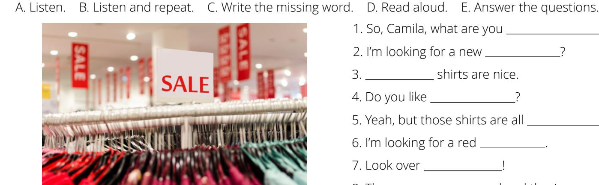

- 1. So, Camila, what are you ?
- 2. I'm looking for a new ?
- 3. shirts are nice.
- 4. Do you like ?
- 5. Yeah, but those shirts are all .
- 6. I'm looking for a red .
- 7. Look over !
- 8. Those are red and they're on sale!

them there Those one shirt red shirts looking for green are is

- 1. What is Camila looking for?
- a. a green shirt c. a red skirt
- b. a red shirt d. a green skirt
- 2. Does she find what she is looking for?
  - a. yes
  - b. no

### **ACTIVITY 2:**

A. Study the charts. B. Listen to the examples, and then repeat.

| Demonstrative Adjectives: this, these |              |             |
|---------------------------------------------|--------------|-------------|
|                                             | Singular (1) | Plural (2+) |
| Close to the speaker                  | this / is    | these / are |

| Demonstrative Adjectives: that, those |              |             |
|---------------------------------------|--------------|-------------|
|                                       | Singular (1) | Plural (2+) |
| Far from the speaker            | that / is    | those / are |

C. Look at the pictures. Listen to the question, and respond. Then ask your own questions for each picture.

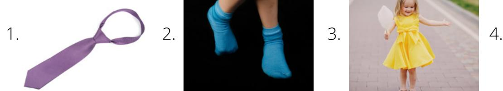

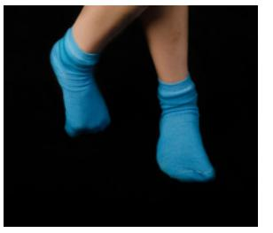

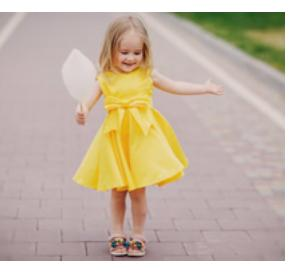

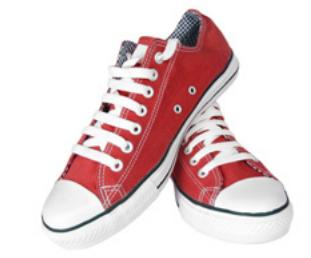

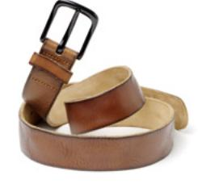

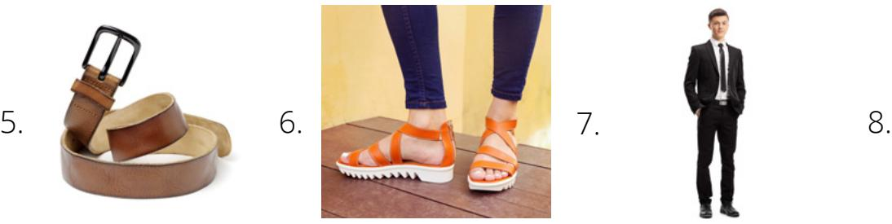

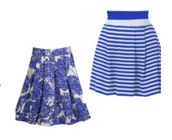

### D. Write the missing word. Use *is, are, this, that, these, those.*

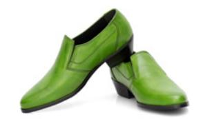

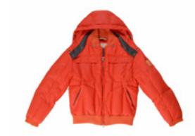

1. are his green shoes. 2. Is your red jacket?

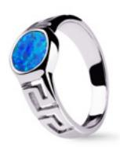

3. That his ring.

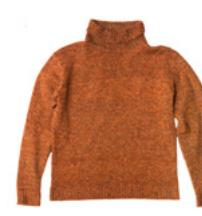

6. I don't like orange sweater.

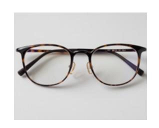

4. these his glasses? 5. I like dresses.

### **ACTIVITY 3: I'M WEARING . . . I'M LOOKING FOR . . .**

|                               | Verb + ing                 |                        |
|-------------------------------|----------------------------|------------------------|
| I am                          | I'm                        |                        |
| you are we are they are | you're we're they're | wearing looking for |
| he is she is               | he's she's              |                        |

- A. Study the chart. B. Listen and repeat 1–3.
  - 1. I'm wearing a blue shirt.
  - 2. They are wearing white shirts.
  - 3. He's looking for a green shirt.

C. Read about Milo, and then answer the questions.

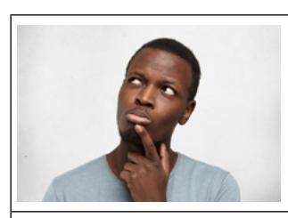

Milo is looking for his black shoes.

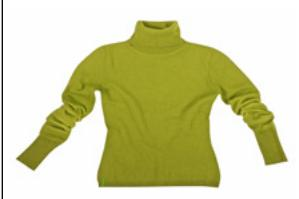

He finds his sister's green sweater.

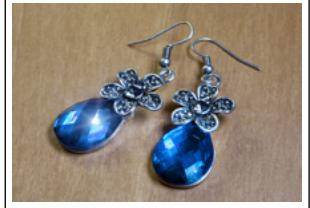

He finds his mother's blue earrings.

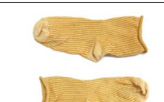

He finds his brother's dirty yellow socks.

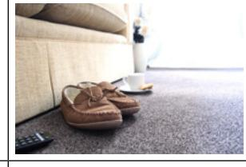

He finds his father's brown slippers.

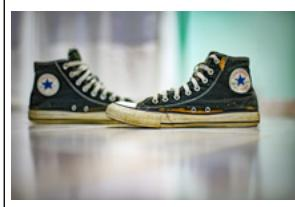

Where are his shoes? There they are!

- 1. What is Milo looking for?
  - a. shoes
  - b. socks
  - c. slippers
- 2. What color are his mother's earrings?
  - a. black
  - b. blue
  - c. brown
- 3. What does Milo find?
  - a. blue socks
  - b. green earrings
  - c. brown slippers
- 4. Does Milo find what he is looking for?
  - a. Yes b. No

### **ACTIVITY 4: WHO IS IT?**

A. Listen to 1–5. Choose the person described. Say what each person is wearing.

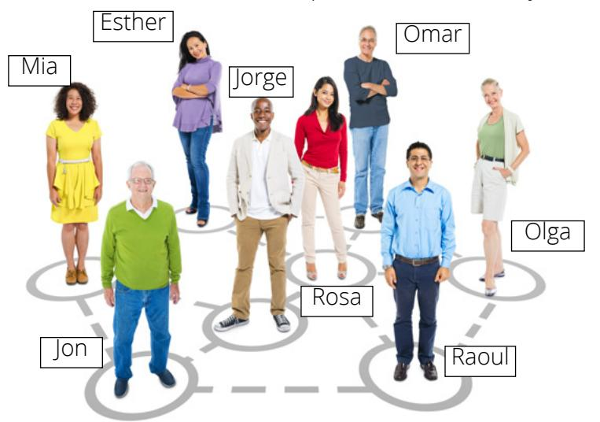

| 1. Who is it? |           |          |  |
|---------------|-----------|----------|--|
| a. Olga       | b. Omar   | c. Jon   |  |
| 2. Who is it? |           |          |  |
| a. Rosa       | b. Esther | c. Olga  |  |
| 3. Who is it? |           |          |  |
|               |           |          |  |
| a. Mia        | b. Esther | c. Olga  |  |
| 4. Who is it? |           |          |  |
| a. Jon        | b. Jorge  | c. Raoul |  |
| 5. Who is it? |           |          |  |

B. Look at the picture. Write what the person is wearing.

2. What is Esther wearing?

3. What is Omar wearing?

### **PRACTICE PARTNER INSTRUCTIONS**

- A. Help your practice partner review the vocabulary for this lesson in the back of this book. Make sure they understand the meaning of the vocabulary.
- B. Look at Activity 4. Describe one of the people. Have your partner guess who it is. Repeat. Switch roles.
- C. Look at the pictures below. Help your practice partner talk about what they see and what the people are wearing.

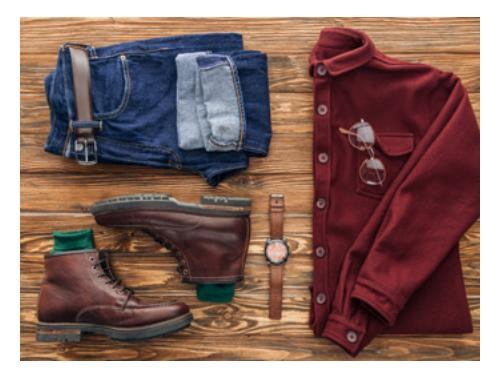

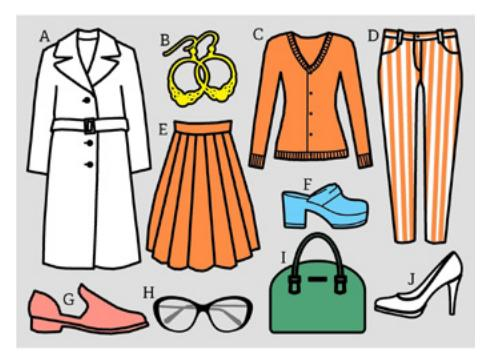

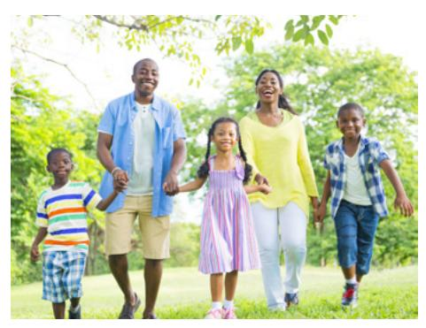

D. Look at the pictures below. Ask them to choose their favorite. "Do you like this green shirt or that purple shirt?"

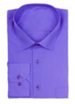

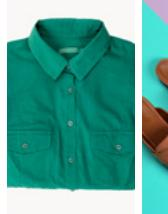

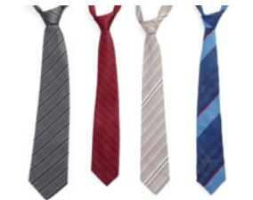

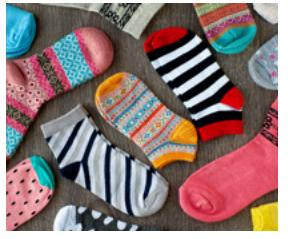

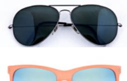

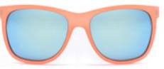

### **EXPANSION ACTIVITIES: JUDGE NOT**

- 1. Learn the vocabulary: neighbor, hang up clothes, window, wash, clean, soap
- 2. Listen. 3. Read aloud.

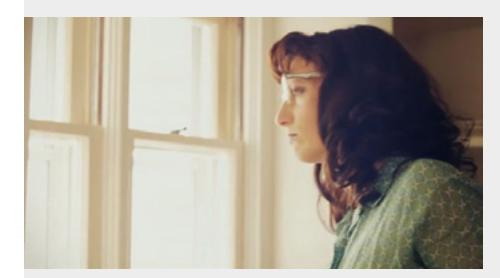

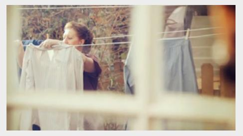

Mary likes to watch her neighbors. One day she sees her neighbor Sue. Sue hangs up clothes on the line. Sue hangs up red socks, blue pants, and a white shirt.

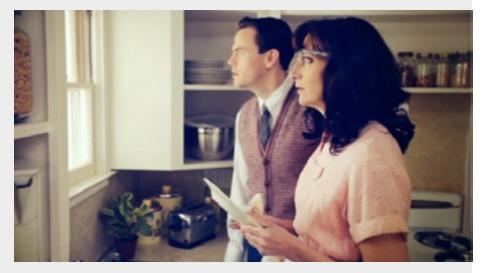

Mary looks out her window at the clothes. She turns to her husband, Bill, and says, "Sue doesn't know how to wash clothes. Those shirts are not clean."

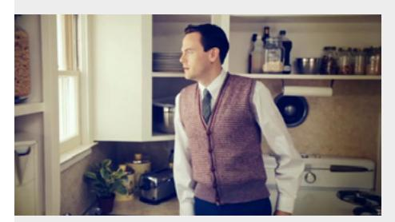

Bill looks out the window. He doesn't say anything.

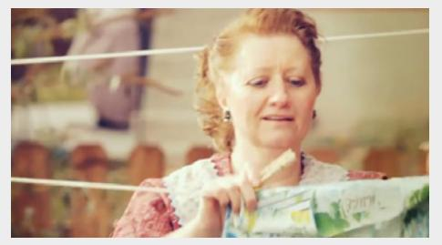

A few days later, Sue hangs up clothes again. Mary watches. Sue hangs up a green, white, and yellow dress and white socks.

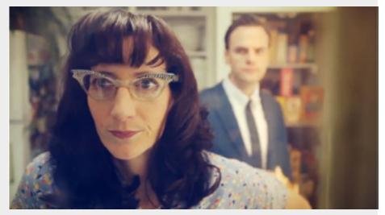

Mary says to Bill, "She needs different soap. Those socks are not clean." Bill doesn't say anything.

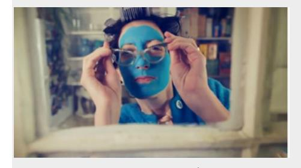

Mary continues to watch Sue hang up clothes. Mary continues to tell Bill that Sue does not know how to wash clothes.

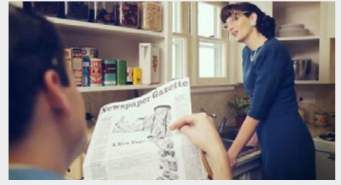

A few weeks later, Mary watches Sue hang up clothes. They are all clean! She says, "All of the clothes are clean! How did this happen?"

Bill says, "I washed our windows."

- 4. Learn the vocabulary: judge, judging
- 5. Read aloud. Then listen.

*"Judge not, that ye be not judged*" (Matthew 7:1).

6. Ponder: What does Jesus teach about judging people? How can you do better?

|  |  | 7. Write: What lesson does Mary learn in this story? |
|--|--|------------------------------------------------------|
|--|--|------------------------------------------------------|

8. Speak: Tell this story to three people.