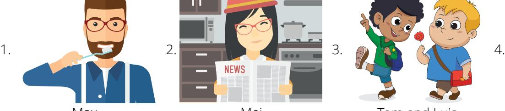
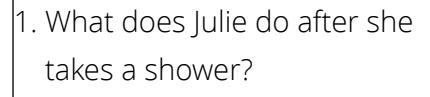
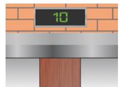
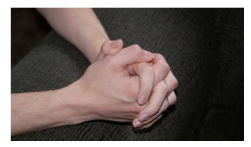

### **ENGLISHCONNECT 1 LESSON 10: DAILY ROUTINES**

### **CONVERSATION: WHAT DO YOU DO IN THE MORNING?**

A. Listen. B. Listen and repeat. C. Write the missing word. D. Read aloud.

| 1. Hey, Jianyu, what do you usually do in the |                       |                           | ? |
|-----------------------------------------------|-----------------------|---------------------------|---|
| 2. I                                          | take a shower and eat |                           |   |
| 3. What                                       | Kyung usually         | in the morning?           |   |
| 4. He usually                                 |                       | his teeth and watches the |   |
| 5. What                                       | ?                     |                           |   |
| 6. I usually                                  |                       | late, and then I go to    |   |

breakfas get up news morning you about do brushes usually does take work

# **ACTIVITY 2: 2: SIMPLE PRESENT + USUALLY**

A. Study the chart. B. Listen and repeat 1–4.

| Usually + Verb    |                |                                          |                 |
|-------------------|----------------|------------------------------------------|-----------------|
| I                 | eat breakfast  |                                          |                 |
| You We They | usually        | brush (my / your / their / our) teeth | in the morning. |
|                   | eats breakfast |                                          |                 |
| He / She / It     |                | brushes his / her teeth                  |                 |

- C. Look at the picture, and choose the correct answer. Say the complete sentence aloud.
- 1. Farah usually in the morning.
- a. brushes her teeth
- b. brushes her hair
- c. makes her bed

- 2. Chanhoon usually in the morning.
- a. makes his bed
- b. wakes up early
- c. goes to work

- 3. Patricia usually in the morning.
- a. makes breakfast
- b. brushes her hair
- c. puts on makeup

- 4. Christopher usually in the morning.
- a. takes a shower
- b. makes breakfast
- c. makes his bed

- 5. Izumi usually in the morning.
- a. feeds the dog
- b. makes her bed
- c. eats breakfast

- 6. Lucien usually in the morning.
- a. gets dressed
- b. shaves his face
- c. takes a shower

### D. Write a sentence to tell what the person usually does in the morning.

5. 6.

take a shower make breakfast

get dressed

watch the news brush teeth

Example:

go to school go to work

1. Claudia .

Armani **usually gets dressed in the morning.**

- 2. Michael and Susan .
- 3. I . 4. We .
- 5. Minhye .
- 6. Lin .

# **ACTIVITY 3: WHAT DO YOU DO IN THE MORNING?**

- A. Listen to 1–4. Repeat the question. B. Draw a line to show the answer.

Max Mei Tom and Luis Mateo

- 1. Max
- 2. Mei
- 3. Tom and Luis
- 4. Mateo

- a. She usually reads the news.
- b. He usually eats breakfast.
- c. They usually go to school.
- d. He usually brushes his teeth.

### C. Listen to 1–4. Answer the questions. Choose all answers that are correct.

| 1. What does Najib do in the morning?    | 2. What does Emily do in the morning?  |
|------------------------------------------|----------------------------------------|
| a. He wakes up early.                    | a. She makes her bed.                  |
| b. He gets up late.                      | b. She gets up early.                  |
| c. He takes a shower.                    | c. She eats breakfast.                 |
| d. He shaves.                            | d. She reads the news.                 |
| 3. What does Jung-Eun do in the morning? | 4. What does Andres do in the morning? |
| a. She puts on makeup.                   | a. He shaves.                          |
| b. She feeds her cat.                    | b. He makes breakfast.                 |
| c. She takes a shower.                   | c. He goes to school.                  |
| d. She makes her bed.                    | d. He prays.                           |

### **ACTIVITY 4: DAILY ROUTINES**

A. Listen. B. Read aloud. C. Answer the questions in complete sentences.

Julie works for a radio show.

She wakes up early at 3:30 a.m.

She takes a shower.

She puts on makeup and eats breakfast.

She goes to work. She starts the radio show at 5:00 a.m.

### **PRACTICE PARTNER INSTRUCTIONS**

- A. Help your practice partner review the vocabulary for this lesson in the back of this book. Make sure they understand the meaning of the vocabulary. Have him or her retell the stories in Activity 4A and 4D.
- B. Look at the pictures below. Help your practice partner answer the question "What do they usually do in the morning?" For example, "Sandra usually wakes up early in the morning." Help them say as much as they can about the people in the pictures.

Tanya Reo Thiago

C. Help your practice partner talk about their daily routine. Have them ask you questions about your daily routine. Ask them questions about their family members' routines.

- 1. Learn the vocabulary: tired, alone, take care of, feels, peace
- 2. Listen. 3. Read aloud.

Rosa has five children. She is a busy mom. Every morning she gets up at 6:00 a.m. She takes a shower and gets dressed.

After that, she makes breakfast for her family. She feeds the dog. She drives her children to school.

She comes home and cleans the house. She goes shopping.

She works all day for her family. One day, Rosa is tired and

unhappy. She feels alone.

She prays. She tells Heavenly Father that she is tired. She says, "I don't have time for everything. I need help."

A thought comes to her mind. It is this: "Put the Lord first. He will take care of the rest."

Rosa decides to pray every morning. She decides to read the scriptures every morning.

She does it. She feels better. She has peace. She has time for everything. She feels closer to God.

4. Learn the vocabulary: feast

5. Read aloud three times. Then listen.

*"Feast upon the words of Christ; for behold, the words of Christ will tell you all things what ye should do"* (2 Nephi 32:3).

- 6. Ponder: Why is it important to study the scriptures? How do the scriptures help you?
- 7. Write your favorite scripture (in English).
- 8. Speak: Say your favorite scripture (in English) to three people.

### **ENGLISHCONNECT 1**