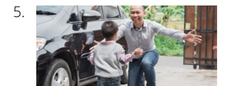
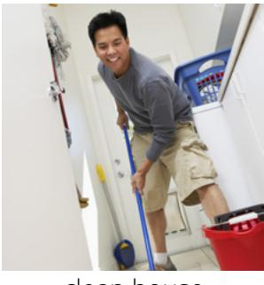
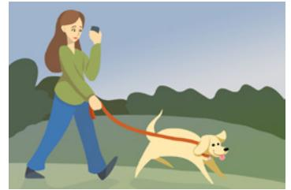
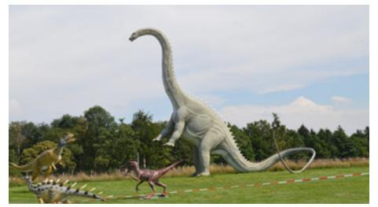
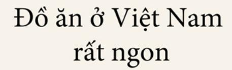

### **LESSON 11: CURRENT ACTIVITIES**

### CONVERSATION: WHAT ARE YOU DOING RIGHT NOW?

A. Listen. B. Listen and repeat. C. Write the missing word. D. Read aloud.

- 1. Hey, Dante, what are you \_\_\_\_\_ right now? I'm \_\_\_\_\_ to Jamie's house to eat \_\_\_\_\_ and watch a movie. Do you want \_\_\_\_\_ come?
- 2. Oh, sounds \_\_\_\_\_. . . . but I'm \_\_\_\_\_.
- 3. Really? Do you usually \_\_\_\_\_ on Friday \_\_\_\_\_?
- 4. No, I \_\_\_\_\_ relax, but I have a big \_\_\_\_\_ soon.
- 5. OK. Well, \_\_\_\_\_ luck!

doing good fun going test pizza usually study studying nights

# ACTIVITY 2: WHAT IS HE OR SHE DOING RIGHT NOW?

A. Study the charts. Listen to examples 1–6. Repeat aloud.

|            | Simple Prese                            | ent Tense                  |                 | Present P      | rogressive Tense (Ve                                          | erb + ing)         |
|------------|-----------------------------------------|----------------------------|-----------------|----------------|---------------------------------------------------------------|--------------------|
| subject    | verb                                    | time phrase                | subject         | <i>be</i> verb | verb + ing                                                    | time phrase        |
| l You   | eat <u>lunch</u>                        |                            |                 | am             |                                                               |                    |
| We They | watch <u>movies</u> pray             | every day. every night. | You We       | are            | eat <b>ing</b> <u>lunch</u> watch <b>ing</b> <u>movies</u> | now. right now. |
| He         | eat <b>s</b> <u>lunch</u>               | every <u>Friday</u> .      | They            |                | pray <b>ing</b>                                               | 11811611000.       |
| She It  | watch <b>es</b> movies pray <b>s</b> | every <u>-1100y</u> .      | He She It | is             | pray <b>ing</b>                                               |                    |

B. What are they doing? Write a sentence about the picture.

He / eat lunch

2.

She / pray

3.

I / eat dinner

He is eating lunch.

They / relax

He / come home

She / study

### C. Read each question aloud. Answer each question aloud. Listen.

- 1. What are you doing right now?
- 2. What is Sergio doing right now?
- 3. What are Teresa and Sam doing right now?
- 4. What are you all doing right now?

### D. Listen. Write the missing part of the sentence.

- a. Enzo is .
- b. He usually .

- a. Gamila is .
- b. She usually .

- a. Jeong Woo is .
- b. He usually .

### **ACTIVITY 3: DONGAI'S BUSY DAY**

### A. Listen to the story. B. Write the missing words.

1. 2.

- 1. Dongai's days are . 3. Dongai is her children do homework.
- 2. Her children are now. 4. Today Dongai's husband is .

### **ACTIVITY 4: "WHAT ARE YOU DOING?"**

A. Listen to the story. B. Read aloud.

"What are you doing right now?" asks the man.

"I'm cooking dinner," says the woman. "I'm eating dinner too," he says.

"I'm watching the news. How about you?" she asks. "I'm reading a book," he says.

"I'm going to sleep," he says. "Goodnight," she says.

"Good morning," she says. "I'm taking the dog for a walk."

"I'm walking too," he says. "What are you doing now?" he asks. "I'm eating breakfast," she says.

"Me too!" he says.

### **PRACTICE PARTNER INSTRUCTIONS**

- A. Help your practice partner review the vocabulary for this lesson in the back of this book. Make sure they understand the meaning of the vocabulary. Have him or her retell the stories in Activity 3 and Activity 4.
- B. Look at the pictures below. Ask your practice partner, "What is he/she doing right now?" Help them say as much as they can about the people in the picture. Then have your partner ask you questions about the people in the pictures.

do homework visit friends brush teeth feed the dog

exercise run errands get ready

eat breakfast

- C. Ask your practice partner what they usually do on Sunday. Ask what their family members usually do on Sunday. Let them ask you about your weekend schedule.
  - Pretend that it is a certain time during the day. Ask your practice partner what they are doing. For example: It's morning. What are you doing right now? Ask about different times of day (afternoon, evening, middle of the night). Then let them ask you questions.

### **EXPANSION ACTIVITIES: WHAT AM I DOING HERE?**

- 1. Learn the vocabulary: steep, sweaty, dinosaur, unfamiliar, becoming, pedaling
- 2. Listen. 3. Read aloud.

"What am I doing here?" Sister Chau asks herelf.

She is riding up a steep bridge in Vietnam. She is wearing a skirt. She is hot, sweaty, and tired.

She is thousands of miles from her home. People say, "You look like a dinosaur," because she is tall.

She is eating new and unfamiliar food. The language is difficult.

She is a missionary for The Church of Jesus Christ of Latter-day Saints.

Then she thinks, "I am learning a difficult language. I am trying new food."

"I am serving people. I am teaching people about Jesus Christ. I am changing. I am becoming a better person."

"I am here because I want to tell the people of Vietnam about Jesus Christ. I want to serve God and the people of Vietnam."

"I am here because I love God and Jesus Christ." So she continues pedaling up the bridge.

- 4. Learn the vocabulary: service, fellow beings, embark, might, mind, strength
- 5. Read aloud. Then listen.

*"When ye are in the service of your fellow beings ye are only in the service of your God"* (Mosiah 2:17).

*"O ye that embark in the service of God, see that ye serve him with all your heart, might, mind and strength"* (Doctrine and Covenants 4:2).

- 6. Ponder: What are you doing to serve others? How can you improve?
- 7. Write three ways you can serve others.
- 8. Speak: Tell someone how you are serving others this week.

### **ENGLISHCONNECT 1**