### **LESSON 12: TIME AND CALENDAR**

### **CONVERSATION: WHAT TIME IS IT?**

- A. Listen. B. Listen and repeat. C. Write the missing word.
- D. Read aloud.

- 1. Do you \_\_\_\_\_ a watch?
  - What \_\_\_\_\_ is it?
- 2. Yes. \_\_\_\_\_ 3:30.
- 3. OK, \_\_\_\_\_\_
- 4. You're \_\_\_\_\_.

have welcome thank you time lt's

### **ACTIVITY 2: TELLING TIME**

A. Listen to the examples. Repeat aloud.

five o'clock 5:00

five fifteen

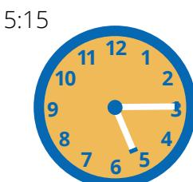

five thirty 5:30

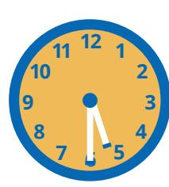

five forty-five

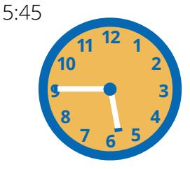

B. Listen to 1–6. Choose the correct time.

- 1. It's \_\_\_\_\_ a. 9:30
  - b. 9:15
  - c. 9:00
- 4. It's \_\_\_\_. a. 3:15
  - b. 3:00 c. 3:45

- 2. It's \_\_\_\_\_.
  - a. 1:00
  - b. 1:30
  - c. 1:45
- 5. It's \_\_\_\_\_.
  - a. 7:00 b. 6:00
  - c. 9:00

- 3. lt's \_\_\_\_\_.
  - a. 11:30
  - b. 10:30
  - c. 1:30
- 6. It's \_\_\_\_\_.
  - a. 2:30

  - b. 11:30
  - c. 12:30

C. What time is it? Look at the picture. Say the time aloud. Listen to the answer.

1.

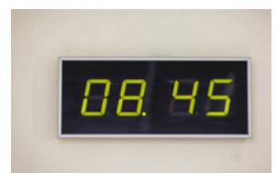

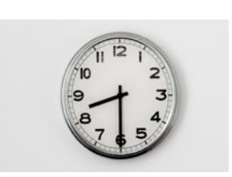

4.

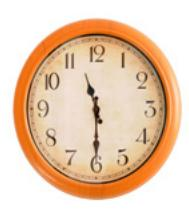

5.

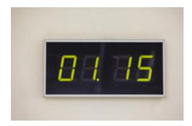

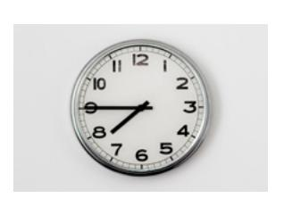

7.

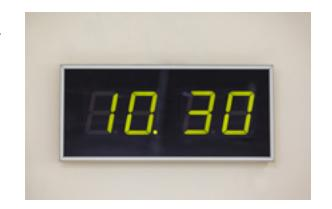

8.

# **ACTIVITY 3: DAILY SCHEDULES**

A. Read Jana's schedule. Answer the questions.

1. What time does Jana wake up?

a. 8:30

b. 7:45

c. 6:00

3. When does Jana go home?

a. 3:00 b. 4:00

c. 5:00

2. When does Jana eat lunch?

a. 12:00

b. 1:00

c. 11:00

4. What time does she eat dinner?

a. 5:00

b. 5:30

c. 6:00

B. Listen to Turo's schedule. Match the time with the activity.

1. eat dinner

2. eat lunch

3. wake up

4. come home

5. watch news

6. run errands

7. take a shower

8. go to work

a. 8:00

b. 8:15

c. 9:00

d. 11:30

e. 4:45

f. 5:30

g. 6:30

h. 7:00

# Jana's Schedule

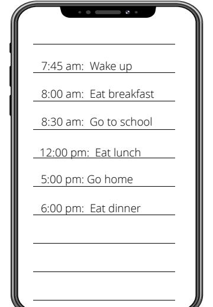

### **ACTIVITY 4: WHAT DAY IS TODAY?**

A. Listen. B. Listen and repeat. C. Write the missing word. D. Read aloud.

day fifteenth Friday fourteenth

1. Is today the ?

2. No, it's the .

3. Oh, what is today?

4. It's .

5. OK, thanks.

E. Read and listen to the dates. Repeat them aloud.

1. Today is Sunday, May 14th.

2. Today is Tuesday, May 16th.

3. Today is Friday, May 19th.

4. Today is Tuesday, May 30th.

5. Today is Monday, May 15th.

6. Today is Thursday, May 11th.

F. Look at the picture. Answer the question aloud. Listen to the answers.

1. What time is it? 2. What day is it today? 3. What is today's date? 4. Is today the 14th?

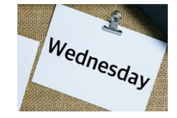

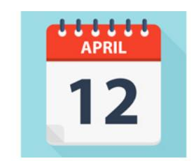

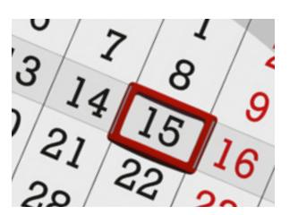

# 48 | EnglishConnect 1—**LESSON 12 ACTIVITY 5: ASKING QUESTIONS** A. Look at the picture and the answers. Choose the correct question. **PRACTICE PARTNER INSTRUCTIONS** 1. Question: ? Answer: No, it's the eighteenth. a. Is today the seventeenth? b. What day is today? c. Is today Friday? 2. Question: ? Answer: It's Friday. a. What is today's date? b. What day is today? c. What time is it? 3. Question: ? Answer: It's 10:15. a. What day is today? b. What time is it? c. Is today the 15th? 4. Question: ? Answer: Today is March 13. a. Is today Friday? b. What time is it? c. What is today's date? **ACTIVITY 6: BIRTHDAYS** A. Write about your family members' or friends' birthdays. Write at least 4 sentences. Listen to the example. A. Help your practice partner review the vocabulary for this lesson in the back of this book. Make sure they understand the meaning of the vocabulary. B. Help your practice partner talk about time and dates. Use the questions in activity 2C, 4F, and 5A to talk about the pictures in each activity. Take turns asking questions. Then ask each other questions about today's date and the time. C. Ask your practice partner about their schedule. For example: What time do you wake up? When do you usually eat lunch? Write their information in the first schedule.

D. Ask your practice partner to tell you about their birthday. When is their birthday? What do they like to do on their birthday? What time do they do things on their birthday? Let them ask you about your birthday. Talk about what they wrote in Activity 6.

Then let them ask you questions and fill in the second schedule.

If your schedule is currently the same, talk about another day.

### **EXPANSION ACTIVITIES: THE GIFT OF TIME**

- 1. Learn the vocabulary: gift, what matters most, rise, list, mind, promise, most important, the Spirit
- 2. Listen. 3. Read aloud.

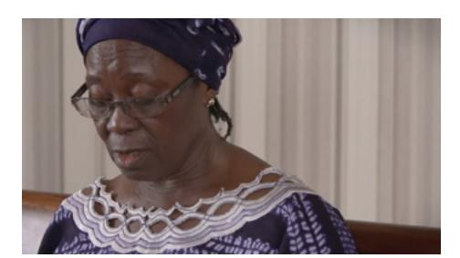

God has given us a great gift: our time. We must do with it what matters most.

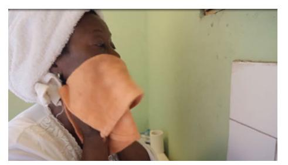

Every morning, I rise before the sun. I dress and wash my face and hands.

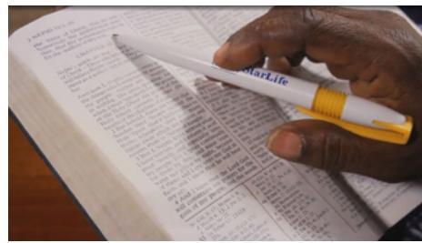

I read the scriptures.

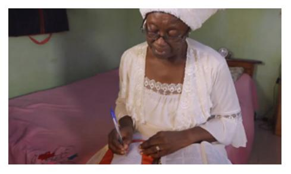

Then I make a list of what I should do that day. I think of who I must save.

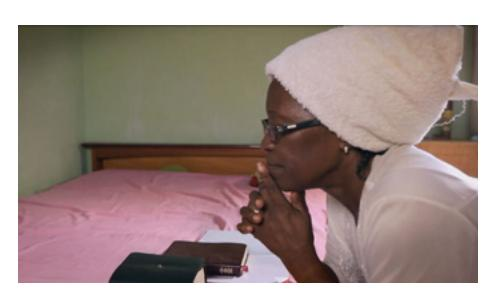

I pray to know God's will, and I listen. Sometimes the names or faces of people come to mind. I add them to my list.

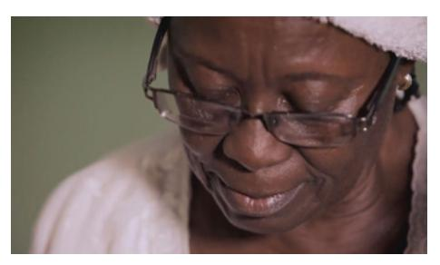

I thank God. I promise to do my best. I ask that He will do what I cannot.

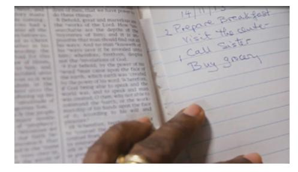

I look at my list. I put a 1 by the most important thing, then a 2.

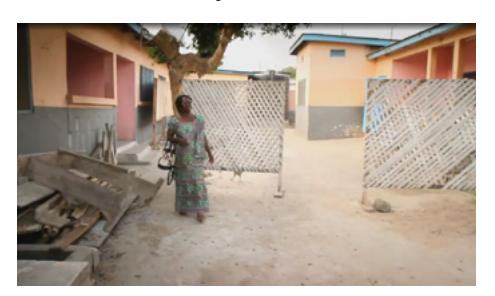

Then I go to work. I look at number 1 and try to do it first, then number 2.

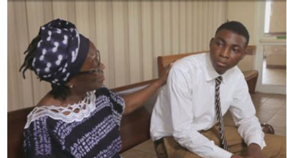

I know God will help me. So with my list and the Spirit, I do what matters most.

- 4. Learn the vocabulary: prepare, perform, labor, improve
- 5. Read aloud. Then listen.

*"For behold, this life is the time for men to prepare to meet God; yea, behold the day of this life is the day for men to perform their labors"* (Alma 34:32).

- 6. Ponder: Why is time one of God's greatest gifts?
- 7. Write three ways you can **improve** how you use your time.
- 8. Speak: Tell someone how you will **improve** your use of time.