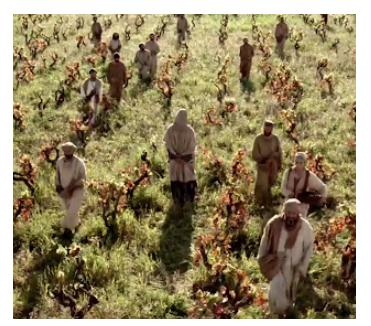
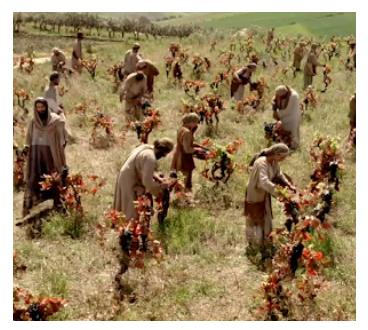
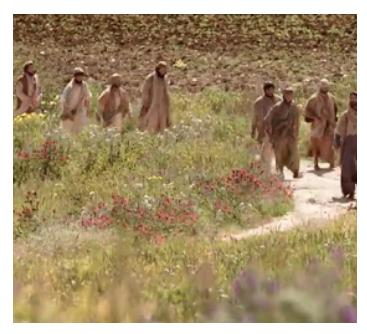

### **ENGLISHCONNECT 1 LESSON 15: JOBS AND CAREERS**

### **CONVERSATION: I'M LOOKING FOR A NEW JOB**

| A. Listen.                            |                      | B. Listen and repeat. C. Write the missing word. |  | D. Read aloud. |
|---------------------------------------|----------------------|--------------------------------------------------|--|----------------|
| 1. Hey, James, I'm                    |                      | for a new job.                                   |  |                |
| 2. Really, Lan?                       | ?                    |                                                  |  |                |
| 3. Well, my job is only               |                      | , and I                                          |  |                |
| don't really like it.                 |                      |                                                  |  |                |
| 4. Why not? What do                   |                      | at work?                                         |  |                |
| 5. It's                               | . Every day I        | the same                                         |  |                |
| building and                          | the same people.     |                                                  |  |                |
| 6. What about you? Tell me about your |                      |                                                  |  |                |
| 7. I'm a                              | , and I like my job. |                                                  |  |                |
| 8. I like to                          | hair and             | new people.                                      |  |                |
| 9. That's great!                      |                      |                                                  |  |                |

meet Why hairstylist you do people see clean job boring part-time looking cut

### E. Read the sentence. Answer true or false.

- 1. Lan is happy about her job.
  - a. True b. False

- 2. Lan works full-time.
  - a. True
  - b. False
- 3. James likes his job.
  - a. True
  - b. False
- 4. James cleans buildings.
  - a. True
  - b. False

### **ACTIVITY 2: TALKING ABOUT JOBS**

### A. Listen. Write what you hear.

3.

### B. Look at the picture. Say what you do every day for this job. Listen to the examples.

- 1. I work full-time in a school. I teach students every day. It is difficult, but I like it.

3. I work part-time in a restaurant. I serve food to customers. It is difficult but fun.

2. I am self-employed. I write computer programs. Sometimes it's boring.

- 4. I work part-time at a store. I help customers all day. It's interesting.
- a. b. a. b.

D. Choose the correct question for the answer. Say the question aloud.

- 1. She programs computers.
- a. What does she do for work?
- b. Does she like her job?
- c. Does she work full-time or part-time?

- 2. Yes, he loves teaching.
- a. What does he do for work?
- b. Does he like his job?
- c. Where does he work?

- 3. My job is part-time.
- a. What do you do for work?
- b. Do you like your job?
- c. Do you work full-time or part-time?
- E. Choose one of the pictures. Write about the person's job. Answer the questions.

journalist mechanic salesperson

construction worker server computer programmer

 What is the person's job? Where does the person work? Does the person like his or her job? What time does the person go to work? What time does the person leave work?

What does the person do for work? Does the person work part-time or full time?

A. Listen. B. Read aloud. C. Listen to questions 1–3. Answer aloud.

My grandfather is a very interesting person. He is a full-time accountant. He works at a factory.

He doesn't like his job very much. It's boring. He likes to build things.

I love to visit Grandfather. His house is very small.

My grandfather is not a carpenter. He is not an electrician. But he built two bedrooms.

He is not a painter. But he painted the bedrooms yellow.

Grandfather likes to grow food. He is not a farmer. But he grows corn and potatoes.

He is not a fisherman. But he loves to fish because fishing is relaxing.

He is not a cook. But he cooks fish very well.

When I visit Grandfather, I sleep in a yellow bedroom. I eat potatoes and corn. I go fishing. I love Grandfather's house!

### **PRACTICE PARTNER INSTRUCTIONS**

- A. Help your practice partner review the vocabulary for this lesson in the back of this book. Make sure they understand the meaning of the vocabulary.
- B. Have him or her retell the story in Activity 3 in their own words. Ask him or her to tell you about a friend or family member who can do many things. What is the person's name? What can they do?
- C. Help your practice partner answer the questions for three of the pictures in Activity 2E.
- D. Ask your practice partner to pretend that he or she is the person in each of the pictures below. Help them say two or three sentences to describe their job.

hairstylist salesperson doctor construction worker mail carrier

### **EXPANSION ACTIVITIES: LABORERS IN THE VINEYARD**

- 1. Learn the vocabulary: vineyard, hire(s), pay (paid), generous, too late
- 2. Listen. 3. Read aloud.

Jesus tells a story about a man. The man needs people to work in his vineyard.

He hires some workers at 6:00 in the morning. They agree to work for a penny.

They are happy to work. They need money to feed their families.

Matthew 20:1–16

Later, the man needs more people. He hires more people at 9:00 a.m.

He hires people at 12:00 p.m. and 3:00 p.m.

Finally, it is the end of the day. He hires one last group of workers at 5:00 p.m.

They, too, are happy to work. They need to feed their families too.

At the end of the day, each worker gets paid. They all get the same pay. They all get one penny.

The workers who started at 6:00 a.m. are angry.

They ask, "Why do we get the same pay as the other workers? They started later than us."

The man says, "I am not being unfair to you. I can be generous with my own money. I choose to be kind to everyone."

The man is like God. He wants to bless all of His children. We are never too late to come to Him.

- 4. Learn the vocabulary: heavy laden, mistakes, beyond the reach, divine love
- 5. Read aloud. Then listen.

*"Come unto me [Jesus Christ], all ye that labour and are heavy laden, and I will give you rest"*  (Matthew 11:28).

"However many **mistakes** you feel you have made . . . you have *not* traveled **beyond the reach** of **divine love**" (Jeffery R. Holland, "The Laborers in the Vineyard," *Ensign* or *Liahona,* May 2012, 33).

- 6. Ponder: What do you need to do to come unto Jesus Christ now?
- 7. Write two things you learned from the story.
- 8. Speak: Retell this story to three people. Tell what you learned.