### **ENGLISHCONNECT 1 LESSON 16: FOOD**

### **CONVERSATION: WHAT DO YOU WANT FOR LUNCH?**

A. Listen. B. Listen and repeat. C. Write the missing word. D. Read aloud.

1. Ha-Eun, what do you want for ?

2. Do you want some ?

3. No, thanks, Marcia. I don't really fish.

4. Really? My food is fish! Why don't you like it?

5. I don't like the .

6. I usually eat for lunch.

7. Oh, we have chicken too, and chicken is .

8. Let's chicken.

9. Sounds good!

E. Read the questions about the conversation. Answer aloud. Listen to the answers.

1. Does Ha-Eun like fish? 2. Why or why not? 3. What do Ha-Eun and Marcia cook for lunch?

lunch have favorite taste fish chicken healthy like

### **ACTIVITY 2: MY FAVORITE FOODS**

A. Listen to 1–5. Choose the picture that matches.

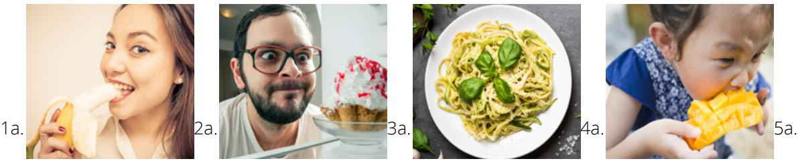

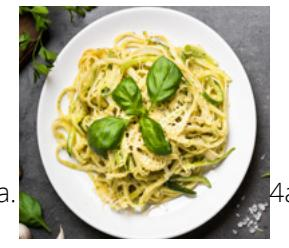

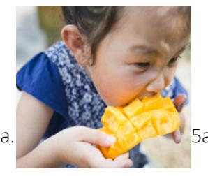

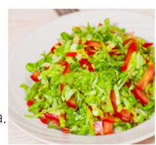

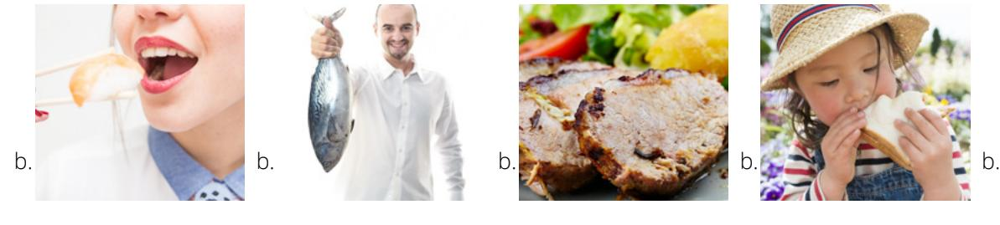

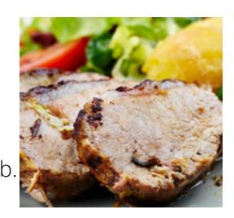

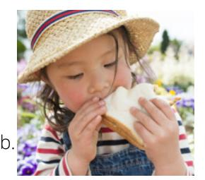

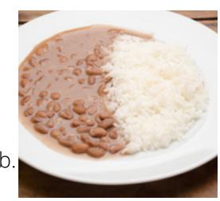

**ACTIVITY 3: WHAT DO YOU USUALLY EAT?**

A. Look at each picture. Listen to the question. Answer the question aloud. Listen to the examples.

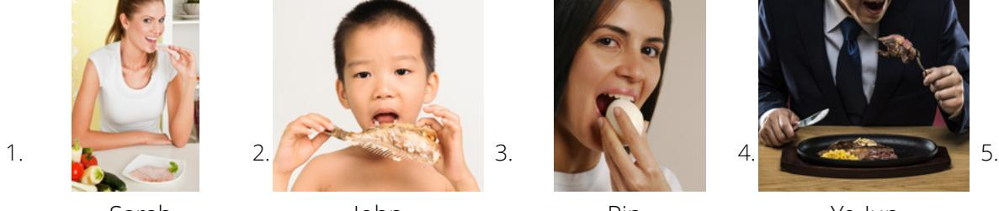

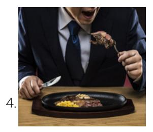

Sarah John Rin Ye-Jun Elena and Paola

### B. Look at each picture. Read the question. Write an answer to the question in a complete sentence.

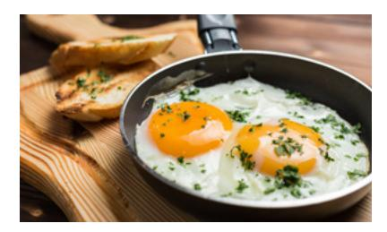

What do you usually eat for breakfast?

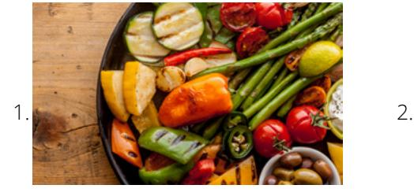

What does he usually eat for lunch? What does she usually eat for dinner?

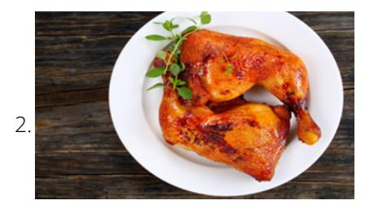

### **I usually eat eggs for breakfast.**

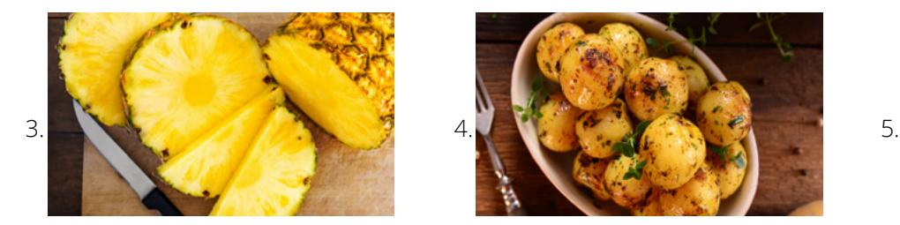

What do they usually eat for breakfast?

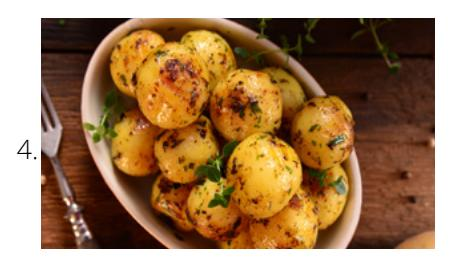

What do you usually eat for dinner? What do you usually eat for lunch?

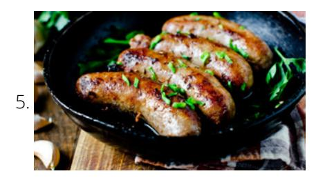

### **ACTIVITY 4: A MOVIE REVIEW OF** *THE HUNDRED-FOOT JOURNEY*

### A. Listen to the story.

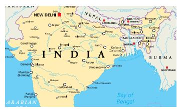

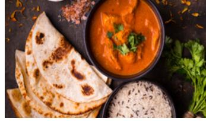

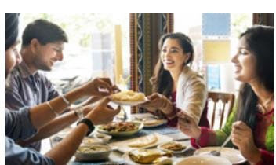

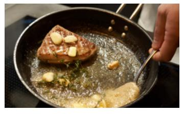

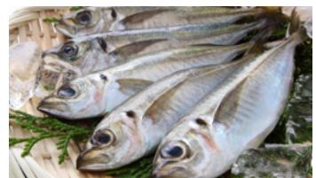

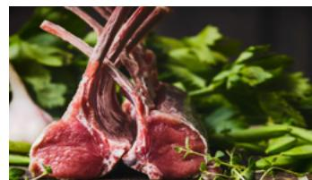

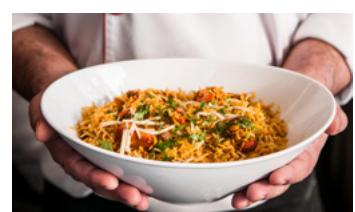

- Madame Mallory sees what Hassan serves. Hassan moves to France.
- The storekeeper has no fish or lamb.
- **1** Hassan lives in India.
- Hassan has an Indian restaurant.
- Madame Mallory doesn't like Indian food.

### B. Number the sentences in the correct order. C. Listen to sentences 1–5. Write what you hear.

| 1. |  |  |  |
|----|--|--|--|
|    |  |  |  |
|    |  |  |  |

- 2.
- 3. 4.
- 5.

### **ACTIVITY 5: WHAT IS YOUR FAVORITE FOOD?**

A. Read each conversation. B. Write your answer to the question in a complete sentence.

Alex: Ricky, what is your favorite food? Ricky: Lamb is my favorite food. Alex: Really? Why do you like it? Ricky: It's a little salty and delicious.

1. What is Ricky's favorite food?

2. Why does he like it?

Marisa: Alexandra, do you like squash?

Alexandra: No, not at all. Marisa: Really? Why not?

Alexandra: It's gross. I don't like the

texture.

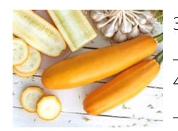

3. Does Alexandra like squash?

4. Why or why not?

Pete: Milan, do you like milk?

Milan: Yes, I like it. It's healthy and sweet.

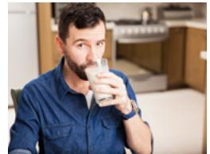

5. Does Milan like milk?

6. Why or why not?

### **ACTIVITY 6: WRITE ABOUT YOUR FAVORITE FOODS**

A. Write about two of your favorite foods. Why are they your favorite?

My favorite food is chicken enchiladas. It is chicken with tortillas, cheese, and green chiles. I like it because Example:

it is salty and spicy.

My other favorite food is squash soup. I like the taste. I like that it is warm when I am cold.

# **PRACTICE PARTNER INSTRUCTIONS**

- A. Help your practice partner review the vocabulary for this lesson in the back of this book. Make sure they understand the meaning of the vocabulary.
- B. Have your practice partner tell you the story in Activity 4. Ask them questions about the pictures. How does the story end?
- C. Look at the pictures in Activity 3A. Help your partner form questions and answers for each picture—for example, "What does Sarah usually eat? Sarah usually eats ham."
- D. Talk about what you usually eat. Ask your practice partner: "What do you usually eat for breakfast? lunch? dinner?" Let them ask you the same questions.
- E. Take turns talking about foods that you like. Ask your practice partner to tell you about their favorite foods. Ask them why they like them. Then let them ask you the same questions.

1. Learn the vocabulary: conquered, youth, obey, decide (decided), servant, healthy, worried, wise

2. Listen. 3. Read aloud.

Daniel 1:3–20

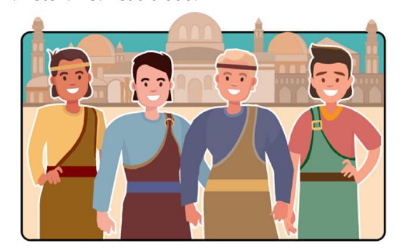

The king of Babylon conquered the Jews and took some of their youth to live in his house.

Four of them were Daniel, Shadrach, Meshach, and Abed-nego.

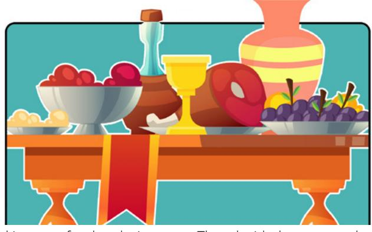

The king sent food and wine to the youth. Daniel and his friends wanted to obey God. God said that they should not eat this food. It was not good for them.

They decided to not eat the food or drink the wine. They asked the king's servant to bring them healthy food and water instead.

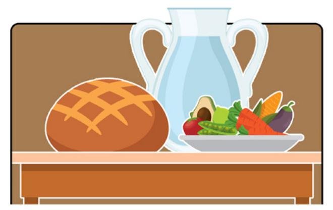

The servant was worried, "The king will be angry," he said. Daniel said, "Give us healthy food for 10 days. And water to drink. We will show that God's way is best."

The servant gave Daniel and his friends healthy food. He gave them water to drink.

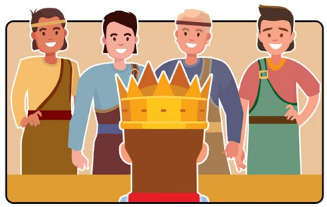

After 10 days, Daniel and his friends looked healthier than the other youth.

God blessed Daniel and his friends because they obeyed Him. He made them strong and wise.

- 4. Learn the vocabulary: revealed, physical, benefit, navel, marrow, bones, treasures, weary
- 5. Read aloud. Then listen.

"The Word of Wisdom is a law of health **revealed** by the Lord for our **physical** and spiritual benefit" ("Word of Wisdom," *True to the Faith* [2004], 186; see also Doctrine and Covenants 89).

*"And all saints who remember to keep and do these sayings . . . shall receive health in their navel and marrow to their bones; and shall find wisdom and great treasures of knowledge, even hidden treasures; and shall run and not be weary, and shall walk and not faint"* (Doctrine and Covenants 89:18–20).

- 6. Ponder: What are the blessings of obeying God's law of health, the Word of Wisdom?
- 7. Write a list of blessings that you can receive from obeying the Word of Wisdom.
- 8. Speak: Tell three people about the blessings you can receive from obeying the Word of Wisdom.

### **CONVERSATION: WHERE DO YOU LIKE TO EAT?**

A. Listen. B. Listen and repeat. C. Write the missing word. D. Read aloud.

- 1. Hey, A-Ra, I'm .
- 2. you want to get lunch?
- 3. Sure, Steven. That good.
- 4. Where do you to eat?
- 5. I like to eat at the .
- 6. The are delicious.
- 7. OK. Let's go.

Do sounds sandwiches hungry cafe like

### **ACTIVITY 2: WHERE DO YOU LIKE TO EAT?**

A. Listen to conversations 1–5. Number the correct picture.

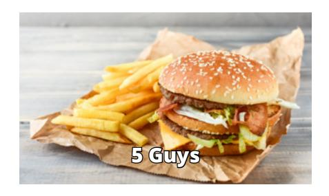

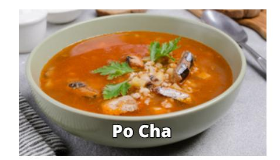

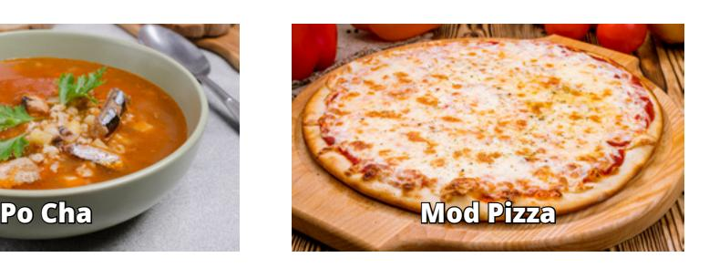

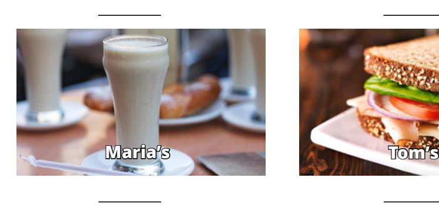

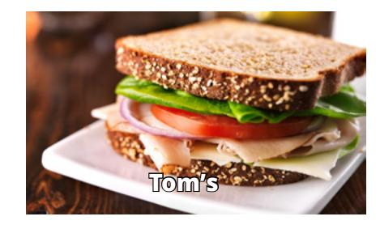

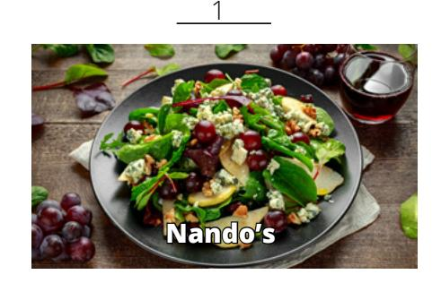

- B. Read what you can eat at the restaurants. Choose one. Read and answer the questions aloud. Listen to the examples.
- 1. Where do you like to eat? What do you like to eat there?

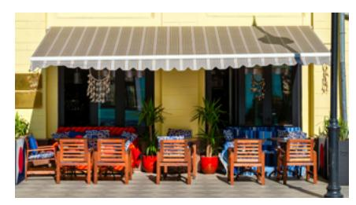

The Cafe serves sandwiches and drinks.

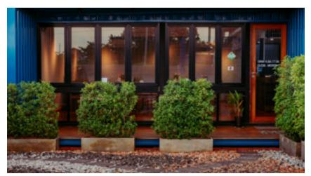

The China Grill serves chicken, pork, and rice.

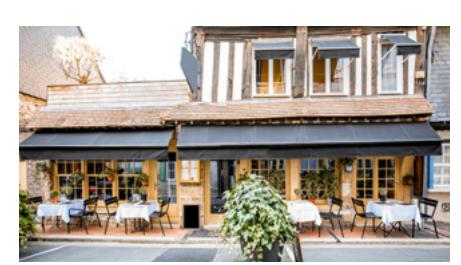

Motcombs serves expensive fish and steak.

Noodles and Company serves many different pastas.

Yoshinoya serves Japanese and American food.

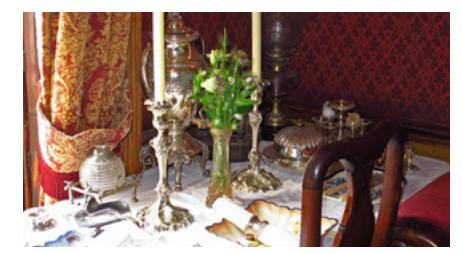

Sherlock Holmes serves soups, salads, and sandwiches.

C. Read. Then choose the correct answer for the questions.

Anoush likes to eat spicy food with beans and rice. She doesn't like to

- eat sandwiches.
- 1. Where does Anoush like to eat?
  - a. Punta Cana
  - b. Subway Sandwiches

Maro likes to sit outside with his friends when he eats. He doesn't like to eat seafood.

- 2. Where does Maro like to eat?
  - a. Cafe Montmartre
  - b. Joe's Crab Shack

Jean likes to eat pizza with his friends. He doesn't like to eat barbecue chicken or pork.

- 3. Where doesn't Jean like to eat?
  - a. Little Italy Pizza
  - b. Dickey's BBQ Pit

| D. Write about your favorite restaurant. What restaurant is it? What do you order there? |  |
|------------------------------------------------------------------------------------------|--|
|------------------------------------------------------------------------------------------|--|

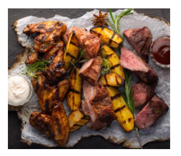

I like to go to Smokie's BBQ near my house. I like to order a meal that has pork, beef, and chicken. It is delicious. Example

### **ACTIVITY 3: I'D LIKE TO ORDER . . .**

A. Look at the pictures. Order the food in the pictures. Listen to examples 1–4.

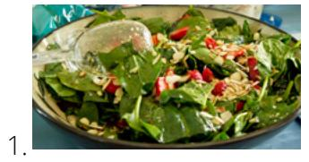

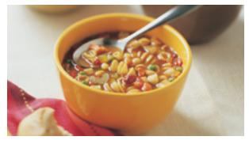

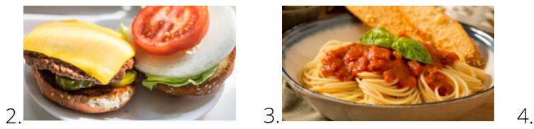

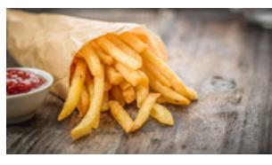

2.

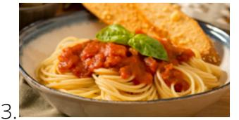

B. Listen to conversations 1–4. Then write what each person orders.

| 1. | He orders tomato soup. |
|----|------------------------|
|    |                        |

| 3. |  |
|----|--|

4.

### A. Listen to the story.

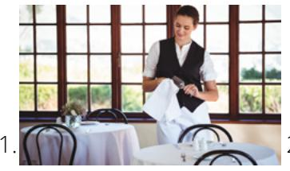

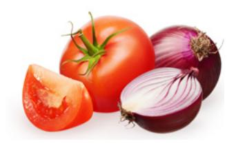

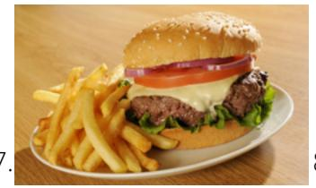

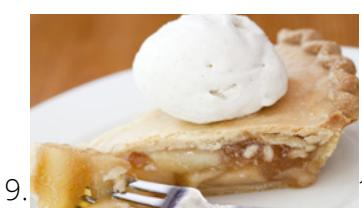

### B. Check all of the answers that are correct.

□ onions

□ lettuce

☐ ice cream

- 1. What does Ben like to eat?
  - □ cheese □ soup □ beef □ chicken
  - □ bread
  - □ tomatoes
  - □ apple pie

- 2. What does Sandra like to eat?
  - ☐ soup
  - □ beef
  - □ bread
  - □ tomatoes □ apple pie
- □ cheese
- □ chicken □ onions
- □ lettuce

☐ ice cream

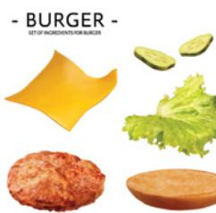

### PRACTICE PARTNER INSTRUCTIONS

- Help your practice partner talk about their favorite restaurant. "What is your favorite restaurant?" "Why В. do you like it?" "What do you order there?" "What restaurant don't you like?" "Why don't you like it?"
- C. Ask your practice partner, "How often do you eat in restaurants? Who do you eat out with? What restaurants do you usually go to? What do you order?" Then let them ask you the same questions.
- D. Look at the restaurants below. Take turns asking, "Where do you/don't you like to eat? What do you like to eat there? Why do you/don't you like to eat there?" Ask the same questions about the restaurants in Activity 2B.

Hong's Kitchen serves Chinese food like rice and pork.

Hattie B's serves fried chicken.

Cafe Rouge serves beef and chicken with potatoes.

### **EXPANSION ACTIVITIES: SEA BISCUIT MIRACLE**

- 1. Learn the vocabulary: widow, handcart, sea biscuit, trunk, lid, miracle, enough
- 2. Listen. 3. Read aloud.

In 1856, Anne Rowley came to Utah by handcart. Anne was a widow. She had her seven children with her.

The journey was very difficult. One night, the family had no food to eat.

Anne said, "I got on my knees to pray. I asked for God's help."

She remembered two hard sea biscuits. They were in her trunk. They were small and too hard to eat. It wasn't enough for 8 people.

She thought, "Jesus fed 5,000 people. He only had 5 loaves of bread and 2 fish. Nothing is impossible with God's help."

She put the biscuits in a pot. She covered them with water. She put the lid on the pot. She put the pot on the fire to cook.

She prayed and asked God to bless them.

Later, she lifted the lid. The pot was filled with food. It was a miracle!

Anne knelt down with her family. They thanked God for His goodness. That night the family had enough to eat.

- 4. Learn the vocabulary: faith, precedes, miracle, among
- 5. Read aloud. Then listen. "**Faith precedes** the miracle" (Thomas S. Monson, in "Faith Precedes the Miracle" [video], ChurchofJesusChrist.org). *"For if there be no faith among the children of men God can do no miracle among them; wherefore, he showed not himself until after their faith"* (Ether 12:12).
- 6. Ponder: Why does **faith** come before **miracles**? Why don't **miracles** happen each time you need one?
- 7. Write about a miracle in your life. Write as much as you can.

8. Speak: Tell three people about a miracle in your life.