### **ENGLISHCONNECT 1 LESSON 19: MONEY**

### **CONVERSATION: HOW MUCH DO THOSE COST?**

A. Listen. B. Listen and repeat. C. Write the missing word. D. Read aloud.

1. Excuse me, I'd like to some pants.

2. How much do those blue pants ?

3. dollars.

4. Fifty dollars?! I pants, but those are too for me.

How much do the red pants cost?

5. .

6. OK, great! I'd like to buy .

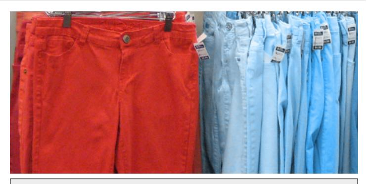

 cost buy Fifty use need expensive those cheap Twenty-five

### **ACTIVITY 2: PRICES**

A. Study the chart. B. Listen to 1–4, and repeat.

| Asking about Prices                                                         |                                                |
|-----------------------------------------------------------------------------|------------------------------------------------|
| Question                                                                    | Answer                                         |
| 1. How much is this shirt?                                               | \$12. It's \$12.                            |
| 2. How much are those shoes?                                             | \$25. They're \$25.                         |
| 3. How much does the car cost?                                           | \$9,000. It's \$9,000. It costs \$9,000. |
| 4. How much do the apples cost?                                          | \$4. They're \$4. They cost \$4.         |
| For singular (1): use is, does, it's. For plural (2+): use are, do, they're |                                                |

C. Look at each picture. Say aloud what it is and how much it costs. Listen.

1. skirt \$14

2. tie \$21

3. shoes \$45

4. phone \$140

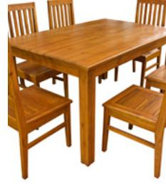

5. table \$399

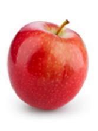

6. apple \$1

 D. Look at the picture. Write what the item is on the line. Ask aloud how much the item costs. Listen to the examples. Decide if you'd like to buy the item.

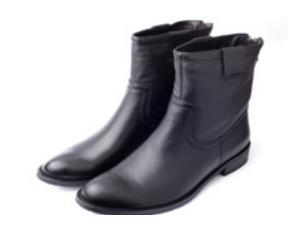

1. a. I'd like to buy them. b. I don't need those.

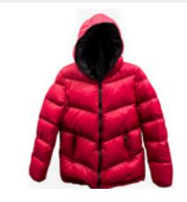

2. a. I'd like to buy it. b. I don't need it.

3. a. I'd like to buy it. b. I don't need it.

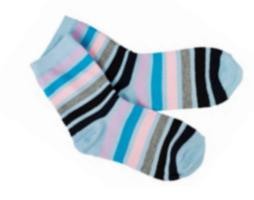

4. a. I'd like to buy them. b. I don't need them.

E. Look at each picture. Read the price. Write a question to ask for the price.

Example:

 **How much does the chicken cost?** or **How much is the chicken?**

Answer: It's \$7.

1. Answer: It's \$4. 3. Answer: It's \$4. strawberries 2. Answer: They're \$5. fish 4. Answer: They're \$5. watermelon beans

### **ACTIVITY 3: I'D LIKE TO BUY IT**

A. Listen to the conversation. Then answer the question that follows.

- 1. Does Kate buy the sweater?
- a. Yes, because it's cheap.
- b. Yes, because it's pretty.
- c. No, because she doesn't like it.
- d. No, because it's expensive.

- 2. Does Emir buy the phone?
- a. Yes, because it's a good price.
- b. Yes, because he needs it.
- c. No, because it's expensive.
- d. No, because it's not new.

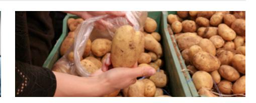

- 3. What does Claudia buy?
- a. 1 pound of potatoes
- b. 2 pounds of potatoes
- c. 8 pounds of potatoes
- d. 10 pounds of potatoes
- B. Look at the pictures and prices below. Say the one you want to buy and why, *or* say that you don't want to buy one of them and why. Listen to the examples.

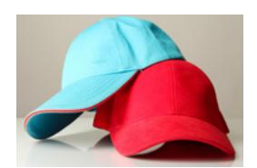

1. blue hat: \$15 red hat \$12

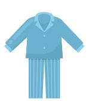

2. blue pajamas: \$43 green pajamas \$23

3. purple shoes: \$50 black shoes: \$17

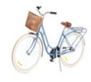

4. black bike: \$1,100 blue bike \$148

### **ACTIVITY 4: A BIRTHDAY SURPRISE**

A. Listen to the story. Finish the sentences.

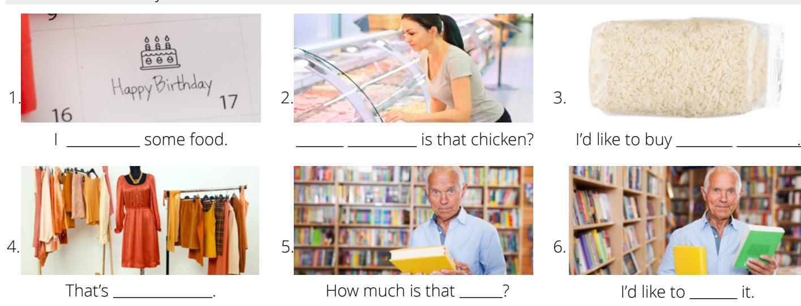

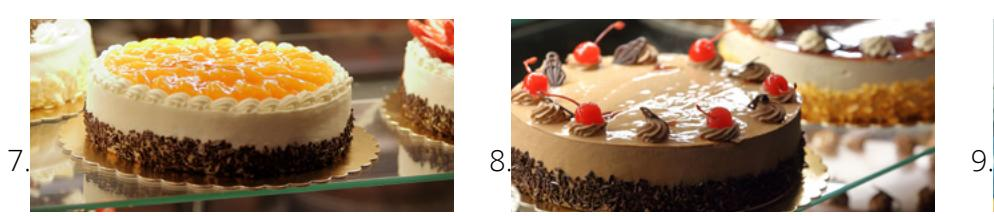

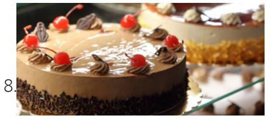

The lemon cake is . She loves . It's my birthday!

B. What things did the friend buy for Sarah's birthday? Write a list.

| 1. |              |         |            |       |                |  |
|----|--------------|---------|------------|-------|----------------|--|
| 2. | rice         | chicken | pork       | dress | old book       |  |
| 3. | popular book |         | lemon cake |       | chocolate cake |  |
| 4. |              |         |            |       |                |  |
|    |              |         |            |       |                |  |

### **PRACTICE PARTNER INSTRUCTIONS**

- A. Help your practice partner review the vocabulary for this lesson in the back of this book. Make sure they understand the meaning of the vocabulary.
- B. Help them retell the story in Activity 4. Ask questions: "How much is the chicken? How much does the orange dress cost? Why is the book so expensive? How much is the popular book? Is the friend surprised? Why? Have you ever surprised a friend? What did you buy?"
- C. Look at the pictures in Activity 2C, 2D, and 3B. Take turns asking each other how much each item costs. Say whether you would buy it or not.
- D. Imagine you have \$100 to buy things for school. Look at the pictures. Say two things you would like to buy and two things you don't want to buy. Explain why. Ask your partner to do the same thing.

book \$60 computer \$95 pen \$3 alarm clock \$10 batteries \$7 pencils \$4

- 1. Learn the vocabulary: rich, heaven, obey, commandments, poor, follow, give away

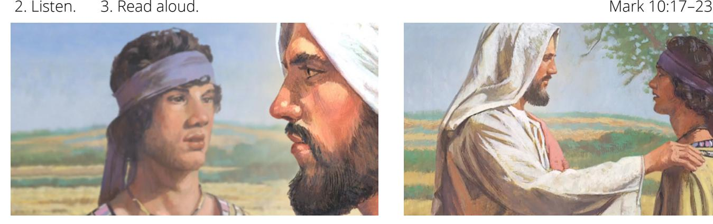

One day a rich young man came to see Jesus. He asked Jesus, "What do I need to do to go to heaven?" Jesus told him to obey all the commandments. The rich young man said he always obeyed the commandments.

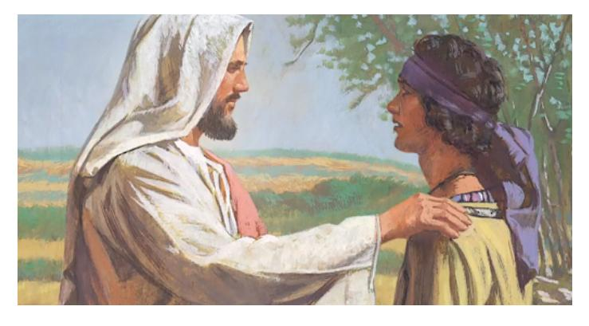

Jesus told the young man to do one more thing. He said, "Sell everything you have. Give the money to the poor. Then, follow me."

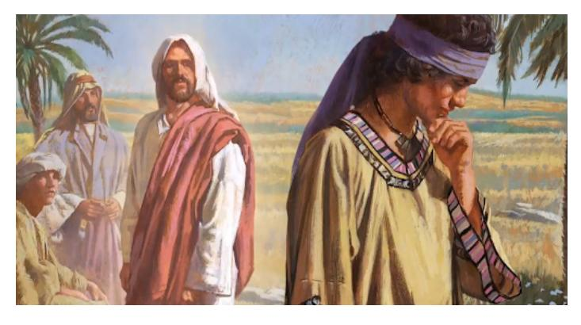

The young man felt sad. He did not want to give away everything he had. He left Jesus. Jesus said it is hard for people who love riches to go to heaven.

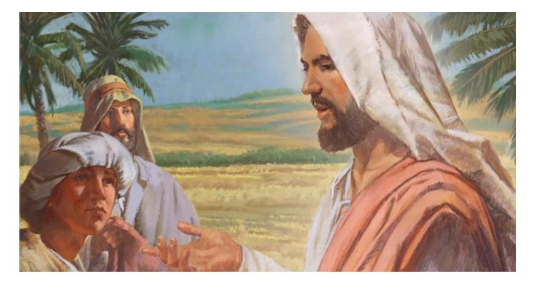

Jesus also said we should trust God and love Him more than anything else. Then we can live with Him in heaven.

- 4. Learn the vocabulary: before, riches, seek for, beggars, depend upon, more than
- 5. Read aloud. Then listen.

 *"But before ye seek for riches, seek ye for the kingdom of God"* (Jacob 2:18).

"*For behold, are we not all beggars? Do we not all depend upon . . . God . . . for all the riches which we have of every kind?"* (Mosiah 4:19).

- 6. Ponder: How can you increase your love for God?
- 7. Write a list of five things you can do to increase your love for God.
- 8. Speak: Talk about how you can learn to love God more than anything else.