### **ENGLISHCONNECT 1 LESSON 20: HOME**

### **CONVERSATION: WHERE DO YOU LIVE?**

| A. Listen. | B. Listen and repeat. C. Write the missing word. | D. Read aloud. |
|------------|--------------------------------------------------|----------------|
|            |                                                  |                |

| 1. do you live? |
|--------------------|
|                    |

2. I in an apartment in New York City.

3. Do you like your ?

4. It's very but it's not very .

5. It only has one .

6. I like the though.

7. Do you have a ?

8. No. Most in New York City don't have a garage.

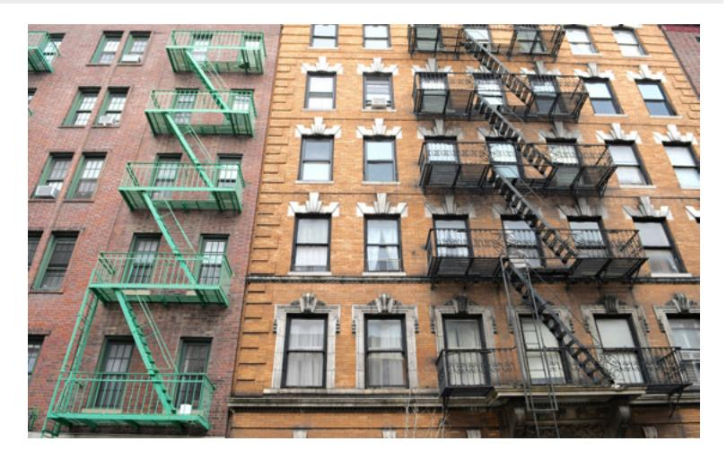

big live bedroom nice garage Where apartments kitchen apartment

### **ACTIVITY 2: ARTICLES AND PREPOSITIONS**

A. Study the chart. Listen and repeat.

| a and an                    |                                                            |  |  |  |
|-----------------------------|------------------------------------------------------------|--|--|--|
| a: before a consonant sound | a house, a teacher, a dress, a bed             |  |  |  |
| an: before a vowel sound    | apartment, an onion, an egg, an alarm clock an |  |  |  |

### B. Write the missing word.

- 1. I am teacher.
- 3. This is orange.
- 5. I have a question. I have answer.

- 2. We need new table.
- 4. My bed is in bedroom.
- 6. This is beautiful dress.

### C. Read the words. Listen and repeat.

1. next to 2. to the left of 3. to the right of 4. on top of

5. on the bottom of 6. in 7. on 8. above

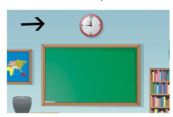

# **ACTIVITY 3: WHERE IS IT?**

 A. Look at the picture of the house. Write the names of the rooms.

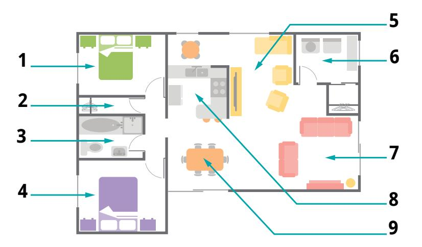

- B. Listen to the question. Choose the correct answer.
- 1. a. the living room
- b. the bedroom
- c. the closet
- 3.
- a. the kitchen
- b. the bathroom
- c. the bedroom
- 5. a. the kitchen

  - b. the laundry room
  - c. the bathroom

- 2. a. the family room
- b. the laundry room
- c. the kitchen
- 4.
- a. the bedroom
- b. the bathroom
- c. the kitchen
- 6.
- a. the kitchen
- b. the bathroom
- c. the family room

### C. Look at the picture. Finish the sentences.

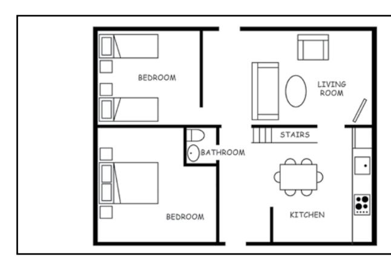

- 1. The is to the left of the kitchen.
- 2. The is in the top right corner.
- 3. A is in the bottom left corner.
- 4. The stairs are close to the .
- D. Look at the picture. Answer the questions aloud, and then listen to the answers.
  - 1. Where is the clock?
  - 2. Where is the bed?
  - 3. Where is the window?
  - 4. Where is the mirror?
  - 5. Where are the pillows?

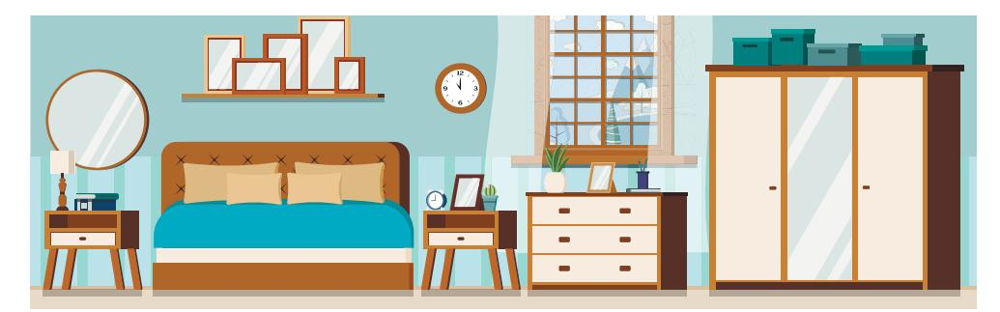

- E. Read and listen to the questions about your house or apartment. Answer aloud. Listen to the examples.
  - 1. How many bedrooms does your home have ? 4. How many closets do you have?

- 3. How many bathrooms do you have? 6. Do you have a living room?
- 2. Do you have a garage? 5. Is your kitchen big or small?
- F. Write about your home (color, size, rooms). Do you like it? Why or why not?

### **ACTIVITY 4: MOSHE SAFDIE'S AMAZING APARTMENTS**

A. Listen to the story. Finish the sentences.

Do you live in a or an

?

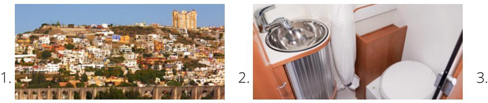

My is too small.

A yard is .

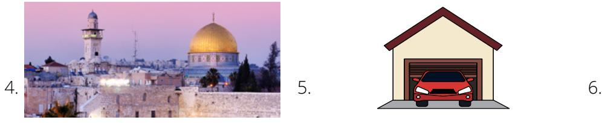

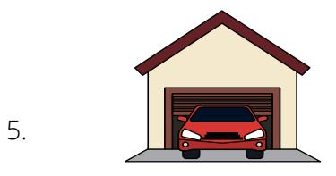

Moshe Safdie is an . He doesn't say, "You need a ." is important.

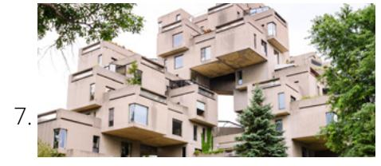

He built apartment building. They have . The pool is the hotel.

### **PRACTICE PARTNER INSTRUCTIONS**

- A. Help your practice partner review the vocabulary for this lesson in the back of this book. Make sure they understand the meaning of the vocabulary.
- B. Help them retell the story in Activity 4. Ask: "Do you want to live in Moshe's apartment? Why or why not? Do you want to swim in the hotel swimming pool? Why or why not?"
- C. Look at the questions in Activities 3E and 3F. Take turns asking each other questions about your home. Ask as much as you can. For example, ask: "Do you live in a house or an apartment? What color is your home? How old is your home? Do you like the floor plan?"
- D. Look at the floor plan in Activity 3A. Ask your partner questions about the floor plan. For example, ask: "Where is the kitchen?"
- E. Both you and your practice partner label a floor plan for your dream house or apartment. Don't look at your partner's floor plan. Describe your floor plan to your partner. Your partner should draw your floor plan as you describe it. Now try to draw your partner's floor plan as he or she describes it.

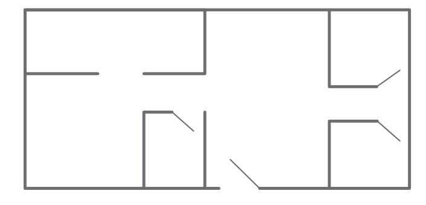

### **EXPANSION ACTIVITIES: BOBBIE THE WONDER DOG**

- 1. Learn the vocabulary: vacation, attacked, search, broken heart, cross (verb), damaged, overjoyed
- 2. Listen. 3. Read aloud.

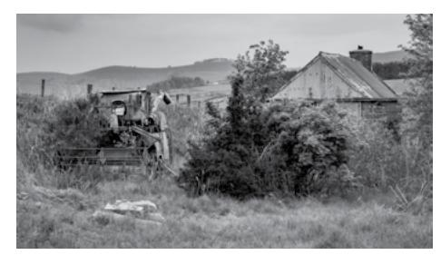

It is 1923. A family from Oregon is on vacation in Indiana. They are 2,500 miles (about 4,000 km) from home.

Their dog, Bobbie, is attacked by other dogs. He runs away. The family searches everywhere for Bobbie. They can't find him.

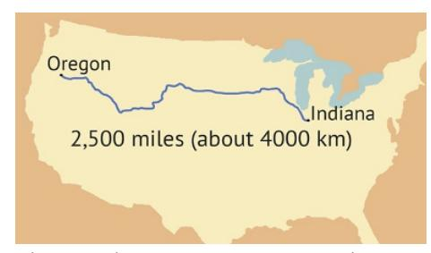

They go home to Oregon with broken hearts.

For six months, Bobbie tries to get home. He walks and walks.

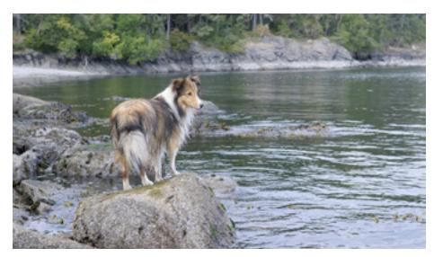

He swims across rivers. He crosses mountains. He runs through snow.

Many people feed Bobbie. Some give him a place to sleep. A woman takes care of his feet.

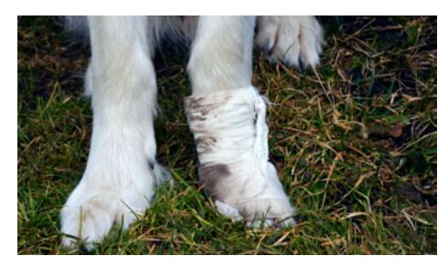

Finally, Bobbie arrives home. He is dirty and thin. His feet are badly damaged.

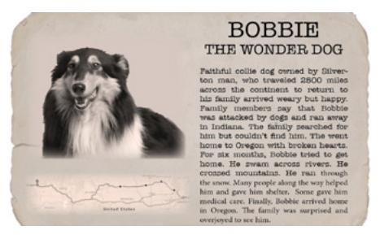

The family is surprised and Bobbie just wanted to go home. overjoyed to see him. The newspaper calls him Bobbie the Wonder Dog.

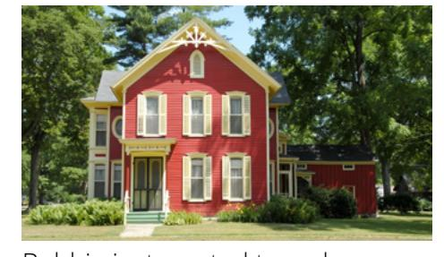

- 4. Learn the vocabulary: choices, choose, return, lose, point, degree, sacrifice, longing
- 5. Read aloud. Then listen.

"The greatest of all **choices** [God's children] may make is to **choose** to **return** to Him" (Russell M. Nelson, "Begin with the End in Mind" [address given at a seminar for new mission leaders, June 2014]).

- 6. Ponder: Do you ever feel a **longing** for your heavenly home? If so, why?
- 7. Write some things you can do that will help you return home to God.
- 8. Speak: Talk about how Bobbie's story is like trying to return home to God.

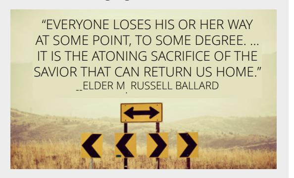