### **ENGLISHCONNECT 1 LESSON 21: HOME**

### **CONVERSATION: I'M GLAD YOU'RE VISITING**

| A. Listen. | B. Listen and repeat. | C. Write the missing word. | D. Read aloud. |
|------------|-----------------------|----------------------------|----------------|
|            |                       |                            |                |

- 1. This is the .
- 2. There are extra and in the closet if you need them.
- 3. There's the .
- 4. towels in the cupboard.
- 5. This is !

soap under the sink.

6. I'm glad you're !

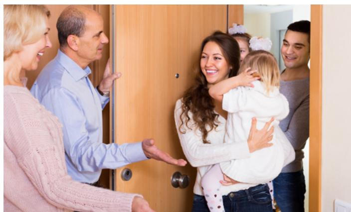

|  | bedroom | wonderful | pillows | There is | visiting | blankets | bathroom | There are |
|--|---------|-----------|---------|----------|----------|----------|----------|-----------|
|--|---------|-----------|---------|----------|----------|----------|----------|-----------|

### E. Answer the questions.

- 1. What is in the closet?
  - a. extra pillows
  - b. extra towels
  - c. extra soap

- 2. Which room is small?
  - a. the kitchen
  - b. the bedroom
  - c. the bathroom
- 3. What is in the cupboard?
  - a. towels
  - b. soap
  - c. blankets

### **ACTIVITY 2: THERE IS/THERE ARE**

### A. Study the chart.

|          | There is + (singular noun) + | (place) .       |
|----------|------------------------------|-----------------|
| There is | a mirror                     | above the sink. |
| There is | a closet                     | in the bedroom. |

|           | There are + (plural noun) + | (place) .        |
|-----------|-----------------------------|------------------|
| There are | two pillows                 | on the bed.      |
| There are | towels                      | in the bathroom. |

### B. Read the sentence. Listen and repeat.

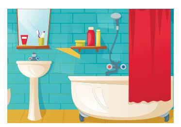

1. There is a mirror above the sink.

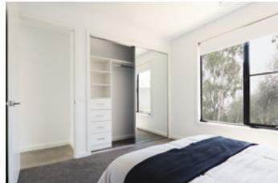

2. There is a closet in the bedroom.

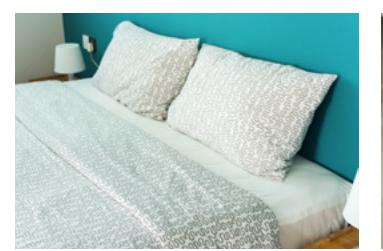

3. There are two pillows on the bed.

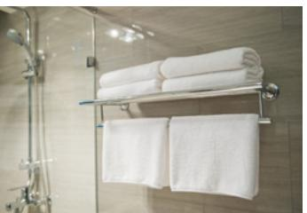

4. There are towels in the bathroom.

# C. Write the missing word. Say the sentence aloud.

- 1. There a shower in the bathroom.
- 2. There nightstands in the bedroom.
- 3. There lamps on the nightstands.

- 4. There a closet in the bathroom.
- 5. There drawers in the cupboard.
- 6. There a sink in the bathroom.

D. Look at the picture of the bedroom below. Talk about what is in the bedroom. Listen to the examples.

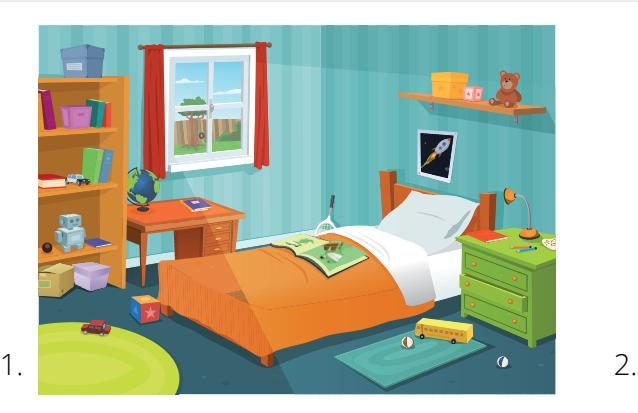

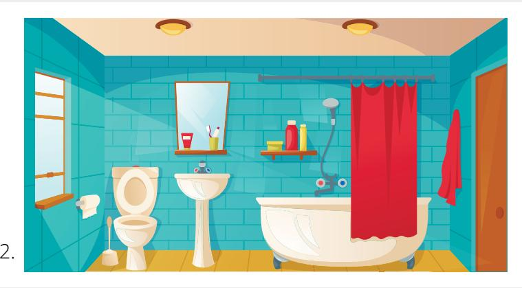

E. Look at the picture of the bathroom above. Write 5 sentences about things in the bathroom.

### **ACTIVITY 3: WHERE IS THE . . . ?**

A. Answer the questions aloud. Then listen to the answers.

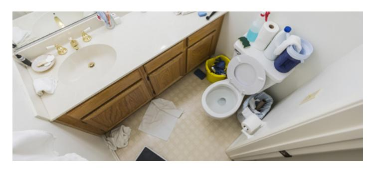

- 1. Where is the mirror?
- 2. Where is the toilet?
- 3. Where is the sink?
- 4. Is the bathroom tidy or messy?

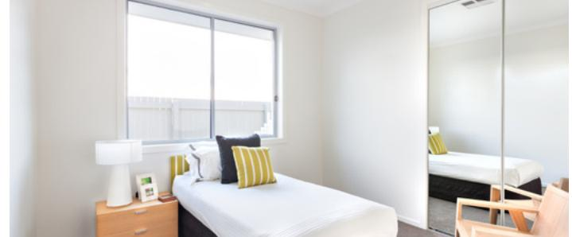

- 5. Is the bedroom tidy or messy?
- 6. Where is the bed?
- 7. Where are the pillows?
- 8. Where is the closet?

B. Look at the picture. Write an answer for each question. Use a complete sentence.

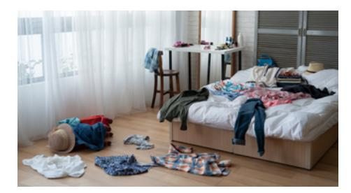

1. Is the bedroom messy or tidy?

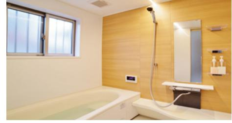

3. Is the bathroom clean or dirty?

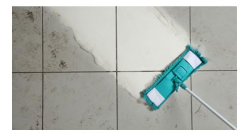

5. Is the floor dirty or clean?

2. What is on the bed?

- 4. What is under the window?
- 6. What color is the floor?

C. Look at the pictures. Listen to the descriptions. Choose the bedroom(s) that match the description.

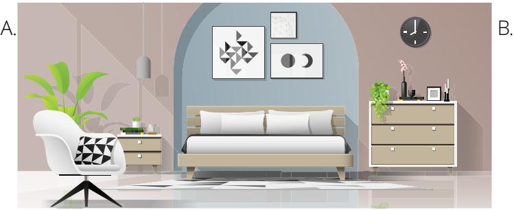

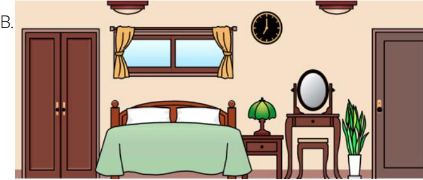

1. a. bedroom A b. bedroom B

c. both bedrooms

2. a. bedroom A b. bedroom B

c. both bedrooms

- 3. a. bedroom A
- b. bedroom B c. both bedrooms
- 4. a. bedroom A
- b. bedroom B c. both bedrooms a. bedroom A b. bedroom B c. both bedrooms

5.

- 6.
- a. bedroom A b. bedroom B
- c. both bedrooms

D. Write about your bedroom. Answer the questions. Use complete sentences.

Is your room big or small? What is in your room (bed, dresser, closet)? Where is the bed? Is there a window? What color is your room? Is your bedroom tidy or messy?

### **PRACTICE PARTNER INSTRUCTIONS**

- A. Help your practice partner review the vocabulary for this lesson in the back of this book. Make sure they understand the meaning of the vocabulary.
- B. Look at the pictures in Activity 2D and 2E. Help your practice partner use *There is* and *There are* sentences to describe both rooms. Ask: "What is in the room? Where is the \_\_\_\_\_\_\_\_\_\_\_\_?"
- C. Look at the pictures in Activity 3C. Help your practice partner describe the rooms. "Where is the bed?" "Is there a clock?" "How many pillows?" "What color is the bed?" "Where is the window?" "What else can you say?"
- D. Talk about a room in your house. Help your practice partner use *There is* and *There are* sentences to describe a room in their house. Ask: "What is in the room? Where is the \_\_\_\_\_\_\_\_\_\_\_\_?"
- E. Take turns asking each other questions about your childhood homes. "What did your bedroom look like?" "Is it big or small?" "Can you describe the bathroom or the kitchen?" Say as much as you can.
- F. Look at the pictures below. Take turns describing one of the rooms. Then guess which room was described.

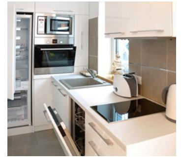

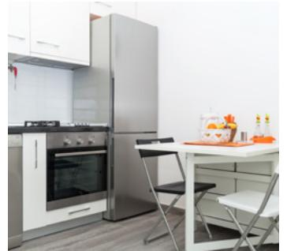

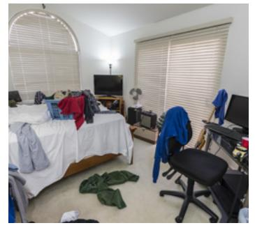

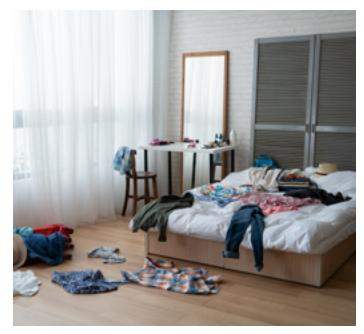

### **EXPANSION ACTIVITIES: MY BROTHER**

- 1. Learn the vocabulary: hole, fix (verb), carpet
- 2. Listen. 3. Read aloud.

In 1951, Thomas Monson is a bishop in the Church. A man says, "My brother and his family are coming from Germany. His name is Mr. Gertler. Will you look at their apartment?" "Yes," says Bishop Monson.

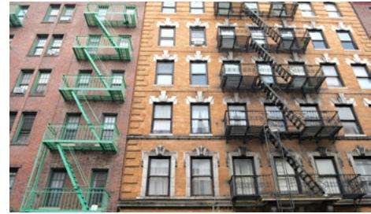

Bishop Monson looks at the apartment. The kitchen is old. The stove is bad. The cupboards are empty. The living room light is bad. The paint is dirty. The floor has a hole in it.

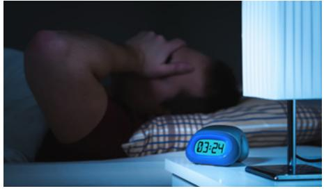

There are no blankets or pillows in the bedroom. It is a sad apartment."It is not much," says the man. "But it is better than nothing." That night Bishop Monson can't sleep.

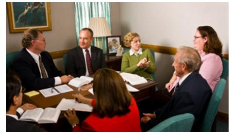

On Sunday he goes to church. Someone says, "Why are you sad?" Bishop Monson talks about the apartment. "I can fix the bad light," says one man.

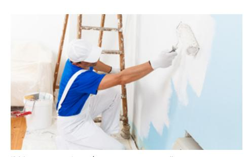

"We can paint the apartment," says another man. "We can put food in the cupboards," says a woman. "Great!" says Bishop Monson.

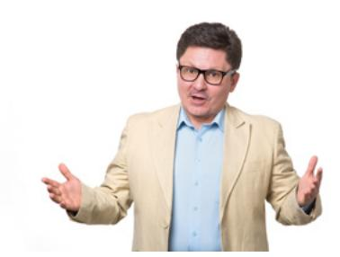

Three weeks later, Mr Gertler's family arrives. They go to the apartment. "It is not much," says the brother.

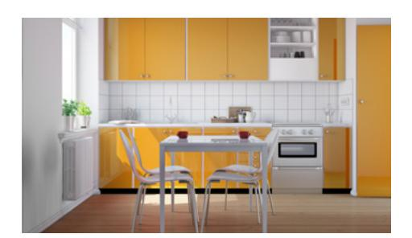

Bishop Monson opens the door. The family sees a beautiful apartment. The stove is new. The cupboards are full of food.

The carpet is soft. The paint is nice. The light is bright. There is a Christmas tree in the living room.

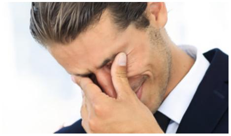

Mr. Gertler has tears in his eyes. "My brother," he says to Bishop Monson. "My brother." They sing a Christmas song. It is the best Christmas ever!

- 4. Learn the vocabulary: hunger, thirsty, serving, take someone in
- 5. Read aloud. Then listen.

And the Savior said:

*"For I was an hungred*, *and ye gave me meat: I was thirsty, and ye gave me drink: I was a stranger, and ye took me in: naked, and ye clothed me: I was sick, and ye visited me"* (Matthew 25:35–36).

.

- 6. Ponder: How does **serving** others bless your life?
- 7. Write how you can help someone this week: This week, I will
- 8. Speak: Retell this story to someone. Tell them how you will help another person this week.