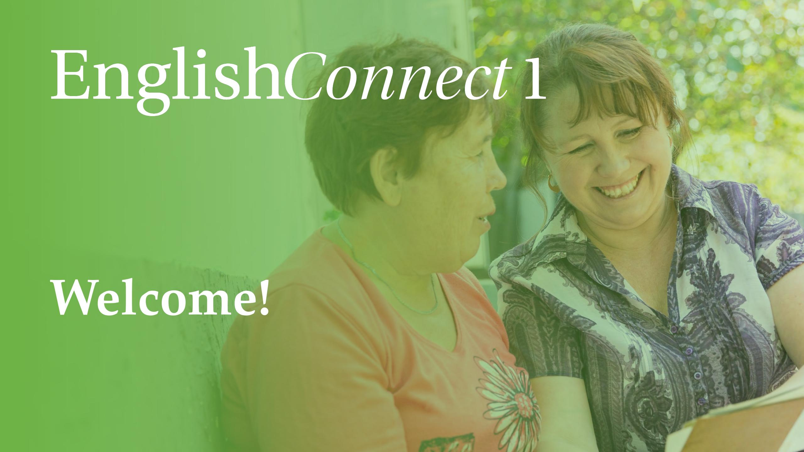

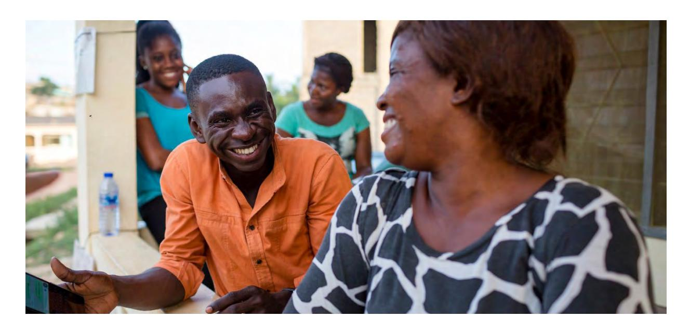

#### **Unit Introduction 1:**

*Lessons – 1 5*

# **Introducing Myself**

### **Objectives**

I will learn to:

- Introduce myself and others.
- Ask about personal information.
- Describe my hobbies and interests.
- Apply principles of learning by study and by faith.

#### **Lesson 1**

# **Introductory Lesson**

Objetivo: Aprenderé a presentarme a mí mismo y a presentar a otras personas.

# **Oración**

### **Discuss the Principle of Learning You Are a Child of God**

### *20–30 minutes*

Leer el principio de aprendizaje en voz alta. Analizar las preguntas.

*Lesson: 1*

### **You Are a Child of God**

### **Lean el principio de aprendizaje de esta lección en voz alta.**

*Soy un hijo de Dios, con un potencial y un propósito eternos.*

¿Sabías que una de las cosas más importantes que puedes hacer para lograr una meta es enfocarte en lo que crees sobre ti mismo? Tus creencias sobre tu capacidad tendrán un impacto significativo en tu esfuerzo y tus resultados. Es posible que dudes de tus capacidades debido a errores anteriores, ¡pero la buena noticia es que puedes cambiar esas creencias! Cuando cambias lo que crees sobre ti mismo, puedes cambiar tus resultados. El poder de cambiar tus creencias sobre ti mismo proviene del hecho de comprender tu verdadera naturaleza.

### **You Are a Child of God**

Eres un hijo de Dios y Él te ama. Como Su hijo, tienes un potencial y un propósito eternos. Tienes la capacidad de aprender y cambiar, y tienes la capacidad de crecer y mejorar. Dios desea ayudarte a que progreses y quiere colaborar contigo para ayudarte a alcanzar tu potencial. Colaborar con Dios para aprender inglés te ayudará a conocerlo mejor a Él y Él también te ayudaráa conocerte mejor.

### **You Are a Child of God**

Puedes orar a Dios; Él te escuchará. Puedes pedirle que te ayude a aprender inglés y puedes darle las gracias por tus bendiciones. Cuando ores, presta atención a tus pensamientos y sentimientos. Puedes saber que Dios está ahí, que te ama y quiere ayudarte. Puedes elegir creer que eres un hijo de Dios con un potencial eterno y buscar Su ayuda para aprender inglés.

### **You Are a Child of God**

### **Analicen las preguntas.**

• ¿Cómo influye en lo que crees sobre ti mismo el saber que eres un hijo de Dios?

• ¿Cómo puede ayudarte a aprender inglés el saber que eres un hijo de Dios?

# **Activity 1: Practice the Pattern**

### *15–20 minutes*

### **Part 1: Repasa la lista de vocabulario con un compañero.**

*Cuando aprendas vocabulario, enfócate en el significado y la pronunciación de cada palabra.*

### **Part 2: Practica el patrón 1 con un compañero.**

*Practica los patrones con un compañero. Tu objetivo es hacer y responder preguntas con seguridad en ti mismo y comprender lo que se dice.*

### **Part 1: Repasa la lista de vocabulario con un compañero.**

| I/my     | yo/mi                |  |  |
|----------|----------------------|--|--|
| you/your | tú/tus               |  |  |
| he/his   | él/su (de él)     |  |  |
| she/her  | ella/su (de ella) |  |  |
| no       | no                   |  |  |
| yes      | sí                   |  |  |

| name                 | nombre                     |  |  |
|----------------------|----------------------------|--|--|
| please               | por favor               |  |  |
| thank you/thanks  | gracias a ti/gracias    |  |  |
| What is … ?    | ¿Qué es…?/¿Cómo…?       |  |  |
| Nice to meet you. | Es un placer conocerte. |  |  |

### **Part 2: Practica el patrón 1 con un compañero.**

### **Practica hacer preguntas.**

*Crea todas las preguntas que puedas.*

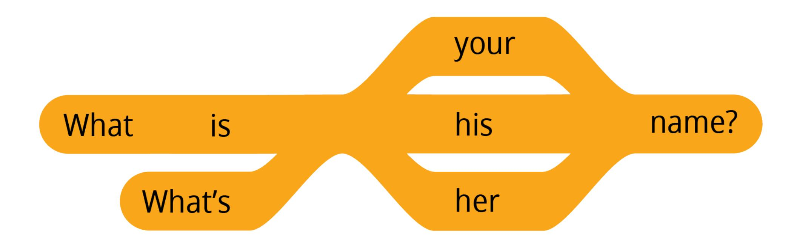

### **Part 2: Practica el patrón 1 con un compañero.**

### **Practica hacer preguntas.**

*Crea todas las preguntas que puedas.*

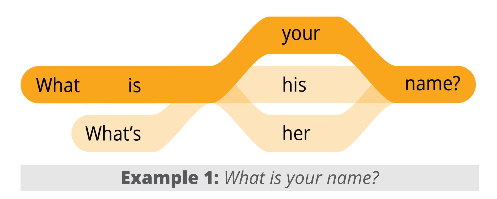

### **Practica hacer preguntas.**

*Crea todas las preguntas que puedas.*

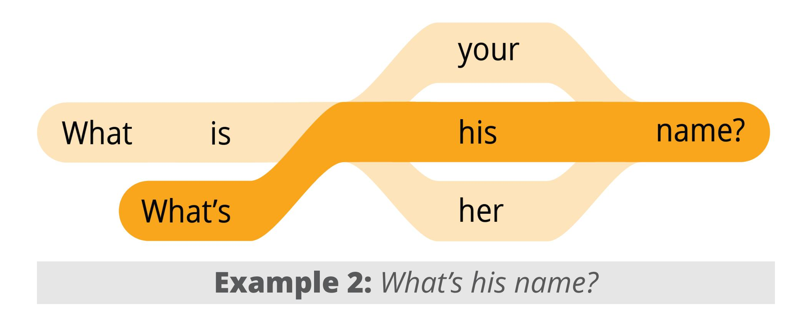

### **Practica responder preguntas.**

*Crea todas las respuestas que puedas. Puedes reemplazar las palabras subrayadas por tus propias palabras.*

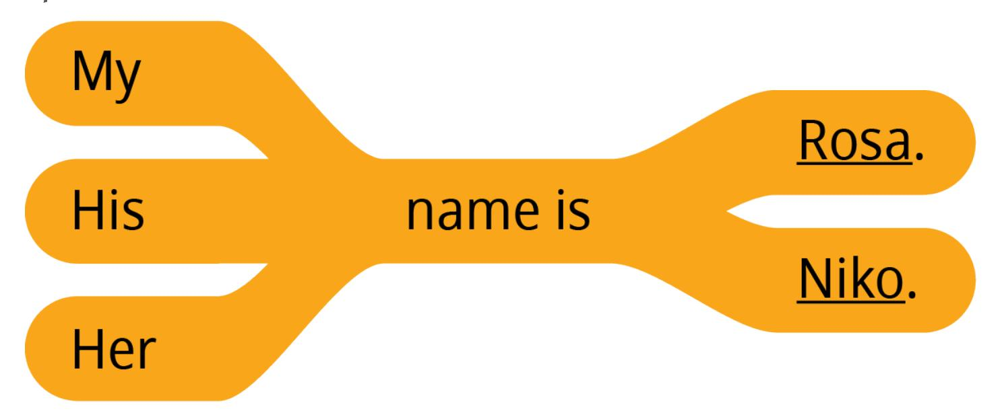

### **Practica responder preguntas.**

*Crea todas las respuestas que puedas. Puedes reemplazar las palabras subrayadas por tus propias palabras.*

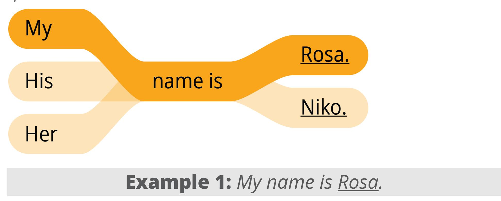

### **Practica responder preguntas.**

*Crea todas las respuestas que puedas. Puedes reemplazar las palabras subrayadas por tus propias palabras.*

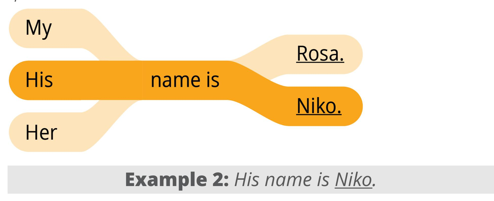

### **Part 2: Practica el patrón 1 con un compañero.**

### **Practica una conversación usando los patrones.**

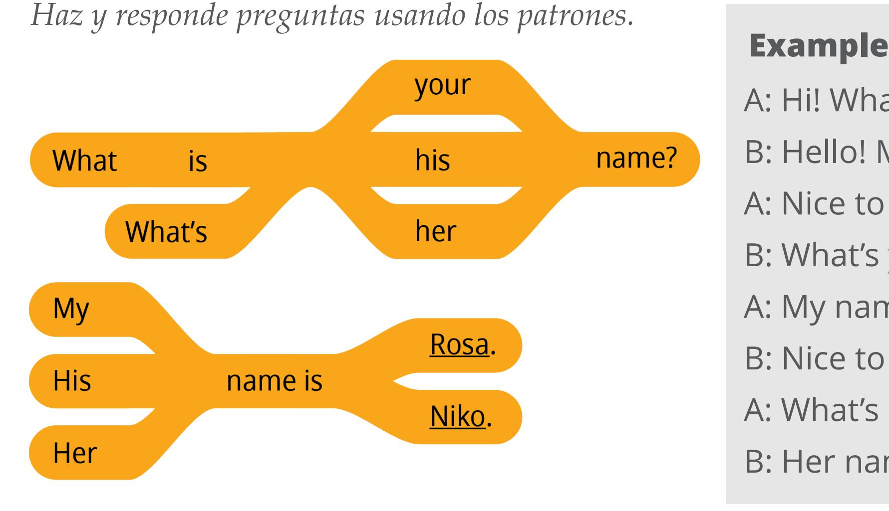

A: Hi! What is your name?

B: Hello! My name is \_\_\_\_\_\_\_\_.

A: Nice to meet you.

B: What's your name?

A: My name is \_\_\_\_\_\_\_\_.

B: Nice to meet you.

A: What's her name?

B: Her name is Rosa.

#### **5–10 minutes**

### **Activity 2: Create Your Own Sentences**

Fíjate en las ilustraciones. Haz y responde preguntas sobre el nombre de cada persona. Tomen turnos.

**Talia** A: What's her name?

> B: Her name is Talia.

**Marco Nat Mari**

**Jean Sam**

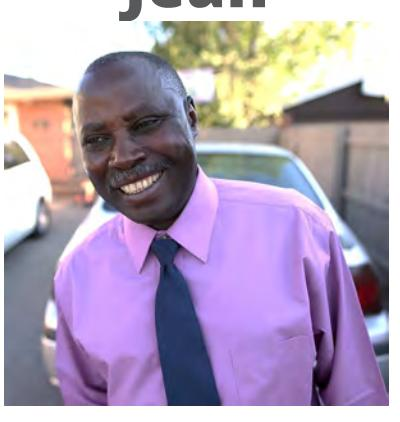

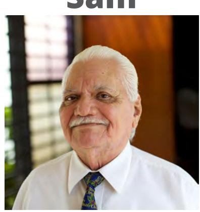

#### **10–15 minutes**

### **Activity 3: Create Your Own Conversations**

Conoce a tu grupo. Pregunta el nombre de cada alumno de tu grupo. Sé creativo. Usa todas las palabras que conozcas.

### **Part 1 Example**

A: Hi, what's your name?

B: My name is Mei. What is your name?

A: My name is Sione. Nice to meet you.

B: Nice to meet you. Goodbye.

A: Bye!

*Lesson: 1 Slide 1/2*

#### **10–15 minutes**

### **Activity 3: Create Your Own Conversations**

Busca un compañero y preséntalo a tu grupo.

### **Part 2 Example**

A: Hi, what's her name?

B: Her name is Luna. What is his

name?

A: His name is Seth.

*Lesson: 1 Slide 2/2*

# **Evaluate**

### *5–10 minutes*

Evalúa tu progreso con los objetivos y tus esfuerzos por practicar inglés a diario.

### **Evaluate Your Progress**

### *5 minutes*

### **I can:**

- *Say my name and others' names. Decir mi nombre y los nombres de los demás.*
- *Say hello and goodbye. Decir hola y adiós.*
- *Understand how EnglishConnect can help me learn English. Comprender la manera en que EnglishConnect puede ayudarme a aprender inglés.*

#### **Evaluate**

### **Evaluate Your Efforts**

### *5 minutes*

### **Evalúa tus esfuerzos por:**

- Estudiar el principio de aprendizaje.
- Memorizar el vocabulario.
- Practicar los patrones.
- Practicar a diario.

**Fija una meta: \_\_\_\_\_\_\_\_\_\_\_\_\_\_\_\_\_\_\_\_ .**

**Comparte tu meta con un compañero.**

Esfuerzo mínimo **•**

Esfuerzo moderado **•**

Esfuerzo significativo **•**

### **Act in Faith to Study English Daily**

### **Read the quote aloud with your group.**

"Cada uno de nosotros tiene un potencial divino porque cada uno es un hijo de Dios; cada uno es igual ante Su vista. Las implicaciones de esta verdad son profundas."

*(Russell M. Nelson, "Que Dios prevalezca", Liahona, noviembre de 2020, pág. 94)*

# **Oración**

### **Orar en inglés**

We thank Thee for our (*noun*).

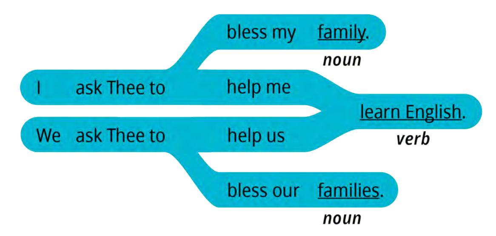

We ask Thee to help us (*verb*).

| 1  | thank Thee for | my  | 11.00      |
|----|----------------|-----|------------|
|    |                |     | blessings. |
| We | thank Thee for | our | noun       |

#### **Nouns**

- blessing
- teacher
- group
- family / families

#### **Verbs**

- learn
- speak
- teach
- bless
- press forward

# **Congratulations!**

#### **Preparing for lesson 2**

### **Greeting and Introductions**

- *Estudiar el principio de aprendizaje.*
- *Memorizar el vocabulario.*
- *Practicar los patrones.*
- *Practicar a diario.*

# English Connect

# **Derechos de autor y licencias**

EnglishConnect es un programa que proporciona La Iglesia de Jesucristo de los Santos de los Últimos Días. Todos los derechos y las licencias de los materiales de EnglishConnect son propiedad de Intellectual Reserve,•Inc., para su uso por parte de las unidades de la Iglesia, tales como estacas, distritos y misiones. Cualquier otro uso de los materiales de EnglishConnect requiere autorización previa por escrito. Para solicitar permiso a fin de usar los materiales de EnglishConnect, complete un formulario de solicitud en Permissions.ChurchofJesusChrist.org.